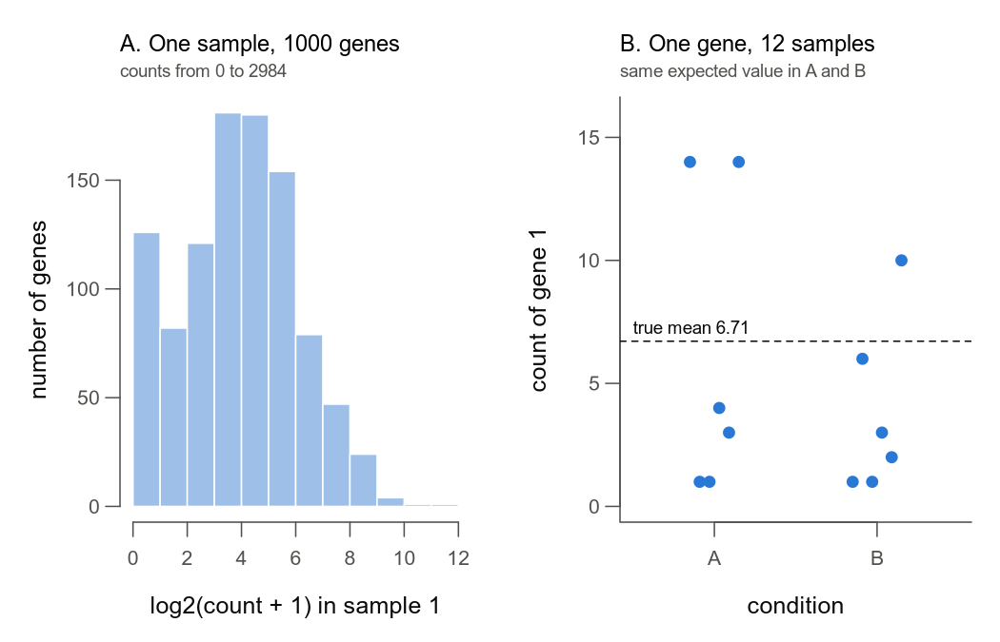
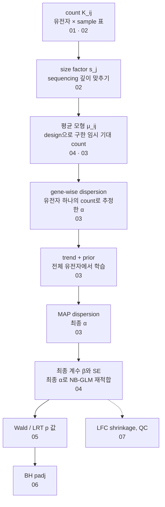

# 00. DESeq2는 count 여섯 개로 무엇을 물을까?

나는 결과표의 padj 열만 보다가, 그 숫자가 count에서 어떻게 나오는지 궁금해졌어. 이 시리즈는 교재 예제에 나오는 유전자 A의 count 여섯 개를 끝까지 따라가면서 DESeq2가 하는 일을 한 단계씩 직접 계산해 보는 공부 기록이야. 첫 노트인 여기서는 DESeq2가 정확히 무엇을 비교하는지, count가 padj가 되기까지 어떤 단계를 지나는지 지도를 먼저 그려 두고, 시리즈 전체에서 같이 쓸 예제와 용어를 정리해.

> 교재 학습 안내, 1장, 부록 C·D

## 1. 이 시리즈는 어떤 숫자를 끝까지 따라갈까?

세포를 보통 배지에서 키운 조건(Ctrl)과 glucose가 없는 배지에서 키운 조건(Starvation)을 RNA-seq으로 비교한다고 해 볼게. 조건마다 biological replicate가 셋씩 있어. sample마다 각 유전자에 배정된 read 수를 세는데, 이 수를 count라고 부르고 $K_{ij}$로 써. $i$는 유전자, $j$는 sample 번호야.

교재 1장에 나오는 두 유전자의 count는 이래.

| 유전자 | Ctrl 1 | Ctrl 2 | Ctrl 3 | Starvation 1 | Starvation 2 | Starvation 3 |
|---|---|---|---|---|---|---|
| 유전자 A | 100 | 130 | 90 | 200 | 250 | 180 |
| 유전자 B | 5 | 0 | 8 | 3 | 1 | 4 |

궁금한 건 하나야. Starvation이 유전자 A의 발현을 바꿨을까? 일단 조건별 평균과 분산부터 계산해 볼게.

```r
A <- c(100,130,90,200,250,180); B <- c(5,0,8,3,1,4)
stat <- function(x) c(mean=mean(x), var=var(x), var_over_mean=var(x)/mean(x))
cat("Gene A Ctrl  :", round(stat(A[1:3]),2), "\n")
cat("Gene A Starvation:", round(stat(A[4:6]),2), "\n")
cat("Gene B Ctrl  :", round(stat(B[1:3]),2), "\n")
cat("Gene B Starvation:", round(stat(B[4:6]),2), "\n")
cat("Gene A 관측 평균 비 (Starvation/Ctrl):", mean(A[4:6])/mean(A[1:3]), " log2:", log2(mean(A[4:6])/mean(A[1:3])), "\n")
cat("Gene B 관측 평균 비 (Starvation/Ctrl):", mean(B[4:6])/mean(B[1:3]), " log2:", log2(mean(B[4:6])/mean(B[1:3])), "\n")
```

```
Gene A Ctrl  : 106.67 433.33 4.06 
Gene A Starvation: 210 1300 6.19 
Gene B Ctrl  : 4.33 16.33 3.77 
Gene B Starvation: 2.67 2.33 0.88 
Gene A 관측 평균 비 (Starvation/Ctrl): 1.96875  log2: 0.9772799 
Gene B 관측 평균 비 (Starvation/Ctrl): 0.6153846  log2: -0.7004397 
```

결과를 보면 유전자 A의 Starvation 평균(210)이 Ctrl 평균(106.67)의 약 1.97배야(첫 두 줄과 다섯째 줄). log2로는 0.977이고. 그런데 Ctrl의 세 sample은 똑같은 조건에서 키웠는데도 count가 90에서 130까지 흔들려. 이 흔들림을 감안해도 1.97배를 우연으로 보기 어려운지 판단하는 게 DESeq2의 일이야. 평균과 분산을 여섯 개 한꺼번에 내지 않고 조건 안의 세 replicate끼리 따로 계산한 것도 그래서야.

각 줄의 셋째 숫자는 분산을 평균으로 나눈 값이야. count 데이터의 가장 단순한 모형인 Poisson 분포에서는 분산이 평균과 같아서 이 비가 1이야. 1보다 크면 Poisson이 예상하는 것보다 더 퍼졌다는 뜻이고, 이걸 과산포(overdispersion)라고 불러. 유전자 A는 4~6이고, 유전자 B의 Starvation은 0.88이야.

그래도 이 숫자만으로 과산포라고 판정할 수는 없어. 조건마다 count가 세 개뿐이라 분산 추정이 아주 불안정하거든(자유도 2). sample마다 sequencing 깊이가 다른 것도 아직 맞추지 않았고. 한 표 안에서 1보다 큰 값과 작은 값이 섞여 나온다는 것 자체가 n=3 분산이 얼마나 흔들리는지 보여 줘. 그래서 DESeq2는 sequencing 깊이를 먼저 맞추고([02](02_negative_binomial.md)), 여러 유전자의 정보를 빌려서 흔들림의 크기를 추정해([03](03_dispersion_estimation.md)).

이 시리즈는 유전자 A를 끝까지 따라가. 도착점은 아래 표야. 지금은 표 속 용어를 몰라도 괜찮아. 한 줄씩 뒤 노트에서 직접 계산하거든.

| 단계 | 유전자 A의 값 | 자세히 다루는 노트 |
|---|---|---|
| size factor | 여섯 sample 모두 1 (교재 예제의 가정) | [02](02_negative_binomial.md) |
| 기대 count $\mu$ | Ctrl 106.667, Starvation 210 | [04](04_glm_condition_batch.md) |
| gene-wise dispersion | 일반 NB MLE 0.014786, Cox-Reid 조정 0.025385 | [03](03_dispersion_estimation.md) |
| 최종 dispersion (MAP) | 0.053147 | [03](03_dispersion_estimation.md) |
| LFC와 SE (log2 단위) | 0.977280, 0.289057 | [04](04_glm_condition_batch.md) |
| Wald 검정 | $Z\approx3.3809$, $p\approx0.00072244$, nominal 95% CI $\approx[0.4107,\ 1.5438]$ | [05](05_wald_vs_lrt.md) |
| padj | 유전자 하나로는 정해지지 않아. 함께 검정한 유전자 전체의 p 값이 필요해 | [06](06_multiple_testing.md) |

MAP 값 0.053147은 교재가 학습용으로 정해 준 prior $N(\log 0.08,\ 0.7^2)$를 붙여서 얻은 값이야. 이 prior는 데이터에서 추정한 게 아니야. 실제로 `DESeq()`를 돌리면 prior를 같은 실험의 다른 유전자들에서 추정하기 때문에 MAP 값이 이와 달라질 수 있어([03](03_dispersion_estimation.md), [08](08_one_gene_end_to_end.md)).

표에서 하나만 기억하면 돼. 관측 평균비 1.97에서 p 값이 곧바로 나오지는 않아. 그 사이에 흔들림의 크기(dispersion)를 추정하고 다듬는 단계가 여럿 끼어 있어.

<details>
<summary>표의 숫자를 직접 계산한 코드</summary>

교재 16장의 R 코드(p.36)와 같은 계산이야. `optimize()`의 허용오차만 `tol=1e-10`으로 줄여서 끝자리까지 수렴시켰어.

```r
k  <- c(100,130,90,200,250,180)                   # 유전자 A, size factor 모두 1
X  <- cbind(Intercept=1, Starvation=c(0,0,0,1,1,1))
mu <- rep(c(mean(k[1:3]), mean(k[4:6])), each=3)  # 두 그룹 평균 106.667, 210
ll   <- function(th) sum(dnbinom(k, mu=mu, size=exp(-th), log=TRUE))
cr   <- function(th) { w <- mu/(1+exp(th)*mu)
  ll(th) - 0.5*as.numeric(determinant(crossprod(X, X*w))$modulus) }
post <- function(th) cr(th) - 0.5*((th - log(0.08))/0.7)^2   # 교재가 지정한 학습용 prior
opt  <- function(f) exp(optimize(f, log(c(1e-5, 2)), maximum=TRUE, tol=1e-10)$maximum)
a_mle <- opt(ll); a_cr <- opt(cr); a_map <- opt(post)
cat(sprintf("alpha: MLE %.6f | Cox-Reid %.6f | MAP %.6f (%.9f)\n", a_mle, a_cr, a_map, a_map))
w  <- mu/(1+a_map*mu)                              # 최종 alpha 로 계산한 가중치
se <- sqrt(solve(crossprod(X, X*w))[2,2]) / log(2) # 자연로그 -> log2
lfc <- log2(210/mean(k[1:3])); z <- lfc/se
cat(sprintf("LFC %.6f | SE %.6f | Z %.4f | p %.8f | 95%% CI [%.4f, %.4f]\n",
            lfc, se, z, 2*pnorm(-abs(z)), lfc-1.96*se, lfc+1.96*se))
```

```
alpha: MLE 0.014786 | Cox-Reid 0.025385 | MAP 0.053147 (0.053147342)
LFC 0.977280 | SE 0.289057 | Z 3.3809 | p 0.00072244 | 95% CI [0.4107, 1.5438]
```

같은 $\alpha$를 DESeq2에 직접 넣어도 LFC와 SE가 똑같이 나올까? 앞 블록의 `k`와 `a_map`을 이어서 써.

```r
suppressPackageStartupMessages(library(DESeq2))
cnt <- matrix(as.integer(k), nrow=1, dimnames=list("geneA", paste0("s", 1:6)))
cd  <- data.frame(condition=factor(rep(c("Ctrl","Starvation"), each=3)))
ddsA <- DESeqDataSetFromMatrix(cnt, cd, ~ condition)
sizeFactors(ddsA) <- rep(1, 6)
dispersions(ddsA) <- a_map                         # 위에서 구한 최종 alpha 를 그대로 넣는다
ddsA <- nbinomWaldTest(ddsA, quiet=TRUE)
print(signif(as.data.frame(results(ddsA))[, c("log2FoldChange","lfcSE","stat","pvalue")], 7))
```

```
      log2FoldChange     lfcSE     stat       pvalue
geneA      0.9772801 0.2890574 3.380921 0.0007224337
```

직접 계산해 보니 LFC와 SE는 소수 여섯째 자리까지 손계산과 같았어(0.977280, 0.289057). $Z$는 3.380921로 손계산 3.3809197과 소수 다섯째 자리까지 같고, p는 둘 다 0.000722야. LFC 일곱째 자리의 작은 차이는 DESeq2가 계수를 적합할 때 기본으로 거는 아주 작은 ridge 벌점(`lambda = 1e-6`, `deparse(DESeq2:::fitNbinomGLMs)` 38–39줄)에서 와. 벌점을 1e-12로 줄이면 손계산 값과 끝자리까지 같아져. 앞 블록의 `ddsA`, `k`를 이어서 써.

```r
mm <- model.matrix(~ condition, colData(ddsA))
for (lam in c(1e-6, 1e-12)) { f <- DESeq2:::fitNbinomGLMs(ddsA, modelMatrix=mm, lambda=rep(lam, 2), betaTol=1e-12)
  cat(sprintf("lambda %g: LFC %.10f\n", lam, f$betaMatrix[1, 2])) }
cat(sprintf("exact log2(210/106.667): %.10f\n", log2(210/mean(k[1:3]))))
```

```
lambda 1e-06: LFC 0.9772801341
lambda 1e-12: LFC 0.9772799235
exact log2(210/106.667): 0.9772799235
```

이 비교는 $\alpha$를 고정했을 때 이야기야. `DESeq()` 전체를 돌리면 trend와 prior를 데이터에서 추정하니까 $\alpha$부터 달라져.

</details>

교재 뒤쪽에서는 조건이 하나 더 나와. 이 시리즈에서는 Ctrl, Starvation, Starvation+Glucose의 세 조건이 되는데, 셋째 조건은 굶긴 세포에 glucose를 다시 넣어 준 것이고 노트에서는 줄여서 Glucose라고 불러. 보통 배지에 glucose를 더 넣은 조건이 아니라는 점에 주의해. DESeq2에서는 count의 차이를 어떤 요인(조건, donor, batch 등)으로 설명할지 R 식으로 적는데, 이걸 design이라고 해. 같은 donor에서 세 조건을 모두 얻었다고 가정할 때만 design을 `~ pair + condition`으로 써. donor끼리 짝지어 비교하는 이 paired design은 [04](04_glm_condition_batch.md), 세 그룹 비교는 [05](05_wald_vs_lrt.md), Glucose가 starvation의 효과를 되돌리는지(rescue) 판정하는 기준은 [06](06_multiple_testing.md)에서 다뤄. 교재의 예는 모두 설명용이고, 실제 실험 데이터를 분석한 건 아니야.

## 2. DESeq2는 무엇을 비교할까?

관측 평균비 1.97은 이번 여섯 sample을 요약한 값일 뿐이야. 같은 실험을 다시 하면 다른 값이 나오겠지. DESeq2가 비교하는 건 이 관측 평균이 아니라, 각 조건에서 모형이 예상하는 평균 count야. 이걸 기대 count $\mu_{ij}$라고 불러. 기대 count는 직접 볼 수 없어서 데이터로 추정해야 하는 미지수야.

그래서 검정이 묻는 질문도 달라져. "두 조건의 관측 평균이 똑같은가?"가 아니야. sample을 뽑을 때 생기는 우연과 개체 사이의 생물학적 차이를 고려했을 때, 두 조건의 기대 발현량이 같다는 모형이 지금 관측값과 얼마나 양립하는지, 즉 그 모형 아래서 이런 관측값이 나올 법한지를 묻는 거야.

교재 1.2는 한 유전자에 대해 네 가지 양을 구별해.

| 양 | 기호 | 뜻 | 유전자 A |
|---|---|---|---|
| 관측 count | $K_{ij}$ | 실제로 읽힌 count. 데이터야 | 100, 130, 90, 200, 250, 180 |
| 기대 count | $\mu_{ij}$ | sample $j$에서 모형이 예상하는 평균 count. 추정 대상이야 | Ctrl 106.667, Starvation 210 |
| 효과 (LFC) | $\beta$ | 두 조건의 보정된 기대 발현량 비를 log2로 나타낸 값. 추정치는 $\hat\beta$로 써 | 0.977280 |
| 불확실성 | $SE(\hat\beta)$ | 같은 실험을 반복하면 $\hat\beta$가 얼마나 흔들릴지 | 0.289057 |

LFC(log2 fold change)가 1이면 2배, −1이면 절반이야. 그런데 LFC가 같은 두 유전자라도 얼마나 믿을 만한지는 다를 수 있어. 예를 들어 한쪽의 SE가 0.1이고 다른 쪽이 1.0이면, 효과 크기는 같아도 데이터가 주는 증거는 크게 달라. Wald 검정은 이 둘의 비를 봐.

$$Z=\frac{\hat\beta-\beta_0}{SE(\hat\beta)},\qquad p=2\,\Phi(-|Z|)$$

여기서 $\hat\beta$는 데이터로 추정한 LFC, $\beta_0$는 귀무가설이 말하는 값("차이가 없다"면 0), $SE(\hat\beta)$는 $\hat\beta$의 표준오차야. $\Phi$는 표준정규분포의 누적분포함수라서 $2\Phi(-|Z|)$가 양쪽 꼬리 확률이 돼.

유전자 A를 넣으면 $Z=(0.977280-0)/0.289057\approx3.38$이야. 추정치가 0에서 표준오차의 약 3.4배만큼 떨어져 있다는 뜻이지.

```r
wald <- function(lfc, se) { z <- lfc/se
  sprintf("LFC=%.3f SE=%.3f : Z=%.2f  p=%.3g  95%%CI=[%.2f, %.2f]", lfc, se, z, 2*pnorm(-abs(z)), lfc-1.96*se, lfc+1.96*se) }
cat(wald(1, 0.1), wald(1, 1.0), wald(0.977280, 0.289057), sep="\n")
```

```
LFC=1.000 SE=0.100 : Z=10.00  p=1.52e-23  95%CI=[0.80, 1.20]
LFC=1.000 SE=1.000 : Z=1.00  p=0.317  95%CI=[-0.96, 2.96]
LFC=0.977 SE=0.289 : Z=3.38  p=0.000722  95%CI=[0.41, 1.54]
```

95%CI는 LFC ± 1.96×SE로 계산한 신뢰구간이야. 여러 유전자를 함께 본 보정을 하지 않은 구간이라서 nominal이라고 불러.

위 두 줄을 비교해 보면, LFC가 똑같이 1인데도 p 값은 $10^{-23}$ 수준과 0.32로 갈리고 둘째 줄의 95% 신뢰구간은 0을 넉넉히 포함해. 셋째 줄이 유전자 A야. LFC만 보고 유의성을 말할 수 없는 이유가 여기 있어. SE가 어디서 나오는지는 [04](04_glm_condition_batch.md), 검정의 종류는 [05](05_wald_vs_lrt.md)에서 다뤄.

## 3. 모형은 표의 어느 방향으로 세울까?

count matrix는 행이 유전자, 열이 sample인 표야. 이 표는 두 방향으로 읽을 수 있어. 열 하나를 읽으면 한 sample 안의 모든 유전자가, 행 하나를 읽으면 한 유전자의 모든 sample이 나오지.

DESeq2의 모형은 행 방향이야. 유전자 A의 여섯 count로 유전자 A의 모형을 세우고, 유전자 B에는 따로 모형을 세워. 나도 처음엔 sample 하나에 든 모든 유전자의 histogram이 음이항분포처럼 생겨야 하는 줄 알았는데, 교재 1.1은 이 말이 틀렸다고 짚어. 유전자마다 발현 수준이 다르니, 그 histogram은 평균이 제각각인 수많은 분포가 섞인 모양이 될 수밖에 없거든.

시뮬레이션으로 두 방향을 비교해 볼게. `makeExampleDESeqDataSet()`은 DESeq2에 들어 있는 예제 데이터 생성 함수야. 기본값으로 유전자 1000개, sample 12개(조건 A, B 각 6개)를 만들고, 이때 참 조건 효과는 모든 유전자에서 0, 참 size factor도 모두 1이야. 여기서 A, B는 유전자 A, B가 아니라 시뮬레이션의 조건 이름이야.

```r
suppressPackageStartupMessages(library(DESeq2))
set.seed(1); dds <- makeExampleDESeqDataSet(n=1000, m=12); k <- counts(dds)
summary(k[,1])
cat("sample 1: mean =", round(mean(k[,1]),1), " var =", round(var(k[,1]),0), " var/mean =", round(var(k[,1])/mean(k[,1]),1), "\n")
for (g in c("A","B")) { x <- k[1, dds$condition == g]
  cat("gene 1, condition", g, ":", x, "-> mean =", round(mean(x),2), " var =", round(var(x),2), "\n") }
mu1 <- 2^mcols(dds)$trueIntercept[1]; a1 <- mcols(dds)$trueDisp[1]
cat("gene 1 참값: mu =", round(mu1,2), "(두 조건 공통)  alpha =", round(a1,3), "  mu + alpha*mu^2 =", round(mu1 + a1*mu1^2,2), "\n")
range(mcols(dds)$trueIntercept)
range(mcols(dds)$trueBeta)
```

```
   Min. 1st Qu.  Median    Mean 3rd Qu.    Max. 
   0.00    5.00   15.00   44.69   39.00 2984.00 
sample 1: mean = 44.7  var = 15968  var/mean = 357.3 
gene 1, condition A : 14 1 1 4 3 14 -> mean = 6.17  var = 38.17 
gene 1, condition B : 1 6 1 3 2 10 -> mean = 3.83  var = 12.57 
gene 1 참값: mu = 6.71 (두 조건 공통)  alpha = 0.696   mu + alpha*mu^2 = 38.08 
[1] -2.016097 11.620553
[1] 0 0
```

`sample 1:` 줄과 `gene 1, condition` 두 줄을 비교해 봐. sample 1의 count는 0부터 2984까지 퍼져 있고 분산/평균이 357이야. 반면 gene 1은 한 조건 안에서 평균 4~6 근처를 오르내려. 마지막 두 줄은 시뮬레이션의 참값이야. 유전자별 기본 발현 수준(`trueIntercept`, log2 단위)은 −2에서 11.6까지 넓게 퍼져 있고, 참 조건 효과(`trueBeta`)는 모든 유전자에서 0이야.



왼쪽은 sample 1 한 열의 count 1000개를 log2(count + 1)로 그린 histogram이야. 유전자마다 기본 발현 수준(log2로 −2에서 11.6)이 달라서 넓게 퍼지지. 오른쪽은 gene 1 한 행의 count 12개인데, 모두 같은 기대값 6.71 주변에서 흔들려.

<details>
<summary>그림을 그린 코드</summary>

```r
suppressPackageStartupMessages(library(DESeq2))
set.seed(1); dds <- makeExampleDESeqDataSet(n=1000, m=12); k <- counts(dds)
out <- "../figures/00_two_directions.png"
png(out, width=7, height=4.5, units="in", res=150, bg="white")
par(mfrow=c(1,2), mar=c(4.2,4.2,3.4,1), mgp=c(2.4,0.7,0), las=1, bty="l",
    col.axis="#52514e", col.lab="#0b0b0b", fg="#52514e", cex.axis=0.85)
# (A) 한 sample 의 모든 유전자: 열 방향
hist(log2(k[,1] + 1), breaks=0:12, col="#9dbfe8", border="white",
     main="", xlab="log2(count + 1) in sample 1", ylab="number of genes")
title("A. One sample, 1000 genes", adj=0, line=1.6, cex.main=0.95, font.main=1)
mtext("counts from 0 to 2984", side=3, line=0.5, adj=0, cex=0.75, col="#52514e")
# (B) 한 유전자의 모든 sample: 행 방향
x <- k[1, ]; grp <- as.integer(dds$condition)
jit <- seq(-0.15, 0.15, length.out=6)[ave(grp, grp, FUN=seq_along)]
plot(grp + jit, x, xlim=c(0.5, 2.5), ylim=c(0, 16), xaxt="n", pch=19, col="#2a78d6",
     xlab="condition", ylab="count of gene 1")
axis(1, at=1:2, labels=levels(dds$condition))
mu1 <- 2^mcols(dds)$trueIntercept[1]
abline(h=mu1, lty=2, col="#0b0b0b")
text(0.5, mu1 + 0.3, sprintf("true mean %.2f", mu1), adj=c(0, 0), cex=0.75, col="#0b0b0b")
title("B. One gene, 12 samples", adj=0, line=1.6, cex.main=0.95, font.main=1)
mtext("same expected value in A and B", side=3, line=0.5, adj=0, cex=0.75, col="#52514e")
invisible(dev.off())
cat(out, file.exists(out), file.size(out), "bytes\n")
```

```
../figures/00_two_directions.png TRUE 43641 bytes
```

</details>

왼쪽 histogram은 모형이 설명하려는 대상이 아니야. 모형은 오른쪽처럼 한 행의 각 count $K_{ij}$가 자기 기대값 $\mu_{ij}$와 그 유전자 공통의 dispersion $\alpha_i$를 가진 음이항분포를 따른다고 가정해. 음이항분포는 과산포를 허용하는 count 분포이고, dispersion은 그 퍼짐의 정도를 정하는 값이야(둘 다 4절에서 식으로 적어). 보통 $\mu_{ij}$는 조건과 size factor에 따라 sample마다 달라. 그래서 한 행의 12개를 한 분포로 뭉쳐 평균과 분산을 내면, 왼쪽 histogram에서 피하려던 실수(평균이 다른 값을 섞기)를 되풀이하게 돼. 위 코드가 gene 1의 평균과 분산을 조건별로 따로 낸 것도 그래서야.

이 시뮬레이션은 조건 효과가 0이고 참 size factor가 1이라서 gene 1의 기대값이 12개 sample 모두 6.71로 같아. 이런 경우에만 한 행 전체가 같은 분포에서 나온 표본이 돼. 두 조건의 표본분산 38.17과 12.57은 같은 이론 분산 $\mu+\alpha\mu^2=38.08$에서 나온 n=6 표본의 값이야. 그런데도 이만큼 다르다는 건, n=6에서도 분산 추정이 크게 흔들린다는 뜻이야.

행 방향으로 보는 흔들림은 같은 조건의 biological replicate 사이의 흔들림이야. biological replicate는 서로 다른 donor처럼 생물학적으로 따로 얻은 sample을 말해(교재 1.3). 같은 라이브러리를 여러 sequencing lane에서 읽는다고 biological replicate가 늘지는 않아. 그건 technical replicate야. 같은 생물학적 sample에서 나온 technical count는 상황에 맞게 합산해도 되지만, 거꾸로 서로 다른 biological sample을 technical replicate처럼 합치면 안 돼.

single-cell 데이터도 마찬가지야. 같은 donor의 세포 수천 개를 donor 수천 명처럼 다루면 안 되거든. donor 수준의 조건 차이가 궁금하다면, cell type별로 donor×condition 단위로 count를 합친 pseudobulk가 이해하기 쉬운 출발점이야. 세포를 합쳐도 독립적인 donor 수는 늘지 않아.

다음 절에서 정의할 dispersion $\alpha_i$가 재는 게 바로 이 biological replicate 사이의 흔들림이야. 여기부터는 교재 1.3에 없는, 내가 덧붙이는 설명이야. lane이나 세포 같은 단위를 biological replicate처럼 세면(pseudoreplication) $\alpha_i$가 작게 추정돼. 그러면 SE가 작아지고 p 값이 실제보다 낙관적으로 나와. 서로 다른 biological sample을 합산하는 반대 방향의 실수는 독립 반복 수를 잃는 문제고.

## 4. 모형을 식으로 쓰면 어떻게 될까?

유전자 A의 Ctrl 기대 count가 106.667이라고 해 봐. Poisson 분포라면 분산도 106.667이야. 하지만 biological replicate 사이의 count는 보통 이보다 더 퍼져(과산포). 과산포를 허용하는 count 분포가 음이항분포(negative binomial, NB)이고, DESeq2는 이 분포를 써.

$$K_{ij}\sim NB(\mu_{ij},\ \alpha_i),\qquad \mathrm{Var}(K_{ij})=\mu_{ij}+\alpha_i\,\mu_{ij}^2$$

$K_{ij}$는 유전자 $i$, sample $j$의 count이고 $\mu_{ij}$는 그 기대값이야. $\alpha_i$는 유전자 $i$의 dispersion으로, Poisson을 넘어 추가로 퍼지는 정도를 나타내. $\alpha_i=0$이면 분산이 $\mu_{ij}$가 되어 Poisson과 같아지지. dispersion이 분산 자체는 아니라는 점을 기억해 둬.

유전자 A의 Ctrl에 최종 $\alpha=0.053147$을 넣으면 분산은 $106.667+0.053147\times106.667^2\approx106.7+604.7=711.4$야. Poisson이 예상하는 106.7의 약 6.7배지. Starvation($\mu=210$)에서는 $210+0.053147\times210^2\approx2553.8$이야.

기대 count는 다시 두 부분으로 나눌 수 있어.

$$\mu_{ij}=s_j\,q_{ij},\qquad \log q_{ij}=x_j^{T} b_i$$

- $s_j$: sample $j$의 size factor야. sample마다 sequencing 깊이가 다른 걸 맞추는 배율이고, 정규화 count는 count를 size factor로 나눈 값이야([02](02_negative_binomial.md)).
- $q_{ij}$: 깊이 차이를 걷어 낸 기대 발현량.
- $x_j$: design matrix $X$의 $j$번째 행. design matrix(설계행렬)는 각 sample이 어떤 조건·batch·pair에 속하는지 숫자로 적은 표야.
- $b_i$: 유전자 $i$의 계수(자연로그 단위).
- $x_j^{T} b_i$: $x_j$와 $b_i$의 원소끼리 곱해서 더한 값.

이렇게 count의 평균을 log scale에서 조건·batch 등의 합으로 적는 모형을 GLM(일반화 선형모형)이라고 해([04](04_glm_condition_batch.md)).

유전자 A에 직접 대입해 볼게. size factor는 모두 1이야. Ctrl sample의 $x_j$는 $(1,0)$, Starvation sample은 $(1,1)$이라서 $\log q_{\text{Ctrl}}=b_0$, $\log q_{\text{Starvation}}=b_0+b_1$이 돼. 여기서 $b_0=\ln106.667\approx4.66971$, $b_1=\ln(210/106.667)\approx0.677399$야.

DESeq2가 결과표에 보고하는 LFC는 이 $b_1$을 log2 단위로 바꾼 값이야.

$$\beta=\frac{b}{\ln 2}$$

$0.677399/0.693147\approx0.977280$으로, 1절 표의 LFC와 같아. DESeq2는 내부 계산을 자연로그 단위 $b$로 하고, `mcols(dds)`와 `results()`에는 log2 단위 $\beta$로 저장해. 소스 근거는 "더 깊이 보기"의 (7)에 있어.

유전자 A에서 $\hat\beta$가 관측 평균비의 log2와 같아진 건 size factor가 모두 1이고 design에 조건만 있기 때문이야. size factor가 sample마다 다르면 둘은 달라져. 아래는 같은 count에 size factor만 바꿔 본 결과야.

<details>
<summary>size factor가 다르면 LFC와 관측 평균비가 어떻게 달라질까</summary>

1절 "표의 숫자를 직접 계산한 코드"의 `ddsA`($\alpha$=0.053147342로 고정)를 이어서 써. size factor 값은 설명하려고 임의로 정했어.

```r
kA <- counts(ddsA)[1, ]; sf <- c(0.8, 1, 1.2, 0.9, 1.1, 1.0)
d2 <- ddsA; sizeFactors(d2) <- sf; d2 <- nbinomWaldTest(d2, quiet=TRUE)
nk <- kA/sf
cat(sprintf("sf 다름: DESeq2 LFC %.6f | log2(정규화 평균비) %.6f | log2(raw 평균비) %.6f\n",
  results(d2)$log2FoldChange, log2(mean(nk[4:6])/mean(nk[1:3])), log2(mean(kA[4:6])/mean(kA[1:3]))))
```

```
sf 다름: DESeq2 LFC 0.937958 | log2(정규화 평균비) 0.931729 | log2(raw 평균비) 0.977280
```

DESeq2의 LFC는 raw count 평균비와도, 정규화 count 평균비와도 달라. NB likelihood가 count마다 다른 가중을 주기 때문이야([04](04_glm_condition_batch.md)).

</details>

## 5. count에서 padj까지 어떤 단계를 지날까?

유전자 A의 1.97배에서 $p\approx0.00072$까지 가려면 아래 단계를 차례로 지나. 상자 안 숫자는 그 단계를 자세히 설명하는 노트 번호야.



[08](08_one_gene_end_to_end.md)에서는 유전자 A 하나로 이 길 전체를 손계산과 DESeq2로 따라가. 단계마다 처음 나오는 용어를 짧게 풀어 보면 이래.

1. count: 입력이야. count가 왜 Poisson이 아니라 NB를 따르는지는 [01](01_poisson_simulation.md)과 [02](02_negative_binomial.md)에서 봐.
2. size factor: sample마다 하나씩, 전체 유전자를 함께 보고 정해.
3. 평균 모형: design에 따라 각 sample의 기대 count를 임시로 구해. dispersion을 추정하려면 "어디를 중심으로 흔들리는가"를 먼저 알아야 하거든.
4. gene-wise dispersion: 유전자 하나의 count만으로 $\alpha$를 추정해. 여기서 likelihood(가능도)가 등장하는데, 관측값을 고정해 두고 parameter 후보가 그 관측값을 얼마나 그럴듯하게 만드는지 나타내는 값이야. likelihood가 가장 큰 값이 MLE(최대가능도추정)야. 그런데 평균을 같은 데이터로 추정했기 때문에 MLE는 $\alpha$를 작게 잡는 경향이 있어. 이걸 줄여 주는 보정항이 Cox-Reid 보정이고, 유전자 A에서는 0.014786이 0.025385가 돼.
5. trend + prior: trend는 평균 발현량에 따라 dispersion이 대체로 어디쯤 있는지를 나타내는 곡선이야. prior(사전분포)는 데이터를 보기 전에 $\alpha$가 어디쯤 있을지에 대한 분포고. DESeq2는 이걸 전체 유전자에서 추정하는데, 이런 방식을 empirical Bayes라고 해.
6. MAP dispersion: MAP(사후최빈값)는 likelihood와 prior를 함께 고려했을 때 가장 그럴듯한 값이야. 정보가 적은 gene-wise 값이 trend 쪽으로 당겨지는데, 이걸 shrinkage(수축)라고 해. 유전자 A에서는 학습용 prior 때문에 0.025385가 0.053147로 올라가.
7. 최종 계수와 SE: 최종 $\alpha$로 NB-GLM을 다시 적합해서 $\hat\beta$와 SE를 얻어. 계수는 IRLS(반복 가중 최소제곱)라는 반복 계산으로 찾아.
8. Wald / LRT p 값: Wald 검정은 (추정치 − 0) / SE를 표준정규분포와 비교해. LRT(가능도비 검정)는 계수를 뺀 모형과 넣은 모형의 likelihood 차이로 여러 계수를 한꺼번에 검정하고. 어떤 두 조건을 비교할지는 contrast라는 벡터로 정해.
9. BH padj: 유전자 수천 개를 한꺼번에 검정하니까 p 값을 보정해야 해. BH(Benjamini–Hochberg) 보정은 FDR, 즉 발견 목록 가운데 거짓 발견 비율의 기대값을 조절해.

교재 1.4는 이 길에서 정보가 흐르는 방향을 이렇게 요약해. "유전자별 모델은 sample 방향으로 적합한다. 전체 유전자 정보는 주로 정규화와 empirical Bayes 추정에서 빌려온다. 이 두 방향을 혼동하지 않는 것이 출발점이다." 양마다 나눠 보면 이래.

| 양 | 정하는 방향 |
|---|---|
| size factor $s_j$ | 모든 유전자를 함께 보고 sample마다 하나씩 정해. 정규화에서 빌리는 것은 size factor의 기준(reference)이야 |
| dispersion의 trend와 prior | 모든 유전자를 함께 보고 정해 (empirical Bayes) |
| 계수 $b_i$ | $s_j$와 $\alpha_i$가 정해진 뒤 유전자 $i$의 count만으로 정해 (LFC에 prior를 걸지 않는 기본 설정 `betaPrior=FALSE`일 때). 다만 $s_j$와 $\alpha_i$에 이미 다른 유전자의 정보가 들어 있어 |
| dispersion $\alpha_i$ | 두 방향을 합쳐. gene-wise 값은 유전자 $i$의 count만으로, 최종 MAP 값은 거기에 전체 유전자에서 얻은 prior를 결합해 정해 |

### `DESeq()` 한 줄 안에서 일어나는 일

실제로 `DESeq(dds)` 한 줄을 실행하면 위 단계가 함수 다섯 개로 나뉘어 돌아가. 함수를 하나씩 직접 불러서, 각 함수가 `dds`에 무엇을 새로 남기는지 찍어 볼게. `mcols(dds)`는 유전자마다 한 행인 결과 표이고, assay는 유전자×sample 크기의 행렬이야.

```r
suppressPackageStartupMessages(library(DESeq2))
set.seed(1); dds <- makeExampleDESeqDataSet()   # 유전자 1000개, sample 12개 (조건 A, B 각 6)
steps <- c(estimateSizeFactors = estimateSizeFactors,
           estimateDispersionsGeneEst = estimateDispersionsGeneEst,
           estimateDispersionsFit = estimateDispersionsFit,
           estimateDispersionsMAP = estimateDispersionsMAP,
           nbinomWaldTest = nbinomWaldTest)
x <- dds
for (s in names(steps)) {
  y <- steps[[s]](x)
  cat(sprintf("%-26s | 새 assay: %-8s | 새 mcols 열: %s\n", s,
      paste(setdiff(assayNames(y), assayNames(x)), collapse=","),
      paste(setdiff(colnames(mcols(y)), colnames(mcols(x))), collapse=", ")))
  x <- y
}
cat("size factor (처음 3개):", round(sizeFactors(x)[1:3], 3), "\n")
```

```
estimateSizeFactors        | 새 assay:          | 새 mcols 열: 
estimateDispersionsGeneEst | 새 assay: mu       | 새 mcols 열: baseMean, baseVar, allZero, dispGeneEst, dispGeneIter
estimateDispersionsFit     | 새 assay:          | 새 mcols 열: dispFit
estimateDispersionsMAP     | 새 assay:          | 새 mcols 열: dispersion, dispIter, dispOutlier, dispMAP
nbinomWaldTest             | 새 assay: H,cooks  | 새 mcols 열: Intercept, condition_B_vs_A, SE_Intercept, SE_condition_B_vs_A, WaldStatistic_Intercept, WaldStatistic_condition_B_vs_A, WaldPvalue_Intercept, WaldPvalue_condition_B_vs_A, betaConv, betaIter, deviance, maxCooks
size factor (처음 3개): 1.088 1.044 1.014 
```

결과를 보면 dispersion이 세 함수(GeneEst, Fit, MAP)로 나뉘어 있고, 함수마다 자기 열을 남겨. size factor는 `mcols`가 아니라 `sizeFactors(dds)`에 들어가. `DESeq(dds)`도 이 다섯 함수를 같은 순서로 불러. 다만 sample이 7개 이상인 조건(design cell)이 있으면, outlier count를 교체하고 다시 적합하는 단계가 하나 더 붙을 수 있어. `DESeq(dds)`의 결과 열 이름이 이 단계별 실행과 같은지 확인한 결과와 소스 발췌는 "더 깊이 보기"의 (1)–(3)에 있어.

교재 1.4의 지도에 `dds`에 남는 흔적과 노트 번호를 붙이면 이렇게 돼.

| 단계 | 교재의 질문 | 주요 산출물 (교재) | `dds`에 남는 흔적 | 노트 |
|---|---|---|---|---|
| 입력과 설계 | 무엇을 비교하며 독립 반복은 무엇인가? | count matrix, metadata, design | `counts` assay, `colData`, `design(dds)` | 00, 04 |
| 정규화 | sample별 측정 규모가 얼마나 다른가? | size factor 또는 normalization factor | `sizeFactors(dds)` 또는 `normalizationFactors(dds)` | 02, 04 |
| 평균 모형 | 조건·donor·batch가 기대 count를 어떻게 바꾸는가? | design matrix, 임시 fitted mean | `mu` assay | 04 |
| dispersion 추정 | 설명된 평균 주변에서 얼마나 흔들리는가? | gene-wise, trend, MAP/final dispersion | `dispGeneEst`, `dispFit`, `dispMAP`, `dispersion`, `dispOutlier` | 03 |
| 계수 추정 | 보정된 조건 차이는 얼마인가? | β, covariance, SE | `condition_B_vs_A`, `SE_condition_B_vs_A`, `betaConv` | 04 |
| 검정과 보정 | 차이가 있다는 증거가 충분한가? | Wald/LRT p 값, BH padj | `WaldStatistic_*`, `WaldPvalue_*`, `results()`의 `pvalue`, `padj` | 05, 06 |
| 해석 | 크기·방향·재현성·생물학적 의미는 무엇인가? | 효과 추정, 진단, 후속 검증 | `cooks` assay, `maxCooks`, `lfcShrink()` | 07, 08 |

표에서 헷갈리기 쉬운 곳이 몇 군데 있어. `dispersion`(최종 값)과 `dispMAP`은 서로 다른 열이고, 두 값이 다른 유전자가 dispersion outlier야. 계수와 SE는 저장되지만 covariance 행렬은 저장되지 않아. 교재의 "β, covariance, SE" 가운데 covariance는 필요할 때 내부에서 다시 계산하거든. 그리고 계수 열의 설명이 "log2 fold change (MLE)"인 데서 알 수 있듯이, 저장된 값은 log2 단위 $\beta$이지 자연로그 단위 $b$가 아니야.

교재와 이 시리즈는 `fitType="parametric"`, `test="Wald"`, `betaPrior=FALSE` 흐름을 따라. 셋 다 DESeq2 1.50.2의 기본값이야. `results()`의 기본값은 `alpha=0.1`, `pAdjustMethod="BH"`, `independentFiltering=TRUE`고.

### 지도를 그릴 때 흔히 틀리는 네 곳

교재 학습 안내(p.3)는 흔히 잘못 설명되는 네 가지를 먼저 바로잡고 시작해. 넷 다 DESeq2 소스에서 근거를 찾았고, 실행으로 확인하지 못한 부분은 해당 항목에 적어 뒀어.

1. "dispersion 후보마다 평균을 다시 추정한다." 개념 설명으로는 맞지만 기본 구현은 달라. 평균을 먼저 정해 고정해 두고, 그 상태에서 Cox-Reid 조정 목적함수(가장 크게 만들려는 likelihood 식)를 $\alpha$에 대해서만 최적화해. 평균과 dispersion을 번갈아 고치는 바깥 반복이 있긴 하지만 기본 횟수는 1회(`niter=1`)야. 고정할 평균을 정하는 방법은 design에 따라 달라. `~ condition`처럼 조건 그룹만 있는 design이면 $\alpha$와 무관한 그룹 평균을 쓰고, `~ batch + condition`처럼 조건과 batch를 더한 design이나 weights를 쓰면 초기 $\alpha$로 적합한 NB-GLM 평균을 써. 근거는 (4), 자세한 내용은 [03](03_dispersion_estimation.md)에 있어.
2. "최종 dispersion은 항상 MAP이다." 그렇지 않아. gene-wise 값이 trend보다 기준 이상 높은 dispersion outlier는 gene-wise 값을 그대로 써. 근거는 (5)야.
3. "모든 LFC shrinkage는 MAP이다." 이것도 아니야. `lfcShrink()`의 `normal`과 `apeglm`은 posterior mode(MAP)를, `ashr`는 posterior mean(사후분포의 평균)을 돌려줘. 이 노트를 돌린 환경에는 apeglm과 ashr가 없어서 소스로만 확인했어. 근거는 (5), 자세한 내용은 [07](07_lfc_shrinkage_and_qc.md)에 있어.
4. "계획된 비교이니 여러 비교를 합친 결론의 오류율도 자동으로 제어된다." 아니야. `results()`는 호출(contrast)마다 따로 BH 보정을 해. 기본 가족은 그 contrast에서 p 값이 있고 independent filtering을 통과한 유전자야. independent filtering은 평균 count가 너무 낮은 유전자를 BH 보정 전에 빼는 단계야. 그래서 두 유의 목록의 교집합을 만드는 것만으로는 "rescue 목록 FDR 5%"가 보장되지 않아. BH 가족에 관한 부분은 (6)에서 실행으로 확인했고, 교집합에 관한 통계적 설명은 [06](06_multiple_testing.md)에 있어.

## 6. 이 시리즈의 용어는 어디서 자세히 나올까?

모든 노트가 같은 뜻, 같은 표기로 쓰는 용어야. 오른쪽 열은 그 용어를 처음 자세히 다루는 노트야. 기호는 교재 부록 C를 따르고, 원래 표와 부록 C에 없어서 이 시리즈가 따로 정한 기호는 "더 깊이 보기"의 "부록 C" 블록에 모아 뒀어.

| 용어 | 한 줄 설명 | 처음 자세히 나오는 노트 |
|---|---|---|
| count $K_{ij}$ | 한 sample에서 한 유전자에 배정된 read(또는 fragment) 수 | 00 |
| 기대 count $\mu_{ij}$ | 모형이 그 sample에서 예상하는 평균 count | 00, 04 |
| biological replicate | 생물학적으로 따로 얻은 sample. 같은 라이브러리를 여러 lane에서 읽은 것은 해당하지 않아 | 00 |
| size factor $s_j$ | sample마다 sequencing 깊이가 다른 것을 맞추는 배율. 정규화 count = count / size factor | 02 |
| 과산포 (overdispersion) | 같은 조건 replicate 사이의 퍼짐이 Poisson이 예상하는 것보다 큰 현상 | 01 |
| dispersion $\alpha$ | 분산 = $\mu+\alpha\mu^2$에서 추가로 퍼지는 정도. $\alpha=0$이면 Poisson과 같아. 분산 자체는 아니야 | 02 |
| 음이항분포 (NB) | 과산포를 허용하는 count 분포 | 02 |
| likelihood (가능도) | 관측값을 고정해 두고, parameter 후보가 그 관측값을 얼마나 그럴듯하게 만드는지 나타내는 값 | 03 |
| MLE (최대가능도추정) | likelihood가 가장 큰 parameter 값 | 03 |
| Cox-Reid 보정 | 평균을 같은 데이터로 추정해서 생기는 dispersion 과소추정을 줄이는 보정항 | 03 |
| trend | 평균 발현량에 따라 dispersion이 대체로 어디쯤 있는지를 나타내는 곡선 | 03 |
| prior (사전분포) | 데이터를 보기 전에 parameter가 어디쯤 있을지에 대한 분포. DESeq2는 이걸 전체 유전자에서 추정해 | 03 |
| empirical Bayes | prior를 같은 실험의 전체 유전자에서 추정해 쓰는 방식 | 03 |
| MAP (사후최빈값) | likelihood와 prior를 함께 고려했을 때 가장 그럴듯한 값 | 03 |
| shrinkage (수축) | 정보가 적은 추정치를 전체 경향 쪽으로 당기는 것. dispersion은 03, LFC는 07 | 03, 07 |
| GLM (일반화 선형모형) | count의 평균을 log scale에서 조건·batch 등의 합으로 표현하는 모형 | 04 |
| design matrix $X$ | 각 sample이 어떤 조건·batch·pair에 속하는지 숫자로 적은 표 | 04 |
| 계수 $b$ / $\beta$ | 자연로그 단위 $b$, log2 단위 $\beta$ ($\beta=b/\ln 2$) | 04 |
| LFC (log2 fold change) | 두 조건 평균 비의 log2. 1이면 2배, −1이면 절반 | 00, 04 |
| SE (표준오차) | 같은 실험을 반복하면 추정치가 얼마나 흔들릴지를 나타내는 값 | 04 |
| IRLS | 계수를 찾는 반복 가중 최소제곱 계산 | 04 |
| contrast | 어떤 두 조건(또는 계수 조합)을 비교할지 정하는 벡터 | 04, 05 |
| Wald 검정 | (추정치 − 0) / SE를 표준정규분포와 비교하는 검정 | 05 |
| LRT (가능도비 검정) | 계수를 뺀 모형과 넣은 모형의 likelihood 차이로 여러 계수를 한꺼번에 검정 | 05 |
| p 값 | 귀무가설이 맞을 때 지금만큼 또는 더 극단적인 통계량이 나올 확률 | 05 |
| padj (보정 p 값) | 여러 유전자를 함께 검정한 것을 반영해 보정한 p 값 | 06 |
| FDR | 발견 목록 가운데 거짓 발견 비율의 기대값 | 06 |
| BH (Benjamini–Hochberg 보정) | FDR을 조절하는 p 값 보정. `results()`의 기본 방법 | 06 |

## 정리

- DESeq2가 비교하는 건 관측 평균이 아니라 기대 count $\mu$야. 유전자 A의 관측 평균비 1.97(log2 0.977)은 데이터를 요약한 값일 뿐이야.
- 모형은 유전자 하나를 붙잡고 sample 방향으로 세워. 흔들림도 같은 조건의 biological replicate 사이에서 재기 때문에, lane이나 세포를 replicate로 세면 $\alpha$가 작게 잡히고 p 값이 낙관적이 돼.
- 분산은 $\mu+\alpha\mu^2$라서 $\alpha=0$이면 Poisson과 같아. 증거의 세기는 LFC가 아니라 LFC/SE로 봐. 유전자 A는 $0.977280/0.289057\approx3.38$이야.
- `DESeq()`은 size factor → dispersion(gene-wise → trend → MAP) → 계수와 Wald 검정 → (조건에 따라) outlier refit 순서로 돌고, 단계마다 `dds`에 열을 남겨. padj는 유전자 하나가 아니라 함께 검정한 유전자 가족 위에서 정해져.

## 연습문제

교재 부록 A의 문제 1, 2야.

> **문제 1.** 한 sample 의 모든 유전자 count histogram 이 정규분포처럼 보이지 않는다. 이것이 DESeq2 를 사용할 수 없는 직접적인 이유인가? DESeq2 가 분포를 가정하는 방향을 설명하라.

<details>
<summary>풀이</summary>

교재의 답(B.1)은 이래. "아니다. 유전자 하나를 고정하고 biological sample 방향으로 count 를 모델링한다. sample 하나의 유전자 간 histogram 은 그 NB 가정의 대상이 아니다."

3절 시뮬레이션에서 봤듯이, sample 1의 1000개 유전자 count는 0부터 2984까지 걸친, 분산/평균 357의 혼합 분포였어. 유전자별 기본 발현 수준(`trueIntercept`, log2로 −2에서 11.6)이 다르니 당연히 생기는 모양이야. 모형이 말하는 건 한 행(유전자)의 각 count $K_{ij}$가 자기 기대값 $\mu_{ij}$와 그 유전자의 $\alpha_i$를 가진 NB를 따른다는 거야. 3절의 gene 1은 조건 효과 0, 참 size factor 1인 시뮬레이션이라 12개가 같은 분포에서 나왔을 뿐이야.

정규분포처럼 보이지 않는 건 count 데이터에서는 오히려 정상이고, DESeq2는 정규분포를 가정하지도 않아. 그러니 "사용할 수 없는 이유"가 아니라 질문의 방향이 어긋난 경우야.

</details>

> **문제 2.** 평균 count 가 100 에서 200 으로 증가하면서 분산도 증가했다. 이 사실만으로 Poisson 대신 NB 가 필요하다고 결론 내릴 수 있는가?

<details>
<summary>풀이</summary>

교재의 답(B.2)은 이래. "아니다. Poisson 도 평균과 함께 분산이 증가한다. 조건·offset 을 고려한 기대 평균에 비해 분산이 Poisson 예측을 초과하는지가 핵심이다."

Poisson은 분산이 평균과 같아서($\mathrm{Var}=\mu$) 평균이 커지면 분산도 커져. 시뮬레이션으로 확인해 볼게.

```r
set.seed(7); n <- 1e5
p100 <- rpois(n,100); p200 <- rpois(n,200)
cat(sprintf("Poisson: mean 100 -> var %.1f ; mean 200 -> var %.1f\n", var(p100), var(p200)))
nb100 <- rnbinom(n, mu=100, size=1/0.2); nb200 <- rnbinom(n, mu=200, size=1/0.2)
cat(sprintf("NB(alpha=0.2): mean 100 -> var %.0f (이론 %.0f) ; mean 200 -> var %.0f (이론 %.0f)\n",
            var(nb100), 100+0.2*100^2, var(nb200), 200+0.2*200^2))
```

```
Poisson: mean 100 -> var 99.4 ; mean 200 -> var 199.5
NB(alpha=0.2): mean 100 -> var 2106 (이론 2100) ; mean 200 -> var 8243 (이론 8200)
```

Poisson은 100→99.4, 200→199.5로 분산이 평균을 그대로 따라갔어. NB($\alpha=0.2$)는 2106→8243으로 $\mu+\alpha\mu^2$를 따라갔고. 두 경우 모두 "평균이 커지면 분산도 커졌다"는 말은 맞아. 둘을 가르는 건 분산이 평균 이상으로 커지느냐야. 즉 분산/평균 비가 1 근처에 머무는지, 아니면 $1+\alpha\mu$처럼 1을 넘어 평균과 함께 커지는지(초과분 $\alpha\mu$가 평균에 비례)를 봐야 해. 이 초과분을 재는 게 dispersion $\alpha$야([01](01_poisson_simulation.md), [02](02_negative_binomial.md)).

</details>

## 더 깊이 보기

<details>
<summary>DESeq2 소스로 확인한 것 (1): <code>DESeq()</code>의 기본 인자와 실행 순서</summary>

이 노트의 코드는 모두 R 4.5.2, DESeq2 1.50.2에서 돌렸어(2026-09-26). DESeq2 동작에 관한 문장은 설치된 패키지 소스와 `makeExampleDESeqDataSet()` 실행으로 확인한 뒤에 적었어.

```r
suppressPackageStartupMessages(library(DESeq2))
cat("R:", R.version.string, "\nDESeq2:", as.character(packageVersion("DESeq2")), "\n")
cat("apeglm:", requireNamespace("apeglm", quietly=TRUE), " ashr:", requireNamespace("ashr", quietly=TRUE), "\n")
print(args(DESeq))
```

```
R: R version 4.5.2 (2025-10-31) 
DESeq2: 1.50.2 
apeglm: FALSE  ashr: FALSE 
function (object, test = c("Wald", "LRT"), fitType = c("parametric", 
    "local", "mean", "glmGamPoi"), sfType = c("ratio", "poscounts", 
    "iterate"), betaPrior, full = design(object), reduced, quiet = FALSE, 
    minReplicatesForReplace = 7, modelMatrixType, useT = FALSE, 
    minmu = if (fitType == "glmGamPoi") 1e-06 else 0.5, parallel = FALSE, 
    BPPARAM = bpparam()) 
NULL
```

`match.arg` 규약에 따라 벡터의 첫 원소가 기본값이야. 그래서 `test="Wald"`, `fitType="parametric"`, `sfType="ratio"`가 기본이지. `betaPrior`는 시그니처에 기본값이 없고 본문에서 정해.

아래는 `print(DESeq)` 출력 가운데 흐름을 정하는 줄만 옮긴 거야. 전체는 R에서 `print(DESeq2::DESeq)`로 볼 수 있어.

```
# 발췌 (실행하지 않음)
    if (missing(betaPrior)) {
        betaPrior <- FALSE
    }
    ...
    else {
        if (!quiet) message("estimating size factors")
        object <- estimateSizeFactors(object, type = sfType, quiet = quiet)
    }
    if (!parallel) {
        if (!quiet) message("estimating dispersions")
        object <- estimateDispersions(object, fitType = fitType, quiet = quiet, modelMatrix = modelMatrix, minmu = minmu)
        if (!quiet) message("fitting model and testing")
        if (test == "Wald") {
            object <- nbinomWaldTest(object, betaPrior = betaPrior, quiet = quiet, ...)
        }
        else if (test == "LRT") {
            object <- nbinomLRT(object, full = full, reduced = reduced, quiet = quiet, minmu = minmu, type = dispersionEstimator)
        }
    }
    ...
    sufficientReps <- any(nOrMoreInCell(attr(object, "modelMatrix"), minReplicatesForReplace))
    if (sufficientReps) {
        object <- refitWithoutOutliers(object, test = test, betaPrior = betaPrior, full = full, reduced = reduced, ...)
    }
    metadata(object)[["version"]] <- packageVersion("DESeq2")
```

`...`는 여기서 생략한 부분이야. 순서는 estimateSizeFactors → estimateDispersions → nbinomWaldTest(또는 nbinomLRT) → [조건부] refitWithoutOutliers야.

이 순서는 기본값 `parallel=FALSE`일 때 이야기야. `parallel=TRUE`면 dispersion과 검정 단계를 `DESeqParallel()`이 대신 돌아(`deparse(DESeq)` 129–137줄). 또 size factor나 normalization factor가 미리 있으면 첫 단계를 건너뛰어. size factor만 있으면 "using pre-existing size factors" 메시지만 내고, 둘 다 있으면 normalization factor 쪽 메시지 "using pre-existing normalization factors"를 내(`deparse(DESeq)` 96–99줄).

`estimateDispersions`의 `DESeqDataSet` method 안은 다시 세 단계야. 아래는 `deparse(getMethod("estimateDispersions","DESeqDataSet"))`의 52–63줄 발췌이고, 앞 숫자는 deparse 줄 번호야.

```
# 발췌 (실행하지 않음)
  52:             message("gene-wise dispersion estimates")
  53:         object <- estimateDispersionsGeneEst(object, maxit = maxit,
  58:             message("mean-dispersion relationship")
  59:         object <- estimateDispersionsFit(object, fitType = fitType,
  62:             message("final dispersion estimates")
  63:         object <- estimateDispersionsMAP(object, maxit = maxit,
```

</details>

<details>
<summary>DESeq2 소스로 확인한 것 (2): 단계별로 생기는 열과 열 설명</summary>

`makeExampleDESeqDataSet()`의 기본값은 `n=1000, m=12, betaSD=0, interceptMean=4, interceptSD=2, dispMeanRel = 4/x + 0.1, sizeFactors = rep(1, m)`이야. `betaSD=0`이니까 참 조건 효과는 모든 유전자에서 0이야. 이 `dds`에 단계 함수를 하나씩 적용하면서 `assayNames()`와 `colnames(mcols())`를 찍었어. 본문 5절 블록의 전체판이야. 이 블록부터 (6)까지는 앞 블록의 객체(`dds1`, `dds2`, `dds5`, `res`)를 이어서 써.

```r
set.seed(1)
dds <- makeExampleDESeqDataSet()
show_state <- function(x, label) {
  cat("\n##", label, "\n")
  cat("assayNames :", paste(assayNames(x), collapse=", "), "\n")
  cat("mcols cols :", paste(colnames(mcols(x)), collapse=", "), "\n")
  cat("sizeFactors NULL? ", is.null(sizeFactors(x)), "\n")
}
show_state(dds, "0) makeExampleDESeqDataSet() 직후")
dds1 <- estimateSizeFactors(dds);          show_state(dds1, "1) estimateSizeFactors()")
dds2 <- estimateDispersionsGeneEst(dds1);  show_state(dds2, "2a) estimateDispersionsGeneEst()")
dds3 <- estimateDispersionsFit(dds2);      show_state(dds3, "2b) estimateDispersionsFit()")
dds4 <- estimateDispersionsMAP(dds3);      show_state(dds4, "2c) estimateDispersionsMAP()")
dds5 <- nbinomWaldTest(dds4);              show_state(dds5, "3) nbinomWaldTest()")
ddsA <- DESeq(dds)
cat("identical mcols colnames to step-by-step?", identical(colnames(mcols(ddsA)), colnames(mcols(dds5))), "\n")
```

```

## 0) makeExampleDESeqDataSet() 직후 
assayNames : counts 
mcols cols : trueIntercept, trueBeta, trueDisp 
sizeFactors NULL?  TRUE 

## 1) estimateSizeFactors() 
assayNames : counts 
mcols cols : trueIntercept, trueBeta, trueDisp 
sizeFactors NULL?  FALSE 

## 2a) estimateDispersionsGeneEst() 
assayNames : counts, mu 
mcols cols : trueIntercept, trueBeta, trueDisp, baseMean, baseVar, allZero, dispGeneEst, dispGeneIter 
sizeFactors NULL?  FALSE 

## 2b) estimateDispersionsFit() 
assayNames : counts, mu 
mcols cols : trueIntercept, trueBeta, trueDisp, baseMean, baseVar, allZero, dispGeneEst, dispGeneIter, dispFit 
sizeFactors NULL?  FALSE 

## 2c) estimateDispersionsMAP() 
assayNames : counts, mu 
mcols cols : trueIntercept, trueBeta, trueDisp, baseMean, baseVar, allZero, dispGeneEst, dispGeneIter, dispFit, dispersion, dispIter, dispOutlier, dispMAP 
sizeFactors NULL?  FALSE 

## 3) nbinomWaldTest() 
assayNames : counts, mu, H, cooks 
mcols cols : trueIntercept, trueBeta, trueDisp, baseMean, baseVar, allZero, dispGeneEst, dispGeneIter, dispFit, dispersion, dispIter, dispOutlier, dispMAP, Intercept, condition_B_vs_A, SE_Intercept, SE_condition_B_vs_A, WaldStatistic_Intercept, WaldStatistic_condition_B_vs_A, WaldPvalue_Intercept, WaldPvalue_condition_B_vs_A, betaConv, betaIter, deviance, maxCooks 
sizeFactors NULL?  FALSE 
estimating size factors
estimating dispersions
gene-wise dispersion estimates
mean-dispersion relationship
final dispersion estimates
fitting model and testing
identical mcols colnames to step-by-step? TRUE 
```

마지막 여섯 줄은 `DESeq(dds)`가 낸 메시지야. 열 이름은 단계별 실행과 같았어.

아래 블록은 열 설명(description)과, 이 노트 여러 곳에서 인용하는 기본값의 출처야.

```r
as.data.frame(mcols(mcols(dds5)))[c("condition_B_vs_A","SE_condition_B_vs_A","dispGeneEst","dispFit","dispMAP","dispersion","dispOutlier"), ]
res <- results(dds5)
colnames(res)
mcols(res)$description
formals(estimateDispersionsMAP)$outlierSD
unlist(formals(results)[c("alpha","pAdjustMethod","independentFiltering")])
eval(formals(lfcShrink)$type)
args(collapseReplicates)
```

```
                            type                              description
condition_B_vs_A         results log2 fold change (MLE): condition B vs A
SE_condition_B_vs_A      results         standard error: condition B vs A
dispGeneEst         intermediate        gene-wise estimates of dispersion
dispFit             intermediate              fitted values of dispersion
dispMAP             intermediate            maximum a posteriori estimate
dispersion          intermediate             final estimate of dispersion
dispOutlier         intermediate            dispersion flagged as outlier
[1] "baseMean"       "log2FoldChange" "lfcSE"          "stat"          
[5] "pvalue"         "padj"          
[1] "mean of normalized counts for all samples"
[2] "log2 fold change (MLE): condition B vs A" 
[3] "standard error: condition B vs A"         
[4] "Wald statistic: condition B vs A"         
[5] "Wald test p-value: condition B vs A"      
[6] "BH adjusted p-values"                     
[1] 2
               alpha        pAdjustMethod independentFiltering 
               "0.1"                 "BH"               "TRUE" 
[1] "apeglm" "ashr"   "normal"
function (object, groupby, run, renameCols = TRUE) 
NULL
```

정리하면 아래 표와 같아. 열 설명은 위 `mcols(mcols(dds5))$description`에서 그대로 가져왔어.

| 단계 | 함수 | 새 assay | 새 `mcols(dds)` 열 (description) |
|---|---|---|---|
| 0 | `makeExampleDESeqDataSet()` | `counts` | `trueIntercept`, `trueBeta`, `trueDisp` (시뮬레이션 참값. 실제 데이터에는 없어) |
| 1 | `estimateSizeFactors()` | — | — (`sizeFactors(dds)`가 NULL에서 값으로 바뀌어) |
| 2a | `estimateDispersionsGeneEst()` | `mu` | `baseMean` (mean of normalized counts), `baseVar`, `allZero`, `dispGeneEst` (gene-wise estimates of dispersion), `dispGeneIter` |
| 2b | `estimateDispersionsFit()` | — | `dispFit` (fitted values of dispersion) |
| 2c | `estimateDispersionsMAP()` | — | `dispersion` (final estimate), `dispIter`, `dispOutlier` (dispersion flagged as outlier), `dispMAP` (maximum a posteriori estimate) |
| 3 | `nbinomWaldTest()` | `H`, `cooks` (`mu` 갱신) | `Intercept`, `condition_B_vs_A` (log2 fold change (MLE)), `SE_*` (standard error), `WaldStatistic_*`, `WaldPvalue_*`, `betaConv`, `betaIter`, `deviance`, `maxCooks` |
| 4 (조건부) | `refitWithoutOutliers()` | `replaceCounts`, `replaceCooks` (교체된 유전자가 1개 이상일 때만. 교체가 없으면 대신 `originalCounts`가 남아. [01](01_poisson_simulation.md)에서 확인) | `replace` (7개 이상인 design cell이 하나라도 있으면 outlier 유무와 무관하게 항상 추가). refit이 일어나고 모든 sample이 `replaceable`이면 `maxCooks`를 전부 NA로 덮어써서 `results()`의 Cook's 필터가 꺼져 |
| — | `results()` | — | 별도 DataFrame: `baseMean`, `log2FoldChange`, `lfcSE`, `stat`, `pvalue`, `padj` (BH adjusted p-values) |

본문 5절에서 짚은 `dispersion`과 `dispMAP`의 구분, covariance 행렬이 저장되지 않는다는 점, 계수 열이 부록 C의 $\beta$(log2)라는 점을 이 표에서 그대로 확인할 수 있어.

</details>

<details>
<summary>DESeq2 소스로 확인한 것 (3): refit과 outlier 교체는 언제 일어날까</summary>

`DESeq()`의 마지막 분기는 `sufficientReps <- any(nOrMoreInCell(attr(object, "modelMatrix"), minReplicatesForReplace))`야. design matrix에서 같은 행(cell)을 가진 sample이 `minReplicatesForReplace`(기본 7)개 이상인 cell이 하나라도 있으면 참이 돼. `DESeq2:::nOrMoreInCell`은 행을 문자열로 묶어서 `numEqual >= n`을 돌려줘.

기본 예제(m=12, 조건당 6)에서는 이 값이 거짓이라 `refitWithoutOutliers`가 아예 호출되지 않아. m=14(조건당 7)로 만들면 호출은 되지만, 실제 refit과 `replaceCounts`/`replaceCooks` assay 추가는 교체 대상(Cook's outlier) 유전자가 1개 이상일 때만 일어나(`deparse(DESeq2:::refitWithoutOutliers)` 6줄 `nrefit <- sum(mcols(object)$replace, na.rm = TRUE)`, 11줄 `if (nrefit > 0 && nrefit > length(newAllZero))`, 59–61줄). `replace` 열은 교체 유무와 상관없이 항상 추가되고.

seed를 바꿔 보면 "7개 이상 반복"이 refit을 보장하지 않는다는 게 드러나.

```r
for (s in 1:6) { set.seed(s); x <- DESeq(makeExampleDESeqDataSet(n=1000, m=14), quiet=TRUE)
  cat(sprintf("seed %d: replaced genes = %d | 'replace' 열? %s | replaceCounts·replaceCooks? %s | maxCooks 전부 NA? %s\n", s,
      sum(mcols(x)$replace, na.rm=TRUE), "replace" %in% colnames(mcols(x)),
      all(c("replaceCounts","replaceCooks") %in% assayNames(x)), all(is.na(mcols(x)$maxCooks)))) }
```

```
seed 1: replaced genes = 0 | 'replace' 열? TRUE | replaceCounts·replaceCooks? FALSE | maxCooks 전부 NA? FALSE
seed 2: replaced genes = 1 | 'replace' 열? TRUE | replaceCounts·replaceCooks? TRUE | maxCooks 전부 NA? TRUE
seed 3: replaced genes = 0 | 'replace' 열? TRUE | replaceCounts·replaceCooks? FALSE | maxCooks 전부 NA? FALSE
seed 4: replaced genes = 3 | 'replace' 열? TRUE | replaceCounts·replaceCooks? TRUE | maxCooks 전부 NA? TRUE
seed 5: replaced genes = 1 | 'replace' 열? TRUE | replaceCounts·replaceCooks? TRUE | maxCooks 전부 NA? TRUE
seed 6: replaced genes = 1 | 'replace' 열? TRUE | replaceCounts·replaceCooks? TRUE | maxCooks 전부 NA? TRUE
```

마지막 열은 교재 1.4 표에 드러나지 않는 부수 효과야. refit이 일어나고 모든 sample이 `replaceable`이면(이 예제는 두 cell 모두 7개라 해당돼) 소스 48–50줄 `if (all(object$replaceable)) { mcols(object)$maxCooks <- NA }`가 `maxCooks`를 전부 NA로 만들어. `results()`는 `cooksOutlier <- mcols(object)$maxCooks > cooksCutoff`(`deparse(results)` 225줄)로 Cook's 필터를 계산하니까, 이 경우 `results()`의 Cook's cutoff는 더 이상 어떤 유전자도 거르지 않아.

refit 자체는 교체된 유전자만 `estimateDispersionsGeneEst` → 기존 `dispersionFunction`으로 `dispFit` → 기존 `dispPriorVar`로 `estimateDispersionsMAP` → `nbinomWaldTest`를 다시 도는 거야(소스 24–38줄). trend와 prior는 다시 학습하지 않아. 원래 count는 `counts(dds)`에 그대로 남고, 교체된 count는 `replaceCounts` assay에 들어가(60–62줄). 교체 규칙(`replaceOutliers`: cutoff `qf(0.99, p, m - p)`, 교체값은 normalized count의 20% trimmed mean × size factor이고 normalization factor가 있으면 그것을 곱함)과 outlier를 심은 실험은 교재 13.5를 다루는 [07](07_lfc_shrinkage_and_qc.md)에 있어.

</details>

<details>
<summary>DESeq2 소스로 확인한 것 (4): gene-wise 단계의 평균 (바로잡기 1)</summary>

기본 gene-wise 구현은 평균을 먼저 구해 고정하고 $\alpha$만 최적화하고, 기본값은 `niter=1`이야.

```r
print(args(estimateDispersionsGeneEst))
```

```
function (object, minDisp = 1e-08, kappa_0 = 1, dispTol = 1e-06, 
    maxit = 100, useCR = TRUE, weightThreshold = 0.01, quiet = FALSE, 
    modelMatrix = NULL, niter = 1, linearMu = NULL, minmu = if (type == 
        "glmGamPoi") 1e-06 else 0.5, alphaInit = NULL, type = c("DESeq2", 
        "glmGamPoi")) 
NULL
```

아래는 `deparse(estimateDispersionsGeneEst)`의 43, 58–63, 68–78, 82–89, 117줄 발췌야. 주석은 이 노트에서 붙인 거야.

```
# 발췌 (실행하지 않음)
  43:         alpha_hat <- pmin(roughDisp, momentsDisp)          # 초기 α
  58:     if (is.null(linearMu)) {
  59:         modelMatrixGroups <- modelMatrixGroups(modelMatrix)
  60:         linearMu <- nlevels(modelMatrixGroups) == ncol(modelMatrix)   # cell 수 == 열 수 ?
  61:         if (useWeights) {
  62:             linearMu <- FALSE                                  # weights 가 있으면 항상 NB-GLM 경로
  63:         }
  68:     for (iter in seq_len(niter)) {
  69:         if (!linearMu) {
  70:             fit <- fitNbinomGLMs(objectNZ[fitidx, , drop = FALSE],
  71:                 alpha_hat = alpha_hat[fitidx], modelMatrix = modelMatrix,
  72:                 type = type)
  73:             fitMu <- fit$mu                                  # (a) 초기 α 로 NB-GLM 평균 적합
  74:         }
  75:         else {
  76:             fitMu <- linearModelMuNormalized(objectNZ[fitidx,
  77:                 , drop = FALSE], modelMatrix)                # (b) α 와 무관한 group mean
  78:         }
  82:             dispRes <- fitDispWrapper(ySEXP = counts(objectNZ)[fitidx,
  83:                 , drop = FALSE], xSEXP = modelMatrix, mu_hatSEXP = fitMu,   # 그 평균을 고정
  87:                 usePriorSEXP = FALSE, ...
  89:                 useCRSEXP = useCR)                          # Cox-Reid 조정 (useCR=TRUE)
 117:         fitidx <- abs(log(alpha_hat_new) - log(alpha_hat)) > 0.05   # niter>1 일 때 재적합 대상
```

평균을 고정하고 $\alpha$만 최적화한다는 점은 두 분기가 같아. 평균을 구하는 방법만 design에 따라 갈려.

- design의 고유 행(cell) 수가 열 수와 같고 observation weights가 없으면 `linearMu = TRUE`야. 이때 평균은 `linearModelMuNormalized`, 즉 normalized count의 group mean × size factor이고 $\alpha$가 전혀 들어가지 않아.
- cell 수가 열 수와 다르거나(`~batch+condition`처럼 additive한 design) weights를 쓰면(61–63줄) 초기 $\alpha$로 NB-GLM을 적합한 평균을 써.

이 노트의 예제(`~condition`, weights 없음)는 모두 앞의 경우야. 실제로 재 보면 다음과 같아. (2)의 `dds1`, `dds2`를 이어서 써.

```r
mm <- model.matrix(design(dds1), colData(dds1))
g  <- DESeq2:::modelMatrixGroups(mm)
cat("~condition: nlevels(groups) =", nlevels(g), " ncol(X) =", ncol(mm), " -> linearMu =", nlevels(g) == ncol(mm), "\n")
nz <- !mcols(dds2)$allZero
muLin <- DESeq2:::linearModelMuNormalized(dds2[nz, ], mm)
cat("max|mu - pmax(linearModelMuNormalized, 0.5)| =", max(abs(assays(dds2)[["mu"]][nz, ] - pmax(muLin, 0.5))), "\n")
ge5 <- estimateDispersionsGeneEst(dds1, alphaInit = 5)
cat("alphaInit=5 로 바꾸면 mu 가 변하는가?  max abs diff =", max(abs(assays(ge5)[["mu"]][nz, ] - assays(dds2)[["mu"]][nz, ])), "\n")
set.seed(3); ddsB <- makeExampleDESeqDataSet(n = 500, m = 12)
ddsB$batch <- factor(rep(c("x", "y"), 6)); design(ddsB) <- ~ batch + condition
ddsB <- estimateSizeFactors(ddsB)
mmB <- model.matrix(design(ddsB), colData(ddsB)); gB <- DESeq2:::modelMatrixGroups(mmB)
cat("~batch+condition: nlevels(groups) =", nlevels(gB), " ncol(X) =", ncol(mmB), " -> linearMu =", nlevels(gB) == ncol(mmB), "\n")
e1 <- estimateDispersionsGeneEst(ddsB); e5 <- estimateDispersionsGeneEst(ddsB, alphaInit = 5)
nzB <- !mcols(e1)$allZero
cat("alphaInit=5 로 바꾸면 mu 가 변하는가?  max abs diff =", round(max(abs(assays(e5)[["mu"]][nzB, ] - assays(e1)[["mu"]][nzB, ])), 2), "\n")
```

```
~condition: nlevels(groups) = 2  ncol(X) = 2  -> linearMu = TRUE 
max|mu - pmax(linearModelMuNormalized, 0.5)| = 0 
alphaInit=5 로 바꾸면 mu 가 변하는가?  max abs diff = 0 
~batch+condition: nlevels(groups) = 4  ncol(X) = 3  -> linearMu = FALSE 
alphaInit=5 로 바꾸면 mu 가 변하는가?  max abs diff = 8.48 
```

`niter=1`이라 68줄의 루프는 한 번만 돌아. `niter>1`이어도 117줄에 따라 $\log\alpha$가 0.05 이상 움직인 유전자만 다시 적합해.

루프가 끝난 뒤에도 `dispGeneEst`를 바꾸는 기본 후처리가 두 가지 있어. 둘 다 평균은 그대로 고정이야([03](03_dispersion_estimation.md)).

- `niter == 1`이면 목적함수가 초기값보다 오르지 않은 유전자는 초기 $\alpha$로 되돌려(125–128줄 `noIncrease`).
- 수렴 판정에 실패한 유전자(`dispIter`가 1 또는 `maxit`이고 `dispGeneEst > 10·minDisp`)는 grid search(`fitDispGridWrapper`, 129–139줄)로 다시 구해.

교재 p.3의 교정 가운데 "평균을 고정한 채 Cox-Reid 목적함수를 최적화, 바깥 반복은 제공되지만 기본 1회"는 그대로 맞아. "초기 dispersion 으로 평균을 먼저 추정"은 `linearMu = FALSE`인 경우에만 맞는 문장이고. 다만 교재 6.3(p.14)은 "일부 단순한 group design 에서는 별도의 normalized linear-mean 계산 경로를 사용한다"고 적어. 그러니 이건 p.3·p.41 요약 문장이 단순화한 것, 즉 교재 안에서의 표현 차이야. 자세한 내용은 [03](03_dispersion_estimation.md)에 있어.

</details>

<details>
<summary>DESeq2 소스로 확인한 것 (5): dispersion outlier와 LFC shrinkage의 종류 (바로잡기 2, 3)</summary>

먼저 dispersion outlier야. 이 유전자들은 gene-wise 값을 그대로 유지해. `formals(estimateDispersionsMAP)$outlierSD`가 2라는 건 (2)의 블록에서 확인했고, `deparse(estimateDispersionsMAP)` 125–128줄의 규칙은 이래.

$$\log\hat\alpha_{gw,i} > \log\alpha_{tr}(\bar q_i) + 2\sqrt{\texttt{varLogDispEsts}}$$

이 부등식이 성립하면 최종 `dispersion`을 `dispMAP` 대신 `dispGeneEst`로 둬. $\hat\alpha_{gw,i}$는 gene-wise 추정치(`dispGeneEst`), $\alpha_{tr}(\bar q_i)$는 그 유전자의 평균 normalized count $\bar q_i$(`baseMean`)에서의 trend 값(`dispFit`)이야. `varLogDispEsts`는 gene-wise 추정치의 분산도, prior 분산도 아니야. trend 주변 log 잔차의 robust 분산(MAD²)이야(`deparse(DESeq2:::dispFun.replace)` 27줄). 소스 발췌, 규칙의 재현, prior SD를 잘못 쓰면 생기는 차이는 [03](03_dispersion_estimation.md)에 있어.

다음은 LFC shrinkage의 세 종류야. `eval(formals(lfcShrink)$type)`은 `c("apeglm","ashr","normal")`이고((2)의 블록), `match.arg` 규약상 기본은 첫 원소인 `apeglm`이야. `deparse(lfcShrink)`에서 확인한 반환값은 다음과 같아.

- `normal`: Normal prior를 넣은 `nbinomWaldTest(betaPrior=TRUE)` 재적합(132줄)이야. ridge 벌점을 준 MAP, 즉 posterior mode지.
- `apeglm`: `fit$map`(259줄)을 돌려주고 description을 "MAP"로 바꿔(261줄).
- `ashr`: `fit$result$PosteriorMean`(292줄)을 돌려주고 description을 "MMSE", 즉 posterior mean으로 바꿔(294줄).

교재의 셋째 교정과 맞아. 이 줄들의 발췌, `type="normal"` 실행, type마다 `lfcSE`가 무엇인지는 [07](07_lfc_shrinkage_and_qc.md)에 있어. 이 노트를 돌린 환경에는 apeglm과 ashr가 없어서, 두 type은 소스만 보고 실행하지는 못했어.

</details>

<details>
<summary>DESeq2 소스로 확인한 것 (6): BH 가족과 LRT p 값 (바로잡기 4)</summary>

(2)의 `formals(results)`에서 `pAdjustMethod = "BH"`, `alpha = 0.1`, `independentFiltering = TRUE`를 확인했어. 기본 설정의 `results()`는 한 contrast의 p 값 가운데 NA가 아니고 `baseMean`이 `metadata(res)$filterThreshold` 이상인 유전자만으로 BH를 해. `pvalueAdjustment` → `filtered_p`의 소스와 NA의 두 종류(all-zero·Cook's는 p부터 NA, independent filtering은 padj만 NA)는 [06](06_multiple_testing.md)에서 다뤄.

(2)의 `dds5`는 threshold가 0.0786이라 걸러지는 유전자가 없어. 그래서 조건 효과가 있는 예제(`betaSD=1`)로 가족만 확인했어. 같은 블록 끝에서 1.4 표의 "LRT p 값"도 확인해. `res`는 (2)의 객체야.

```r
set.seed(1); dF <- DESeq(makeExampleDESeqDataSet(n=2000, m=12, betaSD=1), quiet=TRUE); rF <- results(dF)
thr <- metadata(rF)$filterThreshold; fam <- !is.na(rF$pvalue) & rF$baseMean >= thr
cat("betaSD=1: non-NA pvalue =", sum(!is.na(rF$pvalue)), " non-NA padj =", sum(!is.na(rF$padj)), " filterThreshold =", round(thr, 4), "\n")
cat("padj == BH(p 있고 baseMean >= threshold 인 유전자만)?", isTRUE(all.equal(rF$padj[fam], p.adjust(rF$pvalue[fam], "BH"))), "\n")
cat("padj == BH(p 있는 모든 유전자) 의 같은 자리?        ", isTRUE(all.equal(rF$padj[fam], p.adjust(rF$pvalue, "BH")[fam])), "\n")
cat("dds5 (betaSD=0): non-NA pvalue =", sum(!is.na(res$pvalue)), " non-NA padj =", sum(!is.na(res$padj)), " filterThreshold =", round(metadata(res)$filterThreshold, 4), "\n")
set.seed(1); dL <- DESeq(makeExampleDESeqDataSet(), test="LRT", reduced=~1, quiet=TRUE)
cat("LRT: LRTPvalue == pchisq(LRTStatistic, df=1, lower.tail=FALSE)?",
    isTRUE(all.equal(mcols(dL)$LRTPvalue, pchisq(mcols(dL)$LRTStatistic, df=1, lower.tail=FALSE))), "\n")
mcols(results(dL))$description[4:5]
```

```
betaSD=1: non-NA pvalue = 1986  non-NA padj = 1793  filterThreshold = 2.2231 
padj == BH(p 있고 baseMean >= threshold 인 유전자만)? TRUE 
padj == BH(p 있는 모든 유전자) 의 같은 자리?         FALSE 
dds5 (betaSD=0): non-NA pvalue = 997  non-NA padj = 997  filterThreshold = 0.0786 
LRT: LRTPvalue == pchisq(LRTStatistic, df=1, lower.tail=FALSE)? TRUE 
[1] "LRT statistic: '~ condition' vs '~ 1'"
[2] "LRT p-value: '~ condition' vs '~ 1'"  
```

p 값이 있는 1986개 가운데 filter를 통과한 1793개만으로 BH를 다시 하면 `padj`와 정확히 같아. 1986개 전체로 BH를 하면 같은 유전자의 값도 달라지고. 즉 기본 가족은 "그 contrast에서 p 값이 있고 independent filtering을 통과한 유전자들"이고, 그 크기는 데이터가 정해. 여러 contrast를 합친 가족을 제어하려면 사용자가 따로 설계해야 해([06](06_multiple_testing.md)).

LRT 줄을 보면 `nbinomLRT`의 p 값이 $\chi^2_{\Delta df}$($\Delta df$ = 2 − 1 = 1)의 위쪽 꼬리확률 그대로야([05](05_wald_vs_lrt.md)).

</details>

<details>
<summary>DESeq2 소스로 확인한 것 (7): 단위 변환, contrast의 Wald, LRT 자유도</summary>

이 노트에서는 수식을 유도하지 않고, 뒤 노트가 같이 쓸 모형의 골격만 부록 D의 형태로 정해 둬. 본문 4절의 모형은 $K_{ij}\sim NB(\mu_{ij},\alpha_i)$, $\mu_{ij}=s_j q_{ij}$, $\log q_{ij}=x_j^T b_i$, $\mathrm{Var}(K_{ij})=\mu_{ij}+\alpha_i\mu_{ij}^2$이고, $\alpha_i\to0$이면 Poisson이 돼([01](01_poisson_simulation.md), [02](02_negative_binomial.md)).

먼저 단위 변환이야. DESeq2가 `mcols(dds)`와 `results()`에 보고하는 계수는 log2 단위 $\beta$이고, 내부 적합은 자연로그 단위 $b$로 해. $\beta=b/\ln 2=\log_2(e)\cdot b$야. 직접적인 근거는 GLM 적합 함수 자체야. `deparse(DESeq2:::fitNbinomGLMs)` 137, 140줄이 C++ 적합 결과를 `betaMatrix <- log2(exp(1)) * betaRes$beta_mat`, `betaSE <- log2(exp(1)) * sqrt(pmax(betaRes$beta_var_mat, ...))`로 변환하거든. `lfcShrink`의 apeglm 분기(259줄)에도 같은 `log2(exp(1)) *` 변환이 있지만, 그건 apeglm의 출력을 바꾸는 줄이지 DESeq2 자체 적합의 근거는 아니야.

다음은 contrast의 Wald야. contrast $c$와 귀무가설 $c^Tb=0$(본문 2절의 귀무값 $\beta_0$를 0으로 둔 경우)에 대해 통계량은 이렇게 써.

$$Z=\frac{c^T\hat b}{\sqrt{c^T\,\hat\Sigma\,c}},\qquad p=2\,\Phi(-|Z|)$$

$\hat\Sigma=\widehat{\mathrm{Cov}}(\hat b)$는 자연로그 단위 계수의 추정 covariance로, 부록 C 기호표에는 없는 기호야. log2 단위로 바꾸면 분자가 $\log_2 e$배가 되고, $\hat\Sigma_\beta=(\log_2 e)^2\hat\Sigma$라서 분모도 $\log_2 e$배가 돼. 그래서 $Z$는 단위와 무관해. DESeq2의 contrast 계산도 같은 구조야. `deparse(DESeq2:::getContrast)` 34줄이 C++ `fitBeta`를 다시 불러 분자와 분모를 구하고, 39–40줄이 `contrastEstimate <- log2(exp(1)) * betaRes$contrast_num`, `contrastSE <- log2(exp(1)) * betaRes$contrast_denom`로 둘 다 같은 배수를 곱해. covariance 행렬은 저장되지 않고 이렇게 필요할 때 내부에서 다시 계산돼. 단일 계수면 $Z=\hat\beta/SE(\hat\beta)$로 줄어들어([05](05_wald_vs_lrt.md)).

마지막으로 LRT야. $D=2\,(\ell_{full}-\ell_{reduced})\ \dot\sim\ \chi^2_{\Delta df}$이고, $\Delta df$는 full과 reduced model matrix의 열(계수) 수 차이야(`deparse(nbinomLRT)` 27줄 `df <- ncol(fullModelMatrix) - ncol(reducedModelMatrix)`). full rank이고 reduced가 full에 nested인 design이면 rank 차이와 같아([05](05_wald_vs_lrt.md)).

</details>

<details>
<summary>DESeq2 소스로 확인한 것 (8): technical replicate 합치기</summary>

같은 생물학적 sample의 technical count를 합산하는 함수로 DESeq2는 `collapseReplicates(object, groupby, run, renameCols = TRUE)`를 export해. 시그니처는 (2)의 `args()` 출력에 있어. `run`은 기본값이 없지만 선택 인자야. 본문이 `if (!missing(run)) {`(`deparse(collapseReplicates)` 20줄) 안에서만 `run`을 써서 `runsCollapsed` 열을 만들거든.

</details>

<details>
<summary>교재 학습 안내(p.3): 읽는 순서, 적용 범위, 출처</summary>

교재가 내건 목표는 한 문장이야. "이 교재의 목표는 `DESeq()`를 실행하는 순서를 외우는 것이 아니라, 하나의 유전자에서 관측한 count 가 어떻게 조건 효과, 표준오차, p 값, 보정 p 값으로 바뀌는지 설명할 수 있게 되는 것이다." 이 노트는 그 문장을 세 질문으로 나눠 봤어. DESeq2는 데이터의 어느 방향으로 모형을 세울까(3절)? count 하나가 결론이 되기까지 어떤 단계를 지나고 단계마다 무엇이 남을까(5절)? 그 단계들이 실제 `DESeq()` 소스 안에서 어떤 순서와 기본값으로 돌아갈까((1)–(3))?

교재는 대조군, 처리군, 그리고 처리 효과를 되돌리는 rescue 조건의 세 조건을 전체 예시로 써. 이 시리즈는 같은 구조를 Ctrl, Starvation, Starvation+Glucose로 바꿔 쓰고, 교재 인용문과 맨 아래 블록의 조건 이름도 여기에 맞췄어. 같은 donor에서 세 조건을 얻었다고 가정할 때만 paired design을 써.

읽는 순서는 1–4장(데이터 방향, 음이항분포, 정규화, GLM) → 5–8장(likelihood, dispersion 추정, MAP shrinkage, IRLS와 표준오차) → 9–13장(검정, 다중검정, 여러 그룹, LFC shrinkage, 품질관리) → 14–16장(Glucose rescue, R 실습, 직접 계산) → 부록 순이야. 교재는 세 가지 독해법도 제시해.

| 독해법 | 방법 | 이 시리즈에서의 대응 |
|---|---|---|
| 기초 독해 | 각 절의 첫 문장과 '핵심 정리'만 먼저 읽기 | 각 노트의 도입부와 "정리" |
| 수학 독해 | 수식에서 고정한 값과 최적화하는 값을 표시하기 | 각 노트의 본문 수식 (예: gene-wise dispersion에서 $\mu$는 고정, $\alpha$만 최적화) |
| 실습 독해 | 이론에서 구한 양이 `dds`의 어느 열에 저장되는지 확인하기 | 이 노트 5절의 지도 표와 (2)의 단계별 열 표 |

숫자와 그림이 이해되지 않으면 함수를 더 외우기보다 그 숫자가 평균인지 분산인지 표준오차인지부터 구별하라는 게 교재의 조언이야. 부록 C의 기호표가 그 구별을 돕는 도구야.

적용 범위를 보면, 교재는 표준 bulk RNA-seq의 `fitType="parametric"`, `test="Wald"`, `betaPrior=FALSE` 흐름을 중심으로 설명해. "LRT 와 주요 대안도 포함하지만, glmGamPoi 및 가중치가 들어가는 모든 특수 구현을 동일한 알고리즘으로 취급하지 않는다"고 적는데, "주요 대안"이 무엇인지는 밝히지 않아. (1)에서 봤듯이 이 세 값은 모두 DESeq2 1.50.2의 기본값이라, 교재의 적용 범위는 기본 `DESeq(dds)` 흐름에 해당해. 다만 기본 `DESeq()`에는 교재의 범위 문장이 언급하지 않는 기본값(`sfType="ratio"`, `minReplicatesForReplace=7`의 refit, `results()`의 independent filtering과 Cook's cutoff)도 함께 들어 있어. 이 가운데 Cook's cutoff는 refit이 실제로 일어나면 꺼질 수 있어((3)).

교재는 DESeq2 공식 release vignette 1.52.0과 개발자 공개 소스를 설명의 기준으로 삼아. 소스의 master branch는 변할 수 있으니 실제 분석에서는 `packageVersion()`과 `sessionInfo()`를 꼭 남기라고 하고. 이 노트가 (1)에 R과 DESeq2 버전을 적어 둔 것도 그래서야. 교재는 '직접 계산'이라고 표시한 숫자와 R 실습 파일의 실행 결과를 구분해서 적어. 이 시리즈는 그 계산을 R로 다시 해서 두 결과가 맞는지 봐. 문장 끝의 대괄호 번호는 부록의 참고문헌이야.

본문 5절에서 다룬 네 가지 바로잡기의 원래 표는 이래.

| # | 흔한 설명 | 교재의 교정 | 이 시리즈에서 검증하는 곳 |
|---|---|---|---|
| 1 | dispersion 후보 $\alpha$마다 $\beta$를 다시 추정한다 (profile likelihood) | 개념 설명으로는 맞지만 기본 gene-wise 구현은 평균을 먼저 구해 고정한 채 Cox-Reid 조정 목적함수를 $\alpha$에 대해서만 최적화해. 평균–dispersion 바깥 반복은 있지만 기본 `niter=1`이야. (소스로 확인해 보니 그 평균은 `~condition`처럼 design의 cell 수가 열 수와 같고 weights가 없으면 $\alpha$와 무관한 group mean이고, `~batch+condition`처럼 cell 수 ≠ 열 수이거나 weights를 쓸 때 초기 $\alpha$로 적합한 NB-GLM이야. p.3의 "초기 dispersion 으로 평균을 먼저 추정"은 후자에만 해당하고, 교재 6.3(p.14)은 group design의 linear-mean 경로를 따로 적어) | 이 노트 (4), [03](03_dispersion_estimation.md) |
| 2 | 최종 dispersion은 항상 MAP이다 | 아니야. gene-wise 추정치가 trend보다 충분히 높은 dispersion outlier는 gene-wise 값을 유지해 | 이 노트 (5), [03](03_dispersion_estimation.md) |
| 3 | 모든 LFC shrinkage는 MAP이다 | `normal`과 `apeglm`은 posterior mode(MAP), `ashr`는 posterior mean을 돌려줘 | 이 노트 (5), [07](07_lfc_shrinkage_and_qc.md) |
| 4 | 계획된 비교이므로 여러 비교를 합친 결론의 오류율도 자동 제어된다 | 아니야. contrast별 BH와 전체 gene×contrast 가족의 BH는 다른 문제야. 두 유의 목록의 교집합만으로 'rescue 목록 FDR 5%'가 보장되지는 않아 | 이 노트 (6) (`results()`의 BH 가족 실행), [06](06_multiple_testing.md) |

</details>

<details>
<summary>부록 C: 기호표, 분석 체크리스트, Methods 문장 골격 (p.39–40)</summary>

C.1은 기호표야. 이 시리즈 전체가 이 표의 기호를 그대로 써.

| 기호 | 뜻 | 구별할 대상 |
|---|---|---|
| $i, j$ | gene, sample index | gene 방향과 sample 방향 |
| $K_{ij}$ | 관측 count | 기대 count $\mu_{ij}$ |
| $\mu_{ij}$ | 모형의 expected raw count | normalized expectation $q_{ij}$ |
| $s_j$ 또는 $s_{ij}$ | size/normalization factor | condition β |
| $\alpha_i$ | gene-specific dispersion | count variance |
| $X$ | design matrix | 관측 count matrix |
| $b$ | 자연로그 단위 coefficient | log2 단위 β |
| $\beta$ | log2 단위 coefficient | raw fold change $2^\beta$ |
| $c$ | contrast vector | 단일 factor label |
| $\theta$ | $\log\alpha$ | log2FC |
| $\ell,\ \ell_{CR}$ | log likelihood, 조정 log likelihood | posterior log objective |
| $W$ | Fisher/IRLS diagonal weight matrix | 임의 sample weighting |
| $SE$ | 추정치의 standard error | sample SD, posterior SD |
| $Z,\ D$ | Wald statistic, LRT statistic | raw count |
| $p,\ padj$ | 원래 p 값, 보정 p 값 | posterior probability |

부록 C에 없는 기호도 몇 개 더 써.

| 기호 | 뜻 |
|---|---|
| $n$, $p$ | sample 수, design matrix의 계수(열) 수. 교재 4.5의 기호이고 p 값과 달라. DESeq2 소스는 sample 수를 `m`으로 써 |
| $\bar q_i$ | 유전자 $i$의 normalized count 평균(`baseMean`). dispersion trend의 인자야 |
| $\hat\alpha_{gw,i}$, $\alpha_{tr}(\bar q_i)$ | gene-wise 추정치(`dispGeneEst`)와 trend 값(`dispFit`) |
| $\hat\Sigma$ | 계수 추정치의 공분산 행렬 $\widehat{\mathrm{Cov}}(\hat b)$ |
| $m$ | BH에서 함께 보정하는 검정 수 ([06](06_multiple_testing.md)) |
| $\mathrm{Cook}_{ij}$ | Cook's distance. LRT 통계량 $D$와 구분해 ([07](07_lfc_shrinkage_and_qc.md)) |
| `theta` | `results()`의 independent filtering 분위수 인자. $\theta=\log\alpha$와 달라 ([06](06_multiple_testing.md)) |

C.2부터 C.4까지는 체크리스트야. 먼저 실행 전에는 이런 걸 물어. 독립적인 biological replicate 단위가 명확한가? count와 metadata의 sample ID가 일대일로 정렬되나? TPM이나 VST를 count처럼 넣지 않았나? condition의 reference와 비교 방향이 맞나? pairing이 실제로 존재하나? batch가 condition과 완전히 겹치지 않나? design matrix가 full rank이고 residual degrees of freedom이 남나?

추정한 뒤에는 이렇게 점검해. size factor의 극단값을 설명할 수 있나? dispersion trend가 자료에 맞나? 높은 dispersion outlier와 Cook's count outlier를 구분했나? β fitting convergence(`betaConv`)를 확인했나? 관심 유전자의 normalized count가 한 sample에 의해 좌우되지 않나? 2-group/3-group 재분석에서 normalization과 gene universe를 어떻게 처리했나?

보고하기 전에는 이걸 확인해. Wald인지 LRT인지 정확히 적었나? LRT p 값을 pairwise p 값으로 표시하지 않았나? 효과의 단위와 방향을 표기했나? point estimate가 MLE, MAP, posterior mean 중 무엇인지 적었나? CI가 nominal인지 simultaneous인지 posterior interval인지 구분했나? BH의 family가 contrast별 genes인지 모든 gene×contrast인지 명시했나? rescue endpoint와 equivalence margin을 사전에 정했나? 데이터·코드·버전 기록이 남아 있나?

C.5는 Methods 문장 골격이야. 교재는 "수행하지 않은 분석을 수행한 것처럼 적지 않는다"는 조건을 붙여 아래 골격을 줘. 실제 pairing이 없으면 donor/pair 문장을, LRT나 shrinkage를 쓰지 않았으면 해당 부분을 지우면 돼. FDR 수준, filtering 기준, contrast, threshold, outlier 설정, 입력 quantification 방법은 실제 값으로 채우고.

> Gene-level count data were analyzed using DESeq2 (version recorded in sessionInfo). The design included donor/pair and condition terms where samples were biologically paired. Sample-specific normalization and empirical-Bayes dispersion estimation were performed within DESeq2. Prespecified contrasts were evaluated using Wald tests; omnibus condition effects, where relevant, were assessed by likelihood-ratio tests against the corresponding reduced model. Multiple-testing correction was applied to the explicitly defined hypothesis family. Effect sizes used for visualization were labeled as unshrunken or shrunken estimates, with the shrinkage method reported separately.

</details>

<details>
<summary>부록 D 한 장 복습과 이 시리즈의 노트 (p.41)</summary>

| 부록 D 항목 | 교재의 한 줄 | 교재 장 | 노트 |
|---|---|---|---|
| 질문 | 조건이 유전자의 기대 발현량을 바꾸는가? | 1 | 00 (이 노트) |
| 모형 | $K_{ij}\sim NB(\mu_{ij},\alpha_i)$, $\mu_{ij}=s_j\exp(x_j^T b_i)$ | 2, 3 | [01](01_poisson_simulation.md) Poisson이 실패하는 이유 → [02](02_negative_binomial.md) Poisson–gamma mixture로서의 NB, $\alpha$의 뜻 |
| 정규화 | reference 비율로 sample의 유효 측정 규모를 추정해 offset에 반영한다. β처럼 자유로운 계수를 추가하는 것이 아니다 | 3 | [02](02_negative_binomial.md), [04](04_glm_condition_batch.md) |
| gene-wise dispersion | 초기 α로 fitted mean을 구한 뒤, 기본 구현에서는 그 mean을 고정해 Cox-Reid 조정 likelihood를 $\log\alpha$ 공간에서 최적화한다. 일반 MLE와도, 매 α 후보마다 평균을 재적합하는 엄밀한 profiling과도 구분한다 (이 노트의 주: "초기 α로 fitted mean"은 `~batch+condition` 같은 design이거나 weights를 쓸 때 이야기이고, `~condition`에서는 α와 무관한 group mean을 써. 교재 6.3(p.14)도 이 linear-mean 경로를 언급해. (4) 참고) | 5, 6 | [03](03_dispersion_estimation.md) |
| empirical Bayes | 전체 유전자에서 mean–dispersion trend와 prior spread를 학습한다. 조정 likelihood와 log-dispersion prior를 결합해 MAP을 구한다. 높은 dispersion outlier는 gene-wise 값을 유지할 수 있다 | 7 | [03](03_dispersion_estimation.md) |
| 효과 추정 | 최종 α로 NB-GLM coefficient를 적합한다. 기본 log2FC는 unshrunken MLE 계열의 값이고, covariance는 정보행렬과 연결된다. 자연로그와 log2 단위를 맞춘다 | 4, 8 | [04](04_glm_condition_batch.md) |
| Wald | 관심 contrast의 효과를 그 SE로 나눈다. covariance를 포함해 SE를 계산한다. raw count가 정규분포인 것이 아니라 표준화된 추정치의 분포를 근사한다 | 9 | [05](05_wald_vs_lrt.md) |
| LRT | full/reduced 평균 모형의 likelihood 차이로 여러 계수를 함께 검정한다. 표에 단일 LFC가 보여도 omnibus p 값은 pairwise p 값이 아니다 | 10, 12 | [05](05_wald_vs_lrt.md) |
| 다중검정 | 먼저 최종 주장의 가설 가족을 정한다. contrast별 BH, global BH, stage-wise procedure, 결합 가설의 보정은 서로 다른 오류율 문제다 | 11, 14 | [06](06_multiple_testing.md) |
| LFC shrinkage | dispersion shrinkage와 별도의 effect estimation 단계다. apeglm/normal의 mode와 ashr의 mean을 구분하고, posterior SD로 기본 Wald p 값을 재구성하지 않는다 | 13 | [07](07_lfc_shrinkage_and_qc.md) |
| Glucose 해석 | 반대 방향 반응, Ctrl에 가까워짐, 실질적 동등성, 기전적 rescue는 다른 endpoint다. p>0.05는 같다는 증거가 아니다 | 14 | [06](06_multiple_testing.md) |
| 마지막 원칙 | count에서 결론으로 바로 뛰지 않는다. 어떤 평균을 적합했는지, 어느 변동성을 인정했는지, 어떤 효과를 검정했는지, 어떤 가족을 보정했는지 차례로 설명한다 | 15, 16 | [08](08_one_gene_end_to_end.md) |

노트별 교재 장은 [노트 목록](README.md)에 있어. 교재와 다르게 나온 부분은 노트마다 맨 끝 접이식 블록에 모아 뒀어.

다음 노트로 가는 길은 이래. [01](01_poisson_simulation.md)은 교재 2.1–2.2를 따라, Poisson이 biological replicate에서 왜 실패하는지(과산포)를 시뮬레이션으로 봐. 이 노트의 문제 2가 그 출발점이야. [02](02_negative_binomial.md)는 교재 2.3–2.4와 3장을 따라, Poisson–gamma mixture로 NB를 유도하고 $\alpha$와 size factor의 뜻을 확인해. 그다음 [03](03_dispersion_estimation.md) → [04](04_glm_condition_batch.md) → [05](05_wald_vs_lrt.md) → [06](06_multiple_testing.md) → [07](07_lfc_shrinkage_and_qc.md) → [08](08_one_gene_end_to_end.md) 순이고, 5절 지도 표와 이 표의 행도 같은 순서로 놓여 있어. 노트마다 "이 값은 `mcols(dds)`의 어느 열일까?"가 궁금해지면 (2)의 단계별 열 표로 돌아오면 돼.

</details>

<details>
<summary>자주 하는 오해</summary>

| 오해 | 바로잡기 | 근거 |
|---|---|---|
| "한 sample의 count 분포가 NB여야 DESeq2를 쓸 수 있다" | NB는 유전자 하나를 고정한 sample 방향 분포에 대한 가정이야 | 3절: sample 1 histogram(분산/평균 357) vs gene 1 |
| "DESeq2는 관측 평균이 같은지 검정한다" | 모집단 기대 발현량이 같다는 모형과의 양립성을 검정해. 관측 평균비(1.97)는 $\hat\beta$가 아니야. $\hat\beta$는 size factor 보정과 NB 가중을 거친 뒤에 나와 ([04](04_glm_condition_batch.md)) | 1–2절 |
| "log2FC가 크면 유의하다" | 증거의 세기는 $\hat\beta/SE$야. 같은 log2FC=1이 Z=10도, Z=1도 돼 | 2절 |
| "lane을 나눠 읽으면 replicate가 늘어난다" / "세포가 많으면 n이 크다" | biological replicate는 독립 donor 수야. technical count는 합산하고, 세포는 pseudobulk로 합쳐 | 3절 |
| "`DESeq()`은 블랙박스다" | 기본 설정(`parallel=FALSE`, `test="Wald"`, size factor 미설정)에서는 `estimateSizeFactors → estimateDispersions(GeneEst→Fit→MAP) → nbinomWaldTest → [조건부 refit]` 순서로 돌아. size factor는 `sizeFactors(dds)`(colData)에, 나머지 단계는 `mcols`와 assay에 흔적을 남겨 | (1)의 `print(DESeq)`, (2)의 단계별 열 표 |
| "`dispersion` 열이 곧 MAP이다" | `dispersion`과 `dispMAP`은 별개 열이고, `dispOutlier`인 유전자는 gene-wise 값이야 | (5): `estimateDispersionsMAP` 124–128줄 |
| "shrunken LFC는 모두 같은 종류의 점추정치다" | normal/apeglm은 posterior mode, ashr는 posterior mean(description "MMSE")을 돌려줘 | (5): `lfcShrink` 132, 259, 261, 292, 294줄 |
| "`DESeq()`은 항상 outlier를 교체한다" | 7개 이상인 design cell이 하나라도 있을 때만 검사하고(`minReplicatesForReplace=7`), 그때도 Cook's outlier 유전자가 있어야 refit해. 조건당 6개인 기본 예제에서는 검사 자체가 없었고, m=14에서도 seed 1, 3은 교체 0건이었어. 교체가 일어나고 모든 sample이 replaceable이면 `maxCooks`가 NA가 되어 `results()`의 Cook's 필터도 꺼져 | (3): `nOrMoreInCell`, `refitWithoutOutliers` 6–11, 48–50줄, m=12 단계별 열 블록 vs m=14 seed 1–6 루프 |

</details>

<details>
<summary>교재와 다르게 나온 부분</summary>

교재와 다르거나 교재에 없던 내용이 나온 곳만 모았어. 나머지 교재 설명은 실제 DESeq2 동작과 맞았어.

| 교재 주장 (쪽) | 확인 결과 | 근거 |
|---|---|---|
| 기준은 "release vignette 1.52.0" (p.3) | 미확인. 이 환경의 설치본은 1.50.2이고 1.52.0 vignette는 없어. 이 노트의 확인은 모두 1.50.2 소스 기준이야 | `packageVersion("DESeq2")` = 1.50.2 |
| 첫째: 기본 gene-wise 구현은 초기 dispersion으로 평균을 먼저 추정하고 고정, Cox-Reid 조정, 바깥 반복 기본 `niter=1` (p.3, 부록 D p.41도 같은 문장) | 부분 일치(교재 안의 표현 차이). "평균 고정 + Cox-Reid + `niter=1`"은 맞아. "초기 dispersion으로 평균을 추정"은 `linearMu = FALSE`인 경우(cell 수 ≠ 열 수, 예: `~batch+condition`, 또는 weights 사용)에만 해당하고, `~condition`처럼 cell 수 = 열 수이고 weights가 없으면 α와 무관한 group mean(`linearModelMuNormalized`)을 써. p.3·p.41의 요약 문장이 단순화한 것이고, 교재 6.3(p.14)은 이 linear-mean 경로를 언급해 | (4): `args(estimateDispersionsGeneEst)`의 `niter = 1`, `useCR = TRUE`, 본문 58–63, 69–78줄, 실측 `linearMu = TRUE`, `alphaInit=5`로 바꿔도 `mu` 차이 0 (`~batch+condition`에서는 8.48) |
| 둘째: 높은 dispersion outlier에는 gene-wise 추정치를 유지 (p.3) | 일치하고, 교재에 없는 기준까지 확인했어. 기준은 `log(dispGeneEst) > log(dispFit) + outlierSD*sqrt(varLogDispEsts)`, `outlierSD=2`이고, `varLogDispEsts`는 잔차의 robust 분산(MAD²)이야 | (5): `estimateDispersionsMAP` 124–128줄, `formals(estimateDispersionsMAP)$outlierSD`, `dispFun.replace` 27줄 |
| 셋째: normal·apeglm은 posterior mode, ashr는 posterior mean (p.3) | 소스로는 일치, 실행은 미확인. apeglm과 ashr가 설치돼 있지 않아 | (5): `lfcShrink` 132줄(`betaPrior=TRUE`), 259, 261줄(`fit$map`, "MAP"), 292, 294줄(`PosteriorMean`, "MMSE") |
| 넷째: contrast별 BH와 gene×contrast 가족 BH는 다른 문제 (p.3) | 부분 확인. `results()`는 호출(contrast)마다 `pAdjustMethod="BH"`를 적용하고, 기본 가족은 그 contrast에서 p 값이 있고 independent filtering을 통과한 유전자야(실측: p가 있는 1986개 중 1793개). 교집합의 FDR 비보장은 통계적 주장이라 [06](06_multiple_testing.md)에서 다뤄 | (2)의 `formals(results)`, (6)의 블록 (`padj` = 통과분만의 BH: TRUE, 전체 BH: FALSE) |
| 1.4 표 계수 산출물 "β, covariance, SE" (p.5) | 부분 일치. `mcols`에는 계수(log2, "MLE")와 `SE_*`만 저장되고 covariance 행렬은 저장되지 않아 | (2)의 단계별 열 블록 `colnames(mcols(dds5))`와 `mcols(mcols(dds5))` |
| 13.5 (p.28)·15.5 (p.32): outlier replacement·refit은 조건에 따라 일어난다 (이 노트 범위 밖이지만 1.4 표의 `dds` 흔적을 확인하려고 적었어. 자세한 확인은 [07](07_lfc_shrinkage_and_qc.md)) | 일치하고, 교재에 없는 세부를 더 확인했어. 조건은 7개 이상인 design cell이 하나라도 있고, 동시에 교체 대상 유전자가 1개 이상인 경우야. refit은 `dispersionFunction`과 `dispPriorVar`를 재사용하고 해당 유전자만 GeneEst→MAP→Wald를 다시 돌아(교재는 재학습 여부를 적지 않아). 모든 sample이 replaceable이면 `maxCooks`가 NA가 되어 `results()`의 Cook's 필터가 꺼져 | (3): `refitWithoutOutliers` 6–11, 24–38, 48–50, 59–61줄, `results` 225줄, `nOrMoreInCell`, m=14 seed 1–6 루프 |
| 부록 D empirical Bayes: "높은 dispersion outlier 는 gene-wise 값을 유지할 수 있다" (p.41) | 일치. 다만 규칙이 결정론적이라 "유지할 수 있다"보다 "기준을 넘으면 유지한다"가 더 정확해 | (5): `estimateDispersionsMAP` 125–128줄 |
| 1장 표의 수치 (p.4) | 교재에는 요약 통계가 없어. 조건별 평균·분산·비는 이 노트에서 새로 계산했어 | 1절의 첫 블록 |

</details>

---

다음: [01. Poisson과 과산포](01_poisson_simulation.md) →
