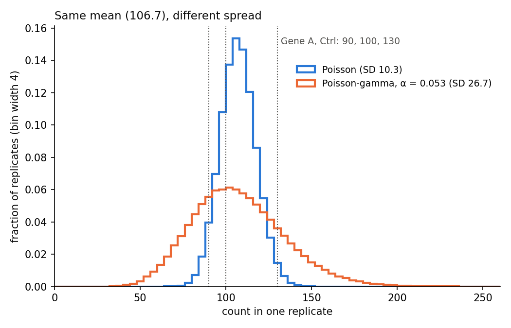
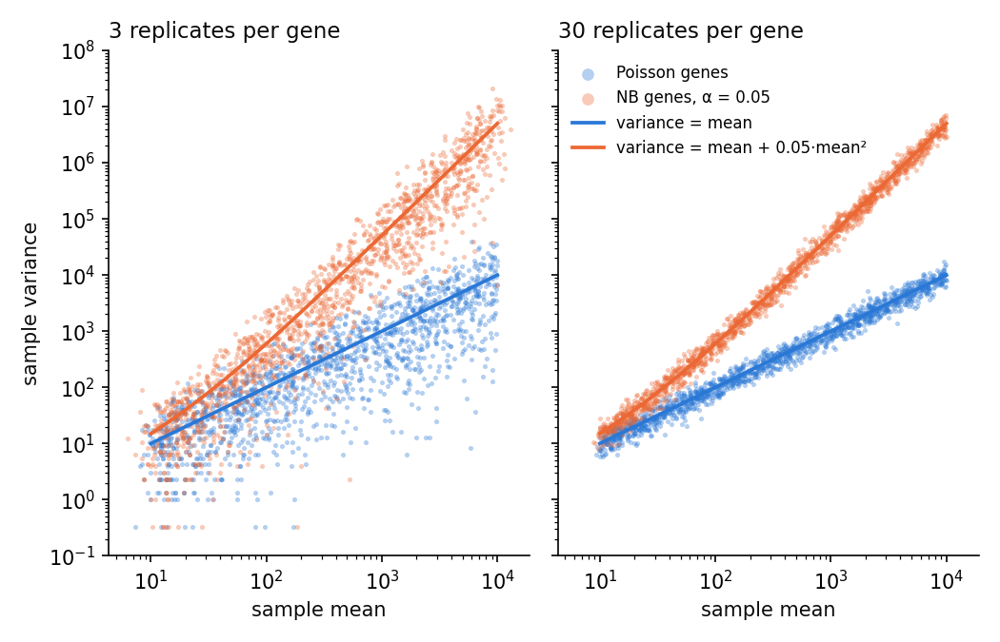

# 01. 같은 조건의 replicate인데 count가 왜 이렇게 다를까?

> read를 세는 우연만 있다면 count의 분산은 평균과 같다(Poisson). biological replicate 사이에서는 발현 수준 자체가 흔들려서 분산이 $\mu + \alpha\mu^2$으로 커진다. replicate 3개로는 유전자 하나만 보고 그 크기를 가늠하기 어렵다.
> 교재: 2.1–2.2 (p.6), 부록 A 문제 2 · 먼저 읽으면 좋은 노트: [00. 전체 지도](00_overview.md) · 검증: R 4.5.2, DESeq2 1.50.2 · 실행 파일: [01_poisson_simulation.ipynb](../01_poisson_simulation.ipynb)

## 이 노트에서 다루는 것

- read를 세는 과정의 우연만 있다면 count는 Poisson 분포를 따르고, 분산이 평균과 같다.
- "평균이 커지면 분산도 커진다"는 Poisson이 틀렸다는 증거가 아니다. 봐야 할 것은 분산을 평균으로 나눈 비다.
- sample마다 발현 수준이 조금씩 다르면 분산은 $\mu + \alpha\mu^2$이 된다. 이것이 과산포이고, 다음 노트의 음이항분포로 이어진다.
- replicate가 3–6개면 유전자 하나의 데이터만으로는 과산포를 판별하기 어렵다. DESeq2가 유전자끼리 정보를 빌리는 이유가 여기 있다.

## 1. 유전자 A의 count는 얼마나 흔들리나?

이 시리즈는 처음부터 끝까지 같은 예를 쓴다. 교재 16장의 "유전자 A"다. 보통 배지에서 키운 대조군(Ctrl)과 glucose를 뺀 배지에서 키운 군(Starvation)에서 각각 세 replicate의 read를 셌다.

| 그룹 | replicate 1 | replicate 2 | replicate 3 | 평균 |
|---|---:|---:|---:|---:|
| Ctrl | 100 | 130 | 90 | 106.667 |
| Starvation | 200 | 250 | 180 | 210 |

표의 숫자 하나하나가 count다. count $K_{ij}$는 sample $j$에서 유전자 $i$에 배정된 read(또는 fragment) 수다. 이 노트는 유전자 하나만 보므로 $i$를 빼고 $K_j$라고 쓴다.

size factor $s_j$는 sample마다 sequencing 깊이가 다른 것을 맞추는 배율이다. 유전자 A의 여섯 sample은 size factor가 모두 1이다. 깊이가 모두 같다고 둔 셈이다. size factor는 [02 노트](02_negative_binomial.md)에서 자세히 다룬다.

Ctrl 세 sample은 같은 조건이다. 그런데 count는 90에서 130까지 벌어져 있다. 이 차이가 생기는 원인은 두 가지로 나눌 수 있다.

- 세는 과정의 우연. 같은 RNA library를 다시 sequencing해도 read 수가 똑같이 나오지는 않는다. 수천만 개 read 가운데 어느 것이 이 유전자에서 왔는지는 확률적으로 정해진다.
- 생물학적 차이. Ctrl 세 sample은 서로 다른 biological replicate다. 예를 들어 donor나 배양 접시가 다르다. 세포 상태, 조직 조성, 준비 과정이 조금씩 다르므로 이 유전자의 실제 발현 수준도 sample마다 다르다. 교재 2.2는 여기에 "모형에 넣은 공변량으로 설명되지 않은 이질성도 남는다"고 덧붙인다. 조건·batch처럼 design에 넣은 요인으로 설명하고도 남는 차이가 있다는 뜻이다.

이 노트는 첫째 원인만 있을 때의 모형(Poisson)을 먼저 세운다. 그다음 둘째 원인이 더해지면 무엇이 바뀌는지 본다. 우선 두 그룹이 얼마나 퍼져 있는지 숫자로 적어 둔다. SD는 표준편차다.

```r
geneA <- list(Ctrl = c(100, 130, 90), Starvation = c(200, 250, 180))
for (grp in names(geneA)) {
  k <- geneA[[grp]]
  cat(sprintf("%-6s 평균 %.3f | 표본분산 %6.1f | 분산/평균 %.2f | Poisson SD %.1f vs 실제 SD %.1f\n",
              grp, mean(k), var(k), var(k) / mean(k), sqrt(mean(k)), sqrt(var(k))))
}
```

```text
Ctrl   평균 106.667 | 표본분산  433.3 | 분산/평균 4.06 | Poisson SD 10.3 vs 실제 SD 20.8
Starvation 평균 210.000 | 표본분산 1300.0 | 분산/평균 6.19 | Poisson SD 14.5 vs 실제 SD 36.1
```

출력에서는 "분산/평균" 열을 보면 된다. 2절과 3절에서 이 값이 1 근처여야 Poisson과 맞는다는 것을 본다. 유전자 A는 두 그룹 모두 4–6이다. 마지막 두 숫자는 Poisson이라면 기대되는 표준편차($\sqrt{\text{평균}}$)와 실제 표준편차다.

## 2. read를 세기만 한다면 count는 어떻게 흔들릴까?

sample 하나를 sequencing해서 read 2,000만 개를 얻었다고 하자. 그중 유전자 A에서 온 read는 100개 남짓이다. read 하나가 유전자 A에서 왔을 확률은 아주 작고, read 수는 아주 많다. "성공 확률이 작은 시행을 아주 많이 반복해서 성공 횟수를 센다." 이런 상황의 횟수는 Poisson 분포로 잘 근사된다. 이항분포의 Poisson 극한이라고 부르는 성질이다(이 설명은 교재에 없는 보충이다).

$$K_j \sim \mathrm{Poisson}(\mu_j), \qquad E(K_j) = \mu_j, \qquad Var(K_j) = \mu_j$$

- $K_j$는 sample $j$의 count다.
- $\mu_j$는 기대 count다. 모형이 그 sample에서 예상하는 평균 count를 말한다.
- $E(K_j)$와 $Var(K_j)$는 같은 library를 끝없이 다시 sequencing해서 셌을 때 count의 평균과 분산이다.

Poisson이 약속하는 것은 하나로 요약된다. 분산이 평균과 같다는 것이다. 유전자 A의 Ctrl에 대입하면 $\mu = 106.667$이므로 분산도 106.667이고, 표준편차는 $\sqrt{106.667} = 10.3$이다. 실제 세 값의 표준편차는 20.8로 두 배쯤 크다.

교재 2.1은 여기서 한 가지를 짚는다. Poisson은 sequencing을 위해 새로 만든 분포가 아니다. 이미 있는 확률분포를 이 관측 과정의 근사 모형으로 빌려 쓰는 것이다. 그래서 실제 read 배정의 복잡한 사정을 모두 표현하지는 못한다.

그 사정의 예로는 한 read가 여러 위치에 붙는 문제(multi-mapping), GC bias, PCR duplicate가 있다. 이 예시는 교재에 없는 보충이다. 반대로 같은 library를 다시 sequencing한 technical replicate에서는 count 변동이 Poisson에 가깝다는 관찰이 있다. Marioni et al. 2008(*Genome Res.* 18:1509)의 결과이며, 이것도 교재에는 없다.

그렇다면 Ctrl처럼 표준편차가 Poisson의 두 배쯤 되는 일은 Poisson에서 얼마나 흔할까? 평균이 유전자 A와 같은 Poisson에서 세 값을 뽑는 일을 10만 번 반복해 본다.

```r
# Poisson이 맞다면, 세 replicate의 분산/평균이 유전자 A만큼 커지는 일은 얼마나 흔한가?
set.seed(1)
for (grp in c("Ctrl", "Starvation")) {
  mu  <- c(Ctrl = 106.667, Starvation = 210)[grp]
  obs <- c(Ctrl = 433.333 / 106.667, Starvation = 1300 / 210)[grp]
  K   <- matrix(rpois(3 * 1e5, mu), ncol = 3)
  r   <- apply(K, 1, var) / rowMeans(K)
  cat(sprintf("%-6s 관측 비 %.2f | Poisson에서 이보다 큰 비율 %.4f\n", grp, obs, mean(r >= obs)))
}
```

```text
Ctrl   관측 비 4.06 | Poisson에서 이보다 큰 비율 0.0168
Starvation 관측 비 6.19 | Poisson에서 이보다 큰 비율 0.0020
```

출력의 마지막 숫자를 보면 된다. Poisson이 맞다면 Ctrl만큼 퍼지는 경우는 1.7%, Starvation만큼 퍼지는 경우는 0.2%뿐이다. "Poisson이 맞다"를 가정하고 계산한 p 값과 같은 성격의 숫자다. 유전자 A는 Poisson이 예상하는 것보다 더 흔들린다. 다만 유전자 하나, replicate 셋에서 나온 증거다. 이것만으로 얼마나 확신할 수 있는지는 5절에서 다시 본다.

## 3. "평균이 커지면 분산도 커진다"는 왜 증거가 아닐까?

Starvation 그룹은 평균이 210으로 Ctrl의 두 배쯤이다. 표본분산도 433에서 1,300으로 커졌다. 이것을 보고 "평균이 크면 분산도 크니 Poisson으로는 안 된다"고 말하고 싶어진다. 교재 2.2는 바로 이 추론을 막는다. 교재는 이 논점의 출처로 DESeq2 논문(Love et al. 2014, 교재 참고문헌 [2])을 든다.

Poisson에서도 분산은 평균과 같다. 그러니 평균이 100에서 200이 되면 분산도 100에서 200이 된다. 분산이 평균을 따라 커지는 것은 Poisson이 예측하는 그대로다. Poisson으로 설명할 수 없는 것은 Poisson이 예측하는 분산을 넘어서는 부분, 곧 $Var(K) - \mu > 0$인 부분이다. 그래서 **봐야 할 양은 분산의 크기가 아니라 분산을 평균으로 나눈 비다.**

$$\frac{Var(K_j)}{\mu_j} = 1 \;\;(\text{Poisson}), \qquad \frac{Var(K_j)}{\mu_j} > 1 \;\;(\text{overdispersion})$$

이 비가 1보다 큰 현상을 과산포(overdispersion)라고 부른다. 같은 조건 replicate 사이의 퍼짐이 Poisson이 예상하는 것보다 큰 현상이다. 유전자 A는 Ctrl 4.06, Starvation 6.19로 두 그룹 모두 1을 넘는다.

조심할 점이 하나 있다. 분모의 $\mu_j$는 sample $j$의 기대 count다. 조건(Ctrl인지 Starvation인지)과 size factor를 반영해 sample마다 따로 정해진다. 평균이 다른 sample을 한데 섞어서 비를 내면, count가 순수한 Poisson이어도 비가 1보다 훨씬 커진다.

```r
# 평균이 다른 두 그룹을 섞어서 분산/평균을 계산하면? (둘 다 순수 Poisson)
set.seed(1)
k100 <- rpois(1e5, 100); k200 <- rpois(1e5, 200)
ratio <- function(k) var(k) / mean(k)
cat(sprintf("mu=100만: %.2f | mu=200만: %.2f | 섞어서: %.2f\n",
            ratio(k100), ratio(k200), ratio(c(k100, k200))))
```

```text
mu=100만: 1.00 | mu=200만: 0.99 | 섞어서: 17.66
```

출력에서 세 숫자를 비교하면 된다. 두 그룹을 따로 보면 비가 1이다. 섞으면 17.66이 된다. 그룹 사이의 평균 차이(100과 200)가 분산에 섞여 들어갔기 때문이다. 그래서 과산포는 "조건 차이를 먼저 설명하고 남은 퍼짐"으로 따져야 한다. DESeq2에서는 이 일을 GLM(일반화 선형모형)이 맡는다. GLM은 count의 평균을 log scale에서 조건·batch 등의 합으로 표현하는 모형이다([04 노트](04_glm_condition_batch.md)).

## 4. 발현 수준 자체가 흔들리면 분산은 얼마가 될까?

이제 둘째 원인인 생물학적 차이를 모형에 넣는다. 생각의 순서는 두 단계다.

1. sample $j$마다 이 유전자의 실제 발현 수준 $\Lambda_j$가 있다. $\Lambda$는 그리스 문자 람다의 대문자다. 이 값은 donor와 세포 상태에 따라 평균 $\mu_j$ 주변에서 조금씩 다르다.
2. sequencing은 그 $\Lambda_j$를 기대값으로 삼아 read를 센다. 이 단계는 2절의 Poisson 그대로다.

식으로 쓰면 다음과 같다.

$$K_j \mid \Lambda_j \sim \mathrm{Poisson}(\Lambda_j), \qquad E(\Lambda_j) = \mu_j, \qquad Var(\Lambda_j) = \alpha\mu_j^2$$

- $K_j \mid \Lambda_j$는 발현 수준이 $\Lambda_j$로 정해졌을 때의 count다. 세로 막대는 "~가 주어졌을 때"라고 읽는다.
- $\Lambda_j$는 sample $j$의 실제 발현 수준, 곧 Poisson의 rate다. sample마다 값이 다른 확률변수다.
- $\alpha$는 dispersion이다. rate가 평균에 비해 얼마나 흔들리는지를 나타낸다. 정확히는 $Var(\Lambda)/E(\Lambda)^2$이다. 변동계수(CV, 표준편차를 평균으로 나눈 값)를 제곱한 것과 같다. 그래서 단위가 없다.

$\Lambda_j$가 어떤 분포로 흔들리는지도 정해야 한다. 교재는 gamma 분포를 고른다. gamma 분포는 0보다 큰 값만 나오는 연속분포다. shape와 scale 두 숫자로 모양이 정해지고, 평균은 shape × scale, 분산은 shape × scale²이다. rate에 gamma를 쓴 이 모형을 교재는 Poisson–gamma mixture라고 부른다. shape를 $1/\alpha$, scale을 $\alpha\mu$로 두면 위의 평균과 분산이 그대로 나온다.

$$\Lambda \sim \mathrm{Gamma}\left(\text{shape}=\tfrac{1}{\alpha},\ \text{scale}=\alpha\mu\right): \qquad E(\Lambda) = \tfrac{1}{\alpha}\cdot\alpha\mu = \mu, \qquad Var(\Lambda) = \tfrac{1}{\alpha}\cdot(\alpha\mu)^2 = \alpha\mu^2$$

이제 count의 평균과 분산을 구한다. 쓰는 도구는 전체분산의 법칙(law of total variance)이다. 말로 하면 "전체 분산 = rate를 고정했을 때 분산의 평균 + rate를 고정했을 때 평균의 분산"이다. rate를 고정하면 count는 Poisson이므로 $E(K\mid\Lambda)=\Lambda$, $Var(K\mid\Lambda)=\Lambda$다. 아래 식에서 중괄호 바깥의 $E$와 $Var$는 sample마다 달라지는 $\Lambda$에 대해 평균과 분산을 낸다는 뜻이다.

$$E(K) = E\{E(K\mid\Lambda)\} = E(\Lambda) = \mu \qquad (\text{law of total expectation})$$

$$Var(K) = \underbrace{E\{Var(K\mid\Lambda)\}}_{=\,E(\Lambda)\,=\,\mu} + \underbrace{Var\{E(K\mid\Lambda)\}}_{=\,Var(\Lambda)\,=\,\alpha\mu^2} = \mu + \alpha\mu^2$$

평균은 그대로 $\mu$다. 분산에는 두 항이 생겼고, 각각 1절의 원인 하나씩에 대응한다.

- 첫째 항 $\mu$는 세는 과정의 우연이다. rate가 고정되어 있어도 남는 Poisson 잡음이다.
- 둘째 항 $\alpha\mu^2$은 sample마다 발현 수준이 다른 데서 오는 몫이다.

α가 0이면 둘째 항이 사라지고 Poisson으로 돌아간다. dispersion α는 분산 자체가 아니다. 분산은 $\mu + \alpha\mu^2$이므로, 같은 α라도 평균이 달라지면 분산이 달라진다. 이 관계는 [02 노트](02_negative_binomial.md)에서 표로 정리한다.

유전자 A의 Ctrl에 대입해 보자. $\mu = 106.667$이다. α로는 [03 노트](03_dispersion_estimation.md)에서 계산하는 유전자 A의 최종 dispersion $\alpha = 0.053147$을 쓴다. 03 노트는 이 값을 얻을 때 prior를 붙인다. prior는 데이터를 보기 전에 α가 어디쯤 있을지 정해 두는 분포다(5절 끝에서 다시 나온다). 이 prior는 교재가 학습용으로 지정한 것이고, 데이터에서 추정한 것이 아니다.

```r
mu <- 106.667; alpha <- 0.053147
pois <- mu; bio <- alpha * mu^2
cat(sprintf("Poisson 부분 %.1f + rate 흔들림 부분 %.1f = 분산 %.1f (SD %.1f)\n",
            pois, bio, pois + bio, sqrt(pois + bio)))
cat(sprintf("rate의 SD = %.1f, 평균 대비 %.1f%%\n", sqrt(bio), 100 * sqrt(alpha)))
```

```text
Poisson 부분 106.7 + rate 흔들림 부분 604.7 = 분산 711.4 (SD 26.7)
rate의 SD = 24.6, 평균 대비 23.1%
```

첫 줄의 두 몫을 비교하면 된다. 분산 711.4 가운데 Poisson 몫은 106.7뿐이고 나머지 604.7이 발현 수준의 흔들림에서 온다. 두 번째 줄은 α를 읽는 쉬운 방법을 보여 준다. $\sqrt{\alpha} = 0.231$이므로, α = 0.053은 replicate마다 실제 발현 수준이 평균의 23% 정도(표준편차 기준) 흔들린다는 뜻이다.



평균은 둘 다 106.7이지만, 발현 수준이 흔들리면(주황) count가 훨씬 넓게 퍼진다. 점선은 유전자 A의 Ctrl 세 값이며, 130은 Poisson(파랑)의 꼬리에 걸쳐 있다.

<details>
<summary>그림을 만든 코드</summary>

```python
import numpy as np
import matplotlib
matplotlib.use("Agg")
import matplotlib.pyplot as plt

rng = np.random.default_rng(11)
mu, alpha, N = 106.667, 0.053147, 200_000          # 유전자 A의 Ctrl 평균, 최종 α
pois = rng.poisson(mu, N)
gp = rng.poisson(rng.gamma(1 / alpha, alpha * mu, N))   # rate를 먼저 뽑고, 그 rate로 Poisson

BLUE, ORANGE, INK, MUTED = "#2a78d6", "#eb6834", "#0b0b0b", "#52514e"
fig, ax = plt.subplots(figsize=(7, 4.5), dpi=150)
bins = np.arange(0, 261, 4)
for k, color, label in [(pois, BLUE, f"Poisson (SD {pois.std():.1f})"),
                        (gp, ORANGE, f"Poisson-gamma, α = 0.053 (SD {gp.std():.1f})")]:
    ax.hist(k, bins=bins, weights=np.full(N, 1 / N), histtype="step", lw=2, color=color, label=label)
for x in (100, 130, 90):
    ax.axvline(x, color=MUTED, lw=1, ls=":")
ax.text(132, ax.get_ylim()[1] * 0.93, "Gene A, Ctrl: 90, 100, 130", color=MUTED, fontsize=9)
ax.set_xlabel("count in one replicate", color=INK)
ax.set_ylabel("fraction of replicates (bin width 4)", color=INK)
ax.set_title("Same mean (106.7), different spread", color=INK, loc="left", fontsize=11)
ax.legend(frameon=False, fontsize=9, loc="upper right", bbox_to_anchor=(1, 0.88))
for s in ("top", "right"):
    ax.spines[s].set_visible(False)
ax.set_xlim(0, 260)
fig.tight_layout()
fig.savefig("../figures/01_same_mean_spread.png", dpi=150, facecolor="white")
print(f"Poisson mean {pois.mean():.1f}, SD {pois.std():.1f} | Poisson-gamma mean {gp.mean():.1f}, SD {gp.std():.1f}")
```

```text
Poisson mean 106.7, SD 10.3 | Poisson-gamma mean 106.8, SD 26.7
```

`notes/` 폴더에서 실행했다.

</details>

위 유도에서 gamma라는 선택은 $E(\Lambda)$와 $Var(\Lambda)$ 두 값을 정하는 데만 쓰였다. 그러니 $Var(K)=\mu+\alpha\mu^2$은 rate가 평균 $\mu$, 분산 $\alpha\mu^2$으로 흔들리기만 하면 분포 모양과 상관없이 성립한다. gamma를 골라서 얻는 것은 count의 확률을 적분 없이 식 하나로 쓸 수 있다는 점이다. 그 분포가 음이항분포(negative binomial, NB)다. NB는 과산포를 허용하는 count 분포이고, 정의와 식은 [02 노트](02_negative_binomial.md)에서 다룬다.

교재는 이 mixture를 "음이항분포가 되는 한 가지 구성 방법"이라고 부른다. DESeq2가 sample마다 숨은 $\Lambda_j$를 추정해 저장한다는 뜻이 아니다. 이 점은 6절에서 직접 확인한다. mixture를 적분한 값이 NB 확률과 정말 같은지는 아래 "더 깊이 보기"에서 수치로 확인했다.

## 5. replicate가 많으면 분명한데, 3개로는 알 수 있을까?

먼저 표본이 아주 많은 경우를 본다. 평균이 100인 유전자를 10만 번 센다. 세 가지 경우를 비교한다. 순수 Poisson, α = 0.05인 Poisson–gamma, α = 0.20인 Poisson–gamma다. 코드와 출력에서는 Poisson–gamma를 GP로 줄여 쓴다.

```python
import numpy as np
rng = np.random.default_rng(1)

def gamma_poisson(mu, alpha, size):
    lam = rng.gamma(shape=1/alpha, scale=alpha*mu, size=size)  # E=mu, Var=alpha*mu^2
    return rng.poisson(lam)

n = 100_000
for label, k in [("Poisson",   rng.poisson(100, n)),
                 ("GP a=0.05", gamma_poisson(100, 0.05, n)),
                 ("GP a=0.20", gamma_poisson(100, 0.20, n))]:
    m, v = k.mean(), k.var(ddof=1)
    print(f"{label:10s} mean={m:7.2f} var={v:8.2f} var/mean={v/m:6.3f} (var-mean)/mean^2={(v-m)/m**2:7.4f}")
```

```text
Poisson    mean=  99.97 var=   99.61 var/mean= 0.996 (var-mean)/mean^2=-0.0000
GP a=0.05  mean=  99.97 var=  595.97 var/mean= 5.961 (var-mean)/mean^2= 0.0496
GP a=0.20  mean= 100.01 var= 2088.14 var/mean=20.879 (var-mean)/mean^2= 0.1988
```

| 모형 ($\mu=100$) | 이론 분산 | 관측 $S^2$ | 이론 분산/평균 $= 1+\alpha\mu$ | 관측 $S^2/\bar K$ | 관측 $\hat\alpha$ |
|---|---:|---:|---:|---:|---:|
| Poisson | 100 | 99.6 | 1 | 0.996 | −0.0000 |
| GP, $\alpha=0.05$ | 600 | 596.0 | 6 | 5.96 | 0.0496 |
| GP, $\alpha=0.20$ | 2,100 | 2,088.1 | 21 | 20.88 | 0.1988 |

세 경우 모두 평균은 100이다. 그런데 분산은 6배, 21배 차이가 난다. 평균이 커져서 분산이 커진 것이 아니다. 이것이 과산포다.

마지막 열 $\hat\alpha$는 분산식을 거꾸로 푼 값이다. $Var(K)=\mu+\alpha\mu^2$을 α에 대해 풀면 $\alpha = (Var(K)-\mu)/\mu^2$이다. 여기에 표본평균 $\bar K$와 표본분산 $S^2$을 넣은 것이 가장 단순한 추정량이다.

$$\hat\alpha = \frac{S^2 - \bar K}{\bar K^2}$$

이런 추정을 moment 추정이라고 부른다. 표본의 평균·분산을 이론식에 맞춰 푸는 방법이다. 표본분산을 소문자 $s^2$ 대신 $S^2$으로 쓰는 것은 소문자 $s_j$가 이미 size factor이기 때문이다(교재 부록 C 기호). 코드의 `s2`와 `m`이 각각 $S^2$과 $\bar K$다. 10만 개 표본에서는 $\hat\alpha$가 진짜 α를 상대오차 1% 미만으로 되찾는다(0.0496 대 0.05, 0.1988 대 0.20).

하지만 실제 RNA-seq 실험은 조건마다 replicate가 3–6개다. 같은 계산을 replicate 3개, 6개, 30개로 20,000번 반복해 본다.

```python
import numpy as np
rng = np.random.default_rng(2)
reps, mu, a = 20_000, 100, 0.05
q = [2.5, 25, 50, 75, 97.5]
for n in (3, 6, 30):
    P  = rng.poisson(mu, (reps, n))
    GP = rng.poisson(rng.gamma(1/a, a*mu, (reps, n)))
    for label, K in (("Poisson", P), ("GP a=0.05", GP)):
        m, s2 = K.mean(1), K.var(1, ddof=1)
        print(f"n={n:2d} {label:9s} s2 quantiles={np.percentile(s2, q).round(0)} "
              f"s2/m={np.percentile(s2/m, q).round(2)} P(s2<m)={np.mean(s2 < m):.3f}")
```

```text
n= 3 Poisson   s2 quantiles=[  2.  30.  70. 140. 376.] s2/m=[0.02 0.3  0.71 1.4  3.77] P(s2<m)=0.626
n= 3 GP a=0.05 s2 quantiles=[  13.  165.  401.  812. 2305.] s2/m=[ 0.14  1.69  4.07  8.09 21.66] P(s2<m)=0.156
n= 6 Poisson   s2 quantiles=[ 17.  54.  87. 133. 254.] s2/m=[0.17 0.54 0.87 1.32 2.54] P(s2<m)=0.583
n= 6 GP a=0.05 s2 quantiles=[  96.  311.  509.  786. 1605.] s2/m=[ 1.01  3.18  5.15  7.86 15.32] P(s2<m)=0.025
n=30 Poisson   s2 quantiles=[ 55.  81.  98. 117. 157.] s2/m=[0.55 0.81 0.98 1.17 1.57] P(s2<m)=0.533
n=30 GP a=0.05 s2 quantiles=[325. 480. 581. 700. 981.] s2/m=[3.31 4.84 5.82 6.96 9.61] P(s2<m)=0.000
```

표본분산 $S^2$이 어디에 흩어지는지 분위수로 정리하면 다음과 같다(반복 20,000회, $\mu=100$).

| $n$ | 모형 (이론 분산) | 2.5% | 25% | 50% | 75% | 97.5% | $S^2/\bar K$의 95% 구간 | $P(S^2 < \bar K)$ |
|---:|---|---:|---:|---:|---:|---:|---|---:|
| 3 | Poisson (100) | 2 | 30 | 70 | 140 | 376 | 0.02 – 3.77 | 0.626 |
| 3 | GP $\alpha=0.05$ (600) | 13 | 165 | 401 | 812 | 2,305 | 0.14 – 21.7 | 0.156 |
| 6 | Poisson (100) | 17 | 54 | 87 | 133 | 254 | 0.17 – 2.54 | 0.583 |
| 6 | GP $\alpha=0.05$ (600) | 96 | 311 | 509 | 786 | 1,605 | 1.01 – 15.3 | 0.025 |
| 30 | Poisson (100) | 55 | 81 | 98 | 117 | 157 | 0.55 – 1.57 | 0.533 |
| 30 | GP $\alpha=0.05$ (600) | 325 | 480 | 581 | 700 | 981 | 3.31 – 9.61 | 0.000 |

표에서 볼 것은 다음과 같다.

- replicate 3개면 Poisson 유전자의 $S^2$이 2에서 376까지 퍼진다. 진짜 분산은 100이다. 값 3개로 분산을 재면 이 정도 흔들림은 정상이다. 표본분산은 대략 자유도 $n-1$(여기서는 2)인 $\chi^2$ 분포의 모양으로 흔들린다. 이 관계는 정규분포에서만 정확하지만, $\mu=100$에서는 좋은 근사다.
- α = 0.05로 분산이 6배인 유전자도, replicate 3개만 보면 15.6%는 "분산이 평균보다 작다"고 나온다. 반대로 과산포가 전혀 없는 Poisson 유전자도 37.4%(= 1 − 0.626)는 분산이 평균보다 크게 나온다.
- replicate 6개가 되어야 GP 쪽 $S^2/\bar K$ 구간의 아래 끝이 1에 닿는다($P(S^2<\bar K)=0.025$). 표의 $n$ 중에서 두 95% 구간이 겹치지 않는 것은 30개뿐이다. $n$을 더 촘촘히 돌려 보면 두 구간은 10개와 12개 사이에서 갈라진다("더 깊이 보기").
- Poisson 유전자인데도 $P(S^2 < \bar K)$가 0.5보다 크다(0.626, 0.583, 0.533). $S^2$의 분포가 오른쪽으로 긴 꼬리를 가져서 중앙값이 평균(100)보다 작기 때문이다. 이런 유전자에 위의 moment 추정량을 쓰면 $\hat\alpha$가 음수가 된다. 음수가 DESeq2에서 어떻게 처리되는지는 6절에서 본다.

유전자 하나가 아니라 유전자 수천 개를 한꺼번에 그리면 이 상황이 한눈에 보인다.



점 하나가 유전자 하나다. 파랑은 Poisson 유전자, 주황은 α = 0.05인 Poisson–gamma 유전자(그림의 "NB genes")이고, 두 선은 각각의 이론 분산이다. replicate 3개(왼쪽)에서는 점이 자기 선에서 크게 흩어져서 두 무리가 많이 겹친다. 30개(오른쪽)에서는 두 선을 따라 갈라진다. 평균이 작은 쪽에서는 두 선의 비 $1+\alpha\mu$가 1에 가까워서 선 자체가 붙어 있다.

<details>
<summary>그림을 만든 코드</summary>

```python
import numpy as np
import matplotlib
matplotlib.use("Agg")
import matplotlib.pyplot as plt

rng = np.random.default_rng(12)
G, alpha = 1500, 0.05
mu = np.exp(rng.uniform(np.log(10), np.log(10_000), G))   # 유전자마다 다른 평균
BLUE, ORANGE, INK = "#2a78d6", "#eb6834", "#0b0b0b"
grid = np.geomspace(10, 10_000, 100)

fig, axes = plt.subplots(1, 2, figsize=(7, 4.5), dpi=150, sharex=True, sharey=True)
for ax, n in zip(axes, (3, 30)):
    P = rng.poisson(mu[:, None], (G, n))
    NB = rng.poisson(rng.gamma(1 / alpha, alpha * mu[:, None], (G, n)))
    for K, color, label in [(P, BLUE, "Poisson genes"), (NB, ORANGE, "NB genes, α = 0.05")]:
        m, s2 = K.mean(1), K.var(1, ddof=1)
        keep = s2 > 0                      # log 축이라 표본분산 0은 뺀다
        ax.scatter(m[keep], s2[keep], s=6, alpha=0.35, color=color, lw=0, label=label)
        print(f"n={n:2d} {label:18s} dropped (s2 = 0): {np.sum(~keep)}")
    ax.plot(grid, grid, color=BLUE, lw=1.8, label="variance = mean")
    ax.plot(grid, grid + alpha * grid**2, color=ORANGE, lw=1.8, label="variance = mean + 0.05·mean²")
    ax.set_xscale("log"); ax.set_yscale("log")
    ax.set_title(f"{n} replicates per gene", color=INK, fontsize=11, loc="left")
    ax.set_xlabel("sample mean", color=INK)
    for s in ("top", "right"):
        ax.spines[s].set_visible(False)
axes[0].set_ylabel("sample variance", color=INK)
axes[0].set_ylim(1e-1, 1e8)
axes[1].legend(frameon=False, fontsize=8, loc="upper left", markerscale=2.5)
fig.tight_layout()
fig.savefig("../figures/01_variance_vs_mean.png", dpi=150, facecolor="white")
```

```text
n= 3 Poisson genes      dropped (s2 = 0): 0
n= 3 NB genes, α = 0.05 dropped (s2 = 0): 1
n=30 Poisson genes      dropped (s2 = 0): 0
n=30 NB genes, α = 0.05 dropped (s2 = 0): 0
```

`notes/` 폴더에서 실행했다. 유전자 평균은 10–10,000 사이에서 log scale로 고르게 뽑았다. 표본분산이 0인 유전자는 log 축에 그릴 수 없어서 뺐다(출력의 1개).

</details>

정리하면 결론은 두 가지다. 첫째, 과산포는 실제로 있고 표본이 많으면 뚜렷하게 보인다. 둘째, 실제 실험의 replicate 3–6개로는 유전자 하나의 표본분산만 보고 과산포가 있는지, α가 얼마인지를 믿을 만하게 말할 수 없다. 둘째 문제 때문에 DESeq2는 유전자 사이에서 정보를 빌린다. 이 방식을 empirical Bayes라고 부르며 [03 노트](03_dispersion_estimation.md)에서 다룬다. prior(데이터를 보기 전에 parameter가 어디쯤 있을지에 대한 분포)를 전체 유전자에서 추정해 쓰는 방식이다.

## 6. DESeq2는 이 모형을 어떻게 쓰나?

DESeq2가 이 노트의 내용과 직접 만나는 지점은 세 곳이다.

첫째, 분산식이 같다. DESeq2는 유전자 $i$, sample $j$의 count를 $K_{ij} \sim NB(\mu_{ij}, \alpha_i)$로 두고, 분산을 $\mu_{ij} + \alpha_i\mu_{ij}^2$으로 쓴다. 기대 count $\mu_{ij}$는 sample마다 다르고, dispersion $\alpha_i$는 유전자마다 하나씩이라 그 유전자의 모든 sample이 같이 쓴다. R의 음이항분포 함수(`dnbinom`, `rnbinom`)는 α 대신 `size`라는 인자를 받는데, `size = 1/α`로 넣으면 같은 분산이 된다. DESeq2가 예제 데이터를 만들 때도 `rnbinom(mu = mu, size = 1/dispersion)`을 쓴다.

둘째, DESeq2는 sample마다 $\Lambda_j$를 추정하지 않는다. mixture는 분산식과 분포를 유도하는 장치일 뿐이다. 분석을 마친 DESeq2 객체를 열어 보면 sample마다 값이 들어 있는 표에 rate가 없다.

셋째, 5절의 moment 추정 $\hat\alpha = (S^2 - \bar K)/\bar K^2$이 DESeq2 안에 거의 그대로 있다. 다만 dispersion 계산을 시작하는 출발점(초기값)으로만 쓴다. 이 값이 음수로 나와도 검정에 쓰는 최종 dispersion이 음수가 되지는 않는다.

둘째와 셋째를 한 번에 확인한다. DESeq2가 제공하는 가짜 데이터 생성 함수로 유전자 200개, sample 6개(두 조건 각 3개)를 만들고 `DESeq()`을 돌린다.

```r
suppressPackageStartupMessages(library(DESeq2))
set.seed(1)
dds <- DESeq(makeExampleDESeqDataSet(n = 200, m = 6), quiet = TRUE)  # 유전자 200개, sample 6개
assayNames(dds)                            # sample마다 값이 있는 표: rate 표는 없다
mom <- DESeq2:::momentsDispEstimate(dds)   # (표본분산 - 평균) / 평균^2, 정규화 count 기준
cat("moment 추정값이 음수인 유전자:", sum(mom < 0), "개\n")
print(data.frame(moment = mom, final = dispersions(dds), row.names = rownames(dds))[mom < 0, ], digits = 3)
```

```text
[1] "counts" "mu"     "H"      "cooks" 
moment 추정값이 음수인 유전자: 4 개
         moment  final
gene45  -0.0269  0.632
gene67  -0.1768 10.000
gene121 -0.1830  0.840
gene141 -0.4543 10.000
```

첫 줄은 sample마다 값이 있는 표(assay)의 이름이다. `counts`는 원래 count, `mu`는 모형이 적합한 기대 count다. `H`는 sample마다 적합에 미치는 영향력(hat 행렬의 대각값)이고, `cooks`는 그것으로 계산한 outlier 지표(Cook's distance)다. rate $\Lambda_j$를 담은 표는 없다. `mu`도 GLM이 계산한 기대 count $\mu_{ij}$이지 $\Lambda_j$의 실현값이 아니다.

아래 표에서는 `moment`와 `final`을 비교하면 된다. 200개 중 4개 유전자는 표본분산이 작아서 moment 추정값이 음수다. 그런데 검정에 실제로 쓰는 최종 dispersion(`final`)은 0.632–10이다. 10은 이 데이터에서 DESeq2가 두는 상한(`maxDisp`)이다. DESeq2는 "표본분산이 평균보다 작다"는 유전자도 Poisson으로 다루지 않는다. 대신 trend 쪽으로 끌어올린다. trend는 평균 발현량에 따라 dispersion이 대체로 어디쯤 있는지를 나타내는 곡선이다. 정보가 적은 추정치를 이런 전체 경향 쪽으로 당기는 것을 shrinkage(수축)라고 부른다. 이 과정은 [03 노트](03_dispersion_estimation.md)에서 단계별로 본다.

소스 코드 발췌, 하한값 `1e-8`에 걸리는 유전자 수, outlier가 있을 때 assay가 어떻게 바뀌는지는 아래 "더 깊이 보기"에 모았다.

## 한 번에 정리

- 세는 과정의 우연만 있다면 count는 Poisson을 따르고, 분산이 평균과 같다. 유전자 A의 Ctrl이라면 분산 106.7, 표준편차 10.3이다.
- "평균이 커지면 분산도 커진다"는 Poisson에서도 일어난다. 과산포를 판별하는 기준은 조건과 size factor를 반영한 기대 count에 대한 비 $Var(K_j)/\mu_j$가 1을 넘는지다.
- biological replicate마다 발현 수준(rate)이 흔들리면 $Var(K) = \mu + \alpha\mu^2$이 된다. $\mu$는 세는 우연, $\alpha\mu^2$은 sample 사이의 생물학적 차이다.
- α는 rate의 CV²이고 분산 자체가 아니다. 유전자 A의 α = 0.053147은 발현 수준이 replicate마다 23% 정도 흔들린다는 뜻이고, 이때 Ctrl의 분산은 711.4다.
- rate를 gamma로 흔들면 count 분포가 음이항분포가 된다. 이것은 유도 방법이고, DESeq2가 sample별 rate를 추정해 저장하지는 않는다.
- replicate가 3–6개면 유전자 하나의 표본분산만으로는 과산포를 믿을 만하게 판별하기 어렵다. 그래서 DESeq2는 유전자 전체에서 trend와 prior를 빌린다.
- 다음 노트 [02](02_negative_binomial.md)는 이 mixture에서 음이항분포의 식을 유도하고, 분산식 표, $CV^2 = 1/\mu + \alpha$, size factor와 $\mu_{ij}=s_j q_{ij}$를 다룬다. 교재 그림 1도 거기서 다시 계산한다(교재 2.3–2.4, 3장).

## 연습문제

### 문제 2

> 평균 count가 100에서 200으로 증가하면서 분산도 증가했다. 이 사실만으로 Poisson 대신 NB가 필요하다고 결론 내릴 수 있는가?

<details>
<summary>풀이</summary>

**답: 아니다.** Poisson도 평균과 함께 분산이 증가한다. 조건과 offset을 고려한 기대 평균에 비해 분산이 Poisson의 예측 $\mu$를 초과하는지가 핵심이다. 교재 부록 B 2번과 같은 결론이다. 여기서 offset은 추정하지 않고 log scale의 평균 식에 그대로 더하는 값이다. size factor가 $\log s_j$의 형태로 이 자리에 들어간다.

숫자로 확인한다. 평균이 100에서 200으로 바뀔 때 Poisson과 GP(α = 0.05)의 이론 분산을 계산했다. 또 replicate 6개인 Poisson 표본에서 표본분산이 어느 범위에 나오는지, 두 그룹의 표본분산 크기 순서가 뒤집힐 확률은 얼마인지 계산했다.

```python
import numpy as np
rng = np.random.default_rng(4)
for mu in (100, 200):
    for a in (0.0, 0.05):
        v = mu + a*mu**2
        print(f"mu={mu:3d} alpha={a:.2f}  Var={v:6.0f}  Var/mu={v/mu:5.1f}  (Var-mu)/mu^2={(v-mu)/mu**2:.3f}")
n, reps = 6, 20_000
s2 = {}
for mu in (100, 200):
    s2[mu] = rng.poisson(mu, (reps, n)).var(1, ddof=1)
    print(f"Poisson n={n} mu={mu}: median s2={np.median(s2[mu]):5.1f}  95% band=({np.percentile(s2[mu],2.5):.0f}, {np.percentile(s2[mu],97.5):.0f})")
print(f"P(s2 at mu=200 > s2 at mu=100) = {np.mean(s2[200] > s2[100]):.3f}")
from scipy import stats
print(f"normal approx: P(F(5,5) > 0.5) = {stats.f.sf(0.5, 5, 5):.3f}")
```

```text
mu=100 alpha=0.00  Var=   100  Var/mu=  1.0  (Var-mu)/mu^2=0.000
mu=100 alpha=0.05  Var=   600  Var/mu=  6.0  (Var-mu)/mu^2=0.050
mu=200 alpha=0.00  Var=   200  Var/mu=  1.0  (Var-mu)/mu^2=0.000
mu=200 alpha=0.05  Var=  2200  Var/mu= 11.0  (Var-mu)/mu^2=0.050
Poisson n=6 mu=100: median s2= 87.4  95% band=(17, 255)
Poisson n=6 mu=200: median s2=175.0  95% band=(34, 523)
P(s2 at mu=200 > s2 at mu=100) = 0.768
normal approx: P(F(5,5) > 0.5) = 0.767
```

| 평균 $\mu$ | Poisson 분산 | Poisson 분산/평균 | GP(α = 0.05) 분산 | GP 분산/평균 | $n=6$ Poisson 표본의 $S^2$ 95% 범위 |
|---:|---:|---:|---:|---:|---|
| 100 | 100 | 1 | 600 | 6 | 17 – 255 |
| 200 | 200 | 1 | 2,200 | 11 | 34 – 523 |

1. Poisson에서 평균이 100에서 200이 되면 분산도 정확히 100에서 200으로 두 배가 된다. "분산이 증가했다"는 관찰은 Poisson과 그대로 맞는다.
2. 판별에 필요한 양은 분산/평균이다. Poisson이면 평균과 상관없이 1이다. α = 0.05인 GP면 6에서 11로, 비 자체가 평균과 함께 커진다($1+\alpha\mu$). 반면 $(Var-\mu)/\mu^2 = \alpha$는 0.05 그대로다. 즉 NB 모형 안에서 α는 $\mu$를 바꿔도 분산/평균처럼 따라 변하지 않는다. 평균의 크기를 걷어 낸 과산포 parameter다. 다만 실제 유전자들 사이에서는 α가 평균에 따라 달라지는 경향(trend)을 보인다. DESeq2 예제 데이터 생성 함수의 `dispMeanRel = 4/x + 0.1`이 그런 관계이고, [03 노트](03_dispersion_estimation.md)에서 다룬다.
3. 실제 데이터에서 "분산이 증가했다"고 말하려면 표본분산 자체의 흔들림도 감안해야 한다. $n=6$에서 진짜 Poisson(100)의 $S^2$은 95% 구간이 17–255, Poisson(200)은 34–523이다. 진짜 분산이 정확히 두 배여도 $\mu=200$ 쪽 표본분산이 더 크게 나오는 경우는 76.8%뿐이다. count를 정규분포로 근사하면 두 표본분산의 비는 $F_{5,5}$ 분포로 계산할 수 있다. 그렇게 구한 $P(F>0.5)=0.767$도 거의 같다. 약 23%는 크기 순서가 뒤집히므로, "평균 200 그룹의 표본분산이 더 컸다"는 관찰 하나로는 분산이 늘었다는 것조차 확정하기 어렵다.
4. 올바른 질문은 이것이다. 조건과 offset을 반영한 기대 평균 $\mu_{ij}$를 먼저 두고, 그 주변에 남는 분산이 $\mu_{ij}$를 체계적으로 넘는가? DESeq2는 이것을 유전자 하나의 표본분산이 아니라, 평균 모형(GLM)과 전체 유전자에서 빌린 dispersion trend로 판단한다([03](03_dispersion_estimation.md), [04](04_glm_condition_batch.md) 노트).

</details>

## 더 깊이 보기

<details>
<summary>Poisson의 분산이 평균과 같은 이유</summary>

$K \sim \mathrm{Poisson}(\mu)$이면 $P(K=k) = e^{-\mu}\mu^k / k!$이다. 이 분포에서 $E(K)=\mu$이고 $E[K(K-1)] = \mu^2$이다. 따라서

$$Var(K) = E[K(K-1)] + E(K) - E(K)^2 = \mu^2 + \mu - \mu^2 = \mu$$

이다.

</details>

<details>
<summary>Poisson–gamma mixture가 NB와 같다는 수치 확인 (Python, R)</summary>

gamma 밀도와 Poisson 확률의 곱을 $\lambda$에 대해 적분한 값을, scipy의 NB 확률 `nbinom(n=1/α, p=1/(1+αμ)).pmf`와 비교했다. $\mu = 30$, $\alpha = 0.2$다. 교재 그림 1(평균 30 고정, Poisson / α = 0.05 / α = 0.2의 확률)은 교재 2.3에 속하므로 [02 노트](02_negative_binomial.md)에서 다시 계산한다. 여기서는 2.2의 "Poisson–gamma mixture는 NB가 되는 한 가지 구성 방법"만 수치로 확인한다.

```python
import numpy as np
from scipy import stats, integrate
mu, a = 30, 0.2
nb = stats.nbinom(1/a, 1/(1 + a*mu))   # size=1/a, prob=1/(1+a*mu) -> mean mu, var mu+a*mu^2
for k in (5, 20, 30, 60):
    f = lambda lam: stats.poisson.pmf(k, lam) * stats.gamma.pdf(lam, 1/a, scale=a*mu)
    print(f"k={k:2d}  mixture integral={integrate.quad(f, 0, np.inf)[0]:.6f}  nbinom.pmf={nb.pmf(k):.6f}")
```

```text
k= 5  mixture integral=0.003469  nbinom.pmf=0.003469
k=20  mixture integral=0.028970  nbinom.pmf=0.028970
k=30  mixture integral=0.027064  nbinom.pmf=0.027064
k=60  mixture integral=0.003637  nbinom.pmf=0.003637
```

네 점 모두 소수 여섯째 자리까지 같다. 정식 유도는 02 노트에 있다.

R에서도 같은 것을 확인했다. `rgamma`로 rate를 뽑고 `rpois`로 센 값(Poisson–gamma mixture)과, R의 `rnbinom(mu, size = 1/α)`의 분산을 비교한다.

```r
set.seed(2026); N <- 2e6
for (a in c(0.05, 0.2)) {
  lam  <- rgamma(N, shape = 1/a, scale = a*30)   # E=30, Var=a*30^2
  k_gp <- rpois(N, lam)                          # Poisson-gamma mixture
  k_nb <- rnbinom(N, mu = 30, size = 1/a)        # R's NB, mu/size parameterization
  cat(sprintf("alpha=%.2f  Var(Lambda)=%.1f (theory %.0f) | gamma-pois var=%.1f | rnbinom var=%.1f | theory %.0f\n",
              a, var(lam), a*900, var(k_gp), var(k_nb), 30 + a*900))
}
```

```text
alpha=0.05  Var(Lambda)=44.9 (theory 45) | gamma-pois var=74.9 | rnbinom var=75.0 | theory 75
alpha=0.20  Var(Lambda)=179.8 (theory 180) | gamma-pois var=209.9 | rnbinom var=210.7 | theory 210
```

$Var(\Lambda) = \alpha\mu^2$(45, 180)과 두 항의 합 $\mu + \alpha\mu^2$(75, 210)이 각각 유도식과 맞는다. R의 `rnbinom(size = 1/α)`도 같은 분산을 준다. 이 노트의 Python 시뮬레이션은 모두 Python 3.13, numpy 2.2.6, scipy 1.17.1에서 seed를 고정해 실행했다. GP 표본은 4절 수식 그대로 `rng.gamma(shape=1/α, scale=αμ)`에서 rate를 뽑고 `rng.poisson(λ)`로 세는 두 단계로 만들었다. NB 확률 함수는 위 적분 비교에서만 썼다.

</details>

<details>
<summary>replicate 수를 8–20개로 늘려 보면</summary>

5절 표에서는 $n=30$에서만 두 95% 구간이 갈라졌다. 그 사이를 촘촘히 돌렸다. Poisson 쪽 $S^2/\bar K$의 97.5% 분위수와 GP(α = 0.05) 쪽 2.5% 분위수를 비교한다.

```python
import numpy as np
rng = np.random.default_rng(3)
reps, mu, a = 20_000, 100, 0.05
for n in (8, 10, 12, 15, 20):
    P  = rng.poisson(mu, (reps, n))
    GP = rng.poisson(rng.gamma(1/a, a*mu, (reps, n)))
    pq = np.percentile(P.var(1, ddof=1) / P.mean(1), 97.5)
    gq = np.percentile(GP.var(1, ddof=1) / GP.mean(1), 2.5)
    print(f"n={n:2d}  Poisson 97.5%={pq:.2f}  GP 2.5%={gq:.2f}  overlap={pq > gq}")
```

```text
n= 8  Poisson 97.5%=2.30  GP 2.5%=1.45  overlap=True
n=10  Poisson 97.5%=2.09  GP 2.5%=1.74  overlap=True
n=12  Poisson 97.5%=1.97  GP 2.5%=2.09  overlap=False
n=15  Poisson 97.5%=1.88  GP 2.5%=2.38  overlap=False
n=20  Poisson 97.5%=1.73  GP 2.5%=2.79  overlap=False
```

$\alpha=0.05$, $\mu=100$처럼 분산이 Poisson의 6배나 되는 유전자도, 두 95% 구간이 갈라지려면 replicate가 10개를 넘어야 한다. $n=12$에서의 차이(1.97 대 2.09)는 경계선 수준이다.

</details>

<details>
<summary>DESeq2 소스로 확인한 것: 구현 확인 (1)–(4)</summary>

이 노트의 범위에서 DESeq2와 직접 맞닿는 곳은 네 가지다. (1) R의 NB가 어떤 모수화를 쓰고 gamma mixture와 어떤 관계인지, (2) DESeq2의 시뮬레이터가 count를 어떻게 만드는지, (3) DESeq2가 sample별 gamma rate를 저장하지 않는다는 교재 주장, (4) $Var=\mu+\alpha\mu^2$을 뒤집은 moment 추정이 코드 어디에 있는지.

**(1) `stats::dnbinom`의 mu/size 모수화와 gamma mixture**

```r
txt <- gsub("_\b", "", capture.output(tools::Rd2txt(utils:::.getHelpFile(help("dnbinom")))))
cat(grep("alternative parametrization|variance is|gamma mixture", txt, ignore.case = TRUE, value = TRUE), sep = "\n")
```

```text
      mu: alternative parametrization via mean: see ‘Details’.
     An alternative parametrization (often used in ecology) is by the
     where ‘prob’ = ‘size/(size+mu)’.  The variance is ‘mu + mu^2/size’
     ‘rnbinom’ uses the derivation as a gamma mixture of Poisson
     ## Alternative parametrization
```

R 매뉴얼이 적은 분산은 `mu + mu^2/size`다. `size = 1/α`로 두면 정확히 $\mu + \alpha\mu^2$이 된다. `rnbinom` 자체도 "gamma mixture of Poisson"으로 난수를 만든다. 교재가 인용한 [9]는 이 R 매뉴얼이다. [9]에서 가져온 내용, 곧 mixture 구성과 모수화는 매뉴얼 본문과 일치한다. 다만 교재 2.2는 [9]를 "DESeq2가 실제 sample마다 숨은 gamma rate를 추정해 저장한다는 뜻은 아니다" 문장 바로 뒤에 달았다. R 매뉴얼인 [9]는 DESeq2의 저장 방식에 대해서는 아무것도 말하지 않는다. 그 부분의 근거는 아래 (3)의 직접 확인이다.

**(2) DESeq2의 시뮬레이터 `makeExampleDESeqDataSet`은 `rnbinom(mu, size = 1/dispersion)`을 쓴다**

```r
suppressPackageStartupMessages(library(DESeq2))
print(args(makeExampleDESeqDataSet))
b <- deparse(body(makeExampleDESeqDataSet))
cat(grep("dispersion <-|rnbinom", b, value = TRUE), sep = "\n")
```

```text
function (n = 1000, m = 12, betaSD = 0, interceptMean = 4, interceptSD = 2, 
    dispMeanRel = function(x) 4/x + 0.1, sizeFactors = rep(1, 
        m)) 
NULL
    dispersion <- dispMeanRel(2^(beta[, 1]))
    countData <- matrix(rnbinom(m * n, mu = mu, size = 1/dispersion), 
```

DESeq2가 예제 데이터를 만들 때도 `size = 1/dispersion`을 넘긴다. 즉 DESeq2의 α는 R의 `1/size`다. 기본값 `dispMeanRel = 4/x + 0.1`은 평균이 작을수록 α가 커지는 관계다. 이 trend의 의미는 03 노트에서 다룬다.

**(3) `DESeq()`는 sample별 gamma rate를 저장하지 않는다**

```r
suppressPackageStartupMessages(library(DESeq2))
set.seed(1)
dds <- DESeq(makeExampleDESeqDataSet(n = 200, m = 6), quiet = TRUE)
cat("assayNames:", assayNames(dds), "\n")
cat("mcols:", names(mcols(dds)), "\n")
cat("dim(assays(dds)$mu):", dim(assays(dds)$mu), "\n")
```

```text
assayNames: counts mu H cooks 
mcols: trueIntercept trueBeta trueDisp baseMean baseVar allZero dispGeneEst dispGeneIter dispFit dispersion dispIter dispOutlier dispMAP Intercept condition_B_vs_A SE_Intercept SE_condition_B_vs_A WaldStatistic_Intercept WaldStatistic_condition_B_vs_A WaldPvalue_Intercept WaldPvalue_condition_B_vs_A betaConv betaIter deviance maxCooks 
dim(assays(dds)$mu): 200 6 
```

이 실행(m = 6, outlier 치환 없음)에서 sample 차원(열)을 가진 assay는 `counts`, `mu`, `H`, `cooks` 네 개다. 유전자 차원의 `mcols`에는 dispersion 관련 열이 유전자당 하나씩만 있다. `assays(dds)$mu`는 유전자×sample 행렬이지만, GLM이 적합한 기대 count $\mu_{ij} = s_j q_{ij}$이지 $\Lambda_j$의 실현값이 아니다($q_{ij}$는 size factor를 뺀 기대 발현량, 02 노트). `Lambda`, `gamma`, `rate` 같은 이름의 저장소는 없다. 교재 2.2의 "DESeq2가 실제 sample마다 숨은 gamma rate를 추정해 저장한다는 뜻은 아니다"가 확인된다. `trueIntercept`, `trueBeta`, `trueDisp`는 시뮬레이터가 심어 둔 정답이고, 실제 데이터에는 없다.

assay가 늘 네 개인 것은 아니다. `DESeq()`는 replicate가 7개 이상(`minReplicatesForReplace = 7`)인 design cell이 하나라도 있으면(`any(nOrMoreInCell(...))`) outlier 치환 단계를 돌린다. 치환 대상은 그런 cell에 속한 sample뿐이다. 그래서 assay 상태는 세 가지다.

| 상황 | `assayNames` |
|---|---|
| 7개 이상인 cell이 없음 (위 m = 6) | `counts mu H cooks` |
| 7개 이상인 cell이 있으나 치환된 count 없음 | `counts mu H cooks originalCounts` (+ `mcols`에 `replace` 열) |
| 7개 이상인 cell의 sample에 Cook's outlier가 있어 치환됨 | `counts mu H cooks replaceCounts replaceCooks` |

셋째 경우는 7 대 3처럼 불균형한 design에서도, 7개 쪽 cell의 sample에 outlier가 있으면 생긴다. 추가되는 assay는 모두 원래 count, 치환한 count, 그때의 Cook's distance이지 sample별 rate가 아니다.

```r
suppressPackageStartupMessages(library(DESeq2))
cat("minReplicatesForReplace:", formals(DESeq)$minReplicatesForReplace, "\n")
cat(grep("sufficientReps <-", deparse(body(DESeq)), value = TRUE), "\n")
set.seed(1)
dds14 <- makeExampleDESeqDataSet(n = 200, m = 14)                   # condition A/B 각 7개
d0 <- DESeq(dds14, quiet = TRUE)
cat("m=14, outlier 없음:", assayNames(d0), "| sum(mcols$replace):", sum(mcols(d0)$replace), "\n")
counts(dds14)[1, 1] <- 50000L                                       # outlier 하나 심기
cat("m=14, outlier 있음:", assayNames(DESeq(dds14, quiet = TRUE)), "\n")
dds10 <- makeExampleDESeqDataSet(n = 200, m = 10)
dds10$condition <- factor(rep(c("A", "B"), c(7, 3))); counts(dds10)[1, 1] <- 50000L   # 7 vs 3, A 쪽에 outlier
cat("m=10 (7 vs 3), outlier 있음:", assayNames(DESeq(dds10, quiet = TRUE)), "\n")
```

```text
minReplicatesForReplace: 7 
    sufficientReps <- any(nOrMoreInCell(attr(object, "modelMatrix"),  
m=14, outlier 없음: counts mu H cooks originalCounts | sum(mcols$replace): 0 
m=14, outlier 있음: counts mu H cooks replaceCounts replaceCooks 
m=10 (7 vs 3), outlier 있음: counts mu H cooks replaceCounts replaceCooks 
```

**(4) $\hat\alpha = (S^2 - \bar K)/\bar K^2$은 `momentsDispEstimate`에 그대로 있다**

```r
suppressPackageStartupMessages(library(DESeq2))
print(DESeq2:::momentsDispEstimate)
print(formals(estimateDispersionsGeneEst)$minDisp)
```

```text
function (object) 
{
    xim <- if (!is.null(normalizationFactors(object))) {
        mean(1/MatrixGenerics::colMeans(normalizationFactors(object)))
    }
    else {
        mean(1/sizeFactors(object))
    }
    bv <- mcols(object)$baseVar
    bm <- mcols(object)$baseMean
    (bv - xim * bm)/bm^2
}
<bytecode: 0x643f5c8db5a0>
<environment: namespace:DESeq2>
[1] 1e-08
```

`(bv - xim * bm)/bm^2`는 $(S^2 - \overline{1/s}\,\bar K)/\bar K^2$이다. 6절의 dds에서는 size factor가 0.944–1.122, `xim`이 0.950이라 5절의 식과 거의 같다. 기호를 풀면 이렇다.

- `bv`($S^2$)와 `bm`($\bar K$)은 정규화 count $K_{ij}/s_j$의 행별 분산과 평균이다. 정규화 count는 count를 size factor로 나눈 값이다.
- `xim`은 $\overline{1/s} = \mathrm{mean}_j(1/s_j)$다.

왜 $\bar K$ 대신 $\overline{1/s}\,\bar K$를 빼는가? $K_{ij}\sim NB(\mu_{ij},\alpha)$, $\mu_{ij}=s_j q_{ij}$이면 $Var(K_{ij}/s_j) = (\mu_{ij}+\alpha\mu_{ij}^2)/s_j^2 = q_{ij}/s_j + \alpha q_{ij}^2$이다. 정규화 척도에서 Poisson 항은 $\mu_{ij}/s_j^2 = q_{ij}/s_j$가 된다. $s_j>1$이면 $q_{ij}$보다 작고, $s_j<1$이면 크다. 모든 sample의 $q_{ij}$가 같으면(intercept-only) $E(S^2) = \overline{1/s}\,q + \alpha q^2$이므로 $\overline{1/s}\,\bar K$를 빼는 것이다. size factor가 모두 1이면 `xim = 1`이 되어 5절의 식과 같아진다.

조건 효과가 있으면 3절에서 본 것처럼 $S^2$에 그룹 간 평균 차이가 섞여 이 값이 부풀려진다. 그래서 DESeq2는 moment 추정값을 design을 반영한 `roughDispEstimate`와 비교해 작은 쪽(`pmin`)을 고른다. 그 값을 gene-wise 최적화의 초기값 `alpha_init`으로만 쓰고, `[minDisp, maxDisp]`로 자른다. `minDisp`의 기본값은 `1e-08`이고, `maxDisp = max(10, ncol(object))`다.

```r
suppressPackageStartupMessages(library(DESeq2))
print(DESeq2:::roughDispEstimate)
b <- deparse(body(estimateDispersionsGeneEst))
i <- grep("momentsDisp|alpha_hat <- pmin|maxDisp <-|alpha_init <-|noIncrease", b)
cat(paste(i, b[i]), sep = "\n")
```

```text
function (y, x) 
{
    mu <- linearModelMu(y, x)
    mu <- matrix(pmax(1, mu), ncol = ncol(mu))
    m <- nrow(x)
    p <- ncol(x)
    est <- MatrixGenerics::rowSums(((y - mu)^2 - mu)/mu^2)/(m - 
        p)
    pmax(est, 0)
}
<bytecode: 0x58cc0ce1d5d8>
<environment: namespace:DESeq2>
37         momentsDisp <- momentsDispEstimate(objectNZ)
38         alpha_hat <- pmin(roughDisp, momentsDisp)
49     maxDisp <- max(10, ncol(object))
50     alpha_hat <- alpha_hat_new <- alpha_init <- pmin(pmax(minDisp, 
121         noIncrease <- last_lp < initial_lp + abs(initial_lp)/1e+06
122         dispGeneEst[which(noIncrease)] <- alpha_init[which(noIncrease)]
```

`roughDispEstimate`는 `pmax(est, 0)`으로 끝나므로 음수를 내지 않는다. `noIncrease` 두 줄(121–122)은 `niter = 1`에서 목적함수를 올리지 못한 유전자의 gene-wise 값을 초기값으로 되돌린다. 그래서 moment 쪽에서 온 초기값이 일부 유전자의 최종 gene-wise 값으로 그대로 남을 수 있다.

초기값 다음의 경로는 gene-wise 추정(Cox-Reid 조정 likelihood) → trend → MAP이다. likelihood는 관측값을 고정해 두고 parameter 후보가 그 관측값을 얼마나 그럴듯하게 만드는지 나타내는 값이다. Cox-Reid 보정은 평균을 같은 데이터로 추정해서 생기는 dispersion 과소추정을 줄이는 보정항이다. MAP(사후최빈값)은 likelihood와 prior를 함께 고려했을 때 가장 그럴듯한 값이다. 이 경로와 세부 처리, 곧 `noIncrease` 되돌림과 수렴하지 못한 유전자의 grid 재적합은 [03 노트](03_dispersion_estimation.md) 구현 확인 (1)에서 소스로 확인한다.

이 노트에 필요한 질문은 "표본분산이 표본평균보다 작으면 moment 추정값이 음수가 된다"는 사실이 DESeq2 결과에서 어디까지 이어지는가다. (3)과 같은 dds로 세어 본다.

```r
suppressPackageStartupMessages(library(DESeq2))
set.seed(1)
dds <- DESeq(makeExampleDESeqDataSet(n = 200, m = 6), quiet = TRUE)   # (3)과 같은 dds (allZero 유전자 없음)
rough <- DESeq2:::roughDispEstimate(y = counts(dds, normalized = TRUE), x = model.matrix(design(dds), colData(dds)))
mom   <- DESeq2:::momentsDispEstimate(dds)
init  <- pmin(pmax(1e-8, pmin(rough, mom)), max(10, ncol(dds)))      # alpha_init
gw    <- mcols(dds)$dispGeneEst
cat("moment < 0:", sum(mom < 0), "| alpha_init = 1e-8:", sum(init <= 1e-8),
    "(rough = 0:", sum(init <= 1e-8 & rough == 0), ", moment < 0:", sum(init <= 1e-8 & mom < 0), ")\n")
cat("dispGeneEst = 1e-8:", sum(gw <= 1e-8), "| dispGeneEst == moment:", sum(abs(gw - mom) < 1e-12),
    "| dispersions(dds) = 1e-8:", sum(dispersions(dds) <= 1e-8), "\n")
print(data.frame(moments = mom, rough, dispGeneEst = gw, dispFit = mcols(dds)$dispFit,
                 dispersion = dispersions(dds), row.names = rownames(dds))[mom < 0, ], digits = 4)
```

```text
moment < 0: 4 | alpha_init = 1e-8: 17 (rough = 0: 17 , moment < 0: 4 )
dispGeneEst = 1e-8: 18 | dispGeneEst == moment: 1 | dispersions(dds) = 1e-8: 0 
        moments rough dispGeneEst dispFit dispersion
gene45  -0.0269     0       1e-08  0.9373     0.6320
gene67  -0.1768     0       1e-08 33.9399    10.0000
gene121 -0.1830     0       1e-08  1.3373     0.8405
gene141 -0.4543     0       1e-08 15.8081    10.0000
```

읽는 법:

- 200개 유전자 중 moment 추정값이 음수인 것은 4개다. 초기값이 하한 `minDisp = 1e-08`에 걸린 유전자는 17개다. 17개 모두 `roughDispEstimate`가 0을 준 경우다. 음수 moment 4개도 rough가 0이다. 이 예에서 하한은 주로 rough = 0을 통해 걸리고, 음수 moment가 단독으로 만든 경우는 없다.
- gene-wise 추정값 `dispGeneEst`는 18개가 1e-08이다. "Poisson 한계 α → 0"을 DESeq2는 gene-wise 단계에서 정확히 0이 아니라 $10^{-8}$로 둔다. 한 유전자(`dispGeneEst == moment`)는 초기값이 moment 쪽에서 왔고, `noIncrease`로 되돌려져 gene-wise 값이 moment 추정값 그 자체다.
- 그러나 검정에 쓰이는 dispersion(`dispersions(dds)`, trend + MAP의 결과)은 하나도 하한에 있지 않다. 음수 moment 4개의 최종 값은 0.63–10이다. 10은 `maxDisp = max(10, ncol)` 상한이다. 즉 "표본분산이 평균보다 작다"는 유전자도 DESeq2는 Poisson으로 다루지 않고, 유전자 전체의 trend 쪽으로 끌어올린다(03 노트).

</details>

<details>
<summary>자주 하는 오해</summary>

| 오해 | 왜 틀렸는가 | 이 노트의 근거 |
|---|---|---|
| "평균이 커질수록 분산이 커지니 Poisson이 아니다" | Poisson도 $Var=\mu$로 평균과 함께 커진다. 판별 기준은 기대 count에 대한 $Var(K_{ij})/\mu_{ij} > 1$이지 분산의 증가가 아니다. | 3절, 연습문제 2 |
| "NB는 RNA-seq을 위해 만든 분포다" | Poisson도 NB도 기존 분포다. Poisson은 sampling의 근사, NB는 rate가 gamma로 흔들리는 Poisson의 주변분포다. | 2절, 구현 확인 (1)의 `?dnbinom` 인용 |
| "DESeq2는 sample마다 gamma rate $\Lambda_j$를 추정한다" | mixture는 유도 장치다. `dds` 어디에도 sample별 rate가 저장되지 않는다. | 6절, 구현 확인 (3) |
| "표본분산이 표본평균보다 작으니 이 유전자는 과산포가 없다" | replicate 3개에서는 진짜 α = 0.05인 유전자도 15.6%는 $S^2<\bar K$로 나온다. 표본분산 하나로는 판별할 수 없다. | 5절 |
| "α는 분산이다" | α는 rate의 $CV^2$이고 단위가 없다. 분산은 $\mu + \alpha\mu^2$으로 평균에 따라 달라진다. 자세한 표는 02 노트. | 4절 |
| "Poisson은 그냥 틀린 모형이다" | technical replicate나 $\alpha\mu \ll 1$인 경우(예: $\mu=10$, $\alpha=0.01$이면 $Var/\mu=1.1$)에는 좋은 근사다. 문제는 biological replicate에서 $\alpha\mu^2$ 항이 무시할 수 없을 만큼 커지는 것이다. | 4절 두 항의 분리 |

</details>

<details>
<summary>교재와 다른 점 (검증 메모)</summary>

| # | 교재 주장 (2.1–2.2, 부록 B) | 확인 결과 | 근거 |
|---|---|---|---|
| 1 | $K_j \sim \mathrm{Poisson}(\mu_j)$, $E=Var=\mu_j$ | 일치 | "Poisson의 분산이 평균과 같은 이유" 유도; 5절 대표본 시뮬레이션에서 Poisson $S^2/\bar K = 0.996$ |
| 2 | Poisson은 "새로 발명된 분포가 아니라 기존 분포의 근사 적용" | 개념 진술 (검증 대상 아님) | 수치로 확인할 내용이 없다. 2절의 이항분포 Poisson 극한은 교재에 없는 보충 설명이지 이 진술의 검증이 아니다 |
| 3 | "평균이 커지면 분산이 커진다"만으로는 NB 필요성이 성립하지 않음 | 일치 | 연습문제 2: Poisson $\mu$ 100→200에서 $Var$ 100→200, $Var/\mu$는 1로 그대로 |
| 4 | $K_j\mid\Lambda_j \sim \mathrm{Poisson}(\Lambda_j)$, $E(\Lambda_j)=\mu_j$, $Var(\Lambda_j)=\alpha\mu_j^2$ | 모형 가정 (검증 대상 아님) | 교재는 이것을 가정으로 둔다. 확인한 것은 이 노트가 고른 shape $1/\alpha$, scale $\alpha\mu$가 이 가정을 만족한다는 점뿐이다(4절 gamma 모수화; `rgamma`로 $Var(\Lambda)$ = 44.9 / 179.8, 이론 45 / 180) |
| 5 | $E(K_j)=\mu_j$, $Var(K_j)=\mu_j+\alpha\mu_j^2$ (law of total variance) | 일치 | 4절 유도; 5절 Python 대표본 ($S^2$ = 596.0, 2088.1 대 이론 600, 2100), R 교차 확인 (74.9, 209.9 대 75, 210) |
| 6 | "Poisson–gamma mixture는 NB가 되는 한 가지 구성 방법" [9] | 일치. 단 [9]의 위치는 부정확 | `?dnbinom`: "‘rnbinom’ uses the derivation as a gamma mixture of Poisson"; mixture 적분 = `nbinom.pmf` (네 점). 교재는 [9]를 바로 뒤 문장 "DESeq2가 ... 저장한다는 뜻은 아니다" 끝에 달았지만, R 매뉴얼인 [9]가 뒷받침하는 것은 mixture·모수화 부분뿐이다. DESeq2 저장 방식의 근거는 #7의 직접 확인이다 |
| 7 | "DESeq2가 sample마다 숨은 gamma rate를 추정해 저장하지 않는다" | 일치 | 구현 확인 (3): `assayNames`는 m = 6에서 counts, mu, H, cooks. 7개 이상인 cell이 하나라도 있으면 치환이 없을 때 + originalCounts, 치환이 있을 때 + replaceCounts, replaceCooks (m = 14와 7 대 3으로 확인). 어느 경우도 sample별 rate가 아니다. `names(mcols(dds))`에 sample별 rate 없음; `assays(dds)$mu`는 GLM 기대값 |
| 8 | 부록 B 2번: "아니다. Poisson도 평균과 함께 분산이 증가한다. 조건·offset을 고려한 기대 평균에 비해 분산이 Poisson 예측을 초과하는지가 핵심" | 일치 | 연습문제 2의 표와 해설 |
| 9 | (암묵적) 교재 2.2의 gamma 모수화는 shape $1/\alpha$, scale $\alpha\mu$를 전제 | 일치. 다만 교재 본문에는 shape/scale이 명시되어 있지 않음 | $E(\Lambda)=\mu$, $Var(\Lambda)=\alpha\mu^2$을 만족하는 gamma는 이 모수화뿐이므로 논리적 공백은 아니다. 이 노트에서 명시함 |
| 10 | 교재는 DESeq2의 α와 R `size`의 관계를 2.2에서 직접 쓰지 않음 | 미기재 (불일치 아님) | `makeExampleDESeqDataSet` 본문 `rnbinom(mu = mu, size = 1/dispersion)`으로 $\alpha = 1/\text{size}$ 확인. 02 노트에서 정식으로 다룸 |

불일치로 기록할 수식이나 숫자는 없었다. 기록할 차이는 #6의 인용 위치 하나다. 교재 그림 1(p.7)은 2.3에 속하므로 그 숫자의 검증은 02 노트에 있다.

</details>

---

← 이전: [00. 전체 지도](00_overview.md) · 다음: [02. 음이항분포와 size factor](02_negative_binomial.md) →
