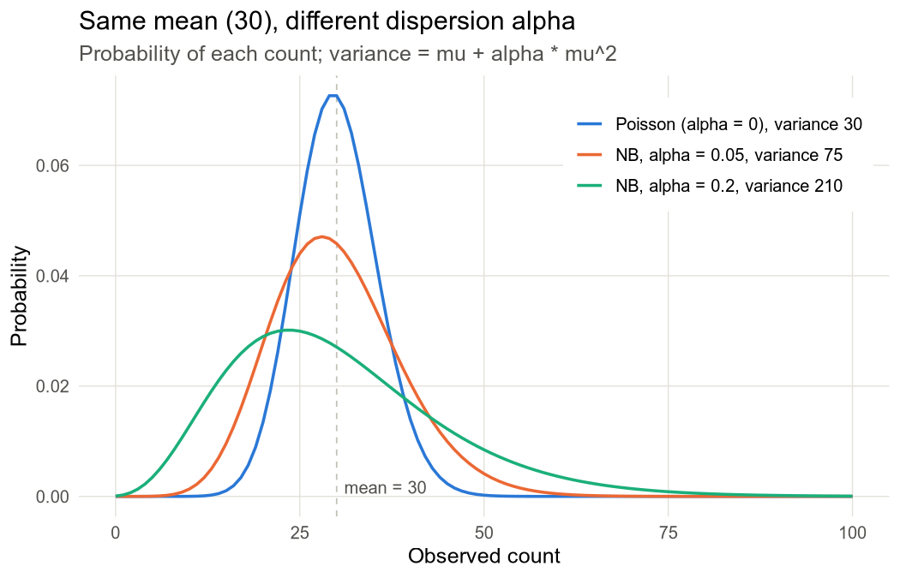
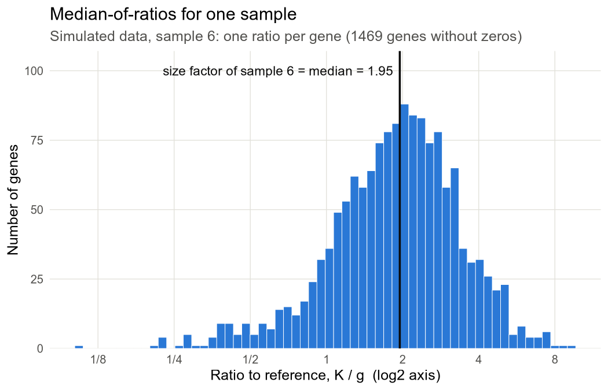

# 02. count는 얼마나 퍼지고, sequencing 깊이 차이는 어떻게 맞출까? (음이항분포와 size factor)

[01 노트](01_poisson_simulation.md)에서 같은 조건 replicate의 count가 Poisson이 예상하는 것보다 더 퍼진다는 걸 봤어요. 그럼 그 퍼짐은 숫자로 어떻게 적고, sample마다 다른 sequencing 깊이는 어떻게 맞출까요? 이 노트에서는 퍼지는 정도를 정하는 dispersion α와 음이항분포, 그리고 깊이 차이를 기대 count에 곱해서 맞추는 size factor를 차례로 계산해 봐요.

> 교재 2.3–2.4, 3장 · 코드: [02_negative_binomial.ipynb](../02_negative_binomial.ipynb)

코드는 모두 R 4.5.2, DESeq2 1.50.2에서 `suppressPackageStartupMessages(library(DESeq2)); options(digits = 6, width = 100)`을 먼저 실행한 한 세션으로 위에서부터 차례로 돌렸어요. 그래서 뒤 블록이 앞 블록에서 만든 객체를 이어 쓰고, 출력에는 "converting counts to integer mode" 같은 DESeq2 메시지도 그대로 남아 있어요.

## 1. dispersion α는 무엇을 잴까?

교재 16장의 예제 유전자 A부터 볼게요. Ctrl replicate 세 개의 count가 100, 130, 90이에요. 여기서 count $K_{ij}$는 sample $j$에서 유전자 $i$에 배정된 read(또는 fragment) 수예요.

세 값의 평균이 106.7이니까, 01 노트의 Poisson 모형대로라면 분산도 106.7 근처여야 해요. 그런데 표본분산을 구해 보면 433이 나와요. 값이 세 개뿐이라 이것만 보고 단정할 수는 없지만, biological replicate 사이에서는 이렇게 Poisson 예상보다 더 퍼지는 일이 흔해요. 01 노트에서 이걸 과산포(overdispersion)라고 불렀죠.

DESeq2는 이 초과 퍼짐을 유전자마다 숫자 하나로 적어요.

$$\mathrm{Var}(K_{ij}) = \mu_{ij} + \alpha_i\,\mu_{ij}^2$$

$\mu_{ij}$는 기대 count, 즉 모형이 sample $j$에서 유전자 $i$에 대해 예상하는 평균 count예요. 첫 항 $\mu_{ij}$는 Poisson이 이미 예상하는 몫으로, read를 무작위로 뽑는 과정에서 생기는 sampling 잡음이에요. 둘째 항 $\alpha_i\mu_{ij}^2$는 그 위에 더해지는 몫인데, replicate마다 발현 수준 자체가 조금씩 다른 데서 와요. 이 둘째 항의 크기를 정하는 계수 $\alpha_i$가 바로 유전자 $i$의 dispersion이에요. $\alpha=0$이면 둘째 항이 사라져서 Poisson과 같아지고요.

유전자 A의 최종 dispersion은 [03 노트](03_dispersion_estimation.md)에서 $\alpha=0.053147$로 나와요. 교재가 학습용으로 지정한 prior(사전분포)를 붙여서 얻은 값이에요. 이 값을 Ctrl 평균에 넣으면 분산은 $106.667 + 0.053147\times106.667^2 \approx 711$이 돼요.

```r
ctrl <- c(100, 130, 90)                  # 유전자 A의 Ctrl replicate 세 개
m <- mean(ctrl); a <- 0.053147           # a: 03 노트에서 얻는 유전자 A의 최종 dispersion
cat("평균:", m, "  세 값의 표본분산:", var(ctrl), "\n")
cat("Poisson이라면   분산:", m, "  표준편차:", sqrt(m), "\n")
cat("NB (alpha = a)   분산:", m + a*m^2, "  표준편차:", sqrt(m + a*m^2), "\n")
```
```
평균: 106.667   세 값의 표본분산: 433.333 
Poisson이라면   분산: 106.667   표준편차: 10.328 
NB (alpha = a)   분산: 711.361   표준편차: 26.6714 
```

NB(음이항분포, 2절에서 자세히 봐요)의 표준편차 26.7은 Poisson의 10.3보다 약 2.6배 넓어요. 여기서 헷갈리기 쉬운 게 있는데, α(0.053)는 분산(711)도 아니고 표준편차(26.7)도 아니에요. 저도 처음엔 dispersion을 분산의 다른 이름쯤으로 생각했어요. 모형 분산 711은 Ctrl 세 값의 표본분산 433과도 달라요. α는 Ctrl 세 값만 보고 정하는 게 아니라, Starvation 세 값까지 함께 보고 03 노트의 보정과 prior를 거쳐 정하거든요.

### 같은 α라도 평균이 다르면?

교재 p.6의 표를 다시 계산해 봤어요. 1–4행이 교재 표이고, 5–6행은 2절 그림의 범례, 7행은 연습문제 3의 값이에요.

```r
tab <- data.frame(mu = c(100,100,100,1000, 30,30, 50), alpha = c(0,0.01,0.10,0.10, 0.05,0.2, 0.2))
tab$var <- tab$mu + tab$alpha*tab$mu^2; tab$CV2 <- 1/tab$mu + tab$alpha
tab$sd_over_mu <- sqrt(tab$var)/tab$mu; print(tab)
```
```
    mu alpha    var       CV2 sd_over_mu
1  100  0.00    100 0.0100000   0.100000
2  100  0.01    200 0.0200000   0.141421
3  100  0.10   1100 0.1100000   0.331662
4 1000  0.10 101000 0.1010000   0.317805
5   30  0.05     75 0.0833333   0.288675
6   30  0.20    210 0.2333333   0.483046
7   50  0.20    550 0.2200000   0.469042
```

3행과 4행을 비교해 보세요. α는 둘 다 0.1인데 분산은 1,100과 101,000으로 약 92배나 차이 나요. 분산의 크기는 주로 μ가 정하는 거예요.

그래서 평균에 견준 상대적인 퍼짐을 따로 봐요. 표준편차를 평균으로 나눈 값을 변동계수(CV)라고 하는데, 그 제곱은 이렇게 돼요.

$$CV^2 = \frac{\mathrm{Var}(K)}{\mu^2} = \frac{1}{\mu} + \alpha$$

$1/\mu$가 Poisson 몫, $\alpha$가 추가 퍼짐의 몫이에요. 3행에 대입하면 $1/100 + 0.1 = 0.11$, 4행은 $1/1000 + 0.1 = 0.101$이에요. 절대 분산은 92배 차이가 나도 $CV^2$는 거의 같죠. μ가 커질수록 $1/\mu$는 0에 가까워지니까, α는 상대 변동이 더 내려갈 수 없는 바닥이 돼요.

### 저발현 유전자는 분산이 커서 문제일까?

이번엔 α를 0.1로 고정하고 μ만 바꿔 봤어요. `poisson_share`는 $CV^2$ 가운데 Poisson 몫 $1/\mu$가 차지하는 비율이에요.

```r
lo <- data.frame(mu = c(5, 10, 100, 1000, 10000), alpha = 0.1)
lo$var <- lo$mu + lo$alpha*lo$mu^2; lo$CV2 <- 1/lo$mu + lo$alpha
lo$poisson_share <- (1/lo$mu)/lo$CV2; print(lo)
```
```
     mu alpha       var    CV2 poisson_share
1     5   0.1 7.500e+00 0.3000   0.666666667
2    10   0.1 2.000e+01 0.2000   0.500000000
3   100   0.1 1.100e+03 0.1100   0.090909091
4  1000   0.1 1.010e+05 0.1010   0.009900990
5 10000   0.1 1.001e+07 0.1001   0.000999001
```

μ = 5에서는 절대 분산이 7.5밖에 안 돼요. 대신 $CV^2$가 0.30으로 크고, 그중 2/3가 Poisson 몫이에요. 반대로 μ가 1,000을 넘으면 $CV^2$는 α에 거의 붙어 버려요.

그러니까 "저발현 유전자는 절대 분산이 크다"는 말은 틀려요. 저발현 유전자는 read가 적어서 상대 변동이 크고, 그만큼 α와 효과의 추정이 불안정한 거예요. 이 불안정을 다루는 방법이 03 노트의 shrinkage(정보가 적은 추정치를 전체 경향 쪽으로 당기는 것)와 [06 노트](06_multiple_testing.md)의 independent filtering(평균 count가 낮은 유전자를 다중검정 보정 대상에서 빼는 절차)이에요.

## 2. 음이항분포는 어떤 모양일까?

평균이 30인 유전자를 하나 생각해 볼게요. α가 0, 0.05, 0.2일 때 각 count 값이 나올 확률을 그려 보면 아래와 같아요. 교재 p.7의 그림 1을 다시 그린 거예요.



세 곡선의 평균은 모두 30인데, α가 커질수록 봉우리가 낮아지고 양쪽 꼬리, 특히 큰 count 쪽 꼬리가 길어져요.

<details>
<summary>그림을 만든 코드</summary>

```r
library(ggplot2)
k <- 0:100
lv <- c("Poisson (alpha = 0), variance 30", "NB, alpha = 0.05, variance 75", "NB, alpha = 0.2, variance 210")
d <- rbind(data.frame(k, p = dpois(k, 30),                    model = lv[1]),
           data.frame(k, p = dnbinom(k, size = 1/0.05, mu = 30), model = lv[2]),
           data.frame(k, p = dnbinom(k, size = 1/0.2,  mu = 30), model = lv[3]))
d$model <- factor(d$model, levels = lv)
p <- ggplot(d, aes(k, p, colour = model)) +
  geom_vline(xintercept = 30, colour = "#c3c2b7", linetype = "dashed", linewidth = 0.4) +
  annotate("text", x = 31, y = 0.0005, label = "mean = 30", hjust = 0, vjust = 0, size = 3.4, colour = "#52514e") +
  geom_line(linewidth = 0.8) +
  scale_colour_manual(values = c("#2a78d6", "#eb6834", "#1baf7a"), name = NULL) +
  labs(x = "Observed count", y = "Probability",
       title = "Same mean (30), different dispersion alpha",
       subtitle = "Probability of each count; variance = mu + alpha * mu^2") +
  theme_minimal(base_size = 12) +
  theme(plot.background = element_rect(fill = "white", colour = NA),
        panel.grid.minor = element_blank(), panel.grid.major = element_line(colour = "#e1e0d9", linewidth = 0.3),
        axis.text = element_text(colour = "#52514e"), plot.subtitle = element_text(colour = "#52514e"),
        legend.position = "inside", legend.position.inside = c(0.98, 0.95), legend.justification = c(1, 1),
        legend.background = element_rect(fill = "white", colour = NA))
ggsave("../figures/02_nb_pmf_mean30.png", p, width = 7, height = 4.5, dpi = 150, bg = "white")
cat("saved:", file.exists("../figures/02_nb_pmf_mean30.png"), "\n")
```
```
saved: TRUE 
```

</details>

이 곡선들이 음이항분포(negative binomial, NB)예요. 한마디로 과산포를 허용하는 count 분포죠. DESeq2는 각 count가 $K_{ij}\sim NB(\mu_{ij},\alpha_i)$를 따른다고 두는데, count가 정확히 $k$일 확률은 이렇게 써요.

$$P(K=k)=\frac{\Gamma(k+r)}{\Gamma(r)\,k!}\Big(\frac{r}{r+\mu}\Big)^{r}\Big(\frac{\mu}{r+\mu}\Big)^{k},\qquad r=\frac{1}{\alpha}$$

$k$는 0, 1, 2, … 중 하나인 count 값이고, $\mu$는 평균, $r$은 dispersion의 역수 $1/\alpha$예요. $\Gamma$는 감마 함수인데, 정수 $n$에서 $\Gamma(n)=(n-1)!$이 되니까 factorial을 실수까지 넓힌 함수라고 보면 돼요. 이 분포의 평균은 $\mu$, 분산은 $\mu+\mu^2/r=\mu+\alpha\mu^2$예요.

그림의 주황색 곡선에 대입하면 $\mu=30$, $\alpha=0.05$, $r=20$이고 분산은 $30+30^2/20=75$예요. $\alpha\to0$이면 $r\to\infty$가 되면서 Poisson으로 돌아가요.

R의 `dnbinom()`은 같은 분포를 `size`와 `mu`로 받아요. 이때 `size`가 $r=1/\alpha$라는 점을 꼭 기억해 두세요. `size = α`로 넣으면 전혀 다른 분포가 되거든요.

```r
mu <- 30; alpha <- 0.05; r <- 1/alpha
nb_manual <- function(k, mu, r) exp(lgamma(k+r) - lgamma(r) - lgamma(k+1) + r*log(r/(r+mu)) + k*log(mu/(r+mu)))
cat("max |공식 - dnbinom|, k = 0..500:", max(abs(nb_manual(0:500, mu, r) - dnbinom(0:500, size = r, mu = mu))), "\n")
kk <- 0:2000; p <- dnbinom(kk, size = r, mu = mu)
cat("sum p =", sum(p), " E[K] =", sum(kk*p), " Var[K] =", sum(kk^2*p) - sum(kk*p)^2, " mu+alpha*mu^2 =", mu + alpha*mu^2, "\n")
cat("alpha -> 0: dnbinom(30, size=1e8, mu=30) =", dnbinom(30, size = 1e8, mu = 30), " dpois(30, 30) =", dpois(30, 30), "\n")
```
```
max |공식 - dnbinom|, k = 0..500: 2.08167e-15 
sum p = 1  E[K] = 30  Var[K] = 75  mu+alpha*mu^2 = 75 
alpha -> 0: dnbinom(30, size=1e8, mu=30) = 0.0726345  dpois(30, 30) = 0.0726345 
```

결과를 보면 위 식과 `dnbinom(size = 1/α)`의 차이는 $10^{-15}$ 수준의 반올림 오차뿐이에요. 확률로 직접 계산한 분산도 정확히 75가 나오고, α를 0에 가깝게 두면 Poisson과 같은 값이 나와요.

그림에서 본 차이를 숫자로도 적어 볼게요. 2.5 %와 97.5 % 분위수, 그리고 양쪽 꼬리 확률이에요.

```r
fig1 <- t(sapply(c(0, 0.05, 0.2), function(a) {
  sz <- if (a == 0) Inf else 1/a                      # size=Inf이면 dnbinom은 Poisson을 준다
  c(alpha = a, var = 30 + a*30^2, q2.5 = qnbinom(0.025, size = sz, mu = 30), q97.5 = qnbinom(0.975, size = sz, mu = 30),
    "P(K<=20)" = pnbinom(20, size = sz, mu = 30), "P(K>=45)" = 1 - pnbinom(44, size = sz, mu = 30)) }))
print(round(fig1, 4))
cat("size=Inf 확인: dnbinom(30, size=Inf, mu=30) =", dnbinom(30, size = Inf, mu = 30), " dpois(30,30) =", dpois(30, 30), "\n")
```
```
     alpha var q2.5 q97.5 P(K<=20) P(K>=45)
[1,]  0.00  30   20    41   0.0353   0.0063
[2,]  0.05  75   15    49   0.1298   0.0579
[3,]  0.20 210    8    64   0.2811   0.1524
size=Inf 확인: dnbinom(30, size=Inf, mu=30) = 0.0726345  dpois(30,30) = 0.0726345 
```

같은 평균 30인데 가운데 95 % 범위가 $[20,41]\to[15,49]\to[8,64]$로 넓어지고, 20 이하가 나올 확률은 3.5 %에서 28 %로 커져요(이산분포라서 이 범위에 들어갈 확률이 정확히 0.95는 아니에요). 교재가 그림 1에서 "같은 평균에서도 dispersion이 커지면 가능한 count의 범위가 넓어진다"고 한 걸 숫자로 옮긴 셈이죠. 마지막 줄은 α = 0을 `size = Inf`로 처리해도 Poisson과 같다는 걸 보여 줘요.

그런데 NB는 어디서 온 걸까요? 01 노트에서는 sample마다 Poisson의 rate 자체가 gamma 분포로 흔들린다고 두고, count의 평균이 μ, 분산이 $\mu+\alpha\mu^2$가 되는 걸 봤어요. 그 혼합분포를 적분하면 정확히 위의 NB 식이 나와요. 유도 과정은 "더 깊이 보기"의 "Poisson–gamma 혼합에서 NB 식 끌어내기"에 적어 뒀어요. 다만 이 혼합은 NB를 얻기 위한 유도 장치일 뿐, DESeq2가 sample마다 숨은 rate를 추정해서 저장하지는 않아요([01 노트](01_poisson_simulation.md) "더 깊이 보기"의 구현 확인 (3)).

## 3. 유전자 하나에 α가 왜 하나뿐일까?

유전자 A의 여섯 값을 다시 볼게요. Ctrl은 100, 130, 90(평균 106.7)이고 Starvation은 200, 250, 180(평균 210)이라서, Starvation 평균이 Ctrl의 두 배쯤 돼요.

기대 count $\mu_{ij}$는 sample마다 다를 수 있어요. 이 예제는 size factor가 모두 1이니까 Ctrl sample의 μ는 106.7, Starvation sample의 μ는 210이에요. 반면 dispersion $\alpha_A$는 유전자 A에 딱 하나예요. 두 그룹 사이의 평균 차이는 평균 쪽 계수 β(5절)가 설명하고, α는 그렇게 설명하고 남은 퍼짐, 즉 각 sample이 자기 평균 주변에서 흩어지는 정도만 맡거든요. 교재 2.4는 세 그룹(Ctrl, Starvation, Glucose)으로 설명하지만 요점은 그룹 수와 상관없어요. 여기서 Glucose는 굶긴 세포에 glucose를 다시 넣은 조건(Starvation+Glucose)을 줄여 부른 이름이에요.

그럼 평균 차이를 모형에 넣지 않으면 어떻게 될까요? 유전자 A의 α를 두 가지 design으로 추정해서 비교해 봤어요. design은 sample의 평균이 무엇에 따라 달라지는지 적은 식이에요. `~ condition`은 "Ctrl과 Starvation의 평균을 따로 둔다"는 뜻이고, `~ 1`은 "여섯 sample에 평균 하나만 둔다"는 뜻이에요.

추정에는 최대가능도추정(MLE)을 썼어요. likelihood(가능도)는 관측값을 고정해 두고, α 후보 하나하나가 그 관측값을 얼마나 그럴듯하게 만드는지 나타내는 값이에요. MLE는 그 likelihood를 가장 크게 만드는 α이고요. 아래 코드는 같은 일을 뒤집어서, likelihood의 로그에 마이너스를 붙인 값(`nll`)을 최소화해요. 자세한 계산은 03 노트에서 다뤄요.

```r
K_A <- c(100, 130, 90, 200, 250, 180)            # 유전자 A: Ctrl 3개, Starvation 3개
grp <- factor(rep(c("Ctrl", "Starvation"), each = 3))
mu_cond <- ave(K_A, grp)                          # ~condition: 각 sample의 평균 = 자기 그룹 평균
mu_one  <- rep(mean(K_A), 6)                      # ~1: 여섯 sample이 평균 하나를 공유
nll <- function(logA, mu) -sum(dnbinom(K_A, size = exp(-logA), mu = mu, log = TRUE))
mle <- function(mu) exp(optimize(nll, log(c(1e-8, 10)), mu = mu, tol = 1e-12)$minimum)
cat("그룹 평균:", unique(mu_cond), "  전체 평균:", mu_one[1], "\n")
cat("alpha MLE   ~condition:", mle(mu_cond), "   ~1:", mle(mu_one), "\n")
```
```
그룹 평균: 106.667 210   전체 평균: 158.333 
alpha MLE   ~condition: 0.014786    ~1: 0.12509 
```

`~ condition`의 0.014786은 03 노트에서 "일반 NB MLE"로 나오는 값과 같아요. 그런데 평균을 하나로 묶은 `~ 1`에서는 0.125로, 약 8.5배가 돼요. 그룹 사이의 두 배 차이가 α 안으로 새어 들어간 거죠.

유전자 1,000개짜리 simulation에서도 같은 일이 일어나요. 참 log2 fold change(LFC, 두 조건 평균 비의 log2)의 절댓값이 2를 넘는 유전자 332개를 골라서, 유전자마다 따로 구한 dispersion(gene-wise 추정치)의 중앙값을 비교했어요. `~ condition`이면 0.19, `~ 1`이면 1.32였고 참값의 중앙값은 0.37이에요. `~ 1`은 참값보다 훨씬 크게 부풀었죠. `~ condition`의 0.19가 참값보다 낮은 건 sample 6개로 유전자마다 따로 추정할 때 생기는 과소추정인데, 이건 03 노트에서 다뤄요. 이 simulation 코드는 "더 깊이 보기"에 넣어 뒀어요.

한 줄로 줄이면, **β는 평균의 구조를, α는 그 구조 주변에 남은 과산포를 설명해요.** "평균 차이가 크다"와 "조건 안에서 변동이 크다"는 서로 다른 정보예요.

## 4. sample마다 sequencing 깊이가 다르면?

sample 2를 sample 1보다 두 배 깊게 sequencing했다고 해 볼게요. 그러면 발현 수준이 똑같아도 sample 2의 count는 대략 두 배로 나와요. 이 차이를 조건 효과로 읽으면 안 되니까 깊이 차이부터 맞춰야 하죠. 그 전에 DESeq2에 무엇을 넣는지부터 짚고 갈게요.

### 입력은 왜 raw count여야 할까?

DESeq2에 넣는 건 음이 아닌 정수 count 행렬이에요. 어떤 방식으로도 나누거나 변환하지 않은 원래 count라서 raw count라고 불러요. TPM, FPKM, 로그값, VST 값(분산이 평균에 덜 의존하도록 바꾼 값, [07 노트](07_lfc_shrinkage_and_qc.md)), 이미 library size로 나눈 값은 넣지 않아요. NB 자체가 정수 위의 분포이고, 깊이 보정은 DESeq2가 count에서 다시 추정해서 모형 안의 기대 count에 곱하거든요. 이미 정규화한 값을 넣으면 보정이 두 번 일어나거나 정수 가정이 깨져요. 그래서 DESeq2는 입력 단계에서 일부를 막아요.

```r
cd <- data.frame(row.names = c("a","b"), cond = factor(c("x","y")))
tpm_like <- matrix(c(10.5, 20.25, 3.7, 8.1), 2, 2, dimnames = list(c("g1","g2"), c("a","b")))
msg <- function(expr) tryCatch(expr, error = function(e) conditionMessage(e))
print(msg(DESeqDataSetFromMatrix(tpm_like, cd, ~cond)))
print(msg(DESeqDataSetFromMatrix(matrix(c(1,-1,2,3), 2, 2, dimnames = dimnames(tpm_like)), cd, ~cond)))
x <- DESeqDataSetFromMatrix(matrix(c(1,2,3,4), 2, 2, dimnames = dimnames(tpm_like)), cd, ~cond)
cat("double이지만 정수값이면:", class(x), "/ storage mode:", storage.mode(counts(x)), "\n")
```
```
[1] "some values in assay are not integers"
[1] "some values in assay are negative"
converting counts to integer mode
double이지만 정수값이면: DESeqDataSet / storage mode: integer 
```

실수 행렬은 "not integers", 음수는 "negative" 에러로 거부돼요. 1, 2, 3, 4처럼 double로 저장되어 있어도 값이 정수면 integer로 바꿔서 받아 주고요.

그런데 TPM을 반올림하면 이 검사를 통과해요. 그렇다고 올바른 입력이 되는 건 아니에요. TPM은 이미 길이와 깊이로 나눈 값이라서 size factor 추정과 NB의 분산 구조가 의미를 잃거든요. Salmon이나 kallisto의 estimated counts는 `tximport` → `DESeqDataSetFromTximport()`, 또는 `tximeta` → `DESeqDataSet()` 경로로 가져오면 돼요. 자세한 건 "더 깊이 보기"의 tximport 부분을 보세요.

분석 전에 이것도 한 번씩 확인해 두세요.

- count가 read 단위인지 fragment 단위인지
- gene ID가 중복되지 않는지
- count 행렬의 열과 metadata의 행이 같은 순서인지
- condition이 숫자로 저장되지 않았는지

### size factor: 기대 count에 곱하는 배율

발현 수준이 같은 유전자라도 두 배 깊게 읽은 sample에서는 count가 두 배쯤 나오리라고 기대하죠. DESeq2는 이걸 곱셈으로 적어요.

$$\mu_{ij} = s_j\,q_{ij}$$

$s_j$가 sample $j$의 size factor, 즉 sequencing 깊이 차이를 맞추는 배율이에요. $q_{ij}$는 깊이를 걷어낸 발현 수준인데, 교재는 "정규화된 기대 발현"이라고 불러요.

예를 들어 $q=100$인 유전자라도 $s=2$인 sample에서는 기대 count가 200이에요. 거꾸로 count를 size factor로 나눈 $K_{ij}/s_j$는 정규화 count라고 불러요.

### size factor 구하기: median-of-ratios

총 read 수의 비율을 size factor로 쓰면 간단하겠지만, 총 read 수는 소수의 고발현 유전자에 크게 끌려가요. 그래서 DESeq2는 유전자마다 비율을 구한 뒤 그 median을 써요. 이름 그대로 median-of-ratios죠. 계산은 세 단계예요.

1. 유전자마다 모든 sample count의 기하평균 $g_i$를 구해요. 기하평균은 $n$개 값을 모두 곱해서 $n$제곱근을 취한 값이에요. 이게 "가상의 평균 sample", 즉 reference가 돼요.
2. 각 count를 reference로 나눠서 비율 $K_{ij}/g_i$를 구해요.
3. sample마다 이 비율들의 median을 취하면, 그 값이 size factor $\hat s_j$예요.

$$g_i=\Big(\prod_{j=1}^{n}K_{ij}\Big)^{1/n},\qquad \hat s_j=\operatorname{median}_i\frac{K_{ij}}{g_i}$$

$n$은 sample 수이고, median은 유전자 방향($i$)으로 취해요. 교재 p.8의 표로 직접 계산해 봤어요. 교재의 유전자 A, B, C는 공통 예제의 유전자 A와 헷갈리지 않도록 여기서 g1, g2, g3로 불러요.

```r
K <- matrix(c(100,200, 50,100, 200,400), nrow = 3, byrow = TRUE,
            dimnames = list(c("g1","g2","g3"), c("sample1","sample2")))
g <- exp(rowMeans(log(K)))              # 유전자별 기하평균 = reference
ratio <- K / g                          # 각 count가 reference의 몇 배인가
print(cbind(K, g = g, ratio))
s_hat <- apply(ratio, 2, median)        # sample별로 median
cat("size factor 손계산:", s_hat, "  비율 s2/s1 =", s_hat[2]/s_hat[1], "\n")
cat("estimateSizeFactorsForMatrix:", estimateSizeFactorsForMatrix(K), "\n")
cat("정규화 count K/s:\n"); print(t(t(K) / s_hat))
```
```
   sample1 sample2        g  sample1 sample2
g1     100     200 141.4214 0.707107 1.41421
g2      50     100  70.7107 0.707107 1.41421
g3     200     400 282.8427 0.707107 1.41421
size factor 손계산: 0.707107 1.41421   비율 s2/s1 = 2 
estimateSizeFactorsForMatrix: 0.707107 1.41421 
정규화 count K/s:
    sample1  sample2
g1 141.4214 141.4214
g2  70.7107  70.7107
g3 282.8427 282.8427
```

g1의 기하평균은 $\sqrt{100\times200}=141.42$이고, 비율은 $100/141.42=0.707$과 $200/141.42=1.414$예요. 세 유전자의 비율이 모두 같으니 median도 0.707과 1.414고요. 손계산과 `estimateSizeFactorsForMatrix()`가 같은 값을 주고, 정규화 count는 각 행에서 같아져요. 여기서 중요한 건 0.707이라는 절대값이 아니라 두 sample 사이의 비율 2예요.

다만 이 작은 예에서는 총 read 수의 비율(350 : 700)도 2라서 둘의 차이가 드러나지 않아요. 그래서 sample 2에서만 20배 높은 유전자 g4를 하나 더해 봤어요.

```r
K4 <- rbind(K, g4 = c(1000, 20000))     # sample2에서만 20배인 유전자 하나 추가
sf4 <- estimateSizeFactorsForMatrix(K4); tc4 <- colSums(K4)/mean(colSums(K4))
cat("median-of-ratios:", round(sf4, 4), " -> 비율", round(sf4[2]/sf4[1], 4), "\n")
cat("총 read 수 기준 (colSums/mean):", round(tc4, 4), " -> 비율", round(tc4[2]/tc4[1], 4), "\n")
cat("ratio 행렬:\n"); print(round(K4/exp(rowMeans(log(K4))), 4))
```
```
median-of-ratios: 0.7071 1.4142  -> 비율 2 
총 read 수 기준 (colSums/mean): 0.1224 1.8776  -> 비율 15.3333 
ratio 행렬:
   sample1 sample2
g1  0.7071  1.4142
g2  0.7071  1.4142
g3  0.7071  1.4142
g4  0.2236  4.4721
```

g4 하나 때문에 총 read 수 기준 비율은 15.3으로 뛰지만, median-of-ratios의 비율은 2 그대로예요. g4의 비율(0.22, 4.47)은 극단적이어도 median은 g1–g3가 정하거든요.

유전자가 수천 개인 자료에서도 원리는 같아요. 아래 그림은 simulation 자료의 sample 하나에서 유전자마다 비율 $K_{ij}/g_i$를 구해 히스토그램으로 그린 거예요.



유전자 하나하나의 비율은 넓게 흩어져 있어요. 가운데 80 %만 봐도 0.91–3.73이에요. size factor는 이 분포의 median 하나(1.95)이고, `sizeFactors()`가 주는 값과 같아요. 0이 하나라도 있는 유전자는 기하평균이 0이 되니까 계산에서 빠져서, 2,000개 중 1,469개만 쓰였어요.

<details>
<summary>그림을 만든 코드</summary>

```r
library(ggplot2)
set.seed(42)
dsim <- makeExampleDESeqDataSet(n = 2000, m = 6, sizeFactors = c(0.5, 1, 1.5, 0.8, 1.2, 2))
cnt <- counts(dsim)
use <- rowSums(cnt == 0) == 0                          # 0이 있는 유전자는 기본 ratio 방식에서 빠진다
g <- exp(rowMeans(log(cnt[use, ])))
rat <- cnt[use, "sample6"] / g
med <- median(rat)
cat("사용한 유전자:", sum(use), "/", nrow(cnt), "  median =", med,
    "  sizeFactors(sample6) =", sizeFactors(estimateSizeFactors(dsim))["sample6"], "\n")
cat("비율의 10%, 90% 분위수:", quantile(rat, c(0.1, 0.9)), "\n")
p <- ggplot(data.frame(rat), aes(rat)) +
  geom_histogram(bins = 60, fill = "#2a78d6", colour = "white", linewidth = 0.2) +
  geom_vline(xintercept = med, colour = "#0b0b0b", linewidth = 0.8) +
  annotate("text", x = med / 1.06, y = 100, hjust = 1, size = 3.8, colour = "#0b0b0b",
           label = sprintf("size factor of sample 6 = median = %.2f", med)) +
  scale_x_continuous(trans = "log2", breaks = 2^(-3:3), labels = c("1/8", "1/4", "1/2", "1", "2", "4", "8")) +
  scale_y_continuous(limits = c(0, 105), expand = expansion(mult = c(0, 0.02))) +
  labs(x = "Ratio to reference, K / g  (log2 axis)", y = "Number of genes",
       title = "Median-of-ratios for one sample",
       subtitle = sprintf("Simulated data, sample 6: one ratio per gene (%d genes without zeros)", sum(use))) +
  theme_minimal(base_size = 12) +
  theme(plot.background = element_rect(fill = "white", colour = NA),
        panel.grid.minor = element_blank(), panel.grid.major = element_line(colour = "#e1e0d9", linewidth = 0.3),
        axis.text = element_text(colour = "#52514e"), plot.subtitle = element_text(colour = "#52514e"))
ggsave("../figures/02_median_of_ratios.png", p, width = 7, height = 4.5, dpi = 150, bg = "white")
cat("saved:", file.exists("../figures/02_median_of_ratios.png"), "\n")
```
```
사용한 유전자: 1469 / 2000   median = 1.94983   sizeFactors(sample6) = 1.94983 
비율의 10%, 90% 분위수: 0.906005 3.72959 
saved: TRUE 
```

</details>

### median이 흔들리는 경우

median-of-ratios는 "대부분의 유전자는 sample 사이에서 변하지 않는다"는 가정에 기대요. 그래서 교재 p.8은 대부분의 유전자가 한 방향으로 크게 바뀌면 이 가정이 흔들린다고 경고해요. simulation으로 해 보니 정말 그랬어요. 유전자의 80 %에서 donor p1, p2, p3의 count를 1배, 2배, 4배로 키웠더니, p1과 p3 사이의 차이 log2 2 가운데 log2 1.70이 size factor로 흡수됐어요. 그러자 변하지 않은 나머지 20 %가 정규화 후에는 p1에서 p3로 가며 약 2.7배 줄어든 것처럼 보였고요. 같은 조작을 유전자 20 %에만 해도 일부(log2 0.40)가 흡수됐어요.

이럴 때 교재는 spike-in이나 알려진 control gene처럼 독립적인 기준을 쓰라고 해요. DESeq2에서는 `estimateSizeFactors(dds, controlGenes = ...)`가 그 역할을 하는데, median을 지정한 유전자에서만 취해요. 6절 예제에서 변하지 않은 유전자를 control로 줘 보면 size factor가 다시 1 근처로 돌아오고, 효과 추정도 이론값 쪽으로 회복돼요. 코드는 "더 깊이 보기"에 있어요.

### count에 0이 있으면?

기본 방식(`type = "ratio"`)은 0이 하나라도 있는 유전자를 median 계산에서 빼요. 그래서 모든 유전자에 0이 하나 이상 있으면 쓸 유전자가 남지 않아 에러가 나요. 이때 쓰는 대안이 `type = "poscounts"`예요. pseudocount(모든 count에 1 같은 작은 수를 더하는 것)로 입력을 바꾸는 건 대안이 아니에요. 교재가 "등의 대안"이라고 적은 것처럼 `type = "iterate"`라는 대안도 있는데, 이 노트에서는 돌려 보지 않았어요. `poscounts`가 reference를 어떻게 만드는지는 "더 깊이 보기"에서 손계산으로 따라가 봐요.

## 5. size factor는 모형의 어디에 들어갈까?

공통 예제의 유전자 A는 size factor를 모두 1로 뒀어요. 만약 Ctrl sample 하나의 size factor가 2라면, 발현 수준이 같아도 그 sample의 기대 count는 106.7이 아니라 213.3이어야 해요. DESeq2는 이 배율을 GLM 안에 넣어서 처리해요.

GLM(일반화 선형모형)은 count의 평균을 log scale에서 조건·batch 같은 요인의 합으로 표현하는 모형이에요. DESeq2의 식은 이렇게 생겼어요.

$$\log\mu_{ij}=\log s_{j}+x_j^{T}b_i$$

$x_j$는 design matrix $X$의 $j$번째 행이에요. design matrix(설계행렬)는 각 sample이 어떤 조건·batch·pair에 속하는지 숫자로 적은 표고요. $b_i$는 유전자 $i$의 계수 벡터로 자연로그 단위이고, $x_j^Tb_i$는 sample $j$의 행과 이 계수 벡터를 곱해서 더한 값이에요. 계수를 log2 단위로 바꾼 건 $\beta_i=b_i/\log 2$로 쓰는데, 그러면 같은 식을 $\mu_{ij}=s_j\,2^{x_j^T\beta_i}$로도 쓸 수 있어요.

남은 $\log s_j$가 offset이에요. offset은 식에 더해지긴 하지만 추정하지 않는 항, 다시 말해 계수가 1로 고정된 항이에요.

유전자 A에 대입해 볼게요. design은 `~ condition`이고 Ctrl이 기준이에요.

```r
X <- cbind(Intercept = 1, Starvation = rep(0:1, each = 3))   # design matrix: ~ condition
b <- c(log(320/3), log(210 / (320/3)))                    # 자연로그 계수: log(Ctrl 평균), log(Starvation 평균 / Ctrl 평균)
s_A <- rep(1, 6)                                          # 유전자 A 예제의 size factor
mu_A <- s_A * exp(X %*% b)
print(cbind(X, mu = drop(mu_A)))
cat("log2 계수 beta = b / log(2):", b / log(2), "\n")
cat("sample 1의 size factor만 2라면 그 sample의 기대 count:", 2 * exp(sum(X[1, ] * b)), "\n")
```
```
     Intercept Starvation      mu
[1,]         1          0 106.667
[2,]         1          0 106.667
[3,]         1          0 106.667
[4,]         1          1 210.000
[5,]         1          1 210.000
[6,]         1          1 210.000
log2 계수 beta = b / log(2): 6.73697 0.97728
sample 1의 size factor만 2라면 그 sample의 기대 count: 213.333
```

Ctrl 행은 $x=(1,0)$이라 $\mu=\exp(b_0)=106.667$, Starvation 행은 $x=(1,1)$이라 $\mu=\exp(b_0+b_1)=210$이에요. Starvation 계수를 log2로 바꾼 $\beta_1=0.977280$은 공통 예제에서 유전자 A의 LFC로 쓰는 바로 그 값이고요. size factor가 2가 되면 offset $\log 2$가 더해져서 기대 count가 213.3이 돼요.

"계수가 1로 고정"이라는 게 무슨 뜻인지는 size factor를 바꿔 보면 알 수 있어요. simulation 자료에 `DESeq()`를 돌린 다음, dispersion은 그대로 두고 size factor만 모두 두 배로 바꿔서 계수를 다시 구해 봤어요. 출력의 계수는 log2 단위예요.

```r
set.seed(7)
d1 <- makeExampleDESeqDataSet(n = 300, m = 6, betaSD = 1, sizeFactors = c(0.5, 1, 1.5, 0.8, 1.2, 2))
d1 <- DESeq(d1, quiet = TRUE)
d2 <- d1; sizeFactors(d2) <- 2 * sizeFactors(d1)   # dispersions(d2)는 d1 것이 그대로
d2 <- nbinomWaldTest(d2, quiet = TRUE)
print(head(cbind(coef(d1), coef(d2)), 3))
cat("intercept 차이 범위:", range(coef(d2)[,1] - coef(d1)[,1], na.rm = TRUE), "\n")
cat("condition 계수 최대 |차이|:", max(abs(coef(d2)[,2] - coef(d1)[,2]), na.rm = TRUE), "\n")
mu1 <- assays(d1)[["mu"]]; mu2 <- assays(d2)[["mu"]]
cat("mu 행렬 최대 상대 차이:", max(abs(mu2/mu1 - 1), na.rm = TRUE), "\n")
```
```
      Intercept condition_B_vs_A Intercept condition_B_vs_A
gene1   8.68204         0.587260   7.68204         0.587260
gene2  -1.22403         2.942984  -2.22402         2.942979
gene3   3.11048        -0.510782   2.11048        -0.510783
intercept 차이 범위: -1.00004 -0.999976 
condition 계수 최대 |차이|: 3.67796e-05 
mu 행렬 최대 상대 차이: 2.4514e-05 
```

절편(Intercept)은 1만큼 내려가고(차이 −1.00004 ~ −0.999976) condition 계수는 $4\times10^{-5}$ 이내로 그대로예요. $\log_2\mu=\log_2 s+\beta_0+\beta_1x$에서 $s$가 두 배가 되면, 같은 μ를 유지할 방법은 $\beta_0$를 1 줄이는 것뿐이거든요. 남은 $10^{-5}$ 수준의 차이는 반복 계산의 수치 오차예요. 수렴 허용오차나 초기값 같은 요인이 섞여 있는데, 각각의 몫까지 나눠 보지는 않았어요. 만약 자유롭게 추정하는 계수였다면 이렇게 정확히 1만큼 움직일 이유가 없어요.

size factor도 데이터에서 계산하긴 하지만, GLM 단계에서는 이미 정해진 상수로 다뤄요. 비교 삼아 $\log_2 s_j$를 design의 열로 넣어 보면, 그 계수가 유전자마다 따로 추정되어 −2.9에서 4.0까지 흩어져요.

하나 조심할 게 있어요. "배율을 바꿔도 condition 계수는 그대로"라는 건 dispersion을 고정했을 때 이야기예요. `DESeq()`를 처음부터 다시 돌리면 dispersion 추정의 초기값이 size factor의 배율에 반응해서 결과가 조금 바뀌어요. 두 실험은 "더 깊이 보기"의 "size factor의 배율을 바꾸고 DESeq()를 다시 돌리면"에 모아 뒀어요.

### 유전자 길이와 normalization factor

DESeq2는 같은 유전자를 sample끼리 비교하니까, 유전자 길이가 고정되어 있으면 비율에서 상쇄돼요. 하지만 isoform 구성이 바뀌어서 유효 길이가 sample마다 달라지면 상쇄되지 않아요. 이럴 때는 sample마다 하나인 $s_j$ 대신 유전자×sample 행렬 $s_{ij}$를 쓰는데, DESeq2는 이걸 normalization factor라고 불러요.

`tximport`에서 `countsFromAbundance = "no"`(기본값)로 가져오면 transcript 길이가 `avgTxLength`로 저장되고, `estimateSizeFactors()`가 이걸로 normalization factor를 만들어요. 직접 만든 행렬은 `estimateSizeFactors(normMatrix = ...)`로 넣으면 되고요. normalization factor가 있으면 size factor는 쓰이지 않아요.

## 6. 정규화 count는 무엇을 보정하지 않을까?

`counts(dds, normalized = TRUE)`는 count를 size factor로 나눈 $K_{ij}/s_j$예요(normalization factor가 있으면 $K_{ij}/s_{ij}$). 깊이 차이만 맞춘 값이죠.

세 그룹 예제에서 같은 donor에게서 Ctrl, Starvation, Glucose를 얻었다면 design은 `~ pair + condition`이 돼요. pair는 같은 donor에서 나온 sample 묶음이에요. 그럼 design에 pair가 들어 있으면 정규화 count에서도 pair 차이가 사라질까요? 얼핏 생각하면 사라질 것 같죠.

simulation으로 알아봤어요. donor 세 명(p1, p2, p3)에게서 조건 A, B를 하나씩 얻었다고 두고, 1,000개 유전자 중 1–200번에만 donor 효과(p1 ×1, p2 ×2, p3 ×4)를 곱했어요. condition의 참 효과는 모든 유전자에서 0이에요.

```r
set.seed(3)
dp <- makeExampleDESeqDataSet(n = 1000, m = 6, betaSD = 0)   # condition의 참 효과 = 0 (모든 유전자)
dp$pair <- factor(rep(c("p1","p2","p3"), each = 2)); dp$condition <- factor(rep(c("A","B"), 3))   # 각 pair에 A, B 하나씩
cnt <- counts(dp); eff <- c(p1 = 1, p2 = 2, p3 = 4)[as.character(dp$pair)]
cnt[1:200, ] <- round(t(t(cnt[1:200, ]) * eff)); storage.mode(cnt) <- "integer"; counts(dp) <- cnt
design(dp) <- ~ pair + condition; dp <- DESeq(dp, quiet = TRUE)
cat("sizeFactors:", round(sizeFactors(dp), 3), "\n")
nc <- counts(dp, normalized = TRUE)
pm <- sapply(split(seq_len(6), dp$pair), function(j) rowMeans(nc[, j, drop = FALSE]))
cat("정규화 count의 pair별 기하평균, gene 1-200 (pair 효과 1, 2, 4배):\n"); print(round(exp(colMeans(log(pm[1:200, ] + 0.5))), 2))
cat("gene 201-1000 (pair 효과 없음):\n"); print(round(exp(colMeans(log(pm[201:1000, ] + 0.5))), 2))
cat("resultsNames:", resultsNames(dp), "\n")
cat("GLM pair 계수(log2) 중앙값, gene 1-200:", round(apply(coef(dp)[1:200, 2:3], 2, median, na.rm = TRUE), 3), " (이론 1, 2)\n")
cat("gene 201-1000:", round(apply(coef(dp)[201:1000, 2:3], 2, median, na.rm = TRUE), 3), " (이론 0, 0)\n")
lb <- limma::removeBatchEffect(log2(nc + 1), batch = dp$pair, design = model.matrix(~ condition, colData(dp)))
cat("limma::removeBatchEffect 후 gene 1-200의 pair 평균:\n"); print(round(2^sapply(split(seq_len(6), dp$pair), function(j) mean(lb[1:200, j])), 2))
```
```
sizeFactors: 0.877 0.91 1.028 1.051 1.158 1.196 
정규화 count의 pair별 기하평균, gene 1-200 (pair 효과 1, 2, 4배):
   p1    p2    p3 
16.75 27.03 47.75 
gene 201-1000 (pair 효과 없음):
   p1    p2    p3 
15.73 14.60 12.95 
resultsNames: Intercept pair_p2_vs_p1 pair_p3_vs_p1 condition_B_vs_A 
GLM pair 계수(log2) 중앙값, gene 1-200: 0.67 1.652  (이론 1, 2)
gene 201-1000: -0.149 -0.361  (이론 0, 0)
limma::removeBatchEffect 후 gene 1-200의 pair 평균:
  p1   p2   p3 
26.2 26.2 26.2 
```

결과를 보면 정규화 count에는 pair 효과가 그대로 남아 있어요. gene 1–200의 pair별 기하평균이 17 → 27 → 48로 올라가죠. 이 효과를 흡수하는 건 GLM의 `pair_p2_vs_p1`, `pair_p3_vs_p1` 계수예요. 그림을 그리려고 pair 효과를 빼고 싶다면 `limma::removeBatchEffect` 같은 별도 연산을 써야 하고, 그러고 나면 세 pair 평균이 모두 26.2가 돼요. 각 pair에 A와 B가 하나씩 있는 균형 설계라서, 추정된 pair 평균을 빼면 구성상 정확히 같아지는 거예요.

pair 계수의 중앙값이 이론값 1, 2가 아니라 0.67, 1.65로 나온 건 4절에서 본 "median이 흔들리는 경우"예요. 20 %의 유전자가 한 방향으로 움직이자 size factor가 그 일부(log2 0.40)를 흡수했고, 그 결과 pair 효과가 없는 유전자(201–1000)는 반대 방향으로 −0.15, −0.36만큼 치우쳤어요.

결국 모형은 raw count를 적합하면서 기대 count에 size factor를 곱해요. log scale로 보면 offset을 더하는 거고요. 정규화 count를 만든 뒤 그 값을 정수 관측값처럼 다시 넣는 과정이 아니에요. 정규화 count는 그림과 요약에 쓰는 값이에요.

## 정리

- α는 분산이 아니라 Poisson을 넘어서는 추가 퍼짐의 크기예요. 분산은 $\mu+\alpha\mu^2$라서, 유전자 A의 Ctrl(평균 106.7)에 α = 0.053147을 넣으면 711이 돼요.
- $CV^2=1/\mu+\alpha$예요. 저발현 유전자는 절대 분산이 작고 상대 변동이 커요. 진짜 문제는 정보가 적어서 추정이 불안정하다는 점이에요.
- R에서는 `dnbinom(k, size = 1/α, mu = μ)`로 계산해요. 같은 평균에서 α가 커지면 나올 수 있는 count의 범위가 넓어져요.
- α는 유전자마다 하나, μ는 sample마다 달라요. 평균 차이를 design에 넣지 않으면 α가 부풀어요(유전자 A: 0.0148 → 0.125).
- size factor는 총 read 수 비율이 아니라 median-of-ratios로 구하고, $\log\mu_{ij}=\log s_j+x_j^Tb_i$에 계수가 1로 고정된 offset으로 들어가요. 대부분의 유전자가 한 방향으로 움직이면 이 median도 흔들려요.
- 정규화 count는 $K_{ij}/s_j$일 뿐이라서, design에 넣은 pair·batch 효과가 그대로 남아 있어요.

## 연습문제

**문제 1.** 한 sample의 모든 유전자 count histogram이 정규분포처럼 보이지 않는다. 이것이 DESeq2를 사용할 수 없는 직접적인 이유인가? DESeq2가 분포를 가정하는 방향을 설명하라.

<details>
<summary>풀이</summary>

아니에요. NB 가정은 "유전자 $i$를 고정하고 sample $j$ 방향으로" $K_{ij}\sim NB(\mu_{ij},\alpha_i)$라는 거예요. 한 sample 안에서 유전자들을 가로질러 그린 histogram은 서로 다른 $\mu_{ij}$와 $\alpha_i$를 가진 수천 개 분포에서 하나씩 뽑은 값을 섞어 놓은 거라서, 어떤 특정 분포를 따를 이유가 없어요. 교재 부록 B의 답도 같아요.

덧붙이면, `makeExampleDESeqDataSet`의 절편은 `interceptMean = 4, interceptSD = 2`인 정규분포(log2 스케일)에서 뽑혀요(`beta <- cbind(rnorm(n, interceptMean, interceptSD), …)`, `mu <- t(2^(x %*% t(beta)) * sizeFactors)`; "더 깊이 보기"의 소스 블록). 그래서 그 simulation에서는 유전자별 log2 평균이 정규분포를 따르는데, 이건 simulator의 선택일 뿐 sample 방향의 NB 가정과는 상관없어요.

</details>

**문제 3.** μ=50, α=0.2일 때 count의 분산과 CV²를 계산하라.

<details>
<summary>풀이</summary>

```r
cat("Var =", 50 + 0.2*50^2, " CV^2 =", 1/50 + 0.2, " CV =", sqrt(1/50+0.2), "\n")
cat("Poisson이었다면 Var =", 50, " CV^2 =", 1/50, "\n")
```
```
Var = 550  CV^2 = 0.22  CV = 0.469042 
Poisson이었다면 Var = 50  CV^2 = 0.02 
```

$\mathrm{Var}=50+0.2\times2500=550$이고 $CV^2=0.02+0.2=0.22$예요. 교재 답(550, 0.22)과 같아요. 분산 550 중 500이 $\alpha\mu^2$ 몫이고, $CV^2$ 0.22 중 0.2가 α 몫이에요. 그러니 α = 0.2는 분산 550도, 표준편차 23.5도 아니에요.

</details>

**문제 4.** `~pair+condition`에 size factor의 β 계수를 하나 더 넣는다는 설명의 잘못을 고쳐라.

<details>
<summary>풀이</summary>

size factor는 $\log\mu_{ij}=\log s_j+x_j^Tb_i$의 offset으로 들어가고 계수는 1로 고정돼요. 추정하는 건 pair와 condition 계수뿐이에요. 두 방향에서 볼 수 있어요.

1. dispersion을 고정하고 size factor를 두 배로 하면 절편이 수치 허용오차 안에서 −1 이동하고, 나머지 계수는 $4\times10^{-5}$ 이내로 그대로예요(5절). 계수가 고정되어 있어서 생기는 성질이에요.
2. 같은 $\log_2 s_j$를 design의 열로 넣으면 `resultsNames`에 `logsf`가 생기고, 그 계수는 유전자마다 −2.9에서 4.0까지 따로 추정돼요("더 깊이 보기"의 "size factor의 배율을 바꾸고 DESeq()를 다시 돌리면"). 계수를 "하나 더 넣는" 건 바로 이런 모습이에요.

코드에서도 `fitNbinomGLMs` 128행 `mu <- normalizationFactors * t(exp(modelMatrix %*% t(betaRes$beta_mat)))`처럼 `normalizationFactors`가 `modelMatrix` 바깥에서 곱해져요.

</details>

## 더 깊이 보기

<details>
<summary>DESeq2 소스에서 찾아본 것</summary>

함수 본문을 `deparse()`로 풀어서 줄 번호를 붙이고, 필요한 줄만 골라 출력했어요. 줄 번호는 DESeq2 1.50.2 기준이에요.

먼저 `estimateSizeFactors`예요. 기본 `type`은 `"ratio"`, `locfunc` 기본은 `median`이고, 경로가 네 갈래로 나뉘어요.

```r
m <- deparse(getMethod("estimateSizeFactors", "DESeqDataSet")@.Data)
cat(sprintf("[%d] %s", seq_along(m), m)[c(3:5, 12:13, 16, 22, 25, 27:31, 36:37, 40:41)], sep = "\n")
```
```
[3]     .local <- function (object, type = c("ratio", "poscounts", 
[4]         "iterate"), locfunc = stats::median, geoMeans, controlGenes, 
[5]         normMatrix, quiet = FALSE) 
[12]         if (type == "iterate") {
[13]             sizeFactors(object) <- estimateSizeFactorsIterate(object)
[16]             if (type == "poscounts") {
[22]                     exp(sum(log(x[x > 0]))/length(x))
[25]                 geoMeans <- apply(counts(object), 1, geoMeanNZ)
[27]             if ("avgTxLength" %in% assayNames(object)) {
[28]                 nm <- assays(object)[["avgTxLength"]]
[29]                 nm <- nm/exp(MatrixGenerics::rowMeans(log(nm)))
[30]                 normalizationFactors(object) <- estimateNormFactors(counts(object), 
[31]                   normMatrix = nm, locfunc = locfunc, geoMeans = geoMeans, 
[36]             else if (missing(normMatrix)) {
[37]                 sizeFactors(object) <- estimateSizeFactorsForMatrix(counts(object), 
[40]             else {
[41]                 normalizationFactors(object) <- estimateNormFactors(counts(object), 
```

`type = "iterate"`는 NB 적합을 반복하는 `estimateSizeFactorsIterate`라는 별도 경로로 가요(12–13행). `avgTxLength` assay가 있으면(tximport, `countsFromAbundance = "no"`) `normalizationFactors`를 채우고(27–31행), `normMatrix =`를 직접 줘도 `normalizationFactors`를 채워요(40–41행). 나머지 기본 경로는 `sizeFactors`를 채우고요(36–37행). `poscounts`는 0을 뺀 로그합을 전체 sample 수 `length(x)`로 나눈 기하평균을 만들어 `geoMeans`로 넘겨요(22, 25행).

다음은 median-of-ratios를 실제로 계산하는 `estimateSizeFactorsForMatrix`예요.

```r
e <- deparse(estimateSizeFactorsForMatrix)
cat(sprintf("[%d] %s", seq_along(e), e)[c(5:6, 8, 19, 23, 25:26, 28:31, 38:41, 44:45)], sep = "\n")
```
```
[5]     if (missing(geoMeans)) {
[6]         incomingGeoMeans <- FALSE
[8]             loggeomeans <- MatrixGenerics::rowMeans(log(counts))
[19]         incomingGeoMeans <- TRUE
[23]         loggeomeans <- log(geoMeans)
[25]     if (all(is.infinite(loggeomeans))) {
[26]         stop("every gene contains at least one zero, cannot compute log geometric means")
[28]     sf <- if (missing(controlGenes)) {
[29]         apply(counts, 2, function(cnts) {
[30]             exp(locfunc((log(cnts) - loggeomeans)[is.finite(loggeomeans) & 
[31]                 cnts > 0]))
[38]         loggeomeansSub <- loggeomeans[controlGenes]
[39]         apply(counts[controlGenes, , drop = FALSE], 2, function(cnts) {
[40]             exp(locfunc((log(cnts) - loggeomeansSub)[is.finite(loggeomeansSub) & 
[41]                 cnts > 0]))
[44]     if (incomingGeoMeans) {
[45]         sf <- sf/exp(mean(log(sf)))
```

로그 스케일에서 $\log K_{ij}-\log g_i$의 median을 구하고 지수를 씌워요(29–31행). `is.finite(loggeomeans) & cnts > 0`이 0이 있는 유전자를 빼는 필터예요. `controlGenes`가 주어지면 median을 그 유전자들에서만 취하는데(38–41행), 교재가 말한 spike-in / control genes가 들어가는 자리가 여기예요. 0이 있는 유전자를 빼는 필터는 이 경로에서도 같아요.

44–45행은 `geoMeans` 인자가 들어온 경우에만 size factor의 기하평균을 1로 재척도해요. dds의 `poscounts` 경로가 대표적이고, 사용자가 `geoMeans =`를 직접 넘긴 경우도 여기에 해당해요. 기본 ratio 경로에는 이 재척도가 없어요. 실제로 아래 "size factor의 세부"에서 기본 경로의 기하평균은 1.0375였는데, 같은 reference를 `geoMeans`로 넘기자 1이 됐어요.

`counts(normalized = TRUE)`와 `getSizeOrNormFactors`는 normalization factor와 size factor 중 무엇을 먼저 볼까요?

```r
cm <- deparse(getMethod("counts", "DESeqDataSet")@.Data)
cat(sprintf("[%d] %s", seq_along(cm), cm)[23:31], sep = "\n")
```
```
[23]             if (!is.null(normalizationFactors(object))) {
[24]                 return(cnts/normalizationFactors(object))
[25]             }
[26]             else if (is.null(sizeFactors(object)) || any(is.na(sizeFactors(object)))) {
[27]                 stop("first calculate size factors, add normalizationFactors, or set normalized=FALSE")
[28]             }
[29]             else {
[30]                 return(t(t(cnts)/sizeFactors(object)))
[31]             }
```

```r
cat(deparse(DESeq2:::getSizeOrNormFactors), sep = "\n")
```
```
function (object) 
{
    if (!is.null(normalizationFactors(object))) {
        return(normalizationFactors(object))
    }
    else {
        return(matrix(rep(sizeFactors(object), each = nrow(object)), 
            ncol = ncol(object)))
    }
}
```

둘 다 normalization factor가 있으면 size factor를 무시해요. `DESeq()`도 같은 순서로 검사하고요.

```r
d <- deparse(DESeq); cat(sprintf("[%d] %s", 96:110, d[96:110]), sep = "\n")
```
```
[96]     if (!is.null(sizeFactors(object)) || !is.null(normalizationFactors(object))) {
[97]         if (!quiet) {
[98]             if (!is.null(normalizationFactors(object))) {
[99]                 message("using pre-existing normalization factors")
[100]             }
[101]             else {
[102]                 message("using pre-existing size factors")
[103]             }
[104]         }
[105]     }
[106]     else {
[107]         if (!quiet) 
[108]             message("estimating size factors")
[109]         object <- estimateSizeFactors(object, type = sfType, 
[110]             quiet = quiet)
```

normalization factor가 있으면 "using pre-existing normalization factors", size factor만 있으면 "using pre-existing size factors"라는 메시지를 내고 그 값을 그대로 써요. 둘 다 없을 때만 `estimateSizeFactors(object, type = sfType)`을 부르죠. 그러니까 미리 넣어 둔 size factor를 `DESeq()`가 덮어쓰지 않아요. 참고로 normalization factor는 양의 유한값이어야 해요.

```r
nm <- deparse(getMethod("normalizationFactors<-", c("DESeqDataSet", "matrix"))@.Data)
cat(sprintf("[%d] %s", seq_along(nm), nm)[5:7], sep = "\n")
```
```
[5]         stopifnot(all(!is.na(value)))
[6]         stopifnot(all(is.finite(value)))
[7]         stopifnot(all(value > 0))
```

이제 offset이 실제로 들어가는 자리, `DESeq2:::fitNbinomGLMs`를 볼게요.

```r
f <- deparse(DESeq2:::fitNbinomGLMs)
cat(sprintf("[%d] %s", seq_along(f), f)[c(3, 31, 44, 47:48, 123:128, 143:144, 153:154)], sep = "\n")
```
```
[3]     useOptim = TRUE, useQR = TRUE, forceOptim = FALSE, warnNonposVar = TRUE, 
[31]     normalizationFactors <- getSizeOrNormFactors(object)
[44]     if (type == "glmGamPoi") {
[47]         gp_res <- glmGamPoi::glm_gp(counts(object), design = modelMatrix, 
[48]             size_factors = FALSE, offset = log(normalizationFactors), 
[123]     betaRes <- fitBetaWrapper(ySEXP = counts(object), xSEXP = modelMatrix, 
[124]         nfSEXP = normalizationFactors, alpha_hatSEXP = alpha_hat, 
[125]         beta_matSEXP = beta_mat, lambdaSEXP = lambdaNatLogScale, 
[126]         weightsSEXP = weights, useWeightsSEXP = useWeights, tolSEXP = betaTol, 
[127]         maxitSEXP = maxit, useQRSEXP = useQR, minmuSEXP = minmu)
[128]     mu <- normalizationFactors * t(exp(modelMatrix %*% t(betaRes$beta_mat)))
[143]     rowsForOptim <- if (useOptim) {
[144]         which(!betaConv | !rowStable | !rowVarPositive)
[153]         resOptim <- fitNbinomGLMsOptim(object, modelMatrix, lambda, 
[154]             rowsForOptim, rowStable, normalizationFactors, alpha_hat, 
```

128행이 $\mu_{ij}=s_{ij}\exp(x_j^Tb_i)$를 그대로 코드로 옮긴 거예요. `normalizationFactors`는 곱해지는 상수일 뿐 `modelMatrix`의 열이 아니에요. "계수 1로 고정"이 코드에서는 이렇게 구현되어 있어요.

31행의 `getSizeOrNormFactors`는 size factor만 있을 때도 유전자×sample 행렬을 만들어요. 이 행렬이 기본 C++ IRLS 루틴 `fitBetaWrapper`의 `nfSEXP`로 들어가요(123–124행). IRLS는 계수를 찾는 반복 가중 최소제곱 계산이에요. 같은 행렬이 다른 두 경로에도 그대로 넘어가는데, `type = "glmGamPoi"`이면 `glmGamPoi::glm_gp`의 `offset = log(normalizationFactors)`로 들어가고(44, 47–48행), C++ IRLS가 수렴하지 않았거나 불안정한 행은 `fitNbinomGLMsOptim`의 인자로 들어가요(143–144, 153–154행; 3행에서 `useOptim = TRUE`가 기본). 그리고 123행의 `ySEXP = counts(object)`는 raw count예요. 정규화 count를 다시 넣지 않는다는 교재 문장의 근거가 바로 이 줄이에요.

입력 검사는 `DESeqDataSet`에서 해요.

```r
s <- deparse(DESeqDataSet); cat(sprintf("[%d] %s", 20:41, s[20:41]), sep = "\n")
```
```
[20]     if ("tximetaInfo" %in% names(metadata(se))) {
[21]         se <- processTximeta(se)
[22]     }
[23]     if (any(is.na(assay(se)))) 
[24]         stop("NA values are not allowed in the count matrix")
[25]     if (any(assay(se) < 0)) {
[26]         stop("some values in assay are negative")
[27]     }
[28]     if (!skipIntegerMode & !is.integer(assay(se))) {
[29]         if (!is.numeric(assay(se))) {
[30]             stop(paste("counts matrix should be numeric, currently it has mode:", 
[31]                 mode(assay(se))))
[32]         }
[33]         if (any(round(assay(se)) != assay(se))) {
[34]             stop("some values in assay are not integers")
[35]         }
[36]         message("converting counts to integer mode")
[37]         mode(assay(se)) <- "integer"
[38]     }
[39]     if (all(assay(se) == 0)) {
[40]         stop("all samples have 0 counts for all genes. check the counting script.")
[41]     }
```

`metadata(se)`에 `tximetaInfo`가 있으면 `processTximeta(se)`로 처리하고(20–22행), 이어서 NA(23–24행)와 음수(25–27행)를 거부해요. `skipIntegerMode = FALSE`(기본)일 때만 들어가는 블록(28행) 안에서는 정수가 아닌 값이 있으면 거부하고(33–34행), double이지만 정수값이면 "converting counts to integer mode" 메시지와 함께 integer로 바꿔요(36–37행). 전부 0이면 에러예요(39–40행).

tximport 결과는 `DESeqDataSetFromTximport`로 들어와요.

```r
tx <- deparse(DESeqDataSetFromTximport); cat(sprintf("[%d] %s", 4:18, tx[4:18]), sep = "\n")
```
```
[4]     counts <- round(txi$counts)
[5]     mode(counts) <- "integer"
[6]     object <- DESeqDataSetFromMatrix(countData = counts, colData = colData, 
[7]         design = design, ...)
[8]     stopifnot(txi$countsFromAbundance %in% c("no", "scaledTPM", 
[9]         "lengthScaledTPM"))
[10]     if (txi$countsFromAbundance %in% c("scaledTPM", "lengthScaledTPM")) {
[11]         message("using just counts from tximport")
[12]     }
[13]     else {
[14]         message("using counts and average transcript lengths from tximport")
[15]         lengths <- txi$length
[16]         stopifnot(all(lengths > 0))
[17]         dimnames(lengths) <- dimnames(object)
[18]         assays(object)[["avgTxLength"]] <- lengths
```

4–5행에서 `round()`한 뒤 integer mode로 바꾸고, 10–18행에서 `countsFromAbundance`에 따라 `avgTxLength`를 저장할지 정해요. transcript 길이를 `avgTxLength` assay로 보관하는 건 `"no"`일 때뿐이에요.

마지막으로 이 노트의 simulation에 쓴 `makeExampleDESeqDataSet`이 count를 만드는 방법이에요.

```r
mk <- deparse(makeExampleDESeqDataSet); cat(sprintf("[%d] %s", seq_along(mk), mk)[c(1:3, 5:7, 16:18)], sep = "\n")
```
```
[1] function (n = 1000, m = 12, betaSD = 0, interceptMean = 4, interceptSD = 2, 
[2]     dispMeanRel = function(x) 4/x + 0.1, sizeFactors = rep(1, 
[3]         m)) 
[5]     beta <- cbind(rnorm(n, interceptMean, interceptSD), rnorm(n, 
[6]         0, betaSD))
[7]     dispersion <- dispMeanRel(2^(beta[, 1]))
[16]     mu <- t(2^(x %*% t(beta)) * sizeFactors)
[17]     countData <- matrix(rnbinom(m * n, mu = mu, size = 1/dispersion), 
[18]         ncol = m)
```

기본값은 `n = 1000, m = 12, betaSD = 0, interceptMean = 4, interceptSD = 2, dispMeanRel = function(x) 4/x + 0.1, sizeFactors = rep(1, m)`이에요. 절편은 log2 스케일 정규분포에서 뽑고(5–6행), 기대 count는 `2^(x %*% t(beta)) * sizeFactors`(16행), count는 `rnbinom(mu = mu, size = 1/dispersion)`(17행)으로 만들어요.

</details>

<details>
<summary>교재와 다르게 나온 부분</summary>

교재 설명을 코드로 돌려 보다가 교재와 다르게 나왔거나 교재에 없던 내용만 모았어요.

| 교재 주장 (p.) | 결과 | 근거 |
|---|---|---|
| $NB(\mu,\alpha)$와 R의 `dnbinom(size=1/α, mu=μ)`의 대응 (교재는 명시하지 않음) | 일치, 교재에 없던 세부 | 2절에서 최대 차이 $2\times10^{-15}$ |
| "TPM을 반올림해 count처럼 만드는 것은 올바른 복원이 아니다" (p.8) | 미확인(개념) | 반올림한 TPM은 입력 검사를 통과해서 코드가 막지 않아요. 옳지 않은 이유는 모형 가정(4절 설명)이라 코드로는 판정할 수 없어요 |
| 대부분 유전자가 한 방향으로 크게 바뀌면 불변 reference 가정이 흔들린다는 경고 (p.8) | 일치, 보충 | 80 % 유전자가 4배 움직이자 log2 2 중 1.70이 size factor로 흡수됐어요("유전자 일부 또는 대부분이 움직일 때"). 교재 조건보다 약한 6절의 20 %에서도 0.40이 흡수됐어요 |
| (교재 미언급) `estimateSizeFactors(type="poscounts")`와 `estimateSizeFactorsForMatrix(type="poscounts")`의 값 | 불일치 아님, 보충 | 비율은 같고 dds 경로만 기하평균을 1로 재척도해요("count가 0일 때: 제외 규칙과 poscounts"). 교재에 없는 사실이라 기록만 해 둬요 |
| $\log s_j$의 계수는 1로 고정되고 추정 계수가 아님 (p.9) | 일치(dispersion을 고정할 때) | dispersion을 고정하면 절편이 $-1.00004$~$-0.999976$, 즉 수치 허용오차 안에서 $-1$ 이동해요(5절, `fitNbinomGLMs` 128행). dispersion을 다시 추정하면 $-1.012$~$-0.971$로 흩어지고 condition 계수와 padj도 조금 바뀌는데, offset 때문이 아니라 gene-wise dispersion 초기값(`roughDispEstimate`)이 scale에 의존하기 때문이에요("size factor의 배율을 바꾸고 DESeq()를 다시 돌리면") |
| 표기: $\log\mu_{ij}=\log s_j+x_j^Tb_i$ 식(자연로그 계수 $b$) 바로 뒤에서 추정 계수를 "β 계수"라 부름 (p.9) | 기호 불일치(내용 무관) | 부록 C(p.39)는 $b$를 자연로그 단위, $\beta$를 log2 단위로 구분해요. 이 노트는 $b$와 $\beta$를 구분해 쓰고(5절), 교재 3.4의 해당 문장은 "condition, pair 계수"로 옮겼어요 |
| 부록 B 문제 1: sample 방향 모형 | 일치(개념) | 개념 답은 교재와 같아요. `makeExampleDESeqDataSet`의 `interceptSD=2` 이야기는 보충 설명이에요 |

나머지 교재 설명은 실제 DESeq2 동작과 맞았어요.

</details>

<details>
<summary>Poisson–gamma 혼합에서 NB 식 끌어내기</summary>

교재 2.2처럼 $K\mid\Lambda\sim\mathrm{Poisson}(\Lambda)$, $E[\Lambda]=\mu$, $\mathrm{Var}(\Lambda)=\alpha\mu^2$로 두고 $\Lambda$를 gamma로 잡으면 shape는 $r=1/\alpha$, scale은 $\alpha\mu$예요. shape·scale $=\mu$이고 shape·scale² $=\alpha\mu^2$이어야 하니까요. 01 노트의 gamma shape과 같은 $r$이에요. 주변 pmf는 이렇게 돼요.

$$P(K=k)=\int_0^\infty\frac{e^{-\lambda}\lambda^{k}}{k!}\cdot\frac{\lambda^{r-1}e^{-\lambda/(\alpha\mu)}}{\Gamma(r)(\alpha\mu)^{r}}\,d\lambda=\frac{1}{k!\,\Gamma(r)(\alpha\mu)^{r}}\int_0^\infty\lambda^{k+r-1}e^{-\lambda\,(1+\alpha\mu)/(\alpha\mu)}\,d\lambda .$$

뒤쪽 적분은 gamma 함수의 정의 $\int_0^\infty\lambda^{a-1}e^{-b\lambda}d\lambda=\Gamma(a)/b^{a}$에 $a=k+r$, $b=(1+\alpha\mu)/(\alpha\mu)$를 넣은 $\Gamma(k+r)\,(\alpha\mu)^{k+r}/(1+\alpha\mu)^{k+r}$이에요. 정리하면 이렇게 나와요.

$$P(K=k)=\frac{\Gamma(k+r)}{\Gamma(r)\,k!}\Big(\frac{1}{1+\alpha\mu}\Big)^{r}\Big(\frac{\alpha\mu}{1+\alpha\mu}\Big)^{k}$$

$1/(1+\alpha\mu)=r/(r+\mu)$, $\alpha\mu/(1+\alpha\mu)=\mu/(r+\mu)$이니까 2절의 NB pmf 그 자체예요.

숫자로도 맞춰 봤어요. 2절 블록의 `nb_manual`을 이어 써서 몇 개의 $k$에서 식과 `dnbinom`을 나란히 놓고, `prob` 모수화와 난수로도 비교했어요.

```r
mu <- 30; alpha <- 0.05; r <- 1/alpha
k <- c(0, 10, 20, 30, 40, 60)
cmp <- data.frame(k, manual = nb_manual(k, mu, r), dnbinom = dnbinom(k, size = r, mu = mu))
cmp$abs_diff <- abs(cmp$manual - cmp$dnbinom); print(cmp, digits = 10)
cat("same via prob parameterization: p = r/(r+mu) =", r/(r+mu), "; dnbinom(30,size=r,prob=r/(r+mu)) =", dnbinom(30, size = r, prob = r/(r+mu)), "\n")
set.seed(1); x <- rnbinom(1e6, size = r, mu = mu)
cat("rnbinom 1e6: mean =", mean(x), " var =", var(x), "\n")
```
```
   k          manual         dnbinom        abs_diff
1  0 1.099511628e-08 1.099511628e-08 0.000000000e+00
2 10 1.331660435e-03 1.331660435e-03 1.561251128e-17
3 20 2.770707453e-02 2.770707453e-02 2.671474153e-16
4 30 4.582342113e-02 4.582342113e-02 2.498001805e-16
5 40 2.053684624e-02 2.053684624e-02 2.532696275e-16
6 60 4.749447753e-04 4.749447753e-04 4.521123059e-17
same via prob parameterization: p = r/(r+mu) = 0.4 ; dnbinom(30,size=r,prob=r/(r+mu)) = 0.0458234 
rnbinom 1e6: mean = 29.981  var = 74.9131 
```

`size = 1/α, mu = μ`와 `size = r, prob = r/(r+μ)`는 같은 분포예요. $10^6$개 난수의 표본분산 74.9도 이론값 75와 잘 맞아요.

이번엔 위 적분을 수치로 직접 계산해서 `dnbinom`과 비교해 볼게요.

```r
gp <- function(k) integrate(function(l) dpois(k, l) * dgamma(l, shape = 1/alpha, scale = alpha*mu), 0, Inf, rel.tol = 1e-10, abs.tol = 0)$value
print(cbind(k = k, integral = sapply(k, gp), dnbinom = dnbinom(k, size = 1/alpha, mu = mu)), digits = 10)
cat("gamma의 평균 = shape*scale =", (1/alpha)*(alpha*mu), " 분산 = shape*scale^2 =", (1/alpha)*(alpha*mu)^2, " = alpha*mu^2 =", alpha*mu^2, "\n")
```
```
      k        integral         dnbinom
[1,]  0 1.099511628e-08 1.099511628e-08
[2,] 10 1.331660435e-03 1.331660435e-03
[3,] 20 2.770707453e-02 2.770707453e-02
[4,] 30 4.582342113e-02 4.582342113e-02
[5,] 40 2.053684624e-02 2.053684624e-02
[6,] 60 4.749447753e-04 4.749447753e-04
gamma의 평균 = shape*scale = 30  분산 = shape*scale^2 = 45  = alpha*mu^2 = 45 
```

10자리까지 같아요. `integrate()`의 기본 허용오차(약 $10^{-4}$의 절대오차)로는 $k=0$($10^{-8}$ 크기)과 $k=60$의 꼬리가 맞지 않아서 `rel.tol = 1e-10, abs.tol = 0`을 줬어요.

</details>

<details>
<summary>여러 유전자로 본 "α 하나"</summary>

condition 효과가 큰 simulation(`betaSD = 2`)에서 같은 count에 design만 바꿔 가며 gene-wise dispersion을 구했어요.

```r
set.seed(1)
d24 <- estimateSizeFactors(makeExampleDESeqDataSet(n = 1000, m = 6, betaSD = 2))   # condition 효과가 큰 simulation
big <- abs(mcols(d24)$trueBeta) > 2                                                # 참 log2FC의 절댓값이 2를 넘는 유전자
ge <- function(des) { design(d24) <- des; mcols(estimateDispersionsGeneEst(d24, quiet = TRUE))$dispGeneEst[big] }
cat("유전자 수:", sum(big), "\n")
cat("dispGeneEst 중앙값  ~condition:", median(ge(~ condition), na.rm = TRUE), "  ~1:", median(ge(~ 1), na.rm = TRUE),
    "  참 dispersion(trueDisp):", median(mcols(d24)$trueDisp[big]), "\n")
```
```
유전자 수: 332 
dispGeneEst 중앙값  ~condition: 0.187612   ~1: 1.31605   참 dispersion(trueDisp): 0.370905 
```

condition을 평균 구조로 두면(`~condition`) gene-wise dispersion 중앙값이 0.19이고, 모든 sample을 한 평균 주변에 두면(`~1`) 1.32로 약 7배가 돼요. 조건 사이의 평균 차이가 $\alpha$로 새어 든 거예요. `~condition`의 0.19가 참값 중앙값 0.37보다 낮은 건 sample 6개짜리 gene-wise 추정의 성질이에요. 이 과소추정도, design이 dispersion 추정에 미치는 영향의 세부나 평균을 고정한 채 $\alpha$를 최적화하는 gene-wise 단계의 구현도 모두 03 노트에서 다뤄요.

</details>

<details>
<summary>size factor의 세부: dds 메서드, 기하평균, normalization factor 우선순위</summary>

4절의 교재 표를 dds 메서드로 계산해도 같은 값이 나오는지부터 볼게요.

```r
cat("all.equal(손계산, estimateSizeFactorsForMatrix):", all.equal(unname(s_hat), unname(estimateSizeFactorsForMatrix(K))), "\n")
dds3 <- DESeqDataSetFromMatrix(K, data.frame(row.names = colnames(K), cond = factor(c("a","b"))), ~cond)
dds3 <- estimateSizeFactors(dds3)
cat("sizeFactors(dds3):", sizeFactors(dds3), "\n"); print(counts(dds3, normalized = TRUE))
cat("colSums 비율:", colSums(K)/mean(colSums(K)), "\n")
```
```
all.equal(손계산, estimateSizeFactorsForMatrix): TRUE 
converting counts to integer mode
sizeFactors(dds3): 0.707107 1.41421 
    sample1  sample2
g1 141.4214 141.4214
g2  70.7107  70.7107
g3 282.8427 282.8427
colSums 비율: 0.666667 1.33333 
```

교재 표의 141.42 / 70.71 / 282.84 / 0.707 / 1.414가 손계산, 행렬 함수, dds 메서드에서 모두 똑같이 나오고, 정규화 행렬은 각 행에서 같아요. 이 toy 자료에서는 colSums 비율(0.667, 1.333)도 2배라서 total-count 정규화와 결과가 같아 보이지만, 4절의 g4처럼 한 유전자만 바꿔도 갈라져요.

유전자가 2,000개인 simulation에서는 `sizeFactors(dds)`와 colSums 비율이 얼마나 다를까요?

```r
set.seed(42)
dds <- makeExampleDESeqDataSet(n = 2000, m = 6, sizeFactors = c(0.5, 1, 1.5, 0.8, 1.2, 2))
dds <- estimateSizeFactors(dds)
cs <- colSums(counts(dds)); sf <- sizeFactors(dds); gm <- function(x) x/exp(mean(log(x)))
out <- data.frame(true_sf = c(0.5,1,1.5,0.8,1.2,2), sizeFactors = sf, sf_scaled = gm(sf), colSums = cs, cs_scaled = gm(cs), ratio = gm(sf)/gm(cs))
print(out, digits = 4)
cat("max |sf_scaled/cs_scaled - 1| =", max(abs(out$ratio - 1)), "\n")
cat("identical(sizeFactors, colSums/mean(colSums))?", isTRUE(all.equal(unname(sf), unname(cs/mean(cs)))), "\n")
cat("geometric mean of sizeFactors(dds):", exp(mean(log(sf))), "\n")
cat("동일성 검사 sizeFactors == estimateSizeFactorsForMatrix(counts):", all.equal(sf, estimateSizeFactorsForMatrix(counts(dds))), "\n")
sf_g <- estimateSizeFactorsForMatrix(counts(dds), geoMeans = exp(rowMeans(log(counts(dds)))))   # 같은 reference를 geoMeans로 넘김
cat("geoMeans를 직접 넘기면: 비율 동일?", all.equal(sf_g/sf_g[1], sf/sf[1]), " 기하평균 =", exp(mean(log(sf_g))), "\n")
```
```
        true_sf sizeFactors sf_scaled colSums cs_scaled  ratio
sample1     0.5      0.4919    0.4741   40007    0.4566 1.0384
sample2     1.0      0.9533    0.9188   80379    0.9174 1.0016
sample3     1.5      1.4417    1.3896  126849    1.4478 0.9598
sample4     0.8      0.7880    0.7595   65961    0.7528 1.0088
sample5     1.2      1.2008    1.1574  100190    1.1435 1.0121
sample6     2.0      1.9498    1.8793  167833    1.9155 0.9811
max |sf_scaled/cs_scaled - 1| = 0.0401773 
identical(sizeFactors, colSums/mean(colSums))? FALSE 
geometric mean of sizeFactors(dds): 1.03751 
동일성 검사 sizeFactors == estimateSizeFactorsForMatrix(counts): TRUE 
geoMeans를 직접 넘기면: 비율 동일? TRUE  기하평균 = 1 
```

두 값의 기하평균을 1로 맞춰도 최대 4 % 차이가 나요. 이 simulation은 DE 유전자가 없고(`betaSD = 0`) 극단 유전자도 없어서 차이가 작은 편이에요. 실제 자료처럼 소수 유전자가 총 read의 큰 몫을 차지하면 4절의 g4 예처럼 더 벌어지고요. `sizeFactors(dds)`는 `estimateSizeFactorsForMatrix(counts(dds))`와 정확히 같고, 기하평균은 1이 아니에요(1.0375). 같은 reference를 `geoMeans =`로 직접 넘기면 비율은 그대로인 채 기하평균만 1로 재척도돼요. 그러니까 재척도 여부를 가르는 건 type이 아니라 geoMeans 인자가 들어왔는지예요.

normalization factor를 넣으면 size factor는 어떻게 될까요?

```r
dds_nf <- dds; nf <- matrix(1, nrow(dds), ncol(dds)); normalizationFactors(dds_nf) <- nf
cat("sizeFactors는 남아 있음:", round(sizeFactors(dds_nf), 4), "\n")
cat("counts(normalized=TRUE)[1,] == counts[1,] (nf=1이 쓰임):", all.equal(counts(dds_nf, normalized = TRUE)[1,], counts(dds_nf)[1,]), "\n")
cat("getSizeOrNormFactors == nf:", all.equal(unname(DESeq2:::getSizeOrNormFactors(dds_nf)), nf), "\n")
cat("nf 없을 때 getSizeOrNormFactors는 sf를 행마다 복제:", all.equal(DESeq2:::getSizeOrNormFactors(dds)[1:2,], matrix(rep(sf, each = 2), 2)), "\n")
cat("DESeq() 메시지: "); invisible(capture.output(tmp <- DESeq(dds_nf[1:50,], quiet = FALSE), type = "output"))
cat("normalizationFactors에 0을 넣으면: "); print(tryCatch({normalizationFactors(dds_nf) <- nf*0; "ok"}, error = function(e) conditionMessage(e)))
```
```
sizeFactors는 남아 있음: 0.4919 0.9533 1.4417 0.788 1.2008 1.9498 
counts(normalized=TRUE)[1,] == counts[1,] (nf=1이 쓰임): TRUE 
getSizeOrNormFactors == nf: TRUE 
nf 없을 때 getSizeOrNormFactors는 sf를 행마다 복제: TRUE 
DESeq() 메시지: using pre-existing normalization factors
estimating dispersions
gene-wise dispersion estimates
mean-dispersion relationship
final dispersion estimates
fitting model and testing
normalizationFactors에 0을 넣으면: [1] "all(value > 0) is not TRUE"
```

`sizeFactors` slot이 살아 있어도 정규화 count, GLM offset, `DESeq()` 메시지가 모두 normalization factor를 따라요. 0을 넣으면 거부되듯이 normalization factor는 양의 유한값이어야 해요(`normalizationFactors<-`의 `stopifnot`).

</details>

<details>
<summary>count가 0일 때: 제외 규칙과 poscounts</summary>

g2와 g4에 0이 하나씩 있는 행렬로 해 볼게요.

```r
K0 <- matrix(c(100,200, 0,100, 200,400, 50,0), nrow = 4, byrow = TRUE,
             dimnames = list(c("g1","g2","g3","g4"), c("s1","s2")))     # g2, g4에 0이 하나씩
cat("rowMeans(log(K0)):", rowMeans(log(K0)), "\n")
cat("ratio:", estimateSizeFactorsForMatrix(K0), " (g1, g3만 사용 -> 손계산:", exp(median((log(K0[,1]) - rowMeans(log(K0)))[c(1,3)])), ")\n")
Kall0 <- K0[c("g2","g4"), ]
cat("모든 유전자에 0이 하나씩: "); print(tryCatch(estimateSizeFactorsForMatrix(Kall0), error = function(e) conditionMessage(e)))
sf_mat <- estimateSizeFactorsForMatrix(Kall0, type = "poscounts"); cat("poscounts (같은 행렬):", sf_mat, "\n")
lc <- log(Kall0); lc[!is.finite(lc)] <- 0
cat("poscounts 손계산: loggeomeans =", rowMeans(lc), "; s1 =", exp(median((log(Kall0[,1]) - rowMeans(lc))[Kall0[,1] > 0])),
    " s2 =", exp(median((log(Kall0[,2]) - rowMeans(lc))[Kall0[,2] > 0])), "\n")
```
```
rowMeans(log(K0)): 4.95174 -Inf 5.64489 -Inf 
ratio: 0.707107 1.41421  (g1, g3만 사용 -> 손계산: 0.707107 )
모든 유전자에 0이 하나씩: [1] "every gene contains at least one zero, cannot compute log geometric means"
poscounts (같은 행렬): 7.07107 10 
poscounts 손계산: loggeomeans = 2.30259 1.95601 ; s1 = 7.07107  s2 = 10 
```

g2, g4는 기하평균이 0($\log$ 평균이 $-\infty$)이라 ratio 계산에서 빠지고, g1, g3만으로 0.707/1.414가 나와요. g2, g4만 남기면 에러가 나고요. `poscounts`는 $\log 0$을 0으로 두고 전체 sample 수 $n=2$로 나눈 "축소된" 기하평균을 reference로 삼아요($e^{2.30}=10$, $e^{1.96}\approx7.07$). 0이 아닌 값만으로 기하평균을 냈다면 100과 50이었을 거예요.

그런데 같은 행렬을 dds 메서드로 계산하면 값이 달라져요.

```r
dd0 <- DESeqDataSetFromMatrix(Kall0, data.frame(row.names = c("s1","s2"), c = factor(c("a","b"))), ~c)
sf_dds <- sizeFactors(estimateSizeFactors(dd0, type = "poscounts", quiet = TRUE))
cat("matrix poscounts:", sf_mat, " geomean =", exp(mean(log(sf_mat))), "\n")
cat("dds    poscounts:", sf_dds, " geomean =", exp(mean(log(sf_dds))), "\n")
cat("비율 s2/s1은 동일:", sf_mat[2]/sf_mat[1], sf_dds[2]/sf_dds[1], "; dds 값 == matrix 값/geomean:",
    all.equal(unname(sf_dds), unname(sf_mat/exp(mean(log(sf_mat))))), "\n")
```
```
converting counts to integer mode
matrix poscounts: 7.07107 10  geomean = 8.40896 
dds    poscounts: 0.840896 1.18921  geomean = 1 
비율 s2/s1은 동일: 1.41421 1.41421 ; dds 값 == matrix 값/geomean: TRUE 
```

`estimateSizeFactors(dds, type = "poscounts")`는 `geoMeans`를 만들어 넘기기 때문에 `incomingGeoMeans = TRUE`가 되어 기하평균 1로 재척도되고, `estimateSizeFactorsForMatrix(type = "poscounts")`는 재척도하지 않아요. sample 사이의 비율은 같으니 dispersion을 고정하면 절편만 이동해요(5절). 하지만 `DESeq()`를 처음부터 돌리면 gene-wise dispersion의 초기값이 size factor의 scale에 의존해서("size factor의 배율을 바꾸고 DESeq()를 다시 돌리면") dispersion, p 값, padj가 조금 달라질 수 있어요. 값을 눈으로 비교할 때도 헷갈리기 쉽고요.

</details>

<details>
<summary>tximport와 tximeta로 가져올 때</summary>

제 환경에는 tximport가 설치되어 있지 않아서, `tximport()`의 출력과 같은 모양의 list를 직접 만들어 `DESeqDataSetFromTximport()`에 넣었어요.

```r
cat("DESeqDataSetFromTximport 4-5행:", deparse(DESeqDataSetFromTximport)[4:5], "\n")
txi <- list(counts = matrix(c(10, 20, 30, 40), 2, 2, dimnames = dimnames(tpm_like)), length = matrix(1000, 2, 2), countsFromAbundance = "no")
cat("countsFromAbundance = 'no'        -> assayNames:", assayNames(DESeqDataSetFromTximport(txi, cd, ~cond)), "\n")
txi$countsFromAbundance <- "scaledTPM"
cat("countsFromAbundance = 'scaledTPM' -> assayNames:", assayNames(DESeqDataSetFromTximport(txi, cd, ~cond)), "\n")
```
```
DESeqDataSetFromTximport 4-5행:     counts <- round(txi$counts)     mode(counts) <- "integer" 
using counts and average transcript lengths from tximport
countsFromAbundance = 'no'        -> assayNames: counts avgTxLength 
using just counts from tximport
countsFromAbundance = 'scaledTPM' -> assayNames: counts 
```

`avgTxLength` assay가 있어야 `estimateSizeFactors`가 normalization factor 경로(`estimateSizeFactors` 27–31행)를 타요. `scaledTPM`/`lengthScaledTPM`으로 만든 count에는 이 assay가 없으니 보통의 size factor로 처리되고요.

그렇다고 길이 보정이 빠진 건 아니에요. tximport 소스(`makeCountsFromAbundance`)를 보면 `scaledTPM`은 TPM(이미 effective length로 나눈 값)을 library size에 맞춰 키운 것이고, `lengthScaledTPM`은 TPM에 유전자별 sample 평균 길이를 곱한 뒤 같은 척도로 맞춘 거예요. 두 방식 모두 sample마다 다른 길이의 영향을 count에 미리 반영하니까 offset이 필요 없어요. 다만 이 부분은 tximport 소스를 읽기만 했고 실행해 보지는 않았어요.

tximeta 경로에서는 `DESeqDataSet()`이 `metadata(se)`의 `tximetaInfo`를 보고 `processTximeta`로 처리해요(소스 블록의 `DESeqDataSet` 20–22행).

</details>

<details>
<summary>size factor의 배율을 바꾸고 DESeq()를 다시 돌리면</summary>

먼저 offset 대신 공변량으로 넣으면 어떻게 될까요? 5절의 `d1`에서 size factor를 1로 두고 $\log_2 s_j$를 design의 열로 넣었어요.

```r
d3 <- d1; d3$logsf <- log2(sizeFactors(d1)); sizeFactors(d3) <- rep(1, 6)
design(d3) <- ~ logsf + condition; d3 <- DESeq(d3, quiet = TRUE)
print(summary(coef(d3)[, "logsf"]))
cat("resultsNames(d3):", resultsNames(d3), "\n")
```
```
   Min. 1st Qu.  Median    Mean 3rd Qu.    Max.    NA's 
 -2.931   0.513   1.021   1.013   1.583   3.967       1 
resultsNames(d3): Intercept logsf condition_B_vs_A 
```

중앙값은 1 근처지만 유전자별로 −2.9에서 4.0까지 흩어져요. offset이 "추정하는 계수가 하나 더 붙는 것"이 아니라는 걸 반대 방향에서 보여 주는 실험이에요.

이번엔 size factor를 두 배로 바꾼 뒤 dispersion까지 다시 추정해 봤어요.

```r
d2r <- d1; sizeFactors(d2r) <- 2 * sizeFactors(d1); d2r <- DESeq(d2r, quiet = TRUE)   # dispersion 재추정
cat("DESeq(d2r) 절편 차이 범위:", range(coef(d2r)[,1] - coef(d1)[,1], na.rm = TRUE), " 중앙값:", median(coef(d2r)[,1] - coef(d1)[,1], na.rm = TRUE), "\n")
dc <- coef(d2r)[,2] - coef(d1)[,2]
cat("condition 계수 최대 |차이|:", max(abs(dc), na.rm = TRUE), "; 1e-3 넘게 바뀐 유전자:", sum(abs(dc) > 1e-3, na.rm = TRUE), "/", sum(!is.na(dc)),
    "; padj<0.1 개수 d1, d2r:", sum(results(d1)$padj < 0.1, na.rm = TRUE), sum(results(d2r)$padj < 0.1, na.rm = TRUE), "\n")
g1 <- mcols(d1)$dispGeneEst; g2 <- mcols(d2r)$dispGeneEst; chg <- which(abs(g2/g1 - 1) > 1e-3)
cat("gene-wise dispersion이 0.1 % 이상 바뀐 유전자:", length(chg), "/", sum(!is.na(g1)), "; 그중 1e-8(minDisp)로 붕괴:", sum(g2[chg] <= 1e-7), "\n")
cat("trend 계수 (a0, a1)  d1:", attr(dispersionFunction(d1), "coefficients"), "  d2r:", attr(dispersionFunction(d2r), "coefficients"), "\n")
```
```
DESeq(d2r) 절편 차이 범위: -1.01175 -0.970659  중앙값: -0.999992 
condition 계수 최대 |차이|: 0.0298464 ; 1e-3 넘게 바뀐 유전자: 193 / 299 ; padj<0.1 개수 d1, d2r: 53 49 
gene-wise dispersion이 0.1 % 이상 바뀐 유전자: 61 / 299 ; 그중 1e-8(minDisp)로 붕괴: 48 
trend 계수 (a0, a1)  d1: 0.115638 5.47721   d2r: 0.108227 3.46123 
```

절편 이동이 −1.012에서 −0.971까지(최대 3 %) 흩어져요. 중앙값은 −1.0000이라 대부분 유전자는 그대로지만, condition 계수도 최대 0.03 바뀌고(299개 중 193개가 $10^{-3}$ 넘게) padj < 0.1인 유전자는 53개에서 49개로 줄어요. 결국 "size factor의 scale은 상관없다"는 말은 dispersion을 고정했을 때만 맞아요.

달라진 곳은 dispersion이에요. gene-wise 추정치가 299개 중 61개에서 바뀌고, 그중 48개는 `minDisp` = $10^{-8}$로 붕괴해요. trend 계수도 바뀌는데, $a_1$이 단순히 반으로 줄지도 않아요. 어느 단계에서 scale이 새어 드는지는 다음 블록으로 추적했어요.

```r
gs <- deparse(estimateDispersionsGeneEst); fs <- deparse(estimateDispersionsFit)
cat(sprintf("[GeneEst %d] %s", 40:43, gs[40:43]), sprintf("[Fit %d] %s", 8, fs[8]), sep = "\n")   # 소스 일부 출력
nz1 <- d1[!mcols(d1)$allZero, ]; nz2 <- d2r[!mcols(d2r)$allZero, ]; X <- model.matrix(design(d1), colData(d1))
m1 <- DESeq2:::momentsDispEstimate(nz1); m2 <- DESeq2:::momentsDispEstimate(nz2)
r1 <- DESeq2:::roughDispEstimate(counts(nz1, normalized = TRUE), X); r2 <- DESeq2:::roughDispEstimate(counts(nz2, normalized = TRUE), X)
cat("momentsDispEstimate 최대 상대 차이:", max(abs(m2/m1 - 1)), "; roughDispEstimate = 0인 유전자 d1, d2r:", sum(r1 == 0), sum(r2 == 0), "\n")
col <- match(rownames(d1)[chg][g2[chg] <= 1e-7], rownames(nz1))
cat("붕괴한 유전자 중 roughDispEstimate = 0: d2r", sum(r2[col] == 0), "/", length(col), ", d1", sum(r1[col] == 0), "; 이들의 d1 dispGeneEst 최대:", max(g1[chg][g2[chg] <= 1e-7]), "\n")
d2i <- estimateDispersionsGeneEst(d2r, alphaInit = pmin(r1, m1), quiet = TRUE)   # d2r에 d1의 초기값을 준다
cat("d1의 초기값으로 d2r을 추정하면 dispGeneEst 최대 상대 차이:", max(abs(mcols(d2i)$dispGeneEst/g1 - 1), na.rm = TRUE), "\n")
```
```
[GeneEst 40]         roughDisp <- roughDispEstimate(y = counts(objectNZ, normalized = TRUE), 
[GeneEst 41]             x = modelMatrix)
[GeneEst 42]         momentsDisp <- momentsDispEstimate(objectNZ)
[GeneEst 43]         alpha_hat <- pmin(roughDisp, momentsDisp)
[Fit 8]     useForFit <- mcols(objectNZ)$dispGeneEst > 100 * minDisp
momentsDispEstimate 최대 상대 차이: 0 ; roughDispEstimate = 0인 유전자 d1, d2r: 38 87 
붕괴한 유전자 중 roughDispEstimate = 0: d2r 48 / 48 , d1 0 ; 이들의 d1 dispGeneEst 최대: 10 
d1의 초기값으로 d2r을 추정하면 dispGeneEst 최대 상대 차이: 0 
```

gene-wise 최적화의 초기값은 `pmin(roughDisp, momentsDisp)`예요(GeneEst 40–43행). 둘 중 `momentsDispEstimate`는 $(\text{baseVar}-\bar{x}\,\text{baseMean})/\text{baseMean}^2$이고 $\bar x=$`mean(1/s_j)`예요. $s\to2s$이면 baseMean과 $\bar x$가 반, baseVar가 1/4이 되니까 정확히 그대로예요(최대 차이 0).

원인은 `roughDispEstimate` 쪽이에요. 이 함수는 정규화 count $y$를 raw count처럼 다뤄서 $\frac{1}{m-p}\sum_j\frac{(y_j-\hat\mu_j)^2-\hat\mu_j}{\hat\mu_j^2}$를 계산하고 음수를 0으로 잘라요($\hat\mu$에는 `pmax(1, mu)` 하한도 있어요). $y$가 절반이 되면 첫 항은 그대로인데 Poisson 항 $-1/\hat\mu_j$만 두 배가 돼요. 그래서 0으로 잘리는 유전자가 38개에서 87개로 늘어나요.

붕괴한 48개는 모두 d2r에서 rough가 0이라 초기값이 `minDisp`로 잘린 유전자예요(d1에서는 0개). d1 추정치가 10이던 유전자도 들어 있으니, 원래 작던 값이 반올림된 게 아니에요. d1의 초기값을 `alphaInit`으로 넘기면 d2r의 gene-wise 추정치가 d1과 정확히 같아져요(차이 0). 차이가 전부 초기값에서 온다는 뜻이죠. 붕괴한 유전자는 trend 적합에서 빠지기 때문에(Fit 8행 `useForFit`) trend 계수도 따라 바뀌고요.

요컨대 원인은 offset(GLM 단계, 5절에서 $10^{-5}$)이 아니라 dispersion 추정의 초기값이에요. 그 단계의 세부는 03 노트에서 다뤄요.

</details>

<details>
<summary>유전자 일부 또는 대부분이 움직일 때: controlGenes</summary>

6절 simulation의 설정부터 다시 정리할게요. 1,000개 유전자 중 1–200번에만 pair 효과(p1 ×1, p2 ×2, p3 ×4)를 곱했어요. 일부 유전자에만 있는 효과는 library size가 아니니까 size factor로 사라져서는 안 돼요. condition 효과는 없게 만들었고(`betaSD = 0`), `makeExampleDESeqDataSet`이 condition을 A A A B B B로 만들기 때문에 각 pair에 A와 B가 하나씩 들어가도록 label을 다시 붙였어요. 참 condition 효과가 모든 유전자에서 0이라 이렇게 다시 붙여도 참값은 그대로예요. 따라서 gene 201–1000의 pair 계수와 condition 계수는 유전자마다 참값이 0이에요.

6절 결과에서 size factor가 흡수한 몫은 p3의 $s_j$ 평균 1.18 대 p1의 0.89, 즉 $\log_2(1.177/0.894)\approx0.40$이에요. 두 무리의 차이(0.67 + 0.15 ≈ 0.82, 1.65 + 0.36 ≈ 2.01)를 보면 p3에서는 이론값 2에 가까워요. p2는 아래에서 reference를 바로잡은 뒤에도 0.85에 머무르니까, 200개 유전자 중앙값 자체가 흔들린 걸로 보여요. 교재 3.3의 조건("대부분의 유전자")보다 약한 20 %에서도 같은 기제가 벌써 보이는 셈이에요.

교재의 처방대로 control genes로 reference를 고정해 볼게요.

```r
dpc <- estimateSizeFactors(dp, controlGenes = 201:1000)   # pair 효과가 없는 유전자만 reference로
cat("controlGenes=201:1000 sizeFactors:", round(sizeFactors(dpc), 3), "\n")
dpc <- DESeq(dpc, quiet = TRUE)
cat("pair 계수 중앙값, gene 1-200:", round(apply(coef(dpc)[1:200, 2:3], 2, median, na.rm = TRUE), 3),
    " / gene 201-1000:", round(apply(coef(dpc)[201:1000, 2:3], 2, median, na.rm = TRUE), 3), "\n")
```
```
controlGenes=201:1000 sizeFactors: 0.996 1.015 1.024 1.047 1.037 1.058 
pair 계수 중앙값, gene 1-200: 0.846 1.99  / gene 201-1000: 0.026 -0.024 
```

영향받지 않은 유전자만으로 median을 취하면 size factor가 pair와 상관없어져요(모두 ≈ 1). pair 계수 중앙값도 0.85/1.99와 0.03/−0.02로 이론값 쪽으로 돌아오고요. 다만 실제 자료에서는 어느 유전자가 "영향받지 않았는지" 모르니까 spike-in이나 사전 지식이 필요해요. 교재가 말하는 게 바로 이거예요.

그럼 대부분(80 %)의 유전자가 한 방향으로 움직이면 어떻게 될까요?

```r
dp8 <- dp; cnt8 <- counts(dp); cnt8[201:800, ] <- round(t(t(cnt8[201:800, ]) * eff)); storage.mode(cnt8) <- "integer"
counts(dp8) <- cnt8; dp8 <- estimateSizeFactors(dp8)   # 이제 1-800 (80 %)에 pair 효과
lr <- function(d) round(log2(mean(sizeFactors(d)[5:6])/mean(sizeFactors(d)[1:2])), 3)
cat("20 % 이동: sizeFactors", round(sizeFactors(dp), 3), " log2(s_p3/s_p1) =", lr(dp), "\n")
cat("80 % 이동: sizeFactors", round(sizeFactors(dp8), 3), " log2(s_p3/s_p1) =", lr(dp8), " (효과가 전부 size factor로 흡수되면 2)\n")
nc8 <- counts(dp8, normalized = TRUE); pm8 <- sapply(split(seq_len(6), dp8$pair), function(j) rowMeans(nc8[801:1000, j, drop = FALSE]))
g8 <- exp(colMeans(log(pm8 + 0.5)))   # J 절과 같은 지표
cat("영향 없는 gene 801-1000, 정규화 count의 pair별 기하평균:", round(g8, 2), " p1/p3 =", round(g8[1]/g8[3], 2), "; s_p3/s_p1 =", round(2^lr(dp8), 2), "\n")
```
```
20 % 이동: sizeFactors 0.877 0.91 1.028 1.051 1.158 1.196  log2(s_p3/s_p1) = 0.397 
80 % 이동: sizeFactors 0.559 0.579 1.028 1.051 1.816 1.887  log2(s_p3/s_p1) = 1.702  (효과가 전부 size factor로 흡수되면 2)
영향 없는 gene 801-1000, 정규화 count의 pair별 기하평균: 25.61 15.47 9.39  p1/p3 = 2.73 ; s_p3/s_p1 = 3.25 
```

80 %의 유전자가 4배 움직이자 median이 그 무리 안으로 들어가서, pair 효과 log2 2 중 1.70이 size factor가 됐어요. "불변 reference" 가정이 무너진 거죠. 이때 영향받지 않은 20 % 유전자(801–1000)는 정규화 후 p1 → p3로 약 2.7배(6절과 같은 기하평균 지표로 25.6 → 9.4) 줄어든 것처럼 보여요. size factor 비율로 따지면 $2^{1.70}\approx3.25$배고요. 교재 p.8의 경고가 그대로 나타난 셈이에요.

</details>

<details>
<summary>자주 하는 오해</summary>

| 오해 | 실제로는 |
|---|---|
| dispersion이 크면 분산이 크다 | 같은 $\mu$에서는 맞아요(2절, $\mu=30$에서 분산 30 → 75 → 210). 하지만 $\mu$가 다르면 아니에요. 분산은 $\mu+\alpha\mu^2$라서 $\alpha=0.1,\mu=100$의 분산(1,100)이 $\alpha=0.01,\mu=1000$의 분산(11,000)보다 작아요. $\alpha$는 $CV^2$의 바닥이에요. |
| 저발현 유전자는 분산이 커서 문제다 | 절대 분산은 오히려 작아요. $CV^2=1/\mu+\alpha$에서 $1/\mu$가 커서 상대 변동이 크고, 그래서 추정이 불안정한 거예요. |
| `dnbinom(size=α)`로 쓰면 된다 | `size`는 $1/\alpha$예요. 2절의 대응은 `size=1/alpha, mu=mu`일 때만 성립해요. |
| size factor는 총 read 수 비율이다 | median-of-ratios예요. "size factor의 세부"에서는 기하평균을 맞춘 뒤에도 최대 4 %, 4절 극단 유전자 예에서는 약 7.7배(비율 2 vs 15.3) 차이가 났어요. |
| size factor는 기하평균 1로 정규화된다 | 기본 ratio 경로에서는 아니에요(1.0375). `geoMeans`가 넘어올 때만(dds의 poscounts 경로, 또는 직접 전달) 재척도해요. |
| 모든 유전자에 0이 있으면 pseudocount를 더한다 | `type="poscounts"`가 $\log 0$을 0으로 두고 $n$으로 나눈 축소 기하평균을 써요. 입력은 건드리지 않아요. |
| 대부분 유전자가 움직여도 median이 지켜 준다 | 20 %만 움직여도 일부가 흡수되고(0.40), 80 %면 대부분 흡수돼요(1.70/2). 그럴 때는 `controlGenes=`나 spike-in이 필요해요. |
| 정규화 count를 다시 DESeq2에 넣는다 | 모형은 raw count를 적합하고 size factor는 offset으로 들어가요. 정규화 count는 시각화·요약용이고 정수도 아니에요(4절 입력 블록에서 거부돼요). |
| `~pair+condition`이면 `counts(normalized=TRUE)`가 pair를 제거한다 | 제거하지 않아요(6절). pair는 GLM 계수가 흡수하고, 그림용으로 뺄 때는 `removeBatchEffect`를 써요. |
| 미리 설정한 sizeFactors는 `DESeq()`가 다시 추정해 덮어쓴다 | `DESeq()`는 이미 있는 sizeFactors/normalizationFactors를 그대로 써요("using pre-existing …"). |
| normalizationFactors를 넣어도 sizeFactors가 함께 쓰인다 | normalizationFactors가 있으면 sizeFactors는 무시돼요(`getSizeOrNormFactors`, "size factor의 세부"). |
| tximport의 어떤 옵션이든 DESeq2가 길이 offset을 건다 | 길이 offset(`avgTxLength` → normalization factor)은 `countsFromAbundance="no"`일 때만 걸려요. `scaledTPM`/`lengthScaledTPM`은 길이를 count에 미리 반영하는 방식이라 DESeq2는 보통의 size factor만 써요(tximport 소스를 읽은 내용이고 실행은 안 해 봤어요). |

</details>

<details>
<summary>다음 노트와 이어지는 부분</summary>

$\alpha_i$가 유전자마다 하나라고 했지만, 그 값을 어떻게 얻는지는 아직 이야기하지 않았어요. [03 노트](03_dispersion_estimation.md)에서 gene-wise MLE, Cox-Reid 조정, trend, MAP shrinkage를 다뤄요.

size factor의 scale을 바꾸면 gene-wise dispersion 추정치 일부가 `minDisp`로 붕괴하고 trend 계수가 바뀌었죠. 그 원인이 gene-wise 최적화 초기값 `pmin(roughDispEstimate, momentsDispEstimate)` 중 `roughDispEstimate` 쪽(정규화 count를 raw count처럼 다룸)이라는 데까지는 찾았어요. 03 노트에서 초기값과 최적화 경로를 볼 때 다시 꺼낼게요.

offset이 고정된 상태에서 $\beta$와 SE가 어떻게 나오는지는 [04 노트](04_glm_condition_batch.md)에서 봐요. 여기서 본 두 가지, 곧 `getSizeOrNormFactors`가 만든 행렬이 `fitBetaWrapper`의 `nfSEXP`로 들어간다는 것과 `DESeq()`가 기존 size factor를 덮어쓰지 않는다는 것은 03, 04 노트의 재현 실험에서 전제로 쓰여요.

</details>

---

← 이전: [01. Poisson과 과산포](01_poisson_simulation.md) · 다음: [03. dispersion 추정](03_dispersion_estimation.md) →
