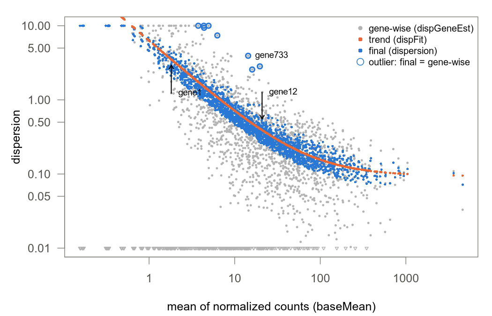

# 03. replicate 세 개로 dispersion α를 어떻게 정할까?

count가 Poisson보다 더 퍼진다는 것은 [02 노트](02_negative_binomial.md)에서 봤는데, 그 퍼짐의 크기 $\alpha$를 replicate 세 개로 어떻게 정하는지가 궁금했다. 이 노트에서는 유전자 A의 count 여섯 개로 $\alpha$를 세 번 구해 보고(0.0148 → 0.0254 → 0.0531), DESeq2가 다른 유전자들의 정보를 빌려 최종 $\alpha$를 정하는 과정을 따라가 본다.

> 교재 5–7장 · 코드: [03_dispersion_estimation.R](../03_dispersion_estimation.R)

## 1. 표본분산으로 α를 바로 구하면 안 될까?

이 노트 내내 교재 16장의 유전자 A를 예로 든다. 두 조건에 replicate가 세 개씩 있다.

| 조건 | count | 그룹 평균 |
|---|---|---|
| Ctrl | 100, 130, 90 | 106.667 |
| Starvation | 200, 250, 180 | 210 |

count $K_{ij}$는 sample $j$에서 유전자 $i$에 배정된 read 수이다. 이 노트는 대부분 유전자 하나만 다루니까 $i$를 자주 빼고 $K_j$로 쓴다. size factor는 sample마다 다른 sequencing 깊이를 맞추는 배율인데, 여기서는 여섯 sample 모두 1이다.

[02 노트](02_negative_binomial.md)에서 count의 분산을 $\mu+\alpha\mu^2$로 썼다. $\mu$는 기대 count, 즉 모형이 그 sample에서 예상하는 평균 count이다. dispersion $\alpha$는 Poisson이 예상하는 분산 $\mu$ 위에 더 얹히는 퍼짐의 크기이고, $\alpha=0$이면 Poisson과 같다. $\alpha$가 분산 자체는 아니라는 점은 꼭 기억해 둔다. 그러면 count 여섯 개에서 $\alpha$를 어떻게 정할까?

가장 먼저 떠오르는 방법은 분산식을 거꾸로 푸는 것이다. 표본분산 $s^2$가 $\bar K+\alpha\bar K^2$와 비슷하다고 보면 이렇게 된다.

$$\hat\alpha_{moment}\approx\frac{s^2-\bar K}{\bar K^2}$$

$\bar K$는 count의 평균, $s^2$는 표본분산이고, 기호 위의 모자($\hat{\ }$)는 데이터로 구한 추정값이라는 표시다. 분자는 관측된 퍼짐에서 Poisson 몫을 뺀 나머지이고, 이것을 평균²으로 나눠 $\alpha$로 바꾸는 것이다. 이런 방법을 moment 추정이라고 부른다.

```r
K <- c(100, 130, 90, 200, 250, 180)
mom_g <- function(k) (var(k) - mean(k)) / mean(k)^2      # moment 추정
round(c(mean = mean(K), var = var(K), all_six = mom_g(K)), 6)
#>        mean         var     all_six 
#>  158.333333 3896.666667    0.149119
round(c(Ctrl = mom_g(K[1:3]), Starvation = mom_g(K[4:6])), 5)
#>       Ctrl Starvation 
#>    0.02871    0.02472
```

여섯 값을 한데 넣으면 0.149, 그룹별로 나누면 0.029와 0.025로 다섯 배 넘게 차이가 난다. 여섯 값을 섞은 분산에는 Ctrl과 Starvation의 평균 차이(106.7 대 210)가 들어 있어서, 처리 효과까지 replicate 사이의 퍼짐으로 세어 버린 것이다.

그룹별로 나누면 이 문제는 피할 수 있다. 그런데 실제 실험에서는 size factor가 sample마다 다르고 batch나 donor 효과도 함께 있어서, 같은 평균을 공유하는 sample끼리 깔끔하게 묶이지 않는 경우가 많다. 평균 구조가 복잡해도 쓸 수 있는 기준이 필요한데, 그것이 다음 절의 likelihood이다. 그렇다고 DESeq2가 moment 추정을 버리지는 않는다. 가장 좋은 $\alpha$를 컴퓨터로 찾아 나갈 때 출발점(초기값)을 고르는 데 쓴다(더 깊이 보기의 "DESeq2 소스 읽기 (1)").

## 2. 어떤 α가 count 여섯 개를 가장 잘 설명할까?

likelihood(가능도)는 관측값을 고정해 두고, parameter 후보가 그 관측값을 얼마나 그럴듯하게 만드는지 나타내는 값이다. 여기서 관측값은 count 여섯 개이고 parameter 후보는 $\alpha$이다.

확률과 방향이 반대라는 것만 잡으면 된다. 확률은 "$\alpha$가 0.05라면 이런 count가 나올 가능성은 얼마일까?"를 묻고, likelihood는 "이 count는 이미 나왔는데, $\alpha=0.005$와 $\alpha=0.05$ 중 어느 쪽이 더 잘 맞을까?"를 묻는다. 같은 확률식을 두고 어느 쪽을 변수로 보느냐만 다른 것이다.

직접 계산해 본다. 평균은 각 그룹의 평균(106.667, 210)으로 고정한다. 그러면 $\alpha$ 후보 하나마다 여섯 count 각각이 나올 확률을 음이항분포로 구할 수 있다. 음이항분포(negative binomial, NB)는 과산포, 즉 같은 조건 replicate 사이의 퍼짐이 Poisson이 예상하는 것보다 큰 현상을 허용하는 count 분포다. R에서는 `dnbinom()`이 NB 확률을 주고, 여섯 확률의 log를 더한 값이 log-likelihood이다.

```r
mu <- rep(c(mean(K[1:3]), mean(K[4:6])), each = 3)    # 그룹 평균으로 고정
ll_nb <- function(a) sum(dnbinom(K, mu = mu, size = 1/a, log = TRUE))
cand <- c(0.001, 0.005, 0.015, 0.05, 0.2)
setNames(round(sapply(cand, ll_nb), 3), cand)
#>   0.001   0.005   0.015    0.05     0.2 
#> -29.542 -27.739 -27.028 -28.079 -31.191
a_mle <- optimize(function(th) -ll_nb(exp(th)), c(log(1e-8), log(10)), tol = 1e-10)$minimum
round(exp(a_mle), 6)                                  # log-likelihood가 가장 큰 α
#> [1] 0.014786
```

결과를 보면 가운데 0.015에서 값이 가장 크다(가장 덜 음수). $\alpha$가 너무 작으면 분포가 Poisson처럼 좁아져서 130이나 250 같은 값이 나오기 어렵고, 너무 크면 분포가 지나치게 넓게 퍼져서 관측값 근처의 확률이 낮아지기 때문이다. `optimize()`로 꼭대기를 정확히 찾으면 0.014786이다. 이렇게 likelihood가 가장 큰 parameter 값을 MLE(최대가능도추정)라고 한다. 코드에서 `exp(th)`를 쓰는 것은 $\alpha$ 대신 $\log\alpha$를 움직이며 찾기 때문인데, 이유는 3절 끝에서 설명한다.

식으로 쓰면 다음과 같다.

$$\ell(\alpha)=\log L(\alpha)=\sum_{j=1}^{6}\log f_{NB}\big(K_j;\ \mu_j,\ \alpha\big)$$

$f_{NB}(K_j;\mu_j,\alpha)$는 평균이 $\mu_j$이고 dispersion이 $\alpha$인 NB에서 count $K_j$가 나올 확률로, 코드의 `dnbinom(K, mu = mu, size = 1/a)`이다. $L(\alpha)$는 여섯 확률의 곱인데, sample들이 서로 독립이라고 가정하니까 곱할 수 있다(pair 같은 design에서 이 가정을 어떻게 다루는지는 더 깊이 보기의 "likelihood 조금 더"에 있다). 작은 확률을 여러 개 곱하면 컴퓨터에서 0으로 떨어져 버려서(underflow), 실제로는 log를 취해 더한 $\ell(\alpha)$를 쓴다. $\alpha=0.015$를 넣으면 여섯 항의 합이 −27.028로, 위 출력의 세 번째 값이다.

덧붙일 것이 두 가지 있다. 하나는 likelihood가 "그 $\alpha$가 참일 확률"이 아니라는 것이다. MLE는 곡선의 꼭대기 위치를 고를 뿐, $\alpha$ 값들에 확률을 매기지 않는다.

다른 하나는 위 계산이 평균을 먼저 정해 두고 $\alpha$만 움직였다는 점이다. 이론적으로는 $\alpha$ 후보마다 평균을 다시 맞춘 뒤 비교하는 방법도 있는데, 이것을 profile likelihood라고 한다. DESeq2 기본 설정은 그렇게 하지 않고, 초기 $\alpha$로 평균을 한 번 구해 고정한 다음($\hat\mu^0$) 그 위에서 $\alpha$만 최적화한다.

평균을 구하는 일은 GLM(일반화 선형모형)이 맡는다. GLM은 count의 평균을 log scale에서 조건·batch 등의 합으로 표현하는 모형이고, [04 노트](04_glm_condition_batch.md)에서 자세히 다룬다. 유전자 A처럼 size factor가 모두 같은 두 그룹 design에서는 그룹 평균이 $\alpha$와 무관해서 두 방법의 답이 같다. 하지만 size factor가 sample마다 다르거나 batch 같은 항이 섞인 design에서는 달라질 수 있다.

그래서 "MLE를 구했다"고 말할 때는 대상이 평균 계수인지 $\alpha$인지, 다른 parameter를 고정했는지 다시 맞췄는지까지 밝혀야 계산이 분명해진다. 교재 5장도 이렇게 정리한다.

## 3. 평균도 같은 데이터로 추정했다면? Cox-Reid 보정

표본분산을 $n$이 아니라 $n-1$로 나누는 이유를 떠올려 볼까? 표본평균은 바로 그 관측값들의 한가운데에 맞춰진 값이라서, 관측값과 표본평균 사이의 거리는 참 평균과의 거리보다 평균적으로 짧다. 그래서 $n$으로 나누면 분산을 작게 잡게 된다.

유전자 A에서도 같은 일이 생긴다. 2절에서 고정한 그룹 평균 106.667과 210은 바로 이 count로 계산한 값이다. 평균 두 개를 데이터에 맞췄으니 남은 퍼짐이 실제보다 작아 보이기 쉽고, MLE 0.014786에도 이 효과가 들어 있다. Cox-Reid 보정은 평균을 같은 데이터로 추정해서 생기는 이 dispersion 과소추정을 줄이는 보정항이다.

$$\ell_{CR}(\alpha)=\sum_{j}\log f_{NB}\big(K_j;\ \hat\mu_j,\ \alpha\big)\;-\;\frac12\log\det\big(X^\top W(\alpha)\,X\big)$$

첫 항은 2절의 $\ell(\alpha)$ 그대로이고, 둘째 항이 보정이다. 기호를 하나씩 풀어 본다.

- $\hat\mu_j$는 데이터로 추정한 평균임. 유전자 A에서는 그룹 평균임.
- $X$는 design matrix(설계행렬), 곧 각 sample이 어떤 조건에 속하는지 숫자로 적은 표임. 유전자 A에서는 6행 2열이고, 첫 열은 모두 1(기준값), 둘째 열은 Starvation sample이면 1임.
- $W(\alpha)$는 대각선에 $w_j=\hat\mu_j/(1+\alpha\hat\mu_j)$를 놓은 행렬임. $w_j$는 sample $j$ 하나가 평균 추정에 보태는 정보의 양으로 읽으면 됨. $\alpha$가 클수록 count가 들쭉날쭉하니 sample 하나가 주는 정보가 줄어듦.
- $\det(X^\top W X)$는 그 정보를 design에 맞게 모은 2×2 행렬의 행렬식으로, 평균을 얼마나 정확히 추정할 수 있는지를 숫자 하나로 요약한 값임.

숫자를 넣어 본다. $\alpha=0.025385$에서 Ctrl sample의 $w_j$는 $106.667/(1+0.025385\times106.667)\approx28.8$이고, Starvation sample은 $210/(1+0.025385\times210)\approx33.2$이다. $\alpha=0$(Poisson)이었다면 $w_j$는 평균 그대로 106.7과 210이었을 테니, 과산포가 sample 하나의 정보를 크게 줄이는 셈이다. 이 design에서는 행렬식이 $9\,w_{Ctrl}\,w_{Starvation}$으로 정리되므로 보정항은 $-\tfrac12\log(9\times28.77\times33.17)\approx-4.53$이다.

$\alpha$가 커지면 $w_j$가 줄고, 행렬식이 줄고, 보정항 $-\tfrac12\log\det$는 커진다. 그래서 이 항을 더하면 최대점이 큰 $\alpha$ 쪽으로 옮겨 간다.

```r
X  <- cbind(1, rep(0:1, each = 3))                    # 기준값 열, Starvation 여부 열
cr <- function(a) { W <- diag(mu/(1 + a*mu)); -0.5*log(det(t(X) %*% W %*% X)) }
ll_cr <- function(a) ll_nb(a) + cr(a)
setNames(round(sapply(cand, cr), 3), cand)            # 보정항: α가 클수록 커진다
#>  0.001  0.005  0.015   0.05    0.2 
#> -5.961 -5.534 -4.918 -3.963 -2.673
a_cr <- optimize(function(th) -ll_cr(exp(th)), c(log(1e-8), log(10)), tol = 1e-10)$minimum
round(c(NB_MLE = exp(a_mle), CoxReid = exp(a_cr), ratio = exp(a_cr)/exp(a_mle)), 6)
#>   NB_MLE  CoxReid    ratio 
#> 0.014786 0.025385 1.716818
```

마지막 줄을 보면 보정 전 0.014786이 보정 후 0.025385로 1.72배 커졌다. 교재 16.2에 나오는 숫자와 같다.

그런데 표본분산에서 평균 하나를 추정했다고 $n-1$로 나눴듯이, 평균 두 개를 추정했으니 분산에 $n/(n-p)=6/(6-2)=1.5$를 곱하면 되지 않을까? 여기서 $n$은 sample 수, $p$는 추정한 평균 계수의 수이다. 나도 처음에는 그렇게 생각했는데, 이 예제에서 크기가 비슷하게 나올 뿐 같은 연산은 아니다. Cox-Reid 항은 $\alpha$, design, 추정된 평균에 따라 모양이 바뀌는 함수라서 $\alpha$를 몇 배 키우는지가 유전자마다 다르다. 숫자로 비교한 것은 더 깊이 보기의 "Cox-Reid와 $n/(n-p)$ 보정의 차이"에 있다.

DESeq2도 같은 값을 내는지 본다. `estimateDispersionsGeneEst()`는 DESeq2가 유전자마다 dispersion을 처음 추정하는 함수다.

```r
cd   <- data.frame(condition = factor(rep(c("Ctrl", "Starvation"), each = 3), levels = c("Ctrl", "Starvation")))
dds1 <- DESeqDataSetFromMatrix(matrix(as.integer(K), nrow = 1), cd, ~condition)
sizeFactors(dds1) <- rep(1, 6)
g1 <- estimateDispersionsGeneEst(dds1, quiet = TRUE)
c(dispGeneEst = mcols(g1)$dispGeneEst, dispGeneIter = mcols(g1)$dispGeneIter)
#>  dispGeneEst dispGeneIter 
#>   0.02538756   5.00000000
assays(g1)[["mu"]]                                    # 고정해 둔 평균
#>          [,1]     [,2]     [,3] [,4] [,5] [,6]
#> [1,] 106.6667 106.6667 106.6667  210  210  210
mcols(estimateDispersionsGeneEst(dds1, useCR = FALSE, quiet = TRUE))$dispGeneEst
#> [1] 0.01478521
```

`dispGeneEst`는 0.0253876으로 위의 Cox-Reid 최대점과 같고(차이는 최적화 허용오차 수준이다), `useCR = FALSE`로 보정을 끄면 0.0147852로 보정 전 MLE와 같다. 저장된 평균 `mu`도 그룹 평균 그대로다. 그러니까 DESeq2에서 흔히 "dispersion MLE"라고 부르는 `dispGeneEst`는 정확히 말하면 일반 MLE가 아니라 Cox-Reid 보정 likelihood의 최대점이다. 유전자 하나의 데이터만으로 구한 값이라서 gene-wise 추정값이라고 부른다.

그러면 왜 $\alpha$가 아니라 $\log\alpha$에서 찾을까? DESeq2는 $\alpha$ 대신 $\theta=\log\alpha$를 움직이며 최대점을 찾는데, 이유는 두 가지다. 먼저 $\alpha$는 양수여야 하지만 $\theta$는 어떤 실수여도 괜찮다. 또 $\alpha$가 0.001에서 0.002로 바뀌는 것과 1에서 2로 바뀌는 것은 둘 다 두 배 변화이고, log scale에서는 둘 다 같은 거리($\log 2$)이다. dispersion에서 의미 있는 변화는 이런 상대적 변화이기 때문이다. 실제 구현에는 $\theta$의 탐색 범위와 $\alpha$의 하한·상한이 따로 정해져 있다(더 깊이 보기의 "구현의 경계 사례").

### design을 바꾸면 α도 달라질까?

평균 구조를 무엇으로 두느냐에 따라 남은 퍼짐이 달라진다. 교재 6.5절의 두 유전자로 확인해 본다. 교재는 이 둘을 A, B라고 부르는데, 이 노트의 유전자 A와 헷갈리지 않게 A6.5, B6.5라고 부른다.

| 유전자 | Ctrl | Starvation | 특징 |
|---|---|---|---|
| A6.5 | 100, 105, 95 | 200, 205, 195 | 평균 차이는 크고 조건 안의 퍼짐은 작음 |
| B6.5 | 50, 140, 80 | 120, 300, 170 | 평균 차이도 있고 조건 안의 퍼짐도 큼 |

조건을 넣은 design(`~condition`)과 조건을 뺀 design(`~1`, 모든 sample이 같은 평균)에서 `dispGeneEst`를 비교한다. 마지막 열은 1절의 moment 추정을 여섯 값 전체에 적용한 값이다.

```r
cts <- rbind(A6.5 = c(100,105,95, 200,205,195), B6.5 = c(50,140,80, 120,300,170))
storage.mode(cts) <- "integer"
fit <- function(design) { dds <- DESeqDataSetFromMatrix(cts, cd, design); sizeFactors(dds) <- rep(1, 6)
  mcols(estimateDispersionsGeneEst(dds, quiet = TRUE))$dispGeneEst }
signif(cbind(alpha_condition = fit(~condition), alpha_intercept = fit(~1),
             moment_pooled = apply(cts, 1, function(k) max(0, mom_g(k)))), 4)
#>      alpha_condition alpha_intercept moment_pooled
#> A6.5         1.0e-08          0.1323        0.1276
#> B6.5         2.2e-01          0.3407        0.3681
```

A6.5는 `~condition`에서 1e-08이 나온다. 조건 안의 분산이 두 그룹 모두 25인데, Poisson이 예상하는 분산(평균과 같은 100과 200)보다도 작기 때문이다. 그래서 가장 좋은 $\alpha$는 0 쪽으로 가다가 DESeq2가 정한 하한 `minDisp = 1e-8`에 걸린다. `~1`로 바꾸면 100과 200의 차이가 전부 남은 퍼짐이 되어 0.132로 뛴다. B6.5는 조건 안의 퍼짐이 실제로 커서 `~condition`에서도 0.220이고, `~1`에서는 평균 차이까지 얹혀 0.341이 된다.

design을 바꾸면 dispersion부터 다시 추정해야 하는 이유가 여기 있다. `design(dds) <-`로 design을 바꿨다면 `estimateDispersions()`를 다시 돌려야 한다.

## 4. replicate 세 개로 구한 α는 얼마나 흔들릴까?

참 $\alpha$가 0.1인 유전자 2000개를 만들어 본다. 평균은 모두 100, 3 vs 3이고, 조건 차이는 없다. 유전자마다 gene-wise 값을 구하면 0.1 근처에 모일까?

```r
set.seed(2)
sim <- matrix(rnbinom(2000*6, mu = 100, size = 1/0.1), ncol = 6); storage.mode(sim) <- "integer"
ds  <- DESeqDataSetFromMatrix(sim, data.frame(condition = factor(rep(c("a", "b"), each = 3))), ~condition)
sizeFactors(ds) <- rep(1, 6)
gw  <- mcols(estimateDispersionsGeneEst(ds, quiet = TRUE))$dispGeneEst
signif(c(quantile(gw, c(0.01, 0.05, 0.5, 0.95, 0.99)), at_minDisp = mean(gw <= 1e-8),
         lt_0.01 = mean(gw < 0.01), gt_0.5 = mean(gw > 0.5), gt_1 = mean(gw > 1)), 3)
#>         1%         5%        50%        95%        99% at_minDisp    lt_0.01 
#>   1.00e-08   1.07e-02   8.25e-02   2.45e-01   3.70e-01   2.90e-02   4.90e-02 
#>     gt_0.5       gt_1 
#>   5.00e-04   0.00e+00
```

모든 유전자의 참값이 0.1인데도 가운데 90%(5–95% 구간)가 0.011에서 0.25까지, 그러니까 참값의 1/10부터 2.5배까지 퍼진다. 약 3%는 하한 1e-8에 붙었고, 이 평균 수준에서 1을 넘는 값은 없었다. 세 값이 우연히 비슷하게 나오면 작게, 한 값이 튀면 크게 추정되는 것이다. replicate를 늘리지 않는 한 유전자 하나의 데이터만으로는 이 흔들림을 줄이기 어렵다.

뒤에서 다룰 shrinkage가 손보는 것은 이 추정값의 불확실성이다. 유전자마다 실제로 변동성이 다르다는 사실을 지우는 작업이 아니다.

### 비슷한 발현량의 유전자들: trend

대신 유전자는 수천 개 있다. 평균 발현량이 비슷한 유전자들은 dispersion도 대체로 비슷한 범위에 있는데, 이 경향을 곡선으로 요약한 것이 trend이다. 즉 trend는 평균 발현량에 따라 dispersion이 대체로 어디쯤 있는지를 나타내는 곡선이다. DESeq2의 기본 trend는 이런 모양이다.

$$\alpha_{tr}(\bar q_i)=a_0+\frac{a_1}{\bar q_i},\qquad \bar q_i=\frac1n\sum_{j}\frac{K_{ij}}{s_j}$$

$\bar q_i$는 유전자 $i$의 정규화 count 평균이다. 정규화 count는 count를 size factor $s_j$로 나눈 값이고, $n$은 sample 수이다. $a_0$는 발현량이 아주 높을 때 $\alpha_{tr}$이 다가가는 값이고, $a_1/\bar q_i$는 발현량이 낮을수록 커지는 부분이다. $a_0$와 $a_1$은 전체 유전자의 gene-wise 값에 곡선을 맞춰 정한다.

DESeq2에 들어 있는 `makeExampleDESeqDataSet()`으로 유전자 2000개, sample 6개(3 vs 3)짜리 예제 데이터를 만들어 trend를 맞춰 본다. 이 데이터는 6절에서도 계속 쓴다.

```r
set.seed(1)
dds <- makeExampleDESeqDataSet(n = 2000, m = 6, betaSD = 1)   # design ~condition, 3 vs 3
dds <- estimateSizeFactors(dds)
dds <- estimateDispersions(dds, quiet = TRUE)
fn  <- dispersionFunction(dds)                                # 적합된 trend 함수
round(attr(fn, "coefficients"), 5)
#> asymptDisp  extraPois 
#>    0.09389    6.19823
sapply(c(q10 = 10, q1000 = 1000), function(q) c(alpha_tr = unname(fn(q)), Var = unname(q + fn(q)*q^2)))
#>                 q10        q1000
#> alpha_tr  0.7137142 1.000892e-01
#> Var      81.3714206 1.010892e+05
```

적합 결과는 $a_0=0.0939$, $a_1=6.198$이다. 대입하면 $\bar q=10$에서 $\alpha_{tr}=0.0939+6.198/10\approx0.714$이고, $\bar q=1000$에서는 약 0.100이다.

마지막 출력에는 trend를 읽을 때 조심할 점이 두 가지 들어 있다. 우선 $\alpha$는 7배 줄었는데 count 분산 $\mu+\alpha\mu^2$는 81에서 약 101,000으로 1000배 넘게 늘었다. $\alpha$와 분산을 혼동하면 안 되는 이유다. 그리고 "발현량이 높으면 $\alpha$가 낮다"는 생물학 법칙이 아니다. trend는 이 데이터에서 비슷한 평균의 유전자들이 대체로 어디에 있는지 요약할 뿐이다. 곡선 모양이 데이터와 맞지 않으면 `fitType = "local"`이나 `"mean"`을 쓰면 된다.

### trend를 prior로 바꾸기

trend는 "이 발현량이면 $\alpha$는 대체로 이쯤"이라는 기대이다. 이 기대를 확률분포로 적은 것이 prior이다. prior(사전분포)는 데이터를 보기 전에 parameter가 어디쯤 있을지에 대한 분포인데, DESeq2는 $\log\alpha$에 정규분포 prior를 둔다.

$$\theta_i=\log\alpha_i\ \sim\ N\big(m_i,\ \sigma_d^2\big),\qquad m_i=\log\alpha_{tr}(\bar q_i)$$

prior의 중심 $m_i$는 유전자 $i$의 발현량에서 trend가 주는 값의 log라서 유전자마다 다르다. 반면 prior의 폭(분산) $\sigma_d^2$는 유전자들의 참 $\log\alpha$가 trend 주위에 얼마나 흩어져 있는지를 나타내고, 모든 유전자에 하나다. 중심과 폭을 모두 전체 유전자에서 추정하기 때문에 이 방식을 empirical Bayes라고 부른다.

폭 $\sigma_d^2$는 이렇게 정한다. gene-wise $\log\alpha$가 trend 주위에 흩어진 정도를 재 보면, 그 안에는 유전자 사이의 실제 차이와 바로 앞 시뮬레이션에서 본 추정 잡음이 섞여 있다. 그래서 관측된 흩어짐에서 추정 잡음으로 예상되는 몫을 뺀다. 예상 잡음은 sample 수 6에서 계수 수 2를 뺀 자유도 4로 계산하는데, 코드의 `trigamma()`가 자유도를 넣으면 이 잡음의 크기를 주는 함수다(근거는 더 깊이 보기의 "prior 폭 σ_d²는 어떻게 계산될까").

```r
pv <- attr(fn, "dispPriorVar")
round(c(observed = attr(fn, "varLogDispEsts"), expected_noise = trigamma((6 - 2)/2), dispPriorVar = pv), 3)
#>       observed expected_noise   dispPriorVar 
#>          0.679          0.645          0.250
```

앞의 두 숫자가 거의 같다. 관측된 흩어짐 0.679에서 예상 잡음 0.645를 빼면 0.034만 남는다. DESeq2는 폭이 너무 좁아지지 않도록 하한 0.25를 두기 때문에, 이 예제의 $\sigma_d^2$는 0.25가 됐다. 흩어짐이 거의 다 잡음이었던 것은 이 예제 데이터가 참 $\alpha$를 곡선 위에 정확히 놓고 만든 데이터이기 때문이다(같은 블록에서 확인할 수 있다).

## 5. 자기 값과 trend를 어떻게 섞을까? MAP

이제 정보가 두 가지다. 유전자 자신의 count가 주는 $\ell_{CR}$과, 다른 유전자들이 알려 준 prior이다. Bayes 규칙에 따르면 데이터를 본 뒤의 분포(사후분포)는 likelihood와 prior의 곱에 비례하고, log를 취하면 곱이 더하기가 된다. 그 합이 가장 큰 값이 MAP(사후최빈값), 즉 likelihood와 prior를 함께 고려했을 때 가장 그럴듯한 값이다.

$$\hat\theta_{MAP}=\arg\max_{\theta}\Big[\ \ell_{CR}(e^{\theta})\;-\;\frac{(\theta-m_i)^2}{2\sigma_d^2}\ \Big],\qquad \hat\alpha_{MAP}=e^{\hat\theta_{MAP}}$$

괄호 안의 첫 항 $\ell_{CR}(e^\theta)$는 3절의 Cox-Reid 보정 likelihood에 $\alpha=e^\theta$를 넣은 것이다. 둘째 항 $(\theta-m_i)^2/(2\sigma_d^2)$는 prior에서 온 감점인데, $\theta$가 trend 중심 $m_i$에서 멀어질수록 제곱으로 커지고 $\sigma_d^2$가 작을수록 더 세진다. $\arg\max_\theta$는 괄호 안을 가장 크게 만드는 $\theta$를 고른다는 뜻이다.

유전자 A 하나로는 trend를 추정할 수 없다. 그래서 교재 16.3은 학습용 prior를 정해 준다. trend 값 0.08, prior SD 0.7, 즉 $\theta\sim N(\log 0.08,\ 0.7^2)$이고, 데이터에서 추정한 값이 아니다.

```r
post  <- function(th, m = log(0.08), s2 = 0.7^2) ll_cr(exp(th)) - (th - m)^2/(2*s2)
a_map <- optimize(function(th) -post(th), c(log(1e-8), log(10)), tol = 1e-10)$minimum
round(c(NB_MLE = exp(a_mle), CoxReid = exp(a_cr), MAP = exp(a_map)), 6)
#>   NB_MLE  CoxReid      MAP 
#> 0.014786 0.025385 0.053147
```

MAP는 0.053147이다. 자기 값 0.025385와 prior 중심 0.08 사이에 있고, 자기 값보다 크다. 정보가 적은 추정값을 전체 경향 쪽으로 당기는 것을 shrinkage(수축)라고 하는데, 당기는 목표가 0이 아니라 trend이다. 그래서 trend보다 아래에 있던 유전자 A는 위로 올라갔다.


그림 1. 유전자 A에서 세 목적함수를 $\alpha$에 따라 그렸다(교재 그림 3). 곡선마다 자기 최댓값을 0으로 맞췄으니 곡선끼리의 높이는 비교하지 말고, 꼭대기가 0.0148 → 0.0254 → 0.0531로 오른쪽으로 옮겨 가는 것만 보면 된다.

<details>
<summary>그림을 만든 코드</summary>

```r
ag <- 10^seq(-3, log10(0.6), length.out = 400)
curves <- cbind(sapply(ag, ll_nb) - ll_nb(exp(a_mle)),
                sapply(ag, ll_cr) - ll_cr(exp(a_cr)),
                sapply(log(ag), post) - post(a_map))
peaks <- exp(c(a_mle, a_cr, a_map)); cols <- c("#2a78d6", "#eb6834", "#1baf7a"); ltys <- c(1, 2, 4)
out <- "../figures/03_gene_a_objectives.png"
png(out, width = 7, height = 4.5, units = "in", res = 150, bg = "white")
par(mar = c(4.2, 4.6, 1.2, 1), las = 1, col.axis = "#52514e", col.lab = "#0b0b0b", fg = "#8a8984")
matplot(ag, curves, type = "l", log = "x", lty = ltys, lwd = 2.2, col = cols, ylim = c(-12, 1.2),
        xlab = "dispersion alpha (log scale)", ylab = "objective minus its own maximum", xaxt = "n")
axis(1, at = c(0.001, 0.003, 0.01, 0.03, 0.1, 0.3), labels = c("0.001", "0.003", "0.01", "0.03", "0.1", "0.3"))
abline(v = 0.08, col = "grey55", lty = 3)
text(0.08, 1.0, "prior centre 0.08", pos = 4, cex = 0.75, col = "#52514e")
points(peaks, rep(0, 3), pch = 19, col = cols)
text(peaks, 0, sprintf("%.4f", peaks), pos = 3, cex = 0.72, col = "#0b0b0b")
legend("bottomright", lty = ltys, lwd = 2.2, col = cols, bty = "n", cex = 0.8, text.col = "#0b0b0b",
       legend = c("NB likelihood (MLE)", "Cox-Reid adjusted", "Cox-Reid adjusted + teaching prior (MAP)"))
invisible(dev.off())
file.exists(out)
#> [1] TRUE
```

</details>

얼마나 당겨질지는 유전자마다 다르다. $\theta$ 척도에서 본 $\ell_{CR}$ 곡선이 꼭대기 근처에서 대략 포물선(2차식)이라고 보면, MAP는 두 값의 가중평균으로 근사된다. log-likelihood가 포물선이라는 것은 likelihood가 정규분포 모양이라는 뜻이고, prior도 정규분포라서 둘을 합친 결과가 가중평균이 되기 때문이다.

$$\hat\theta_{MAP}\approx\frac{\hat\theta_{gw}/v_i+m_i/\sigma_d^2}{1/v_i+1/\sigma_d^2}$$

$\hat\theta_{gw}$는 gene-wise 값의 log로, 유전자 A에서는 $\log 0.025385$이다. $v_i$는 gene-wise 값의 불확실성인데, $\theta$에서 본 $\ell_{CR}$ 곡선이 꼭대기에서 얼마나 뾰족한지의 역수다. 곡선이 뾰족하면(정보가 많으면) $v_i$가 작다. 가중치가 $1/v_i$와 $1/\sigma_d^2$라서 정보가 많은 유전자는 자기 값을 지키고, 정보가 적은 유전자는 trend 쪽으로 많이 움직인다. prior 폭이 넓으면 유전자별 차이를 더 허용하고, 좁으면 trend의 영향이 커진다. sample이 적을수록 prior가 중요해지긴 하지만, 모든 유전자에 같은 비율로 shrinkage를 적용하는 것은 아니라는 뜻이다.

```r
th0 <- a_cr; h <- 1e-4
v <- -1 / ((ll_cr(exp(th0 + h)) - 2*ll_cr(exp(th0)) + ll_cr(exp(th0 - h))) / h^2)   # 곡률의 역수
th_approx <- (th0/v + log(0.08)/0.49) / (1/v + 1/0.49)
round(c(v = v, approx = exp(th_approx), exact_MAP = exp(a_map)), 6)
#>         v    approx exact_MAP 
#>  0.795046  0.051642  0.053147
round(c(w_gw_approx = (1/v)/(1/v + 1/0.49), w_gw_exact = (a_map - log(0.08))/(a_cr - log(0.08))), 4)
#> w_gw_approx  w_gw_exact 
#>      0.3813      0.3563
```

$v_i=0.795$, $\sigma_d^2=0.49$이니까 gene-wise 쪽 가중치는 $1.258/(1.258+2.041)\approx0.381$이다. 이 가중치로 섞으면 0.0516이 나와서 정확한 MAP 0.0531과 가깝다. 똑같지 않은 것은 $\ell_{CR}$이 $\theta$에 대해 정확한 2차식이 아니기 때문이다. 실제 MAP 위치에서 거꾸로 계산한 gene-wise 가중치는 0.356이다. 그러니 이 식은 이해를 돕는 근사일 뿐이고, DESeq2는 위의 MAP 목적함수를 직접 최대화한다.

하나 더 조심할 점은 MAP가 어느 척도에서 최댓값을 찾느냐에 따라 달라진다는 것이다. 같은 prior를 $\alpha$ 척도의 밀도로 바꿔 최댓값을 찾으면 0.0384가 나온다(더 깊이 보기의 "MAP의 척도"). DESeq2는 $\theta=\log\alpha$ 척도에서 최적화하므로 DESeq2와 같은 방식의 답은 0.0531이다.

Cox-Reid와 shrinkage는 서로 다른 단계라는 것도 짚고 넘어간다. Cox-Reid는 유전자 하나의 데이터 안에서 평균 추정의 영향을 보정하고(0.0148 → 0.0254), shrinkage는 유전자 사이에서 정보를 빌린다(0.0254 → 0.0531).

## 6. DESeq2 결과표에서 확인하기

`estimateDispersions()`는 지금까지의 과정을 세 함수로 나눠 차례로 부른다.

1. `estimateDispersionsGeneEst()`는 유전자마다 평균 $\hat\mu^0$을 한 번 구해 고정하고, Cox-Reid 보정 likelihood로 gene-wise 값을 구함 → `dispGeneEst`
2. `estimateDispersionsFit()`은 gene-wise 값들에 trend를 맞춤 → `dispFit`
3. `estimateDispersionsMAP()`은 prior 폭을 정하고 MAP를 구한 뒤, trend보다 지나치게 높은 유전자(outlier)에 예외를 적용함(이 절 뒤에서 설명함) → `dispMAP`, `dispOutlier`, `dispersion`

4절에서 만든 예제 데이터에서 몇 유전자를 골라 숫자로 본다. `baseMean`은 정규화 count 평균($\bar q_i$)이다.

```r
df   <- as.data.frame(mcols(dds)); ok <- !df$allZero     # 유전자별 결과표
pick <- c("gene733", "gene798", "gene12", "gene15", "gene1", "gene2")
round(df[pick, c("baseMean", "dispGeneEst", "dispFit", "dispMAP", "dispOutlier", "dispersion")], 4)
#>         baseMean dispGeneEst dispFit dispMAP dispOutlier dispersion
#> gene733  14.3625      3.9334  0.5254  1.0829           1     3.9334
#> gene798   6.2682      7.3963  1.0827  1.9315           1     7.3963
#> gene12   20.8986      1.2598  0.3905  0.5537           0     0.5537
#> gene15  113.6308      0.3119  0.1484  0.1985           0     0.1985
#> gene1     1.8177      1.2302  3.5039  2.9337           0     2.9337
#> gene2    17.2139      0.4213  0.4540  0.4464           0     0.4464
```

gene12와 gene15는 gene-wise 값이 trend보다 위에 있어서 MAP가 아래로 내려왔다. 반대로 gene1과 gene2는 gene-wise 값이 trend보다 아래에 있어서 MAP가 위로 올라갔는데, 유전자 A와 같은 경우다. gene733과 gene798은 gene-wise 값이 trend보다 훨씬 위에 있다. 이 둘은 `dispOutlier`가 1이고, 최종 `dispersion`은 MAP가 아니라 gene-wise 값이다.

이 여섯 유전자를 포함해 예제 데이터 전체를 한 그림에 그리면 다음과 같다.



그림 2. 회색 점은 gene-wise 값, 주황 선은 trend, 파란 점은 최종값이다. 바닥의 삼각형은 0.01보다 작은 gene-wise 값(하한 1e-8 포함)을 0.01 높이에 모아 그린 것이다. 파란 점이 회색 점보다 trend 가까이 모이고, 동그라미로 표시한 outlier만 gene-wise 값에 그대로 남는다.

<details>
<summary>그림을 만든 코드</summary>

```r
out <- "../figures/03_dispersion_shrinkage.png"
png(out, width = 7, height = 4.5, units = "in", res = 150, bg = "white")
par(mar = c(4.2, 4.6, 1.2, 1), las = 1, col.axis = "#52514e", fg = "#8a8984")
plotDispEsts(dds, ymin = 1e-2,   # 0.01보다 작은 gene-wise 값은 바닥에 삼각형으로
             genecol = "grey70", fitcol = "#eb6834", finalcol = "#2a78d6",
             legend = FALSE, xlab = "mean of normalized counts (baseMean)", ylab = "dispersion", xaxt = "n")
axis(1, at = 10^(-1:3), labels = c("0.1", "1", "10", "100", "1000"))
g <- c("gene1", "gene12")                                # 위로 / 아래로 움직인 예
arrows(df[g, "baseMean"], df[g, "dispGeneEst"], df[g, "baseMean"], df[g, "dispersion"],
       length = 0.06, lwd = 1.4, col = "#0b0b0b")
text(df[c(g, "gene733"), "baseMean"], df[c(g, "gene733"), "dispGeneEst"], c(g, "gene733"),
     pos = 4, cex = 0.75, col = "#0b0b0b")
legend("topright", bty = "n", cex = 0.8, text.col = "#0b0b0b", pch = c(20, 16, 16, 1), pt.cex = c(1, 0.8, 0.8, 1.3),
       col = c("grey70", "#eb6834", "#2a78d6", "#2a78d6"),
       legend = c("gene-wise (dispGeneEst)", "trend (dispFit)", "final (dispersion)", "outlier: final = gene-wise"))
invisible(dev.off())
file.exists(out)
#> [1] TRUE
```

</details>

trend보다 훨씬 위에 있는 유전자를 끌어내리지 않는 데는 이유가 있다. SE(표준오차)는 같은 실험을 반복하면 추정값이 얼마나 흔들릴지를 나타내는 값인데, 다른 조건이 같다면 $\alpha$가 작을수록 작게 계산된다. 그 유전자가 정말로 변동이 큰 유전자라면, $\alpha$를 억지로 낮추는 순간 SE가 작아지고 p 값이 지나치게 작아져서 없는 유의성을 만들 위험이 있다. 그래서 DESeq2는 위쪽으로 크게 벗어난 유전자만 예외로 두고 gene-wise 값을 그대로 쓴다. 판정 기준은 다음과 같다.

$$\log(\texttt{dispGeneEst})>\log(\texttt{dispFit})+2\sqrt{\texttt{varLogDispEsts}}$$

말로 풀면, gene-wise 값의 log가 trend의 log보다 관측된 흩어짐의 SD 두 배 이상 위에 있으면 outlier이다. `varLogDispEsts`는 4절에서 본 관측된 흩어짐 0.679(SD로는 약 0.82)이고, prior 폭 $\sigma_d^2$가 아니다.

```r
vld <- attr(fn, "varLogDispEsts")
myOut <- with(df[ok, ], log(dispGeneEst) > log(dispFit) + 2*sqrt(vld))
c(rule_reproduced = identical(myOut, df$dispOutlier[ok]), n_outlier = sum(myOut),
  if_prior_SD = sum(with(df[ok, ], log(dispGeneEst) > log(dispFit) + 2*sqrt(pv))))
#> rule_reproduced       n_outlier     if_prior_SD 
#>               1               8              79
with(df[ok & !df$dispOutlier, ], c(non_outlier = length(dispMAP), MAP_up = sum(dispMAP > dispGeneEst),
  below_trend = sum(dispGeneEst < dispFit), below_trend_down = sum(dispGeneEst < dispFit & dispMAP < dispGeneEst)))
#>      non_outlier           MAP_up      below_trend below_trend_down 
#>             1969             1326             1336                0
identical(dispersions(dds), df$dispersion)
#> [1] TRUE
c(allZero = sum(!ok), allZero_all_NA = all(is.na(df[!ok, c("dispGeneEst", "dispFit", "dispMAP", "dispersion", "dispOutlier")])))
#>        allZero allZero_all_NA 
#>             23              1
```

출력을 차례로 읽어 본다. 먼저 규칙을 그대로 재현했고 outlier는 8개이다. 같은 식에 prior SD($\sqrt{0.25}$)를 넣었다면 79개가 잡혔을 것이다.

outlier가 아닌 1969개 중 1326개(67%)는 MAP가 gene-wise보다 컸다. shrinkage는 값을 작게 만드는 연산이 아니다. 그리고 trend 아래에 있던 1336개 중 MAP에서 더 내려간 유전자는 하나도 없다(그대로인 10개는 상한 10에 걸린 유전자다). trend 아래 유전자는 $\alpha$가 커지거나 그대로인 쪽, 즉 p 값이 덜 작아지는 보수적인 쪽으로 움직이니까 예외는 위쪽에만 두면 되는 것이다.

`dispersions(dds)`는 `mcols(dds)$dispersion` 열을 꺼내는데, 이 열은 `dispMAP`에서 시작해 outlier만 `dispGeneEst`로 바꾼 값이다. 모든 sample의 count가 0인 유전자 23개는 계산에서 빠져서 다섯 열이 모두 NA이다.

저장된 `dispMAP`이 언제나 `dispGeneEst`와 `dispFit` 사이에 있는 것은 아니다. 1969개 중 3개는 밖에 있었는데, 저장된 `dispGeneEst`가 $\ell_{CR}$의 정확한 최대점이 아니었기 때문이다(더 깊이 보기의 "MAP가 gene-wise와 trend 사이를 벗어난 3개 유전자").

dispersion outlier는 뒤에 나오는 Cook's distance outlier와 다른 개념이다. dispersion outlier는 유전자 전체의 dispersion에 대한 판단이고, Cook's distance는 sample 하나의 count가 계수 추정에 미치는 영향에 대한 판단이다([07 노트](07_lfc_shrinkage_and_qc.md)).

## 정리

- 표본분산에서 Poisson 몫을 빼는 moment 추정은 모든 sample이 같은 평균을 가질 때만 통함. 유전자 A에서 여섯 값을 섞으면 0.149, 그룹별로는 0.029와 0.025였음.
- 그래서 likelihood로 $\alpha$ 후보를 비교함. 평균을 그룹 평균으로 고정한 NB MLE는 0.014786이고, 평균을 같은 데이터로 추정해서 작아진 몫을 Cox-Reid 항 $-\tfrac12\log\det(X^\top WX)$가 보정하면 0.025385가 됨. DESeq2의 `dispGeneEst`가 이 값이고, design을 바꾸면 이 값도 바뀜.
- replicate가 적으면 gene-wise 값은 크게 흔들림(참값 0.1에서 5–95% 구간 0.011–0.25). 그래서 DESeq2는 발현량별 trend를 중심으로 하는 prior를 $\log\alpha$에 두고, 그 폭도 전체 유전자에서 추정함(empirical Bayes).
- MAP는 자기 값과 trend를 정보량에 따라 섞은 값이라 위로도 움직임(유전자 A, 학습용 prior: 0.0254 → 0.0531). trend보다 훨씬 높은 outlier만 MAP 대신 gene-wise 값을 쓰고, 최종값은 `dispersions(dds)`에 있음.
- 다음은 이 최종 $\alpha$를 고정하고 조건 계수와 SE를 구하는 단계임([04](04_glm_condition_batch.md)). 유전자 A의 0.053147로 SE와 p 값까지 이어 가는 계산은 [08](08_one_gene_end_to_end.md)에 있음.

## 연습문제

교재 부록 A의 문제 6–10이다.

**문제 6.** 'dispersion MLE는 sample variance에서 Poisson variance를 빼면 끝난다'는 설명은 어떤 상황에서만 직관적으로 유용하며, 일반적인 DESeq2 과정에서는 무엇이 빠졌는가?

<details>
<summary>풀이</summary>

모든 sample이 같은 평균과 size factor 1을 갖는 단일 그룹에서만 $\hat\alpha\approx(s^2-\bar K)/\bar K^2$가 의미를 가진다. 일반적인 DESeq2 과정과 비교하면 네 가지가 빠졌다.

1. 평균 구조, 곧 size factor(offset)와 condition·pair·batch에 따른 평균 차이임. 유전자 A에서 그룹 차이가 섞인 pooled moment는 0.149, 조건을 넣고 평균을 고정한 NB MLE는 0.0148, 그룹 내 moment는 0.029/0.025임.
2. likelihood 최적화 자체.
3. Cox-Reid 보정 (0.0148 → 0.0254).
4. 그 뒤의 trend·prior·MAP (학습용 prior로 → 0.053).

DESeq2 소스에서 moment 추정 `momentsDispEstimate`는 `pmin(roughDisp, momentsDisp)`로 초기값에 들어가고, 유전자 A에서는 rough 쪽(0.0232)이 선택된다.

</details>

**문제 7.** 엄밀한 profile likelihood와 DESeq2 기본 gene-wise implementation에서 fitted mean을 다루는 차이를 설명하라.

<details>
<summary>풀이</summary>

profile likelihood는 $\alpha$ 후보마다 평균 계수 $\hat b(\alpha)$를 다시 적합해 $\ell(\hat b(\alpha),\alpha)$ 곡선을 만든다. DESeq2는 초기 $\alpha$(`pmin(rough, moments)`)로 $\hat\mu^0$을 한 번 구한 뒤(`linearModelMuNormalized` 또는 `fitNbinomGLMs`) `fitDispWrapper(mu_hatSEXP = fitMu, ...)`에 고정값으로 넘긴다. 평균→dispersion 외부 cycle은 `niter = 1`이 기본이다. `niter`를 2 이상으로 올려도 두 번째 반복부터는 $|\Delta\log\alpha|>0.05$인 유전자만 다시 적합한다. 유전자 A는 그룹 평균이 $\alpha$에 의존하지 않아서 두 방식이 일치하지만, offset이 섞인 일반 design에서는 다를 수 있다.

</details>

**문제 8.** Cox–Reid 항과 MAP prior penalty는 각각 어떤 문제를 다루는가? 둘 다 shrinkage라는 말로 묶어도 되는가?

<details>
<summary>풀이</summary>

Cox-Reid 항 $-\tfrac12\log\det(X^\top W X)$는 같은 데이터로 평균 계수 $p$개를 추정하면서 생기는 dispersion의 과소추정을 유전자 하나 안에서 보정한다. 평균을 고정하면 $\alpha$를 같거나 큰 쪽으로만 움직인다. prior penalty $-(\theta-m_i)^2/(2\sigma_d^2)$는 불안정한 gene-wise 추정값을 전체 유전자에서 학습한 trend와 결합하는데, 방향이 trend 쪽이라 위아래 모두 가능하다. 소스에서도 `useCR`과 `usePrior`는 별개 스위치이고, gene-wise 단계는 `usePriorSEXP = FALSE`, MAP 단계는 `TRUE`이다. 둘을 묶어 shrinkage라고 부르면 두 연산의 목적과 방향이 가려진다. 유전자 A에서 전자는 0.015 → 0.025, 후자는 0.025 → 0.053이다.

</details>

**문제 9.** gene-wise α=0.02, trend α=0.1일 때 최종 α가 0.05가 되었다. shrinkage인데 값이 커졌으므로 오류인가?

<details>
<summary>풀이</summary>

오류가 아니다. prior 중심은 0이 아니라 $\log\alpha_{tr}$이라서 trend 아래의 유전자는 위로 이동한다. 유전자 A가 바로 이 상황이다. gene-wise 0.0254, prior 중심 0.08에서 MAP는 0.0531이고, 가중평균 근사로는 $\theta$ 척도에서 $v_i=0.795$, $\sigma_d^2=0.49$의 가중치로 0.0516이 나온다.

문제의 숫자도 이 그림과 맞다. $\theta$ 척도에서 $\log 0.05$는 $\log 0.02$와 $\log 0.1$ 사이에서 gene-wise 쪽 가중치 $(\log0.05-\log0.1)/(\log0.02-\log0.1)=0.43$에 해당한다(더 깊이 보기 "MAP의 척도"의 `ex9_weight_gw`). 즉 $1/v_i : 1/\sigma_d^2 \approx 0.43 : 0.57$인 유전자로 읽을 수 있다. 예제 데이터에서도 outlier가 아닌 1969개 중 1326개가 위로 이동했다.

</details>

**문제 10.** 모든 유전자에서 `dispersions(dds)`가 `mcols(dds)$dispMAP`와 일치해야 하는가?

<details>
<summary>풀이</summary>

아니다. `dispersions(dds)`는 `mcols(dds)$dispersion`이고, 이 열은 `dispMAP`에서 시작해 `dispOutlier`인 유전자만 `dispGeneEst`로 덮어쓴 값이다(소스: `dispersionFinal[dispOutlier] <- dispGeneEst[dispOutlier]`). 판정은 `log(dispGeneEst) > log(dispFit) + 2 * sqrt(varLogDispEsts)`이다. 예제에서는 1977개 중 8개가 outlier였고, 그 8개에서는 `dispersion == dispGeneEst`, 나머지에서는 `dispersion == dispMAP`였다(더 깊이 보기 "DESeq2 소스 읽기 (4)"). all-zero 유전자(예제 23개)는 `dispGeneEst`, `dispFit`, `dispMAP`, `dispersion`, `dispOutlier`가 모두 NA이다(6절의 `allZero_all_NA`).

</details>

## 더 깊이 보기

<details>
<summary>DESeq2 소스 읽기 (1): estimateDispersions의 세 단계와 gene-wise 단계</summary>

`estimateDispersions()`는 세 함수를 순서대로 부른다. `getMethod("estimateDispersions", "DESeqDataSet")` 본문에서 세 호출 줄만 발췌했다(인자 생략 없음).

```r
# 발췌 (실행하지 않음): getMethod("estimateDispersions", "DESeqDataSet") 본문의 세 호출 줄
object <- estimateDispersionsGeneEst(object, maxit = maxit, useCR = useCR, weightThreshold = weightThreshold,
    quiet = quiet, modelMatrix = modelMatrix, minmu = minmu, type = dispersionEstimator)
object <- estimateDispersionsFit(object, fitType = fitType, quiet = quiet)
object <- estimateDispersionsMAP(object, maxit = maxit, useCR = useCR, weightThreshold = weightThreshold,
    quiet = quiet, modelMatrix = modelMatrix, type = dispersionEstimator)
```

gene-wise 단계의 인자 기본값은 다음과 같다.

```r
args(DESeq2:::estimateDispersionsGeneEst)
#> function (object, minDisp = 1e-08, kappa_0 = 1, dispTol = 1e-06, 
#>     maxit = 100, useCR = TRUE, weightThreshold = 0.01, quiet = FALSE, 
#>     modelMatrix = NULL, niter = 1, linearMu = NULL, minmu = if (type == 
#>         "glmGamPoi") 1e-06 else 0.5, alphaInit = NULL, type = c("DESeq2", 
#>         "glmGamPoi")) 
#> NULL
```

`niter = 1`이 기본값이고, `maxit = 100`은 별개의 인자다. 아래는 본문을 발췌·축약한 것이다(`...`는 생략한 인자이고, 주석은 내가 붙였다).

```r
# 발췌 (실행하지 않음): estimateDispersionsGeneEst 본문 발췌·축약
if (nrow(modelMatrix) == ncol(modelMatrix)) { stop("the number of samples and the number of model coefficients are equal, ...") }
objectNZ <- object[!mcols(object)$allZero, , drop = FALSE]      # all-zero 유전자 제외
# 초기 dispersion: rough residual 추정과 moment 추정의 작은 쪽, [minDisp, maxDisp]로 자름
roughDisp <- roughDispEstimate(y = counts(objectNZ, normalized = TRUE), x = modelMatrix)
momentsDisp <- momentsDispEstimate(objectNZ)
alpha_hat <- pmin(roughDisp, momentsDisp)
alpha_hat <- alpha_hat_new <- alpha_init <- pmin(pmax(minDisp, alpha_hat), maxDisp)
# 초기 평균 경로: design의 고유 행 수가 열 수와 같은 group design이면 선형 평균, 아니면 NB-GLM. weights를 쓰면 항상 GLM
if (is.null(linearMu)) {
    modelMatrixGroups <- modelMatrixGroups(modelMatrix)
    linearMu <- nlevels(modelMatrixGroups) == ncol(modelMatrix)
    if (useWeights) { linearMu <- FALSE }
}
for (iter in seq_len(niter)) {
    if (!linearMu) { fit <- fitNbinomGLMs(..., alpha_hat = alpha_hat[fitidx], ...); fitMu <- fit$mu }
    else           { fitMu <- linearModelMuNormalized(objectNZ[fitidx, , drop = FALSE], modelMatrix) }
    fitMu[fitMu < minmu] <- minmu
    dispRes <- fitDispWrapper(ySEXP = counts(objectNZ)[fitidx, , drop = FALSE], xSEXP = modelMatrix,
        mu_hatSEXP = fitMu, log_alphaSEXP = log(alpha_hat)[fitidx], ...,
        min_log_alphaSEXP = log(minDisp/10), kappa_0SEXP = kappa_0, tolSEXP = dispTol,
        maxitSEXP = maxit, usePriorSEXP = FALSE, ..., useCRSEXP = useCR)
    fitidx <- abs(log(alpha_hat_new) - log(alpha_hat)) > 0.05
    ...
}
if (niter == 1) { noIncrease <- last_lp < initial_lp + abs(initial_lp)/1e+06
                  dispGeneEst[which(noIncrease)] <- alpha_init[which(noIncrease)] }
dispGeneEstConv <- dispIter < maxit & !(dispIter == 1)
refitDisp <- !dispGeneEstConv & dispGeneEst > minDisp * 10
if (sum(refitDisp) > 0) { dispGrid <- fitDispGridWrapper(...); dispGeneEst[refitDisp] <- dispGrid }
```

교재 6.3이 설명하는 단계를 소스와 맞춰 보면 다음과 같다.

| 교재 6.3의 단계 | 소스에서의 실체 |
|---|---|
| 준비 (size factor, design matrix, all-zero 제외) | `estimateDispersions()`는 size factor가 없으면 멈춤. sample 수 = 계수 수이면 `stop()`. `objectNZ <- object[!mcols(object)$allZero, ]`로 all-zero 유전자를 빼고 계산하므로 그 유전자의 `dispGeneEst`·`dispFit`·`dispMAP`·`dispersion`·`dispOutlier`는 모두 NA (6절의 `allZero_all_NA`에서 확인) |
| 초기 dispersion | `pmin(roughDisp, momentsDisp)`, `[minDisp, max(10, ncol)]`로 자름. 최적화가 목적함수를 올리지 못하면(`noIncrease`) 이 초기값이 그대로 `dispGeneEst` |
| 초기 평균 $\hat\mu^0$ | 2-group 등 group design → `linearModelMuNormalized` (QR 선형 평균 × size factor); `~batch + condition`처럼 고유 행이 열보다 많으면 `fitNbinomGLMs`; sample weights를 쓰면 항상 `fitNbinomGLMs` |
| $\hat\mu^0$ 고정, $\theta=\log\alpha$ 최적화 | `fitDispWrapper(mu_hatSEXP = fitMu, log_alphaSEXP = log(alpha_hat), usePriorSEXP = FALSE)` |
| `niter` vs `maxit` | `niter` = 평균→dispersion 외부 cycle 수(기본 1), `maxit` = C++ 내부 line-search 반복 상한(기본 100) |
| 수렴 처리 | `dispIter == maxit` 또는 `== 1`이고 `dispGeneEst > 10·minDisp`이면 grid 재최적화 (`fitDispGridWrapper`: R 쪽 20점 grid, C++ `fitDispGrid`가 최적점 주변 fine grid를 한 번 더 훑음). 하한에 걸린 유전자(교재 6.5의 A6.5)는 grid 대상이 아님. MAP 단계도 grid fallback을 쓰지만 조건은 `iter == maxit` 뿐이고 (`iter == 1`·`minDisp` 조건 없음), grid 호출은 `useCR` 인자와 무관하게 `useCRSEXP = TRUE`로 고정임 |

`linearMu` 판정은 실제 design으로 돌려 봤다. `dds` 없이 colData만 있으면 된다.

```r
cd6 <- data.frame(condition = factor(rep(c("Ctrl", "Starvation"), each = 3)), batch = factor(rep(c("b1", "b2", "b3"), 2)))
for (f in list(~condition, ~batch + condition)) {
  mm <- model.matrix(f, cd6); g <- nlevels(DESeq2:::modelMatrixGroups(mm))
  cat(deparse(f), ": n =", nrow(mm), " p =", ncol(mm), " groups =", g, " linearMu =", g == ncol(mm), "\n")
}
#> ~condition : n = 6  p = 2  groups = 2  linearMu = TRUE 
#> ~batch + condition : n = 6  p = 4  groups = 6  linearMu = FALSE
```

</details>

<details>
<summary>DESeq2 소스 읽기 (2): C++ 목적함수 fitDisp</summary>

설치본에는 컴파일된 `.so`만 있어서, Bioconductor 3.22의 DESeq2 1.50.2 소스 tarball에 든 `src/DESeq2.cpp`를 읽었다.

```cpp
# 발췌 (실행하지 않음): DESeq2 1.50.2 소스 tarball의 src/DESeq2.cpp (fitDisp, fitDispGrid)
ll_part = sum(lgamma(y + alpha_neg1) - Rf_lgammafn(alpha_neg1) - y * log(mu + alpha_neg1) - alpha_neg1 * log(1.0 + mu * alpha));  // alpha_neg1 = 1/alpha
arma::vec w_diag = pow(pow(mu, -1) + alpha, -1);      // w_j = 1/(1/mu_j + alpha)
b = x.t() * (x.each_col() % w_diag);                   // X^T W X
cr_term = -0.5 * log(det(b));                          // Cox-Reid 항 (useCR일 때)
prior_part = -0.5 * R_pow_di(log_alpha - log_alpha_prior_mean,2)/log_alpha_prior_sigmasq;  // usePrior일 때
double res =  ll_part + prior_part + cr_term;
// 반복 (fitDisp): a_propose = a + kappa * dlp;
//   theta_hat_kappa = -1.0 * lp - kappa * epsilon * R_pow_di(dlp, 2);  Armijo 조건 실패 시 kappa = kappa / 2.0;
//   change < tol이면 break
// 경계: if (a_propose < -30.0) { kappa = (-30.0 - a)/dlp; }   if (a_propose > 10.0) { kappa = (10.0 - a)/dlp; }
//       if (a < min_log_alpha) { break; }                        // min_log_alpha = log(minDisp/10)
// grid fallback (fitDispGrid): 20점 grid에서 최적 a_hat을 찾은 뒤
//   disp_grid_fine = arma::linspace<arma::vec>(a_hat - delta, a_hat + delta, disp_grid_n);  // delta = grid 간격
```

교재 6.2·7.4의 $\ell_{CR}$과 penalty 형태, 6.4의 backtracking line search가 그대로 대응된다. 다만 `ll_part`에는 $\alpha$와 무관한 항 $-\log\Gamma(K_j+1)$과 $K_j\log\mu_j$가 없다. 그래서 C++ 목적함수 값은 교재 $\ell_{CR}$과 상수만큼 다르지만 최대점은 같다(유전자 A에서 −919.43 차이, 아래 "DESeq2 최적화기로 유전자 A 다시 풀기"). `noIncrease` 판정의 허용폭 `abs(initial_lp)/1e6`도 이 C++ 값 기준이다. R에서는 이 함수를 `DESeq2:::fitDispWrapper()`로 직접 부를 수 있다.

`w_diag`의 $w_j=1/(1/\hat\mu_j+\alpha)$는 log link NB-GLM의 Fisher information 가중치이고, $\alpha\to0$이면 Poisson의 $\mu_j$로 돌아간다.

</details>

<details>
<summary>DESeq2 소스 읽기 (3): trend 적합과 varLogDispEsts</summary>

```r
args(DESeq2:::estimateDispersionsFit)
#> function (object, fitType = c("parametric", "local", "mean", 
#>     "glmGamPoi"), minDisp = 1e-08, quiet = FALSE) 
#> NULL
```

```r
# 발췌 (실행하지 않음): parametricDispersionFit 본문. Gamma GLM (identity link)을 disps ~ 1/means로 반복 적합
fit <- glm(disps[good] ~ I(1/means[good]), family = Gamma(link = "identity"), start = coefs)
names(coefs) <- c("asymptDisp", "extraPois");  ans <- function(q) coefs[1] + coefs[2]/q
# 실패하면 "-- note: fitType='parametric', but ... a local regression fit was automatically substituted."
```

trend 함수를 `dispersionFunction(dds) <-`로 넣는 순간 setter가 `dispFit` 열과 잔차 산포를 만든다. outlier 판정에 쓰이는 `varLogDispEsts`(MAD 기반 robust 분산)가 여기서 나온다. setter 본문을 발췌하면 다음과 같다.

```r
# 발췌 (실행하지 않음): getMethod("dispersionFunction<-", c("DESeqDataSet", "function")) 본문
aboveMinDisp <- dispGeneEst >= minDisp * 100                 # 1e-6 미만의 (하한 근처) gene-wise 값은 산포 계산에서 제외
dispResiduals <- log(dispGeneEst) - log(dispFit)
varLogDispEsts <- mad(dispResiduals[aboveMinDisp], na.rm = TRUE)^2
attr(value, "varLogDispEsts") <- varLogDispEsts
```

</details>

<details>
<summary>DESeq2 소스 읽기 (4): prior 폭, MAP, outlier 규칙</summary>

```r
args(DESeq2:::estimateDispersionsMAP)
#> function (object, outlierSD = 2, dispPriorVar, minDisp = 1e-08, 
#>     kappa_0 = 1, dispTol = 1e-06, maxit = 100, useCR = TRUE, 
#>     weightThreshold = 0.01, modelMatrix = NULL, type = c("DESeq2", 
#>         "glmGamPoi"), quiet = FALSE) 
#> NULL
```

```r
# 발췌 (실행하지 않음): estimateDispersionsPriorVar 본문, 세 갈래 (소스의 m = sample 수, p = ncol(X))
if (((m - p) <= 3) & (m > p)) {         # 1 <= m-p <= 3: log-chi^2 + 정규 잡음의 시뮬레이션 분포와 KL divergence 최소화
    ...; dispPriorVar <- pmax(argminKL, 0.25); return(dispPriorVar) }
if (m > p) {                            # m-p > 3: 관측 산포 - trigamma 잡음, 하한 0.25
    expVarLogDisp <- trigamma((m - p)/2)
    dispPriorVar <- pmax((varLogDispEsts - expVarLogDisp), 0.25)
} else {                                # m == p: 잡음 차감·하한 없음. 단 표준 workflow에서는 도달하지 않음 (아래 확인)
    dispPriorVar <- varLogDispEsts; expVarLogDisp <- 0 }
# --- estimateDispersionsMAP 발췌 ---
dispInit <- ifelse(dispGeneEst > 0.1 * dispFit, dispGeneEst, dispFit)
dispInit[is.na(dispInit)] <- mcols(objectNZ)$dispFit[is.na(dispInit)]
dispResMAP <- fitDispWrapper(..., mu_hatSEXP = mu, log_alphaSEXP = log(dispInit),
    log_alpha_prior_meanSEXP = log(mcols(objectNZ)$dispFit),
    log_alpha_prior_sigmasqSEXP = log_alpha_prior_sigmasq, ..., usePriorSEXP = TRUE, ...)
dispConv <- dispResMAP$iter < maxit;  refitDisp <- !dispConv      # 수렴 판정은 iter < maxit 뿐 (gene-wise의 iter == 1, 10*minDisp 조건 없음)
if (sum(refitDisp) > 0) { dispGrid <- fitDispGridWrapper(..., usePrior = TRUE, ..., useCRSEXP = TRUE); dispMAP[refitDisp] <- dispGrid }  # useCR 인자와 무관
# outlier 예외 규칙
dispOutlier <- log(dispGeneEst) > log(dispFit) + outlierSD * sqrt(varLogDispEsts)
dispOutlier[is.na(dispOutlier)] <- FALSE
dispersionFinal <- dispMAP;  dispersionFinal[dispOutlier] <- dispGeneEst[dispOutlier]
```

소스의 `m == p` 분기는 표준 workflow에서는 닿지 않는다. sample마다 수준이 다른 design(sample 수 = 계수 수)으로 돌려 보면 두 함수 모두 prior variance 계산 전에 멈추기 때문이다. 그래서 이 분기는 gene-wise 단계를 거치지 않은 입력으로 `estimateDispersionsMAP` 등을 직접 부를 때만 닿는, 사실상 죽은 코드다.

```r
dp <- makeExampleDESeqDataSet(n = 100, m = 6); dp$g <- factor(1:6); design(dp) <- ~g; dp <- estimateSizeFactors(dp)
for (f in list(estimateDispersions, estimateDispersionsGeneEst)) cat(tryCatch({ f(dp, quiet = TRUE); "ran" }, error = conditionMessage), "\n")
#> 
#> 
#>   The design matrix has the same number of samples and coefficients to fit,
#>   so estimation of dispersion is not possible. Treating samples
#>   as replicates was deprecated in v1.20 and no longer supported since v1.22.
#> 
#>  
#> the number of samples and the number of model coefficients are equal,
#>   i.e., there are no replicates to estimate the dispersion.
#>   use an alternate design formula
```

세부도 몇 가지 짚어 둔다. MAP 단계의 `mu`는 `assays(objectNZ)[["mu"]]`, 즉 gene-wise 단계에서 저장한 $\hat\mu^0$을 그대로 다시 쓴다. outlier 기준의 SD는 prior SD $\sigma_d$가 아니라 `sqrt(varLogDispEsts)`(잔차의 MAD 기반 SD)이고, 배수는 `outlierSD = 2`이다. 그리고 `dispersions(dds)`는 `mcols(dds)$dispersion`을 돌려주는 accessor일 뿐이다.

```r
getMethod("dispersions", "DESeqDataSet")
#> Method Definition:
#> 
#> function (object, ...) 
#> {
#>     .local <- function (object) 
#>     mcols(object)$dispersion
#>     .local(object, ...)
#> }
#> <bytecode: 0x5bc059769628>
#> <environment: namespace:DESeq2>
#> 
#> Signatures:
#>         object        
#> target  "DESeqDataSet"
#> defined "DESeqDataSet"
```

예제 데이터의 열 이름과 설명, 최종값이 어느 열에서 왔는지도 봤다.

```r
cat(names(df), fill = TRUE)
#> trueIntercept trueBeta trueDisp baseMean baseVar allZero dispGeneEst 
#> dispGeneIter dispFit dispersion dispIter dispOutlier dispMAP
as.data.frame(mcols(mcols(dds)))[c("dispGeneEst", "dispFit", "dispMAP", "dispOutlier", "dispersion"), ]
#>                     type                       description
#> dispGeneEst intermediate gene-wise estimates of dispersion
#> dispFit     intermediate       fitted values of dispersion
#> dispMAP     intermediate     maximum a posteriori estimate
#> dispOutlier intermediate     dispersion flagged as outlier
#> dispersion  intermediate      final estimate of dispersion
with(df[ok, ], c(nonoutlier_eq_MAP = all(dispersion[!dispOutlier] == dispMAP[!dispOutlier]),
                 outlier_eq_geneEst = all(dispersion[dispOutlier] == dispGeneEst[dispOutlier])))
#>  nonoutlier_eq_MAP outlier_eq_geneEst 
#>               TRUE               TRUE
```

</details>

<details>
<summary>prior 폭 σ_d²는 어떻게 계산될까</summary>

기호부터 정리하면 $n$은 sample 수(DESeq2 소스의 `m`), $p$는 design matrix의 열 수, $n-p$는 residual degrees of freedom이다.

$$\sigma_d^2=\max\!\Big(\big(1.4826\cdot\mathrm{MAD}\big)^2\big[\log\hat\alpha_{gw}-\log\alpha_{tr}\big]-\psi_1\!\big(\tfrac{n-p}{2}\big),\;0.25\Big)\qquad(n-p>3;\ \hat\alpha_{gw}\ge 100\cdot\texttt{minDisp}\ \text{인 유전자만})$$

- $\psi_1$은 trigamma 함수임. 정규 잔차의 자유도 $\nu$ 표본분산 $s^2$에 대해 $\mathrm{Var}(\log s^2)=\psi_1(\nu/2)$임. DESeq2는 이것을 log dispersion 추정 잡음의 근사로 빌려 와서, 관측된 log-dispersion 잔차 산포에서 이 추정 잡음을 빼고 남는 부분을 유전자 간 실제 산포로 봄.
- 산포는 분산 대신 robust한 R의 `mad()^2`로 측정함. `mad()`는 정규분포 SD로 환산하는 상수 1.4826을 이미 곱하므로, raw $\mathrm{median}|x-\mathrm{median}(x)|$의 제곱보다 약 2.2배 큼.
- $1\le n-p\le3$이면 별도(KL divergence) 경로를 거침. 이 블록 아래쪽에서 실제로 돌려 봤음. 소스에는 $n=p$ 분기도 있지만 표준 workflow에서는 그 전에 오류로 멈추므로 닿지 않음("DESeq2 소스 읽기 (4)").
- 예제에서는 $n-p=4$라서 관측 잔차 산포 0.679에서 trigamma(2) = 0.645를 빼면 0.034밖에 남지 않아 하한 0.25가 적용됐음. 이것은 sample 수 때문이 아니라 예제 데이터의 구성 때문임. `makeExampleDESeqDataSet`은 참 dispersion을 `dispMeanRel = function(x) 4/x + 0.1` 곡선 위에 정확히 놓음(아래 `all.equal`이 TRUE). 그래서 유전자 간 참 산포가 0이고, 관측 산포 0.679는 거의 전부 추정 잡음임.

```r
all.equal(df$trueDisp, 4/2^df$trueIntercept + 0.1)
#> [1] TRUE
round(c(varLogDispEsts = vld, trigamma2 = trigamma(2), dispPriorVar = pv), 5)
#> varLogDispEsts      trigamma2   dispPriorVar 
#>        0.67906        0.64493        0.25000
```

자유도가 3 이하면 KL 경로를 타는데, 이 노트의 예제는 모두 $n-p=4$라서 이 분기를 지나지 않는다. 그래서 sample 4개짜리 데이터를 만들어 `~condition`($n-p=2$)과 `~1`($n-p=3$)을 따로 돌렸다. `klByHand()`는 소스의 분기 본문을 손으로 옮긴 것이고, 소스와 같은 `set.seed(2)`를 쓴다. 참 log dispersion이 trend 곡선 위에 정확히 놓인 경우(`sd=0`, 이 노트의 예제와 같은 구성)와 곡선 주변에 SD 1로 흩어진 경우(`sd=1`)를 비교했고, 이 블록은 새 R 세션에서 실행했다.

```r
suppressMessages(library(DESeq2))
# 소스의 1 <= m-p <= 3 분기를 그대로 손으로 재현한다. pmax(, 0.25) 전의 argminKL도 돌려준다
klByHand <- function(res, df) {
  set.seed(2); brks <- -20:20/2
  oh <- hist(res[res > min(brks) & res < max(brks)], breaks = brks, plot = FALSE)$density
  grid <- seq(0, 8, length = 200)
  kl <- sapply(grid, function(x) {
    r <- log(rchisq(10000, df = df)) + rnorm(10000, 0, sqrt(x)) - log(df)
    rh <- hist(r[r > min(brks) & r < max(brks)], breaks = brks, plot = FALSE)$density
    small <- min(c(oh, rh)[c(oh, rh) > 0])
    sum(oh * (log(oh + small) - log(rh + small))) })
  fine <- seq(0, 8, length = 1000)
  fine[which.min(predict(loess(kl ~ grid, span = 0.2), fine))]
}
run <- function(label, sdLog, d) {
  set.seed(1)  # sdLog: 참 log dispersion이 trend에서 벗어나는 SD (0이면 곡선 위)
  dds <- makeExampleDESeqDataSet(m = 4, n = 2000,
           dispMeanRel = function(x) (4/x + 0.1) * exp(rnorm(length(x), 0, sdLog)))
  design(dds) <- as.formula(d)
  dds <- suppressMessages(estimateDispersions(estimateSizeFactors(dds)))
  mc <- mcols(dds)[!mcols(dds)$allZero, ]; ok <- mc$dispGeneEst >= 100 * 1e-8
  df <- nrow(colData(dds)) - ncol(model.matrix(as.formula(d), colData(dds)))
  f <- dispersionFunction(dds); v <- attr(f, "varLogDispEsts")
  kl <- klByHand(log(mc$dispGeneEst[ok]) - log(mc$dispFit[ok]), df)
  cat(sprintf("%-6s %-10s n-p=%d var=%.3f trigamma=%.3f | trigamma식 %.3f | argminKL %.3f -> pmax %.3f | DESeq2 %.3f\n",
    label, d, df, v, trigamma(df/2), max(v - trigamma(df/2), 0.25), kl, max(kl, 0.25),
    attr(f, "dispPriorVar")))
}
for (d in c("~condition", "~1")) for (s in c(0, 1)) run(paste0("sd=", s), s, d)
```

```
sd=0   ~condition n-p=2 var=0.802 trigamma=1.645 | trigamma식 0.250 | argminKL 0.000 -> pmax 0.250 | DESeq2 0.250
sd=1   ~condition n-p=2 var=1.468 trigamma=1.645 | trigamma식 0.250 | argminKL 0.488 -> pmax 0.488 | DESeq2 0.488
sd=0   ~1         n-p=3 var=0.868 trigamma=0.935 | trigamma식 0.250 | argminKL 0.000 -> pmax 0.250 | DESeq2 0.250
sd=1   ~1         n-p=3 var=1.748 trigamma=0.935 | trigamma식 0.813 | argminKL 0.809 -> pmax 0.809 | DESeq2 0.809
```

네 경우 모두 손으로 옮긴 계산(`pmax` 열)이 DESeq2의 `dispPriorVar`와 같다. `sd=0`이면 `argminKL`이 0이라 하한 0.25가 쓰이는데, 이때는 trigamma 식도 0.25라서 두 경로가 구분되지 않는다. 두 식이 갈리는 것은 `sd=1`이고 $n-p=2$일 때이다. 관측 분산 1.468이 $\psi_1(1)=1.645$보다 작아 trigamma 식은 0.25지만, KL 경로는 0.488이고 DESeq2는 0.488을 쓴다. $n-p=3$에서는 두 값이 0.813과 0.809로 비슷하고, DESeq2는 KL 쪽 0.809를 쓴다.

</details>

<details>
<summary>구현의 경계 사례: 하한·상한, noIncrease, grid 재최적화</summary>

- $\theta$를 찾는 범위가 "제한 없는 실수축"은 아님. C++ `fitDisp`는 제안값을 $\log\alpha\in[-30,10]$으로 자르고, $\log\alpha$가 `log(minDisp/10)` 아래로 내려가면 멈춤. R 쪽에서도 결과를 다시 `[minDisp, max(10, sample 수)]`로 자름. A6.5가 `~condition`에서 1e-8에 걸리는 이유임.
- 초기값은 `pmin(roughDisp, momentsDisp)`를 `[minDisp, maxDisp]`로 자른 값임. 유전자 A에서는 rough 0.0232 < moment 0.149이므로 실제 초기값은 rough 쪽임.
- 최적화가 목적함수를 초기값보다 올리지 못한 유전자(`noIncrease`: `last_lp < initial_lp + abs(initial_lp)/1e6`)에서는 그 초기값이 그대로 `dispGeneEst`가 됨. 그래서 "moment 추정은 초기값에만 쓴다"는 말은 약간 강함.
- gene-wise 단계는 `dispIter == maxit` 또는 `dispIter == 1`이고 `dispGeneEst > 10·minDisp`이면 `fitDispGridWrapper`로 다시 구함(R 쪽 20점 grid, C++ `fitDispGrid`가 최적점 주변 fine grid를 한 번 더 훑음). 하한에 걸린 유전자(A6.5)는 grid 대상이 아님.
- MAP 단계의 grid fallback 조건은 `iter == maxit`뿐임(`iter == 1`·`minDisp` 조건 없음). grid 호출은 `useCR` 인자와 무관하게 `useCRSEXP = TRUE`로 고정임.
- `niter`는 평균→dispersion 외부 cycle 수(기본 1), `maxit`은 C++ 내부 line-search 반복 상한(기본 100)임. `maxit`을 올려도 평균을 더 자주 갱신하지는 않음.
- 초기 평균은 design의 고유 행 수가 열 수와 같은 group design이면 선형 평균(`linearModelMuNormalized`), 아니면 NB-GLM(`fitNbinomGLMs`)으로 구함. sample weights를 쓰면 항상 GLM임.
- 상한 `maxDisp`는 `max(10, sample 수)`임. 예제에서 trend 아래의 10개 유전자는 gene-wise와 MAP 모두 상한 10에 걸려 움직이지 않았음.

</details>

<details>
<summary>likelihood 조금 더: 독립 가정, NB 확률식, profile likelihood</summary>

sample별 확률을 곱해 $L$을 만드는 것은 sample들이 design에 조건부로 독립이라는 모형 가정이 있어서다. pair·nested design은 그 의존성을 design 항으로 흡수한 뒤에야 이 곱을 쓴다.

NB 확률식은 $r=1/\alpha$로 두면 다음과 같고, R의 `dnbinom(size = r, mu = mu)`와 같다.

$$f(k;\mu,\alpha)=\frac{\Gamma(k+r)}{\Gamma(r)\,\Gamma(k+1)}\left(\frac{r}{r+\mu}\right)^{r}\left(\frac{\mu}{r+\mu}\right)^{k}$$

$$\ell_j=\log\Gamma(K_j+r)-\log\Gamma(r)-\log\Gamma(K_j+1)+r\{\log r-\log(r+\mu_j)\}+K_j\{\log\mu_j-\log(r+\mu_j)\}$$

gamma 함수는 factorial을 실수 $r$로 확장한 것이다. $\alpha$ = Cox-Reid 값 0.025385에서 lgamma 전개와 `dnbinom` 합을 나란히 계산해 보면 같다.

```r
r <- 1/exp(a_cr)
c(lgamma = sum(lgamma(K+r) - lgamma(r) - lgamma(K+1) + r*(log(r)-log(r+mu)) + K*(log(mu)-log(r+mu))), dnbinom = ll_nb(exp(a_cr)))
#>    lgamma   dnbinom 
#> -27.24031 -27.24031
```

엄밀한 profile likelihood는 $\ell_{profile}(\alpha)=\ell(\hat b(\alpha),\alpha)$, 즉 $\alpha$ 후보마다 $\hat b(\alpha)=\arg\max_b \ell(b,\alpha)$를 다시 적합해 만든 곡선이다. DESeq2 기본 구현은 초기 $\alpha$로 얻은 fitted mean $\hat\mu^0$을 고정하고 $\alpha$만 최적화하며, 외부 cycle은 기본 한 번(`niter = 1`)이다. 그래서 `dispGeneEst`는 일반 MLE와도, 엄밀한 profile likelihood의 최대점과도 구분해야 한다(교재 6.6).

교재 5.5는 pooled mean을 $K$ 위에 악센트를 붙여 적는다. 이 노트에서는 그것을 $\bar K$로, 7.2의 같은 표기인 normalized mean을 $\bar q$로 썼다.

</details>

<details>
<summary>Cox-Reid와 n/(n−p) 보정의 차이, 그리고 보정 방향</summary>

정규모형의 Bessel 보정처럼, 회귀에서는 평균 구조에 쓴 parameter 수 $p$만큼 residual degrees of freedom이 줄어든다. Cox-Reid 조정은 NB에서 이 문제를 다루는 방법이지만, 분산에 $n/(n-p)$를 곱하는 공식과 같지는 않다. 조정 항 $-\tfrac12\log|X^\top W(\alpha)X|$는 $W(\alpha)$를 통해 $\alpha$에, 그리고 $X$와 $\hat\mu$에 의존하는 함수이지 고정된 배수가 아니기 때문이다.

숫자로 비교할 때는 $n/(n-p)$가 **분산**에 곱하는 인자라는 점을 놓치면 안 된다. $\alpha=(\mathrm{Var}-\mu)/\mu^2$이므로 분산을 1.5배 하면 Poisson 부분을 뺀 $\alpha$는 1.5배보다 더 커진다.

```r
mom <- function(s, k = K, m = mu) sum((s*(k - m)^2 - m)/m^2)/length(k)   # 잔차²(분산)에 s를 곱한 뒤 Poisson 몫을 뺀 moment α
round(c(mom_n = mom(1), mom_var_x_6_4 = mom(6/4), alpha_ratio = mom(6/4)/mom(1), CR_over_MLE = exp(a_cr)/exp(a_mle)), 5)
#>         mom_n mom_var_x_6_4   alpha_ratio   CR_over_MLE 
#>       0.01545       0.02671       1.72871       1.71682
ag2 <- 10^seq(-4, 1, length.out = 200)
c(CR_term_increasing = all(diff(sapply(ag2, cr)) > 0))                     # -0.5 log|X'W(a)X| 는 a의 증가함수
#> CR_term_increasing 
#>               TRUE
```

유전자 A에서 잔차²에 6/4를 곱한 moment 추정은 $\alpha$를 1.73배로, Cox-Reid는 1.72배로 키워서 두 보정의 크기가 거의 같다. 숫자만으로는 둘을 구분할 수 없고, 교재 6.1의 요점도 구조에 있다. 같은 `~condition` design의 B6.5에서는 Cox-Reid 1.49배, 분산 보정 1.53배로 유전자 A와 다른 비율이 나온다(아래 블록).

방향은 수학적으로 정해진다. $\hat\mu$를 고정하면 $\partial w_j/\partial\alpha=-\hat\mu_j^2/(1+\alpha\hat\mu_j)^2<0$이므로 $X^\top W(\alpha)X$가 줄고 행렬식도 줄어서, Cox-Reid 항 $-\tfrac12\log|X^\top WX|$는 $\alpha$의 증가함수다(위 `CR_term_increasing`). 증가함수를 더한 목적함수의 최대점은 원래 최대점보다 작아질 수 없으니, 평균을 고정한 상태에서 Cox-Reid는 $\alpha$를 같거나 크게 만든다(같은 경우는 A6.5처럼 하한에 걸릴 때이다).

교재 6.5의 두 유전자를 직접 구현한 함수로 다시 풀고, DESeq2가 쓴 평균 경로와 평균값도 출력했다.

```r
for (dsg in list(~condition, ~1)) {
  dd <- DESeqDataSetFromMatrix(cts, cd, dsg); sizeFactors(dd) <- rep(1, 6)
  gg <- estimateDispersionsGeneEst(dd, quiet = TRUE); mm <- model.matrix(dsg, cd)
  cat(deparse(dsg), ": ncol(X) =", ncol(mm), " linearMu =", nlevels(DESeq2:::modelMatrixGroups(mm)) == ncol(mm),
      " mu(A6.5) =", assays(gg)[["mu"]]["A6.5", ], "\n")
}
#> ~condition : ncol(X) = 2  linearMu = TRUE  mu(A6.5) = 100 100 100 200 200 200 
#> ~1 : ncol(X) = 1  linearMu = TRUE  mu(A6.5) = 150 150 150 150 150 150
own2 <- function(K, X) { mu <- as.vector(X %*% solve(crossprod(X), crossprod(X, K)))
  f <- function(th) { a <- exp(th); W <- diag(mu/(1+a*mu)); -(sum(dnbinom(K, mu=mu, size=1/a, log=TRUE)) - 0.5*log(det(t(X)%*%W%*%X))) }
  exp(optimize(f, c(log(1e-8), log(10)), tol = 1e-10)$minimum) }
Xc <- cbind(1, rep(0:1, each = 3)); Xi <- matrix(1, 6, 1)
signif(rbind(A6.5 = c(condition = own2(cts["A6.5", ], Xc), intercept = own2(cts["A6.5", ], Xi)),
             B6.5 = c(own2(cts["B6.5", ], Xc), own2(cts["B6.5", ], Xi))), 7)
#>         condition intercept
#> A6.5 1.000011e-08 0.1321920
#> B6.5 2.199911e-01 0.3407456
mle2 <- function(K, X) { mu <- as.vector(X %*% solve(crossprod(X), crossprod(X, K)))
  exp(optimize(function(th) -sum(dnbinom(K, mu=mu, size=1/exp(th), log=TRUE)), c(log(1e-8), log(10)), tol = 1e-10)$minimum) }
kB <- cts["B6.5", ]; muB <- as.vector(Xc %*% solve(crossprod(Xc), crossprod(Xc, kB)))
round(c(B_CR_over_MLE = own2(kB, Xc)/mle2(kB, Xc), B_var_x_6_4 = mom(6/4, kB, muB)/mom(1, kB, muB)), 3)   # 유전자 A는 1.717 / 1.729
#> B_CR_over_MLE   B_var_x_6_4 
#>         1.486         1.527
```

교재의 "condition을 빼면 dispersion이 크게 달라진다"는 주장은 그대로 맞고, A6.5의 경우 그 "작은 α"가 사실은 하한 `minDisp = 1e-8`이라는 점이 더해진다.

</details>

<details>
<summary>DESeq2 최적화기로 유전자 A 다시 풀기</summary>

같은 데이터를 DESeq2의 C++ 최적화기(`fitDispWrapper`)에 직접 넣어도 교재 숫자가 나온다.

```r
Y <- matrix(K, nrow = 1); MU <- matrix(mu, nrow = 1); Wt <- matrix(1, 1, 6)
run <- function(useCR, usePrior = FALSE, pm = 0, ps = 1, init = 0.1)
  DESeq2:::fitDispWrapper(ySEXP = Y, xSEXP = X, mu_hatSEXP = MU, log_alphaSEXP = log(init),
     log_alpha_prior_meanSEXP = pm, log_alpha_prior_sigmasqSEXP = ps, min_log_alphaSEXP = log(1e-9),
     kappa_0SEXP = 1, tolSEXP = 1e-6, maxitSEXP = 100, usePriorSEXP = usePrior,
     weightsSEXP = Wt, useWeightsSEXP = FALSE, weightThresholdSEXP = 0.01, useCRSEXP = useCR)
for (r in list(run(FALSE), run(TRUE), run(TRUE, TRUE, log(0.08), 0.49))) cat(sprintf("alpha = %.8f  iter = %d\n", exp(r$log_alpha), r$iter))
#> alpha = 0.01478473  iter = 8
#> alpha = 0.02538751  iter = 5
#> alpha = 0.05314358  iter = 8
rc <- run(TRUE); a1 <- exp(rc$log_alpha)   # C++ 목적함수 값 vs 교재 l_CR: alpha와 무관한 상수만 다르다
c(cpp_last_lp = rc$last_lp, textbook_ll_cr = ll_cr(a1), diff = rc$last_lp - ll_cr(a1), const = sum(lgamma(K+1)) - sum(K*log(mu)))
#>    cpp_last_lp textbook_ll_cr           diff          const 
#>     -951.20376      -31.76941     -919.43436     -919.43436
c(rough = DESeq2:::roughDispEstimate(counts(g1, normalized = TRUE), X), moment = DESeq2:::momentsDispEstimate(DESeq2:::getBaseMeansAndVariances(g1)))
#>      rough     moment 
#> 0.02317952 0.14911911
```

초기값은 `pmin(rough, moment)` = rough 0.0232이다(moment 0.149가 아니다).

이 1-gene 객체에 `estimateDispersions()` 전체를 돌리면 교재 16.3의 prior (0.08, 0.7)과는 무관한 결과가 나온다. parametric fit이 실패해 local로 대체되고, 점이 하나라 `dispFit == dispGeneEst`, `varLogDispEsts = 0`이 되며, `dispPriorVar`는 하한 0.25가 된다.

```r
e1 <- suppressWarnings(estimateDispersions(dds1, quiet = TRUE))   # warning: "Estimated rdf < 1.0; not estimating variance"
#> -- note: fitType='parametric', but the dispersion trend was not well captured by the
#>    function: y = a/x + b, and a local regression fit was automatically substituted.
#>    specify fitType='local' or 'mean' to avoid this message next time.
as.data.frame(mcols(e1))[, c("dispGeneEst", "dispFit", "dispMAP", "dispersion")]
#>   dispGeneEst    dispFit    dispMAP dispersion
#> 1  0.02538756 0.02538756 0.02538672 0.02538672
c(fitType = attr(dispersionFunction(e1), "fitType"), varLogDispEsts = attr(dispersionFunction(e1), "varLogDispEsts"),
  dispPriorVar = attr(dispersionFunction(e1), "dispPriorVar"))
#>        fitType varLogDispEsts   dispPriorVar 
#>        "local"            "0"         "0.25"
```

| 목적함수 | 최적 α (재계산) | 교재 | DESeq2 함수 | 해석 |
|---|---|---|---|---|
| $\ell$ (NB log-likelihood) | 0.014786 | 0.014786 | `useCR = FALSE` → 0.014785 | 일반 dispersion MLE (평균 고정) |
| $\ell_{CR}$ | 0.025385 | 0.025385 | `useCR = TRUE` → 0.025388 | 평균 추정 편향 조정, `dispGeneEst` |
| $\ell_{CR}$ − penalty, $N(\log 0.08, 0.7^2)$ | 0.053147 | 0.053147 | `usePrior = TRUE` → 0.053144 | 학습용 MAP, gene-wise 0.025와 prior 중심 0.08 사이 (prior는 지정값) |
| pooled moment $(s^2-\bar K)/\bar K^2$ | 0.149 | — | 초기값 후보 (여기서는 rough 0.0232에 밀림) | 두 그룹 평균 차이가 분산에 섞여 과대. 그룹 내 moment는 0.029 (Ctrl), 0.025 (Starvation) |

교재 그림 3(이 노트의 그림 1)은 세 목적함수를 각자 최댓값이 0이 되도록 옮겨 그린 것이라 곡선 사이의 절대 높이는 비교 대상이 아니다. C++ 목적함수 값과 교재 $\ell_{CR}$이 −919.43만큼 달라도 최대점이 같은 것과 같은 이유다. 그림 3을 격자 표로 옮긴 계산은 [08](08_one_gene_end_to_end.md)에 있다.

</details>

<details>
<summary>MAP의 척도 (Jacobian)</summary>

같은 lognormal prior라도 $\alpha$ 밀도로 바꾸면 Jacobian 항 $-\log\alpha$가 붙어서 mode가 달라진다.

```r
post_alpha <- function(a, m = log(0.08), s2 = 0.49) ll_cr(a) - (log(a) - m)^2/(2*s2) - log(a)   # 같은 prior의 alpha 밀도
c(mode_theta = exp(a_map), mode_alpha = optimize(function(a) -post_alpha(a), c(1e-6, 5), tol = 1e-12)$minimum)
#> mode_theta mode_alpha 
#> 0.05314735 0.03843084
c(ex9_weight_gw = log(0.05/0.1)/log(0.02/0.1))   # 연습 9: theta 척도에서 0.05에 해당하는 gene-wise 가중치
#> ex9_weight_gw 
#>     0.4306766
```

$\alpha$ 척도의 mode는 0.038, $\theta$ 척도의 mode는 0.053이다. DESeq2는 $\theta$ 공간에서 최적화하므로 0.053이 DESeq2와 같은 방식의 값이다. MAP는 parameterization에 의존하니까 어느 척도에서나 mode가 같다고 생각하면 안 된다(교재 7.4).

</details>

<details>
<summary>dispGeneEst와 dispMAP를 직접 계산해 맞춰 보기</summary>

예제 객체에서 `assays(dds)[["mu"]]`와 `dispFit`, `dispPriorVar`만 꺼내 $\ell_{CR}$과 MAP 목적함수를 `optimize()`로 직접 최대화하면 DESeq2의 열과 같은 값이 나온다.

```r
KK <- counts(dds); MUe <- assays(dds)[["mu"]]; mm <- model.matrix(design(dds), colData(dds))
obj <- function(i, a, prior = FALSE) {
  m <- MUe[i, ]; W <- diag(m/(1 + a*m))
  v <- sum(dnbinom(KK[i, ], mu = m, size = 1/a, log = TRUE)) - 0.5*log(det(t(mm) %*% W %*% mm))
  if (prior) v <- v - (log(a) - log(df$dispFit[i]))^2/(2*pv)
  v
}
own <- function(i, prior) exp(optimize(function(th) -obj(i, exp(th), prior), c(log(1e-8), log(10)), tol = 1e-10)$minimum)
cmp <- t(sapply(pick, function(g) { i <- match(g, rownames(df))
  c(geneEst = df$dispGeneEst[i], own_CR = own(i, FALSE), MAP = df$dispMAP[i], own_MAP = own(i, TRUE)) }))
round(cmp, 5)
#>         geneEst  own_CR     MAP own_MAP
#> gene733 3.93338 3.93333 1.08290 1.08294
#> gene798 7.39634 7.39793 1.93150 1.93160
#> gene12  1.25983 1.25984 0.55373 0.55377
#> gene15  0.31192 0.31183 0.19847 0.19848
#> gene1   1.23019 1.23203 2.93373 2.93379
#> gene2   0.42131 0.42136 0.44639 0.44639
signif(c(max_relerr_CR = max(abs(cmp[, "own_CR"]/cmp[, "geneEst"] - 1)), max_relerr_MAP = max(abs(cmp[, "own_MAP"]/cmp[, "MAP"] - 1))), 3)
#>  max_relerr_CR max_relerr_MAP 
#>       1.50e-03       7.46e-05
```

차이는 최대 상대오차 0.15%(gene1의 gene-wise 값)이다. C++ 쪽 수렴 기준이 목적함수 변화 `< dispTol = 1e-6`이라서, 평평한 곡선 위에서는 $\alpha$가 그만큼 덜 정밀하게 멈춘다. 즉 교재의 $\ell_{CR}$과 MAP 식은 설치된 DESeq2가 실제로 최대화하는 함수와 $\alpha$에 무관한 상수만큼만 다르고, 최대점은 같다.

</details>

<details>
<summary>MAP가 gene-wise와 trend 사이를 벗어난 3개 유전자</summary>

```r
nz <- df[ok & !df$dispOutlier, ]; lo <- pmin(nz$dispGeneEst, nz$dispFit); hi <- pmax(nz$dispGeneEst, nz$dispFit)
with(nz, c(between = sum(dispMAP >= lo & dispMAP <= hi), outside = sum(dispMAP < lo | dispMAP > hi), below_trend = sum(dispGeneEst < dispFit),
           below_up = sum(dispGeneEst < dispFit & dispMAP > dispGeneEst), below_down = sum(dispGeneEst < dispFit & dispMAP < dispGeneEst),
           below_same = sum(dispGeneEst < dispFit & dispMAP == dispGeneEst), below_same_at_10 = sum(dispGeneEst < dispFit & dispMAP == dispGeneEst & dispMAP == 10)))
#>          between          outside      below_trend         below_up 
#>             1966                3             1336             1326 
#>       below_down       below_same below_same_at_10 
#>                0               10               10
out3 <- rownames(nz)[nz$dispMAP < lo | nz$dispMAP > hi]
signif(cbind(df[out3, c("dispGeneEst", "dispGeneIter", "dispFit", "dispMAP")], own_CR = sapply(match(out3, rownames(df)), own, prior = FALSE)), 6)
#>         dispGeneEst dispGeneIter  dispFit  dispMAP   own_CR
#> gene4    0.12105700            7 0.122465 0.122834 0.123550
#> gene274  0.11263100            8 0.112523 0.112522 0.112628
#> gene367  0.00000001            1 0.397029 0.443694 0.549531
DESeq2:::roughDispEstimate(counts(dds, normalized = TRUE)["gene367", , drop = FALSE], mm)   # gene367의 초기값 후보
#> gene367 
#>       0
```

outlier가 아닌 1969개 중 1966개는 `dispMAP`이 `dispGeneEst`와 `dispFit` 사이에 있다. trend 아래 1336개 중 내려간 유전자는 없고, 1326개는 올라갔고, 10개는 gene-wise·MAP 모두 상한 `maxDisp = 10`에 걸렸다.

사이를 벗어난 3개는 저장된 `dispGeneEst`가 $\ell_{CR}$의 정확한 최대점이 아니다.

- gene367은 `roughDisp = 0`이라 초기값이 하한 1e-8이 됐음. 그 근처는 $\ell_{CR}$이 평평해서 C++가 1회 만에 멈췄고(`dispGeneIter = 1`; 기울기가 거의 0이라 첫 step의 목적함수 변화가 `dispTol` 미만), 1e-8은 grid 재적합 조건 `> 10·minDisp`도 통과하지 못해 그대로 남았음. 실제 $\ell_{CR}$ 최대점은 0.55이고, MAP 0.444는 0.55와 trend 0.397 사이임.
- gene4는 `dispGeneEst`가 실제 최대점 0.1236보다 2% 아래에서 멈춘 경우임. MAP 0.1228은 0.1236과 trend 0.1225 사이임.
- gene274는 MAP과 trend가 1e-5 안에서 같은, 수치 오차 수준의 경우임.

그러니까 교재 7.5의 "사이" 그림은 $\ell_{CR}$의 실제 최대점을 기준으로 하면 맞지만, 저장된 `dispGeneEst` 열을 기준으로 하면 예외가 생긴다.

</details>

<details>
<summary>흔한 오해</summary>

| 오해 | 실제 |
|---|---|
| "dispersion MLE는 sample variance에서 Poisson variance를 빼면 된다" | 그것은 단일 평균·size factor 1에서만 성립하는 moment 근사임. 유전자 A(16장)에서 pooled moment는 0.149, condition을 넣고 평균을 고정한 NB MLE는 0.0148, 여기에 Cox-Reid까지 적용한 `dispGeneEst`는 0.0254임. DESeq2에서 흔히 "dispersion MLE"라 부르는 `dispGeneEst`도 일반 MLE가 아니라 이 CR 조정 추정임. DESeq2는 moment 추정을 초기값 후보로 쓰고, 최적화가 초기값을 개선하지 못한 유전자(`noIncrease`)에서만 그 초기값이 남음 |
| "DESeq2는 α 후보마다 β를 다시 적합한다 (profile likelihood)" | 기본은 `niter = 1`임. 초기 α로 $\hat\mu^0$을 한 번 구하고 고정함. MAP 단계도 같은 `assays[["mu"]]`를 다시 씀 |
| "`maxit`을 올리면 평균을 더 자주 갱신한다" | `maxit`은 C++ line search 반복 상한이고, 평균 갱신 횟수는 `niter`임 |
| "Cox-Reid도 shrinkage의 일종이다" | Cox-Reid는 유전자 하나 안에서 평균 추정의 편향을 다루고, 평균을 고정하면 α를 항상 같거나 크게 만듦(CR 항이 α의 증가함수). shrinkage는 유전자 간 prior임. 16장에서 전자는 0.015→0.025, 후자는 0.025→0.053임 |
| "shrinkage는 dispersion을 작게 만든다" | 목표는 trend임. 예제 데이터에서 non-outlier의 67% (1326/1969)는 MAP가 gene-wise보다 컸음 |
| "평균이 높으면 α가 낮아야 한다 / trend가 내려가면 count 분산도 내려간다" | trend는 경향의 요약이지 법칙이 아님. 분산은 $\mu+\alpha\mu^2$이므로 예제 적합에서 $q$가 10→1000일 때 $\alpha_{tr}$은 0.714→0.100으로 줄지만 분산은 81→약 101,000으로 늘어남 |
| "`dispersions(dds)`는 항상 `dispMAP`다" | outlier 유전자(예제 8개)에서는 `dispGeneEst`임. `dispOutlier` 열을 봐야 함 |
| "outlier 기준은 prior SD의 2배다" | `2 * sqrt(varLogDispEsts)`(잔차의 MAD 기반 SD)임. 예제에서 prior SD를 쓰면 8개가 아니라 79개가 잡혔을 것임 |
| "dispersion outlier와 Cook's outlier는 같은 것" | 전자는 유전자 단위 dispersion 판단, 후자는 sample 하나의 count가 계수 적합에 미치는 영향 판단임 ([07](07_lfc_shrinkage_and_qc.md)) |
| "MAP는 어느 척도에서나 같은 mode" | $\theta$ 공간 0.0531 vs $\alpha$ 공간 0.0384임. DESeq2는 $\theta$ 쪽임 |

</details>

<details>
<summary>교재와 다르게 나온 부분</summary>

교재 설명이 실제 DESeq2 동작과 조금 다르거나, 교재에 없는 세부가 더 붙는 주장만 남겼다.

| 교재 주장 | 확인 결과 | 근거 |
|---|---|---|
| 5.1 likelihood는 sample 별 pmf의 곱 (design 조건부 독립 가정) | 일치 (개념) | `dnbinom(..., log=TRUE)`의 합 = $\log\prod$; DESeq2도 sample 별 항을 더함 (C++ `ll_part`는 sample 합. 단 α와 무관한 $-\log\Gamma(K+1)+K\log\mu$가 빠져 값은 상수만큼 다름: 16장에서 −919.43) |
| 5.5 moment 추정은 초기값 용도 | 일치 (보충) | `alpha_hat <- pmin(roughDisp, momentsDisp)`; 16장 pooled moment 0.149 vs 평균 고정 NB MLE 0.0148 (그룹 내 moment 0.029/0.025, CR 적용 `dispGeneEst` 0.0254). 보충: `noIncrease` 유전자에서는 초기값이 그대로 `dispGeneEst`가 됨 |
| 6.1 Cox-Reid는 $n/(n-p)$를 곱하는 공식이 아니다 | 일치 (개념). 숫자로는 구분되지 않음 | 구조: CR 항은 $W(\alpha)$·$X$에 의존하는 α의 함수. 숫자: 분산(잔차²)에 6/4를 곱한 moment는 α를 1.729배, CR은 1.717배 (16장), B6.5는 1.53 vs 1.49로 크기가 비슷함. α 비를 1.5와 비교하는 것은 부적절 (1.5는 분산에 곱하는 인자) |
| 6.4 log α에서 최적화 (양수 제약 제거, 상대 변화), backtracking line search | 일치 (보충; C++는 Bioconductor 1.50.2 tarball로 확인) | R 측 `log_alphaSEXP = log(alpha_hat)`; C++ `a_propose = a + kappa*dlp`, Armijo 조건 `theta_hat_kappa`, `kappa = kappa/2.0`, `change < tol`. 보충: "제한 없는 실수축"은 아님. C++가 log α를 [−30, 10]으로 자르고 `a < min_log_alpha`에서 멈추며, R이 결과를 `[minDisp, max(10, n)]`로 자름 |
| 6.5 A(이 노트의 A6.5)는 `~condition`에서 α가 작고 `~1`에서 크게 달라진다 | 일치 (보충) | A6.5: 1e-08 (= `minDisp` 하한) vs 0.132; B6.5: 0.220 vs 0.341. 교재는 하한에 걸린다는 점은 언급하지 않음 |
| 7.3 prior variance ≈ 관측 잔차 분산 − trigamma 기반 잡음, robust spread, 하한, 소자유도 별도 경로 | 일치 (보충) | `mad(dispResiduals[aboveMinDisp])^2` (`dispGeneEst >= 100*minDisp`만), `trigamma((m-p)/2)`, `pmax(..., 0.25)`, `1 <= m-p <= 3`이면 KL 경로 (소스의 m = sample 수). KL 경로는 sample 4개 데이터($n-p=2, 3$)로 실행해 손으로 옮긴 계산과 DESeq2의 `dispPriorVar`가 네 경우 모두 같음을 확인 ("prior 폭 σ_d²는 어떻게 계산될까" 블록). 보충: 소스에 `m == p` 분기(잡음 차감·하한 없음)가 있지만 `estimateDispersions()`와 `estimateDispersionsGeneEst()`가 먼저 `stop()`하므로 표준 workflow에서는 도달하지 않음. 예제에서 하한 0.25가 걸린 것은 참 dispersion이 trend 곡선 위에 정확히 놓인 시뮬레이션 구성 때문 (참 산포 0) |
| 7.5 prior 폭이 넓으면 유전자별 차이를 더 허용, 좁으면 trend 영향 증가 / 7.3 모든 유전자에 같은 shrinkage 비율이 아님 | 일치 (식의 성질) | 가중치 $1/v_i$ 대 $1/\sigma_d^2$. 16장 1-gene 예 ($v_i=0.795$, $\sigma_d^2=0.49$)에서 gene-wise 쪽 가중치는 근사식 0.381, 실제 MAP 위치로는 0.356 (5절의 가중평균 근사 블록) |
| 7.6 outlier 유전자는 MAP 대신 gene-wise 사용 (강제로 낮추면 유의성 과장) | 일치 (교재는 기준 미기재) | 기준은 `log(dispGeneEst) > log(dispFit) + outlierSD(2) * sqrt(varLogDispEsts)`; prior SD가 아님; 위쪽만 예외. 8개 유전자에서 `dispersion == dispGeneEst` |
| 16.1 (그룹 평균 106.67/210, "패키지 실행 출력이 아님") | 이 노트 범위 밖 → [08](08_one_gene_end_to_end.md)에서 검증 | 이 노트는 $\hat\mu$ 입력으로만 사용 (`assays(g1)[["mu"]]`와 같음) |
| 16.3 prior (0.08, 0.7)은 지정값이며 1 gene으로 trend를 추정했다고 주장하지 않음 | 일치 (보충) | 1-gene 객체에 `estimateDispersions()`를 돌리면 parametric 실패 → local 대체, `dispFit == dispGeneEst`, `varLogDispEsts = 0`, `dispPriorVar = 0.25` (하한), `dispMAP = 0.02539`. 교재 prior와는 무관한 값 |

나머지 교재 설명(5.2–5.3, 6.2–6.3, 6.6, 7.1–7.6의 다른 주장, 16.2–16.3의 숫자와 그림 3)은 실제 DESeq2 동작과 맞았다.

C++ `fitDisp`/`fitDispGrid` 본문은 설치본에 컴파일된 `.so`만 있어서, Bioconductor 3.22의 `DESeq2_1.50.2.tar.gz`를 받아 `src/DESeq2.cpp`(DESCRIPTION `Version: 1.50.2`)에서 줄 단위로 대조했다. 인용한 줄은 모두 그대로 있고, 같은 목적함수를 직접 구현해 얻은 숫자도 설치본의 `fitDispWrapper` 출력과 같다.

</details>

<details>
<summary>코드를 돌린 방법</summary>

첫 줄이 `# 발췌 (실행하지 않음)`인 블록은 소스 발췌라서 실행하지 않았다. 나머지 R 코드 블록은 R 4.5.2, DESeq2 1.50.2에서 `library(DESeq2)`를 부른 뒤 본문과 접이식 블록을 문서 순서대로 한 세션에서 실행한 것이다. 그래서 앞 블록의 객체(`K`, `mu`, `X`, `ll_nb`, `cr`, `ll_cr`, `a_mle`, `a_cr`, `a_map`, `cd`, `dds1`, `g1`, `cts`, `dds`, `fn`, `pv`, `vld`, `df`, `ok`, `pick`, `own`, `mm` 등)를 뒤 블록이 그대로 쓴다. `#>` 줄은 그 실행을 knitr(`collapse = TRUE`, `comment = "#>"`)로 돌린 출력을 손대지 않고 옮긴 것이고, `<bytecode: ...>` 주소처럼 실행마다 달라지는 값도 그대로 뒀다. 그림 코드는 `notes/` 폴더를 작업 디렉터리로 두고 실행했다. 로드맵의 대응 스크립트는 `03_dispersion_estimation.R`이고, 검증한 날짜는 2026-09-26이다.

</details>

---

← 이전: [02. 음이항분포와 size factor](02_negative_binomial.md) · 다음: [04. NB-GLM](04_glm_condition_batch.md) →
