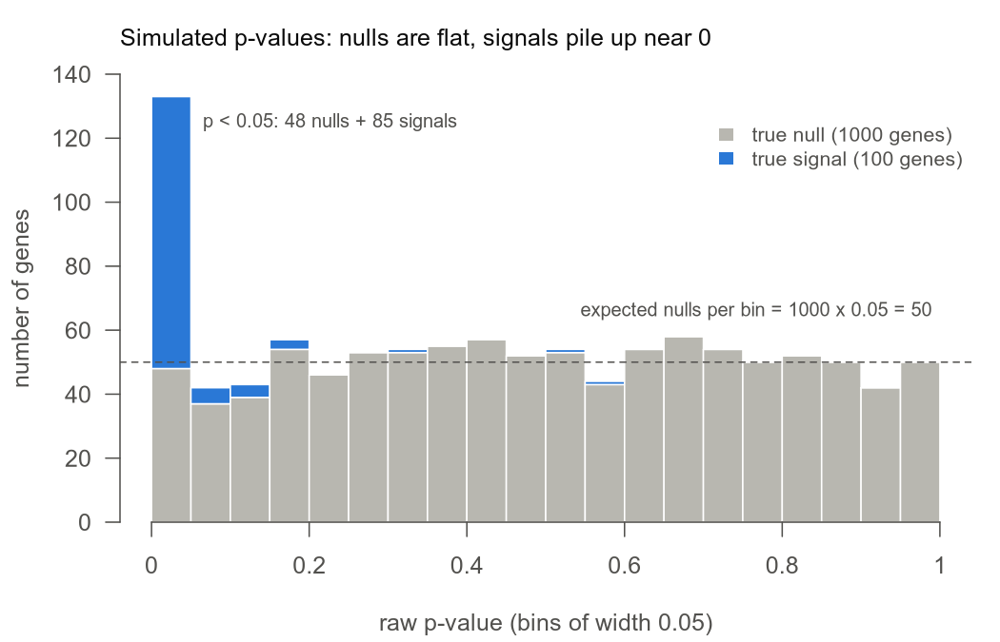
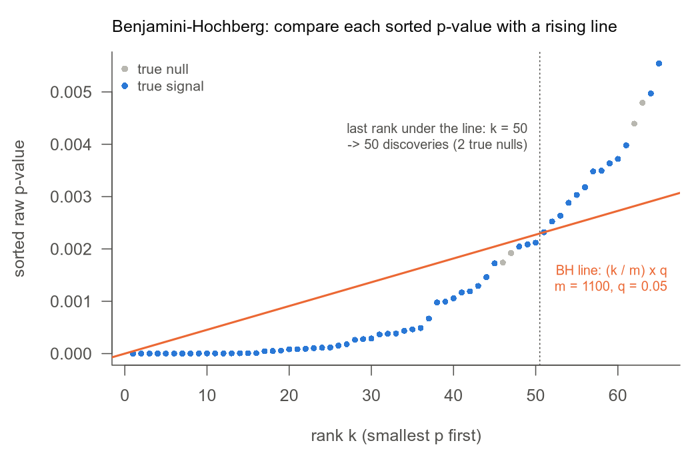

# 06. 유전자 수천 개를 한꺼번에 검정하면 p 값을 어떻게 읽어야 하나?

> padj의 뜻은 "어떤 p 값들을 한 묶음으로 보정했는가"에 달려 있다. 무엇을 주장할지 먼저 정하고, 그 주장에 맞는 묶음을 보정한다.
> 교재: 11장, 14장 · 먼저 읽으면 좋은 노트: [05. Wald 검정과 LRT](05_wald_vs_lrt.md) · 검증: R 4.5.2, DESeq2 1.50.2 · 실행 파일: [06_multiple_testing.R](../06_multiple_testing.R)

## 이 노트에서 다루는 것

- p < 0.05로 유전자를 고르면 왜 가짜가 많이 섞이는지, FWER과 FDR이 각각 무엇을 막는지
- BH 보정을 손으로 해 보고, DESeq2의 `padj`가 어떤 유전자 묶음에서 계산되는지(`NA`가 생기는 이유 포함)
- 비교가 셋(Ctrl / Starvation / Glucose)일 때 p 값을 어떻게 모아 보정하는지
- "Starvation이 낮추고 Glucose가 되돌린다"는 rescue 주장을 어떤 검정으로 세우는지

코드 블록은 접이식 블록 안의 것까지 모두 한 R 세션에서 위에서부터 차례로 실행했다. 뒤 블록은 앞 블록에서 만든 객체(`dds`, `res_list`, `lfc` 등)를 쓴다.

## 1. p < 0.05로 고르면 그중 몇 개가 가짜인가?

[05 노트](05_wald_vs_lrt.md)에서 유전자 A(Ctrl 100, 130, 90 / Starvation 200, 250, 180)의 Wald 검정 p 값을 구했다. 약 0.00072였다. p 값은 "실제로는 차이가 없다(귀무가설)고 가정할 때, 지금만큼 또는 더 극단적인 결과가 우연히 나올 확률"이다. 유전자 하나만 봤다면 0.00072는 강한 증거다.

RNA-seq에서는 유전자 2만 개를 한꺼번에 검정한다. 2만 개 모두 변하지 않았더라도 p가 0.00072244 이하인 유전자는 평균 20000 × 0.00072244 ≈ 14.4개 나온다. 기준을 p < 0.05로 잡으면 평균 1000개다. 그래서 목록에 가짜가 얼마나 섞였는지는 유전자 하나의 p 값만 보고 알 수 없다.

작은 시뮬레이션으로 확인한다. 변화가 없는 유전자(귀무 유전자) 1000개와 실제로 변한 유전자(신호 유전자) 100개를 만들었다. 검정통계량 Z는 05 노트의 Wald Z처럼 "추정치 ÷ SE"다. 귀무 유전자의 Z는 표준정규분포를, 신호 유전자의 Z는 평균 3인 정규분포를 따르게 했다. 양측 p 값을 계산해 히스토그램을 그렸다.



*그림 1.* 귀무 유전자의 p 값(회색)은 0과 1 사이에 고르게 퍼져 칸마다 50개 안팎이다. 신호 유전자(파랑)는 0 근처에 몰린다. p < 0.05 칸에는 신호 85개와 귀무 48개가 함께 들어 있다.

p < 0.05인 133개를 모두 발견이라고 부르면 그중 48개, 약 36%가 가짜다. 귀무 유전자의 p 값은 고르게 퍼지므로(균일분포) 어느 칸이든 귀무 유전자 수의 5%쯤이 떨어진다. 귀무 유전자가 많을수록 p < 0.05 칸의 가짜도 비례해서 는다. 이것이 다중검정 문제다.

<details>
<summary>그림 1을 만든 코드</summary>

아래 시뮬레이션(200회 반복)의 첫 번째 반복과 같은 데이터다.

```r
set.seed(20260926)
z <- c(rnorm(1000, 0), rnorm(100, 3)); is_sig <- rep(c(FALSE, TRUE), c(1000, 100))
p <- 2 * pnorm(-abs(z))
col_null <- "#b8b7b0"; col_sig <- "#2a78d6"; col_line <- "#eb6834"; ink <- "#52514e"
png("../figures/06_pvalue_histogram.png", 7, 4.5, "in", res = 150, bg = "white")
par(mar = c(4.2, 4.2, 2.6, 1), col.axis = ink, col.lab = ink, fg = ink, las = 1)
br <- seq(0, 1, 0.05)
h <- rbind(null = hist(p[!is_sig], br, plot = FALSE)$counts, signal = hist(p[is_sig], br, plot = FALSE)$counts)
barplot(h, space = 0, col = c(col_null, col_sig), border = "white", ylim = c(0, 140),
        xlab = "raw p-value (bins of width 0.05)", ylab = "number of genes")
axis(1, at = seq(0, 20, 4), labels = seq(0, 1, 0.2))
abline(h = 50, lty = 2, col = ink)
text(19.8, 66, "expected nulls per bin = 1000 x 0.05 = 50", adj = 1, cex = 0.8, col = ink)
text(1.3, h[1, 1] + h[2, 1] - 8, sprintf("p < 0.05: %d nulls + %d signals", h[1, 1], h[2, 1]), adj = 0, cex = 0.8, col = ink)
legend("topright", c("true null (1000 genes)", "true signal (100 genes)"), fill = c(col_null, col_sig),
       border = NA, bty = "n", cex = 0.85, inset = c(0, 0.08))
title("Simulated p-values: nulls are flat, signals pile up near 0", adj = 0, cex.main = 1, font.main = 1, col.main = "#0b0b0b")
invisible(dev.off())
cat("figure 1 written:", file.exists("../figures/06_pvalue_histogram.png"),
    "| p < 0.05: null", h[1, 1], "signal", h[2, 1], "\n")
#> figure 1 written: TRUE | p < 0.05: null 48 signal 85
```

</details>

### 무엇을 막을 것인가: FWER과 FDR

발견 목록 하나를 만들었다고 하자. $R$은 발견한 유전자 수, $V$는 그중 거짓 발견(실제로는 귀무인데 발견으로 고른 것) 수다. 한 번의 실험에서 거짓 발견이 차지한 비율 $\mathrm{FDP}=V/\max(R,1)$은 실험마다 달라지는 값이다.

$$\mathrm{FWER}=P(V\ge 1),\qquad \mathrm{FDR}=E[\mathrm{FDP}]=E\!\left[\frac{V}{\max(R,1)}\right].$$

- FWER(family-wise error rate)은 거짓 발견이 하나라도 생길 확률이다. Bonferroni와 Holm 보정이 이것을 막는다. Bonferroni는 모든 p 값에 검정 개수 $m$을 곱한다. Holm은 같은 FWER을 지키면서 순위에 따라 곱하는 수를 $m, m-1, \dots$로 줄여 조금 덜 엄격하다.
- FDR(false discovery rate)은 발견 목록 중 거짓 발견 비율의 기대값이다. 같은 실험을 여러 번 반복했을 때 FDP의 평균이라고 생각하면 된다. BH(Benjamini–Hochberg) 보정이 이것을 막는다.
- $\max(R,1)$은 발견이 하나도 없을 때 0으로 나누지 않게 하는 장치다.

그림 1의 숫자를 넣어 보자. p < 0.05로 고른 목록은 $V=48$, $R=133$이라 FDP는 48/133 ≈ 0.36이다. 같은 데이터에 BH를 0.05 수준으로 적용하면(2절) $R=50$, $V=2$라 FDP는 0.04다.

FDR 5%는 "각 유전자가 틀릴 확률이 5%"라는 뜻이 아니다. "발견 100개 중 반드시 5개가 틀린다"는 보장도 아니다. 절차를 반복했을 때의 평균이다. 같은 시뮬레이션을 200번 반복하면 이 차이가 보인다.

```r
set.seed(20260926); B <- 200; m0 <- 1000; m1 <- 100; alpha <- 0.05
fdp_bh <- fdp_bonf <- fdp_raw <- power_bh <- fwer_holm <- numeric(B)
for (b in seq_len(B)) {
  z <- c(rnorm(m0, 0), rnorm(m1, 3)); truth <- rep(c(FALSE, TRUE), c(m0, m1))   # 귀무 1000 + 신호 100
  p <- 2 * pnorm(-abs(z))
  R  <- p.adjust(p, "BH") < alpha;         fdp_bh[b] <- sum(R & !truth) / max(sum(R), 1); power_bh[b] <- mean(R[truth])
  Rb <- p.adjust(p, "bonferroni") < alpha; fdp_bonf[b] <- sum(Rb & !truth) / max(sum(Rb), 1)
  Rh <- p.adjust(p, "holm") < alpha;       fwer_holm[b] <- any(Rh & !truth)
  Rr <- p < alpha;                         fdp_raw[b] <- sum(Rr & !truth) / max(sum(Rr), 1)
}
cat(sprintf("raw p < 0.05 : FDR = %.3f\n", mean(fdp_raw)))
cat(sprintf("BH           : FDR = %.4f  (pi0 * alpha = %.4f)  power = %.3f  P(V>=1) = %.2f\n",
            mean(fdp_bh), m0 / (m0 + m1) * alpha, mean(power_bh), mean(fdp_bh > 0)))
cat(sprintf("Bonferroni   : FDR = %.4f\n", mean(fdp_bonf)))
cat(sprintf("Holm         : P(V>=1) = %.3f\n", mean(fwer_holm)))
cat(sprintf("BH FDP over %d datasets: 5%% = %.3f  median = %.3f  95%% = %.3f  max = %.3f\n",
            B, quantile(fdp_bh, .05), median(fdp_bh), quantile(fdp_bh, .95), max(fdp_bh)))
#> raw p < 0.05 : FDR = 0.372
#> BH           : FDR = 0.0459  (pi0 * alpha = 0.0455)  power = 0.480  P(V>=1) = 0.88
#> Bonferroni   : FDR = 0.0035
#> Holm         : P(V>=1) = 0.045
#> BH FDP over 200 datasets: 5% = 0.000  median = 0.044  95% = 0.098  max = 0.130
```

출력에서 볼 것: BH의 FDR(200번 평균)은 목표 0.05 아래지만, 데이터 한 벌마다의 FDP는 0에서 0.13까지 흔들린다.

- 아무 보정 없이 p < 0.05로 고른 목록의 FDR은 0.372다.
- BH는 FDR을 0.0459로 지켰다. 이론값 $\pi_0\alpha$와 거의 같다. $\pi_0$은 전체 중 귀무 유전자의 비율이라 여기서는 1000/1100이고, $\pi_0\alpha$ = 0.0455다. 신호 유전자 중 48%를 찾았다(power, 실제로 변한 유전자를 찾아낸 비율).
- BH 목록에 거짓 발견이 하나라도 들어갈 확률은 0.88이다. BH는 FWER을 막지 않는다.
- Holm은 그 확률을 0.045로 묶어 FWER 0.05를 지킨다. Bonferroni는 FDR이 0.0035까지 내려갈 만큼 엄격하다.

유전자 수천 개에서 후보를 찾을 때는 가짜가 몇 개 섞이는 것을 받아들이고 그 비율을 관리하는 FDR이 보통 쓰인다. DESeq2의 기본 보정도 BH다.

## 2. BH는 p 값을 어떻게 고치나?

교재 11.2의 다섯 p 값으로 시작한다. 0.001, 0.010, 0.030, 0.040, 0.200이고 개수는 $m=5$다.

생각은 이렇다. p 값을 작은 것부터 줄 세운다. $k$번째 p 값을 기준선 $(k/m)\,q$와 비교한다. $q$는 목표 FDR(예: 0.05)이다. 기준선은 순위가 올라갈수록 같이 올라간다. 1위는 Bonferroni처럼 $q/m$이라는 엄격한 기준과 비교되지만, 뒤로 갈수록 기준이 느슨해진다. 선 아래에 있는 마지막 순위 $k^*$를 찾고, 1위부터 $k^*$위까지를 모두 발견으로 채택한다.



*그림 2.* 그림 1의 p 값 1100개를 작은 순서로 세우고 앞 65개만 그렸다. 주황 선이 BH 기준선 $(k/1100)\times0.05$다. 선 아래에 있는 마지막 순위가 50이라 50개가 발견이고, 그중 귀무 유전자는 2개다.

BH 보정 p 값(padj)은 이 절차를 유전자마다 숫자 하나로 적어 둔 것이다. "이 유전자가 발견으로 남는 가장 작은 $q$"다. 그래서 padj가 0.05 이하인 유전자를 고르면 $q=0.05$로 BH를 돌린 목록과 같다. 식으로는 다음과 같다.

$$\tilde p_{(i)}=\min\!\left\{1,\ \min_{k\ge i}\frac{m}{k}\,p_{(k)}\right\}$$

- $p_{(k)}$: 작은 쪽부터 $k$번째 p 값. $m$: 함께 보정하는 p 값의 개수.
- $\frac{m}{k}p_{(k)}$: $p_{(k)}\le(k/m)\,q$를 $q$에 대해 푼 값이다. 이 값이 $q$ 이하면 $k$번째 p 값이 기준선 아래에 있다.
- $\min_{k\ge i}$: 뒤쪽 순위에 더 작은 값이 있으면 그 값을 가져온다. 뒤쪽 순위가 채택되면 앞 순위도 모두 채택되기 때문이다.
- 바깥의 $\min\{1,\cdot\}$: padj가 1을 넘지 않게 자른다.

교재 표의 3위를 계산하면 $5\times0.030/3=0.050$이다. 뒤쪽 4위는 $5\times0.040/4=0.050$, 5위는 $5\times0.200/5=0.200$이라 더 작은 값이 없다. 따라서 3위의 padj는 0.050이다.

```r
p <- c(0.001, 0.010, 0.030, 0.040, 0.200)
m <- length(p); o <- order(p); ps <- p[o]
raw  <- m * ps / seq_len(m)            # m p_(i) / i
step <- rev(cummin(rev(raw)))          # 뒤에서부터 누적 최솟값
padj_hand <- pmin(1, step)
print(data.frame(rank = 1:m, p = ps, m_p_over_i = raw, BH_hand = padj_hand, p.adjust_BH = p.adjust(p, "BH")[o],
                 bonferroni = p.adjust(p, "bonferroni")[o], holm = p.adjust(p, "holm")[o]))
p3 <- c(0.010, 0.012, 0.013)
cat("p =", p3, "| m p/i =", 3 * p3 / (1:3), "| BH =", p.adjust(p3, "BH"), "\n")
#>   rank     p m_p_over_i BH_hand p.adjust_BH bonferroni  holm
#> 1    1 0.001      0.005   0.005       0.005      0.005 0.005
#> 2    2 0.010      0.025   0.025       0.025      0.050 0.040
#> 3    3 0.030      0.050   0.050       0.050      0.150 0.090
#> 4    4 0.040      0.050   0.050       0.050      0.200 0.090
#> 5    5 0.200      0.200   0.200       0.200      1.000 0.200
#> p = 0.01 0.012 0.013 | m p/i = 0.03 0.018 0.013 | BH = 0.013 0.013 0.013
```

출력에서 볼 것: 손으로 계산한 `BH_hand`가 교재 표의 0.005, 0.025, 0.050, 0.050, 0.200과 같고, R의 `p.adjust`와도 같다.

이 표에서는 "뒤에서 가져오기"가 아무 값도 바꾸지 않는다. 3위와 4위가 0.050으로 같은 것도 원래 $m p/i$가 같아서다. 가져오기가 실제로 일하는 예는 마지막 줄이다. p = 0.010, 0.012, 0.013이면 $m p/i$는 0.030, 0.018, 0.013인데, BH는 뒤쪽의 0.013을 앞으로 가져와 셋 다 0.013으로 만든다. Bonferroni는 모든 p에 $m$을 곱하고(0.005, 0.050, 0.150, 0.200, 1.000), Holm은 그 중간이다.

<details>
<summary>손계산과 p.adjust는 비트 단위까지 같은가, p.adjust 소스</summary>

```r
cat("identical(hand, p.adjust):", identical(padj_hand, p.adjust(p, "BH")[o]),
    "| all.equal:", isTRUE(all.equal(padj_hand, p.adjust(p, "BH")[o])),
    "| max abs diff:", max(abs(padj_hand - p.adjust(p, "BH")[o])), "\n")
cat("did the step-up minimum change any m p/i value?", any(step != raw), "\n")
pa_src <- deparse(p.adjust)
cat(pa_src[grep("nna <- !is.na|p <- p\\[nna\\]|lp <- length", pa_src)], pa_src[grep("BH = \\{", pa_src) + 0:4],
    pa_src[grep("BY = \\{", pa_src) + 0:5], sep = "\n")
#> identical(hand, p.adjust): FALSE | all.equal: TRUE | max abs diff: 6.938894e-18
#> did the step-up minimum change any m p/i value? FALSE
#>     if (all(nna <- !is.na(p)))
#>     else p <- p[nna]
#>     lp <- length(p)
#>     }, BH = {
#>         i <- lp:1L
#>         o <- order(p, decreasing = TRUE)
#>         ro <- order(o)
#>         pmin(1, cummin(n/i * p[o]))[ro]
#>     }, BY = {
#>         i <- lp:1L
#>         o <- order(p, decreasing = TRUE)
#>         ro <- order(o)
#>         q <- sum(1/(1L:n))
#>         pmin(1, cummin(q * n/i * p[o]))[ro]
```

손계산과 `p.adjust`는 부동소수점 오차 안에서 같다. `identical`은 FALSE(3위에서 $6.9\times10^{-18}$ 차이), `all.equal`은 TRUE다. `p.adjust`의 BH 분기는 `pmin(1, cummin(n/i * p[o]))[ro]`로, 큰 p부터 거꾸로 훑으며 누적 최솟값을 취한다. 계산 순서만 다를 뿐 같은 식이다. BY 분기는 같은 계산에 `q <- sum(1/(1L:n))`을 한 번 더 곱한다(`q * n/i * p[o]`). `p.adjust`는 `NA`를 빼고(`p <- p[nna]`) 남은 개수로 `n`을 잡는다.

</details>

<details>
<summary>그림 2를 만든 코드</summary>

```r
set.seed(20260926)
z <- c(rnorm(1000, 0), rnorm(100, 3)); is_sig <- rep(c(FALSE, TRUE), c(1000, 100))
p <- 2 * pnorm(-abs(z)); o <- order(p); ps <- p[o]; sig_o <- is_sig[o]; m <- length(p); q <- 0.05; kk <- 1:65
kstar <- max(which(ps <= seq_len(m) / m * q))
png("../figures/06_bh_line.png", 7, 4.5, "in", res = 150, bg = "white")
par(mar = c(4.2, 5.6, 2.6, 1), col.axis = ink, col.lab = ink, fg = ink, las = 1)
plot(kk, ps[kk], pch = 16, cex = 0.8, col = ifelse(sig_o[kk], col_sig, col_null),
     xlab = "rank k (smallest p first)", ylab = "", bty = "l")
title(ylab = "sorted raw p-value", line = 4.2)
abline(0, q / m, col = col_line, lwd = 2)
abline(v = kstar + 0.5, lty = 3, col = ink)
text(66, 0.0012, "BH line: (k / m) x q\nm = 1100, q = 0.05", adj = c(1, 0), cex = 0.8, col = col_line)
text(kstar - 1, max(ps[kk]) * 0.75, sprintf("last rank under the line: k = %d\n-> %d discoveries (%d true nulls)",
     kstar, kstar, sum(!sig_o[1:kstar])), adj = 1, cex = 0.8, col = ink)
legend("topleft", c("true null", "true signal"), pch = 16, col = c(col_null, col_sig), bty = "n", cex = 0.85)
title("Benjamini-Hochberg: compare each sorted p-value with a rising line", adj = 0, cex.main = 1, font.main = 1, col.main = "#0b0b0b")
invisible(dev.off())
cat("figure 2 written:", file.exists("../figures/06_bh_line.png"), "| k* =", kstar,
    "| true nulls among them:", sum(!sig_o[1:kstar]), "| equals BH at 0.05:", kstar == sum(p.adjust(p, "BH") <= q), "\n")
#> figure 2 written: TRUE | k* = 50 | true nulls among them: 2 | equals BH at 0.05: TRUE
```

</details>

### 같은 p 값도 묶음이 다르면 padj가 다르다

BH의 기준선은 함께 보정하는 다른 p 값들에 따라 정해진다. 그래서 같은 p = 0.03이라도 어떤 묶음에 들어가느냐에 따라 padj가 달라진다.

```r
cat("family A (0.001,0.01,0.03,0.04,0.2): padj of 0.03 =", p.adjust(c(0.001, 0.01, 0.03, 0.04, 0.2), "BH")[3], "\n")
cat("family B (0.03,0.5,0.6,0.7,0.9)    : padj of 0.03 =", p.adjust(c(0.03, 0.5, 0.6, 0.7, 0.9), "BH")[1], "\n")
set.seed(1)
cat("family C (0.03 + 1000 x U(0,1))    : padj of 0.03 =", p.adjust(c(0.03, runif(1000)), "BH")[1], "\n")
#> family A (0.001,0.01,0.03,0.04,0.2): padj of 0.03 = 0.05
#> family B (0.03,0.5,0.6,0.7,0.9)    : padj of 0.03 = 0.15
#> family C (0.03 + 1000 x U(0,1))    : padj of 0.03 = 0.9418149
```

출력에서 볼 것: 같은 0.03이 묶음 A에서는 0.05, B에서는 0.15, 귀무 p 1000개와 섞인 C에서는 0.94가 된다.

유전자 A의 padj도 마찬가지다. 유전자 A의 count만으로는 정해지지 않고, 어떤 유전자들과 한 묶음으로 보정했는지가 함께 정해져야 한다. 함께 보정하는 가설들의 묶음을 검정 가족(family)이라고 부른다.

BH가 FDR을 보장하는 데에도 조건이 있다. p 값들이 서로 독립이거나, 양의 방향으로만 얽혀 있을 때(PRDS라는 조건) $\mathrm{FDR}\le\pi_0 q\le q$가 성립한다. 어떤 의존 구조에서도 성립하게 하려면 BY(Benjamini–Yekutieli) 보정을 쓴다. BY는 BH 계산에 $\sum_{k=1}^m 1/k$를 한 번 더 곱한다. 그만큼 발견이 줄어든다(4절).

## 3. DESeq2의 padj는 어떤 유전자들을 한 묶음으로 보정하나?

이제 DESeq2로 넘어간다. 확인용 데이터를 하나 만들었다. Ctrl, Starvation, Glucose 세 조건에 sample이 4개씩이고 유전자는 2000개다. 이 노트에서 Glucose는 굶긴 세포에 glucose를 다시 넣은 조건(Starvation+Glucose)을 줄여 부르는 이름이다. 보통 배지에 glucose를 더 넣은 조건이 아니다. donor 대응이 없는 설계로 만들었으므로 design은 `~condition`이다.

유전자마다 정답을 심어 두었다. 아래 표의 값은 log2 fold change(LFC, 두 조건 평균 비의 log2)이고, 효과 크기 $|\beta|$는 1에서 2.5 사이에서 뽑았다. 두 유전자(gene5, gene7)에는 count 하나를 비정상적으로 크게 바꾼 outlier를 심었다.

| 유전자 종류 | 개수 | Starvation vs Ctrl | Glucose vs Ctrl | 뜻 |
|---|---|---|---|---|
| null | 1500 | 0 | 0 | 아무 변화 없음 |
| starvation_only | 150 | $\beta$ | $\beta$ | Starvation이 바꾸고 Glucose는 되돌리지 못함 |
| rescued | 150 | $\beta$ | 0 | Glucose가 Ctrl 수준으로 되돌림 |
| partial | 100 | $\beta$ | $0.5\beta$ | 절반쯤 되돌림 |
| glucose_only | 100 | 0 | $\beta$ | Glucose 조건에서만 변함 |

<details>
<summary>검증용 데이터를 만든 코드</summary>

`makeExampleDESeqDataSet`의 `trueIntercept`와 `trueDisp`를 재사용하고, 그 함수와 같은 방식($\mu=2^{X\beta}$, `rnbinom(size=1/α)`)으로 count를 만들었다.

```r
suppressPackageStartupMessages(library(DESeq2))
set.seed(2026); n <- 2000; m <- 12
base <- makeExampleDESeqDataSet(n = n, m = m)
cond <- factor(rep(c("Ctrl", "Starvation", "Glucose"), each = 4), levels = c("Ctrl", "Starvation", "Glucose"))
X <- model.matrix(~ cond)
cls <- rep(c("null", "starvation_only", "rescued", "partial", "glucose_only"), c(1500, 150, 150, 100, 100))
eff <- sample(c(-1, 1), n, TRUE) * runif(n, 1, 2.5)
bS <- ifelse(cls %in% c("starvation_only", "rescued", "partial"), eff, 0)
bG <- ifelse(cls == "starvation_only", bS, ifelse(cls == "partial", 0.5 * bS, ifelse(cls == "glucose_only", eff, 0)))
mu <- t(2^(X %*% t(cbind(mcols(base)$trueIntercept, bS, bG))))
cnt <- matrix(rnbinom(m * n, mu = mu, size = 1 / mcols(base)$trueDisp), ncol = m,
              dimnames = list(paste0("gene", 1:n), paste0("sample", 1:m)))
cnt[5, 1] <- 50000L; cnt[7, 6] <- 80000L
dds <- DESeqDataSetFromMatrix(cnt, DataFrame(condition = cond), ~ condition)
dds <- DESeq(dds, quiet = TRUE)
cat("resultsNames:", resultsNames(dds), "| all-zero genes:", sum(rowSums(counts(dds)) == 0), "\n")
#> converting counts to integer mode
#> resultsNames: Intercept condition_Starvation_vs_Ctrl condition_Glucose_vs_Ctrl | all-zero genes: 6
```

</details>

### 한 번의 `results()` 호출이 한 가족이다

`results()`를 한 번 부르면 DESeq2는 그 결과표의 `pvalue` 열만 모아 BH를 적용한다. 다른 `results()` 호출의 p 값과 합치지 않는다(소스는 [더 깊이 보기](#더-깊이-보기)에서 확인했다). 그런데 이 가족에서 빠지는 유전자가 있고, 빠진 유전자는 `padj`가 `NA`로 나온다. 빠지는 경로는 두 가지다.

1. `pvalue`부터 `NA`인 유전자는 p 값 자체가 없는 유전자다. 모든 sample의 count가 0인 유전자, 그리고 Cook's distance로 outlier가 있다고 판정된 유전자다. Cook's distance는 sample 하나가 그 유전자의 계수 추정을 얼마나 크게 흔드는지 재는 값이다(cutoff와 NA 원인표는 교재 13.5를 다루는 [07 노트](07_lfc_shrinkage_and_qc.md)에 있다).
2. `pvalue`는 있는데 `padj`만 `NA`인 유전자는 independent filtering이 가족에서 뺀 유전자다.

Independent filtering(IF)의 생각은 단순하다. read가 몇 개밖에 잡히지 않은 유전자는 조건 사이에 차이가 있어도 작은 p 값이 나오기 어렵다. 이런 유전자까지 가족에 넣으면 $m$만 커져서 BH 기준선의 기울기 $q/m$이 작아지고, 다른 유전자에게 더 엄격한 기준이 적용된다. 그래서 DESeq2는 baseMean이 낮은 유전자를 가족에서 뺀다. baseMean은 정규화 count(count / size factor)를 모든 sample에 걸쳐 평균낸 값이다. 어느 sample이 어느 조건인지 보지 않고 계산한다.

어디서 자를지는 DESeq2가 정한다. baseMean의 분위수(하위 몇 %에 해당하는 값) 50개를 cutoff 후보로 두고, 후보마다 `padj < alpha`인 유전자 수를 센다. 그 수가 최대에 가까운 cutoff 가운데 가장 낮은 것을 고른다. `alpha`는 기본값이 0.1이다.

```r
r_if   <- results(dds, contrast = c("condition", "Starvation", "Ctrl"))                # 기본값: IF 켬, alpha = 0.1
r_if05 <- results(dds, contrast = c("condition", "Starvation", "Ctrl"), alpha = 0.05)
r_no   <- results(dds, contrast = c("condition", "Starvation", "Ctrl"), independentFiltering = FALSE)
show <- function(r) c(NA_pvalue = sum(is.na(r$pvalue)), NA_padj = sum(is.na(r$padj)), padj_0.05 = sum(r$padj < 0.05, na.rm = TRUE),
                      padj_0.1 = sum(r$padj < 0.1, na.rm = TRUE), baseMean_cutoff = round(unname(c(metadata(r)$filterThreshold, NA)[1]), 2))
print(rbind(r_if = show(r_if), r_if05 = show(r_if05), r_no = show(r_no)))
cat("stat, pvalue identical across the three calls:", identical(r_if$stat, r_no$stat),
    identical(r_if$pvalue, r_no$pvalue), identical(r_if05$pvalue, r_if$pvalue), "\n")
filt <- is.na(r_if$padj) & !is.na(r_if$pvalue); pna <- which(is.na(r_if$pvalue))
cook <- pna[which(mcols(dds)$maxCooks[pna] > qf(.99, 3, 9))]
cat("padj NA only:", sum(filt), "genes ; all below the baseMean cutoff:", all(r_if$baseMean[filt] < metadata(r_if)$filterThreshold), "\n")
cat("pvalue NA:", length(pna), "= all-zero genes", sum(r_if$baseMean[pna] == 0), "+ Cook's outliers", length(cook), "(", rownames(dds)[cook], ")\n")
#>        NA_pvalue NA_padj padj_0.05 padj_0.1 baseMean_cutoff
#> r_if           9     125       161      201            1.59
#> r_if05         9     472       163      204            5.41
#> r_no           9       9       158      198              NA
#> stat, pvalue identical across the three calls: TRUE TRUE TRUE
#> padj NA only: 116 genes ; all below the baseMean cutoff: TRUE
#> pvalue NA: 9 = all-zero genes 6 + Cook's outliers 3 ( gene5 gene7 gene1571 )
```

출력에서 볼 것: 세 호출에서 `stat`과 `pvalue`는 완전히 같고, 바뀌는 것은 `padj`뿐이다.

- `pvalue`가 `NA`인 9개는 count가 모두 0인 유전자 6개와 Cook's outlier 3개다. 일부러 심은 gene5, gene7이 여기에 잡혔다.
- `pvalue`는 있고 `padj`만 `NA`인 116개는 모두 baseMean이 cutoff 1.59보다 낮다. IF를 끄면(`r_no`) 이 유전자들의 `padj`가 채워져 `NA`가 9개만 남는다.
- `alpha=0.05`로 부르면 cutoff가 5.41로 올라가고 `NA`가 472개로 는다. padj < 0.05인 유전자는 IF 없이 158개, 기본값(alpha 0.1)으로 161개, `alpha=0.05`로 163개다.

`alpha`는 IF가 cutoff를 고를 때 "padj가 몇 개나 이 값보다 작은가"를 세는 기준이다. 계수나 Wald p 값을 다시 계산하지 않는다. `summary()`도 이 값을 기본 기준으로 쓴다. 그래서 최종 보고를 padj < 0.05로 할 생각이면 `results()`에 `alpha=0.05`를 함께 주는 편이 맞다(교재 11.6, `?results`의 권고).

<details>
<summary>IF를 더 자세히 확인한 출력: 통과한 유전자의 padj, cutoff 격자, 실제 FDP</summary>

```r
cat("chosen theta (quantile of baseMean):", round(metadata(r_if)$filterTheta, 3), "(alpha 0.1) ->",
    round(metadata(r_if05)$filterTheta, 3), "(alpha 0.05) ; max baseMean among filtered:", round(max(r_if$baseMean[filt]), 3), "\n")
cat("pvalue NA genes:", pna, "\n  baseMean:", round(r_if$baseMean[pna], 2), "\n  maxCooks:", round(mcols(dds)$maxCooks[pna], 2),
    "\n  cutoff qf(.99, p=3, m-p=9) =", round(qf(.99, 3, 9), 3), "\n")
pass <- !is.na(r_if$padj)
cat("padj(IF) == p.adjust(pvalue[pass], 'BH'):", isTRUE(all.equal(r_if$padj[pass], p.adjust(r_if$pvalue[pass], "BH"))),
    "| padj(noIF) == p.adjust(all non-NA p):",
    isTRUE(all.equal(r_no$padj[!is.na(r_no$pvalue)], p.adjust(r_no$pvalue[!is.na(r_no$pvalue)], "BH"))), "\n")
both <- pass & !is.na(r_no$padj); dd <- r_if$padj[both] - r_no$padj[both]
cat("kept genes:", sum(both), "; max(padj_IF - padj_noIF) =", signif(max(dd), 3), "; < 0:", sum(dd < 0),
    "; < -1e-12 (beyond float error):", sum(dd < -1e-12), "; mean diff =", round(mean(dd), 4), "\n")
fr <- metadata(r_if)$filterNumRej
cat("filterNumRej: theta grid length =", nrow(fr), "; numRej range =", range(fr$numRej), "\n")
tS <- bS != 0; fdp <- function(R) sum(R & !tS, na.rm = TRUE) / max(sum(R, na.rm = TRUE), 1)
cat(sprintf("true FDP (one dataset) at padj<0.1: IF=%.3f (R=%d)  noIF=%.3f (R=%d) | at padj<0.05: IF(alpha=.05)=%.3f (R=%d)  noIF=%.3f (R=%d)\n",
    fdp(r_if$padj < 0.1), sum(r_if$padj < 0.1, na.rm = TRUE), fdp(r_no$padj < 0.1), sum(r_no$padj < 0.1, na.rm = TRUE),
    fdp(r_if05$padj < 0.05), sum(r_if05$padj < 0.05, na.rm = TRUE), fdp(r_no$padj < 0.05), sum(r_no$padj < 0.05, na.rm = TRUE)))
summary(r_if05)
#> chosen theta (quantile of baseMean): 0.061 (alpha 0.1) -> 0.235 (alpha 0.05) ; max baseMean among filtered: 1.589
#> pvalue NA genes: 5 7 15 237 316 709 917 1191 1571
#>   baseMean: 3846.02 6455.97 0 0 0 0 0 0 3.64
#>   maxCooks: 33.27 33.27 NA NA NA NA NA NA 8.27
#>   cutoff qf(.99, p=3, m-p=9) = 6.992
#> padj(IF) == p.adjust(pvalue[pass], 'BH'): TRUE | padj(noIF) == p.adjust(all non-NA p): TRUE
#> kept genes: 1875 ; max(padj_IF - padj_noIF) = -4.79e-19 ; < 0: 1875 ; < -1e-12 (beyond float error): 1871 ; mean diff = -0.0144
#> filterNumRej: theta grid length = 50 ; numRej range = 30 205
#> true FDP (one dataset) at padj<0.1: IF=0.124 (R=201)  noIF=0.121 (R=198) | at padj<0.05: IF(alpha=.05)=0.067 (R=163)  noIF=0.057 (R=158)
#>
#> out of 1994 with nonzero total read count
#> adjusted p-value < 0.05
#> LFC > 0 (up)       : 102, 5.1%
#> LFC < 0 (down)     : 61, 3.1%
#> outliers [1]       : 3, 0.15%
#> low counts [2]     : 463, 23%
#> (mean count < 5)
#> [1] see 'cooksCutoff' argument of ?results
#> [2] see 'independentFiltering' argument of ?results
```

- cutoff 후보(`theta`)는 50개이고, 후보마다 센 발견 수(`numRej`)는 30에서 205 사이였다. 기본 `alpha=0.1`에서는 분위수 0.061, `alpha=0.05`에서는 0.235가 골라졌다.
- `pvalue`가 `NA`인 9개 중 all-zero 6개는 `baseMean=0`이고 `maxCooks=NA`다. 나머지 3개는 `maxCooks`가 33.27, 33.27, 8.27로 cutoff `qf(.99, 3, 9)` = 6.992를 넘는다(계수 3개, sample 12개).
- 통과한 유전자의 padj는 그 부분집합에만 `p.adjust(…, "BH")`를 한 값과 정확히 같다.
- 이 데이터에서는 통과한 1875개 모두 IF 쪽 padj가 IF 없는 padj보다 작거나 같았다. 1871개는 부동소수점 오차 $10^{-12}$를 넘어 작았고, 나머지 4개는 그 오차 안에서 같았다. 잘린 저발현 유전자들의 p 값이 대체로 컸기 때문이다. IF가 power를 얻는 이유이지 수학적으로 늘 그런 것은 아니다(아래 반례).
- 이 데이터는 정답을 알기 때문에 실제 FDP도 셀 수 있다. padj < 0.1에서 IF 0.124(R=201), IF 없음 0.121(R=198)이다. padj < 0.05에서는 IF(`alpha=0.05`) 0.067(R=163), IF 없음 0.057(R=158)이다. 데이터 한 벌의 값이라 FDR 자체는 아니지만, IF가 발견 수를 늘리면서 오류율은 비슷한 수준에 머무는 방향은 보인다.
- `summary(r_if05)`가 "adjusted p-value < 0.05"로 세는 것은 `metadata(res)$alpha`를 읽기 때문이다.

</details>

<details>
<summary>IF가 남은 유전자의 padj를 늘 줄이지는 않는다 (반례)</summary>

잘리는 유전자의 p 값이 작으면 남은 유전자의 순위가 가족 크기보다 더 많이 내려가서 padj가 오히려 커진다. `filter`가 1인 세 유전자가 잘리는 경우다.

```r
DESeq2:::filtered_p(filter = c(1, 1, 1, 5, 5), test = c(0.001, 0.002, 0.003, 0.04, 0.5),
                    theta = c(0, 0.7), method = "BH")
#>         0%  70%
#> [1,] 0.005   NA
#> [2,] 0.005   NA
#> [3,] 0.005   NA
#> [4,] 0.050 0.08
#> [5,] 0.500 0.50
```

네 번째 유전자(p = 0.04)는 가족 전체에서 padj 0.050이지만, 작은 p를 가진 세 유전자가 잘린 뒤에는 0.08이 된다.

</details>

### IF와 "p 값으로 미리 고르기"는 다르다

그렇다면 p 값이 큰 유전자를 미리 빼고 BH를 해도 될까? 안 된다. 차이는 빼는 기준이 귀무 유전자의 p 값과 독립인가에 있다. baseMean은 조건을 보지 않고 계산하므로, 귀무 유전자에서는 p 값과 거의 독립이다. 그래서 baseMean으로 잘라도 남은 귀무 유전자의 p 값은 여전히 0과 1 사이에 고르게 퍼진다. 반면 p < 0.5만 남기면 남은 귀무 p 값은 0과 0.5 사이에 몰리는데, BH는 이것을 0과 1 사이에 퍼진 것처럼 취급한다.

모든 유전자가 귀무인 상황을 1000번 반복했다. 이때는 발견이 하나라도 나오면 전부 가짜이므로 FDR과 FWER이 모두 $P(V\ge1)$로 같다. 필터 없이 BH를 하면 0.041, baseMean 상위 50%만 남기고 BH를 하면 0.046으로 0.05 근처에 머문다. p < 0.5만 남기고 BH를 하면 0.091로 거의 두 배가 된다.

<details>
<summary>IF와 p 값 선별을 비교한 시뮬레이션 코드와 출력</summary>

```r
set.seed(5); B <- 1000; m <- 2000
v <- matrix(NA, B, 3, dimnames = list(NULL, c("noFilter", "filter_indep_stat(baseMean top50%)", "filter_by_p(p<0.5)")))
for (b in seq_len(B)) {
  mu <- rlnorm(m, 3, 1.5); p <- runif(m)                                           # 귀무: p ~ U(0,1), baseMean과 독립
  v[b, 1] <- any(p.adjust(p, "BH") < .05)
  keep <- mu > quantile(mu, .5); v[b, 2] <- any(p.adjust(p[keep], "BH") < .05)   # 독립 통계량으로 선별 (고정 cutoff)
  keep <- p < 0.5;               v[b, 3] <- any(p.adjust(p[keep], "BH") < .05)   # p로 선별
}
cat("global null (all 2000 genes null), B=1000, FDR = P(V>=1) at BH 0.05:\n")
for (k in 1:3) cat(sprintf("  %-38s %.3f  (MC SE %.3f)\n", colnames(v)[k], mean(v[, k]), sd(v[, k]) / sqrt(B)))
#> global null (all 2000 genes null), B=1000, FDR = P(V>=1) at BH 0.05:
#>   noFilter                               0.041  (MC SE 0.006)
#>   filter_indep_stat(baseMean top50%)     0.046  (MC SE 0.007)
#>   filter_by_p(p<0.5)                     0.091  (MC SE 0.009)
```

</details>

교재 11.6이 "raw p가 작은 gene만 고른 후 보정은 같은 원리가 아니다"라고 한 것이 이 차이다. 이 시뮬레이션은 cutoff를 미리 고정했다. DESeq2처럼 같은 p 값으로 발견 수를 세어 cutoff를 고르는 경우의 보장은 근사다([더 깊이 보기](#더-깊이-보기)).

## 4. 비교가 세 개면 무엇을 한 묶음으로 보정하나?

조건이 셋이면 비교할 쌍도 셋이다. 각 조건의 log2 평균을 $C$, $S$, $G$라고 쓰면 교재 14.1의 세 비교는 다음과 같다.

$$\Delta_S=S-C,\qquad \Delta_R=G-S,\qquad \Delta_E=G-C=\Delta_S+\Delta_R .$$

- $\Delta_S$는 Starvation 효과다. $\Delta_R$은 굶긴 상태에서 glucose를 다시 넣었을 때의 반응이다(R은 rescue). $\Delta_E$는 glucose를 다시 넣은 뒤에도 Ctrl과 남은 차이다.
- 예를 들어 Starvation이 발현을 절반으로 줄이고($\Delta_S=-1$) Glucose가 다시 두 배로 올리면($\Delta_R=+1$) $\Delta_E=0$이다.

DESeq2에서는 비교마다 contrast(어떤 두 조건을 비교할지 정하는 벡터)를 주고 `results()`를 따로 부른다. 같은 donor에서 세 조건을 얻었다면 `~pair+condition`으로 적합한다. 3절에서 본 대로 `results()` 하나가 가족 하나이므로, 세 번 부르면 BH도 세 번 따로 적용된다.

### 따로 보정한 목록 셋을 합치면 FDR은?

세 비교 모두 효과가 전혀 없는 유전자 1000개로 2000번 시뮬레이션했다. 각 비교에서 BH를 따로 하고, 발견을 한 목록으로 합쳤다. 비교 하나만 보면 FDR이 0.045로 지켜지지만, 세 목록을 합친 목록의 FDR은 0.128이다.

<details>
<summary>세 비교를 따로 보정한 뒤 합친 목록의 시뮬레이션 코드와 출력</summary>

```r
# 전역 귀무: 세 contrast 모두 효과 없음. 군 평균 C,S,G를 공유하는 세 contrast (m=1000 유전자, 2000회)
set.seed(16); B <- 2000; mg <- 1000; se_g <- 0.3; se_d <- sqrt(2) * se_g
any_sep <- any_glob <- sep_k <- numeric(B)
for (b in seq_len(B)) {
  Cm <- rnorm(mg, 0, se_g); Sm <- rnorm(mg, 0, se_g); Gm <- rnorm(mg, 0, se_g)
  Pm <- 2 * pnorm(-abs(cbind(Sm - Cm, Gm - Sm, Gm - Cm) / se_d))
  sep  <- apply(Pm, 2, p.adjust, method = "BH") < .05
  any_sep[b] <- any(sep); sep_k[b] <- any(sep[, 1]); any_glob[b] <- any(p.adjust(as.vector(Pm), "BH") < .05)
}
cat(sprintf("global null, 3 contrasts: FDR of contrast S_C alone (per-contrast BH) = %.3f ; FDR of the combined list = %.3f ; global BH = %.3f\n",
            mean(sep_k), mean(any_sep), mean(any_glob)))
set.seed(17); any_ind <- numeric(B)                                     # 비교: 세 비교가 서로 독립인 경우
for (b in seq_len(B)) any_ind[b] <- any(apply(matrix(runif(mg * 3), mg), 2, p.adjust, method = "BH") < .05)
cat(sprintf("3 independent contrasts: FDR of the combined list = %.3f (theory 1 - 0.95^3 = %.3f) ; MC SE of 0.128 = %.4f\n",
            mean(any_ind), 1 - 0.95^3, sqrt(mean(any_sep) * (1 - mean(any_sep)) / B)))
#> global null, 3 contrasts: FDR of contrast S_C alone (per-contrast BH) = 0.045 ; FDR of the combined list = 0.128 ; global BH = 0.046
#> 3 independent contrasts: FDR of the combined list = 0.138 (theory 1 - 0.95^3 = 0.143) ; MC SE of 0.128 = 0.0075
```

</details>

세 비교가 서로 독립이라면 이론값은 $1-0.95^3=0.143$이다(독립 p 값으로 같은 시뮬레이션을 하면 0.138). 0.128이 조금 낮은 것은 세 비교가 같은 군 평균을 나눠 써서 함께 움직이기 때문으로 보인다(5절). 다만 그 차이는 시뮬레이션 표준오차(약 0.008)의 두 배 안팎이라 크지 않다. 구조적으로 보면 비교별 BH는 비교 $k$ 안의 $E[V_k/\max(R_k,1)]$만 보장한다. 합친 목록의 $E[\sum_k V_k/\max(\sum_k R_k,1)]$에 대해서는 아무것도 보장하지 않는다. 비교를 미리 계획했다는 사실만으로 합친 목록의 오류율이 제어되지도 않는다.

해법은 교재 11.4의 global BH다. 세 비교의 원래 p 값(raw p)을 모아 한 번 보정한다. 유전자 하나와 비교 하나의 짝을 셀이라고 부르면, 유전자×비교 셀 전체가 한 가족이 된다. 위 시뮬레이션의 `global BH`가 이것이고, FDR은 0.046이었다. 교재 코드를 3절 데이터에 그대로 실행했다.

```r
res_list <- list(
  S_C = results(dds, contrast = c("condition", "Starvation", "Ctrl"), independentFiltering = FALSE),
  G_S = results(dds, contrast = c("condition", "Glucose", "Starvation"), independentFiltering = FALSE),
  G_C = results(dds, contrast = c("condition", "Glucose", "Ctrl"),   independentFiltering = FALSE))
P <- do.call(cbind, lapply(res_list, function(x) x$pvalue)); rownames(P) <- rownames(dds)
cat("NA per contrast in P:", colSums(is.na(P)), "\n")
P[is.na(P)] <- 1                                                         # 검정 불가는 보수적으로 비발견 처리
Q_global <- matrix(p.adjust(as.vector(P), method = "BH"), nrow = nrow(P), dimnames = dimnames(P))
Q_BY     <- matrix(p.adjust(as.vector(P), method = "BY"), nrow = nrow(P), dimnames = dimnames(P))
Q_sep    <- sapply(res_list, function(x) x$padj)                          # 비교별 BH
Qw       <- matrix(p.adjust(as.vector(Q_sep), "BH"), nrow = nrow(P))      # 잘못된 절차: padj에 BH를 또 적용
cat("dim(Q_global):", dim(Q_global), "| BY factor sum(1/k) for m = 6000 cells:", round(sum(1 / (1:6000)), 2), "\n")
cat("per-contrast BH<0.05:", colSums(Q_sep < 0.05, na.rm = TRUE), " total =", sum(Q_sep < 0.05, na.rm = TRUE), "\n")
cat("global BH<0.05      :", colSums(Q_global < 0.05), " total =", sum(Q_global < 0.05), "\n")
cat("global BY<0.05      :", colSums(Q_BY < 0.05), " total =", sum(Q_BY < 0.05), "\n")
cat("BH re-applied to padj (NOT global BH) <0.05 total:", sum(Qw < 0.05, na.rm = TRUE), "\n")
#> NA per contrast in P: 9 9 9
#> dim(Q_global): 2000 3 | BY factor sum(1/k) for m = 6000 cells: 9.28
#> per-contrast BH<0.05: 158 106 96  total = 360
#> global BH<0.05      : 153 109 105  total = 367
#> global BY<0.05      : 92 62 57  total = 211
#> BH re-applied to padj (NOT global BH) <0.05 total: 162
```

출력에서 볼 것: 셀 6000개(유전자 2000 × 비교 3) 중 padj < 0.05인 셀 수가 비교별 BH 360, global BH 367, BY 211, "padj에 BH를 또 건 것" 162다.

- 비교별 BH의 합(360)과 global BH(367)는 서로 다른 절차이고 목록도 다르다. global BH가 늘 더 엄격한 것도 아니다. 셀 단위로 보면 global 쪽 padj가 더 큰 셀과 더 작은 셀이 섞여 있다(아래 접이식 블록). 작은 p 값이 많은 비교가 같은 가족에 들어오면 BH가 채택하는 순위 $k^*$가 커져서 사실상의 문턱 $(k^*/m)\,q$가 올라간다. 그러면 다른 비교의 padj가 오히려 작아질 수 있다.
- 이미 보정한 padj에 BH를 또 걸면 162개로 줄어든다. 두 번 보정한 값이라 교재는 이것을 원칙적인 global 보정으로 보지 않는다. 모으는 것은 raw p다.
- BY는 셀 6000개에서 $\sum 1/k\approx9.28$을 더 곱한다. 발견이 367개에서 211개로 약 43% 줄었다. 세 비교는 공유 비교군 때문에 상관되어 있다(5절). 이 상관 아래에서 global BH는 위 전역 귀무 시뮬레이션에서 0.046으로 버텼지만, 이것은 이 상관 구조에서 본 결과이지 일반적인 증명이 아니다.
- global BH가 제어하는 것은 유전자×비교 셀 단위의 FDR이다. 셀을 유전자 단위로 합친 목록(한 비교에서라도 발견된 유전자: 비교별 BH 234개, global BH 236개)에는 같은 보장이 자동으로 따라오지 않는다.

<details>
<summary>global BH를 더 확인한 출력: 셀 단위 비교, 실제 FDP, NA 처리</summary>

교재 11.4는 공통 사전 필터로 유전자 집합을 고정하고, 비교별 IF를 끈다. 여기서는 사전 필터 없이 2000개 전부를 썼고 `independentFiltering=FALSE`로 세 비교가 같은 유전자 집합을 공유한다. IF를 켜 두면 `results()`마다 cutoff가 따로 골라져서 한 가족 안에서 비교마다 유전자 집합이 달라진다. Cook's filtering은 끄지 않았다. `P`의 `NA` 9개에는 Cook's 3개가 들어 있고, `P[is.na(P)] <- 1`로 가족 안에 남긴다.

```r
cat("union of genes: per-contrast =", sum(rowSums(Q_sep < 0.05, na.rm = TRUE) > 0), " global =", sum(rowSums(Q_global < 0.05) > 0), "\n")
ok <- !is.na(Q_sep)                                   # pvalue NA 셀 제외; 1e-12 허용오차로 비교
cat("Q_global > Q_sep + 1e-12 in", sum(Q_global[ok] > Q_sep[ok] + 1e-12), "cells; Q_global < Q_sep - 1e-12 in",
    sum(Q_global[ok] < Q_sep[ok] - 1e-12), "cells (of", sum(ok), ")\n")
truth <- cbind(S_C = bS != 0, G_S = (bG - bS) != 0, G_C = bG != 0)
cat(sprintf("true FDP of gene x contrast cells at 0.05 (one dataset): per-contrast BH = %.3f ; global BH = %.3f ; BH-of-padj = %.3f\n",
    sum(Q_sep < 0.05 & !truth, na.rm = TRUE) / sum(Q_sep < 0.05, na.rm = TRUE), sum(Q_global < 0.05 & !truth) / sum(Q_global < 0.05),
    sum(Qw < 0.05 & !truth, na.rm = TRUE) / sum(Qw < 0.05, na.rm = TRUE)))
p1 <- res_list$S_C$pvalue
cat("p.adjust with NA kept vs NA->1: n non-NA =", sum(!is.na(p1)), "; #padj<0.05:", sum(p.adjust(p1, "BH") < 0.05, na.rm = TRUE),
    "vs", sum(p.adjust(ifelse(is.na(p1), 1, p1), "BH") < 0.05), "\n")
#> union of genes: per-contrast = 234  global = 236
#> Q_global > Q_sep + 1e-12 in 2760 cells; Q_global < Q_sep - 1e-12 in 3073 cells (of 5973 )
#> true FDP of gene x contrast cells at 0.05 (one dataset): per-contrast BH = 0.064 ; global BH = 0.074 ; BH-of-padj = 0.006
#> p.adjust with NA kept vs NA->1: n non-NA = 1991 ; #padj<0.05: 158 vs 158
```

- 셀 단위로 global padj가 더 큰 셀이 2760개, 더 작은 셀이 3073개다(`pvalue`가 있는 5973셀, 허용오차 $10^{-12}$).
- 정답으로 센 셀 단위 FDP는 비교별 BH 0.064, global BH 0.074, padj 재보정 0.006이다. 데이터 한 벌의 값이다. 1절에서 본 대로 FDP는 한 번의 실험에서 0에서 0.13까지 흔들리므로, 이 숫자로 두 절차의 우열이나 BH의 실패를 말하지 않는다. padj 재보정의 0.006은 과보정을 보여 준다.
- `p.adjust`는 `NA`를 빼고 남은 개수로 가족 크기를 잡는다. `P[is.na(P)] <- 1`은 `NA`를 가족 크기에 넣는 보수적 선택이다. 여기서는 `NA`가 9개뿐이라 발견 수가 같았다(158 vs 158).

</details>

### 가족을 정하는 기준은 보고할 주장이다

어떤 가족을 쓸지는 무엇을 보고할지에서 거꾸로 정한다(교재 11.3).

| 보고하려는 주장 | 고려할 검정 가족 | 가능한 접근 | 이 노트 |
|---|---|---|---|
| 각 비교를 별도의 질문으로 보고 | 비교별 유전자 | 각 비교에서 BH, 보정 범위 명시 | 2·3절 |
| 모든 비교의 개별 차이를 하나의 목록으로 보고 | 유전자×비교 셀 | raw p를 모아 global BH/BY | 4절 |
| 조건 효과가 있는 유전자를 찾고 세부 비교를 확인 | 유전자별 계층 구조 | LRT screen + stage-wise 방법 | 4절 아래 |
| 두 변화가 동시에 성립하는 유전자를 주장 | 결합 가설의 유전자 | 결합 p 정의 후 유전자 단위 보정 | 5절 |

모든 분석에 가장 큰 가족을 써야 하는 것도 아니다. 독자가 해석할 최종 주장과 오류율의 단위를 먼저 정한다. 교재 11장의 정리대로, "보정을 했는가?"보다 "어떤 가설들을 묶어 무엇의 오류율을 제어했는가?"를 물어야 한다.

셋째 줄에 대해 한 가지만 짚는다. LRT([05 노트](05_wald_vs_lrt.md), 여러 계수를 한꺼번에 검정)로 "조건 효과가 있는 유전자"를 먼저 고른 뒤, 고른 유전자 안에서 비교별 p 값에 평범한 BH를 걸면 3절의 "p 값으로 미리 고르기"와 같은 문제가 생긴다. 고르는 기준(LRT)과 비교별 p 값이 같은 군 평균에서 나오기 때문이다. count를 만들지 않고 추정값을 정규분포에서 바로 뽑는 간단한 시뮬레이션(이하 정규 모형 시뮬레이션)에서 이 방식의 셀 단위 FDR은 0.071로 0.05를 넘었고, 같은 p 값에 global BH를 걸면 0.043이었다. 이 문제를 다루는 stage-wise 방법(stageR)은 아래 접이식 블록에 적었다.

<details>
<summary>LRT로 먼저 거른 뒤 다시 BH를 하면: 시뮬레이션과 stageR</summary>

omnibus 검정으로는 LRT 대신 자유도 2의 $\chi^2$ 검정을 썼다. baseMean과 달리 omnibus 통계량은 귀무 셀의 비교별 p 값과 독립이 아니다.

```r
# 3군 정규 모형: 1600 완전 귀무, 200개는 S만 이동(Δ=1), 200개는 G만 이동. 셀 = gene x {S-C, G-S, G-C}
set.seed(11); B <- 200; mg <- 2000; se_g <- 0.3; se_d <- sqrt(2) * se_g
shift <- rep(c("none", "S", "G"), c(1600, 200, 200))
tr <- cbind(S_C = shift == "S", G_S = shift != "none", G_C = shift == "G")   # 참 차이가 있는 셀
res11 <- matrix(NA, B, 5)
for (b in seq_len(B)) {
  M <- cbind(C = rnorm(mg, 0, se_g), S = rnorm(mg, (shift == "S") * 1, se_g), G = rnorm(mg, (shift == "G") * 1, se_g))
  chi <- rowSums((M - rowMeans(M))^2) / se_g^2; p_omni <- pchisq(chi, 2, lower.tail = FALSE)   # omnibus (LRT와 같은 역할)
  Pw <- 2 * pnorm(-abs(cbind(M[, 2] - M[, 1], M[, 3] - M[, 2], M[, 3] - M[, 1]) / se_d))
  sel <- p.adjust(p_omni, "BH") < .05                                            # screening
  Qs <- matrix(FALSE, mg, 3); Qs[sel, ] <- p.adjust(as.vector(Pw[sel, ]), "BH") < .05   # 선별 후 평범한 flat BH
  Qg <- matrix(p.adjust(as.vector(Pw), "BH") < .05, mg)                          # 선별 없이 global BH
  fdpC <- function(Q) sum(Q & !tr) / max(sum(Q), 1)
  res11[b, ] <- c(fdpC(Qs), sum(Qs), fdpC(Qg), sum(Qg), mean(sel[shift == "none"]))
}
cat(sprintf("screen (omnibus BH<.05) then flat BH on pairwise p: cell FDR=%.3f  mean claims=%.1f\n", mean(res11[, 1]), mean(res11[, 2])))
cat(sprintf("global BH on all gene x contrast p (no screen)     : cell FDR=%.3f  mean claims=%.1f\n", mean(res11[, 3]), mean(res11[, 4])))
cat(sprintf("share of complete-null genes passing the screen    : %.4f\n", mean(res11[, 5])))
#> screen (omnibus BH<.05) then flat BH on pairwise p: cell FDR=0.071  mean claims=248.5
#> global BH on all gene x contrast p (no screen)     : cell FDR=0.043  mean claims=170.7
#> share of complete-null genes passing the screen    : 0.0032
```

선별 후 flat BH는 발견이 더 많지만(평균 248.5 vs 170.7) 셀 단위 FDR이 0.071로 명목 0.05를 넘는다. 완전 귀무 유전자가 선별을 통과하는 비율은 0.0032였다. "ANOVA를 먼저 했으니 사후검정은 안전하다"는 논리만으로 수천 유전자의 계층적 오류율이 제어되지는 않는다(교재 11.5).

stageR(Van den Berge et al. 2017)의 stage-wise 절차는 두 단계다. (i) screening: omnibus p 값에 BH를 α로 적용해 $R$개 유전자를 고른다. (ii) confirmation: 고른 유전자 안에서 비교별 p 값을 FWER 방법(Holm 등)으로 조정된 수준 $\alpha\cdot R/m$에서 검정한다. 목표는 논문이 정의하는 overall gene-level FDR이며, flat gene×contrast FDR과 다른 양이다. 교재 11.5대로 사용한 confirmation correction, 가설 구조, 목표 α를 보고에 적어야 한다. 이 환경에는 stageR이 설치되어 있지 않아(`requireNamespace("stageR")` → FALSE) stageR 자체는 실행으로 확인하지 못했다.

</details>

## 5. "Starvation이 낮추고 Glucose가 되돌렸다"는 어떻게 검정하나?

rescue라는 말에는 강도가 다른 주장 네 가지가 섞여 있다(교재 14.2). 이 절은 첫째 줄을, 6절은 둘째·셋째 줄을 다룬다.

| 주장 | 필요한 정보 | 피해야 할 표현 | 이 노트 |
|---|---|---|---|
| 반대 방향 반응 | $\Delta_S$와 $\Delta_R$의 부호·효과·불확실성 | 곧바로 완전 rescue | 5절 (결합 p) |
| Ctrl에 가까워짐 | 잔여 차이의 크기와 불확실성 | 부호 반전만으로 판정 | 6절 |
| 실질적 동등성 | 사전 허용범위 $\varepsilon$와 equivalence test | Ctrl 대비 p>0.05이므로 동일 | 6절 (`lessAbs`) |
| 기전적 rescue | 위 결과와 추가 인과·기능 검증 | transcript 변화만으로 기전 확정 | 통계 검정만으로는 답할 수 없다 |

교재 14장의 정리대로, 이 넷을 구분하고 분석의 통계적 endpoint(검정으로 답할 주장)를 먼저 정의해야 보정 범위도 정할 수 있다.

### 두 목록의 교집합으로는 부족하다

흔히 쓰는 방법은 이렇다. Starvation vs Ctrl에서 padj < 0.05이고 내려간 유전자 목록을 만든다. Glucose vs Starvation에서 padj < 0.05이고 올라간 유전자 목록을 만든다. 두 목록의 교집합을 "rescue 유전자"라고 부른다. 교재 14.4는 이것을 탐색용 후보 정의로는 쓸 수 있지만, 교집합에 대한 결합 주장의 FDR이 5%라는 보장은 없다고 말한다.

정규 모형 시뮬레이션으로 확인했다. 유전자 2000개를 네 종류로 나눴다. A 100개만 두 변화가 모두 참이다($\Delta_S=-1.2$, $\Delta_R=+1.2$). B 400개는 Starvation 효과만, C 400개는 Glucose 반응만 참이고, D 1100개는 아무 변화가 없다. 비교 하나의 SE는 0.424이고 200번 반복했다.

| 방법 | 결합 주장의 FDR | 평균 주장 수 |
|---|---|---|
| (a) 단측 BH 목록 두 개의 교집합 | 0.132 | 60.5 |
| (a') 양측 padj < 0.05 두 개 + 부호 반대 | 0.077 | 42.1 |
| (b) 결합 p $=\max(p_S, p_R)$로 BH | 0.021 | 15.9 |
| (c) $\min(p_S, p_R)$로 BH (잘못된 방법) | 0.880 | |

각 목록은 FDR 5%를 지키는데도 교집합의 결합 주장 FDR은 흔히 쓰는 양측+부호 방식에서 7.7%, 단측 목록의 교집합에서 13%다. 가짜 결합 주장은 대부분 한쪽 효과만 참인 B와 C에서 나왔다(200회 합산 B 682, C 683, D 247). B 유전자는 Starvation 효과가 진짜라서 $\Delta_S$ 목록에 거의 확실히 들어간다. 여기에 $\Delta_R$ 목록이 허용하는 5%의 가짜가 하나 겹치면 교집합에 남는다.

<details>
<summary>교집합 vs 결합 p 시뮬레이션 코드와 출력</summary>

```r
set.seed(1); B <- 200; se_g <- 0.30                         # 군 평균 SE; contrast SE = sqrt(2)*se_g = 0.424
n_cls <- c(A = 100, B = 400, C = 400, D = 1100); cls2 <- rep(names(n_cls), n_cls)
dS_true <- c(A = -1.2, B = -1.2, C = 0, D = 0)[cls2]; dR_true <- c(A = 1.2, B = 0, C = 1.2, D = 0)[cls2]
joint_true <- cls2 == "A"; fdpA <- function(R) sum(R & !joint_true) / max(sum(R), 1)
out <- matrix(NA, B, 9); false_by_cls <- setNames(numeric(4), names(n_cls))
for (b in seq_len(B)) {
  Cm <- rnorm(length(cls2), 0, se_g); Sm <- rnorm(length(cls2), dS_true, se_g); Gm <- rnorm(length(cls2), dS_true + dR_true, se_g)
  dS <- Sm - Cm; dR <- Gm - Sm; se_d <- sqrt(2) * se_g                             # 같은 Sm을 공유
  pS <- pnorm(dS / se_d); pR <- pnorm(dR / se_d, lower.tail = FALSE)               # 올바른 단측 p
  inter1 <- p.adjust(pS, "BH") < .05 & p.adjust(pR, "BH") < .05                     # (a) 두 목록의 교집합
  p2S <- 2 * pnorm(-abs(dS / se_d)); p2R <- 2 * pnorm(-abs(dR / se_d))
  inter2 <- p.adjust(p2S, "BH") < .05 & p.adjust(p2R, "BH") < .05 & dS < 0 & dR > 0  # (a') 양측 BH + 부호
  maxp <- p.adjust(pmax(pS, pR), "BH") < .05                                        # (b) IUT 결합 p를 유전자 방향 BH
  minp <- p.adjust(pmin(pS, pR), "BH") < .05                                        # (c) 잘못된 min
  Sm2 <- rnorm(length(cls2), dS_true, se_g); pR_ind <- pnorm((Gm - Sm2) / se_d, lower.tail = FALSE)   # 독립 S 복제본
  inter_ind <- p.adjust(pS, "BH") < .05 & p.adjust(pR_ind, "BH") < .05
  out[b, ] <- c(fdpA(inter1), sum(inter1), fdpA(inter2), sum(inter2), fdpA(maxp), sum(maxp), fdpA(inter_ind),
                cor(dS[cls2 == "D"], dR[cls2 == "D"]), fdpA(minp))
  false_by_cls <- false_by_cls + table(factor(cls2[inter1 & !joint_true], levels = names(n_cls)))
}
cat(sprintf("  (a) two one-sided BH<.05 lists, intersect       : FDR=%.3f  mean #claims=%.1f\n", mean(out[, 1]), mean(out[, 2])))
cat(sprintf("  (a') two two-sided BH<.05 lists + opposite sign : FDR=%.3f  mean #claims=%.1f\n", mean(out[, 3]), mean(out[, 4])))
cat(sprintf("  (b) IUT p_joint=max(pS,pR), BH<.05 over genes   : FDR=%.3f  mean #claims=%.1f\n", mean(out[, 5]), mean(out[, 6])))
cat(sprintf("  (c) WRONG p_joint=min(pS,pR), BH<.05            : FDR=%.3f\n", mean(out[, 9])))
cat(sprintf("  (a) again but with independent S copies         : FDR=%.3f   (shared-S adds %.3f)\n", mean(out[, 7]), mean(out[, 1]) - mean(out[, 7])))
cat(sprintf("  cor(dS_hat, dR_hat) among null genes = %.3f\n", mean(out[, 8])))
cat("  false claims of (a) by class, summed over 200 reps:", paste(names(false_by_cls), false_by_cls, collapse = ", "), "\n")
#>   (a) two one-sided BH<.05 lists, intersect       : FDR=0.132  mean #claims=60.5
#>   (a') two two-sided BH<.05 lists + opposite sign : FDR=0.077  mean #claims=42.1
#>   (b) IUT p_joint=max(pS,pR), BH<.05 over genes   : FDR=0.021  mean #claims=15.9
#>   (c) WRONG p_joint=min(pS,pR), BH<.05            : FDR=0.880
#>   (a) again but with independent S copies         : FDR=0.096   (shared-S adds 0.036)
#>   cor(dS_hat, dR_hat) among null genes = -0.499
#>   false claims of (a) by class, summed over 200 reps: A 0, B 682, C 683, D 247
```

(a')는 교재 14.4의 "두 목록 BH<0.05 + 부호 반대" 규칙 그대로다. 그래도 7.7%다. $\Delta_S$와 $\Delta_R$이 같은 $S$를 나눠 쓰는 데서 오는 음의 상관(아래)이 교집합 FDR에 3.6%p를 더 얹는다. 독립인 $S$ 복제본으로 $\Delta_R$을 계산하면 교집합 FDR은 0.096이다. (b)는 결합 귀무가설이 여러 경우를 묶은 복합 귀무라서 보수적이다(0.021).

</details>

### "동시에"를 주장하려면 약한 쪽까지 통과해야 한다

방향을 미리 정했다면 결합 가설을 직접 세울 수 있다. 주장하려는 대립가설은 $H_1:\ \Delta_S<0\ \text{and}\ \Delta_R>0$이다. 각각의 단측 p 값을 $p_S$(Starvation이 낮췄다는 쪽), $p_R$(Glucose가 올렸다는 쪽)이라고 하면, 교재 14.4는 intersection–union 검정(IUT)의 결합 p 값을 쓴다. IUT는 여러 조건이 모두 성립한다는 주장을 검정하는 방법이다.

$$p_{joint}=\max(p_S,\ p_R).$$

왜 최댓값인가. 결합 귀무가설은 "둘 중 적어도 하나는 성립하지 않는다"다. $\max(p_S,p_R)\le t$가 되려면 성립하지 않는 쪽(참인 귀무 쪽)의 p 값도 $t$ 이하여야 하고, 그 확률은 $t$ 이하다. 그래서 결합 검정의 수준은 $t$를 넘지 않는다. 이 논증에는 두 비교가 독립이라는 가정이 필요 없다. 각 p 값이 제대로 된 p 값, 즉 귀무가설이 참일 때 $P(p\le t)\le t$를 만족하기만 하면 된다.

연습문제 20의 숫자를 넣으면 $p_S=0.003$, $p_R=0.08$이므로 $p_{joint}=\max(0.003, 0.08)=0.08$이다. 작은 쪽(0.003)을 고르면 한쪽만 참인 유전자도 "둘 다 참"의 증거로 읽게 된다. 한쪽만 참인 상황($\Delta_S=-1.2$는 참, $\Delta_R=0$)을 100만 번 흉내 내면 차이가 분명하다. max 규칙이 "둘 다 참"이라고 잘못 말할 확률은 0.0498로 0.05를 넘지 않았다. min 규칙은 0.88이었다.

<details>
<summary>부분 귀무에서 max와 min 규칙의 수준 (시뮬레이션)</summary>

```r
set.seed(4); N <- 1e6; se_g <- 0.3; se_d <- sqrt(2) * se_g
Cm <- rnorm(N, 0, se_g); Sm <- rnorm(N, -1.2, se_g); Gm <- rnorm(N, -1.2, se_g)   # Δ_S=-1.2 참, Δ_R=0 (부분 귀무)
pS <- pnorm((Sm - Cm) / se_d); pR <- pnorm((Gm - Sm) / se_d, lower.tail = FALSE)
cat(sprintf("shared S      : P(max(pS,pR)<=.05)=%.4f  P(min(pS,pR)<=.05)=%.4f  cor(dS,dR)=%.3f\n",
            mean(pmax(pS, pR) <= .05), mean(pmin(pS, pR) <= .05), cor(Sm - Cm, Gm - Sm)))
Sm2 <- rnorm(N, -1.2, se_g); pR2 <- pnorm((Gm - Sm2) / se_d, lower.tail = FALSE)   # 독립 S 복제본으로 Δ_R 계산
cat(sprintf("independent S : P(max(pS,pR)<=.05)=%.4f  P(min(pS,pR)<=.05)=%.4f  cor(dS,dR)=%.3f\n",
            mean(pmax(pS, pR2) <= .05), mean(pmin(pS, pR2) <= .05), cor(Sm - Cm, Gm - Sm2)))
pw <- pnorm(1.2 / se_d - qnorm(.95))                                               # P(pS <= .05): Δ_S 검정의 power
cat(sprintf("theory if independent: power(Δ_S)=%.4f ; P(max) = power*0.05 = %.4f ; P(min) = %.4f\n", pw, pw * .05, pw + .05 - pw * .05))
#> shared S      : P(max(pS,pR)<=.05)=0.0498  P(min(pS,pR)<=.05)=0.8817  cor(dS,dR)=-0.500
#> independent S : P(max(pS,pR)<=.05)=0.0438  P(min(pS,pR)<=.05)=0.8872  cor(dS,dR)=0.001
#> theory if independent: power(Δ_S)=0.8817 ; P(max) = power*0.05 = 0.0441 ; P(min) = 0.8876
```

두 비교가 독립이었다면 max 규칙의 이 확률은 $\text{power}(\Delta_S)\times0.05=0.0441$이다(시뮬레이션 0.0438). 실제 구조에서는 두 비교의 음의 상관이 이 값을 0.0498까지 밀어 올리지만 0.05는 지켜진다. $\Delta_S$ 검정의 power가 1에 가까울수록 IUT의 실제 수준은 α에 붙는다.

</details>

유전자마다 $p_{joint}$를 구한 다음에는 유전자들에 걸쳐 BH를 한 번 한다(위 표의 (b)). 교재 14.4가 덧붙이는 주의는 세 가지다.

- BH가 기대는 유전자 사이의 의존 조건과 Wald 검정의 정규 근사는 여기서도 그대로 필요하다.
- 첫 번째 검정으로 유전자를 고른 뒤 두 번째 결과를 보는 식으로 진행했다면, 그 선택 과정을 보고에 적는다.
- 반대 방향(Starvation-up/Glucose-down)까지 함께 찾는다면 방향을 고른 것도 보정해야 한다. 두 방향의 결합 p 값 중 작은 쪽에 2를 곱하고 1에서 자른 $\min\{1,\ 2\min(p^{\downarrow\uparrow}_{joint},p^{\uparrow\downarrow}_{joint})\}$를 쓸 수 있다. 방향 두 개에 대한 Bonferroni 보정이라 보수적이다.

이 결합 검정은 가설에서 직접 만든 것이고, DESeq2가 자동으로 해 주지 않는다. `results()`의 `altHypothesis` 선택지 여섯 개는 모두 계수 하나(또는 contrast 하나)에 대한 가설이다.

### 두 비교는 같은 Starvation 평균을 나눠 쓴다

$\Delta_S=S-C$와 $\Delta_R=G-S$에는 같은 $S$가 반대 부호로 들어간다. 우연히 Starvation 평균이 낮게 추정되면 $\Delta_S$는 더 음수로, $\Delta_R$은 더 양수로 움직인다. 아무 효과가 없어도 rescue처럼 보이는 방향이다. 세 군 평균이 서로 독립이면 다음이 성립한다(교재 14.5).

$$\mathrm{Cov}(\hat\Delta_S,\hat\Delta_R)=\mathrm{Cov}(S-C,\ G-S)=-\mathrm{Var}(S).$$

세 군 평균의 분산이 모두 $v$로 같다면 $\mathrm{Var}(\hat\Delta_S)=\mathrm{Var}(\hat\Delta_R)=2v$이므로 상관은 $-v/2v=-\tfrac12$이다. 3절 데이터의 실제 null 유전자에서 확인했다.

```r
lfc <- sapply(res_list, function(x) x$log2FoldChange)
nul <- cls == "null" & !is.na(lfc[, 1])
cat("cor(Δ_S_hat, Δ_R_hat) among true-null genes =", round(cor(lfc[nul, "S_C"], lfc[nul, "G_S"]), 3),
    " (theory -0.5) ; cor(Δ_S_hat, Δ_E_hat) =", round(cor(lfc[nul, "S_C"], lfc[nul, "G_C"]), 3), "(theory +0.5)\n")
#> cor(Δ_S_hat, Δ_R_hat) among true-null genes = -0.565  (theory -0.5) ; cor(Δ_S_hat, Δ_E_hat) = 0.492 (theory +0.5)
```

출력에서 볼 것: 변화가 전혀 없는 유전자에서도 $\hat\Delta_S$와 $\hat\Delta_R$의 상관이 −0.565로 이론값 −0.5 근처다.

같은 donor에서 세 조건을 얻은 paired design(`~pair+condition`)에서는 donor 효과가 공분산 식에 추가 항을 만들어 위 식을 그대로 쓰지 않는다. 그래도 공유 비교군 때문에 음의 상관이 생긴다는 원리는 남는다. donor 효과를 넣은 시뮬레이션에서 null 유전자의 상관은 −0.528이었다(아래 접이식 블록). 그러므로 유전자들에서 "Starvation 효과와 Glucose 반응의 상관이 음수"라는 것만으로는 rescue 기전의 증거가 되지 않는다.

<details>
<summary>paired design에서의 공분산과 확인</summary>

donor 분산을 $\sigma_p^2$, 잔차 분산을 $\sigma^2$, donor 수를 $n$이라고 하자. 군 평균 하나의 분산은 $\mathrm{Var}(\bar S)=(\sigma_p^2+\sigma^2)/n$이지만, 같은 donor의 효과는 차이를 구할 때 상쇄되므로 $\mathrm{Cov}(\bar S-\bar C,\ \bar G-\bar S)=-\sigma^2/n$이다. 그래서 $-\mathrm{Var}(\bar S)$를 그대로 대입하지 않는다. 음수라는 점은 같다.

```r
# paired design: donor 4명 x 세 조건, 모든 유전자 귀무, donor 효과(log2 SD 0.5)를 유전자마다 부여
set.seed(7); n2 <- 1000
pair  <- factor(rep(1:4, 3)); cond2 <- factor(rep(c("Ctrl", "Starvation", "Glucose"), each = 4), levels = c("Ctrl", "Starvation", "Glucose"))
base2 <- makeExampleDESeqDataSet(n = n2, m = 12)
mu2   <- 2^(mcols(base2)$trueIntercept + matrix(rnorm(n2 * 4, 0, 0.5), n2, 4)[, as.integer(pair)])
cnt2  <- matrix(rnbinom(n2 * 12, mu = mu2, size = 1 / mcols(base2)$trueDisp), n2)
dp <- DESeq(DESeqDataSetFromMatrix(cnt2, DataFrame(pair = pair, condition = cond2), ~ pair + condition), quiet = TRUE)
a <- results(dp, contrast = c("condition", "Starvation", "Ctrl")); b2 <- results(dp, contrast = c("condition", "Glucose", "Starvation"))
okp <- !is.na(a$pvalue)
cat("~pair+condition, all-null genes: cor(Δ_S_hat, Δ_R_hat) =", round(cor(a$log2FoldChange[okp], b2$log2FoldChange[okp]), 3), "\n")
#> converting counts to integer mode
#> ~pair+condition, all-null genes: cor(Δ_S_hat, Δ_R_hat) = -0.528
```

</details>

<details>
<summary>세 비교의 산술: Δ_E = Δ_S + Δ_R은 정확히 성립하는가, SE는 더해지는가</summary>

```r
se <- sapply(res_list, function(x) x$lfcSE); pv <- sapply(res_list, function(x) x$pvalue)
gap <- abs(lfc[, "G_C"] - (lfc[, "S_C"] + lfc[, "G_S"]))
cat("max|Δ_E - (Δ_S + Δ_R)| =", max(gap, na.rm = TRUE), "; genes with gap>1e-3:", sum(gap > 1e-3, na.rm = TRUE),
    "; median gap =", signif(median(gap, na.rm = TRUE), 3), "\n")
cat("results(G vs S) lfc vs coef difference: max|diff| =",
    signif(max(abs(lfc[, "G_S"] - (coef(dds)[, 3] - coef(dds)[, 2])), na.rm = TRUE), 3), "\n")
r_num <- results(dds, contrast = c(0, -1, 1), independentFiltering = FALSE)
cat("character c(condition,Glucose,Starvation) vs numeric c(0,-1,1): same lfc?", isTRUE(all.equal(r_num$log2FoldChange, lfc[, "G_S"])), "\n")
k <- which(gap > 1e-3)
cat("gap genes:", length(k), "; in each, some contrast has lfc==0 & pvalue==1 (contrastAllZero rule)?",
    all(apply(lfc[k, ] == 0 & pv[k, ] == 1, 1, any)), "\n")
cat("gene150: counts Ctrl/Starvation/Glucose =", tapply(counts(dds)[150, ], cond, sum), "; lfc S_C G_S G_C =", round(lfc[150, ], 3), "\n")
cat("SE not additive: max|SE_E - (SE_S+SE_R)| =", round(max(abs(se[, "G_C"] - (se[, "S_C"] + se[, "G_S"])), na.rm = TRUE), 3),
    "; median SE_E^2 / (SE_S^2 + SE_R^2) =", round(median(se[, "G_C"]^2 / (se[, "S_C"]^2 + se[, "G_S"]^2), na.rm = TRUE), 3), "\n")
set.seed(2); N <- 1e6; v3 <- c(C = 0.3, S = 0.5, G = 0.2)          # 서로 다른 군 평균 분산 (정규 group-mean 모형)
Cm <- rnorm(N, 0, sqrt(v3["C"])); Sm <- rnorm(N, 0, sqrt(v3["S"])); Gm <- rnorm(N, 0, sqrt(v3["G"]))
cat(sprintf("Var(C,S,G)=(%.1f, %.1f, %.1f): Cov(S-C, G-S)=%.4f [-Var(S)] ; Cov(S-C, G-C)=%.4f [+Var(C)]\n",
            v3["C"], v3["S"], v3["G"], cov(Sm - Cm, Gm - Sm), cov(Sm - Cm, Gm - Cm)))
#> max|Δ_E - (Δ_S + Δ_R)| = 0.02133857 ; genes with gap>1e-3: 9 ; median gap = 1.39e-17
#> results(G vs S) lfc vs coef difference: max|diff| = 1.78e-15
#> character c(condition,Glucose,Starvation) vs numeric c(0,-1,1): same lfc? TRUE
#> gap genes: 9 ; in each, some contrast has lfc==0 & pvalue==1 (contrastAllZero rule)? TRUE
#> gene150: counts Ctrl/Starvation/Glucose = 0 0 19 ; lfc S_C G_S G_C = 0 4.69 4.71
#> SE not additive: max|SE_E - (SE_S+SE_R)| = 3.82 ; median SE_E^2 / (SE_S^2 + SE_R^2) = 0.5
#> Var(C,S,G)=(0.3, 0.5, 0.2): Cov(S-C, G-S)=-0.4994 [-Var(S)] ; Cov(S-C, G-C)=0.3004 [+Var(C)]
```

- $\hat\Delta_E=\hat\Delta_S+\hat\Delta_R$은 계수 산술로 정확히 성립한다(G vs S의 LFC와 계수 차이가 $1.8\times10^{-15}$ 안에서 같다). 문자형 contrast와 숫자 contrast `c(0,-1,1)`도 같은 LFC를 준다.
- 예외는 9개 유전자다. 비교하는 두 군의 count가 모두 0이면 DESeq2는 그 비교에 `lfc=0, p=1`을 넣는다(`contrastAllZero` 규칙, 소스는 더 깊이 보기). 예를 들어 gene150은 Ctrl과 Starvation이 모두 0이라 S_C가 0으로 고정되고 G_S = 4.690, G_C = 4.710이다.
- SE는 더해지지 않는다. 세 군의 분산이 비슷하면 $SE_E^2\approx\tfrac12(SE_S^2+SE_R^2)$이다(중앙값 0.5).
- 마지막 줄은 세 군 평균의 분산을 일부러 다르게 둔 정규 시뮬레이션이다($\mathrm{Var}(C)=0.3$, $\mathrm{Var}(S)=0.5$, $\mathrm{Var}(G)=0.2$, $N=10^6$). $\mathrm{Cov}(S-C,G-S)=-0.4994\approx-\mathrm{Var}(S)$, $\mathrm{Cov}(S-C,G-C)=0.3004\approx\mathrm{Var}(C)$로, 공분산은 공유된 군의 분산이 정한다. null 유전자의 $\mathrm{cor}(\hat\Delta_S,\hat\Delta_E)=0.492$(이론 +0.5)도 같은 이유다.

</details>

<details>
<summary>같은 결합 검정을 3절의 DESeq2 결과에 적용하면</summary>

```r
zS <- res_list$S_C$stat; zR <- res_list$G_S$stat
pS <- pnorm(zS); pR <- pnorm(zR, lower.tail = FALSE)
joint_true  <- (bS < 0) & ((bG - bS) > 0)                          # Δ_S<0 & Δ_R>0 (rescued+partial 중 Starvation-down)
joint_true2 <- joint_true | ((bS > 0) & ((bG - bS) < 0))           # 양방향 중 어느 쪽이든
cat("true joint genes: Starvation-down/Glucose-up =", sum(joint_true), "; either direction =", sum(joint_true2), "\n")
fdpJ <- function(R, tr = joint_true) c(FDP = round(sum(R & !tr, na.rm = TRUE) / max(sum(R, na.rm = TRUE), 1), 3),
                                        claims = sum(R, na.rm = TRUE), true = sum(R & tr, na.rm = TRUE))
inter1 <- p.adjust(pS, "BH") < .05 & p.adjust(pR, "BH") < .05
inter2 <- res_list$S_C$padj < .05 & res_list$G_S$padj < .05 & lfc[, "S_C"] < 0 & lfc[, "G_S"] > 0
p_joint <- pmax(pS, pR); iut <- p.adjust(p_joint, "BH") < .05
p_joint_rev <- pmax(pnorm(zS, lower.tail = FALSE), pnorm(zR))
both_dir <- p.adjust(pmin(1, 2 * pmin(p_joint, p_joint_rev)), "BH") < .05
cat("                                           FDP claims true\n")
cat("(a) one-sided BH lists intersect        :", fdpJ(inter1), "\n")
cat("(a') two-sided padj<.05 both + signs    :", fdpJ(inter2), "\n")
cat("(b) IUT max(pS,pR) then BH over genes   :", fdpJ(iut), "\n")
cat("(b') both directions, 2*min(pj) then BH :", fdpJ(both_dir, joint_true2), "  [truth = either direction]\n")
#> true joint genes: Starvation-down/Glucose-up = 137 ; either direction = 250
#>                                            FDP claims true
#> (a) one-sided BH lists intersect        : 0 20 20
#> (a') two-sided padj<.05 both + signs    : 0 22 22
#> (b) IUT max(pS,pR) then BH over genes   : 0 16 16
#> (b') both directions, 2*min(pj) then BH : 0.038 52 50   [truth = either direction]
```

효과가 크고($|\beta|\ge1$) 반복이 4개뿐인 이 데이터에서는 세 절차 모두 가짜 주장이 없다. 교집합이 늘 틀린다는 것이 아니라 보장이 없다는 것이 요점이다. 보장이 깨지는 조건(한쪽 효과만 참인 유전자가 많고 power가 중간)은 위 시뮬레이션이 보여 준다. (a)–(b)의 FDP와 true는 Starvation-down/Glucose-up 137개를 정답으로, (b')은 두 방향 중 어느 쪽이든 250개를 정답으로 채점했다. (b')은 교재가 말한 양방향 Bonferroni 결합이다.

</details>

## 6. "glucose를 다시 넣으니 Ctrl과 같아졌다"는 어떻게 보이나?

### 부호가 반대라고 Ctrl에 가까워진 것은 아니다

$\Delta_S=-1$, $\Delta_R=+2.5$인 유전자를 생각해 보자. Starvation이 낮추고 Glucose가 올렸으니 부호는 rescue 조건을 만족한다. 그런데 $\Delta_E=-1+2.5=+1.5$라서 Glucose 조건은 Ctrl보다 $2^{1.5}\approx2.8$배 높다. 이렇게 Ctrl을 넘어가 버리는 것을 overshoot라고 한다. 부호만으로는 Ctrl에 가까워졌다고 말할 수 없다.

"Ctrl에 가까워졌다"를 말로 옮기면 $|\Delta_E|<|\Delta_S|$다. 하지만 추정값으로 이 부등식을 세면 우연만으로도 절반쯤 성립한다. 3절 데이터에서 이 조건을 만족한 비율은 실제로 되돌아간 rescued 0.83, partial 0.80이었다. 그런데 Starvation 효과가 전혀 없는 null도 0.51, Glucose가 되돌리지 않은 starvation_only도 0.53이었다(glucose_only는 0.14).

<details>
<summary>종류별로 |Δ_E| < |Δ_S|를 센 코드와 출력</summary>

```r
closer <- abs(lfc[, "G_C"]) < abs(lfc[, "S_C"])                 # 교재 14.2의 서술적 조건 |Δ_E| < |Δ_S|
cat("share with |Δ_E_hat| < |Δ_S_hat| by class:",
    paste(names(tapply(closer, cls, mean)), round(tapply(closer, cls, mean, na.rm = TRUE), 2), collapse = ", "), "\n")
#> share with |Δ_E_hat| < |Δ_S_hat| by class: glucose_only 0.14, null 0.51, partial 0.8, rescued 0.83, starvation_only 0.53
```

</details>

추정값끼리의 비교에도 불확실성이 따로 있다. 잔여 차이의 크기와 불확실성을 함께 보지 않고 "가까워졌다"고 쓰지 않는다.

### "유의하지 않다"는 "같다"가 아니다

Glucose vs Ctrl의 p 값이 0.4라고 하자. 두 군이 정말 같아서일 수도 있고, sample이 적어 차이를 못 잡았을 수도 있다. p 값이 크다는 사실만으로는 둘을 구별할 수 없다. "차이가 충분히 작다"를 주장하려면 허용범위를 미리 정하고 동등성 검정(equivalence test)을 한다.

교재 14.3은 허용범위를 1.2배로 잡는다. log2로 $T=\log_2 1.2=0.263$이고, 약 1/1.2배에서 1.2배 사이를 "사실상 같다"로 본다. 이 값은 학습용으로 정한 것이며 모든 유전자나 assay에 맞는 기준은 아니다. 가설은 뒤집힌다. 귀무가설이 $H_0: |\beta|\ge T$(허용범위 밖), 대립가설이 $H_1: |\beta|<T$(허용범위 안)이다. 이것을 두 개의 단측 검정(TOST)으로 검정하고 둘 중 큰 p 값을 쓴다.

$$p=\max\left\{P\!\left(Z<\frac{\hat\beta-T}{SE}\right),\ P\!\left(Z>\frac{\hat\beta+T}{SE}\right)\right\}$$

- $\hat\beta$: 추정한 LFC(Glucose vs Ctrl). $SE$: 그 표준오차(같은 실험을 반복하면 추정치가 얼마나 흔들릴지). $Z$: 표준정규분포를 따르는 변수.
- 첫째 항은 "$\beta\ge T$"를, 둘째 항은 "$\beta\le -T$"를 기각하는 단측 p 값이다. 양쪽을 모두 기각해야 허용범위 안이라고 말할 수 있으므로 큰 쪽을 쓴다. 5절의 max 규칙과 같은 구조다.

유전자 A의 SE 0.289를 넣어 보자. 추정 LFC가 정확히 0이라 해도 $p=P(Z<-0.263/0.289)\approx0.181$이다. 이 정도 정밀도로는 1.2배 동등성을 보일 수 없다. $\hat\beta=0$에서 $p<0.05$가 되려면 $SE<T/z_{0.95}=0.263/1.645=0.16$이어야 한다. $z_{0.95}=1.645$는 표준정규분포에서 위쪽 5%를 잘라 내는 값이다. DESeq2에서는 `altHypothesis="lessAbs"`가 이 검정이다.

```r
Tt <- log2(1.2)
r_eq <- results(dds, contrast = c("condition", "Glucose", "Ctrl"), lfcThreshold = Tt, altHypothesis = "lessAbs", alpha = 0.05)
gc <- res_list$G_C
cat("equivalent within 1.2x (padj<0.05):", sum(r_eq$padj < 0.05, na.rm = TRUE), "of", sum(!is.na(r_eq$padj)), "genes\n")
cat("two-sided p(G-C) > 0.3:", sum(gc$pvalue > 0.3, na.rm = TRUE), "genes ; of them equivalent at 1.2x:",
    sum(gc$pvalue > 0.3 & r_eq$padj < 0.05, na.rm = TRUE), "\n")
cat("lfcSE(G-C) over genes, 5/25/50/75/95%:", round(quantile(gc$lfcSE, c(.05, .25, .5, .75, .95), na.rm = TRUE), 2),
    "| needed even at b=0: SE < T/z_.95 =", round(Tt / qnorm(.95), 3), "-> genes:", sum(gc$lfcSE < Tt / qnorm(.95), na.rm = TRUE), "\n")
tost <- function(b, s) max(pnorm((b - Tt) / s), pnorm((b + Tt) / s, lower.tail = FALSE))
cat(sprintf("gene A SE, b = 0          : TOST p = %.3f\n", tost(0, 0.289057)))
cat(sprintf("Ex19: b = 0.30, SE = 0.36 : two-sided p = %.3f ; lessAbs(T=log2 1.2=%.3f) p = %.3f\n", 2 * pnorm(-0.30 / 0.36), Tt, tost(0.30, 0.36)))
#> equivalent within 1.2x (padj<0.05): 0 of 1991 genes
#> two-sided p(G-C) > 0.3: 1292 genes ; of them equivalent at 1.2x: 0
#> lfcSE(G-C) over genes, 5/25/50/75/95%: 0.36 0.49 0.69 1.03 2.17 | needed even at b=0: SE < T/z_.95 = 0.16 -> genes: 0
#> gene A SE, b = 0          : TOST p = 0.181
#> Ex19: b = 0.30, SE = 0.36 : two-sided p = 0.405 ; lessAbs(T=log2 1.2=0.263) p = 0.541
```

출력에서 볼 것: Glucose vs Ctrl의 양측 p가 0.3을 넘는 유전자가 1292개인데, 1.2배 안에서 동등하다고 말할 수 있는 유전자는 0개다.

이유는 SE다. 이 데이터의 Glucose vs Ctrl `lfcSE`는 5% 분위수조차 0.36(중앙값 0.69)이라 0.16보다 작은 유전자가 없다. 동등성 주장은 sample 수와 허용범위로 정해지는 것이지 "p가 컸다"로 정해지지 않는다. 마지막 줄은 연습문제 19의 상황이다. 추정 LFC 0.30, SE 0.36이면 양측 p는 0.405지만 동등성 p는 0.541이다.

허용범위를 2배($T=1$)로 넓히면 89개가 동등으로 나온다. 그중 77개는 Starvation이 애초에 바꾸지 않은 null 유전자다(rescued 11개, starvation_only 1개). 결국 Glucose ≈ Ctrl이라는 동등성만으로는 rescue 유전자를 골라내지 못한다. rescue는 "$\Delta_S\ne0$(또는 $<0$)이고 $|\Delta_E|<\varepsilon$"이라는 결합 주장이고, 5절처럼 두 p 값의 최댓값으로 다룬다. 동등성 p 값에도 보고할 유전자 가족에 맞는 보정이 필요하다.

<details>
<summary>lessAbs를 더 확인한 출력: 손계산 TOST와 비교, 허용범위를 넓혔을 때</summary>

```r
cat("lessAbs: description(pvalue) =", mcols(r_eq)$description[colnames(r_eq) == "pvalue"], "; lfcThreshold in metadata =", metadata(r_eq)$lfcThreshold, "\n")
g <- which(!is.na(r_eq$pvalue))[1:3]
cat("manual TOST p = max(P(Z<(b-T)/SE), P(Z>(b+T)/SE)):",
    signif(pmax(pnorm((r_eq$log2FoldChange[g] - Tt) / r_eq$lfcSE[g]), pnorm((r_eq$log2FoldChange[g] + Tt) / r_eq$lfcSE[g], lower.tail = FALSE)), 4),
    " vs DESeq2:", signif(r_eq$pvalue[g], 4), "\n")
i <- which(gc$pvalue > 0.3 & gc$pvalue < 0.5 & cls == "rescued")[1:4]
cat("examples (rescued genes, p(G-C) in 0.3-0.5): lfc=", round(gc$log2FoldChange[i], 2), " SE=", round(gc$lfcSE[i], 2),
    " p_two=", round(gc$pvalue[i], 2), " p_lessAbs=", round(r_eq$pvalue[i], 2), "\n")
for (fc in c(1.5, 2)) {
  r <- results(dds, contrast = c("condition", "Glucose", "Ctrl"), lfcThreshold = log2(fc), altHypothesis = "lessAbs", alpha = 0.05)
  e <- which(r$padj < .05)
  cat(sprintf("lessAbs tolerance %.1fx (T=%.3f): padj<0.05 -> %d genes; by class: %s ; true |Δ_E|=|β_G| < T: %d\n", fc, log2(fc), length(e),
              paste(names(table(cls[e])), table(cls[e]), collapse = ", "), sum(abs(bG[e]) < log2(fc))))
}
cat("true |β_G| of the starvation_only call:", round(abs(bG[e][cls[e] == "starvation_only"]), 3), "\n")
#> lessAbs: description(pvalue) = Wald test p-value: condition Glucose vs Ctrl ; lfcThreshold in metadata = 0.2630344
#> manual TOST p = max(P(Z<(b-T)/SE), P(Z>(b+T)/SE)): 0.4965 0.4211 0.5701  vs DESeq2: 0.4965 0.4211 0.5701
#> examples (rescued genes, p(G-C) in 0.3-0.5): lfc= -0.63 -1.59 0.36 -0.86  SE= 0.65 2.13 0.45 0.97  p_two= 0.33 0.45 0.42 0.37  p_lessAbs= 0.71 0.73 0.59 0.73
#> lessAbs tolerance 1.5x (T=0.585): padj<0.05 -> 0 genes; by class:  ; true |Δ_E|=|β_G| < T: 0
#> lessAbs tolerance 2.0x (T=1.000): padj<0.05 -> 89 genes; by class: null 77, rescued 11, starvation_only 1 ; true |Δ_E|=|β_G| < T: 88
#> true |β_G| of the starvation_only call: 1.216
```

- DESeq2의 lessAbs p 값은 손으로 계산한 TOST와 소수점 넷째 자리까지 같다. 결과표의 `pvalue` 설명은 여전히 "Wald test p-value"라고 적힌다.
- 양측 p가 0.3–0.5인 rescued 유전자 네 개를 보면 SE가 0.45–2.13이라 lessAbs p가 0.59–0.73이다.
- 1.5배 허용범위에서는 0개, 2배에서는 89개다. 89개 중 88개는 실제로 $|\Delta_E|=|\beta_G|<1$인 참 동등이고, 거짓은 $|\beta_G|=1.216$인 starvation_only 1개뿐이다.

</details>

### rescue ratio는 척도와 불안정성을 함께 적는다

되돌아간 정도를 숫자 하나로 요약하고 싶을 때 교재 14.6은 다음 비율을 든다.

$$R_{\log}=-\frac{\Delta_R}{\Delta_S}$$

log2 척도에서 0이면 되돌림 없음, 1이면 Ctrl의 log 평균까지 복귀, 1보다 크면 overshoot다. 예를 들어 $\Delta_S=-2$(4배 감소), $\Delta_R=+1$이면 $R_{\log}=0.5$다. 하지만 count 척도에서는 다르다. Ctrl을 1로 두면 Starvation은 $2^{-2}=0.25$, Glucose는 $2^{-1}=0.5$이므로 회복률은 $(0.5-0.25)/(1-0.25)=0.333$이다. 어느 척도의 비율인지 적어야 한다.

3절 데이터에서 유전자 종류별로 계산하면, 효과가 큰 rescued 유전자는 중앙값 0.96으로 참값 1을 잘 맞춘다. 그런데 Starvation 효과가 0인 null 유전자에서도 중앙값 0.48의 그럴듯한 "절반 rescue"가 나온다(아래 접이식 블록).

null 유전자에서 $R_{\log}$는 평균이 0인 두 추정값의 비율이다. 분모가 0 근처라 값이 크게 흔들린다. 가운데 50%의 값이 −0.38에서 1.27 사이에 퍼져 있다(25%–75% 분위수 범위, IQR). 그리고 5절의 음의 상관 때문에 양수 쪽으로 쏠린다. 평균이 0인 두 정규 추정값의 비율은 중앙값이 "(두 값의 상관) × (표준편차의 비)"다. 여기서는 $\mathrm{corr}(-\hat\Delta_R,\hat\Delta_S)\cdot SE_R/SE_S=0.5\times1=0.5$다. 참 $R=1$인 유전자도 $\Delta_S$가 작으면 불안정하다. 정규 시뮬레이션에서 $\Delta_S=-0.2$이면 IQR이 [−0.05, 1.43]이고, $\Delta_S=-2$면 [0.90, 1.11]로 안정된다(아래 접이식 블록).

그래서 교재 14.6은 비율 하나 대신 효과 크기의 최소 기준, 추정 불확실성, donor별 일관성을 함께 보고하라고 한다.

<details>
<summary>rescue ratio: 유전자 종류별 값, 정규 시뮬레이션, shrinkage한 LFC의 비율</summary>

```r
R_log <- -lfc[, "G_S"] / lfc[, "S_C"]
for (k in c("rescued", "partial", "starvation_only", "null")) {
  x <- R_log[cls == k & !is.na(R_log)]
  cat(sprintf("R_log %-12s true=%-4s median=%.2f  IQR=[%.2f, %.2f]  P(R<0)=%.2f\n", k,
              c(rescued = "1", partial = "0.5", starvation_only = "0", null = "0/0")[k], median(x), quantile(x, .25), quantile(x, .75), mean(x < 0)))
}
#> R_log rescued      true=1    median=0.96  IQR=[0.70, 1.24]  P(R<0)=0.07
#> R_log partial      true=0.5  median=0.47  IQR=[0.18, 0.80]  P(R<0)=0.15
#> R_log starvation_only true=0    median=0.03  IQR=[-0.31, 0.34]  P(R<0)=0.46
#> R_log null         true=0/0  median=0.48  IQR=[-0.38, 1.27]  P(R<0)=0.34
```

```r
set.seed(3); N <- 1e6; sg <- 0.3 / sqrt(2)                   # 군 평균 SE; contrast SE = 0.3, corr(Δ_S_hat, Δ_R_hat) = -0.5
rr <- function(dS, dR) { Cm <- rnorm(N, 0, sg); Sm <- rnorm(N, dS, sg); Gm <- rnorm(N, dS + dR, sg); -(Gm - Sm) / (Sm - Cm) }
for (d in c(-0.2, -2)) { R <- rr(d, -d)
  cat(sprintf("true R=1, Δ_S=%.1f, contrast SE 0.3 (shared S): median=%.2f  IQR=[%.2f, %.2f]  P(R<0)=%.2f\n",
              d, median(R), quantile(R, .25), quantile(R, .75), mean(R < 0))) }
cat(sprintf("null (Δ_S=Δ_R=0): median R=%.3f  [theory: corr(-Δ_R, Δ_S)*SE_R/SE_S = 0.5]\n", median(rr(0, 0))))
cat("count-scale recovery for Δ_S=-2, Δ_R=+1:", round((2^-1 - 2^-2) / (1 - 2^-2), 3), "vs R_log =", -1 / -2, "\n")
#> true R=1, Δ_S=-0.2, contrast SE 0.3 (shared S): median=0.67  IQR=[-0.05, 1.43]  P(R<0)=0.26
#> true R=1, Δ_S=-2.0, contrast SE 0.3 (shared S): median=1.00  IQR=[0.90, 1.11]  P(R<0)=0.00
#> null (Δ_S=Δ_R=0): median R=0.500  [theory: corr(-Δ_R, Δ_S)*SE_R/SE_S = 0.5]
#> count-scale recovery for Δ_S=-2, Δ_R=+1: 0.333 vs R_log = 0.5
```

참 $R=1$이어도 $\Delta_S=-0.2$이면 중앙값 0.67, $P(R<0)=0.26$이다. null에서 정규 시뮬레이션의 중앙값은 0.500으로 DESeq2 null 유전자의 0.48과 맞는다.

shrinkage한 LFC 두 개를 나눠 만든 비율도 올바른 joint posterior ratio가 아니다. 두 posterior 요약값의 비율은 비율의 posterior 요약값과 일반적으로 다르고($E[a]/E[b]\ne E[a/b]$), 따로 shrink한 두 값에는 공유 $S$의 상관도 반영되지 않는다. 이 환경에는 apeglm·ashr가 없어 이 부분은 실행으로 확인하지 않았다.

</details>

## 한 번에 정리

- 귀무 유전자의 p 값은 0과 1 사이에 고르게 퍼진다. 그래서 p < 0.05만으로 고른 목록에는 귀무 유전자 수에 비례해 가짜가 섞인다(시뮬레이션에서 FDR 0.37).
- FDR은 "반복했을 때 발견 목록 중 가짜 비율의 평균"이다. BH가 이것을 제어하고, 한 번의 실험에서 실제 비율은 흔들린다. 거짓 발견이 하나도 없어야 한다면 FWER(Holm)을 쓴다.
- BH의 padj는 함께 보정한 p 값들에 따라 달라진다. DESeq2의 기본 가족은 `results()` 한 번 호출 안에서 Cook's와 independent filtering을 통과한 유전자들이다.
- `pvalue`까지 `NA`면 all-zero 또는 Cook's outlier, `padj`만 `NA`면 independent filtering이다. 최종 기준이 padj < 0.05면 `alpha=0.05`를 준다.
- 여러 비교를 한 목록으로 보고하려면 raw p를 모아 한 번 보정한다(global BH). padj를 다시 보정하지 않는다.
- "Starvation이 낮추고 Glucose가 올렸다"는 결합 주장은 $p_{joint}=\max(p_S,p_R)$로 검정한다. 두 유의 목록의 교집합에는 FDR 보장이 없고, $\Delta_S$와 $\Delta_R$은 같은 Starvation 평균을 나눠 써서 음의 상관을 가진다.
- "유의하지 않다"는 "같다"가 아니다. 동등성은 허용범위를 미리 정하고 `altHypothesis="lessAbs"`로 검정한다. 반대 방향 반응, Ctrl에 가까워짐, 실질적 동등성, 기전적 rescue는 서로 다른 주장이다.

다음 [07 노트](07_lfc_shrinkage_and_qc.md)는 순위와 효과 크기 보고를 위한 LFC shrinkage(13장)가 기본 호출(`lfcThreshold=0`, `svalue=FALSE`)에서는 p 값과 padj를 바꾸지 않는다는 점과 그 예외를 다룬다. [08 노트](08_one_gene_end_to_end.md)에서는 유전자 하나를 count에서 padj까지 처음부터 끝까지 따라간다.

## 연습문제

교재 부록 A에서 이 노트의 내용(11장, 14장)에 해당하는 문제다.

**문제 16.** 비교 세 개를 각각 BH 보정했다. 세 결과를 합친 개별 gene×contrast 목록의 FDR도 자동으로 5%인가? global 보정을 한다면 raw p와 padj 중 무엇을 모으는가?

<details>
<summary>풀이</summary>

자동으로 보장되지 않는다. 비교별 BH는 각 비교 안의 $E[V_k/\max(R_k,1)]$만 제어하고, 합친 목록의 $E[\sum V_k/\max(\sum R_k,1)]$은 제어하지 않는다. 4절의 전역 귀무 시뮬레이션에서 비교 하나는 0.045였지만 합친 목록은 0.128이었고, raw p를 모은 global BH는 0.046이었다. 3절 데이터에서도 두 절차는 다른 목록을 낸다(비교별 합 360셀, global 367셀). 이때의 셀 FDP 0.064와 0.074는 데이터 한 벌의 값이라 우열의 근거가 아니다. padj를 다시 BH하면 162셀(FDP 0.006)로 의미가 다른 과보정이 된다. 모으는 것은 raw p다(교재 답과 일치).

</details>

**문제 17.** raw p는 있고 padj만 NA인 gene을 발견했다. 먼저 어떤 절차를 확인해야 하는가?

<details>
<summary>풀이</summary>

independent filtering이다. 3절에서 그런 유전자 116개는 모두 `baseMean < metadata(res)$filterThreshold` = 1.59였고, `independentFiltering=FALSE`로 다시 부르면 padj가 채워졌다(`NA` 125개 → 9개). 반대로 `pvalue`까지 `NA`인 9개는 all-zero 6개와 Cook's outlier 3개(`maxCooks` 33.27, 33.27, 8.27 > `qf(.99, 3, 9)` = 6.992)였다.

교재 답은 p까지 NA인 경우의 원인으로 "fitting 문제"도 든다. 이것은 두 경우로 갈린다. IRLS 미수렴은 `mcols(dds)$betaConv=FALSE`와 메시지로 표시될 뿐 p를 `NA`로 바꾸지 않는다. `results()`에서 `pvalue`에 `NA`를 넣는 줄은 Cook's 규칙 하나다(더 깊이 보기의 소스 확인). 반면 weights 때문에 계수를 추정할 수 없는 행은 `weightsFail`로 표시되고 all-zero처럼 처리되어 p까지 `NA`가 된다. 두 경우를 일부러 만들어 실행한 결과는 [07 노트](07_lfc_shrinkage_and_qc.md)의 더 깊이 보기("p까지 NA가 되는 경우")에 있다. 따라서 교재 답과 부분적으로 일치한다.

</details>

**문제 19.** Starvation−Ctrl<0, Glucose−Starvation>0이 모두 유의하고 Glucose−Ctrl의 p=0.4이다. 완전 정상화를 주장하기에 충분한가?

<details>
<summary>풀이</summary>

충분하지 않다. 숫자로 보자. $\hat\Delta_E=0.30$, SE 0.36이면 양측 p는 0.405다. 하지만 1.2배 허용범위($T=0.263$)의 lessAbs p는 $\max\{P(Z<(0.30-0.263)/0.36),\ P(Z>(0.30+0.263)/0.36)\}=0.541$이라 동등하지 않다(6절 `Ex19` 줄). 부호 반전은 overshoot에서도 성립하고, 3절 데이터에서도 양측 p > 0.3인 1292개 중 동등성을 통과한 유전자는 0개였다. "완전 정상화"는 사전에 정한 $\varepsilon$와 equivalence test, Starvation 효과와의 결합 주장, 그리고 그 p 값들에 대한 유전자 가족 보정이 필요한 별개의 주장이다(교재 답과 일치).

</details>

**문제 20.** Starvation-down과 Glucose-up의 단측 p 값이 각각 0.003과 0.08이다. 두 조건이 동시에 성립한다는 intersection–union 결합 p 값은 얼마인가? 왜 작은 쪽을 선택하면 안 되는가?

<details>
<summary>풀이</summary>

$p_{joint}=\max(0.003, 0.08)=0.08$이다. 결합 귀무가설은 "둘 중 적어도 하나는 귀무"이므로, $\max\le t$이려면 참인 귀무 쪽의 p도 $t$ 이하여야 하고 그 확률은 $t$ 이하다. $\min$을 쓰면 한쪽만 참인 유전자(Starvation 효과만 있는 유전자)에서 $P(\min\le0.05)=0.882$가 되어 "동시에"를 거의 늘 잘못 주장한다. 같은 조건에서 $\max$는 0.0498로 0.05를 넘지 않는다(5절, 공유 $S$ 구조). 두 방향을 모두 탐색한다면 $\min\{1,\ 2\min(p^{\downarrow\uparrow}_{joint}, p^{\uparrow\downarrow}_{joint})\}$로 방향 선택까지 보정한다(교재 답과 일치).

</details>

## 더 깊이 보기

<details>
<summary>DESeq2 소스로 확인한 것</summary>

`results()`의 다중검정 관련 기본값이다.

```r
suppressPackageStartupMessages(library(DESeq2))
args(DESeq2::results)
#> function (object, contrast, name, lfcThreshold = 0, altHypothesis = c("greaterAbs",
#>     "greaterAbsUPSHOT", "lessAbs", "greater", "less", "greaterAbs2014"),
#>     listValues = c(1, -1), cooksCutoff, independentFiltering = TRUE,
#>     alpha = 0.1, filter, theta, pAdjustMethod = "BH", filterFun,
#>     format = c("DataFrame", "GRanges", "GRangesList"), saveCols = NULL,
#>     test = c("Wald", "LRT"), addMLE = FALSE, tidy = FALSE, parallel = FALSE,
#>     BPPARAM = bpparam(), minmu = 0.5)
#> NULL
```

기본은 `independentFiltering=TRUE`, `alpha=0.1`, `pAdjustMethod="BH"`다. `altHypothesis`의 여섯 선택지는 모두 계수 하나(또는 contrast 하나)에 대한 가설이고, 두 contrast의 결합 가설은 없다. `alpha`는 범위를 검사받은 뒤 p 값 보정 단계로 넘어가고, 보정은 `pvalueAdjustment()`(또는 사용자가 준 `filterFun`)가 맡는다.

```r
d <- deparse(DESeq2::results)
cat(d[c(17:18, 270:276)], sep = "\n")
#>     stopifnot(length(alpha) == 1)
#>     stopifnot(alpha > 0 & alpha < 1)
#>     if (missing(filterFun)) {
#>         deseqRes <- pvalueAdjustment(deseqRes, independentFiltering,
#>             filter, theta, alpha, pAdjustMethod)
#>     }
#>     else {
#>         deseqRes <- filterFun(deseqRes, filter, alpha, pAdjustMethod)
#>     }
```

`DESeq2:::pvalueAdjustment`의 핵심이다(줄 번호로 발췌했고, 중간의 대체 규칙 `0.9 * maxFit` 등은 생략했다).

```r
pa <- deparse(DESeq2:::pvalueAdjustment)
cat(pa[c(3:22, 30:35, 46:48, 55:60)], sep = "\n")
#>     if (independentFiltering) {
#>         if (missing(filter)) {
#>             filter <- res$baseMean
#>         }
#>         if (missing(theta)) {
#>             lowerQuantile <- mean(filter == 0)
#>             if (lowerQuantile < 0.95)
#>                 upperQuantile <- 0.95
#>             else upperQuantile <- 1
#>             theta <- seq(lowerQuantile, upperQuantile, length = 50)
#>         }
#>         stopifnot(length(theta) > 1)
#>         stopifnot(length(filter) == nrow(res))
#>         filtPadj <- filtered_p(filter = filter, test = res$pvalue,
#>             theta = theta, method = pAdjustMethod)
#>         numRej <- MatrixGenerics::colSums(filtPadj < alpha, na.rm = TRUE)
#>         lo.fit <- lowess(numRej ~ theta, f = 1/5)
#>         if (max(numRej) <= 10) {
#>             j <- 1
#>         }
#>             maxFit <- max(lo.fit$y)
#>             rmse <- sqrt(mean(residual^2))
#>             thresh <- maxFit - rmse
#>             j <- if (any(numRej > thresh)) {
#>                 which(numRej > thresh)[1]
#>             }
#>         padj <- filtPadj[, j, drop = TRUE]
#>         cutoffs <- quantile(filter, theta)
#>         filterThreshold <- cutoffs[j]
#>         metadata(res)[["alpha"]] <- alpha
#>     }
#>     else {
#>         padj <- p.adjust(res$pvalue, method = pAdjustMethod)
#>     }
#>     res$padj <- padj
```

여기서 읽어 낸 사실은 네 가지다.

1. 보정 대상은 이 `res` 객체의 `pvalue` 열뿐이다. 다른 `results()` 호출과 합치는 코드가 없다.
2. filter statistic은 `baseMean`이고, `theta` 격자는 baseMean이 0인 유전자의 비율부터 0.95까지 50점이다.
3. padj 계산 안에서 `alpha`는 `numRej <- colSums(filtPadj < alpha)`, 즉 격자의 각 `theta`에서 "몇 개가 유의한가"를 세어 cutoff를 고르는 기준으로만 쓰인다. p 값 계산에는 들어가지 않는다. 그 밖에는 `stopifnot`로 범위를 검사받고, `metadata(res)$alpha`로 저장되어 `summary()`의 기본 기준이 되며(3절 `summary(r_if05)`의 "adjusted p-value < 0.05"), `filterFun`을 주면 그 함수에 전달된다.
4. `independentFiltering=FALSE`면 그냥 `p.adjust(..., "BH")`다.

`filtered_p`는 genefilter가 아니라 DESeq2 안에 들어 있다. 이 환경에는 genefilter가 설치되어 있지 않은데도 IF가 동작하고, `?results`도 "filtered_p R code is now copied into DESeq2 package"라고 적는다.

```r
cat("filtered_p in DESeq2 namespace:", exists("filtered_p", envir = asNamespace("DESeq2")),
    "| genefilter installed:", requireNamespace("genefilter", quietly = TRUE), "\n")
cat(deparse(DESeq2:::filtered_p)[6:17], sep = "\n")
#> filtered_p in DESeq2 namespace: TRUE | genefilter installed: FALSE
#>     cutoffs <- quantile(U1, theta)
#>     result <- matrix(NA_real_, length(U1), length(cutoffs))
#>     colnames(result) <- names(cutoffs)
#>     for (i in 1:length(cutoffs)) {
#>         use <- U1 >= cutoffs[i]
#>         if (any(use)) {
#>             if (is.function(test))
#>                 U2 <- test(data[use, ])
#>             else U2 <- test[use]
#>             result[use, i] <- p.adjust(U2, method)
#>         }
#>     }
```

각 `theta`마다 "baseMean ≥ 분위수"인 유전자만 BH하고, 잘린 유전자의 padj는 `NA_real_`로 남는다. `?results`의 `alpha` 설명도 같은 말을 한다: *"the significance cutoff used for optimizing the independent filtering (by default 0.1). If the adjusted p-value cutoff (FDR) will be a value other than 0.1, alpha should be set to that value."*

`pvalue`가 `NA`가 되는 경로도 확인했다(연습문제 17).

```r
d <- deparse(DESeq2::results); w <- deparse(DESeq2::nbinomWaldTest)
cat(grep("pvalue.*<- NA", d, value = TRUE), sep = "\n")                      # results()에서 pvalue에 NA를 넣는 줄
cat(grep("betaConv <- fit|did not converge|WithNARows\\(resultsList|df <- ifelse", w, value = TRUE), sep = "\n")
#>         res$pvalue[which(cooksOutlier)] <- NA
#>         df <- ifelse(df > 0, df, NA)
#>     betaConv <- fit$betaConv
#>             message(paste(sum(!betaConv), "rows did not converge in beta, labelled in mcols(object)$betaConv. Use larger maxit argument with nbinomWaldTest"))
#>     WaldResults <- buildDataFrameWithNARows(resultsList, mcols(object)$allZero)
```

`results()`에서 `pvalue`에 `NA`를 넣는 줄은 `res$pvalue[which(cooksOutlier)] <- NA` 하나다. all-zero 유전자는 `nbinomWaldTest`가 결과를 만들 때 `buildDataFrameWithNARows(..., mcols(object)$allZero)`로 `NA` 행이 된다. IRLS 미수렴은 `betaConv`에 기록되고 메시지가 나올 뿐이다. `nbinomWaldTest`에는 `df <- ifelse(df > 0, df, NA)`라는 줄도 있지만 `useT=TRUE`로 t 분포를 쓸 때의 자유도 처리이고, 기본 경로(`useT=FALSE`, 정규분포)와는 관계없다.

`altHypothesis="lessAbs"`는 두 단측 p의 최댓값, 즉 TOST다. 같은 함수에는 `lfcThreshold`가 0이거나 `betaPrior=TRUE`로 적합한 객체면 멈추는 조건도 있다.

```r
d <- deparse(DESeq2::results)
cat(d[c(34:35, 141:142, 194:200)], sep = "\n")
#>     if (lfcThreshold == 0 & altHypothesis == "lessAbs") {
#>         stop("when testing altHypothesis='lessAbs', set the argument lfcThreshold to a positive value")
#>         if (altHypothesis == "lessAbs" & attr(object, "betaPrior")) {
#>             stop("testing altHypothesis='lessAbs' requires setting the DESeq() argument betaPrior=FALSE")
#>         else if (altHypothesis == "lessAbs") {
#>             newStatAbove <- pmax((T - LFC)/SE, 0)
#>             pvalueAbove <- pfunc((T - LFC)/SE)
#>             newStatBelow <- pmax((LFC + T)/SE, 0)
#>             pvalueBelow <- pfunc((LFC + T)/SE)
#>             newStat <- pmin(newStatAbove, newStatBelow)
#>             newPvalue <- pmax(pvalueAbove, pvalueBelow)
```

교재 14.3 코드는 `lfcThreshold=log2(1.2)`를 주므로 첫 조건을 만족한다. `DESeq()`는 `betaPrior`를 생략하면 본문에서 `if (missing(betaPrior)) betaPrior <- FALSE`로 두므로 둘째 조건도 기본 경로에서 충족된다([04 노트](04_glm_condition_batch.md)).

Glucose vs Starvation처럼 reference가 아닌 두 수준의 contrast는 재적합이 아니다. `DESeq2:::getContrast`는 저장된 계수를 넘기며 `fitBeta(..., maxitSEXP = 0, ...)`를 호출해 $c^\top\hat b$와 $\sqrt{c^\top\Sigma c}$만 계산한다(`getContrast`의 covariance 계산은 [04 노트](04_glm_condition_batch.md)의 더 깊이 보기 C, LRT object에서의 contrast 추출은 [05 노트](05_wald_vs_lrt.md)). 다만 `cleanContrast`에는 비교하는 두 군의 count가 모두 0이면 `log2FoldChange=0, stat=0, pvalue=1`로 두는 규칙이 있어, 그런 유전자에서는 $\hat\Delta_E=\hat\Delta_S+\hat\Delta_R$이 깨진다(5절의 "세 비교의 산술" 블록).

```r
g <- deparse(DESeq2:::getContrast)
cat(g[grep("fitBeta\\(", g):grep("maxitSEXP", g)], sep = "\n")
cat(deparse(DESeq2:::cleanContrast)[187:191], sep = "\n")
#>     betaRes <- fitBeta(ySEXP = countsMatrix, xSEXP = modelMatrix,
#>         nfSEXP = normalizationFactors, alpha_hatSEXP = alpha_hat,
#>         contrastSEXP = contrast, beta_matSEXP = beta_mat, lambdaSEXP = lambda,
#>         weightsSEXP = weights, useWeightsSEXP = useWeights, tolSEXP = 1e-08,
#>         maxitSEXP = 0, useQRSEXP = FALSE, minmuSEXP = minmu)
#>     contrastAllZero <- contrastAllZero & !mcols(object)$allZero
#>     if (sum(contrastAllZero) > 0) {
#>         res$log2FoldChange[contrastAllZero] <- 0
#>         res$stat[contrastAllZero] <- 0
#>         res$pvalue[contrastAllZero] <- 1
```

</details>

<details>
<summary>Independent filtering이 FDR을 지키는 조건</summary>

filter statistic $U_1$(baseMean)과 검정통계량 $U_2$(Wald p)가 귀무가설 아래 독립이면, 미리 고정한 cutoff로 $U_1\ge$ cutoff인 유전자만 남겨 BH를 해도 남은 귀무 p는 여전히 U(0,1)이므로 FDR이 유지된다(Bourgon et al. 2010). DESeq2는 cutoff를 baseMean의 분위수 격자(`results()`의 `theta` 인자) 위에서 "padj < alpha인 개수"가 최대에 가까운 가장 낮은 분위수로 고른다. 이 `theta`는 부록 C의 $\theta=\log\alpha$와 다른 기호다. 이 선택은 같은 p 값을 보고 이루어지므로, 고정 cutoff에 대한 보장은 엄밀히는 근사로만 적용된다(격자 50개 중 고르는 만큼 약간의 낙관이 들어갈 수 있다). 3절의 시뮬레이션은 고정된 50% cutoff만 확인했다.

</details>

<details>
<summary>자주 하는 오해</summary>

| 오해 | 실제 |
|---|---|
| padj < 0.05인 유전자 각각이 5% 확률로 틀렸다 | FDR은 목록 전체의 기대 비율이다. 데이터 한 벌의 FDP는 0–13%로 퍼졌다(1절) |
| 세 `results()`를 돌리면 DESeq2가 알아서 전체를 보정한다 | `pvalueAdjustment`는 한 `res`의 `pvalue` 열만 본다. 합치려면 raw p를 모아야 한다 |
| 비교를 미리 계획했으니 각각 BH하면 전체도 5%다 | 전역 귀무에서 비교별 0.045인데 합친 목록은 0.128(4절) |
| global BH는 무조건 더 보수적이다 | 셀 단위로 2760개는 커지고 3073개는 작아졌다. BH 기준선은 가족 전체의 p 분포로 정해진다 |
| padj가 NA면 검정이 실패한 것이다 | `pvalue`는 있고 `padj`만 NA면 independent filtering(낮은 baseMean). `pvalue`도 NA면 Cook's 또는 all-zero |
| `alpha`를 바꾸면 결과(β, p)가 달라진다 | `stat`·`pvalue`는 identical. padj 계산에서 `alpha`는 filter cutoff를 고를 때 유의 개수를 세는 기준이고, 그 밖에는 `metadata(res)$alpha`로 저장되어 `summary()`의 기본 기준으로 쓰인다 |
| IF로 가족이 작아지면 남은 유전자의 padj는 늘 작아진다 | 잘린 유전자의 p가 작으면 오히려 커진다(3절 반례 0.050 → 0.08). 3절 데이터에서 작아진 것은 잘린 저발현 유전자의 p가 컸기 때문이다 |
| independent filtering도 결국 "일부만 골라 보정"이니 p 선별과 같다 | filter statistic이 귀무가설 아래 p와 독립이면 FDR이 유지된다(0.046 vs 0.091) |
| 두 비교가 각각 BH < 0.05이고 부호가 반대면 rescue 목록의 FDR도 5%다 | 결합 주장의 FDR은 7.7–13%까지 올라갔다. 결합 p $=\max(p_1,p_2)$를 유전자 방향으로 보정한다 |
| 결합 p는 더 강한 증거인 $\min(p_1,p_2)$로 잡아야 한다 | 부분 귀무에서 $P(\min\le0.05)=0.88$. "동시에"는 약한 쪽이 통과해야 한다 |
| Glucose−Ctrl의 p가 0.4이니 Ctrl로 돌아왔다 | 양측 p > 0.3인 1292개 중 1.2배 동등성 통과는 0개. 동등성은 별도 검정이다 |
| Glucose ≈ Ctrl 동등성이 확인되면 rescue다 | 2배 허용범위의 동등 89개 중 77개는 Starvation이 애초에 바꾸지 않은 null 유전자였다(6절) |
| 부호가 반대면 Ctrl에 가까워진 것이다 | overshoot($\Delta_S=-1,\ \Delta_R=+2.5 \Rightarrow \Delta_E=+1.5$)도 두 부호를 만족한다 |
| $\lvert\hat\Delta_E\rvert<\lvert\hat\Delta_S\rvert$면 Ctrl에 가까워진 것이다 | null 유전자의 51%, starvation_only의 53%도 만족했다(6절). 추정값 비교에도 불확실성이 따로 있다 |
| 유전자들에서 $\hat\Delta_S$와 $\hat\Delta_R$의 상관이 음수이면 rescue 기전의 증거다 | 완전 귀무 유전자에서도 공유 $S$ 때문에 상관 −0.5가 나온다(paired에서도 −0.53) |

</details>

<details>
<summary>교재와 다른 점 (검증 메모)</summary>

| 교재 주장 | 확인 결과 | 근거 |
|---|---|---|
| 11.1 FDR 5%는 "각 유전자가 틀릴 확률 5%"도 "100개 중 반드시 5개"도 아님 | 일치 | 1절 시뮬레이션: 평균 FDP 0.046, 개별 FDP 0–0.130 |
| 11.1 Holm은 FWER, BH는 FDR | 일치 | 1절 시뮬레이션: Holm $P(V\ge1)=0.045\le0.05$; BH 목록은 FDR 0.046이지만 $P(V\ge1)=0.88$ |
| 11.2 BH 식 $\tilde p_{(i)}=\min\{1,\min_{k\ge i}(m/k)p_{(k)}\}$ | 일치 | `body(p.adjust)` BH 분기 `pmin(1, cummin(n/i * p[o]))[ro]`; 2절 손계산 |
| 11.2 표: 0.005 / 0.025 / 0.050 / 0.050 / 0.200 | 일치 | 손계산과 `p.adjust(method="BH")`가 부동소수점 오차 안에서 같음: `identical` FALSE(3위에서 6.9e-18), `all.equal` TRUE. 이 표에서는 누적 최솟값이 값을 바꾸지 않음 |
| 11.2 같은 raw p도 함께 보정하는 p가 다르면 padj가 다름 | 일치 | p=0.03의 padj: 가족 A 0.05, B 0.15, C 0.94(`set.seed(1)`) |
| 11.3 기본 BH는 한 `results()` 안 유전자 대상, 세 호출을 자동 결합하지 않음 | 일치 | `pvalueAdjustment`는 `res$pvalue`만 사용; 비교별 합 360 vs global 367 |
| 11.3 표: 주장 → 가족 → 접근 네 행 | 일치(구성) | 행별로 2·3절, 4절, 4절(LRT 선별 블록), 5절에서 실행 |
| 11.3 계획되었다는 사실만으로 전체 오류율이 자동 제어되지 않음 | 일치 | 전역 귀무, 세 비교 각각 BH: 비교별 0.045, 합친 목록 0.128 |
| 11.4 global BH 코드가 실행된다 | 일치 | 3절 데이터에서 그대로 실행, `dim(Q_global)` 2000 3 |
| 11.4 공통 유전자 집합 + 비교별 IF 끄기, Cook's는 끄지 않음 | 일치 | `independentFiltering=FALSE` 세 호출; NA 9개에 Cook's 3개 포함(3절) |
| 11.4 `P[is.na(P)] <- 1`은 family 크기 유지용 보수적 선택 | 일치 | `p.adjust` 소스가 NA를 제외하고 `n`을 줄임; 이 데이터에선 결과 동일(158 vs 158) |
| 11.4 BH는 독립·양의 의존 조건 가정, BY는 임의 의존에서 검정력 손실이 큼 | 일치 | 같은 가족에서 BH 367 → BY 211셀; 공유 비교군 상관 아래 전역 귀무 global BH 0.046(관찰일 뿐 증명 아님) |
| 11.4 global BH의 FDR은 gene×contrast 발견 단위, gene 합집합으로 자동 보장되지 않음 | 일치(정의상) | 합집합 234/236개에는 별도 보장이 없음; 수치 검증 대상 아님 |
| 11.4 padj에 다시 BH는 원칙적 global 보정이 아님 | 일치 | BH-of-padj 162셀, FDP 0.006(과보정) |
| 11.5 LRT 선별 뒤 평범한 BH는 선별 영향을 무시 | 일치 | 정규 모형: 선별 후 flat BH 셀 FDR 0.071 vs global BH 0.043 |
| 11.5 stageR의 screening/confirmation 구조와 gene-level FDR 목표 | 미확인(실행) | stageR 미설치. 절차 설명은 논문 기준 서술 |
| 11.6 independent filtering은 낮은 평균 count 유전자를 제외해 power를 높임 | 일치 | `filter <- res$baseMean`, `numRej` 최대화; padj<0.05 158(IF 없음) → 161(alpha 0.1) → 163(alpha 0.05) |
| 11.6 filter statistic의 귀무가설 아래 독립성이 핵심, p 선별과 다름 | 일치 | 3절 시뮬레이션: 독립 filter 0.046 vs p 선별 0.091(고정 cutoff) |
| 11.6 `alpha`는 IF의 목표 유의수준에 영향; 최종 0.05면 `alpha=0.05` 명시 | 일치 | `formals(results)$alpha=0.1`; `?results`; cutoff 1.59 → 5.41, NA 125 → 472; `summary()`가 `metadata(res)$alpha` 사용 |
| 11.6 옵션을 바꿔도 fitted β와 Wald p는 재추정되지 않음 | 일치 | 세 호출의 `stat`, `pvalue` identical |
| 14.1 셋째 조건은 처리 위에 rescue를 더한 조건(여기서는 Starvation+Glucose), donor 대응 시 `~pair+condition` | 일치(설계 정의) | 이 노트의 주 데이터는 unpaired `~condition`; `~pair+condition` 적합은 5절 paired 블록에서 실행 |
| 14.1 $\Delta_E=\Delta_S+\Delta_R$ | 일치(예외 있음) | 계수 산술로 1.8e-15; 두 군 all-zero contrast 9개에서 `contrastAllZero` 규칙(lfc=0, p=1)이 덧셈 관계를 깸 |
| 14.2 부호 반전만으로 Ctrl에 가까워졌다고 할 수 없음(overshoot) | 일치 | 대수: $\Delta_S=-1,\Delta_R=2.5\Rightarrow\Delta_E=1.5$ |
| 14.2 $\lvert\Delta_E\rvert<\lvert\Delta_S\rvert$는 추정값 기반 서술이며 불확실성이 따로 있음 | 일치 | 추정값으로 세면 null 0.51, starvation_only 0.53도 만족(6절) |
| 14.3 DESeq2는 `altHypothesis="lessAbs"`를 지원, 교재 코드 실행 가능 | 일치(보충) | 실행됨; p는 TOST `pmax(pvalueAbove, pvalueBelow)`. 소스상 `lfcThreshold>0`, `betaPrior=FALSE` 필수(교재 미언급, 기본값에서는 충족) |
| 14.3 p>0.3이 동등성의 증거가 아님 | 일치 | p>0.3인 1292개 중 1.2배 동등 0개; `lfcSE` 5% 분위수 0.36 > 필요 상한 0.16 |
| 14.4 두 BH 목록의 교집합은 결합 FDR 5%를 보장하지 않음 | 일치 | 5절 시뮬레이션: 교집합 FDR 0.132(양측+부호 0.077); 거짓 주장은 B 682, C 683, D 247 |
| 14.4 $p_{joint}=\max(p_1,p_2)$가 타당, 독립성 불필요 | 일치 | 5절 부분 귀무 시뮬레이션, 공유 $S$(상관 −0.5): $P(\max\le.05)=0.0498\le0.05$(독립이면 0.0438); 교집합 시뮬레이션에서 FDR 0.021 |
| 14.4 BH 의존 조건과 Wald 근사는 여전히 필요, 선택 과정 명시 | 미확인(서술) | 조건에 대한 서술이라 별도 실행하지 않음 |
| 14.4 양방향은 $2\min$을 1로 제한하는 Bonferroni 결합 | 일치 | (b') FDP 0.038, 52 claims(양방향 정답 250개 기준) |
| 14.4 결합 검정은 DESeq2가 자동 제공하는 rescue 검정이 아님 | 일치 | `results()`의 `altHypothesis` 선택지 6개에 결합 가설 없음 |
| 14.5 $\mathrm{Cov}(S-C,G-S)=-\mathrm{Var}(S)$ | 일치 | 시뮬레이션 −0.4994(Var(S)=0.5, Var(C)=0.3, Var(G)=0.2); DESeq2 null 유전자 상관 −0.565(등분산 이론 −0.5) |
| 14.5 paired design은 추가 covariance 항이 있으나 공유 비교군 때문에 연관된다는 원리는 남음 | 일치 | 대수: $\mathrm{Cov}=-\sigma^2/n\ne-\mathrm{Var}(\bar S)$; `~pair+condition` 적합의 null 유전자 상관 −0.528 |
| 14.6 $R_{\log}$: 0 변화 없음, 1 복귀, $\Delta_S\approx0$에서 불안정, count 척도와 다름 | 일치 | rescued 중앙값 0.96; null 유전자 중앙값 0.48(이론 0.5), IQR [−0.38, 1.27]; 공유 $S$ 정규 시뮬레이션 $\Delta_S=-0.2$에서 IQR [−0.05, 1.43]; 0.5 vs 0.333 예 |
| 14.6 효과 크기 기준·불확실성·donor 일관성을 함께 보고; shrunken LFC 두 개의 비율은 joint posterior ratio 아님 | 미확인(실행) | apeglm·ashr 미설치. $E[a]/E[b]\ne E[a/b]$라는 일반 사실에 근거한 서술 |
| 부록 B 16, 19, 20 답 | 일치 | 연습문제 풀이의 재계산 |
| 부록 B 17 답: p도 NA면 all-zero, count outlier 또는 fitting 문제 | 부분 일치 | all-zero·Cook's는 확인(3절). "fitting 문제" 중 β 미수렴은 p를 NA로 만들지 않음: `nbinomWaldTest`는 `betaConv` 표시와 메시지뿐이고, `results()`에서 `pvalue`에 NA를 넣는 줄은 `res$pvalue[which(cooksOutlier)] <- NA` 하나(`deparse`에서 grep). weights로 design이 퇴화한 행은 p까지 NA. 두 경우의 실행은 [07](07_lfc_shrinkage_and_qc.md)의 "p까지 NA가 되는 경우" 블록 |

</details>

---

← 이전: [05. Wald 검정과 LRT](05_wald_vs_lrt.md) · 다음: [07. LFC shrinkage와 QC](07_lfc_shrinkage_and_qc.md) →
