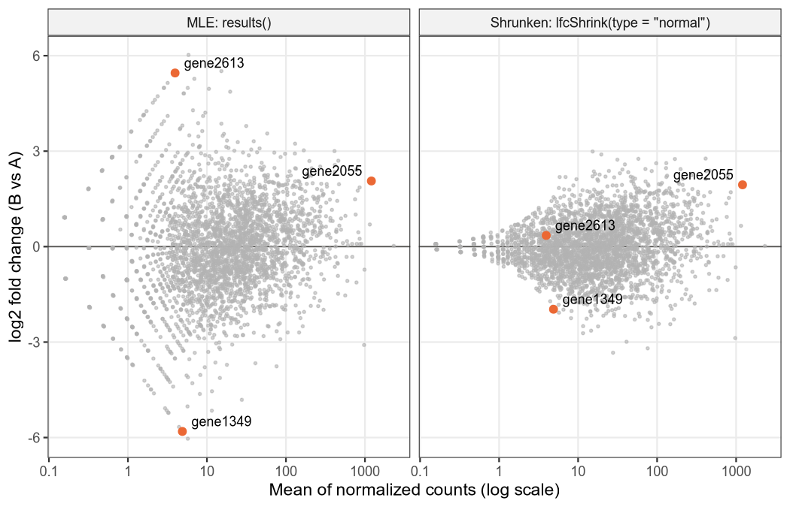
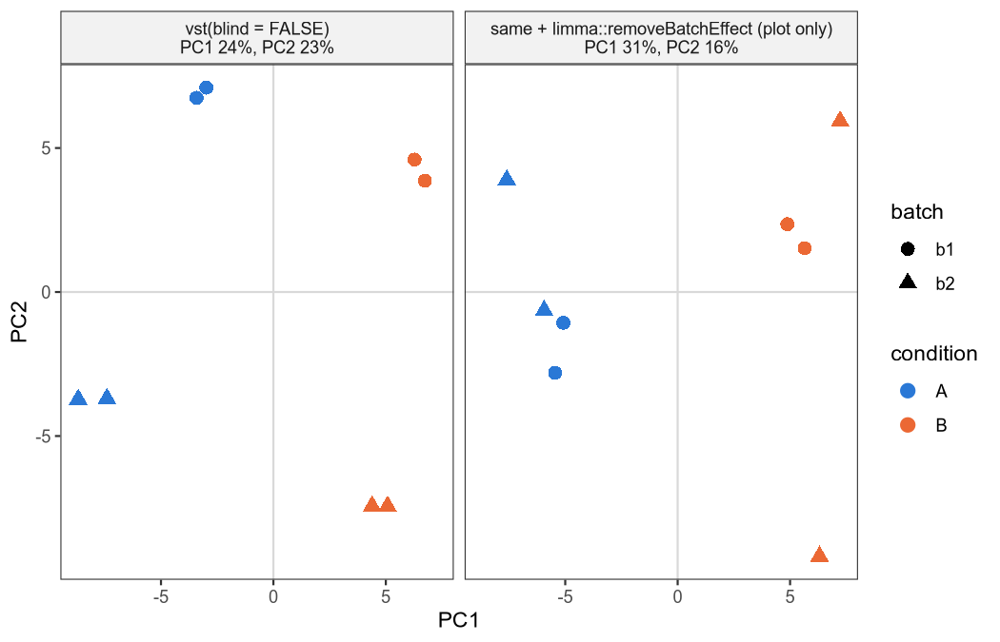

# 07. 적은 count에서 나온 큰 fold change를 믿어도 될까? LFC shrinkage와 결과표 점검

> 결과표를 받은 뒤 할 일 세 가지: 불안정한 LFC를 0 쪽으로 당겨 보고, NA의 원인을 가리고, QC 그림을 검정과 따로 읽는다.
> 교재: 13장 · 먼저 읽으면 좋은 노트: [03. dispersion 추정](03_dispersion_estimation.md), [05. Wald와 LRT](05_wald_vs_lrt.md), [06. 다중검정](06_multiple_testing.md) · 검증: R 4.5.2, DESeq2 1.50.2

## 이 노트에서 다루는 것

- read가 몇 개 안 되는 유전자에서 LFC가 왜 크게 튀는지, `lfcShrink()`가 그 값을 어떻게 0 쪽으로 당기는지
- shrink한 뒤에도 p 값은 그대로라는 것, 그리고 `lfcSE`라는 같은 열 이름이 함수마다 다른 뜻이라는 것
- 결과표의 NA가 어디서 생기는지, 특히 한 sample만 튀는 count outlier를 DESeq2가 언제 걸러 내는지
- VST, PCA 같은 QC 그림이 검정과 어떻게 다른 일을 하는지

## 1. 3개 대 3개에서 56배 차이, 믿어도 될까?

공통 예제인 유전자 A부터 보자. count(한 sample에서 그 유전자에 배정된 read 수)는 Ctrl에서 100, 130, 90, Starvation에서 200, 250, 180이다. DESeq2가 준 log2 fold change(LFC)는 0.977이다. LFC는 두 조건 평균 비의 log2라서, 0.977은 약 1.97배 늘었다는 뜻이다.

이 추정치의 SE(표준오차)는 0.289다. SE는 같은 실험을 반복하면 추정치가 얼마나 흔들릴지를 나타낸다. 추정치 ± 1.96 × SE로 만든 95% 구간은 [0.41, 1.54]이고, 배수로 바꾸면 1.3배에서 2.9배 사이다. count가 수백 개라 추정이 꽤 단단하다.

이번에는 count가 훨씬 적은 유전자를 보자. DESeq2에 들어 있는 모의 데이터 생성 함수로 유전자 3000개, 조건 A 3개 vs B 3개인 데이터를 만들고, 그중 gene1349를 골랐다.

```r
suppressPackageStartupMessages(library(DESeq2)); options(width = 110)
set.seed(7)
dds <- makeExampleDESeqDataSet(n = 3000, m = 6, betaSD = 1)   # 모의 데이터: 유전자 3000개, A 3개 vs B 3개
dds <- DESeq(dds, quiet = TRUE)
res <- results(dds)
counts(dds)["gene1349", ]
signif(as.data.frame(res["gene1349", c("baseMean", "log2FoldChange", "lfcSE", "pvalue", "padj")]), 4)
sel <- which(res$baseMean < 5 & abs(res$log2FoldChange) > 3 & res$lfcSE > 1)   # 저발현인데 LFC가 큰 유전자
oneZero <- rowSums(counts(dds)[sel, 1:3]) == 0 | rowSums(counts(dds)[sel, 4:6]) == 0
c(n_sel = length(sel), one_group_all_zero = sum(oneZero))
ok <- !is.na(res$log2FoldChange)                                               # 전체 분포: 대부분은 작다
cat("genes with LFC:", sum(ok), "| share with |LFC| < 1:", round(mean(abs(res$log2FoldChange[ok]) < 1), 3), "\n")
```

```
sample1 sample2 sample3 sample4 sample5 sample6 
     10       9      11       0       0       0 
         baseMean log2FoldChange lfcSE    pvalue     padj
gene1349    4.886         -5.808 1.699 0.0006278 0.008435
             n_sel one_group_all_zero 
                81                 38 
genes with LFC: 2984 | share with |LFC| < 1: 0.539
```

A에서는 10, 9, 11이고 B에서는 0, 0, 0이다. DESeq2는 LFC −5.81을 내놓는다. B가 A보다 56배 낮다는 뜻이다. p = 0.00063이고, padj(여러 유전자를 함께 검정한 것을 보정한 p 값, [06](06_multiple_testing.md))도 0.0084라서 유의하다. 그런데 SE가 1.70이다. 95% 구간은 [−9.14, −2.48]이고, 배수로는 약 5.6배 감소부터 약 560배 감소까지다.

데이터가 실제로 말해 주는 것은 "B가 A보다 훨씬 적다" 정도다. B의 세 sample이 모두 0이면 B의 평균이 0.1이든 0.01이든 비슷하게 그럴듯하다. 그런데 LFC는 바로 그 차이를 숫자로 적어야 한다.

MLE로 보면 사정이 더 분명하다. likelihood(가능도)는 관측값을 고정해 두고, parameter 후보가 그 관측값을 얼마나 그럴듯하게 만드는지 나타내는 값이다. MLE(최대가능도추정)는 likelihood가 가장 큰 parameter 값이다([03](03_dispersion_estimation.md)에서 자세히 다뤘다). B가 모두 0이면 LFC를 더 음수로 보낼수록 likelihood가 계속 커진다. 그래서 유한한 MLE가 없다. −5.81은 DESeq2가 계수를 계산할 때 기대 count(모형이 그 sample에서 예상하는 평균 count)에 0.5라는 하한(`minmu`)을 두어서 멈춘 자리다. 하한을 0.1로 낮추면 −8.13, 0.01로 낮추면 −11.45가 된다(아래 "더 깊이 보기"의 "한 그룹이 모두 0일 때").

한 그룹이 모두 0인 경우만 문제인 것은 아니다. count가 적으면 우연한 흔들림이 비율에 크게 반영된다. 평균이 10인 Poisson count의 표준편차는 약 3.2로 평균의 30% 정도다. 평균이 1000이면 표준편차는 약 32로 평균의 3%다([01](01_poisson_simulation.md)). 위 출력의 뒷부분이 이 모의 데이터 전체의 모습이다. baseMean은 유전자마다 여섯 sample의 정규화 count를 평균한 값이다. 정규화 count는 count를 size factor로 나눈 값이고, size factor는 sample마다 sequencing 깊이가 다른 것을 맞추는 배율이다. baseMean이 5보다 작으면서 |LFC| > 3, SE > 1인 유전자가 81개 있고, 그중 한 그룹이 모두 0인 것은 38개다.

## 2. lfcShrink는 LFC를 어떻게 0 쪽으로 당기나?

1절 출력의 마지막 줄을 보자. LFC가 계산된 유전자 2984개 중 54%는 |LFC|가 1보다 작다. 절반 넘는 유전자가 2배 넘게 변하지 않는다는 뜻이다. 그렇다면 정보가 적은 유전자의 극단적인 LFC는 "전체 경향" 쪽으로 당겨서 읽는 편이 낫다. 정보가 많은 유전자는 그대로 두면 된다. 정보가 적은 추정치를 전체 경향 쪽으로 당기는 일을 shrinkage(수축)라고 한다.

전체 경향은 prior(사전분포)로 표현한다. prior는 데이터를 보기 전에 parameter가 어디쯤 있을지에 대한 분포다. `lfcShrink(type = "normal")`은 LFC의 prior를 0을 중심으로 한 정규분포 N(0, σ²)로 둔다. σ²는 DESeq2가 전체 유전자의 MLE LFC 분포에서 정한다. 이렇게 prior를 데이터 전체에서 추정하는 방식을 empirical Bayes라고 한다. `type = "normal"`이 돌려주는 값은 likelihood와 prior를 함께 고려했을 때 가장 그럴듯한 값, 즉 MAP(사후최빈값)다.

dispersion에도 비슷한 shrinkage가 있었다([03](03_dispersion_estimation.md)). dispersion α는 분산 = μ + αμ²에서 Poisson보다 더 퍼지는 정도를 나타내는 값이다([02](02_negative_binomial.md)). 두 shrinkage는 당기는 방향과 쓰이는 곳이 다르다.

| | dispersion shrinkage | LFC shrinkage |
|---|---|---|
| 무엇을 당기나 | dispersion α | LFC |
| 어디로 당기나 (prior 중심) | trend: 평균 발현량에 따라 dispersion이 대체로 어디쯤 있는지 나타내는 곡선 (0이 아니다) | 0 (normal, apeglm) 또는 0 근처 mixture (ashr) |
| 왜 하나 | 유전자별 dispersion 추정의 불안정을 줄인다 | 저발현·고분산 유전자의 잡음 섞인 효과 크기를 줄인다 |
| 언제 하나 | `DESeq()` 안에서 자동 (`estimateDispersionsMAP`) | `DESeq()`가 끝난 뒤 `lfcShrink()`를 따로 부른다 |
| 결과가 가는 곳 | 이후 GLM 적합과 검정 전체 (검정의 SE에 반영된다) | 효과 크기의 순위, 그림, 보고. 기본 호출에서는 `log2FoldChange`와 `lfcSE` 두 열만 바뀐다 |

표의 GLM(일반화 선형모형)은 count의 평균을 log 척도에서 조건·batch 등의 합으로 표현하는 모형이다([04](04_glm_condition_batch.md)).

`type = "normal"`이 최대화하는 식은 다음과 같다.

$$
\ell(\beta) - \frac{\beta^2}{2\sigma^2}
$$

- β: 찾으려는 LFC(log2 단위).
- ℓ(β): β가 이 유전자의 count를 얼마나 잘 설명하는지를 나타내는 log likelihood. MLE는 이것만 최대화한 값이다.
- β²/(2σ²): β가 0에서 멀어질수록 커지는 벌점. σ²가 작을수록 벌점이 세다.

count가 많은 유전자는 ℓ(β)가 MLE 근처에서 뾰족하다. MLE에서 조금만 벗어나도 likelihood가 크게 떨어지므로 벌점이 β를 거의 움직이지 못한다. count가 적은 유전자는 ℓ(β)가 평평하다. 여러 β가 비슷하게 그럴듯하므로 벌점 쪽이 이겨서 0 쪽으로 크게 끌려간다.

likelihood를 정규분포로 근사하면 이 효과를 한 줄로 쓸 수 있다.

$$
\hat\beta_{\text{shrunken}} \approx \hat\beta_{\text{MLE}} \times \frac{\sigma^2}{\sigma^2 + \text{SE}^2}
$$

- β̂_MLE와 SE: `results()`가 준 LFC와 그 표준오차.
- σ²/(σ² + SE²): 0과 1 사이의 배율. SE가 σ보다 훨씬 작으면 1에 가깝고, SE가 크면 0에 가깝다.

이 식은 이해를 돕는 근사다. DESeq2는 이 식을 쓰지 않는다. 벌점을 붙인 IRLS(계수를 찾는 반복 가중 최소제곱 계산, ridge-penalized IRLS)로 MAP를 직접 찾는다. 위 모의 데이터에서 DESeq2가 정한 σ²는 1.591이었다. 같은 σ²를 빌려 와 유전자 A에 대입해 보자. SE² = 0.289² = 0.0836이므로 배율은 1.591 / (1.591 + 0.0836) = 0.950이다. 0.977 × 0.950 = 0.928이 된다. DESeq2로 직접 계산해도 같다. 아래 코드에서 `betaPriorVar`의 첫 값 1e6은 절편(Intercept)에는 사실상 prior를 두지 않는다는 뜻이다.

```r
suppressPackageStartupMessages(library(DESeq2))
cts <- matrix(c(100L, 130L, 90L, 200L, 250L, 180L), nrow = 1, dimnames = list("geneA", paste0("s", 1:6)))
cd  <- data.frame(condition = factor(rep(c("Ctrl", "Starvation"), each = 3)))
dA  <- DESeqDataSetFromMatrix(cts, cd, ~ condition)
sizeFactors(dA) <- rep(1, 6)
dispersions(dA) <- 0.053147                                  # 최종 α를 고정
mle <- results(nbinomWaldTest(dA, quiet = TRUE))
s2  <- 1.591035                                              # 1절 모의 데이터에서 lfcShrink가 추정한 prior 분산 (log2)
map <- results(nbinomWaldTest(dA, betaPrior = TRUE, betaPriorVar = c(1e6, s2),
                                modelMatrixType = "standard", quiet = TRUE))
se  <- mle$lfcSE
cat(sprintf("MLE  LFC %.6f  SE %.6f\n", mle$log2FoldChange, se))
cat(sprintf("MAP  LFC %.6f  (prior N(0, %.3f))\n", map$log2FoldChange, s2))
cat(sprintf("근사 s2/(s2+SE^2) = %.4f  ->  %.4f\n", s2 / (s2 + se^2), mle$log2FoldChange * s2 / (s2 + se^2)))
```

```
MLE  LFC 0.977280  SE 0.289057
MAP  LFC 0.928519  (prior N(0, 1.591))
근사 s2/(s2+SE^2) = 0.9501  ->  0.9285
```

유전자 A는 0.977에서 0.929로 조금만 줄었다(약 1.97배 → 1.90배). 1절의 gene1349에도 같은 계산을 해 보자(1절 코드에 이어서 실행).

```r
shr <- lfcShrink(dds, coef = "condition_B_vs_A", type = "normal", quiet = TRUE)
s2 <- priorInfo(shr)$betaPriorVar[["conditionB"]]      # 전체 유전자에서 추정한 prior 분산 σ² (log2 단위)
s2
g <- c("gene1349", "gene2613", "gene2055")
mle <- res[g, "log2FoldChange"]; se <- res[g, "lfcSE"]
round(data.frame(baseMean = res[g, "baseMean"], MLE = mle, SE = se, factor = s2 / (s2 + se^2),
                 approx = mle * s2 / (s2 + se^2), shrunken = shr[g, "log2FoldChange"], row.names = g), 3)
```

```
[1] 1.591035
         baseMean    MLE    SE factor approx shrunken
gene1349    4.886 -5.808 1.699  0.355 -2.064   -1.969
gene2613    3.950  5.457 3.754  0.101  0.554    0.352
gene2055 1205.552  2.063 0.313  0.942  1.943    1.943
```

`factor` 열이 배율이고 `approx`가 근사식의 값, `shrunken`이 DESeq2의 값이다. gene1349는 배율이 0.355라서 −5.81이 −1.97(약 3.9배 감소)로 크게 줄었다. SE가 3.75인 gene2613은 5.46에서 0.35까지 눌렸다. count가 1000을 넘는 gene2055는 2.06에서 1.94로 거의 그대로다. 근사식은 정보가 많은 유전자에서는 거의 정확하고, 정보가 적은 유전자에서는 방향과 대략의 크기만 맞춘다.

MA plot은 x축에 평균 count, y축에 LFC를 찍은 그림이다. shrink 전후를 나란히 놓으면 이 효과가 한눈에 보인다.



왼쪽은 `results()`의 MLE, 오른쪽은 `lfcShrink(type = "normal")`의 값이다. 평균 count가 작은 왼쪽 끝에서 넓게 퍼져 있던 점들이 오른쪽에서는 0 근처로 모이고, 평균이 큰 쪽은 거의 그대로다.

<details>
<summary>그림을 만든 코드</summary>

```r
suppressPackageStartupMessages({ library(DESeq2); library(ggplot2) })
set.seed(7)
dds <- makeExampleDESeqDataSet(n = 3000, m = 6, betaSD = 1)
dds <- DESeq(dds, quiet = TRUE)
res <- results(dds)
shr <- lfcShrink(dds, coef = "condition_B_vs_A", type = "normal", quiet = TRUE)
panel <- c("MLE: results()", "Shrunken: lfcShrink(type = \"normal\")")
df <- rbind(data.frame(panel = panel[1], gene = rownames(res), mean = res$baseMean, lfc = res$log2FoldChange),
            data.frame(panel = panel[2], gene = rownames(shr), mean = shr$baseMean, lfc = shr$log2FoldChange))
df <- df[df$mean > 0, ]                      # all-zero 유전자는 그릴 값이 없다
df$panel <- factor(df$panel, panel)
lab <- df[df$gene %in% c("gene1349", "gene2613", "gene2055"), ]
lab$hj <- ifelse(lab$gene == "gene2055", 1.15, -0.15)   # 오른쪽 끝 라벨은 왼쪽에
p <- ggplot(df, aes(mean, lfc)) +
  geom_hline(yintercept = 0, colour = "#52514e", linewidth = 0.4) +
  geom_point(colour = "grey70", size = 0.6, alpha = 0.6) +
  geom_point(data = lab, colour = "#eb6834", size = 2) +
  geom_text(data = lab, aes(label = gene, hjust = hj), size = 3, vjust = -0.5) +
  scale_x_log10(breaks = 10^(-1:3), labels = c("0.1", "1", "10", "100", "1000")) + facet_wrap(~ panel) +
  labs(x = "Mean of normalized counts (log scale)", y = "log2 fold change (B vs A)") +
  theme_bw(base_size = 11) +
  theme(panel.grid.minor = element_blank(), strip.background = element_rect(fill = "grey95"))
out <- "../figures/07_ma_before_after_shrink.png"   # notes/ 에서 실행
ggsave(out, p, width = 7, height = 4.5, dpi = 150, bg = "white")
cat("genes plotted per panel:", sum(df$panel == panel[1]), "| LFC range MLE:", round(range(res$log2FoldChange, na.rm = TRUE), 2),
    "| shrunken:", round(range(shr$log2FoldChange, na.rm = TRUE), 2), "\n")
cat("file exists:", file.exists(out), file.size(out), "bytes\n")
```

```
genes plotted per panel: 2984 | LFC range MLE: -6.04 6.02 | shrunken: -3.33 2.99 
file exists: TRUE 182810 bytes
```

</details>

숫자로도 확인할 수 있다. |MLE LFC| > 0.5인 유전자만 모아 baseMean 구간별로 |shrunken| / |MLE|의 중앙값을 구하면, baseMean 5 이하에서 0.270, 5–20에서 0.616, 20–100에서 0.817, 100–1000에서 0.895, 1000 초과에서 0.941이었다. 발현이 높을수록 1에 가까워, 덜 당겨진다. 이 계산은 "더 깊이 보기"의 실험 1에 있다. 이 노트에서 "실험 N"이라고 부르는 것은 모두 그곳의 접이식 블록이다.

`lfcShrink()`의 방법(`type`)은 세 가지다. 셋 다 posterior(사후분포)를 쓴다. posterior는 likelihood와 prior를 합친 분포다. mode는 그 분포의 꼭대기, mean은 평균이다. 셋은 prior 모양과 돌려주는 값이 다르다.

| `type=` | prior 모양 | 돌려주는 값 | 이 환경 |
|---|---|---|---|
| `"apeglm"` (기본값) | 꼬리가 두꺼운 분포 (도움말: adaptive Student's t) | posterior mode (MAP) | 미설치, 실행 불가 |
| `"ashr"` | 0 중심 정규분포 여러 개를 섞은 mixture | posterior mean (라벨 "MMSE", 평균제곱오차를 가장 작게 하는 추정이라는 뜻) | 미설치, 실행 불가 |
| `"normal"` | 정규분포 N(0, σ²) | posterior mode (MAP) | DESeq2 내장. 이 노트의 모든 실행 |

그래서 "lfcShrink 결과는 모두 MAP"라고 쓰면 ashr에서 틀린다. apeglm처럼 꼬리가 두꺼운 prior는 큰 효과를 덜 누른다.

이 환경에는 apeglm과 ashr가 설치되어 있지 않다. `type`의 기본값이 `"apeglm"`이라서 `type`을 생략하면 설치 오류로 멈춘다. 교재 13.2의 예시 `lfcShrink(dds, coef="condition_Starvation_vs_Ctrl", type="apeglm")`도 계수 이름은 맞지만 같은 이유로 멈춘다. 이 노트는 모든 shrinkage를 `type = "normal"`로 돌렸고, apeglm과 ashr에 대한 설명은 `lfcShrink` 소스와 도움말로 확인했다(더 깊이 보기).

## 3. shrink한 뒤 결과표에서 무엇이 바뀌나?

바뀌는 것은 `log2FoldChange`와 `lfcSE` 두 열이다. p 값과 padj는 그대로다(1–2절 코드에 이어서 실행).

```r
c(pvalue_same = identical(res$pvalue, shr$pvalue), padj_same = identical(res$padj, shr$padj))
z <- shr["gene1349", "log2FoldChange"] / shr["gene1349", "lfcSE"]        # 하면 안 되는 계산
round(c(stat_MLE = res["gene1349", "stat"], z_from_shrunken = z), 3)
signif(c(p_saved = res["gene1349", "pvalue"], p_from_z = 2 * pnorm(-abs(z))), 3)
```

```
pvalue_same   padj_same 
       TRUE        TRUE 
       stat_MLE z_from_shrunken 
         -3.419          -3.142 
 p_saved p_from_z 
0.000628 0.001680
```

`pvalue`와 `padj`는 값까지 같다. 검정은 여전히 MLE와 그 SE로 한 Wald 검정이다([05](05_wald_vs_lrt.md)). Wald 검정은 (추정치 − 0) / SE를 표준정규분포와 비교한다. shrunken LFC는 검정용이 아니라 효과 크기를 순위 매기고 그림으로 그리고 보고하기 위한 값이다.

그렇다면 shrunken LFC를 새 `lfcSE`로 나눠 Z를 다시 만들면 어떨까? gene1349의 Wald 통계량은 −3.419인데 그렇게 만든 값은 −3.142다. 여기서 p를 구하면 0.00168로, 저장된 p 0.000628과 다르다. 이 새 숫자는 MLE 검정도 아니고 Bayes 추론도 아니다. 두 값을 섞은 것일 뿐이다.

이유는 `lfcSE`의 뜻이 바뀌었기 때문이다. 같은 열 이름이 object를 만든 함수에 따라 다른 양을 담는다.

| object를 만든 함수 | `lfcSE`의 뜻 | gene1349 |
|---|---|---|
| `results()` | MLE의 Wald SE | 1.70 |
| `lfcShrink(type = "apeglm")`, `"ashr"` | posterior SD (posterior 분포의 표준편차) | 미설치라 미실행 |
| `lfcShrink(type = "normal")` | 벌점을 붙인 추정치의 SE. posterior SD도 Wald SE도 아니다 | 0.63 |

normal의 `lfcSE`는 도움말에 posterior SD라고 적혀 있지만 구현은 다르다. posterior SD를 근사(Laplace 근사)해 직접 계산하면 gene1349에서 0.94가 나온다. normal이 돌려주는 0.63은 이보다 작다(실험 1). 열 설명도 normal에서는 "standard error" 그대로 남는다. apeglm과 ashr는 소스에서 이 설명을 "posterior SD"로 바꿔 쓴다.

그래서 "추정치 ± 1.96 × lfcSE"라는 같은 계산이 서로 다른 구간을 만든다.

| 그림·표의 막대 | 계산 | 종류 | gene1349 |
|---|---|---|---|
| Wald 95% 구간 | `results()`의 LFC ± 1.96·lfcSE | MLE의 명목(빈도주의) 구간 | [−9.14, −2.48] |
| apeglm posterior interval | `returnList=TRUE`로 받은 apeglm 적합 객체의 `interval` | credible interval (posterior에서 얻은 구간) | 소스의 `ape.cols`에 `"interval"`이 있다. 미설치라 미실행 |
| normal의 MAP ± 1.96·lfcSE | `lfcShrink(type = "normal")` | 어느 쪽도 아님 | [−3.20, −0.74] |
| (참고) MAP ± 1.96·Laplace SD | 직접 계산 | 근사 posterior 구간 | [−3.81, −0.12] |
| padj | BH(Benjamini–Hochberg) 보정 | 구간이 아니라 FDR 수준 | 0.0084 |

SE가 3.75인 gene2613은 Wald 구간이 [−1.90, 12.81]로 0을 포함하는데, normal의 MAP ± 1.96·lfcSE는 [−0.42, 1.12]로 좁다. 불확실성이 실제보다 작아 보인다. 그림을 그릴 때는 점과 막대가 이 중 무엇인지 캡션에 적는다. `plotMA(res)`의 점은 MLE이고 `plotMA(shr)`의 점은 shrunken LFC다.

apeglm이나 ashr에 `svalue = TRUE`를 주면 p 값 대신 s-value가 나온다. s-value는 "이 유전자보다 s-value가 같거나 작은 유전자들 사이에서 LFC의 부호가 틀렸을 확률의 평균"이다. padj는 "이 유전자까지 발견으로 부를 때, 목록에 실제로는 차이가 없는(β = 0) 유전자가 섞인 비율의 기대값(FDR)을 통제하는 최소 수준"이다([06](06_multiple_testing.md)). 둘 다 목록 단위의 값이지만, s-value는 부호 오류를, padj는 차이 없는 유전자가 섞이는 것을 다룬다.

예외도 있다. `lfcThreshold`는 "LFC가 0이 아니다" 대신 "|LFC|가 이 값보다 크다"를 검정하게 하는 인자다. normal에 `lfcThreshold > 0`을 주면 `stat`, `pvalue`, `padj`까지 shrunken 적합의 threshold 검정으로 바뀐다(실험 2). apeglm과 ashr는 기본 호출에서 `stat` 열을 뺀다. type별 열 구성은 "더 깊이 보기"의 lfcShrink 소스 블록에 정리했다.

## 4. Starvation과 Glucose를 직접 비교할 때는 어떻게 shrink하나?

공통 예제의 세 그룹을 생각하자. Ctrl, Starvation, Starvation+Glucose(줄여서 Glucose)다. Ctrl을 기준으로 두면 계수는 `condition_Starvation_vs_Ctrl`과 `condition_Glucose_vs_Ctrl` 두 개다. "Glucose vs Starvation"은 계수가 아니라 두 계수의 차, 즉 contrast다. contrast는 어떤 두 조건(또는 계수 조합)을 비교할지 정하는 벡터다([04](04_glm_condition_batch.md)).

그러면 두 계수를 각각 shrink한 뒤 빼면 Glucose vs Starvation의 shrunken LFC가 될까? 세 그룹 모의 데이터(A=Ctrl, B=Starvation, C=Glucose, 각 3개, 유전자 2000개)로 확인했다(실험 2).

- MLE에서는 뺄셈이 정확히 맞는다. (C − A) − (B − A)와 `results(contrast = c("condition", "C", "B"))`의 최대 차이는 8.9e-16이다. 예외는 B와 C가 모두 0인 유전자 14개다. 이 경우 `results()`가 contrast의 LFC를 0, p를 1로 덮어쓴다.
- shrink한 값은 다르다. 두 shrunken 계수의 차와 `lfcShrink(contrast = ...)`의 차이는 최대 0.69, 중앙값 0.05였다. 저발현 gene158(baseMean 4.7)은 MLE 4.27, 뺄셈 0.66, contrast shrink 1.35였다.

차이는 prior에서 온다. 여기서 design matrix는 각 sample이 어떤 조건·batch·pair에 속하는지 숫자로 적은 표다. `coef` 경로는 기준 수준을 둔 보통의 design matrix에서 계수마다 prior 분산을 따로 정한다(Starvation 0.80, Glucose 1.695). `contrast` 경로는 모든 수준에 같은 prior 분산(1.195)을 둔 다른 형태의 design matrix로 다시 적합한다. Starvation을 기준으로 다시 잡아(`relevel`) `coef`로 부르면 prior 분산이 또 달라서(0.8, 1.089) contrast 경로와 최대 1.24, 뺄셈과 최대 1.28 차이가 난다. apeglm은 `coef`만 받고, 호출할 때마다 그 계수 하나의 posterior만 다시 추정한다.

세 방법은 서로 다른 prior를 쓰는 셈이라 어느 하나만 "정답"은 아니다. 교재의 결론, 즉 두 shrunken 계수를 빼는 것이 contrast의 올바른 posterior shrinkage와 같지 않다는 말은 맞다. 다만 normal에서 그 이유는 prior를 어떤 계수에 걸었느냐다. 같은 비교라도 계수를 어떻게 정의했는지(기준 수준, design matrix 형태)에 따라 prior가 달라진다. 보고할 때는 어떤 경로를 썼는지 밝히고 `priorInfo()`로 prior 분산을 남긴다.

## 5. 결과표의 NA는 무엇을 뜻하나?

유전자 A로 돌아가자. Ctrl의 첫 sample이 100이 아니라 1000이었다고 해 보자. 시료 오염 같은 사고로 한 sample만 튄 상황이다. dispersion α는 0.053147로 고정했다.

```r
suppressPackageStartupMessages(library(DESeq2))
fitA <- function(ctrl1) {
  cts <- matrix(as.integer(c(ctrl1, 130, 90, 200, 250, 180)), nrow = 1, dimnames = list("geneA", paste0("s", 1:6)))
  d <- DESeqDataSetFromMatrix(cts, data.frame(condition = factor(rep(c("Ctrl", "Starvation"), each = 3))), ~ condition)
  sizeFactors(d) <- rep(1, 6); dispersions(d) <- 0.053147
  nbinomWaldTest(d, quiet = TRUE)
}
for (x in c(100, 1000)) {
  d <- fitA(x)
  r <- tryCatch(results(d), error = function(e) conditionMessage(e))
  cat("Ctrl1 =", x, "| cooks:", round(assays(d)[["cooks"]][1, ], 3), "| maxCooks:", round(mcols(d)$maxCooks, 3),
      "| cutoff:", round(qf(0.99, 2, 4), 2), "\n")
  if (is.character(r)) cat("  results error:", r, "\n") else cat("  LFC", round(r$log2FoldChange, 4), "pvalue", signif(r$pvalue, 4), "\n")
  cat("  robust alpha:", DESeq2:::robustMethodOfMomentsDisp(d, model.matrix(~condition, colData(d))), " H:", round(assays(d)[["H"]][1,], 4), "\n")
}
```

```
Ctrl1 = 100 | cooks: 0.03 0.363 0.185 0.019 0.304 0.171 | maxCooks: 0.363 | cutoff: 18 
  LFC 0.9773 pvalue 0.0007224 
  robust alpha: 0.04  H: 0.3333 0.3333 0.3333 0.3333 0.3333 0.3333 
Ctrl1 = 1000 | cooks: 18.801 4.088 5.355 0.019 0.304 0.171 | maxCooks: 18.801 | cutoff: 18 
  LFC -0.9535 pvalue NA 
  robust alpha: 0.04  H: 0.3333 0.3333 0.3333 0.3333 0.3333 0.3333
```

원래 데이터에서 `cooks`의 최댓값은 0.363이다. 첫 sample을 1000으로 바꾸면 그 sample의 값이 18.80이 되고 `pvalue`가 NA가 된다. LFC는 −0.95로 남아 있다. Ctrl 평균이 406.7로 뛰어서 방향이 뒤집힌 값이다.

`cooks`는 Cook's distance다. 한 sample의 count가 계수 추정을 얼마나 끌고 가는지를 나타낸다. DESeq2는 다음 식으로 계산한다.

$$
\text{Cook}_{ij} = \frac{(K_{ij} - \mu_{ij})^2}{V_{ij}} \cdot \frac{1}{p} \cdot \frac{h_{jj}}{(1 - h_{jj})^2}, \qquad V_{ij} = \mu_{ij} + \tilde\alpha_i\, \mu_{ij}^2
$$

- K_ij: 유전자 i, sample j의 count. μ_ij: 그 sample의 기대 count.
- V_ij: 그 count의 분산. α̃_i는 이 계산에만 쓰는 dispersion으로, 튀는 값에 덜 흔들리게 따로 구한다. 하한이 0.04이고 유전자 A는 하한값 0.04다.
- 첫 항 (K − μ)²/V: count가 기대에서 얼마나 벗어났는가.
- p: 계수 개수. 두 그룹이면 2.
- h_jj: leverage. 그 sample이 자기 적합값을 얼마나 끌어당길 수 있는 위치인지 나타낸다. 한 그룹에 3개씩이면 1/3이고, h/(1 − h)² = 0.75다.

1000을 넣은 경우를 대입하면 μ = (1000 + 130 + 90) / 3 = 406.67, V = 406.67 + 0.04 × 406.67² = 7021.8이다. (1000 − 406.67)² / 7021.8 = 50.14이고, 여기에 1/2과 0.75를 곱하면 18.80이다.

기준값은 F 분포의 99% 분위수 F₀.₉₉(p, n − p)다. n은 sample 수다. n = 6, p = 2면 F₀.₉₉(2, 4) = 18.0이다. 18.80 > 18이므로 이 유전자의 p를 NA로 둔다. LFC는 남긴다. 그래서 "LFC는 있는데 p만 NA"가 Cook's outlier의 표시다.

결과표의 NA는 원인마다 다른 열에 나타난다.

| 결과표에서 보이는 것 | 원인 | 확인할 것 | 확인한 곳 |
|---|---|---|---|
| `baseMean = 0`, LFC·lfcSE·stat·p·padj 모두 NA | 모든 sample에서 count 0 (`allZero`) | 원래 count | 실험 4 |
| LFC는 있고 p, padj만 NA | Cook's distance가 기준을 넘은 count outlier | `assays(dds)[["cooks"]]`, `mcols(dds)$maxCooks` | 실험 3의 (a), (e) |
| p는 있고 padj만 NA | independent filtering: baseMean이 `filterThreshold`보다 낮아 보정 대상에서 빠짐 ([06](06_multiple_testing.md)) | `metadata(res)$filterThreshold` | 실험 4, 문제 17 |
| baseMean은 0보다 큰데 LFC부터 padj까지 모두 NA | weights 때문에 그 유전자의 계수를 추정할 수 없음 (`weightsFail`, all-zero처럼 처리됨) | `mcols(dds)$weightsFail` | 더 깊이 보기의 "p까지 NA가 되는 경우" |
| (NA 아님) 수렴 경고 | IRLS와 그 대안인 optim 계산이 모두 수렴하지 못함 (`betaConv == FALSE`) | `mcols(dds)$betaConv`, `betaIter`, design matrix의 full rank | 실험 4 (미수렴 0건). 일부러 만든 미수렴에서도 p는 NA가 아니다 (더 깊이 보기의 "p까지 NA가 되는 경우") |
| (NA 아님) LFC 0, stat 0, p 1 | `contrast=`로 비교하는 두 그룹이 모두 0 (`cleanContrast`) | 두 그룹의 count | 실험 2 (gene357) |

실험 1의 데이터(유전자 3000개)에서 세어 보면, 모두 NA인 all-zero 유전자가 16개, padj만 NA인 유전자가 579개였다. 579개의 baseMean은 모두 `filterThreshold` 4.4313보다 낮았다. Cook's outlier는 없었고(최대 17.54 < 18), 수렴 실패도 없었다(실험 4).

Cook's 필터가 언제나 작동하는 것은 아니다. DESeq2는 design의 같은 칸(cell)에 sample이 3개 이상 있을 때만 그 sample들로 Cook's 판정을 한다. 여기서 칸은 design matrix에서 같은 행을 갖는 sample 묶음, 즉 조건·batch 조합이 같은 sample들이다. 모의 데이터의 한 유전자에 5000을 넣어 설계별로 확인했다(실험 3).

| 설계 | 무슨 일이 일어나나 |
|---|---|
| 3 vs 3 | Cook's 36.9 > 18이라 p가 NA. 필터를 끄면(`cooksCutoff=FALSE`) p = 0.00177 |
| 2 vs 2 | 3개 이상인 칸이 없어 `maxCooks`가 모두 NA. 필터 없이 p = 0.00451이 그대로 나온다 |
| 3 vs 2 | 3개짜리 그룹의 sample만 판정한다. 2개짜리 그룹의 큰 Cook's는 무시된다 |
| `~ pair + condition` (paired) | sample마다 design matrix의 행이 달라 칸당 1개다. Cook's 필터가 아예 없다 |
| 칸에 7개 이상 (예: 7 vs 7) | 튀는 count를 trimmed mean(위아래 20%를 뺀 평균) × size factor 값으로 바꾸고 다시 적합한다(5000 → 5). 원래 count는 `counts(dds)`에 남는다. 모든 sample이 교체 대상이면 이후 `results()`의 Cook's 필터는 꺼진다 |

공통 예제에서 같은 donor로부터 세 조건을 얻어 `~ pair + condition`으로 분석하면 Cook's 필터는 작동하지 않는다. 한 sample이 결론을 좌우하는지는 `plotCounts()`로 직접 봐야 한다.

마지막으로, NA는 생물학적 결론이 아니다. p가 NA인 Cook's outlier 유전자는 오히려 LFC −7.9의 큰 차이를 보였다(실험 3). padj만 NA인 유전자는 count가 낮아 보정 대상에서 빠진 것이다. 그러니 NA를 "발현 차이 없음"이나 "발현 없음"으로 바꾸지 않는다. 메타분석이나 민감도 비교에서 NA를 "발견 아님"으로 세는 규칙은 쓸 수 있다. 다만 그 규칙과 NA의 원인(위 표의 열 패턴)을 함께 기록한다.

## 6. VST와 PCA는 무엇을 보여 주고, 무엇을 하지 않나?

유전자 A의 Ctrl 평균은 106.7, Starvation 평균은 210이다. 음이항분포(NB)에서 분산은 μ + αμ²이므로, α = 0.053147이면 분산은 각각 106.667 + 0.053147 × 106.667² ≈ 711과 210 + 0.053147 × 210² ≈ 2554다. 평균은 약 2배인데 분산은 3.6배다. 이처럼 count의 분산은 평균에 따라 달라진다. VST(variance stabilizing transformation, 분산 안정화 변환)와 rlog(regularized log)는 이 평균–분산 의존성과 low count의 잡음을 줄이는 변환이다. 변환한 값은 PCA, clustering, heatmap 같은 탐색용 그림에 쓴다.

변환한 값을 검정에 넣지는 않는다. DESeq2의 NB GLM은 raw count의 평균–분산 관계와 size factor를 직접 모형에 넣는다. 변환값은 그 관계를 이미 눌러 버린 log 척도의 값이다. 검정에 필요한 정보가 이미 사라진 셈이다. 변환값을 `DESeqDataSetFromMatrix()`에 넣으면 정수가 아니라고 거부하는데, 이것은 증상일 뿐이다. `round(2^vst)`처럼 정수로 되돌려도 문제는 그대로다.

`blind` 인자는 자주 오해된다. `blind = TRUE`는 dispersion trend를 추정할 때 design을 `~1`로 바꾼다. `~1`은 조건 정보를 전혀 쓰지 않는 design이다. `blind = FALSE`는 현재 design을 쓴다. 둘 다 변환된 행렬에서 batch나 condition 효과를 빼 주지는 않는다.

실험 5는 이것을 보여 준다. condition(A, B)과 batch(b1, b2)를 균형 있게 배치한 8개 sample에서, 유전자 600개가 b2에서 2배 높도록 만들었다. `~ batch + condition`으로 `DESeq()`를 돌린 뒤 `vst(blind = FALSE)` 값으로 PCA를 그렸다. PCA(주성분 분석)는 sample 사이의 차이를 가장 크게 보여 주는 축 몇 개로 데이터를 요약하는 방법이다.



왼쪽 `vst(blind = FALSE)`에서도 PC2가 batch로 갈린다(PC2의 batch 평균 ±5.58). 오른쪽은 같은 행렬의 사본에 `limma::removeBatchEffect()`를 적용한 것이다. 이 함수는 변환된 값에서 batch 효과를 선형모형으로 추정해 빼 준다. 그 결과 PC2의 batch 평균이 0이 되었다.

<details>
<summary>그림을 만든 코드</summary>

```r
suppressPackageStartupMessages({ library(DESeq2); library(ggplot2) })
set.seed(4)                                                  # 실험 5와 같은 데이터
dds <- makeExampleDESeqDataSet(n = 2000, m = 8, betaSD = 0.5)
dds$batch <- factor(rep(c("b1", "b2"), 4))
bf <- rep(1, nrow(dds)); bf[1:600] <- 2
cts <- counts(dds); j <- dds$batch == "b2"
cts[, j] <- matrix(rpois(sum(j) * nrow(dds), lambda = cts[, j] * bf), nrow = nrow(dds))
counts(dds) <- cts; design(dds) <- ~ batch + condition
dds <- DESeq(dds, quiet = TRUE)
vsd <- vst(dds, blind = FALSE)
vsdR <- vsd                                                  # 그림 전용 사본
assay(vsdR) <- limma::removeBatchEffect(assay(vsd), batch = vsd$batch,
                                        design = model.matrix(~ condition, colData(vsd)))
getpc <- function(v, title) {
  pd <- plotPCA(v, intgroup = c("condition", "batch"), returnData = TRUE)
  pv <- round(100 * attr(pd, "percentVar"))
  data.frame(pd[, c("PC1", "PC2", "condition", "batch")], panel = sprintf("%s\nPC1 %d%%, PC2 %d%%", title, pv[1], pv[2]))
}
df <- rbind(getpc(vsd, "vst(blind = FALSE)"), getpc(vsdR, "same + limma::removeBatchEffect (plot only)"))
df$panel <- factor(df$panel, unique(df$panel))
p <- ggplot(df, aes(PC1, PC2, colour = condition, shape = batch)) +
  geom_hline(yintercept = 0, colour = "grey85") + geom_vline(xintercept = 0, colour = "grey85") +
  geom_point(size = 3) + facet_wrap(~ panel) +
  scale_colour_manual(values = c(A = "#2a78d6", B = "#eb6834")) + scale_shape_manual(values = c(b1 = 16, b2 = 17)) +
  theme_bw(base_size = 11) +
  theme(panel.grid = element_blank(), strip.background = element_rect(fill = "grey95"))
out <- "../figures/07_pca_vst_batch.png"            # notes/ 에서 실행
ggsave(out, p, width = 7, height = 4.5, dpi = 150, bg = "white")
print(aggregate(cbind(PC1, PC2) ~ panel + batch, df, function(x) round(mean(x), 2)))
cat("file exists:", file.exists(out), file.size(out), "bytes\n")
```

```
using ntop=500 top features by variance
using ntop=500 top features by variance
                                                          panel batch   PC1
1                          vst(blind = FALSE)\nPC1 24%, PC2 23%    b1  1.65
2 same + limma::removeBatchEffect (plot only)\nPC1 31%, PC2 16%    b1  0.00
3                          vst(blind = FALSE)\nPC1 24%, PC2 23%    b2 -1.65
4 same + limma::removeBatchEffect (plot only)\nPC1 31%, PC2 16%    b2  0.00
    PC2
1  5.58
2  0.00
3 -5.58
4  0.00
file exists: TRUE 29403 bytes
```

</details>

batch를 뺀 오른쪽 행렬은 그림 전용이다. 검정은 여전히 raw count와 `~ batch + condition` design으로 `DESeq()`에서 한다. batch와 condition이 완전히 겹치게 설계를 바꾸면 `DESeq()`는 "full model matrix is less than full rank"라며 적합을 거부한다. 이런 설계에서는 PCA에서 깨끗하게 갈라져 보여도 그것이 condition 효과인지 batch 효과인지 데이터로 구분할 수 없다.

함수 선택에도 작은 차이가 있다. 교재 예시의 `varianceStabilizingTransformation(dds, blind = FALSE)`는 `DESeq()`가 이미 맞춘 trend를 그대로 쓴다. `vst(dds, blind = FALSE)`는 baseMean > 5인 유전자 중 1000개(`nsub`)를 골라 trend를 다시 맞추므로 값이 조금 다르다(최대 0.289). `rlog(blind = FALSE)`도 batch를 지우지 않는다(PC2 ±6.0).

QC 그림에서 볼 것을 정리하면 다음과 같다.

- PCA (`plotPCA`, 기본은 분산 상위 500개 유전자): condition뿐 아니라 batch, donor, RNA quality(RIN 같은 colData의 품질 변수), 이상 sample을 본다.
- dispersion plot (`plotDispEsts`): trend가 잘 맞는지, trend보다 훨씬 위에 있는 유전자가 있는지 본다.
- MA plot (`plotMA`): 저발현 유전자의 큰 MLE와, shrinkage가 그것을 어떻게 누르는지 구분해 본다(1번 그림).
- 관심 유전자 (`plotCounts(dds, gene, intgroup, returnData = TRUE)`): 정규화 count를 sample별로 꺼내 한 sample이 결론을 좌우하는지 본다. 반환되는 `count` 열은 기본값(`transform = TRUE`)에서 정규화 count + 0.5다.

PCA가 기대대로 갈라지지 않는다고 DESeq2가 잘못된 것은 아니다. 반대로 잘 갈라진다고 design의 교락(confounding)이 해결된 것도 아니다. 데이터 품질, 실험 설계, 모형 진단을 함께 본다.

## 한 번에 정리

- count가 적은 유전자의 MLE LFC는 크게 튄다. gene1349는 −5.81(56배)이었지만 95% 구간은 약 5.6배에서 560배 감소까지였다.
- `lfcShrink()`는 0 중심 prior로 정보가 적은 LFC를 크게, 정보가 많은 LFC를 조금 당긴다. 배율은 대략 σ²/(σ² + SE²)다. 유전자 A는 0.977 → 0.929, gene1349는 −5.81 → −1.97.
- 기본 호출에서 `pvalue`와 `padj`는 바뀌지 않는다. shrunken LFC를 `lfcSE`로 나눠 p를 다시 만들지 않는다.
- `lfcSE`는 object를 만든 함수에 따라 Wald SE, posterior SD, 벌점 추정치의 SE로 뜻이 다르다. 그림의 막대가 무엇인지 적는다.
- 두 shrunken 계수의 차, contrast 경로, relevel 경로는 서로 다른 prior를 써서 다른 값을 준다. 어떤 경로를 썼는지 기록한다.
- NA는 열 패턴으로 원인을 읽는다. 전부 NA는 all-zero, p만 NA는 Cook's outlier, padj만 NA는 independent filtering이다. Cook's 필터는 칸에 sample이 3개 이상일 때만 작동한다.
- 추정 안정화(shrinkage), 검정, 시각화(VST/rlog, PCA)는 목적이 다르다. 검정은 Wald 검정이나 LRT(가능도비 검정)로 한다([05](05_wald_vs_lrt.md)). `blind = FALSE`도 batch를 지우지 않는다.

## 연습문제

**문제 17.** raw p 는 있고 padj 만 NA 인 gene 을 발견했다. 먼저 어떤 절차를 확인해야 하는가?

<details>
<summary>풀이</summary>

independent filtering을 먼저 확인한다. `results()`는 baseMean이 `filterThreshold`보다 낮은 유전자의 padj를 NA로 둔다(`pvalueAdjustment()` 안에서 한다).

실험 4에서 p는 있고 padj만 NA인 유전자는 579개였다. `metadata(res)$filterThreshold`는 4.4313이었고, 579개의 baseMean 최댓값은 4.4307로 모두 threshold 아래였다. threshold 이상이면서 padj만 NA인 유전자는 0개였다. `results(dds, independentFiltering = FALSE)`로 다시 뽑으면 이런 NA는 0개가 된다.

p까지 NA라면 원인이 다르다. baseMean이 0이면 all-zero다. baseMean이 0보다 크면 `mcols(dds)$maxCooks`가 기준 F₀.₉₉(p, n − p)를 넘는 Cook's outlier인지 본다(실험 3의 (a): baseMean 783, LFC −7.9, p NA).

교재 부록 B의 답 가운데 independent filtering, all-zero, count outlier 부분은 일치한다. 교재가 함께 든 "fitting 문제"는 두 경우로 갈린다. IRLS가 수렴하지 않은 경우(`betaConv = FALSE`)는 p를 NA로 만들지 않는다. 반면 weights 때문에 계수를 추정할 수 없는 행은 `weightsFail`로 표시되고 all-zero처럼 처리되어 p까지 NA가 된다. 이 노트의 데이터에는 미수렴이 0건이라 두 경우 모두 일부러 만들어 확인했다(더 깊이 보기의 "p까지 NA가 되는 경우"). 같은 문제를 다른 데이터(116개, filterThreshold 1.59)로 푼 것은 [06_multiple_testing.md](06_multiple_testing.md)에 있다.

</details>

**문제 18.** apeglm 에서 반환한 shrunken LFC 와 lfcSE 로 Z 를 다시 계산하여 기본 Wald p 값을 대체해도 되는가? ashr 의 점추정치는 MAP 인가?

<details>
<summary>풀이</summary>

둘 다 아니다.

첫째, Z를 다시 만들면 안 된다. 실행할 수 있는 `type = "normal"`로 같은 계산을 해 보면 gene1349의 Wald stat은 −3.419이고 `LFC_shr / SE_shr`는 −3.142다. 후자로 2Φ(−|Z|)를 구하면 0.00168이지만 `results()`가 저장한 p는 0.000628이다. apeglm의 `lfcSE`는 소스에서 `fit$sd`(posterior SD)를 넣고 설명도 "posterior SD"로 바꾸므로 Wald SE가 아니다. normal의 `lfcSE`는 posterior SD도 아닌 벌점 추정치의 SE(sandwich SE)지만(실험 1), 결론은 같다. 두 수를 나눈 것은 정의된 검정통계량이 아니다.

둘째, ashr의 점추정치는 MAP가 아니라 posterior mean이다(`res$log2FoldChange <- fit$result$PosteriorMean`, 라벨 "MMSE"). posterior mode(MAP)를 돌려주는 것은 apeglm과 normal이다.

교재 부록 B의 결론과 일치한다. 다만 이유로 든 "shrinkage의 lfcSE는 posterior SD"는 apeglm과 ashr에만 맞고 normal에는 맞지 않는다.

</details>

## 더 깊이 보기

<details>
<summary>이 노트의 위치와 재현 환경</summary>

- 교재 대응: 13장. 본문 절과 교재 절의 대응은 1–2절 ↔ 13.1–13.2, 3절 ↔ 13.3, 4절 ↔ 13.2의 contrast 부분, 5절 ↔ 13.5, 6절 ↔ 13.4와 13.6이다.
- 검증 환경: R 4.5.2 · DESeq2 1.50.2 · 2026-09-26.
- dispersion의 shrinkage는 [03_dispersion_estimation.md](03_dispersion_estimation.md), 다중검정과 independent filtering은 [06_multiple_testing.md](06_multiple_testing.md)에서 다룬다.
- 아래 실험 블록의 각 `r` 블록은 그대로 실행했고, 바로 아래 블록이 그 출력이다. 실험 4와 6은 실험 1의 R 세션에 이어서 실행했다(`dds`, `res`, `shr`, `d`, `pick`을 다시 쓴다). 본문 1–3절의 모의 데이터 코드(gene1349)와 minmu 블록은 한 세션에서 이어서 실행했다. 유전자 A 코드와 그림 코드는 각각 따로 실행했다(그림 코드는 `notes/` 폴더에서 실행).

설치 상태와 signature:

```r
suppressPackageStartupMessages(library(DESeq2))
cat("apeglm:", requireNamespace("apeglm", quietly = TRUE), " ashr:", requireNamespace("ashr", quietly = TRUE), "\n")
args(lfcShrink)
f <- c(formals(DESeq)["minReplicatesForReplace"], formals(replaceOutliers)[c("trim", "minReplicates")],
       formals(DESeq2:::estimateBetaPriorVar)[c("betaPriorMethod", "upperQuantile")])
sapply(f, deparse)
```

```
apeglm: FALSE  ashr: FALSE
function (dds, coef, contrast, res, type = c("apeglm", "ashr",
    "normal"), lfcThreshold = 0, svalue = FALSE, returnList = FALSE,
    format = c("DataFrame", "GRanges", "GRangesList"), saveCols = NULL,
    apeAdapt = TRUE, apeMethod = "nbinomCR", parallel = FALSE,
    BPPARAM = bpparam(), quiet = FALSE, ...)
NULL
        minReplicatesForReplace                            trim
                            "7"                           "0.2"
                  minReplicates                 betaPriorMethod
                            "7" "c(\"weighted\", \"quantile\")"
                  upperQuantile
                         "0.05"
```

apeglm, ashr가 없으므로 이 노트의 모든 실행은 `type="normal"`이다. apeglm/ashr에 대한 주장은 `lfcShrink` 소스와 도움말로만 확인한다.

</details>

<details>
<summary>교재 예시 코드를 그대로 불러 보면: apeglm/ashr는 설치 검사에서 멈춘다</summary>

교재 13.2의 `lfcShrink(dds, coef="condition_Starvation_vs_Ctrl", type="apeglm")`를 같은 계수 이름이 나오도록 만든 합성 데이터 (Ctrl reference, Starvation, Glucose 각 3)에서 실행했다. `type`을 생략한 호출, `contrast` 호출, `type="ashr"`도 함께 부른다.

```r
suppressPackageStartupMessages(library(DESeq2)); options(width = 120)
cat("apeglm:", requireNamespace("apeglm", quietly = TRUE), " ashr:", requireNamespace("ashr", quietly = TRUE), "\n")
set.seed(1)
dds <- makeExampleDESeqDataSet(n = 500, m = 9)
dds$condition <- factor(rep(c("Ctrl", "Starvation", "Glucose"), each = 3), levels = c("Ctrl", "Starvation", "Glucose"))
dds <- DESeq(dds, quiet = TRUE)
resultsNames(dds)
try1 <- function(label, expr) {
  r <- tryCatch(expr, error = function(e) e)
  cat(sprintf("%-36s -> %s\n", label, if (inherits(r, "error")) paste("Error:", conditionMessage(r)) else paste("ran,", nrow(r), "rows")))
}
try1('coef, type="apeglm" [textbook 13.2]', lfcShrink(dds, coef = "condition_Starvation_vs_Ctrl", type = "apeglm"))
try1('coef, type omitted (default)',        lfcShrink(dds, coef = "condition_Starvation_vs_Ctrl"))
try1('contrast, type="apeglm"',             lfcShrink(dds, contrast = c("condition", "Glucose", "Starvation"), type = "apeglm"))
try1('coef, type="ashr"',                   lfcShrink(dds, coef = "condition_Starvation_vs_Ctrl", type = "ashr"))
try1('contrast, type="ashr"',               lfcShrink(dds, contrast = c("condition", "Glucose", "Starvation"), type = "ashr"))
try1('coef, type="normal"',                 lfcShrink(dds, coef = "condition_Starvation_vs_Ctrl", type = "normal", quiet = TRUE))
```

```
apeglm: FALSE  ashr: FALSE
[1] "Intercept"                    "condition_Starvation_vs_Ctrl" "condition_Glucose_vs_Ctrl"
coef, type="apeglm" [textbook 13.2]  -> Error: type='apeglm' requires installing the Bioconductor package 'apeglm'
coef, type omitted (default)         -> Error: type='apeglm' requires installing the Bioconductor package 'apeglm'
contrast, type="apeglm"              -> Error: type='apeglm' requires installing the Bioconductor package 'apeglm'
coef, type="ashr"                    -> Error: type='ashr' requires installing the CRAN package 'ashr'
contrast, type="ashr"                -> Error: type='ashr' requires installing the CRAN package 'ashr'
coef, type="normal"                  -> ran, 500 rows
```

세 가지를 읽는다. (1) 교재의 계수 이름 `condition_Starvation_vs_Ctrl`은 실제로 `resultsNames()`에 있고, 교재 예시 호출은 이름 문제가 아니라 apeglm 미설치로 멈춘다. (2) `type`의 기본값은 `"apeglm"`이라 (`match.arg`, 12행) `type`을 생략해도 같은 오류가 난다. 이 환경에서 shrinkage를 돌리려면 `type="normal"`을 명시해야 한다. (3) `contrast` + apeglm은 소스상 "only for use with 'coef'"로 거부되지만 (170–171행), 설치 검사 (167–168행)가 먼저라 이 환경에서는 설치 메시지만 보인다. 즉 "apeglm은 coef 만"은 여기서 실행으로 관찰한 것이 아니라 소스로 확인한 것이다. ashr는 `coef`, `contrast` 둘 다 283–284행의 설치 검사에서 멈춘다. 교재 15.1의 "설치 여부에 따라 선택적 부분은 건너뛰고 메시지를 남긴다"는 `DESeq2_workbook.R`에 대한 설명이고 (그 파일은 저장소에 없어 실행하지 않았다), `lfcShrink()` 자체는 건너뛰지 않고 `stop()` 한다. 건너뛰려면 호출하는 쪽이 `requireNamespace()`로 먼저 분기해야 한다.

</details>

<details>
<summary>한 그룹이 모두 0일 때 MLE는 어디서 멈추나 (minmu)</summary>

본문 1절의 코드에 이어서 실행했다. `minmu`는 도움말의 설명대로 "lower bound on the estimated count while fitting the GLM"이고, `nbinomWaldTest()`의 기본값은 0.5다.

```r
for (mm in c(0.5, 0.1, 0.01)) {                      # minmu: GLM 적합 중 기대 count의 하한 (기본 0.5)
  r <- results(nbinomWaldTest(dds, minmu = mm, quiet = TRUE))
  cat("minmu", mm, "| gene1349 LFC", round(r["gene1349", "log2FoldChange"], 3), "SE", round(r["gene1349", "lfcSE"], 3),
      "| gene2055 LFC", round(r["gene2055", "log2FoldChange"], 4), "\n")
}
```

```
minmu 0.5 | gene1349 LFC -5.808 SE 1.699 | gene2055 LFC 2.0626 
minmu 0.1 | gene1349 LFC -8.13 SE 2.904 | gene2055 LFC 2.0626 
minmu 0.01 | gene1349 LFC -11.452 SE 8.418 | gene2055 LFC 2.0626
```

gene1349(B가 0, 0, 0)의 LFC와 SE는 하한에 따라 계속 커진다. 유한한 MLE가 없어서 계산이 하한에 기대어 멈추기 때문이다. 두 그룹 모두 count가 많은 gene2055는 하한과 무관하게 2.0626이다.

</details>

<details>
<summary>수식 세부: normal prior, lfcSE, apeglm/ashr, s-value, Cook's cutoff, VST</summary>

이 노트의 기호는 부록 C를 따른다. 단 Cook's distance는 부록 C의 LRT 통계량 $D$와 겹치지 않도록 $\mathrm{Cook}_{ij}$로 쓴다. sample 수 $n$과 계수 수 $p$는 교재 4.5의 기호다 (p 값과는 다른 기호이고, DESeq2 소스는 sample 수를 `m`으로 쓴다).

**normal prior의 LFC MAP.** gene $i$의 log2 계수 $\beta$에 $\beta_k \sim N(0, \sigma_k^2)$를 두면 posterior log objective는

$$
\ell(\beta) - \sum_k \frac{\beta_k^2}{2\sigma_k^2}
$$

이고 이를 최대화하는 $\hat\beta_{MAP}$가 반환된다. 구현은 `nbinomWaldTest(betaPrior=TRUE, betaPriorVar=...)`의 ridge-penalized IRLS다. prior 분산 $\sigma_k^2$는 log2 척도이고 IRLS는 자연로그 계수 $b = \beta \ln 2$로 돌기 때문에, $b$에 걸리는 penalty는 $\Lambda = \mathrm{diag}\big(1/(\sigma_k^2 \ln^2 2)\big)$다 (실험 1의 재계산은 이 척도로 했고 반환값과 소수 4 자리까지 일치했다). $\sigma_k^2$는 `estimateBetaPriorVar()`가 추정한다. 기본 `betaPriorMethod="weighted"`로, allZero 유전자와 $|\hat\beta| \ge 10$을 빼고 가중치 $1/\{1/\bar q_i + \alpha_{tr}(\bar q_i)\}$ (`1/(1/baseMean + dispFit)`)를 준 MLE $\hat\beta$의 weighted upper quantile (`upperQuantile=0.05`)에 맞춘 normal 분산이다. Intercept는 $10^6$으로 사실상 prior가 없다. expanded model matrix (`contrast=` 경로)에서는 `averagePriorsOverLevels()`로 level 간 평균을 써서 모든 level이 같은 분산을 갖는다 (실험 2의 1.195). 정보가 많은 유전자는 $\ell$의 곡률이 커서 penalty가 상대적으로 작고, 저발현 유전자는 $\ell$이 평평해서 0 쪽으로 크게 끌린다.

반환되는 `lfcSE`는 MAP에서의 $W$로 만든 sandwich 형태다 ($\log_2$ 척도로 $1/\ln 2$를 곱한다).

$$
\mathrm{lfcSE}_{normal} = \frac{1}{\ln 2}\sqrt{\left[(X^TWX+\Lambda)^{-1}\,X^TWX\,(X^TWX+\Lambda)^{-1}\right]_{kk}}
\quad\ne\quad
\frac{1}{\ln 2}\sqrt{\left[(X^TWX+\Lambda)^{-1}\right]_{kk}} \;(\text{Laplace posterior SD})
$$

**apeglm.** `?lfcShrink`는 "adaptive Student's t prior shrinkage estimator"라고 쓰고, 참고문헌 제목은 "Heavy-tailed prior distributions ..." (Zhu et al. 2018)이다. 이 prior 아래 posterior mode를 구한다 (`fit$map`). heavy tail 덕분에 큰 effect는 덜 눌린다. prior가 정확히 Cauchy (자유도 1의 t) 인지는 apeglm이 설치되어 있지 않아 확인하지 못했다. **ashr.** $\hat\beta \mid \beta \sim N(\beta, \widehat{SE}^2)$에 $\beta \sim \sum_k \pi_k N(0, \tau_k^2)$ mixture prior를 두고 $\pi_k$를 데이터에서 추정한 뒤 posterior mean을 반환한다. `lfcShrink`는 `ashr::ash(..., method = "shrink")`로 부르는데, ashr 소스 (GitHub `R/ash.R`, 로컬 미설치)에서 `method == "shrink"`는 `pointmass = FALSE; prior = "uniform"`이라 0에 point mass가 없다.

**lfsr와 s-value.** posterior가 주어지면 local false sign rate는 $\mathrm{lfsr}_i = \min\{P(\beta_i \ge 0 \mid K), P(\beta_i \le 0 \mid K)\}$다 (Stephens 2017의 정의. 0에 확률 질량이 있으면 등호가 중요하다). s-value는 lfsr 오름차순으로 정렬한 뒤의 누적 평균이다: $s_{(r)} = \frac{1}{r}\sum_{u \le r} \mathrm{lfsr}_{(u)}$.

**Cook's distance (DESeq2 구현).** 계수 수 $p$, hat matrix 대각 $h_{jj}$, robust method-of-moments dispersion $\tilde\alpha_i$에 대해

$$
V_{ij} = \mu_{ij} + \tilde\alpha_i \mu_{ij}^2, \qquad
\mathrm{Cook}_{ij} = \frac{(K_{ij} - \mu_{ij})^2}{V_{ij}} \cdot \frac{1}{p} \cdot \frac{h_{jj}}{(1-h_{jj})^2}
$$

기본 cutoff는 $F_{0.99}(p,\; n-p)$이다 (소스의 `qf(0.99, p, m - p)`). $n=6, p=2$이면 18, $n=5, p=2$이면 30.82, $n=14, p=2$이면 6.93이다.

**VST (parametric trend).** trend $\alpha_{tr}(x) = a_1/x + a_0$에 대해 `getVarianceStabilizedData`는

$$
\mathrm{vst}(x) = \log_2\!\left( \frac{1 + a_1 + 2 a_0 x + 2\sqrt{a_0 x (1 + a_1 + a_0 x)}}{4 a_0} \right)
$$

를 관측 normalized count $x = K_{ij}/s_j$에 적용한다 (`extraPois` = $a_1$, `asymptDisp` = $a_0$). 부록 C의 $q_{ij}$는 기대값 $\mu_{ij}/s_j$ 이므로 여기서는 쓰지 않는다.

</details>

<details>
<summary>세 가지 type 비교 (원래 표)</summary>

| `type=` | prior | 반환 점추정 | 반환 `lfcSE` | `coef` / `contrast` | 필요 패키지 |
|---|---|---|---|---|---|
| `apeglm` | adaptive Student's t (heavy-tailed, 도움말 문구) | posterior **mode** (`fit$map`) | posterior SD (`fit$sd`) | `coef`만 | apeglm (미설치) |
| `ashr` | adaptive mixture of normals | posterior **mean** (`PosteriorMean`, 라벨 "MMSE") | posterior SD (`PosteriorSD`) | `res`가 있으면 둘 다 무시, 아니면 `coef`/`contrast`로 `results()` 생성 | ashr (미설치) |
| `normal` | $N(0,\sigma_\beta^2)$ | posterior **mode** (ridge-penalized IRLS) | penalized MAP 추정량의 sandwich SE (posterior SD 아님, 실험 1) | `coef` (standard model matrix) 또는 `contrast` (expanded model matrix) | DESeq2 내장 |

"lfcShrink 결과는 모두 MAP"이라고 쓰면 ashr에서 틀린다. ashr는 posterior mean이다. 교재 13.2의 예시 (Ctrl reference, `condition_Starvation_vs_Ctrl`, Glucose − Starvation)는 실험 2에서 A=Ctrl, B=Starvation, C=Glucose로 바꿔 실행했다.

</details>

<details>
<summary>DESeq2 소스로 확인한 것: lfcShrink</summary>

아래 발췌 블록은 `deparse(DESeq2::함수)` 출력에서 줄 번호를 밝혀 발췌한 것이다(생략은 `...`). 실행용 코드가 아니다.

`DESeq()`을 `betaPrior=FALSE` (기본)로 돌린 뒤에 쓴다. `resultsNames`가 비어 있을 때의 stop에는 예외가 있다: `type="apeglm"` + `apeAdapt=FALSE`이면 멈추지 않고 design에서 model matrix 열 이름을 만든다. `betaPrior=TRUE`로 돌린 객체는 type과 무관하게 stop이다.

```text
# 발췌 (실행하지 않음)
# deparse(DESeq2::lfcShrink) 15–33행
    if (length(resultsNames(dds)) == 0) {
        if (type != "apeglm" | (type == "apeglm" & apeAdapt)) {
            stop("first run DESeq() before running lfcShrink()")
        }
    }
    ...
    betaPrior <- attr(dds, "betaPrior")
    if (!is.null(betaPrior) && betaPrior) {
        stop("lfcShrink() should be used downstream of DESeq() with betaPrior=FALSE (the default)")
    }
    ...
    if (type == "apeglm" & !apeAdapt & length(resultsNames(dds)) ==
        0) {
        resultsNamesDDS <- colnames(model.matrix(design(dds),
            data = colData(dds)))
    }
```

type 별 반환값과 라벨. normal은 `nbinomWaldTest(betaPrior=TRUE)`를 다시 돌린 결과에서 두 열 (또는 `lfcThreshold>0`이면 다섯 열)을 가져온다. apeglm은 `map`/`sd`, ashr는 `PosteriorMean`/`PosteriorSD`다.

```text
# 발췌 (실행하지 않음)
# normal: 129–134, 153–162행
        betaPriorVar <- estimateBetaPriorVar(dds, modelMatrix = modelMatrix)
        stopifnot(length(betaPriorVar) > 0)
        if (!parallel) {
            dds.shr <- nbinomWaldTest(dds, betaPrior = TRUE,
                betaPriorVar = betaPriorVar, modelMatrix = modelMatrix,
                modelMatrixType = modelMatrixType, quiet = TRUE)
    ...
        if (lfcThreshold > 0) {
            change.cols <- c("log2FoldChange", "lfcSE", "stat",
                "pvalue", "padj")
        }
        else {
            change.cols <- c("log2FoldChange", "lfcSE")
        }
        for (column in change.cols) {
            res[[column]] <- res.shr[[column]]
        }
# apeglm: 259–263행
        res$log2FoldChange <- log2(exp(1)) * fit$map[, coefNum]
        res$lfcSE <- log2(exp(1)) * fit$sd[, coefNum]
        mcols(res)$description[2] <- sub("MLE", "MAP", mcols(res)$description[2])
        mcols(res)$description[3] <- sub("standard error", "posterior SD",
            mcols(res)$description[3])
# ashr: 290–296행
        fit <- ashr::ash(betahat, sebetahat, mixcompdist = "normal",
            method = "shrink", ...)
        res$log2FoldChange <- fit$result$PosteriorMean
        res$lfcSE <- fit$result$PosteriorSD
        mcols(res)$description[2] <- sub("MLE", "MMSE", mcols(res)$description[2])
        mcols(res)$description[3] <- sub("standard error", "posterior SD",
            mcols(res)$description[3])
```

`coef`/`contrast` 제약.

```text
# 발췌 (실행하지 않음)
# normal: 51–53, 108–113행
            if (type == "normal" & is.numeric(contrast)) {
                stop("for type='normal' and numeric contrast, user must provide 'res' object")
            }
    ...
        if (missing(contrast)) {
            modelMatrixType <- "standard"
        }
        else {
            modelMatrixType <- "expanded"
            expMM <- makeExpandedModelMatrix(dds)
# apeglm: 170–172행
        if (!missing(contrast)) {
            stop("type='apeglm' shrinkage only for use with 'coef'")
        }
```

s-value 경로와 열 구성. apeglm과 ashr가 다르다.

```text
# 발췌 (실행하지 않음)
# apeglm: 217–222, 264–280행
        if (lfcThreshold > 0) {
            message(paste0("computing FSOS 'false sign or small' s-values (T=",
                round(lfcThreshold, 3), ")"))
            svalue <- TRUE
            apeT <- log(2) * lfcThreshold
        }
    ...
        if (svalue) {
            coefAlphaSpaces <- gsub("_", " ", coefAlpha)
            res <- res[, 1:3]
            if (lfcThreshold > 0) {
                res$svalue <- as.numeric(apeglm::svalue(fit$thresh))
                description <- paste0("FSOS s-value (T=", round(lfcThreshold,
                  3), "): ", coefAlphaSpaces)
            }
            else {
                res$svalue <- as.numeric(fit$svalue)
                description <- paste0("s-value: ", coefAlphaSpaces)
            }
            mcols(res)[4, ] <- DataFrame(type = "results", description = description)
        }
        else {
            res <- res[, c(1:3, 5:6)]
        }
# ashr: 298–318행 (lfcThreshold == 0 경로와 > 0 경로)
        if (lfcThreshold == 0) {
            if (svalue) {
                res <- res[, 1:3]
                res$svalue <- fit$result$svalue
            }
            else {
                res <- res[, c(1:3, 5:6)]
            }
        }
        else {
            message(paste0("computing FSOS 'false sign or small' s-values (T=",
                round(lfcThreshold, 3), ")"))
            svalue <- TRUE
    ...
            res$svalue <- apeglm_svalue(lfsr)
        }
# 공통: 320–323행
    if (svalue) {
        mcols(res)[4, ] <- DataFrame(type = "results", description = paste("s-value:",
            coefAlphaSpaces))
    }
```

정리하면 다음과 같다.

| type | `lfcThreshold=0`, `svalue=FALSE` (기본) | `svalue=TRUE` | `lfcThreshold>0` |
|---|---|---|---|
| normal | 6 열, `log2FoldChange`/`lfcSE`만 교체 (실험 1) | 오류 `object 'coefAlphaSpaces' not found` (실험 1) | `stat`/`pvalue`/`padj`까지 shrunken 적합의 threshold 검정으로 교체 (실험 2) |
| apeglm | `baseMean, log2FoldChange, lfcSE, pvalue, padj` 5 열 (`stat` 제거) | `pvalue`/`padj` 제거, `svalue` 추가 | `svalue=TRUE`로 강제되어 `pvalue`/`padj` 제거, FSOS s-value 추가 |
| ashr | 5 열 (`stat` 제거) | `pvalue`/`padj` 제거, `svalue` 추가 | 열을 빼지 않는다. MLE `stat`/`pvalue`/`padj`를 두고 FSOS `svalue`를 뒤에 붙인다 |

ashr + `lfcThreshold>0`은 도움말의 `svalue` 설명 ("should p-values and adjusted p-values be replaced with s-values")과 달리 p 값을 남긴다. 또 이 경로에서는 공통 블록이 4 번째 열 (`stat`)의 description을 "s-value: ..."로 덮어쓰는 것으로 읽힌다. ashr가 없어 두 가지 모두 실행으로 확인하지는 못했다.

</details>

<details>
<summary>DESeq2 소스로 확인한 것: results()의 Cook's cutoff, NA 처리, betaConv</summary>

```text
# 발췌 (실행하지 않음)
# deparse(DESeq2::results) 213–218, 225–246행
    m <- nrow(attr(object, "dispModelMatrix"))
    p <- ncol(attr(object, "dispModelMatrix"))
    defaultCutoff <- qf(0.99, p, m - p)
    if (missing(cooksCutoff)) {
        cooksCutoff <- defaultCutoff
    }
    ...
        cooksOutlier <- mcols(object)$maxCooks > cooksCutoff
        if (any(cooksOutlier, na.rm = TRUE) & is(design(object),
            "formula")) {
            designVars <- all.vars(design(object))
            if (length(designVars) == 1) {
                var <- colData(object)[[designVars]]
                if (is(var, "factor") && nlevels(var) == 2) {
                  dontFilter <- logical(sum(cooksOutlier, na.rm = TRUE))
                  for (i in seq_along(dontFilter)) {
                    ii <- which(cooksOutlier)[i]
                    outCount <- counts(object)[ii, which.max(assays(object)[["cooks"]][ii,
                      ])]
                    if (sum(counts(object)[ii, ] > outCount) >=
                      3) {
                      dontFilter[i] <- TRUE
                    }
                  }
                  cooksOutlier[which(cooksOutlier)][dontFilter] <- FALSE
                }
            }
        }
        res$pvalue[which(cooksOutlier)] <- NA
```

`res$pvalue[which(cooksOutlier)] <- NA`이므로 Cook's outlier는 p만 NA가 되고 LFC/lfcSE/stat은 남는다. design 변수가 2-level factor 하나뿐이면 예외가 있다. Cook's가 가장 큰 sample의 count (`outCount`)보다 큰 count가 두 group을 합쳐 3개 이상이면 필터하지 않는다. 흔히 걸리는 경우는 자기 group 안에서는 튀는 값이지만 다른 group이 모두 더 큰 경우다 (실험 3-(a2): A의 400과 B의 1000, 1100, 950). "낮은 쪽 outlier만 봐준다"가 아니다. `results` 소스에 `betaConv`는 등장하지 않는다. 미수렴은 NA를 만들지 않고 `nbinomWaldTest`의 message ("rows did not converge in beta, labelled in mcols(object)\$betaConv")로만 알린다.

`betaConv`는 IRLS 만의 결과가 아니다. IRLS가 수렴하지 않거나 불안정한 행은 optim으로 다시 적합되고 `betaConv`는 optim 결과로 덮어써진다. 즉 `betaConv == FALSE`는 IRLS와 optim fallback이 모두 수렴하지 못했다는 뜻이다.

```text
# 발췌 (실행하지 않음)
# deparse(DESeq2:::fitNbinomGLMs) 136, 143–145, 152–159행
    betaConv <- betaRes$iter < maxit
    ...
    rowsForOptim <- if (useOptim) {
        which(!betaConv | !rowStable | !rowVarPositive)
    }
    ...
    if (length(rowsForOptim) > 0) {
        resOptim <- fitNbinomGLMsOptim(object, modelMatrix, lambda,
            rowsForOptim, rowStable, normalizationFactors, alpha_hat,
            weights, useWeights, betaMatrix, betaSE, betaConv,
            beta_mat, mu, logLike, minmu = minmu)
        betaMatrix <- resOptim$betaMatrix
        betaSE <- resOptim$betaSE
        betaConv <- resOptim$betaConv
```

</details>

<details>
<summary>실행으로 확인한 것: p까지 NA가 되는 경우 (β 미수렴과 weights, 부록 B 17)</summary>

부록 B 17의 답은 p까지 NA인 원인으로 all-zero, count outlier, "fitting 문제"를 든다. 이 노트의 데이터에는 미수렴이 한 건도 없어서 "fitting 문제"는 일부러 만들어 확인했다. 두 경우로 나눴다.

- (a) β 미수렴: IRLS 반복을 2회로 끊는다. optim 재적합을 켠 경우와 끈 경우를 모두 본다.
- (b) weights 때문에 계수를 추정할 수 없는 경우: gene1에서 group B sample의 weight를 모두 0으로 둔다. 그러면 B의 평균을 추정할 정보가 없다.

아래 두 블록은 이 노트의 다른 실험과 별도인 새 R 세션에서 실행했다.

```r
suppressPackageStartupMessages(library(DESeq2))
set.seed(1)
dds <- makeExampleDESeqDataSet(n = 1000, m = 6)
dds <- estimateDispersions(estimateSizeFactors(dds), quiet = TRUE)

# (a) β 미수렴: IRLS를 2회로 끊는다 (optim fallback 켬 / 끔)
ok   <- nbinomWaldTest(dds, quiet = TRUE)
opt  <- nbinomWaldTest(dds, maxit = 2, quiet = TRUE)
bad  <- nbinomWaldTest(dds, maxit = 2, useOptim = FALSE, quiet = TRUE)
ref  <- results(ok)
for (d in list(opt, bad)) {
  r  <- results(d); nc <- which(!mcols(d)$betaConv)
  cat("betaConv FALSE:", length(nc), "| 그중 pvalue NA:", sum(is.na(r$pvalue[nc])),
      "| baseMean>0:", sum(r$baseMean[nc] > 0),
      "| max|log2FC - 기본 fit|:", signif(max(abs(r$log2FoldChange[nc] - ref$log2FoldChange[nc])), 3),
      "| pvalue NA 전체:", sum(is.na(r$pvalue)), "\n")
}
cat("기본 fit  betaConv FALSE:", sum(!mcols(ok)$betaConv, na.rm = TRUE),
    "| pvalue NA:", sum(is.na(ref$pvalue)), "| allZero:", sum(mcols(ok)$allZero), "\n")

# (b) weights가 design을 퇴화시키는 행: gene1에서 group B의 weight를 모두 0으로
w <- matrix(1, nrow(dds), ncol(dds), dimnames = dimnames(dds)); w[1, dds$condition == "B"] <- 0
assays(dds)[["weights"]] <- w
ddsW <- DESeq(dds, quiet = TRUE)
print(cbind(counts(ddsW)[1, , drop = FALSE], weightsFail = mcols(ddsW)$weightsFail[1],
            allZero = mcols(ddsW)$allZero[1]))
print(results(ddsW)[1, ])
```

```
betaConv FALSE: 3 | 그중 pvalue NA: 0 | baseMean>0: 3 | max|log2FC - 기본 fit|: 4.68e-08 | pvalue NA 전체: 8 
betaConv FALSE: 992 | 그중 pvalue NA: 0 | baseMean>0: 992 | max|log2FC - 기본 fit|: 11.7 | pvalue NA 전체: 8 
기본 fit  betaConv FALSE: 0 | pvalue NA: 8 | allZero: 8 
Warning message:
In getAndCheckWeights(object, modelMatrix, weightThreshold = weightThreshold) :
  for 1 row(s), the weights as supplied won't allow parameter estimation, producing a
  degenerate design matrix. These rows have been flagged in mcols(dds)$weightsFail
  and treated as if the row contained all zeros (mcols(dds)$allZero set to TRUE).
  If you are blocking for donors/organisms, consider design = ~0+donor+condition.
      sample1 sample2 sample3 sample4 sample5 sample6 weightsFail allZero
gene1      14       1       1       4       3      14           1       1
log2 fold change (MLE): condition B vs A 
Wald test p-value: condition B vs A 
DataFrame with 1 row and 6 columns
       baseMean log2FoldChange     lfcSE      stat    pvalue      padj
      <numeric>      <numeric> <numeric> <numeric> <numeric> <numeric>
gene1   2.51101             NA        NA        NA        NA        NA
```

- (a) 기본 적합에서는 미수렴이 0건이다. optim 재적합을 켜 두면 IRLS와 optim이 모두 실패한 3개가 남고, 이 3개의 추정치는 기본 적합과 $5\times10^{-8}$ 이내로 같다. optim을 끄면 992개가 미수렴이고 log2FC가 최대 11.7 어긋난다. 두 경우 모두 미수렴 행의 p는 NA가 아니다. p가 NA인 8개는 모두 all-zero 행이다. 미수렴은 틀릴 수 있는 추정치에 멀쩡해 보이는 p를 붙이므로 NA로는 드러나지 않는다. `mcols(dds)$betaConv`를 직접 봐야 한다.
- (b) `getAndCheckWeights()`는 weights 때문에 design이 퇴화한 행을 `weightsFail`로 표시하고 `allZero`를 TRUE로 바꾼다(아래 소스 검색의 33–34행). 그래서 gene1은 count가 0이 아니고 baseMean도 2.51인데 log2FoldChange부터 padj까지 모두 NA다. 교재의 "fitting 문제" 가운데 계수를 아예 추정할 수 없는 이 경우만 p를 NA로 만든다.

정리하면 다음과 같다.

| 원인 | baseMean | log2FoldChange · lfcSE · stat | pvalue | 확인할 열 | 교재 부록 B 17 |
|---|---|---|---|---|---|
| all-zero | 0 | NA | NA | `allZero` | 일치 |
| Cook's outlier | > 0 | 값 있음 | NA | `maxCooks` | 일치 (실험 3-(a)) |
| weights로 design 퇴화 | > 0 | NA | NA | `weightsFail`, `allZero` | 일치 ("fitting 문제" 중 추정 불가) |
| β 미수렴 | > 0 | 값 있음 (신뢰할 수 없음) | 값 있음 | `betaConv` | 불일치 (p는 NA가 아니다) |

위 발췌 블록만으로는 이 경로 말고 NA를 넣는 곳이 더 없다는 것을 보일 수 없다. 그래서 `results()`와 p를 만드는 함수 전체를 `deparse()`하고, `NA`, `betaConv`, p 대입이 들어간 줄을 모두 찾았다. 줄 번호는 기본 `deparse()`의 줄 번호다.

```r
suppressPackageStartupMessages(library(DESeq2))
ns <- asNamespace("DESeq2")
show_lines <- function(f, pat) {
  d <- deparse(get(f, envir = ns))
  i <- grep(pat, d)
  i <- i[!grepl("assays\\(", d[i])]                                  # mu/H/cooks assay의 NA 행은 제외
  i <- sort(c(i, i[grepl("DataFrameWithNARows\\(.*, *$", d[i])] + 1))  # NA 행 인자까지
  cat(sprintf("%s (%d줄): %s\n", f, length(d), toString(i)))
  cat(sprintf("  %3d: %s\n", i, trimws(d[i])), sep = "")
}
for (f in c("results", "getPvalue", "cleanContrast", "getContrast", "nbinomWaldTest", "nbinomLRT"))
  show_lines(f, "NA|[bB]etaConv|[pP]value.*<-")   # NA, betaConv, p 대입
show_lines("getAndCheckWeights", "allZero.*<-|weightsFail =")
```

```
results (290줄): 119, 160, 167, 186, 192, 196, 198, 200, 204, 208, 211, 246, 257
  119: pvalue <- getPvalue(object, test, name)
  160: newPvalue <- mapply(pfunc_lfc, T, LFC, SE)
  167: newPvalue <- mapply(pfunc_lfc, T, LFC, SE, df)
  186: newPvalue <- mapply(pfunc_lfc, lfcThreshold,
  192: newPvalue <- pmin(1, 2 * pfunc((abs(LFC) - T)/SE))
  196: pvalueAbove <- pfunc((T - LFC)/SE)
  198: pvalueBelow <- pfunc((LFC + T)/SE)
  200: newPvalue <- pmax(pvalueAbove, pvalueBelow)
  204: newPvalue <- pfunc((LFC - T)/SE)
  208: newPvalue <- pfunc((-T - LFC)/SE)
  211: res$pvalue <- newPvalue
  246: res$pvalue[which(cooksOutlier)] <- NA
  257: res$pvalue[nowZero] <- 1
getPvalue (15줄): 
cleanContrast (202줄): 44, 75, 91, 191, 195
   44: pvalue <- getPvalue(object, test, name)
   75: pvalue <- getPvalue(object, test, swapName)
   91: "lfcSE", "stat", "pvalue"), "description"] <- contrastDescriptions
  191: res$pvalue[contrastAllZero] <- 1
  195: pvalue <- getPvalue(object, test, name = NULL)
getContrast (58줄): 45, 49, 53, 54
   45: contrastPvalue <- 2 * pt(abs(contrastStatistic), df = df,
   49: contrastPvalue <- 2 * pnorm(abs(contrastStatistic), lower.tail = FALSE)
   53: contrastResults <- buildDataFrameWithNARows(contrastList,
   54: mcols(object)$allZero)
nbinomWaldTest (191줄): 138, 140, 143, 145, 146, 147, 149, 162, 164
  138: df <- ifelse(df > 0, df, NA)
  140: WaldPvalue <- 2 * pt(abs(WaldStatistic), df = df, lower.tail = FALSE)
  143: WaldPvalue <- 2 * pnorm(abs(WaldStatistic), lower.tail = FALSE)
  145: colnames(WaldPvalue) <- paste0("WaldPvalue_", modelMatrixNames)
  146: betaConv <- fit$betaConv
  147: if (any(!betaConv)) {
  149: message(paste(sum(!betaConv), "rows did not converge in beta, labelled in mcols(object)$betaConv. Use larger maxit argument with nbinomWaldTest"))
  162: list(betaConv = betaConv, betaIter = fit$betaIter, deviance = -2 *
  164: WaldResults <- buildDataFrameWithNARows(resultsList, mcols(object)$allZero)
nbinomLRT (184줄): 79, 120, 129, 131, 133, 135, 149, 151, 156, 159
   79: LRTPvalue <- pchisq(LRTStatistic, df = df, lower.tail = FALSE)
  120: LRTPvalue <- qlr$pval
  129: betaSE = array(NA, dim(fit_full$Beta), dimnames = list(rownames(fit_full$Beta),
  131: betaConv = rep(TRUE, nrow(objectNZ)), betaIter = rep(NA,
  133: reducedModel <- list(betaConv = rep(TRUE, nrow(objectNZ)))
  135: maxCooks <- rep(NA, nrow(objectNZ))
  149: if (any(!fullModel$betaConv)) {
  151: message(paste(sum(!fullModel$betaConv), "rows did not converge in beta, labelled in mcols(object)$fullBetaConv. Use larger maxit argument with nbinomLRT"))
  156: fullBetaConv = fullModel$betaConv, reducedBetaConv = reducedModel$betaConv,
  159: LRTResults <- buildDataFrameWithNARows(resultsList, mcols(object)$allZero)
getAndCheckWeights (48줄): 33, 34
   33: mcols(object)$allZero[!weights.ok] <- TRUE
   34: weightsDF <- DataFrame(weightsFail = !weights.ok)
```

- `results()`에서 p에 값을 넣는 줄은 네 곳이다. 119행은 저장된 p를 꺼내고, 160–211행은 `lfcThreshold`와 `altHypothesis`에 따라 LFC와 SE로 p를 다시 계산한다. 246행은 Cook's outlier에 NA를 넣고, 257행은 outlier 교체 뒤 baseMean이 0이 된 행에 1을 넣는다. NA를 직접 넣는 줄은 246행 하나이고, `betaConv`는 290줄 어디에도 없다. `getPvalue()`에는 해당하는 줄이 없고, `cleanContrast()`는 비교하는 두 group이 모두 0인 행에 1을 넣을 뿐이다(191행).
- `getContrast()` 53–54행, `nbinomWaldTest()` 164행, `nbinomLRT()` 159행은 NA로 채울 행을 `allZero` 하나로 정한다. `getAndCheckWeights()` 33–34행이 weights로 design이 퇴화한 행의 `allZero`를 TRUE로 바꾸므로, (b)의 행도 이 경로로 NA가 된다.
- 나머지 p 식(`getContrast()` 45·49행, `nbinomWaldTest()` 140·143행, `nbinomLRT()` 79행)은 통계량에서 p를 계산할 뿐이다. 통계량이나 자유도가 NA일 때만 p도 NA가 된다. `nbinomWaldTest()` 138행(`df <- ifelse(df > 0, df, NA)`)이 그런 경우인데, 기본값이 아닌 `useT=TRUE` 분기 안에 있고 실행하지는 않았다. (a)에서 p가 NA인 행은 세 적합 모두 8개로 all-zero 수와 같았다.
- `nbinomLRT()` 120–135행은 glmGamPoi 분기이고, 거기서는 `betaConv`를 모두 TRUE로 둔다. 나머지 `betaConv` 줄은 메시지를 내거나 `mcols` 열에 저장하는 줄이다. LRT의 미수렴은 소스로만 확인했다.

</details>

<details>
<summary>DESeq2 소스로 확인한 것: results(contrast=)는 재적합하지 않는다</summary>

`getContrast()`는 `fitBeta(..., maxitSEXP = 0)`으로 계수를 다시 적합하지 않고 $c^\top\hat b$와 $\sqrt{c^\top\hat\Sigma c}$만 계산한다 (발췌와 covariance 재현은 [04](04_glm_condition_batch.md) 노트의 contrast 부분). `cleanContrast()`는 비교하는 두 group이 모두 0이고 전체 all-zero는 아닌 유전자의 LFC·stat을 0, p를 1로 덮어쓴다 (실행한 발췌는 [06](06_multiple_testing.md) 구현 확인). 그래서 MLE contrast는 계수의 차와 정확히 같고, 예외는 비교하는 두 group이 모두 0인 유전자뿐이다 (실험 2).

</details>

<details>
<summary>DESeq2 소스로 확인한 것: DESeq()의 replacement 조건과 maxCooks의 정의</summary>

```text
# 발췌 (실행하지 않음)
# deparse(DESeq2::DESeq) 139–143행
    sufficientReps <- any(nOrMoreInCell(attr(object, "modelMatrix"),
        minReplicatesForReplace))
    if (sufficientReps) {
        object <- refitWithoutOutliers(object, test = test, betaPrior = betaPrior,
            full = full, reduced = reduced, quiet = quiet, minReplicatesForReplace = minReplicatesForReplace,
# deparse(DESeq2:::nOrMoreInCell): model matrix 의 같은 행 (디자인 셀) 을 가진 sample 이 n 개 이상인가
function (modelMatrix, n)
{
    row_hash <- apply(modelMatrix, 1, paste0, collapse = "_")
    hash_table <- table(row_hash)
    numEqual <- as.vector(unname(hash_table[row_hash]))
    numEqual >= n
}
# deparse(DESeq2::replaceOutliers) 8–10, 19–21, 27–28, 33–35행
    if (minReplicates < 3) {
        stop("at least 3 replicates are necessary in order to indentify a sample as a count outlier")
    }
    ...
    if (missing(cooksCutoff)) {
        cooksCutoff <- qf(0.99, p, m - p)
    }
    ...
    trimBaseMean <- apply(counts(object, normalized = TRUE),
        1, mean, trim = trim)
    ...
    else {
        as.integer(outer(trimBaseMean, sizeFactors(object), "*"))
    }
# deparse(DESeq2:::recordMaxCooks)
function (design, colData, modelMatrix, cooks, numRow)
{
    samplesForCooks <- nOrMoreInCell(modelMatrix, n = 3)
    p <- ncol(modelMatrix)
    m <- nrow(modelMatrix)
    maxCooks <- if ((m > p) & any(samplesForCooks)) {
        apply(cooks[, samplesForCooks, drop = FALSE], 1, max)
    }
    else {
        rep(NA, numRow)
    }
    maxCooks
}
# deparse(DESeq2:::refitWithoutOutliers) 48–64행
        if (all(object$replaceable)) {
            mcols(object)$maxCooks <- NA
        }
        else {
            replaceCooks <- assays(object)[["cooks"]]
            replaceCooks[, object$replaceable] <- 0
            mcols(object)$maxCooks <- recordMaxCooks(design(object),
                colData(object), attr(object, "dispModelMatrix"),
                replaceCooks, nrow(object))
        }
    }
    if (nrefit > 0) {
        assays(object, withDimnames = FALSE)[["replaceCounts"]] <- counts(object)
        assays(object, withDimnames = FALSE)[["replaceCooks"]] <- assays(object)[["cooks"]]
        counts(object) <- assays(object)[["originalCounts"]]
        assays(object, withDimnames = FALSE)[["cooks"]] <- cooks
        assays(object)[["originalCounts"]] <- NULL
```

세 규칙이 나온다. (1) 셀에 3개 이상 있는 sample만 `maxCooks` 계산에 들어간다. 그런 sample이 하나도 없으면 (2 vs 2, 셀당 1개인 paired design) `maxCooks`가 전부 NA라서 Cook's 필터 자체가 없다. 3 vs 2처럼 섞여 있으면 3개짜리 group의 sample에서만 판정하고, 2개짜리 group의 큰 Cook's는 무시된다 (실험 3-(e)). (2) 7개 이상인 셀이 하나라도 있으면 그 셀 sample의 outlier count를 trimmed mean × size factor로 바꿔 재적합하고, 모든 sample이 교체 가능하면 이후 `results()`의 Cook's 필터도 꺼진다. (3) `~pair+condition` 같은 paired design은 model matrix의 행이 sample마다 달라서 셀 크기가 모두 1이므로 (1)에 걸린다. 교재의 "모든 paired design에서 항상 일어나는 일처럼 설명하지 않는다"는 문장은 이 규칙과 일치한다.

</details>

<details>
<summary>DESeq2 소스로 확인한 것: VST, vst, plotCounts, plotPCA</summary>

```text
# 발췌 (실행하지 않음)
# deparse(DESeq2::varianceStabilizingTransformation) 17–25행
    if (blind) {
        design(object) <- ~1
    }
    if (blind | is.null(attr(dispersionFunction(object), "fitType"))) {
        object <- estimateDispersionsGeneEst(object, quiet = TRUE)
        object <- estimateDispersionsFit(object, quiet = TRUE,
            fitType)
    }
    vsd <- getVarianceStabilizedData(object)
# deparse(DESeq2::vst) 15–17, 23–38행: 부분집합으로 trend 를 다시 맞춘 뒤 blind = FALSE 로 VST 호출
        if (blind) {
            design(object) <- ~1
        }
    ...
    baseMean <- MatrixGenerics::rowMeans(counts(object, normalized = TRUE))
    if (sum(baseMean > 5) < nsub) {
        stop("less than 'nsub' rows with mean normalized count > 5, \n  it is recommended to use varianceStabilizingTransformation directly")
    }
    object.sub <- object[baseMean > 5, ]
    baseMean <- baseMean[baseMean > 5]
    o <- order(baseMean)
    idx <- o[round(seq(from = 1, to = length(o), length = nsub))]
    object.sub <- object.sub[idx, ]
    object.sub <- estimateDispersionsGeneEst(object.sub, quiet = TRUE)
    object.sub <- estimateDispersionsFit(object.sub, fitType = fitType,
        quiet = TRUE)
    suppressMessages({
        dispersionFunction(object) <- dispersionFunction(object.sub)
    })
    vsd <- varianceStabilizingTransformation(object, blind = FALSE)
# deparse(DESeq2::plotCounts) 15–18행
    if (missing(pc)) {
        pc <- if (transform)
            0.5
        else 0
```

`plotPCA`의 DESeqTransform method 기본값은 `intgroup = "condition", ntop = 500, returnData = FALSE`다.

</details>

<details>
<summary>실험 1. 저발현·큰 MLE·큰 SE 유전자의 shrink 전후 (type="normal")</summary>

```r
suppressPackageStartupMessages(library(DESeq2)); options(width = 120)
set.seed(7)
dds <- makeExampleDESeqDataSet(n = 3000, m = 6, betaSD = 1)
dds <- DESeq(dds, quiet = TRUE)
res <- results(dds)
shr <- lfcShrink(dds, coef = "condition_B_vs_A", type = "normal", quiet = TRUE)
print(data.frame(results = mcols(res)$description, lfcShrink = mcols(shr)$description))
cat("pvalue identical:", identical(res$pvalue, shr$pvalue), " padj identical:", identical(res$padj, shr$padj),
    " colnames(shr):", colnames(shr), "\n")
print(priorInfo(shr)$betaPriorVar)
cat("svalue=TRUE + normal:", tryCatch(lfcShrink(dds, coef = 2, type = "normal", svalue = TRUE, quiet = TRUE),
                                      error = conditionMessage), "\n")
d <- data.frame(baseMean = res$baseMean, LFC_MLE = res$log2FoldChange, SE_MLE = res$lfcSE,
                LFC_shr = shr$log2FoldChange, SE_shr = shr$lfcSE, stat = res$stat,
                pvalue = res$pvalue, padj = res$padj, row.names = rownames(res))
d$Z_recomputed <- d$LFC_shr / d$SE_shr
sel <- which(d$baseMean < 5 & abs(d$LFC_MLE) > 3 & d$SE_MLE > 1)
hi  <- which(d$baseMean > 500 & abs(d$LFC_MLE) > 2)
pick <- c(sel[order(-abs(d$LFC_MLE[sel]))][1:4], hi[order(d$SE_MLE[hi])][1:2])
cat("n(baseMean<5 & |LFC_MLE|>3 & SE_MLE>1):", length(sel), "\n")
print(signif(d[pick, ], 4))
ok <- !is.na(d$LFC_MLE) & abs(d$LFC_MLE) > 0.5          # |LFC_MLE| > 0.5 인 유전자만
print(round(tapply(abs(d$LFC_shr[ok]) / abs(d$LFC_MLE[ok]),
                   cut(d$baseMean[ok], c(0, 5, 20, 100, 1000, Inf)), median), 3))
cat("fold = 2^|LFC_shr| (앞 3 개):", round(2^abs(d$LFC_shr[pick[1:3]]), 2),
    "| 2*pnorm(-|Z_recomputed|) (gene1349):", signif(2 * pnorm(-abs(d$Z_recomputed[pick[1]])), 3), "\n")
```

```
                                    results                                 lfcShrink
1 mean of normalized counts for all samples mean of normalized counts for all samples
2  log2 fold change (MLE): condition B vs A  log2 fold change (MAP): condition B vs A
3          standard error: condition B vs A          standard error: condition B vs A
4          Wald statistic: condition B vs A          Wald statistic: condition B vs A
5       Wald test p-value: condition B vs A       Wald test p-value: condition B vs A
6                      BH adjusted p-values                      BH adjusted p-values
pvalue identical: TRUE  padj identical: TRUE  colnames(shr): baseMean log2FoldChange lfcSE stat pvalue padj
   Intercept   conditionB
1.000000e+06 1.591035e+00
svalue=TRUE + normal: object 'coefAlphaSpaces' not found
n(baseMean<5 & |LFC_MLE|>3 & SE_MLE>1): 81
         baseMean LFC_MLE SE_MLE LFC_shr SE_shr   stat    pvalue      padj Z_recomputed
gene1349    4.886  -5.808 1.6990 -1.9690 0.6266 -3.419 6.278e-04 8.435e-03      -3.1420
gene1107    4.738  -5.764 1.7320 -1.8880 0.6244 -3.328 8.746e-04 1.096e-02      -3.0230
gene2003    4.434  -5.668 1.8080 -1.7170 0.6182 -3.134 1.722e-03 1.874e-02      -2.7780
gene2613    3.950   5.457 3.7540  0.3516 0.3931  1.454 1.461e-01        NA       0.8944
gene2055 1206.000   2.063 0.3131  1.9430 0.2949  6.587 4.487e-11 1.199e-08       6.5880
gene80    786.300   2.436 0.3431  2.2680 0.3193  7.099 1.254e-12 6.973e-10       7.1020
      (0,5]      (5,20]    (20,100] (100,1e+03] (1e+03,Inf]
      0.270       0.616       0.817       0.895       0.941
fold = 2^|LFC_shr| (앞 3 개): 3.91 3.7 3.29 | 2*pnorm(-|Z_recomputed|) (gene1349): 0.00168
```

`log2FoldChange` 라벨만 MLE → MAP로 바뀌고 `lfcSE` 라벨은 normal에서 "standard error" 그대로다 (apeglm/ashr는 소스가 "posterior SD"로 고쳐 쓴다). `pvalue`, `padj`는 값까지 동일하다. `svalue=TRUE`를 normal과 함께 주면 소스 공통 블록 (320–323행)이 정의되지 않은 `coefAlphaSpaces`를 참조해 오류가 난다.

`baseMean < 5`, $|\hat\beta_{MLE}| > 3$, $SE > 1$ 인 유전자 81개 중 $|\hat\beta_{MLE}|$ 상위 4개와, `baseMean > 500`·$|\hat\beta_{MLE}| > 2$ 중 SE가 가장 작은 2개를 골랐다. `stat`은 MLE Wald 통계량이고, `Z_recomputed = LFC_shr / SE_shr`는 해서는 안 되는 계산을 일부러 해 본 것이다.

해석: MLE가 |LFC| 5.5–5.8 (44–56배, 교재의 "log2FC 5 = 32배"보다 큰 값) 이던 저발현 유전자는 LFC −1.7 ~ −2.0, 즉 약 3.3–3.9배로 눌렸다. SE도 1.7에서 0.6으로 줄었지만 이 0.6은 sandwich SE라서 사후 불확실성은 이보다 크다 (아래). gene2613은 SE 3.75로 정보가 거의 없어 0.35까지 눌렸다. 반면 SE 0.3 대의 고발현 유전자는 6–7%만 줄었다. $|\hat\beta_{MLE}| > 0.5$ 인 유전자만 모아 baseMean 구간별로 본 $|\hat\beta_{shr}|/|\hat\beta_{MLE}|$의 중앙값은 0.270에서 0.941까지 발현이 높을수록 1에 가까웠다. 마지막 열은 문제 18의 답으로 이어진다. gene1349의 Wald stat은 −3.419 인데 shrunk 값으로 다시 나누면 −3.142가 되고, 여기서 p를 만들면 0.00168로 저장된 0.000628과 다르다.

이어서, normal의 `lfcSE`가 어떤 SE 인지 확인했다. `lfcShrink`가 쓴 prior 분산으로 MAP 적합을 다시 하고, 그 MAP에서의 $W$로 두 공식을 계산했다.

```r
pv  <- priorInfo(shr)$betaPriorVar                 # lfcShrink 가 쓴 prior 분산 (log2 척도)
fit <- nbinomWaldTest(dds, betaPrior = TRUE, betaPriorVar = pv, modelMatrixType = "standard", quiet = TRUE)
X <- model.matrix(design(dds), colData(dds))
L <- diag(1 / (pv * log(2)^2))                     # 자연로그 계수 b 에 걸리는 ridge penalty
se <- t(sapply(rownames(d)[pick[c(1, 4, 5)]], function(g) {
  b  <- log(2) * unlist(mcols(fit)[g, c("Intercept", "condition_B_vs_A")])
  mu <- pmax(sizeFactors(dds) * exp(drop(X %*% b)), 0.5)
  I  <- crossprod(X, X * (mu / (1 + dispersions(dds)[rownames(dds) == g] * mu)))   # X'WX
  P  <- solve(I + L)                                                              # (X'WX + Λ)^-1
  c(lfcSE_shr = shr[g, "lfcSE"], sandwich = log2(exp(1)) * sqrt((P %*% I %*% P)[2, 2]),
    laplace_postSD = log2(exp(1)) * sqrt(P[2, 2]), SE_MLE = res[g, "lfcSE"])
}))
print(round(se, 4))
ci <- function(est, s) sprintf("[%.2f, %.2f]", est - 1.96 * s, est + 1.96 * s)
g3 <- rownames(se)
print(data.frame(Wald95_MLE = ci(res[g3, "log2FoldChange"], res[g3, "lfcSE"]),
                 MAP_1.96_lfcSE = ci(shr[g3, "log2FoldChange"], se[, "lfcSE_shr"]),
                 MAP_1.96_laplaceSD = ci(shr[g3, "log2FoldChange"], se[, "laplace_postSD"]), row.names = g3))
```

```
         lfcSE_shr sandwich laplace_postSD SE_MLE
gene1349    0.6266   0.6266         0.9413 1.6987
gene2613    0.3931   0.3931         1.1906 3.7540
gene2055    0.2949   0.2949         0.3038 0.3131
             Wald95_MLE MAP_1.96_lfcSE MAP_1.96_laplaceSD
gene1349 [-9.14, -2.48] [-3.20, -0.74]     [-3.81, -0.12]
gene2613 [-1.90, 12.81]  [-0.42, 1.12]      [-1.98, 2.69]
gene2055   [1.45, 2.68]   [1.36, 2.52]       [1.35, 2.54]
```

반환된 `lfcSE`는 sandwich 공식과 소수 4 자리까지 같다. Laplace 근사 posterior SD 와는 다르고 (gene1349 0.63 대 0.94, gene2613 0.39 대 1.19), 고발현 gene2055는 prior 영향이 작아 셋이 비슷하다. 아래 표는 같은 "±1.96 × lfcSE"가 세 가지 다른 구간이 됨을 보여 준다. gene2613의 Wald 구간은 [−1.90, 12.81]로 0을 포함하는데, normal의 MAP ± 1.96·lfcSE는 [−0.42, 1.12]로 좁아서 불확실성을 작게 보인다. 그림에 막대를 그릴 때는 어느 것인지 캡션에 쓴다.

</details>

<details>
<summary>실험 2. 두 shrunken coefficient를 빼면 contrast의 shrinkage가 아니다 (A=Ctrl, B=Starvation, C=Glucose)</summary>

```r
suppressPackageStartupMessages(library(DESeq2)); options(width = 120)
set.seed(3)
dds <- makeExampleDESeqDataSet(n = 2000, m = 9, betaSD = 1)
dds$condition <- factor(rep(c("A", "B", "C"), each = 3))      # A=Ctrl, B=Starvation, C=Glucose
dds <- DESeq(dds, quiet = TRUE)
rBA <- results(dds, name = "condition_B_vs_A"); rCA <- results(dds, name = "condition_C_vs_A")
rCB <- results(dds, contrast = c("condition", "C", "B"))
dlt <- (rCA$log2FoldChange - rBA$log2FoldChange) - rCB$log2FoldChange
zeroBC <- rowSums(counts(dds)[, dds$condition != "A"]) == 0 & !mcols(dds)$allZero
cat("MLE: max|(C-A)-(B-A)-(C vs B)| =", signif(max(abs(dlt), na.rm = TRUE), 4),
    "| n(|diff|>1e-6):", sum(abs(dlt) > 1e-6, na.rm = TRUE), "| n(B,C all zero):", sum(zeroBC),
    "| max excluding them:", signif(max(abs(dlt[!zeroBC]), na.rm = TRUE), 3), "\n")
g0 <- which(zeroBC)[1]
cat(rownames(dds)[g0], "counts:", counts(dds)[g0, ], "| (C-A)-(B-A):", round(dlt[g0], 4),
    "| results(contrast) LFC/stat/pvalue:", unlist(as.data.frame(rCB[g0, c("log2FoldChange", "stat", "pvalue")])), "\n")
sB  <- lfcShrink(dds, coef = "condition_B_vs_A", type = "normal", quiet = TRUE)
sC  <- lfcShrink(dds, coef = "condition_C_vs_A", type = "normal", quiet = TRUE)
sCB <- lfcShrink(dds, contrast = c("condition", "C", "B"), type = "normal", quiet = TRUE)
cat("betaPriorVar coef path (standard MM):", signif(priorInfo(sB)$betaPriorVar, 4),
    "| same in sC:", identical(priorInfo(sB)$betaPriorVar, priorInfo(sC)$betaPriorVar), "\n")
cat("betaPriorVar contrast path (expanded MM):", signif(priorInfo(sCB)$betaPriorVar, 4), "\n")
fitS <- nbinomWaldTest(dds, betaPrior = TRUE, betaPriorVar = priorInfo(sB)$betaPriorVar,
                       modelMatrixType = "standard", quiet = TRUE)
cat("one joint MAP fit: max|sB - fit B| =", max(abs(sB$log2FoldChange - mcols(fitS)$condition_B_vs_A), na.rm = TRUE),
    "| max|sC - fit C| =", max(abs(sC$log2FoldChange - mcols(fitS)$condition_C_vs_A), na.rm = TRUE), "\n")
dd <- (sC$log2FoldChange - sB$log2FoldChange) - sCB$log2FoldChange
cat("shrunk: max|(sC-sB) - shrink(C vs B)| =", round(max(abs(dd), na.rm = TRUE), 4),
    "| excluding B,C all-zero:", round(max(abs(dd[!zeroBC]), na.rm = TRUE), 4),
    "| median:", round(median(abs(dd), na.rm = TRUE), 4), "\n")
tab <- data.frame(baseMean = rCB$baseMean, MLE_CvsB = rCB$log2FoldChange, sC_minus_sB = sC$log2FoldChange - sB$log2FoldChange,
                  shrink_CvsB = sCB$log2FoldChange, row.names = rownames(dds))
print(round(tab[order(-abs(dd))[1:2], ], 3))
dds2 <- dds; dds2$condition <- relevel(dds2$condition, "B"); dds2 <- nbinomWaldTest(dds2, quiet = TRUE)
sCB2 <- lfcShrink(dds2, coef = "condition_C_vs_B", type = "normal", quiet = TRUE)
cat("relevel(B) coef path betaPriorVar:", signif(priorInfo(sCB2)$betaPriorVar, 4),
    "| max|relevel coef - contrast shrink| =", round(max(abs(sCB2$log2FoldChange - sCB$log2FoldChange), na.rm = TRUE), 3),
    "| max|relevel coef - (sC-sB)| =", round(max(abs(sCB2$log2FoldChange - (sC$log2FoldChange - sB$log2FoldChange)), na.rm = TRUE), 3), "\n")
sT <- lfcShrink(dds, coef = "condition_B_vs_A", type = "normal", lfcThreshold = 1, quiet = TRUE)
cat("lfcThreshold=1 (normal): stat identical to results()?", identical(sT$stat, rBA$stat),
    "| pvalue identical?", identical(sT$pvalue, rBA$pvalue), "\n")
```

```
MLE: max|(C-A)-(B-A)-(C vs B)| = 0.03896 | n(|diff|>1e-6): 14 | n(B,C all zero): 14 | max excluding them: 8.88e-16
gene357 counts: 0 5 0 0 0 0 0 0 0 | (C-A)-(B-A): -0.039 | results(contrast) LFC/stat/pvalue: 0 0 1
betaPriorVar coef path (standard MM): 1e+06 0.8 1.695 | same in sC: TRUE
betaPriorVar contrast path (expanded MM): 1e+06 1.195 1.195 1.195
one joint MAP fit: max|sB - fit B| = 0 | max|sC - fit C| = 0
shrunk: max|(sC-sB) - shrink(C vs B)| = 0.6911 | excluding B,C all-zero: 0.6911 | median: 0.0504
         baseMean MLE_CvsB sC_minus_sB shrink_CvsB
gene158     4.746    4.266       0.658       1.349
gene1242    2.064    1.824      -0.094       0.418
relevel(B) coef path betaPriorVar: 1e+06 0.8 1.089 | max|relevel coef - contrast shrink| = 1.239 | max|relevel coef - (sC-sB)| = 1.278
lfcThreshold=1 (normal): stat identical to results()? FALSE | pvalue identical? FALSE
```

MLE contrast는 정확히 가법적이다. `getContrast()`는 `fitBeta`를 `maxitSEXP = 0`으로 불러 계수를 다시 적합하지 않고, B와 C가 모두 0인 14개를 빼면 차이는 8.9e-16이다. 0.039는 전부 그 14개에서 나온다. `cleanContrast()`는 비교하는 두 group이 모두 0인 유전자의 LFC를 0, stat을 0, p를 1로 덮어쓰는데 (gene357: counts 0 5 0 0 0 0 0 0 0), 계수 경로의 (C−A)−(B−A)는 −0.039로 남는다.

shrinkage 쪽. `type="normal"`에서 `coef=B`와 `coef=C` 두 호출은 같은 standard model matrix, 같은 prior 분산 (0.80, 1.695)으로 같은 joint MAP 적합을 하고 거기서 다른 열을 꺼낸다 (각각 joint fit과 차이 0). 그래서 sC − sB는 그 joint posterior mode의 contrast $c^T\hat\beta_{MAP}$ 그 자체이고, 뺄셈이 보존되지 않는 것이 아니다. 최대 0.69의 차이는 prior가 다른 데서 온다. `contrast=` 경로는 expanded model matrix에서 모든 level에 같은 분산 1.195를 두고 다시 적합한다. 저발현 gene158은 sC − sB가 0.66, contrast shrink가 1.35다. B, C가 모두 0인 유전자를 빼도 최대 차는 0.69로 같다. relevel(B) 후의 `coef` 경로는 prior 분산 (0.8, 1.089)이 또 달라서 어느 쪽과도 맞지 않는다 (최대 차 1.24, 1.28). apeglm은 한 번 호출에 `coef` 하나에만 posterior를 다시 추정하므로 (도움말 "re-estimates posterior LFCs for the coefficient specified by coef"), 두 호출은 서로 다른 posterior이고 그 차는 어느 한 posterior의 mode도 아니다 (미설치라 실행하지 않았다). 교재의 결론 "두 shrunken coefficient를 빼는 것은 contrast의 올바른 posterior shrinkage가 아니다"는 맞다. 다만 normal에서 그 이유는 posterior mode의 비선형성이 아니라 prior를 어느 parametrization에 두었느냐다. 어떤 경로를 썼는지 `priorInfo()`로 남긴다.

`lfcThreshold=1`을 `type="normal"`과 함께 주면 `stat`, `pvalue`까지 바뀌었다. 이 경우는 shrink 된 계수에 대한 threshold 검정을 새로 한 것이므로 "pvalue는 항상 MLE 검정"이라는 문장의 예외다.

</details>

<details>
<summary>실험 3. Cook's distance: design과 sample 수에 따라 달라지는 여섯 경우</summary>

```r
suppressPackageStartupMessages(library(DESeq2))
fitWith <- function(dds, gene, sample, value, quiet = TRUE) {
  counts(dds)[gene, sample] <- as.integer(value); DESeq(dds, quiet = quiet) }
report <- function(dds, gene = "gene1", ...) {
  X <- attr(dds, "dispModelMatrix"); r <- results(dds, ...)[gene, ]
  cat(sprintf("  %s counts: %s | cooks: %s | maxCooks: %s | cutoff qf(.99,%d,%d)=%.2f\n  baseMean %.1f LFC %.3f pvalue %s\n",
      gene, paste(counts(dds)[gene, ], collapse = " "), paste(round(assays(dds)[["cooks"]][gene, ], 2), collapse = " "),
      round(mcols(dds)[gene, "maxCooks"], 2), ncol(X), nrow(X) - ncol(X), qf(0.99, ncol(X), nrow(X) - ncol(X)),
      r$baseMean, r$log2FoldChange, signif(r$pvalue, 3)))
}
cat("=== (a) 3 vs 3, gene1 sample 1 <- 5000\n")
set.seed(1); a <- fitWith(makeExampleDESeqDataSet(n = 1000, m = 6), "gene1", 1, 5000)
report(a); cat("  cooksCutoff=FALSE -> pvalue", signif(results(a, cooksCutoff = FALSE)["gene1", "pvalue"], 3), "\n")
cat("=== (a2) 3 vs 3, 2-group dontFilter exception\n")
set.seed(1); e <- makeExampleDESeqDataSet(n = 1000, m = 6)
counts(e)["gene1", ] <- c(400L, 10L, 12L, 1000L, 1100L, 950L)   # 400: A 안에서는 높은 값
counts(e)["gene2", ] <- c(5000L, 10L, 12L, 20L, 22L, 18L)       # 대조: 5000 보다 큰 count 없음
e <- DESeq(e, quiet = TRUE)
for (g in c("gene1", "gene2")) {
  report(e, g); flagged <- counts(e)[g, which.max(assays(e)[["cooks"]][g, ])]
  cat("  n(count > flagged count", flagged, "):", sum(counts(e)[g, ] > flagged),
      "| pvalue with cooksCutoff=FALSE:", signif(results(e, cooksCutoff = FALSE)[g, "pvalue"], 3), "\n")
}
cat("=== (b) 7 vs 7 (minReplicatesForReplace = 7)\n")
set.seed(1); b <- fitWith(makeExampleDESeqDataSet(n = 1000, m = 14), "gene1", 1, 5000, quiet = FALSE)
cat("  assays:", assayNames(b), "| all replaceable:", all(b$replaceable), "\n")
cat("  counts(b) gene1:    ", counts(b)["gene1", ], "\n")
cat("  replaceCounts gene1:", assays(b)[["replaceCounts"]]["gene1", ], "\n")
cat("  as.integer(mean(normalized, trim = 0.2) * sf[1]) =",
    as.integer(mean(counts(b, normalized = TRUE)["gene1", ], trim = 0.2) * sizeFactors(b)[1]), "\n")
report(b)
cat("=== (c) ~ pair + condition, 3 pairs x 2\n")
set.seed(1); p0 <- makeExampleDESeqDataSet(n = 500, m = 6)
p0$pair <- factor(rep(1:3, 2)); design(p0) <- ~ pair + condition
cc <- fitWith(p0, "gene1", 1, 5000)
cat("  nOrMoreInCell(X, 3):", DESeq2:::nOrMoreInCell(attr(cc, "modelMatrix"), 3),
    "| maxCooks all NA:", all(is.na(mcols(cc)$maxCooks)), "\n"); report(cc)
cat("=== (d) 2 vs 2\n")
set.seed(1); d4 <- fitWith(makeExampleDESeqDataSet(n = 500, m = 4), "gene1", 1, 5000)
cat("  maxCooks all NA:", all(is.na(mcols(d4)$maxCooks)), "\n"); report(d4)
cat("=== (e) 3 vs 2 (A A A B B)\n")
set.seed(1); e0 <- makeExampleDESeqDataSet(n = 500, m = 5)
for (s in c(1, 4)) {
  e5 <- fitWith(e0, "gene1", s, 5000)
  cat("  inject into sample", s, "| nOrMoreInCell(X, 3):", DESeq2:::nOrMoreInCell(attr(e5, "modelMatrix"), 3),
      "| maxCooks all NA:", all(is.na(mcols(e5)$maxCooks)), "\n"); report(e5)
}
```

```
=== (a) 3 vs 3, gene1 sample 1 <- 5000
  gene1 counts: 5000 1 1 4 3 14 | cooks: 36.93 9.22 9.21 0.37 0.6 1.97 | maxCooks: 36.93 | cutoff qf(.99,2,4)=18.00
  baseMean 783.8 LFC -7.875 pvalue NA
  cooksCutoff=FALSE -> pvalue 0.00177
=== (a2) 3 vs 3, 2-group dontFilter exception
  gene1 counts: 400 10 12 1000 1100 950 | cooks: 26.85 6.82 6.51 0.01 0.13 0.08 | maxCooks: 26.85 | cutoff qf(.99,2,4)=18.00
  baseMean 556.8 LFC 2.895 pvalue 0.0449
  n(count > flagged count 400 ): 3 | pvalue with cooksCutoff=FALSE: 0.0449
  gene2 counts: 5000 10 12 20 22 18 | cooks: 36.44 9.12 9.09 0 0.07 0.07 | maxCooks: 36.44 | cutoff qf(.99,2,4)=18.00
  baseMean 793.1 LFC -6.342 pvalue NA
  n(count > flagged count 5000 ): 0 | pvalue with cooksCutoff=FALSE: 0.00176
=== (b) 7 vs 7 (minReplicatesForReplace = 7)
estimating size factors
estimating dispersions
gene-wise dispersion estimates
mean-dispersion relationship
final dispersion estimates
fitting model and testing
-- replacing outliers and refitting for 1 genes
-- DESeq argument 'minReplicatesForReplace' = 7
-- original counts are preserved in counts(dds)
estimating dispersions
fitting model and testing
  assays: counts mu H cooks replaceCounts replaceCooks | all replaceable: TRUE
  counts(b) gene1:     5000 1 1 4 3 14 1 6 1 3 2 10 6 21
  replaceCounts gene1: 5 1 1 4 3 14 1 6 1 3 2 10 6 21
  as.integer(mean(normalized, trim = 0.2) * sf[1]) = 5
  gene1 counts: 5000 1 1 4 3 14 1 6 1 3 2 10 6 21 | cooks: 83.69 2.34 2.34 2.32 2.32 2.26 2.34 0.01 0.39 0.17 0.26 0.09 0.01 2.11 | maxCooks: NA | cutoff qf(.99,2,12)=6.93
  baseMean 5.3 LFC 0.753 pvalue 0.324
=== (c) ~ pair + condition, 3 pairs x 2
  nOrMoreInCell(X, 3): FALSE FALSE FALSE FALSE FALSE FALSE | maxCooks all NA: TRUE
  gene1 counts: 5000 1 1 9 3 3 | cooks: 0.23 0.07 0.05 0.23 0.06 0.05 | maxCooks: NA | cutoff qf(.99,4,2)=99.25
  baseMean 793.2 LFC -0.384 pvalue 0.855
=== (d) 2 vs 2
  maxCooks all NA: TRUE
  gene1 counts: 5000 1 1 9 | cooks: 0.22 0.22 0.13 0.13 | maxCooks: NA | cutoff qf(.99,2,2)=99.00
  baseMean 1173.3 LFC -8.866 pvalue 0.00451
=== (e) 3 vs 2 (A A A B B)
  inject into sample 1 | nOrMoreInCell(X, 3): TRUE TRUE TRUE FALSE FALSE | maxCooks all NA: FALSE
  gene1 counts: 5000 1 1 9 3 | cooks: 36.91 9.25 9.2 1.28 1.33 | maxCooks: 36.91 | cutoff qf(.99,2,3)=30.82
  baseMean 973.3 LFC -8.128 pvalue NA
  inject into sample 4 | nOrMoreInCell(X, 3): TRUE TRUE TRUE FALSE FALSE | maxCooks all NA: FALSE
  gene1 counts: 4 1 1 5000 3 | cooks: 0.7 0.22 0.14 24.7 24.71 | maxCooks: 0.7 | cutoff qf(.99,2,3)=30.82
  baseMean 976.3 LFC 10.291 pvalue 1.59e-05
```

(a) 3 vs 3: Cook's 36.9 > 18이라 p만 NA다. LFC −7.9는 남아 있으므로 "LFC는 있는데 p가 NA"가 Cook's의 서명이다. `cooksCutoff=FALSE`면 p는 0.00177이다.

(a2) 2-group 예외: gene1의 400은 A 안에서 튀는 값이라 Cook's 26.85 > 18로 지목되었지만, B의 1000, 1100, 950 세 개가 400보다 커서 `dontFilter`로 남았다 (p 0.0449, `cooksCutoff=FALSE`와 같음). 대조 gene2는 5000보다 큰 count가 없어 필터되었다 (p NA, 필터를 끄면 0.00176).

(b) 7 vs 7: 5000이 trimmed mean 기반 값 5로 교체되어 재적합되었다. 원래 count는 `counts(dds)`에, 교체본은 `assays(dds)[["replaceCounts"]]`에 있다. `cooks` assay는 교체 전 값 (83.69)을 보여 주지만, 모든 sample이 replaceable이라 `maxCooks`가 NA로 바뀌어 이후 Cook's 필터는 없다.

(c) paired: model matrix의 여섯 행이 모두 달라 셀당 1개이고 `maxCooks`는 전부 NA다. 5000이 들어 있어도 아무 처리가 없다. pair 계수가 그 sample의 count를 흡수해 Cook's 자체도 0.23으로 작고, cutoff도 $F_{0.99}(4,2) = 99.25$로 높다.

(d) 2 vs 2도 `maxCooks`가 NA다. Cook's 필터 없이 p = 0.00451이 그대로 보고된다.

(e) 3 vs 2: A 셀 (3개)만 `nOrMoreInCell`이 TRUE다. 5000을 A의 sample에 넣으면 `maxCooks` 36.91 > 30.82로 p가 NA다. B의 sample에 넣으면 B 두 sample의 Cook's (24.7)는 제외되고 `maxCooks`는 A의 최댓값 0.7이 되어 p = 1.59e-05가 보고된다. 이 경우 24.7은 cutoff 30.82보다 작아 포함되었더라도 필터되지 않았을 것이다. 이 실행이 보여 주는 것은 셀이 섞인 설계에서 `maxCooks`가 3개 이상인 셀의 sample로만 계산된다는 점이다.

</details>

<details>
<summary>실험 4. NA 표의 각 행을 세어 보기 (실험 1의 세션에 이어서)</summary>

```r
naP <- is.na(res$pvalue); naQ <- is.na(res$padj)
g0 <- rownames(res)[which(res$baseMean == 0)[1]]
cat("allZero (baseMean==0):", sum(res$baseMean == 0), "|", g0, ":"); print(unlist(as.data.frame(res[g0, ])))
cat("pvalue NA & baseMean>0 (Cook's):", sum(naP & res$baseMean > 0),
    "| max(maxCooks):", round(max(mcols(dds)$maxCooks, na.rm = TRUE), 2), "< cutoff", qf(0.99, 2, 4), "\n")
r2 <- results(dds, independentFiltering = FALSE)
cat("pvalue ok & padj NA (independent filtering):", sum(!naP & naQ),
    "| same with independentFiltering=FALSE:", sum(!is.na(r2$pvalue) & is.na(r2$padj)), "\n")
thr <- metadata(res)$filterThreshold
cat("filterThreshold:", round(thr, 4), "| filterTheta:", round(metadata(res)$filterTheta, 3),
    "| max baseMean (padj-NA-only):", round(max(res$baseMean[!naP & naQ]), 4),
    "| padj-NA-only with baseMean >= threshold:", sum(!naP & naQ & res$baseMean >= thr), "\n")
cat("betaConv FALSE:", sum(!mcols(dds)$betaConv, na.rm = TRUE), "| betaConv NA:", sum(is.na(mcols(dds)$betaConv)),
    "| NA rows == allZero rows:", identical(is.na(mcols(dds)$betaConv), mcols(dds)$allZero), "\n")
```

```
allZero (baseMean==0): 16 | gene189 :      baseMean log2FoldChange          lfcSE           stat         pvalue           padj
             0             NA             NA             NA             NA             NA
pvalue NA & baseMean>0 (Cook's): 0 | max(maxCooks): 17.54 < cutoff 18
pvalue ok & padj NA (independent filtering): 579 | same with independentFiltering=FALSE: 0
filterThreshold: 4.4313 | filterTheta: 0.198 | max baseMean (padj-NA-only): 4.4307 | padj-NA-only with baseMean >= threshold: 0
betaConv FALSE: 0 | betaConv NA: 16 | NA rows == allZero rows: TRUE
```

세 종류의 NA가 서로 다른 열 패턴을 남긴다. 이 데이터에서는 Cook's outlier가 없었다 (최대 17.54 < 18). convergence는 실패가 없었고 (`betaConv`의 NA 16개는 allZero 유전자다), 소스상 실패해도 NA로 바뀌지 않으므로 `mcols(dds)$betaConv`를 직접 봐야 한다.

</details>

<details>
<summary>실험 5. blind=는 batch를 제거하지 않는다</summary>

균형 설계 (condition × batch 각 2개, m=8)에서 유전자 600개에 batch b2의 2배 효과를 넣고 `design = ~batch + condition`으로 `DESeq()`를 돌린 뒤 변환을 여러 방식으로 구했다.

```r
suppressPackageStartupMessages(library(DESeq2))
set.seed(4)
dds <- makeExampleDESeqDataSet(n = 2000, m = 8, betaSD = 0.5)
dds$batch <- factor(rep(c("b1", "b2"), 4))              # condition x batch 각 2 개 (균형)
bf <- rep(1, nrow(dds)); bf[1:600] <- 2                  # gene 1..600 은 b2 에서 2 배
cts <- counts(dds); j <- dds$batch == "b2"
cts[, j] <- matrix(rpois(sum(j) * nrow(dds), lambda = cts[, j] * bf), nrow = nrow(dds))
counts(dds) <- cts; design(dds) <- ~ batch + condition
dds <- DESeq(dds, quiet = TRUE)
pca <- function(v) { pd <- plotPCA(v, intgroup = c("batch", "condition"), returnData = TRUE)
  cat(sprintf("percentVar PC1/PC2: %.3f %.3f | PC1 mean by condition: A %.2f, B %.2f | PC2 mean by batch: b1 %.2f, b2 %.2f\n",
      attr(pd, "percentVar")[1], attr(pd, "percentVar")[2], tapply(pd$PC1, pd$condition, mean)[1],
      tapply(pd$PC1, pd$condition, mean)[2], tapply(pd$PC2, pd$batch, mean)[1], tapply(pd$PC2, pd$batch, mean)[2])) }
vsd_T <- vst(dds, blind = TRUE); vsd_F <- vst(dds, blind = FALSE)
vsd_V <- varianceStabilizingTransformation(dds, blind = FALSE)          # 교재 예시 함수: DESeq() 의 trend 재사용
t_rlog <- system.time(rld_F <- rlog(dds, blind = FALSE))["elapsed"]
cat("design(dds) still:", deparse(design(dds)), "\n")
cat("max|vst(T) - vst(F)| =", round(max(abs(assay(vsd_T) - assay(vsd_F))), 4),
    "| max|vst(F) - VST(F)| =", round(max(abs(assay(vsd_F) - assay(vsd_V))), 4),
    "| max|rlog(F) - VST(F)| =", round(max(abs(assay(rld_F) - assay(vsd_V))), 4), "| rlog elapsed (s):", t_rlog, "\n")
cat("vst  blind=TRUE   "); pca(vsd_T)
cat("vst  blind=FALSE  "); pca(vsd_F)
cat("VST  blind=FALSE  "); pca(vsd_V)
cat("rlog blind=FALSE  "); pca(rld_F)
cat("DESeqDataSetFromMatrix(assay(vsd_F), ...):",
    tryCatch(DESeqDataSetFromMatrix(assay(vsd_F), colData(dds), ~ condition), error = conditionMessage), "\n")
vsd_R <- vsd_F                                                       # 시각화 전용 사본
assay(vsd_R) <- limma::removeBatchEffect(assay(vsd_F), batch = vsd_F$batch,
                                         design = model.matrix(~ condition, colData(vsd_F)))
cat("removeBatchEffect "); pca(vsd_R)
pcT <- plotCounts(dds, "gene1", intgroup = c("condition", "batch"), returnData = TRUE)
pcF <- plotCounts(dds, "gene1", intgroup = c("condition", "batch"), returnData = TRUE, transform = FALSE)
nc <- counts(dds, normalized = TRUE)["gene1", ]
cat("plotCounts count - normalized count: transform=TRUE", unique(round(pcT$count - nc, 6)),
    "| transform=FALSE", unique(round(pcF$count - nc, 6)), "\n")
cf <- dds; cf$batch <- factor(ifelse(cf$condition == "A", "b1", "b2"))   # batch = condition (완전 교락)
cat("confounded ~ batch + condition:", tryCatch({ DESeq(cf, quiet = TRUE); "fitted" }, error = conditionMessage), "\n")
```

```
design(dds) still: ~batch + condition
max|vst(T) - vst(F)| = 0.9555 | max|vst(F) - VST(F)| = 0.2894 | max|rlog(F) - VST(F)| = 7.165 | rlog elapsed (s): 0.11
vst  blind=TRUE   using ntop=500 top features by variance
percentVar PC1/PC2: 0.228 0.210 | PC1 mean by condition: A -7.01, B 7.01 | PC2 mean by batch: b1 -6.85, b2 6.85
vst  blind=FALSE  using ntop=500 top features by variance
percentVar PC1/PC2: 0.238 0.229 | PC1 mean by condition: A -5.62, B 5.62 | PC2 mean by batch: b1 5.58, b2 -5.58
VST  blind=FALSE  using ntop=500 top features by variance
percentVar PC1/PC2: 0.240 0.233 | PC1 mean by condition: A 4.94, B -4.94 | PC2 mean by batch: b1 4.91, b2 -4.91
rlog blind=FALSE  using ntop=500 top features by variance
percentVar PC1/PC2: 0.240 0.226 | PC1 mean by condition: A -6.17, B 6.17 | PC2 mean by batch: b1 6.02, b2 -6.02
DESeqDataSetFromMatrix(assay(vsd_F), ...): some values in assay are not integers
removeBatchEffect using ntop=500 top features by variance
percentVar PC1/PC2: 0.308 0.158 | PC1 mean by condition: A -6.02, B 6.02 | PC2 mean by batch: b1 0.00, b2 0.00
plotCounts count - normalized count: transform=TRUE 0.5 | transform=FALSE 0
confounded ~ batch + condition: full model matrix is less than full rank
```

`blind=FALSE`로도 PC2가 batch로 ±5.6 갈라진다. `blind`는 dispersion trend를 어느 design으로 추정하느냐만 바꾼다. 교재 예시 함수 `varianceStabilizingTransformation(blind=FALSE)`는 `DESeq()`의 trend를 재사용하고 `vst(blind=FALSE)`는 부분집합으로 trend를 다시 맞추므로 값이 최대 0.289 다르다. 둘 다 PC2가 batch로 갈린다 (±5.6, ±4.9). `rlog(blind=FALSE)`도 PC2가 ±6.0으로 갈렸다. rlog는 VST와 다른 변환이라 값 자체는 크게 다르다 (최대 차 7.17). 이 크기 (2000 × 8)에서 rlog는 0.1 초 남짓 걸려 비용 차이는 드러나지 않았고, sample 수가 많을 때의 속도는 확인하지 않았다.

`removeBatchEffect`를 적용한 사본에서만 PC2의 batch 평균이 0이 되었다. 이 행렬은 그림 전용이다. 정수가 아니므로 검정 입력이 될 수 없고, 그 이전에 raw count의 평균–분산 구조를 잃었다. 검정은 raw count와 `~ batch + condition`으로 한다. batch와 condition을 완전히 겹치게 바꾸면 `DESeq()`는 "full model matrix is less than full rank"로 거부한다. 이런 설계에서는 PCA에서 깨끗하게 갈라져도 condition 효과인지 batch 효과인지 구분할 수 없다.

`plotCounts(..., returnData=TRUE)`의 `count` 열은 `transform=TRUE` (기본)일 때 normalized count + 0.5, `transform=FALSE`면 normalized count 그대로다 (소스: `pc <- if (transform) 0.5 else 0`). 표에 옮길 때 이 0.5를 기억한다.

</details>

<details>
<summary>실험 6. s-value는 padj와 다른 양이다 (예시 계산, DESeq2 출력 아님)</summary>

apeglm/ashr가 없어 실제 s-value는 계산할 수 없다. 대신 실험 1의 `normal` 결과에 posterior를 $N(\hat\beta_{shr}, \mathrm{lfcSE}^2)$로 근사해 lfsr과 s-value의 정의만 재현했다 (실험 1의 세션에 이어서).

```r
lfsr <- pnorm(-abs(shr$log2FoldChange) / shr$lfcSE)   # 사후분포를 N(LFC_shr, lfcSE^2) 로 근사 (예시)
svalue <- function(l) { o <- order(l); out <- numeric(length(l)); out[o] <- cumsum(l[o]) / seq_along(o); out }
ok <- !is.na(lfsr); sv <- rep(NA_real_, length(lfsr)); sv[ok] <- svalue(lfsr[ok])
g <- c("gene1349", "gene2613", "gene3"); i <- match(g, rownames(res))
print(signif(data.frame(d[g, c("baseMean", "LFC_MLE", "LFC_shr", "SE_shr", "pvalue", "padj")],
                        lfsr = lfsr[i], svalue = sv[i]), 4))
cat("n(padj<0.05):", sum(res$padj < 0.05, na.rm = TRUE), "| n(svalue<0.05):", sum(sv < 0.05, na.rm = TRUE), "\n")
cat("Spearman cor(pvalue, svalue):", round(cor(res$pvalue, sv, method = "spearman", use = "complete.obs"), 3),
    "| padj<0.05 but svalue>=0.05:", sum(res$padj < 0.05 & sv >= 0.05, na.rm = TRUE),
    "| svalue<0.05 but (padj>=0.05 or NA):", sum(sv < 0.05 & (is.na(res$padj) | res$padj >= 0.05), na.rm = TRUE), "\n")
```

```
         baseMean LFC_MLE LFC_shr SE_shr    pvalue     padj      lfsr    svalue
gene1349    4.886  -5.808 -1.9690 0.6266 0.0006278 0.008435 0.0008396 0.0001459
gene2613    3.950   5.457  0.3516 0.3931 0.1461000       NA 0.1856000 0.0600100
gene3       4.533  -1.375 -0.6348 0.6295 0.3109000 0.557200 0.1566000 0.0495500
n(padj<0.05): 313 | n(svalue<0.05): 1479
Spearman cor(pvalue, svalue): 0.999 | padj<0.05 but svalue>=0.05: 0 | svalue<0.05 but (padj>=0.05 or NA): 1166
```

같은 0.05로 잘라도 313 대 1479로 다르다. 하지만 이 예시는 공식을 보여 주는 용도일 뿐, 두 양의 크기 차이에 대한 증거가 아니다. (1) 여기서 쓴 `lfcSE`는 sandwich SE라서 posterior SD보다 작다 (실험 1: gene1349 0.63 대 0.94). 그만큼 lfsr과 s-value가 작게 나와 1479가 부풀려져 있다. (2) 이 근사에서 s-value 순위는 p 순위와 거의 같다 (Spearman 0.999, padj < 0.05 인데 s-value ≥ 0.05인 유전자 0개). 즉 313 대 1479는 순위가 달라서가 아니라 잘라내는 척도가 달라서 생긴 차이다. 의미의 차이는 정의에 있다. s-value는 "s-value가 같거나 작은 목록에서 부호가 틀렸을 확률의 평균"이고, padj는 "이 유전자까지 기각한 목록에서 귀무가설이 참인 것의 기대 비율 (FDR)을 통제하는 최소 수준"이다. 실제 apeglm/ashr의 s-value는 각 방법의 posterior에서 나오므로 위 숫자와 다르다.

</details>

<details>
<summary>자주 하는 오해와 근거</summary>

| 오해 | 실제 (근거) |
|---|---|
| lfcShrink를 하면 p 값도 "보정" 된다 | 기본 호출에서 normal은 `pvalue`, `padj`가 값까지 동일하고 (실험 1), apeglm/ashr는 MLE `pvalue`, `padj`를 그대로 둔 채 `stat`만 뺀다 (소스). 예외는 type 별로 다르다. normal + `lfcThreshold>0`은 stat/pvalue/padj를 shrunken 적합의 threshold 검정으로 교체한다 (실험 2). apeglm은 `svalue=TRUE`나 `lfcThreshold>0`이면 pvalue/padj를 지우고 s-value를 붙인다. ashr는 `svalue=TRUE` (`lfcThreshold=0`)면 pvalue/padj를 지우지만, `lfcThreshold>0`이면 MLE pvalue/padj를 두고 FSOS s-value를 덧붙인다 (소스) |
| shrunken LFC / lfcSE = Wald Z | 다른 수가 나온다 (−3.142 vs −3.419). normal의 lfcSE는 MAP의 sandwich SE, apeglm/ashr는 posterior SD로, 어느 쪽도 MLE Wald SE가 아니다 |
| normal의 lfcSE도 posterior SD다 | 도움말은 그렇게 쓰지만 구현값은 sandwich SE이고, 저발현에서 Laplace posterior SD보다 훨씬 작다 (0.63 vs 0.94, 실험 1) |
| lfcShrink 결과는 모두 MAP | ashr는 `PosteriorMean` (소스), 라벨도 "MMSE" |
| `coef` 두 개를 shrink 해서 빼면 contrast shrink와 같다 | 최대 0.69, 저발현 gene158에서 0.66 vs 1.35 (실험 2). normal에서는 둘이 같은 joint MAP이라 뺄셈은 맞지만 `contrast` 경로는 prior (expanded MM, 1.195)가 다르다. apeglm은 `contrast` 인자를 아예 거부한다 |
| MLE도 계수의 차와 contrast가 조금 어긋난다 (재적합 때문) | 재적합은 없고 (`maxit = 0`) 정확히 가법적이다 (8.9e-16). 어긋난 14개는 비교하는 두 group이 모두 0이라 `results(contrast=)`가 LFC 0, p 1로 덮어쓴 유전자다 (실험 2) |
| Cook's outlier 처리는 언제나 일어난다 | 셀에 3개 이상 있는 sample만 판정에 들어간다. 그런 sample이 없으면 (2 vs 2, 셀당 1개인 paired) `maxCooks`가 전부 NA, 3 vs 2면 3개짜리 group에서만 판정한다. 7개 이상인 셀이 있으면 replacement가 일어나고, 모든 sample이 교체 가능하면 이후 필터가 꺼진다 (실험 3) |
| 2-group에서는 낮은 쪽 outlier만 봐준다 | 조건은 "지목된 count보다 큰 count가 두 group을 합쳐 3개 이상"이다. 자기 group 안에서 높은 값도 다른 group이 더 크면 남는다 (실험 3-(a2)) |
| p가 NA면 "발현 없음" | Cook's outlier는 baseMean 783인 유전자였다. NA의 원인은 열 패턴으로 구분한다 (실험 4) |
| padj가 NA면 "차이 없음" | padj만 NA는 independent filtering으로 검정 가족에서 빠진 것이고, p까지 NA인 Cook's 유전자는 LFC −7.9 였다 (실험 3-(a)). NA를 비발견으로 셀 때는 그 규칙과 원인을 기록한다 |
| `blind=FALSE`면 batch가 빠진 PCA가 된다 | PC2가 여전히 batch로 갈라진다 (실험 5). design은 dispersion 추정에만 쓰인다 |
| `vst(blind=FALSE)`는 `DESeq()`의 trend를 그대로 쓴다 | `vst()`는 부분집합으로 trend를 다시 맞춘다. 그대로 쓰는 것은 `varianceStabilizingTransformation(blind=FALSE)`이고 둘은 최대 0.289 다르다 (실험 5) |
| VST 값을 DESeq2에 넣어 검정한다 | NB GLM은 raw count의 평균–분산 관계와 size factor offset을 모델링하므로 변환값은 입력이 아니다. `DESeqDataSetFromMatrix`가 정수가 아니라고 거부하는 것은 증상이다 |
| PCA가 잘 갈라지면 design도 문제없다 | 완전히 교락된 batch는 `DESeq()`가 "full model matrix is less than full rank"로 거부한다 (실험 5). 분리 여부는 품질·설계·모델 진단과 함께 본다 |

</details>

<details>
<summary>교재와 다른 점 (검증 메모)</summary>

| 교재 주장 (13장) | 확인 결과 | 근거 |
|---|---|---|
| LFC shrinkage는 `DESeq()` 이후 별도 단계 | 일치 (예외 경로 있음) | `lfcShrink` 15–19행: `resultsNames`가 비면 stop, 단 apeglm + `apeAdapt=FALSE`는 제외. 23–26행: `betaPrior=TRUE`면 무조건 stop |
| dispersion prior 중심은 trend, LFC prior 중심은 0 | 일치 | 03 노트; `estimateBetaPriorVar`는 0 중심 normal의 분산만 추정 (Intercept 1e+06, 실험 1) |
| 저발현에서 MLE log2FC 5에 매우 큰 SE | 일치 | 실험 1: LFC −5.81, SE 1.70 (baseMean 4.9); SE 3.75인 경우도 |
| apeglm = heavy-tailed prior, posterior mode | 일치 (도움말·소스) / prior 형태 세부 미확인 | 도움말 "adaptive Student's t prior", 참고문헌 제목 "Heavy-tailed prior distributions"; `fit$map`, `sub("MLE","MAP")`. Cauchy 인지는 apeglm 미설치로 미확인 |
| normal = posterior mode | 일치 | `nbinomWaldTest(betaPrior=TRUE)`, 라벨 "log2 fold change (MAP)" (실험 1) |
| ashr = posterior mean | 일치 (소스) | `fit$result$PosteriorMean`, 라벨 "MMSE"; 실행은 미설치로 불가 |
| apeglm은 coefficient만 지원 | 일치 (소스) / 실행으로는 미관찰 | `stop("type='apeglm' shrinkage only for use with 'coef'")` (170–171행). 이 환경에서 `contrast` + apeglm을 부르면 167–168행 설치 검사가 먼저 걸려 설치 메시지만 나온다 ("교재 예시 코드를 그대로 불러 보면" 블록) |
| 두 shrunken coefficient의 차 ≠ contrast의 posterior shrinkage | 일치 (결론) / 이유 보충 | 실험 2: 최대 0.69, gene158 0.66 vs 1.35. normal의 두 coef 호출은 같은 joint MAP (차이 0)이라 뺄셈은 보존되고, 차이는 contrast 경로의 다른 prior (expanded MM 1.195 vs standard 0.80/1.695)에서 온다. apeglm은 호출마다 다른 posterior (미실행) |
| Starvation을 reference로 재설정해 재적합하면 coef로 만들 수 있다 | 일치 (단, normal에서는 contrast 경로와 값이 다름) | `relevel` + `nbinomWaldTest` 후 `condition_C_vs_B`가 생김; prior 분산 (0.8, 1.089)이 달라 contrast 경로와 최대 차 1.24 (실험 2) |
| `lfcShrink()`의 `lfcSE`는 posterior SD | apeglm/ashr 일치 (소스) / normal 불일치 | apeglm `fit$sd`, ashr `PosteriorSD`, 라벨 "posterior SD". normal은 sandwich SE: gene1349 lfcSE 0.6266 = sandwich 0.6266 ≠ Laplace posterior SD 0.9413 (실험 1), 라벨도 "standard error"로 남음. 도움말은 세 type 모두 posterior SD 라 함 |
| pvalue, padj는 남는다 | 일치 (기본) / type 별 예외 | normal 기본은 값 동일 (실험 1); normal + `lfcThreshold>0`은 교체 (실험 2); apeglm은 `svalue=TRUE` 또는 `lfcThreshold>0`이면 제거; ashr는 `svalue=TRUE` (`lfcThreshold=0`)면 제거, `lfcThreshold>0`이면 유지 (소스) |
| s-value와 BH padj는 의미가 다르다 | 일치 (개념) | 도움말 "probability of false signs among the tests with equal or smaller s-value"; 실험 6은 정의 재현일 뿐 (순위 상관 0.999) |
| 명목 95% 구간, posterior interval, padj를 열 이름만 보고 같은 종류로 판단하지 않는다 | 일치 | 실험 1: gene2613에서 Wald [−1.90, 12.81], MAP ± 1.96·lfcSE [−0.42, 1.12], Laplace [−1.98, 2.69]. apeglm posterior interval은 미설치로 미실행 |
| VST/rlog를 검정 입력으로 쓰지 않는다 | 일치 | 이유는 raw count NB 모델; 증상으로 `DESeqDataSetFromMatrix` 오류 "some values in assay are not integers" (실험 5) |
| `blind=FALSE`는 design을 dispersion 추정에 쓰는 것이지 batch 제거가 아니다 | 일치 | 소스 `if (blind) design(object) <- ~1`; 실험 5 PC2 batch 분리 ±5.6 (vst), ±4.9 (VST), ±6.0 (rlog) |
| 예시 코드 `varianceStabilizingTransformation(dds, blind=FALSE)` | 일치 (동작) / 주의 | `DESeq()`의 trend를 재사용. `vst(blind=FALSE)`는 부분집합으로 trend를 다시 맞춰 최대 0.289 다름 (실험 5) |
| 시각화용으로 batch를 제거해도 DESeq2에는 raw counts와 design을 쓴다 | 일치 | 실험 5: `removeBatchEffect` 사본에서만 PC2 batch 평균 0, 그 행렬은 비정수라 DESeq2 입력 불가 |
| Cook's 처리는 sample 수·design·옵션에 따라 다르다 | 일치 | `recordMaxCooks` 셀당 ≥3, `minReplicatesForReplace=7`, `cooksCutoff=FALSE`; 실험 3 여섯 경우 |
| paired design에서 자동 replacement가 항상 일어나지는 않는다 | 일치 (더 강하게: 셀당 1개인 paired는 Cook's 필터 자체가 없음) | 실험 3-(c): `nOrMoreInCell(X,3)` 전부 FALSE, `maxCooks` 전부 NA |
| NA 표: baseMean=0 → p, padj NA | 일치 (LFC, lfcSE, stat도 NA) | 실험 4 gene189 |
| NA 표: p NA ← count outlier | 일치 | 실험 3-(a), (e) |
| NA 표: padj만 NA ← independent filtering | 일치 | 실험 4, 문제 17 |
| NA 표: convergence 경고 → β convergence, 모델 행렬 확인 | 일치 (확인할 열) / 원인 미확인 | `betaConv` 열 존재 (실험 4, 미수렴 0건). `maxit = 2`로 미수렴을 일부러 만들어도 p는 NA가 아님 ("p까지 NA가 되는 경우" 블록). 교재가 든 원인 (정보 부족·극단 count·design)은 자연 발생 미수렴 사례가 없어 미확인 |
| NA를 "발현 차이 없음"·"발현 없음"으로 바꾸지 않는다 | 일치 | Cook's NA 유전자는 LFC −7.9, `cooksCutoff=FALSE`면 p 0.00177 (실험 3-(a)) |
| 부록 B 17: p도 NA면 all-zero, count outlier 또는 fitting 문제 | 부분 일치 | all-zero·Cook's는 실험 3, 4. "fitting 문제"는 둘로 갈린다. weights로 design이 퇴화한 행은 p까지 NA (일치), β 미수렴은 p가 NA가 아님 (불일치). 둘 다 "p까지 NA가 되는 경우" 블록에서 일부러 만들어 실행했고, `results()`에서 p에 NA를 넣는 줄은 Cook's 규칙 하나임을 소스 전체 검색으로 확인 |
| 부록 B 18: shrinkage의 lfcSE는 posterior SD | 부분 불일치 | normal은 sandwich SE (실험 1). 결론 (Z 재계산 금지, ashr = posterior mean)은 일치 |
| (교재에 없는 세부) 2-group에서 지목된 count보다 큰 count가 3개 이상이면 필터하지 않음 | 확인 (소스 + 실행) | `results` 225–246행 `dontFilter`; 실험 3-(a2): 400 vs 1000·1100·950이면 maxCooks 26.85 > 18 인데 p 0.0449 유지, 대조 gene2는 NA |
| PCA 분리 여부만으로 DESeq2나 design을 판단하지 않는다 | 일치 (부분 실행) | 실험 5: 균형 설계는 PC1=condition, PC2=batch; 완전 교락은 `DESeq()`가 거부. 교락 데이터의 PCA 자체는 실행하지 않음 |
| `plotPCA(vsd, intgroup=c("condition","pair"))` 예시 코드 | 일치 (동작) | `intgroup` 여러 개면 `paste(collapse=":")`로 group 생성; 기본 `ntop=500` |
| 예시 코드의 `type="apeglm"` (`coef="condition_Starvation_vs_Ctrl"`) | 계수 이름은 일치 / 이 환경에서 실행 불가 | "교재 예시 코드를 그대로 불러 보면" 블록 (실행): `resultsNames`에 `condition_Starvation_vs_Ctrl` 있음; `requireNamespace("apeglm")` FALSE이고 호출은 `Error: type='apeglm' requires installing the Bioconductor package 'apeglm'`로 멈춤. `type` 생략 (기본값 apeglm)과 `contrast` 호출도 같은 오류. `type="ashr"`는 `coef`·`contrast` 모두 `Error: type='ashr' requires installing the CRAN package 'ashr'`. `type="normal"`만 실행됨 (500행) |
| (15.1) apeglm/ashr가 없으면 선택적 shrinkage는 건너뛰고 메시지를 남긴다 | 부분 일치 | 위 같은 블록: normal은 apeglm/ashr 없이 돌고, apeglm/ashr는 위 메시지로 멈춘다. 다만 `lfcShrink()`는 건너뛰지 않고 `stop()` 하므로, "건너뛴다"는 workbook이 `requireNamespace()`로 분기할 때만 성립한다. `DESeq2_workbook.R`은 저장소에 없어 그 분기는 미확인 |

</details>

다음 노트 [08](08_one_gene_end_to_end.md)은 유전자 A의 count 여섯 개가 α, SE, Z, p로 바뀌는 계산을 손으로 따라가고, 같은 count를 실제 DESeq2에 넣어 비교한다. 이어서 교재 15장의 세 그룹 paired 실습 코드를 참 효과를 아는 데이터에 돌린다. 이 노트에서 본 Cook's 필터와 refit이 켜지는 조건(design cell 크기)은 그 15장 실습에서 다시 나온다.

---

← 이전: [06. 다중검정](06_multiple_testing.md) · 다음: [08. 한 유전자를 끝까지](08_one_gene_end_to_end.md) →
