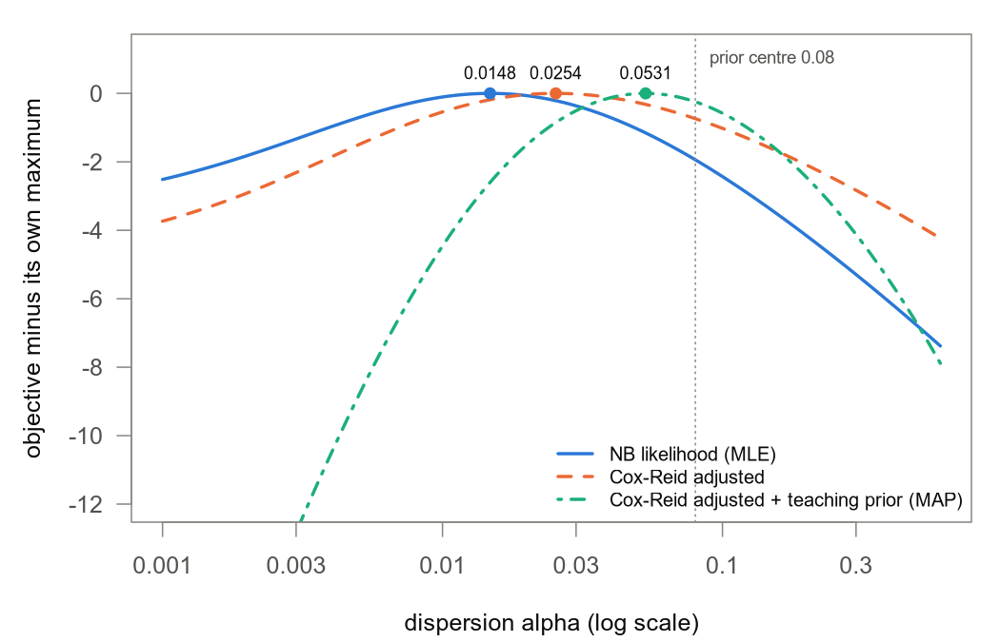

# 08. count 여섯 개는 어떻게 p 값 하나가 될까?

[03](03_dispersion_estimation.md)의 dispersion, [04](04_glm_condition_batch.md)의 GLM, [05](05_wald_vs_lrt.md)의 Wald 검정을 따로따로 봤지만, count 여섯 개가 p 값 하나가 되는 과정을 끝까지 이어 본 적은 없었다. 그래서 교재 16장의 유전자 A로 α → SE → Z → p를 손으로 계산하고, 같은 count를 실제 DESeq2에 넣어 무엇이 같고 무엇이 다른지 비교해 본다. 그다음 교재 15장의 세 그룹 paired 실습 코드를 참 효과를 아는 데이터에 돌려 출력을 채점하고, "내려갔다가 돌아온다"는 두 방향 주장의 검정까지 해 본다.

> 교재 15장, 16장

## 1. 평균이 두 배면 바로 결론을 낼 수 있을까?

교재 16장의 유전자 A는 sample 여섯 개에서 아래 count를 얻었다. count는 한 sample에서 그 유전자에 배정된 read 수이다. sample마다 sequencing 깊이가 달라서 이를 맞추는 배율인 size factor를 쓰는데, 이 예제에서는 모두 1이라 count를 그대로 비교해도 된다.

| 조건 | count | 평균 |
|---|---|---:|
| Ctrl | 100, 130, 90 | 106.667 |
| Starvation | 200, 250, 180 | 210 |

Starvation 평균이 Ctrl의 약 두 배이다. 두 평균의 비에 log2를 씌운 값을 log2 fold change(LFC)라고 하는데, 여기서는 log2(210 / 106.667) = 0.977이다. LFC가 1이면 2배, −1이면 절반이다.

그런데 Ctrl의 세 sample은 똑같은 조건인데도 count가 90에서 130까지 흔들린다. 두 배 차이가 이런 흔들림만으로도 생길 수 있는지 판단하려면 SE(표준오차), 곧 같은 실험을 반복했을 때 LFC가 얼마나 흔들릴지를 알아야 한다. 그리고 SE는 replicate 사이의 퍼짐인 dispersion α에 달려 있어서, 계산은 α에서 시작한다.

교재 16장은 이 계산을 다섯 단계로 나누고, 이 노트도 같은 순서를 따라간다. 개념은 앞 노트에서 다뤘으니 짧게만 짚는다.

| 단계 | 묻는 것 | 유전자 A의 결과 | 처음 다룬 노트 (교재 장) |
|---|---|---|---|
| ① NB likelihood 최대화 | replicate 사이의 퍼짐 α는 얼마일까 | α = 0.014786 | [02](02_negative_binomial.md) (2.3), [03](03_dispersion_estimation.md) (5장) |
| ② Cox-Reid 보정 | 평균을 같은 데이터로 추정한 손실을 메우면 | α = 0.025385 | [03](03_dispersion_estimation.md) (6장) |
| ③ prior를 붙인 MAP | 다른 유전자의 경향까지 고려하면 | α = 0.053147 | [03](03_dispersion_estimation.md) (7장) |
| ④ weight와 SE | 이 α에서 LFC는 얼마나 흔들릴까 | SE = 0.289057 (log2) | [04](04_glm_condition_batch.md) (4장, 8장) |
| ⑤ Wald 검정 | LFC가 0에서 SE 몇 개만큼 떨어졌을까 | Z = 3.3809, p = 0.00072244 | [05](05_wald_vs_lrt.md) (9장) |

이 예제가 손으로 풀기 쉬운 것은 design이 intercept와 Starvation 표시 두 열뿐이고 size factor가 모두 1이라서다. 이때 각 그룹의 평균 추정치는 α가 얼마든 그룹 산술평균(106.667, 210)과 같아서, α를 바꿔도 LFC는 그대로이고 SE만 바뀐다. 덕분에 α가 SE에 주는 영향만 따로 볼 수 있다. 다만 교재 16.1도 덧붙이듯이 offset·pair·batch가 있는 일반 design까지 산술평균으로 풀린다는 뜻은 아니고, 5절에서 실제로 그렇지 않은 예가 나온다.

교재 16.1은 또 이 숫자들이 DESeq2를 실행한 출력이 아니라고 적어 두었다. 그래서 4절에서 실제 DESeq2와 비교해 본다. 5–6절의 15장 실습에는 단측 p·결합 p·BH([06](06_multiple_testing.md), 교재 11장·14장)와 size factor·mu assay·outlier([00](00_overview.md), [07](07_lfc_shrinkage_and_qc.md), 교재 13장)도 나온다.

교재가 두 장을 정리한 문장이 이 노트의 뼈대다.

> 15장: "`dds` 는 단순 결과표가 아니라 count, 설계, normalization, dispersion, coefficient 추정이 이어진 기록이다. 각 단계의 입력과 산출물을 함께 저장한다."
>
> 16장: "likelihood 최대화, bias adjustment, prior shrinkage, coefficient uncertainty, 가설검정은 연결되지만 서로 다른 연산이다. 하나의 숫자 예제에서 이 순서를 추적할 수 있어야 한다."

코드는 저장소 밖 작업 폴더에서 `Rscript`로 2–4절, 5–6절을 각각 한 R 세션에서 위에서부터(접이식 블록 안 코드도 놓인 순서대로) 돌렸기 때문에 뒤 블록이 앞 블록의 객체(`k`, `cr()`, `a_map`, `se_from_alpha()`, `dds` 등)를 이어 쓴다.

## 2. replicate 사이의 퍼짐 α는 얼마로 잡아야 할까?

### Poisson 예상보다 큰 분산

Poisson 분포는 분산이 평균과 같다. 유전자 A가 Poisson을 따른다면 Ctrl의 분산은 약 107, Starvation의 분산은 210쯤이어야 한다. 실제 분산을 계산해 본다.

```r
options(digits = 8)
k <- c(100, 130, 90, 200, 250, 180)            # 유전자 A: Ctrl 3개, Starvation 3개
grp <- rep(c("Ctrl", "Starvation"), each = 3)
m <- tapply(k, grp, mean); v <- tapply(k, grp, var)
tab1 <- rbind(mean = m, var = v, poisson_var = m, moment_alpha = (v - m) / m^2)
print(noquote(formatC(tab1, format = "f", digits = 4)), right = TRUE)
cat("LFC = log2(210 / 106.667) =", log2(m[["Starvation"]] / m[["Ctrl"]]), "\n")
```

```
                 Ctrl Starvation
mean         106.6667   210.0000
var          433.3333  1300.0000
poisson_var  106.6667   210.0000
moment_alpha   0.0287     0.0247
LFC = log2(210 / 106.667) = 0.97727992
```

`var` 행을 `poisson_var` 행과 비교해 보면 실제 분산이 Poisson 예상의 4–6배이다.

이렇게 같은 조건 replicate 사이의 퍼짐이 Poisson 예상보다 큰 현상을 과산포(overdispersion)라고 한다. 음이항분포(negative binomial, NB)는 과산포를 허용하는 count 분포로, 분산이 μ + αμ²이다. μ는 기대 count, 곧 모형이 그 sample에서 예상하는 평균 count이고 α가 dispersion이다. α는 분산 자체가 아니라 Poisson 분산 μ 위에 더 얹히는 퍼짐의 크기라서, α = 0이면 Poisson과 같다([02](02_negative_binomial.md)).

분산 식을 α에 대해 풀면 α = (분산 − μ) / μ²이다. Ctrl에 넣으면 (433.3 − 106.7) / 106.7² = 0.0287이고, 출력의 `moment_alpha` 행이 이 값이다. 두 그룹 모두 0.025–0.029 범위다.

### likelihood로 α 찾기

이 공식은 감을 잡는 데는 좋지만, DESeq2는 likelihood(가능도)를 쓴다. likelihood는 관측한 count를 고정해 두고 α 후보가 그 count를 얼마나 그럴듯하게 만드는지 나타내는 값이다. 이 값이 가장 큰 α가 MLE(최대가능도추정)이다.

예를 들어 α = 0.0148로 놓고 여섯 count가 나올 확률의 log를 모두 더하면 −27.03이고, α = 0.08이면 −28.97이다(아래 격자표). 더 큰 쪽인 0.0148이 데이터를 더 잘 설명하는 것이다. α는 0보다 크고 자릿수가 크게 변하니 θ = log α로 바꿔서 찾고, 평균 μ_j는 그룹 평균으로 고정해 둔다. 식으로 쓰면 다음과 같다.

$$\ell(\theta) = \sum_{j=1}^{6} \log \mathrm{NB}\!\left(K_j;\ \mu_j,\ \text{size} = e^{-\theta}\right)$$

- $K_j$는 sample $j$의 count임. Ctrl 100, 130, 90과 Starvation 200, 250, 180임.
- $\mu_j$는 sample $j$의 기대 count로, Ctrl이면 106.667, Starvation이면 210임.
- $\text{size} = e^{-\theta} = 1/\alpha$는 R의 `dnbinom()`이 쓰는 표기임.
- $\log \mathrm{NB}(\cdot)$는 그 α에서 count $K_j$가 나올 확률의 log이고, 여섯 개를 더한 것이 $\ell$임.

### 평균을 같은 데이터로 추정한 대가: Cox-Reid 보정

moment 계산은 0.025–0.029였는데, $\ell$을 최대화하면 0.0148로 더 작게 나온다. 평균 μ_j를 같은 여섯 count에서 추정했기 때문이다. 그룹 평균은 늘 그 그룹 count의 한가운데에 놓이니까 count와 평균의 차이가 실제 퍼짐보다 작아 보이고, 그래서 α도 작게 추정된다. 표본분산 `var()`는 n이 아니라 n − 1로 나눠 이 손실을 메우지만, $\ell$의 최대화에는 그런 장치가 없다. Cox-Reid 보정이 바로 이 과소추정을 줄이는 보정항이다.

$$\ell_{CR}(\theta) = \ell(\theta) - \tfrac12 \log\det\!\left(X^\top W X\right), \qquad W = \mathrm{diag}\!\left(\frac{\mu_j}{1 + \alpha\mu_j}\right)$$

- $X$는 design matrix(설계행렬)임. 각 sample이 어느 조건인지 숫자로 적은 6×2 표로, 첫 열은 모두 1(intercept), 둘째 열은 Starvation이면 1, Ctrl이면 0임.
- $W$는 sample마다 weight $\mu_j/(1+\alpha\mu_j)$를 대각에 놓은 행렬임. weight는 그 sample이 평균에 대해 주는 정보의 양인데, 3절에서 다시 나옴.
- $X^\top W X$는 평균 계수에 대한 정보량을 모은 2×2 행렬임. 이 design에서는 행렬식(det)이 (Ctrl weight 합) × (Starvation weight 합)임.
- $-\tfrac12 \log\det(\cdot)$가 보정항임. α가 작을수록 weight와 정보량이 커져서 빼는 양도 커지니, 작은 α가 불리해지고 추정치가 올라감.

### 다른 유전자의 경향 빌려 오기: prior와 MAP

replicate가 셋뿐이면 α 추정은 크게 흔들린다. 그래서 DESeq2는 평균 발현량이 비슷한 다른 유전자들의 α를 참고해 이 흔들림을 줄인다. 평균 발현량에 따라 dispersion이 대체로 어디쯤 있는지 나타낸 곡선을 trend, 데이터를 보기 전에 α가 어디쯤 있을지 나타낸 분포를 prior(사전분포)라고 한다. DESeq2는 trend를 중심으로 한 prior를 전체 유전자에서 추정하고(empirical Bayes), likelihood와 prior를 함께 고려했을 때 가장 그럴듯한 값인 MAP(사후최빈값)를 구한다. 이렇게 정보가 적은 추정치를 전체 경향 쪽으로 당기는 것을 shrinkage(수축)라고 부른다([03](03_dispersion_estimation.md)).

그런데 유전자 하나로는 trend를 추정할 수 없다. 그래서 교재 16.3은 학습용 prior를 직접 정해 둔다. 중심은 log 0.08, 표준편차는 0.7이고, 교재도 "이 값들은 실제 데이터에서 추정한 값이 아니다"라고 밝혀 두었다.

$$\log \text{post}(\theta) = \ell_{CR}(\theta) - \frac{(\theta - \log 0.08)^2}{2 \cdot 0.7^2}$$

- $\log 0.08$은 prior의 중심으로, 다른 유전자에서 얻었다고 가정한 trend 값임.
- $0.7$은 log α 척도에서 prior의 표준편차임. 클수록 prior가 약함.
- 둘째 항은 prior에서 오는 벌점임. α = 0.08이면 0이고, log α가 log 0.08에서 멀어질수록 제곱으로 커짐.

### 교재 코드로 세 α 구하기

```r
# 교재 16.6 의 코드 (optimize() 기본 tol)
X <- cbind(Intercept=1, Starvation=c(0,0,0,1,1,1))
mu <- rep(c(mean(k[1:3]), mean(k[4:6])), each=3)
ll <- function(theta) sum(dnbinom(k, mu=mu, size=exp(-theta), log=TRUE))
cr <- function(theta) {
  a <- exp(theta); w <- mu / (1 + a*mu)
  info <- crossprod(X, sweep(X, 1, w, `*`))
  ll(theta) - 0.5*as.numeric(determinant(info, logarithm=TRUE)$modulus)
}
post <- function(theta) cr(theta) - 0.5*((theta-log(0.08))/0.7)^2
bounds <- log(c(1e-5, 2))
a_mle <- exp(optimize(ll, bounds, maximum=TRUE)$maximum)
a_cr  <- exp(optimize(cr, bounds, maximum=TRUE)$maximum)
a_map <- exp(optimize(post, bounds, maximum=TRUE)$maximum)
cat("mu =", mu, "\n"); cat(sprintf("a_mle = %.6f\na_cr  = %.6f\na_map = %.6f\n", a_mle, a_cr, a_map))
```

```
mu = 106.66667 106.66667 106.66667 210 210 210 
a_mle = 0.014786
a_cr  = 0.025385
a_map = 0.053147
```

세 값 모두 교재 16.2–16.3과 소수 여섯째 자리까지 같다. 다만 이 뒤의 계산은 `optimize()`의 허용오차를 줄여 끝까지 수렴시킨 값(α_MAP = 0.053147342)을 쓴다. 여섯째 자리까지는 같아도 3절의 Z와 p가 이 차이에 반응하기 때문이다.

<details>
<summary>optimize()의 허용오차와 교재 숫자</summary>

`optimize()`의 기본 `tol`은 θ 척도에서 `.Machine$double.eps^0.25` = 1.2e-4라서 6자리까지 보고하기에는 느슨하다. 아래 블록은 `a_mle`, `a_cr`, `a_map`을 `tol = 1e-12`로 다시 구해 덮어쓴다.

```r
# optimize() 기본 tol 은 θ 척도에서 .Machine$double.eps^0.25 = 1.2e-4 라 6 자리 보고에는 느슨하다.
a_map_def <- a_map
a_mle <- exp(optimize(ll, bounds, maximum=TRUE, tol=1e-12)$maximum)
a_cr  <- exp(optimize(cr, bounds, maximum=TRUE, tol=1e-12)$maximum)
a_map <- exp(optimize(post, bounds, maximum=TRUE, tol=1e-12)$maximum)   # 이후 계산은 이 수렴값을 쓴다
cat(sprintf("tol=1e-12: %.6f %.6f %.6f\n", a_mle, a_cr, a_map))
dpost <- function(a, h=1e-6) (post(log(a)+h) - post(log(a)-h)) / (2*h)  # d log post / dθ
cat(sprintf("a_map: default tol %.9f (gradient %.1e) | tol=1e-12 %.9f (gradient %.1e)\n", a_map_def, dpost(a_map_def), a_map, dpost(a_map)))
```

```
tol=1e-12: 0.014786 0.025385 0.053147
a_map: default tol 0.053146542 (gradient 4.5e-05) | tol=1e-12 0.053147342 (gradient 3.6e-09)
```

교재 코드 그대로 얻은 α_MAP는 0.053146542이고, `tol = 1e-12`로 수렴시킨 값은 0.053147342이다. 기울기가 4.5e-05 대 3.6e-09이니 앞의 값은 아직 최대점에 닿지 않은 것이다. 6자리로 반올림하면 둘 다 0.053147이라 α만 봐서는 구분되지 않지만, 16.4의 Z와 p는 이 차이에 반응한다(3절의 "교재 숫자와 자릿수까지 비교" 참고). 그래서 이 블록 이후의 계산은 모두 수렴값을 쓴다.

</details>

세 목적함수에 α_MAP를 넣어 각 항의 크기를 본다.

```r
a <- 0.053147342                                 # 수렴시킨 α_MAP (위 접이식 블록 참고)
w <- mu / (1 + a*mu); info <- crossprod(X, X * w)
cat("w =", round(w, 4), "\n")
cat("det(XtWX) =", det(info), "  sum(w_Ctrl) * sum(w_Starvation) =", sum(w[1:3]) * sum(w[4:6]), "\n")
cat("ll =", ll(log(a)), "  -0.5*log det =", -0.5*log(det(info)), "  ll_CR =", cr(log(a)), "\n")
cat("prior penalty =", -0.5*((log(a) - log(0.08))/0.7)^2, "  log post =", post(log(a)), "\n")
```

```
w = 15.9943 15.9943 15.9943 17.2684 17.2684 17.2684 
det(XtWX) = 2485.7609   sum(w_Ctrl) * sum(w_Starvation) = 2485.7609 
ll = -28.182241   -0.5*log det = -3.909167   ll_CR = -32.091408 
prior penalty = -0.17066029   log post = -32.262068 
```

$\ell$ = −28.18에서 보정항 3.91을 빼면 $\ell_{CR}$ = −32.09이고, 여기서 prior 벌점 0.17을 더 빼면 log post = −32.26이다. 벌점 0.17은 log 0.0531과 log 0.08의 차이 −0.409를 제곱해 2 × 0.49로 나눈 값이다. weight 15.99와 17.27은 3절에서 SE를 계산할 때 다시 쓴다.

### 세 곡선을 한 그림에



세 목적함수를 각자의 최대값이 0이 되도록 내려 그린 그림으로, 교재 그림 3을 다시 그린 [03](03_dispersion_estimation.md)의 그림을 그대로 가져왔다. 곡선마다 기준이 다르니 곡선끼리 높이를 비교하면 안 된다.

최대점은 MLE 0.0148 → CR 0.0254 → MAP 0.0531 순서로 오른쪽으로 옮겨 간다. Cox-Reid 보정으로 커진 0.0254는 두 그룹 moment 값의 평균 0.0267에 가까워졌지만 같지는 않다. 보정은 근사라서, 교재도 16.2에서 "Cox-Reid 가 모든 dataset 에서 반드시 같은 비율로 α 를 증가시키는 공식이라는 뜻은 아니다"라고 적는다(보정의 원리는 [03](03_dispersion_estimation.md)의 3절). prior를 붙이면 α가 0.0531까지 더 커져서, gene-wise 값(이 유전자 데이터만으로 구한 0.0254)과 prior 중심 0.08 사이에 놓인다. 나도 처음에는 shrinkage라면 값을 끌어내리는 줄 알았는데, 실제로는 trend 쪽으로 당기는 것이라서 trend보다 아래에 있던 유전자 A는 위로 당겨졌다.

최대점 근처는 평평하다. α가 0.01–0.03 사이면 $\ell$은 최대보다 0.36 이하, $\ell_{CR}$은 0.54 이하로만 낮다. count 여섯 개로는 α를 정밀하게 정할 수 없다는 뜻이다. 또 prior를 붙인 곡선만 왼쪽이 가파른데, prior가 비대칭이라서는 아니다. 벌점은 log 0.08에서 떨어진 log 거리로만 정해지는데, 격자 왼쪽 끝 α = 0.001은 중심에서 4.38 log 단위, 오른쪽 끝 α = 0.5는 1.83 log 단위 떨어져 있어서 벌점이 19.59 대 3.43으로 벌어진 것이다.

<details>
<summary>그림 3을 숫자로: α 격자별 세 목적함수</summary>

```r
grid <- c(0.001,0.002,0.005,0.01,0.014786,0.02,0.025385,0.03,0.05,0.053147,0.08,0.1,0.2,0.5)
th <- log(grid)
tab <- data.frame(alpha=grid, ll=sapply(th, ll), cr=sapply(th, cr), post=sapply(th, post))
tab$ll_rel <- tab$ll - ll(log(a_mle)); tab$cr_rel <- tab$cr - cr(log(a_cr)); tab$post_rel <- tab$post - post(log(a_map))
print(round(tab, 4))
cat("|log(alpha) - log(0.08)| at 0.001, 0.5:", abs(log(c(0.001, 0.5)) - log(0.08)), "\n")
cat("prior penalty at 0.001, 0.5:", 0.5*((log(c(0.001, 0.5)) - log(0.08))/0.7)^2, "\n")
cat("shifted ll, cr, post at alpha = 0.6:", round(c(ll(log(0.6)) - ll(log(a_mle)), cr(log(0.6)) - cr(log(a_cr)), post(log(0.6)) - post(log(a_map))), 2), "\n")
cat("alpha where shifted post = -12:", exp(uniroot(function(t) post(t) - post(log(a_map)) + 12, log(c(1e-3, a_map)))$root), "\n")
```

```
    alpha       ll       cr     post  ll_rel  cr_rel post_rel
1  0.0010 -29.5421 -35.5031 -55.0972 -2.5145 -3.7337 -22.8351
2  0.0020 -28.8493 -34.6843 -48.5699 -1.8218 -2.9149 -16.3078
3  0.0050 -27.7393 -33.2736 -41.1178 -0.7117 -1.5042  -8.8557
4  0.0100 -27.1330 -32.3114 -36.7237 -0.1055 -0.5420  -4.4616
5  0.0148 -27.0275 -31.9551 -34.8638  0.0000 -0.1857  -2.6017
6  0.0200 -27.0938 -31.8055 -33.7665 -0.0663 -0.0361  -1.5045
7  0.0254 -27.2403 -31.7694 -33.1139 -0.2128  0.0000  -0.8518
8  0.0300 -27.3912 -31.7868 -32.7684 -0.3637 -0.0174  -0.5064
9  0.0500 -28.0793 -32.0423 -32.2677 -1.0518 -0.2729  -0.0056
10 0.0531 -28.1822 -32.0914 -32.2621 -1.1547 -0.3220   0.0000
11 0.0800 -28.9677 -32.5078 -32.5078 -1.9402 -0.7383  -0.2457
12 0.1000 -29.4579 -32.7910 -32.8418 -2.4303 -1.0216  -0.5798
13 0.2000 -31.1914 -33.8648 -34.7215 -4.1639 -2.0954  -2.4595
14 0.5000 -33.8391 -35.6168 -39.0437 -6.8115 -3.8474  -6.7816
|log(alpha) - log(0.08)| at 0.001, 0.5: 4.3820266 1.8325815 
prior penalty at 0.001, 0.5: 19.594038 3.4268927 
shifted ll, cr, post at alpha = 0.6: -7.38 -4.23 -7.88 
alpha where shifted post = -12: 0.0033178508 
```

행 5, 7, 10이 각각 α_MLE, α_CR, α_MAP이고(그 곡선의 `*_rel` = 0), 행 11(α = 0.08)이 prior 중심이다. 교재 그림 3의 캡션대로 각 곡선을 자기 최대값이 0이 되도록 옮긴 것이라 `*_rel` 열로 곡선끼리 높이를 비교하면 안 된다. 절대값 열(`ll`, `cr`, `post`)의 최대는 각각 −27.0275, −31.7694, −32.2621인데, 이것도 서로 다른 목적함수의 값이라 곡선 사이의 크기 비교에는 의미가 없다. 절대값은 한 행 안의 관계를 볼 때만 쓸모가 있다. 예를 들어 α = 0.08에서는 prior 벌점이 0이라 `post`와 `cr`이 같다(−32.5078).

0.01–0.03 구간(행 4–8)에서 `ll_rel`의 최저는 −0.3637, `cr_rel`의 최저는 −0.5420이다. 마지막 두 줄은 교재 그림과 겹쳐 보려고 뽑은 값이다. α = 0.6에서 세 곡선은 −7.38, −4.23, −7.88이고, prior 곡선은 α ≈ 0.0033에서 −12 아래로 내려간다. 교재 그림 3(p.35)의 오른쪽 끝과 왼쪽 아래 모양을 눈으로 비교해 보니 이 값과 같았다. 그림을 만든 코드는 [03](03_dispersion_estimation.md)에 있다.

</details>

## 3. α가 정해지면 SE와 p 값은 어떻게 나올까?

### weight: sample 하나가 주는 정보

α가 정해지면 sample마다 weight를 계산할 수 있다. weight는 sample 하나가 그 그룹 평균에 대해 주는 정보의 양이다. Poisson(α = 0)이라면 weight가 μ 그대로라서 Ctrl sample은 106.7, Starvation sample은 210이고, count가 많을수록 정보도 많다. 그런데 α = 0.0531을 넣으면 Ctrl은 106.667 / (1 + 0.0531 × 106.667) = 15.99, Starvation은 17.27이 된다. 평균은 두 배인데 정보량은 거의 같아진 것이다.

$$w_j = \frac{\mu_j}{1 + \alpha\mu_j}$$

μ가 커져도 $w_j$는 1/α = 18.8에 가까워질 뿐 더 늘지 않는다. NB에서는 count가 아무리 많아도 replicate 사이의 상대적 퍼짐(CV² = 1/μ + α)이 α 아래로 내려가지 않기 때문이다.

### SE: 그룹별 weight 합의 역수를 더한 값

Ctrl 세 sample의 weight를 더하면 3 × 15.994 = 47.98, Starvation은 3 × 17.268 = 51.81이다. 두 합의 역수를 더하면 1/47.98 + 1/51.81 = 0.02084 + 0.01930 = 0.04014이고, 제곱근은 0.2004, 이것을 ln 2 = 0.693으로 나누면 0.2891이다. 이 값이 유전자 A의 SE이다.

이 계산은 GLM에서 나온다. GLM(일반화 선형모형)은 count의 평균을 log scale에서 조건·batch 등의 합으로 표현하는 모형이다([04](04_glm_condition_batch.md)). 이 예제에서는 log(평균) = $b_0$ + $b_1$ × (Starvation이면 1)이고, $b_1$이 자연로그 단위의 Starvation 효과, log2 단위의 LFC $\beta$는 $b_1 / \ln 2$이다. 두 그룹 모형에서는 $b_1$의 SE가 간단한 식이 된다.

$$\mathrm{SE}(\hat b_1) = \sqrt{\frac{1}{\sum_{\text{Ctrl}} w_j} + \frac{1}{\sum_{\text{Starvation}} w_j}}, \qquad \mathrm{SE}(\hat\beta) = \frac{\mathrm{SE}(\hat b_1)}{\ln 2}$$

그룹마다 정보량(weight 합)의 역수가 그 그룹 평균(log scale)의 분산이 되고, 두 그룹 차이의 분산은 그 둘을 더한 값이다.

일반 design에서는 이 식 대신 2절에서 본 정보량 행렬의 역행렬 $(X^\top W X)^{-1}$을 쓴다. 이것이 계수들의 공분산 행렬이고, 대각 원소의 제곱근이 각 계수의 SE이다. 두 그룹 모형에서는 Starvation 계수 자리의 대각 원소가 위 식의 제곱근 안 값과 같다.

### Wald 검정: 0에서 SE 몇 개만큼 떨어졌을까?

LFC를 SE로 나누면 Z = 0.977280 / 0.289057 ≈ 3.381이다. LFC가 0에서 SE 3.4개만큼 떨어져 있다는 뜻이다. Wald 검정은 이렇게 (추정치 − 0) / SE를 표준정규분포와 비교한다([05](05_wald_vs_lrt.md)). 여기서 p ≈ 0.00072이고, 95% CI는 0.977 ± 1.96 × 0.289 = [0.411, 1.544]이다. 교재는 이 구간을 nominal CI라고 부르는데, 여러 유전자를 함께 본 것에 대한 보정이 없는 구간이라는 뜻이다.

$$Z = \frac{\hat\beta}{\mathrm{SE}(\hat\beta)}, \qquad p = 2\,\Phi(-|Z|), \qquad \text{95\% CI} = \hat\beta \pm 1.96\,\mathrm{SE}(\hat\beta)$$

$\Phi$는 표준정규분포의 누적분포함수라서, $2\Phi(-|Z|)$는 $|Z|$보다 더 극단적인 값이 양쪽 꼬리에서 나올 확률이다. 1.96은 표준정규분포의 가운데 95%를 자르는 값이다. 지금까지의 계산을 코드로 돌려 본다.

```r
se_from_alpha <- function(a) {
  w <- mu / (1 + a*mu); info <- crossprod(X, sweep(X, 1, w, `*`)); cov_nat <- solve(info)
  list(w=w, info=info, cov=cov_nat, se_nat=sqrt(cov_nat[2,2]), se_log2=sqrt(cov_nat[2,2])/log(2))
}
r <- se_from_alpha(a_map)                      # a_map = 0.053147342 (수렴값)
cat("W diag:", r$w, "\n"); print(r$cov)
cat("1/sum(w_Ctrl) + 1/sum(w_Starvation) =", 1/sum(r$w[1:3]) + 1/sum(r$w[4:6]), "\n")
cat("SE (natural log) =", r$se_nat, "  SE (log2) =", r$se_log2, "\n")
lfc <- log2(210/(320/3)); Z <- lfc / r$se_log2; p <- 2*pnorm(-abs(Z))
cat(sprintf("LFC=%.6f  SE_log2=%.7f  Z=%.7f  p=%.8f\n", lfc, r$se_log2, Z, p))
cat(sprintf("95%% CI (z=1.96): [%.6f, %.6f]\n", lfc - 1.96*r$se_log2, lfc + 1.96*r$se_log2))
```

```
W diag: 15.994282 15.994282 15.994282 17.268399 17.268399 17.268399
              Intercept   Starvation
Intercept   0.020840781 -0.020840781
Starvation -0.020840781  0.040143863
1/sum(w_Ctrl) + 1/sum(w_Starvation) = 0.040143863
SE (natural log) = 0.20035934   SE (log2) = 0.28905742
LFC=0.977280  SE_log2=0.2890574  Z=3.3809197  p=0.00072244
95% CI (z=1.96): [0.410727, 1.543832]
```

공분산 행렬의 오른쪽 아래 값 0.040143863이 바로 아래 줄의 손계산과 같다. 마지막 두 줄도 교재 16.4의 값(LFC 0.977280, SE 0.289057, Z 3.380919, p 0.00072244, CI [0.410727, 1.543833])과 반올림 수준에서 같다.

교재 16.4는 여기서 padj를 만들지 않는다. padj(보정 p 값)는 다른 유전자들과 함께 다중검정 보정을 한 p 값인데, 교재는 "실제 BH padj 는 다른 유전자들의 p 값과 보정 대상 집합까지 있어야 계산된다"고 이유를 적는다. 실제 padj는 4절에서 나온다.

<details>
<summary>교재 숫자와 자릿수까지 비교</summary>

```r
print(r$info)
cat(sprintf("CI z=1.96: [%.6f, %.6f]   CI z=qnorm(0.975): [%.6f, %.6f]\n",
            lfc-1.96*r$se_log2, lfc+1.96*r$se_log2, lfc-qnorm(0.975)*r$se_log2, lfc+qnorm(0.975)*r$se_log2))
cat(sprintf("textbook fraction 0.977280/0.289057 = %.6f   2*0.977280 - 0.410727 = %.6f\n", 0.977280/0.289057, 2*0.977280 - 0.410727))
# 비교: 기본 tol 의 a_map, 6 자리로 반올림한 0.053147
for (a in c(a_map_def, 0.053147)) { s <- se_from_alpha(a)$se_log2; z <- lfc/s
  cat(sprintf("alpha=%.9f: SE=%.7f Z=%.6f p=%.8f CI(1.96)=[%.6f, %.6f]\n", a, s, z, 2*pnorm(-abs(z)), lfc-1.96*s, lfc+1.96*s)) }
```

```
           Intercept Starvation
Intercept  99.788045  51.805198
Starvation 51.805198  51.805198
CI z=1.96: [0.410727, 1.543832]   CI z=qnorm(0.975): [0.410738, 1.543822]
textbook fraction 0.977280/0.289057 = 3.380925   2*0.977280 - 0.410727 = 1.543833
alpha=0.053146542: SE=0.2890555 Z=3.380942 p=0.00072238 CI(1.96)=[0.410731, 1.543829]
alpha=0.053147000: SE=0.2890566 Z=3.380929 p=0.00072241 CI(1.96)=[0.410729, 1.543831]
```

아래 표는 위 두 블록의 출력을 옮겨 정리한 것이다.

| 양 | 교재 | 재계산 (수렴 α_MAP = 0.053147342) | 참고: 교재 코드 기본 tol (α = 0.053146542) | 판정 |
|---|---:|---:|---:|---|
| α_MLE / α_CR / α_MAP | 0.014786 / 0.025385 / 0.053147 | 0.014786 / 0.025385 / 0.053147 | 같음 (6자리) | 일치 |
| LFC | 0.977280 | 0.977280 | 0.977280 | 일치 |
| SE (log2) | 0.289057 | 0.2890574 | 0.2890555 | 일치 |
| Z | 3.380919 | 3.3809197 | 3.380942 | 일치 (마지막 자리 1 차이, 반올림 수준) |
| p | 0.00072244 | 0.00072244 | 0.00072238 | 일치 |
| 95% CI | [0.410727, 1.543833] | z = 1.96: [0.410727, 1.543832]; qnorm(0.975): [0.410738, 1.543822] | [0.410731, 1.543829] (1.96) | 일치 (상한 마지막 자리 1 차이) |

교재의 Z·p·CI는 수렴한 α_MAP에서 계산한 값과 맞다. 이 노트의 이전 판에서 "소수 5째·7째 자리 불일치"로 적었던 차이는 교재 탓이 아니라, 이 노트가 `optimize()` 기본 tol의 α(0.053146542)를 썼기 때문이었다. 남는 사소한 점은 두 가지다.

1. 교재 식에 적힌 분수 0.977280 / 0.289057을 그대로 나누면 3.380925임. 표시된 SE는 반올림값이고 Z는 반올림 전 SE로 계산했기 때문임.
2. CI는 z = 1.96을 쓴 것으로 보임. qnorm(0.975)를 쓰면 [0.410738, 1.543822]로 더 멀어지기 때문임. 교재 상한 1.543833은 2 × 0.977280 − 0.410727 = 1.543833과 같은데, 교재가 이렇게 계산했는지는 알 수 없음.

α를 6자리로 반올림한 0.053147을 넣어도 Z = 3.380929, p = 0.00072241로 교재와 어긋난다(마지막 줄). 6자리를 보고하려면 `optimize()`의 tol을 줄여 수렴부터 확인해야 한다.

</details>

### α만 바꾸면 무엇이 바뀔까?

네 가지 α(MLE, Cox-Reid, MAP, 그리고 Poisson에 해당하는 0)로 같은 계산을 반복해 본다.

```r
res <- t(sapply(c(a_mle, a_cr, a_map, 0), function(a) { rr <- se_from_alpha(a); z <- lfc/rr$se_log2
  c(alpha=a, w_ctrl=rr$w[1], w_starvation=rr$w[4], SE_log2=rr$se_log2, Z=z, p=2*pnorm(-abs(z))) }))
print(format(as.data.frame(res), digits=6))
cat("p ratio Poisson/MAP:", res[4,"p"]/res[3,"p"], "  MAP/MLE:", res[3,"p"]/res[1,"p"], "\n")
```

```
      alpha   w_ctrl w_starvation   SE_log2       Z           p
1 0.0147860  41.3890      51.1564 0.1741401 5.61203 1.99965e-08
2 0.0253849  28.7688      33.1710 0.2122064 4.60533 4.11819e-06
3 0.0531473  15.9943      17.2684 0.2890574 3.38092 7.22437e-04
4 0.0000000 106.6667     210.0000 0.0990355 9.86797 5.73117e-23
p ratio Poisson/MAP: 7.9331117e-20   MAP/MLE: 36128.058
```

LFC는 네 경우 모두 0.977280으로 같고, 바뀌는 것은 weight, SE, p뿐이다. Poisson으로 잘못 가정하면(4행) SE가 0.099로 작아져서 p가 MAP의 약 10⁻¹⁹배가 되고, MLE 대신 MAP를 쓰면 p가 약 3.6 × 10⁴배 커진다. 효과 크기는 그대로인데 증거의 세기만 바뀌는 것이다. 교재 16.5가 보여 주려는 것이 이 점이다.

유전자 A에서는 shrinkage가 α를 키워서 p도 커졌지만, 반대 방향도 있다. gene-wise 값이 trend보다 높은 유전자는 α가 내려가기 때문이다(5절의 gene11: 0.821 → 0.480). 평균이 그대로라면 weight가 커지고 SE가 줄어서 p도 작아진다. 그러니 shrinkage가 p를 어느 쪽으로 바꿀지는 유전자마다 다르다.

교재는 이 예를 12장의 질문 "두 그룹만 넣는 것과 세 그룹을 함께 넣는 것의 차이" 가운데 dispersion 경로만 떼어 보여 주는 예로 둔다. 그 질문 자체는 [05](05_wald_vs_lrt.md)의 6절에서 다뤘다. 교재는 또 "실제 dataset 에서는 normalization 이나 β 도 변할 수 있으므로 이 예제를 모든 상황의 수치적 결과로 일반화하지 않는다"고 덧붙이는데, 이 노트에도 그런 예가 두 개 있다. 4절 (A)에서 size factor를 데이터에서 추정하면 LFC가 0.977에서 0.874로 바뀌고, 5절의 pair design에서는 α가 바뀌면 평균과 β도 함께 움직인다.

## 4. 같은 count를 실제 DESeq2에 넣으면 무엇이 같고 무엇이 다를까?

### 배경 유전자 사이에 유전자 A 끼워 넣기

유전자 A 한 행만 DESeq2에 넣으면 안 된다. 교재 15.3이 그 이유를 적어 두었다. "작은 gene set 을 임의로 골라 DESeq2 를 처음부터 적합하면 size factor 와 dispersion trend 를 학습할 정보가 달라진다. 보통은 적절한 전체 gene universe 로 적합하고, 관심 유전자만 결과에서 추출한다." 그래서 `makeExampleDESeqDataSet(n = 2000, m = 6, betaSD = 1)`(seed 1)로 만든 배경 유전자 2000개 사이에 유전자 A를 `teach_gene`이라는 한 행으로 끼워 넣었다. 예제 데이터의 조건 이름 A/B는 Ctrl/Starvation으로 바꿨다.

돌린 방식은 세 가지다. (A)는 size factor까지 데이터에서 추정하는 기본 `DESeq()`이고, (B)는 size factor를 1로 고정해 교재와 평균을 맞춘 것이다. (C)는 (B)에서 유전자 A의 α만 2절의 수렴 α_MAP(0.053147342)로 바꾸고 Wald 검정만 다시 한 것이다.

```r
suppressPackageStartupMessages(library(DESeq2)); options(digits = 7)
set.seed(1)
dds2 <- makeExampleDESeqDataSet(n = 2000, m = 6, betaSD = 1)        # 배경 유전자 2000개
levels(dds2$condition) <- c("Ctrl", "Starvation")
cts <- rbind(counts(dds2), teach_gene = c(100L,130L,90L,200L,250L,180L))   # 유전자 A 를 한 행으로 추가
dds2 <- DESeqDataSetFromMatrix(cts, colData(dds2)[, "condition", drop=FALSE], design = ~ condition)
ddsA <- DESeq(dds2, quiet = TRUE)                                              # (A) 기본 DESeq()
ddsB <- dds2; sizeFactors(ddsB) <- rep(1, 6); ddsB <- DESeq(ddsB, quiet = TRUE) # (B) size factor = 1
ddsC <- ddsB                                                                   # (C) B 에서 α 만 교재 값으로
dispersions(ddsC)[rownames(ddsC) == "teach_gene"] <- a_map                    # a_map = 0.053147342
ddsC <- nbinomWaldTest(ddsC, betaPrior = FALSE)
one <- function(d) { m <- mcols(d)["teach_gene", ]; r <- results(d)["teach_gene", ]
  c(dispGeneEst = m$dispGeneEst, dispFit = m$dispFit, dispMAP = m$dispMAP, dispersion = m$dispersion,
    log2FC = r$log2FoldChange, lfcSE = r$lfcSE, stat = r$stat, pvalue = r$pvalue) }
print(signif(sapply(list(A = ddsA, B = ddsB, C = ddsC), one), 6))
```

```
found results columns, replacing these
                    A          B           C
dispGeneEst 0.0266060 0.02538760 0.025387600
dispFit     0.1340590 0.13326300 0.133263000
dispMAP     0.0969760 0.09583870 0.095838700
dispersion  0.0969760 0.09583870 0.053147300
log2FC      0.8741090 0.97728000 0.977280000
lfcSE       0.3799470 0.37787800 0.289057000
stat        2.3006100 2.58623000 3.380920000
pvalue      0.0214138 0.00970315 0.000722434
```

첫 줄의 `found results columns, replacing these`는 (C)에서 `nbinomWaldTest()`를 다시 부를 때 나오는 메시지로, 기존 Wald 결과 열을 새 값으로 바꿨다는 뜻이다.

먼저 gene-wise 추정은 교재와 같다. (B)의 `dispGeneEst` 0.025388은 교재의 Cox-Reid 값 0.025385와 같고, 3 × 10⁻⁶ 차이는 목적함수가 최대점 근처에서 평평해서 생기는 최적화 오차다(아래 "DESeq2의 prior를 손으로 재구성하기"의 첫 출력 줄: 두 값의 $\ell_{CR}$ 차이 7 × 10⁻⁹). (A)가 0.026606으로 조금 다른 것은 size factor가 1이 아니라서 평균이 달라졌기 때문이다.

그런데 MAP는 다르다. (B)의 `dispMAP` 0.0958은 교재의 0.0531보다 큰데, prior의 중심과 폭이 모두 교재와 다르기 때문이다. 바로 아래에서 본다.

α를 교재 값으로 고정하면 나머지는 같아진다. (C)의 lfcSE 0.289057, stat 3.38092, p 0.000722434는 3절의 손계산과 같고, log2FC는 (B)와 (C) 모두 0.977280이다. α를 바꿔도 평균은 안 바뀐다는 16.5의 설명이 실제 fitting에서도 성립하는 것이다.

<details>
<summary>(A)(B)(C)의 전체 출력과 교재 비교표</summary>

```r
show_gene <- function(d, tag) {
  cat(sprintf("[%s] sizeFactors: %s\n", tag, paste(round(sizeFactors(d), 4), collapse=" ")))
  print(as.data.frame(mcols(d)["teach_gene", c("baseMean","dispGeneEst","dispFit","dispMAP","dispersion","dispOutlier","betaConv")]))
  print(as.data.frame(results(d)["teach_gene", ]))
  cat(sprintf("[%s] mu assay: %s\n", tag, paste(round(assays(d)[["mu"]]["teach_gene", ], 4), collapse=" ")))
  cat(sprintf("[%s] dispPriorVar: %s\n", tag, attr(dispersionFunction(d), "dispPriorVar")))
}
show_gene(ddsA, "A"); show_gene(ddsB, "B"); show_gene(ddsC, "C")
rC <- results(ddsC)["teach_gene", ]
cat(sprintf("[C] lfcSE=%.7f stat=%.7f p=%.9f padj=%.8f\n", rC$lfcSE, rC$stat, rC$pvalue, rC$padj))
```

```
[A] sizeFactors: 0.9917 0.9675 1.0027 1.0501 1.0703 1.0501
           baseMean dispGeneEst   dispFit    dispMAP dispersion dispOutlier
teach_gene 153.4003  0.02660597 0.1340589 0.09697603 0.09697603       FALSE
           betaConv
teach_gene     TRUE
           baseMean log2FoldChange     lfcSE     stat     pvalue      padj
teach_gene 153.4003      0.8741087 0.3799469 2.300608 0.02141381 0.1177086
[A] mu assay: 107.401 104.7743 108.5855 208.4326 212.4497 208.4417
[A] dispPriorVar: 0.25
[B] sizeFactors: 1 1 1 1 1 1
           baseMean dispGeneEst  dispFit   dispMAP dispersion dispOutlier
teach_gene 158.3333  0.02538756 0.133263 0.0958387  0.0958387       FALSE
           betaConv
teach_gene     TRUE
           baseMean log2FoldChange    lfcSE     stat      pvalue       padj
teach_gene 158.3333      0.9772803 0.377878 2.586232 0.009703152 0.06112221
[B] mu assay: 106.6666 106.6666 106.6666 210 210 210
[B] dispPriorVar: 0.25
[C] sizeFactors: 1 1 1 1 1 1
           baseMean dispGeneEst  dispFit   dispMAP dispersion dispOutlier
teach_gene 158.3333  0.02538756 0.133263 0.0958387 0.05314734       FALSE
           betaConv
teach_gene     TRUE
           baseMean log2FoldChange     lfcSE     stat       pvalue        padj
teach_gene 158.3333      0.9772801 0.2890574 3.380921 0.0007224337 0.009247152
[C] mu assay: 106.6666 106.6666 106.6666 210 210 210
[C] dispPriorVar: 0.25
[C] lfcSE=0.2890574 stat=3.3809208 p=0.000722434 padj=0.00924715
```

위 출력을 옮겨 정리하면 다음과 같다.

| | (A) 기본 DESeq() | (B) size factor = 1 | (C) B + α 고정 (α_MAP 수렴값) | 교재 손계산 |
|---|---:|---:|---:|---:|
| sizeFactors | 0.9917 0.9675 1.0027 1.0501 1.0703 1.0501 | 1 (×6) | 1 (×6) | 1 |
| baseMean | 153.4003 | 158.3333 | 158.3333 | 158.333 |
| mu assay (teach_gene) | 107.401 104.7743 108.5855 208.4326 212.4497 208.4417 | 106.6666 ×3, 210 ×3 | 106.6666 ×3, 210 ×3 | 106.667 / 210 |
| dispGeneEst | 0.02660597 | 0.02538756 | 0.02538756 | 0.025385 (CR) |
| dispFit (trend) | 0.1340589 | 0.133263 | 0.133263 | 0.08 (지정) |
| dispPriorVar | 0.25 | 0.25 | 0.25 | 0.49 (= 0.7²) |
| dispMAP → dispersion | 0.09697603 | 0.0958387 | 0.0958387 → 0.05314734 (덮어씀) | 0.053147 |
| dispOutlier / betaConv | FALSE / TRUE | FALSE / TRUE | FALSE / TRUE | – |
| log2FoldChange | 0.8741087 | 0.9772803 | 0.9772801 | 0.977280 |
| lfcSE | 0.3799469 | 0.377878 | 0.2890574 | 0.289057 |
| stat | 2.300608 | 2.586232 | 3.380921 | 3.380919 |
| pvalue | 0.02141381 | 0.009703152 | 0.0007224337 | 0.00072244 |
| padj (2001 유전자 BH) | 0.1177086 | 0.06112221 | 0.009247152 | (계산 안 함) |

마지막 행의 padj가 (A)(B)(C)에서 서로 다른 것은 teach_gene의 p만이 아니라 나머지 2000개 p의 순위에도 달려 있기 때문이다. 교재 16.4가 단일 유전자로 padj를 만들지 않은 이유와 같다.

(C)의 stat 3.3809208은 손계산 3.3809197과 7째 자리에서 다르다. ridge λ = 1e-6과 IRLS(GLM 계수를 찾는 반복 가중 최소제곱 계산)의 수렴 수준에서 오는 수치 차이다. lfcSE를 손계산 SE로 나눈 비는 (C)에서 0.9999999, (B)에서 0.9999998이다(아래 블록).

</details>

### DESeq2의 prior를 손으로 재구성하기

(B)의 prior가 교재와 어떻게 다른지 손으로 다시 만들어 본다.

```r
df <- dispersionFunction(ddsB); cf <- attr(df, "coefficients"); pv <- attr(df, "dispPriorVar"); vl <- attr(df, "varLogDispEsts")
mcB <- mcols(ddsB)["teach_gene", ]
cat("cr(log 0.0253849) - cr(log 0.0253876) =", cr(log(0.0253849)) - cr(log(0.0253876)), "\n")   # cr() 은 16.2 블록의 함수
cat("dispersionFunction coefs:", round(cf, 5), "  dispPriorVar:", pv, "  varLogDispEsts:", vl, "\n")
cat("trend by hand:", cf["asymptDisp"] + cf["extraPois"]/mcB$baseMean,
    "  varLogDispEsts - trigamma((6-2)/2):", vl - trigamma(2), " -> pmax(., 0.25):", pmax(vl - trigamma(2), 0.25), "\n")
post_deseq <- function(theta) cr(theta) - 0.5*(theta - log(mcB$dispFit))^2/pv   # prior 두 값만 DESeq2 것으로 교체
cat("hand MAP with DESeq2 prior:", exp(optimize(post_deseq, log(c(1e-8, 10)), maximum=TRUE, tol=1e-12)$maximum), " vs dispMAP:", mcB$dispMAP, "\n")
```

```
cr(log 0.0253849) - cr(log 0.0253876) = 7.227747e-09 
dispersionFunction coefs: 0.09311 6.35753   dispPriorVar: 0.25   varLogDispEsts: 0.6885003 
trend by hand: 0.133263   varLogDispEsts - trigamma((6-2)/2): 0.04356624  -> pmax(., 0.25): 0.25 
hand MAP with DESeq2 prior: 0.09583826  vs dispMAP: 0.0958387 
```

먼저 trend이다. DESeq2는 배경 유전자에서 trend 곡선 α = `asymptDisp` + `extraPois` / 평균을 맞추는데, 유전자 A의 평균 158.333을 넣으면 0.09311 + 6.35753 / 158.333 = 0.133263이다. 교재가 지정한 0.08보다 높다.

prior 분산도 다르다. 데이터로 추정한 값은 `varLogDispEsts − trigamma(2)` = 0.0436이다. `trigamma((6 − 2)/2)`는 gene-wise 추정 자체가 흔들리는 몫이라서 빼는 것이다. 그런데 DESeq2는 prior 분산에 하한 0.25를 두기 때문에, 추정값이 이보다 작은 여기서는 0.25(표준편차 0.5)가 쓰였다. 교재의 0.7² = 0.49보다 좁은 prior이다.

교재의 `post()`에 이 두 값만 바꿔 넣으면 0.09583826이 나온다. DESeq2의 `dispMAP` 0.0958387과 상대 차이 5 × 10⁻⁶ 이내로 같으니, 연산은 같고 prior만 다른 것이다.

<details>
<summary>lfcSE와 손계산 SE의 비, 그리고 dispersions() 대입 함정</summary>

```r
se_log2 <- function(a) se_from_alpha(a)$se_log2                                  # 16.4 블록의 함수
cat(sprintf("hand SE_log2 at dispMAP %.7f = %.6f ; at a_map = %.7f\n", mcB$dispMAP, se_log2(mcB$dispMAP), se_log2(a_map)))
cat(sprintf("lfcSE / hand SE: [B] %.7f  [C] %.7f\n", results(ddsB)["teach_gene","lfcSE"]/se_log2(mcB$dispMAP), rC$lfcSE/se_log2(a_map)))
```

```
hand SE_log2 at dispMAP 0.0958387 = 0.377878 ; at a_map = 0.2890574
lfcSE / hand SE: [B] 0.9999998  [C] 0.9999999
```

(C)를 만들 때 `dispersions(ddsC)["teach_gene"] <- a_map`처럼 이름으로 대입하면 실패한다. `dispersions()`가 이름 없는 벡터를 돌려주기 때문에, 문자 색인이 이름 붙은 새 원소를 덧붙여 길이가 2002가 된다. 그래서 위 (C) 블록은 논리 색인(`rownames(ddsC) == "teach_gene"`)을 썼다. `which()`를 써도 된다.

```r
tmp <- ddsB
cat("names(dispersions(tmp)) is NULL:", is.null(names(dispersions(tmp))), "\n")
err <- try(dispersions(tmp)["teach_gene"] <- a_map, silent = TRUE)
cat("name index ->", conditionMessage(attr(err, "condition")), "\n")
```

```
names(dispersions(tmp)) is NULL: TRUE 
name index -> 2002 elements in value to replace 2001 elements 
```

</details>

### 배경 유전자가 바뀌면

위의 trend 0.133은 유전자 A만의 성질이 아니라 배경 유전자 2000개가 정한 값이다. 그래서 배경 seed를 1–3으로 바꾸거나 배경을 아예 없애고 다시 돌려 봤다(코드와 출력은 접이식 블록).

seed 1–3에서 유전자 A의 gene-wise 값은 0.025388로 같지만, trend는 0.128–0.138, MAP는 0.093–0.098, p는 0.0086–0.0106으로 달라진다. prior 분산은 세 번 모두 하한 0.25였다.

유전자 A 한 행만 넣으면 빌려 올 정보가 아예 없다. trend 곡선(parametric fit)을 맞추지 못해 local fit으로 바뀌었다는 메시지가 나오고, trend 값이 자기 gene-wise 값과 같아진다. 그러면 MAP ≈ gene-wise(0.02538672)이고 p = 4.1 × 10⁻⁶으로, 3절 표의 Cox-Reid 행(p 4.12 × 10⁻⁶)과 거의 같다. 교재 15.3의 경고가 숫자로 드러난 셈이다.

<details>
<summary>배경을 바꾼 실행의 코드와 출력</summary>

```r
# 같은 유전자 A 를 다른 배경 유전자(seed) 와 함께 넣으면 (size factor 1 고정)
for (s in 1:3) {
  set.seed(s); bg <- makeExampleDESeqDataSet(n = 2000, m = 6, betaSD = 1)
  d <- DESeqDataSetFromMatrix(rbind(counts(bg), teach_gene = as.integer(k)), colData(bg)[, "condition", drop=FALSE], ~ condition)
  sizeFactors(d) <- rep(1, 6); d <- DESeq(d, quiet = TRUE); m <- mcols(d)["teach_gene", ]; rr <- results(d)["teach_gene", ]
  cat(sprintf("seed %d: dispGeneEst=%.6f dispFit=%.4f priorVar=%.3f dispMAP=%.4f lfcSE=%.4f p=%.5f\n",
              s, m$dispGeneEst, m$dispFit, attr(dispersionFunction(d), "dispPriorVar"), m$dispMAP, rr$lfcSE, rr$pvalue))
}
# 배경 없이 유전자 A 한 행만 DESeq() 에 넣으면
d1 <- DESeqDataSetFromMatrix(matrix(as.integer(k), 1, dimnames=list("teach_gene", colnames(dds2))), colData(dds2), ~ condition)
sizeFactors(d1) <- rep(1, 6); d1 <- suppressWarnings(DESeq(d1, quiet = TRUE))
cat("fitType used:", attr(dispersionFunction(d1), "fitType"), "\n")
print(as.data.frame(mcols(d1)[, c("dispGeneEst","dispFit","dispMAP")])); print(as.data.frame(results(d1))[, c("lfcSE","stat","pvalue")])
```

```
seed 1: dispGeneEst=0.025388 dispFit=0.1333 priorVar=0.250 dispMAP=0.0958 lfcSE=0.3779 p=0.00970
seed 2: dispGeneEst=0.025388 dispFit=0.1280 priorVar=0.250 dispMAP=0.0926 lfcSE=0.3719 p=0.00859
seed 3: dispGeneEst=0.025388 dispFit=0.1375 priorVar=0.250 dispMAP=0.0984 lfcSE=0.3826 p=0.01063
-- note: fitType='parametric', but the dispersion trend was not well captured by the
   function: y = a/x + b, and a local regression fit was automatically substituted.
   specify fitType='local' or 'mean' to avoid this message next time.
fitType used: local 
           dispGeneEst    dispFit    dispMAP
teach_gene  0.02538756 0.02538756 0.02538672
               lfcSE     stat       pvalue
teach_gene 0.2122124 4.605197 4.120762e-06
```

</details>

## 5. 세 그룹 paired 실습 코드는 실제로 무엇을 출력할까?

교재 15장은 실습 파일 `DESeq2_workbook.R`로 세 그룹 paired 분석을 한다. 이 시리즈의 예시로 옮기면 조건은 Ctrl, Starvation, Starvation+Glucose 세 가지다. 세 번째 조건은 줄여서 Glucose라고 부르지만 보통 배지에 glucose를 더 넣은 조건이 아니다. 그래서 Glucose − Starvation 비교는 "굶긴 상태에서 glucose를 다시 넣은 효과", 곧 되돌림(rescue) 방향으로 읽는다. 같은 donor에서 세 조건을 모두 얻었으니 design은 `~ pair + condition`이고, 여기서 pair가 donor를 뜻한다.

그런데 workbook 파일이 저장소에 없어서, 교재가 정한 입력 형식에 맞춘 데이터를 직접 시뮬레이션했다(형식은 아래 15.1 접이식 블록). 참 효과를 아니까 출력을 채점할 수도 있다.

### 시뮬레이션 데이터

donor 4명 × 조건 3개라서 sample은 12개이고, 유전자는 2000개이다. count는 NB에서 뽑았고, 유전자마다 세 조건에 공통인 donor 효과(개체 차이)를 넣었다. 유전자 1600개는 조건 효과가 없는 null이고, 나머지 400개는 아래 다섯 유형 중 하나다. $m$은 유전자마다 1–2.5에서 뽑은 효과 크기(log2)이다.

| 유형 | Starvation − Ctrl | Glucose − Ctrl | Glucose − Starvation | 유전자 수 |
|---|---:|---:|---:|---:|
| rescue (완전히 돌아옴) | −m | 0 | +m | 60 (+ mirror 60) |
| partial (절반만 돌아옴) | −m | −m/2 | +m/2 | 40 (+ 40) |
| overshoot (Ctrl을 넘어 올라감) | −m | +m | +2m | 40 (+ 40) |
| noRescue (돌아오지 않음) | −m | −m | 0 | 30 (+ 30) |
| GlucoseOnly (Glucose에서만 변함) | 0 | +m | +m | 30 (+ 30) |
| null | 0 | 0 | 0 | 1600 |

유형마다 절반은 부호를 뒤집어서(`_mirror`) 위로 가는 유전자와 아래로 가는 유전자 수를 맞췄다. 표에 적힌 방향(Starvation에서 내려감)이 6절에서 미리 정해 두고 검정할 방향이다.

<details>
<summary>시뮬레이션 모형과 데이터를 만든 코드 (15.1)</summary>

참 모형은 다음과 같다.

$$K_{ij} \sim \mathrm{NB}(\mu_{ij}, \alpha_i), \qquad \log_2 \mu_{ij} = \log_2 s_j + \beta_{i0} + \gamma_{i,\mathrm{pair}(j)} + \beta_{iS}\,[j \in \text{Starvation}] + \beta_{iG}\,[j \in \text{Glucose}], \qquad \alpha_i = 4/2^{\beta_{i0}} + 0.1$$

$\beta_{i0} \sim N(4, 2^2)$와 $\alpha_i$의 식은 `makeExampleDESeqDataSet()` 기본값과 같다. $\gamma$는 유전자·pair마다 뽑은 pair(개체) 효과 $N(0, 0.5^2)$이고 세 condition에 공통이라 교호작용이 없다. 즉 `~ pair + condition`이 참 모형과 같은 구조다. 참 size factor $s_j$는 0.7–1.4에서 뽑았고, 위 표의 $\beta_S$, $\beta_G$는 각각 Starvation − Ctrl, Glucose − Ctrl 열이다.

`_mirror`는 같은 유형에서 부호만 뒤집은 유전자다. 유형마다 정확히 절반을 뒤집어 위·아래 변화 수를 맞췄는데(출력의 `Starvation down/up: 170 170`), median-ratio size factor가 "대부분 유전자는 변하지 않거나 위아래가 균형을 이룬다"는 전제를 쓰기 때문이다. 처음에 mirror 없이 모든 효과를 Starvation-down 쪽에만 두었을 때(유형 수·효과 크기도 달랐다)는 Starvation 네 sample의 추정/참 size factor 비가 0.90–0.92, 나머지 여덟 sample은 1.07–1.15였다. Starvation만 상대적으로 약 17% 작게 추정된 것이다(이 첫 시도의 출력은 노트에 싣지 않았다).

`makeExampleDESeqDataSet()`의 condition은 두 수준(A/B)뿐이다. 12 sample을 순서대로 Ctrl·Starvation·Glucose로 이름만 바꾸면 Starvation이 A와 B로 갈려 pair × condition 교호작용이 생기고, `~ pair + condition`이 오지정 design이 된다. 이 노트의 이전 판이 그랬다. 그래서 세 condition과 pair 효과를 NB에서 직접 시뮬레이션했다. 이전 판의 오지정 데이터에서는 효과가 큰 유전자만 dispersion이 부풀었는데(|trueBeta| > 1에서 1.318, 이전 판의 출력은 노트에 싣지 않았다), 이번 데이터에서는 그런 현상이 없다(본문 "pair를 잘못 붙이면" 절).

교재가 정한 입력 형식은 다음과 같다. `counts.csv`는 첫 열이 고유한 gene ID이고 나머지 열 이름이 sample ID이며, `metadata.csv`에는 `sample_id`, `pair`, `condition` 열이 있다. 교재는 이 형식이 실제 자료와 다르면 design과 contrast를 연구 질문에 맞게 고쳐야 한다고 적고, workbook은 입력 파일 없이 실행하면 합성 데이터를 만들 뿐 실제 연구 데이터의 결과를 주는 파일이 아니라고 밝힌다. 아래 코드는 이 형식대로 두 파일을 쓴다.

```r
suppressPackageStartupMessages(library(DESeq2)); options(digits = 6, width = 110)
set.seed(2024)
n <- 2000
meta <- data.frame(sample_id = paste0("P", rep(1:4, 3), "_", rep(c("Ctrl","Starvation","Glucose"), each = 4)),
                   pair = rep(1:4, 3), condition = rep(c("Ctrl","Starvation","Glucose"), each = 4))
# 참 반응 유형: Ctrl 대비 Starvation(bS), Glucose=Starvation+Glucose(bG) 의 log2 효과. 크기는 유전자마다 1–2.5.
# 각 유형의 정확히 절반은 부호를 뒤집는다(mirror): 위·아래 변화가 균형을 이뤄야 median-ratio size factor 가 치우치지 않는다
type <- sample(rep(c("null","rescue","partial","overshoot","noRescue","GlucoseOnly"), c(1600, 120, 80, 80, 60, 60)))
sgn  <- ave(rep(1, n), type, FUN = function(x) sample(rep(c(-1, 1), length.out = length(x))))
size <- ifelse(type == "null", 0, sgn * runif(n, 1, 2.5))
bS <- size * c(null=0, rescue=-1, partial=-1,   overshoot=-1, noRescue=-1, GlucoseOnly=0)[type]
bG <- size * c(null=0, rescue= 0, partial=-0.5, overshoot= 1, noRescue=-1, GlucoseOnly=1)[type]
b0 <- rnorm(n, 4, 2)                        # log2 기저 발현 (makeExampleDESeqDataSet 기본과 같은 분포)
bP <- matrix(rnorm(n * 4, 0, 0.5), n, 4)    # 유전자별 pair(개체) 효과: 세 condition 에 공통, pair x condition 교호작용 없음
trueDisp <- 4 / 2^b0 + 0.1                  # makeExampleDESeqDataSet 의 dispMeanRel
sf <- round(runif(12, 0.7, 1.4), 2)         # 참 size factor
log2mu <- b0 + bP[, meta$pair] + outer(bS, meta$condition == "Starvation") + outer(bG, meta$condition == "Glucose")
cts <- matrix(rnbinom(n * 12, mu = sweep(2^log2mu, 2, sf, `*`), size = 1 / trueDisp), n, 12,
              dimnames = list(paste0("gene", 1:n), meta$sample_id))
type <- ifelse(type != "null" & sgn < 0, paste0(type, "_mirror"), type)   # 표의 방향(Starvation-down 쪽)이 원래 유형 이름
truth <- data.frame(type, bS, bG, trueDisp, row.names = rownames(cts))
write.csv(cts, "counts.csv"); write.csv(meta, "metadata.csv", row.names = FALSE)
cat(readLines("counts.csv", 2), readLines("metadata.csv", 3), sep = "\n")
print(table(truth$type)); cat("Starvation down/up:", sum(bS < 0), sum(bS > 0), "  Glucose down/up:", sum(bG < 0), sum(bG > 0), "\n")
```

```
"","P1_Ctrl","P2_Ctrl","P3_Ctrl","P4_Ctrl","P1_Starvation","P2_Starvation","P3_Starvation","P4_Starvation","P1_Glucose","P2_Glucose","P3_Glucose","P4_Glucose"
"gene1",0,0,0,0,0,0,0,0,0,0,0,0
"sample_id","pair","condition"
"P1_Ctrl",1,"Ctrl"
"P2_Ctrl",2,"Ctrl"

       GlucoseOnly GlucoseOnly_mirror           noRescue    noRescue_mirror               null
                30                 30                 30                 30               1600
         overshoot   overshoot_mirror            partial     partial_mirror             rescue
                40                 40                 40                 40                 60
     rescue_mirror
                60
Starvation down/up: 170 170   Glucose down/up: 140 140
```

</details>

### 입력 정렬과 design 확인 (15.2)

교재 15.2의 코드는 count 열과 metadata 행의 순서를 맞추고, design matrix가 full rank인지 `stopifnot`으로 확인한다. full rank는 design matrix의 열끼리 정보가 겹치지 않아 모든 계수를 추정할 수 있다는 뜻이다. 그대로 실행하니 세 검사가 모두 통과했는데, pair 번호를 조건마다 한 칸씩 밀어 붙인 기계적 라벨 `meta_bad`도 똑같이 통과했다(접이식 블록). 마지막 교차표를 보면 라벨 하나에 서로 다른 donor 셋이 섞여 있는데도 그렇다.

검사를 통과했다는 것은 열 순서가 맞고 X가 full rank라는 뜻일 뿐이다. 교재 15.2도 이렇게 경고한다. "실행이 된다는 것만으로 pairing 이 참이라는 사실이 검증되지는 않는다. metadata 의 pair ID 가 실제 생물학적 대응을 뜻하는지 사용자가 확인해야 한다. 기계적으로 같은 숫자를 붙인 ID 는 통계적으로 정당한 pairing 을 만들지 못한다." 이런 라벨이 얼마나 손해인지는 조금 뒤에 숫자로 본다.

<details>
<summary>교재 15.2 코드와 기계적 pair 라벨 시험</summary>

```r
cts <- as.matrix(read.csv("counts.csv", row.names=1, check.names=FALSE))
meta <- read.csv("metadata.csv", stringsAsFactors=FALSE); rownames(meta) <- meta$sample_id
stopifnot(setequal(colnames(cts), rownames(meta)))
cts <- cts[, rownames(meta), drop=FALSE]; stopifnot(identical(colnames(cts), rownames(meta)))
meta$pair <- factor(meta$pair); meta$condition <- factor(meta$condition, levels=c("Ctrl","Starvation","Glucose"))
X <- model.matrix(~ pair + condition, data=meta); stopifnot(qr(X)$rank == ncol(X), nrow(X) > ncol(X))
print(table(meta$pair, meta$condition)); print(colnames(X)); cat("rank:", qr(X)$rank, " n:", nrow(X), "\n")
# 15.2 경고의 실례: condition 마다 pair 번호를 한 칸씩 밀어 붙인 '기계적' 라벨도 같은 검사를 통과한다
meta_bad <- meta; meta_bad$pair <- factor((as.integer(meta$pair) + as.integer(meta$condition) - 2) %% 4 + 1)
Xb <- model.matrix(~ pair + condition, data=meta_bad); stopifnot(qr(Xb)$rank == ncol(Xb), nrow(Xb) > ncol(Xb))
print(table(true_pair = meta$pair, label = meta_bad$pair))
```

```

    Ctrl Starvation Glucose
  1    1          1       1
  2    1          1       1
  3    1          1       1
  4    1          1       1
[1] "(Intercept)"         "pair2"               "pair3"               "pair4"
[5] "conditionStarvation" "conditionGlucose"
rank: 6  n: 12
         label
true_pair 1 2 3 4
        1 1 1 1 0
        2 0 1 1 1
        3 1 0 1 1
        4 1 1 0 1
```

</details>

### 기본 분석과 세 contrast (15.3)

contrast는 어떤 두 조건을 비교할지 정하는 벡터다. 교재 코드로 세 비교(Starvation − Ctrl, Glucose − Starvation, Glucose − Ctrl)를 만들고, padj < 0.05인 유전자를 참 효과와 대조했다(코드와 출력은 아래 접이식 블록).

pre-filter `rowSums(cts >= 10) >= 3`은 교재가 "학습용이며 모든 연구에 고정된 표준은 아니다"라고 적은 기준인데, 2000개 중 1574개가 남았다. 잔차 자유도(sample 수 − 계수 수)는 12 − 6 = 6이고, `betaPrior=FALSE`는 기본값과 같다.

결과를 보면 padj < 0.05인 유전자 가운데 참 LFC가 0인 것의 비율이 11/179 = 6.1%, 7/174 = 4.0%, 6/97 = 6.2%이다. BH(Benjamini–Hochberg 보정)가 5%로 묶는 것은 FDR, 곧 발견 목록 중 거짓 발견 비율의 기대값이라서 한 번의 실현값은 5%를 조금 넘을 수 있다([06](06_multiple_testing.md)). 참 효과가 있는 유전자 중 검출된 수는 Starvation − Ctrl 168/286, Glucose − Starvation 167/282, Glucose − Ctrl 91/228이다.

Glucose − Starvation은 `resultsNames`에 없지만 두 계수의 차이로 계산된다(출력의 `G-S check` 줄). NA padj 개수가 contrast마다 다른 것은 independent filtering(평균 count가 낮은 유전자를 BH 대상에서 빼는 단계)의 기준이 contrast별 p 분포에서 따로 정해지기 때문이다([06](06_multiple_testing.md)의 3절).

<details>
<summary>교재 15.3 코드와 참 효과 대조</summary>

```r
# 학습용 pre-filter: 모든 연구에 고정된 표준은 아니다 (교재 15.3 주석)
keep <- rowSums(cts >= 10) >= 3; cts <- cts[keep, , drop=FALSE]; truth <- truth[keep, ]
cat("genes kept:", sum(keep), "of", length(keep), "\n")
dds0 <- DESeqDataSetFromMatrix(countData=cts, colData=meta, design=~pair+condition)
dds <- DESeq(dds0, betaPrior=FALSE, quiet=TRUE); print(resultsNames(dds))
res_S_C <- results(dds, contrast=c("condition","Starvation","Ctrl"), alpha=0.05)
res_G_S <- results(dds, contrast=c("condition","Glucose","Starvation"), alpha=0.05)
res_G_C <- results(dds, contrast=c("condition","Glucose","Ctrl"), alpha=0.05)
true_lfc <- list(res_S_C = truth$bS, res_G_S = truth$bG - truth$bS, res_G_C = truth$bG)
for (nm in names(true_lfc)) { r <- get(nm); hit <- which(r$padj < 0.05)
  cat(sprintf("%s: padj<0.05 = %d (true LFC = 0: %d)  true LFC != 0: %d  NA padj = %d\n",
              nm, length(hit), sum(true_lfc[[nm]][hit] == 0), sum(true_lfc[[nm]] != 0), sum(is.na(r$padj)))) }
g <- rownames(dds)[1]
cat("G-S check:", res_G_S[g,"log2FoldChange"], "==", res_G_C[g,"log2FoldChange"] - res_S_C[g,"log2FoldChange"], "\n")
```

```
genes kept: 1574 of 2000
[1] "Intercept"                    "pair_2_vs_1"                  "pair_3_vs_1"
[4] "pair_4_vs_1"                  "condition_Starvation_vs_Ctrl" "condition_Glucose_vs_Ctrl"
res_S_C: padj<0.05 = 179 (true LFC = 0: 11)  true LFC != 0: 286  NA padj = 61
res_G_S: padj<0.05 = 174 (true LFC = 0: 7)  true LFC != 0: 282  NA padj = 0
res_G_C: padj<0.05 = 97 (true LFC = 0: 6)  true LFC != 0: 228  NA padj = 0
G-S check: -1.02534 == -1.02534
```

</details>

<details>
<summary>pair 계수도 신호를 잡을까?</summary>

```r
for (nm in c("pair_2_vs_1","pair_3_vs_1","pair_4_vs_1")) { r <- results(dds, name=nm)
  cat(nm, ": p<0.05 fraction =", round(mean(r$pvalue < 0.05, na.rm=TRUE), 3), " padj<0.05 =", sum(r$padj < 0.05, na.rm=TRUE), "\n") }
```

```
pair_2_vs_1 : p<0.05 fraction = 0.194  padj<0.05 = 100 
pair_3_vs_1 : p<0.05 fraction = 0.199  padj<0.05 = 89 
pair_4_vs_1 : p<0.05 fraction = 0.217  padj<0.05 = 104 
```

pair 계수는 이번 데이터에서 실제 신호다. p < 0.05 비율이 0.19–0.22이고, padj < 0.05가 계수마다 89–104개이다. 시뮬레이션에 넣은 donor 효과 $\gamma$가 그대로 보이는 것이다.

</details>

### pair를 잘못 붙이면 (15.2의 경고를 숫자로)

같은 데이터를 세 design으로 분석해서 gene-wise α와 참 α의 비를 비교해 본다.

```r
# design 비교: 참 pair / 한 칸씩 민 기계적 pair (15.2 의 meta_bad) / pair 생략
eff <- truth$bS != 0 | truth$bG != 0
for (des in c("true pair", "shifted pair", "no pair")) {
  d <- if (des == "true pair") dds else DESeq(DESeqDataSetFromMatrix(cts, if (des == "no pair") meta else meta_bad,
         if (des == "no pair") ~ condition else ~ pair + condition), quiet = TRUE)
  ratio <- mcols(d)$dispGeneEst / truth$trueDisp
  r <- results(d, contrast = c("condition","Starvation","Ctrl"), alpha = 0.05); hit <- which(r$padj < 0.05)
  cat(sprintf("%-13s median dispGeneEst/trueDisp: null %.3f  effect %.3f | Starvation-Ctrl padj<0.05: %d (true LFC = 0: %d)\n",
              des, median(ratio[!eff]), median(ratio[eff]), length(hit), sum(truth$bS[hit] == 0))) }
cat("reference, median of chi-square/df: df=6", qchisq(0.5, 6)/6, " df=9", qchisq(0.5, 9)/9, "\n")
```

```
true pair     median dispGeneEst/trueDisp: null 0.852  effect 0.942 | Starvation-Ctrl padj<0.05: 179 (true LFC = 0: 11)
shifted pair  median dispGeneEst/trueDisp: null 1.373  effect 1.372 | Starvation-Ctrl padj<0.05: 118 (true LFC = 0: 2)
no pair       median dispGeneEst/trueDisp: null 1.307  effect 1.288 | Starvation-Ctrl padj<0.05: 129 (true LFC = 0: 2)
reference, median of chi-square/df: df=6 0.891353  df=9 0.926981 
```

참 pair design에서 비의 중앙값은 null 유전자 0.852, 효과 유전자 0.942이다. 잔차 자유도가 6인 분산 추정치는 원래 중앙값이 1보다 조금 작은데(χ²₆의 중앙값/6 = 0.891), 바로 그 수준이다. 효과 유전자만 α가 부풀지도 않았으니 design이 조건 효과를 제대로 흡수한 것이다.

pair를 빼면(`~ condition`, 잔차 자유도 9, 참고값 0.927) donor 차이가 잔차로 들어가서 비가 1.307 / 1.288로 커지고, Starvation − Ctrl 검출 수는 179에서 129로 줄어든다. 한 칸씩 민 기계적 pair는 이보다도 나쁘다. 자유도 3을 쓰고도 donor 차이를 설명하지 못해서 비가 1.373, 검출 수가 118이다. 교재의 "기계적 ID 는 정당한 pairing 을 만들지 못한다"는 경고가, 여기서는 pairing을 아예 안 한 것보다 나쁜 결과로 나타난 것이다.

### 중간값 추적: MAP는 어느 쪽으로 움직였을까? (15.4)

교재의 `trace` 표로 유전자마다 gene-wise, trend, MAP, 최종 α를 나란히 놓고 본다.

```r
trace <- data.frame(gene=rownames(dds), baseMean=mcols(dds)$baseMean, alpha_gene=mcols(dds)$dispGeneEst,
  alpha_trend=mcols(dds)$dispFit, alpha_MAP=mcols(dds)$dispMAP, alpha_final=dispersions(dds),
  dispersion_outlier=mcols(dds)$dispOutlier, beta_converged=mcols(dds)$betaConv)
print(head(trace))
out <- trace$dispersion_outlier
cat("outliers:", sum(out), " final==MAP for non-outlier:", all(trace$alpha_final[!out] == trace$alpha_MAP[!out]),
    " final==geneEst for outlier:", all(trace$alpha_final[out] == trace$alpha_gene[out]), "\n")
lo <- !out & trace$alpha_gene < trace$alpha_trend
cat("non-outlier, gene-wise < trend:", sum(lo), " of which MAP > gene-wise:", sum(trace$alpha_MAP[lo] > trace$alpha_gene[lo]), "\n")
```

```
    gene baseMean alpha_gene alpha_trend alpha_MAP alpha_final dispersion_outlier beta_converged
1  gene4 14.53436  0.2870371    0.452593  0.388855    0.388855              FALSE           TRUE
2  gene7 13.46715  0.4588111    0.480609  0.472677    0.472677              FALSE           TRUE
3  gene8  7.49448  3.3130931    0.784685  1.352995    3.313093               TRUE           TRUE
4 gene10 44.58308  0.0647908    0.214312  0.153293    0.153293              FALSE           TRUE
5 gene11 23.21980  0.8211376    0.320352  0.480467    0.480467              FALSE           TRUE
6 gene12 32.31258  0.1276545    0.258079  0.207501    0.207501              FALSE           TRUE
outliers: 5  final==MAP for non-outlier: TRUE  final==geneEst for outlier: TRUE 
non-outlier, gene-wise < trend: 958  of which MAP > gene-wise: 958 
```

`head(trace)`가 gene4부터 시작하는 것은 gene1–3 등이 pre-filter로 빠졌기 때문이다. gene4, gene10, gene12는 gene-wise 값이 trend보다 낮았는데 MAP에서 커졌다(0.287 → 0.389, 0.0648 → 0.153, 0.128 → 0.208). outlier가 아니면서 gene-wise < trend인 958개가 모두 그랬고, 부록 문제 9가 바로 이 상황이다. gene11은 반대로 gene-wise 0.821이 trend 0.320보다 높아서 0.480으로 내려갔다.

gene8은 `dispOutlier = TRUE`이다. gene-wise 값이 trend보다 지나치게 높아 outlier로 표시된 유전자는 MAP(1.353)를 버리고 gene-wise 값(3.313)을 최종 α로 쓴다. 이런 유전자가 5개 있었다(문제 10). 판정 규칙은 [03](03_dispersion_estimation.md)에 있다.

<details>
<summary>size factor, mu assay, 열 설명 (15.4의 나머지 출력)</summary>

교재의 `sizeFactors(dds)` 줄은 참값과 비교하도록 바꿨다. `ratio_rescaled`는 추정/참 비를 기하평균 1로 맞춘 값이다.

```r
r_sf <- sizeFactors(dds) / sf; print(round(rbind(estimated = sizeFactors(dds), true = sf, ratio_rescaled = r_sf / exp(mean(log(r_sf)))), 3))
print(head(assays(dds)[["mu"]][, 1:6], 3))
print(mcols(mcols(dds))[c("baseMean","dispGeneEst","dispFit","dispMAP","dispersion","dispOutlier","betaConv"), ])
cat("betaConv all TRUE:", all(trace$beta_converged), "  assayNames(dds):", assayNames(dds), "\n")
```

```
               P1_Ctrl P2_Ctrl P3_Ctrl P4_Ctrl P1_Starvation P2_Starvation P3_Starvation P4_Starvation
estimated        1.297   1.199   0.756   1.324          0.69         1.137         1.082         0.797
true             1.360   1.280   0.780   1.400          0.72         1.160         1.100         0.810
ratio_rescaled   0.986   0.968   1.002   0.978          0.99         1.013         1.016         1.016
               P1_Glucose P2_Glucose P3_Glucose P4_Glucose
estimated           1.165      0.912      1.076      1.319
true                1.220      0.940      1.060      1.370
ratio_rescaled      0.987      1.002      1.049      0.995
      P1_Ctrl  P2_Ctrl  P3_Ctrl P4_Ctrl P1_Starvation P2_Starvation
gene4 48.3873  9.06572  9.26289 18.2875      27.13488       9.06367
gene7 18.9198 15.83541 16.53846 35.6956       4.02686       6.00876
gene8 49.5931  6.16720 10.06323 14.2651       6.37811       1.41405
DataFrame with 7 rows and 2 columns
                    type            description
             <character>            <character>
baseMean    intermediate mean of normalized c..
dispGeneEst intermediate gene-wise estimates ..
dispFit     intermediate fitted values of dis..
dispMAP     intermediate maximum a posteriori..
dispersion  intermediate final estimate of di..
dispOutlier intermediate dispersion flagged a..
betaConv         results   convergence of betas
betaConv all TRUE: TRUE   assayNames(dds): counts mu H cooks
```

size factor는 상수배를 빼면 참값을 ±5% 안에서 복원한다(`ratio_rescaled` 0.968–1.049).

</details>

### 단계별 함수로 나누어 돌리면 (15.5)

`DESeq()`는 size factor, gene-wise dispersion, trend, MAP, Wald 검정 함수를 차례로 부른다. 교재 15.5는 이 함수들을 하나씩 나눠 호출하는데, 그렇게 돌리면서 mu assay가 단계마다 바뀌는지 봤다(코드와 출력은 아래 접이식 블록). mu assay는 sample마다 모형이 예상한 기대 count μ_ij를 담은 행렬이다.

mu는 `estimateDispersionsGeneEst()`가 초기 α로 fitting하면서 처음 만들고, `Fit`과 `MAP` 단계는 건드리지 않는다. 그러다 `nbinomWaldTest()`가 최종 α로 다시 fitting하면서 덮어쓴다. 처음과 끝의 상대 차이 중앙값은 0.46%, 절대 차이는 최대 49.3이다. 교재 15.4의 "최종 mu assay 는 나중 단계에서 덮어써질 수 있다"가 이것을 말한 것이다.

가장 크게 바뀐 곳은 gene1559의 P1_Glucose이다. α가 0.381에서 0.241로 바뀌면서 mu가 651.8에서 602.5가 됐다. 두 단계의 size factor는 같으니, mu = $s_j e^{Xb}$가 바뀌었다면 계수 $b$(따라서 β)가 α에 따라 움직였다는 뜻이다. pair 항이 있는 design은 그룹 평균으로 풀리지 않아서 α가 weight를 거쳐 계수에도 영향을 주기 때문이다. 16장 예제에서 평균이 안 바뀐 것은 design이 단순해서였다.

단계별 결과 `d4`는 `DESeq()`와 dispersion·p 값까지 같았다. 교재 15.5는 "low-level 호출 나열이 모든 설정에서 상위 함수와 완전히 동일한 결과를 내는 것은 아니다"라고 쓰는데, 일반론으로는 맞다. `DESeq()`에는 Cook's distance(한 count가 계수 추정을 얼마나 흔드는지 재는 값)로 찾은 count outlier를 바꾸고 다시 fitting(refit)하는 단계가 더 있기 때문이다.

다만 이 단계는 design cell 하나에 sample이 7개 이상일 때만 검토된다. design cell은 design matrix의 행이 완전히 같은 sample 묶음이다. `~ pair + condition`에서는 12개 행이 모두 달라 셀 크기가 1이라서, 조건당 replicate가 몇이든 refit이 일어나지 않는다. 같은 셀에 7개 이상 sample이 있고 Cook's outlier가 있을 때만 `DESeq()`가 refit한다(실행 예: [00](00_overview.md)의 m = 14 실험, [07](07_lfc_shrinkage_and_qc.md)의 실험 3).

<details>
<summary>교재 15.5 코드와 단계마다 생기는 assay·열</summary>

```r
d0 <- estimateSizeFactors(dds0); d1 <- estimateDispersionsGeneEst(d0); mu_initial <- assays(d1)[["mu"]]
d2 <- estimateDispersionsFit(d1); d3 <- estimateDispersionsMAP(d2)
d4 <- nbinomWaldTest(d3, betaPrior=FALSE); mu_final <- assays(d4)[["mu"]]
cat("mu_initial == mu_final ?", isTRUE(all.equal(mu_initial, mu_final)), " max|diff| =", max(abs(mu_initial - mu_final)),
    " median rel diff =", median(abs(mu_initial - mu_final)/mu_final), "\n")
ij <- which(abs(mu_initial - mu_final) == max(abs(mu_initial - mu_final)), arr.ind = TRUE); g <- rownames(dds)[ij[1, 1]]
cat("largest mu change:", g, colnames(dds)[ij[1, 2]], ": mu_initial =", mu_initial[ij], " mu_final =", mu_final[ij],
    " | alpha_gene =", mcols(d1)[g, "dispGeneEst"], " alpha_final =", dispersions(d4)[ij[1, 1]], "\n")
cat("d4 vs DESeq(): dispersions equal?", isTRUE(all.equal(dispersions(d4), dispersions(dds))),
    " pvalues equal?", isTRUE(all.equal(results(d4)$pvalue, results(dds)$pvalue)), "\n")
mm <- attr(dds, "modelMatrix")
cat("design cells (identical model-matrix rows): max size =", max(table(apply(mm, 1, paste, collapse = "_"))),
    "  any(nOrMoreInCell(mm, 7)) =", any(DESeq2:::nOrMoreInCell(mm, 7)), "\n")
```

```
mu_initial == mu_final ? FALSE  max|diff| = 49.3356  median rel diff = 0.00458844 
largest mu change: gene1559 P1_Glucose : mu_initial = 651.792  mu_final = 602.457  | alpha_gene = 0.38132  alpha_final = 0.240576 
d4 vs DESeq(): dispersions equal? TRUE  pvalues equal? TRUE 
design cells (identical model-matrix rows): max size = 1   any(nOrMoreInCell(mm, 7)) = FALSE 
```

```r
cat("assayNames d0:", assayNames(d0), "| d1:", assayNames(d1), "| d3:", assayNames(d3), "| d4:", assayNames(d4), "\n")
cat("d2 mu identical to d1?", identical(assays(d2)[["mu"]], mu_initial), " d3 mu identical to d1?", identical(assays(d3)[["mu"]], mu_initial), "\n")
cat("mcols(d1) cols:", colnames(mcols(d1)), "\n"); cat("mcols(d3) new cols:", setdiff(colnames(mcols(d3)), colnames(mcols(d1))), "\n")
cat("mcols(d4) new cols:", setdiff(colnames(mcols(d4)), colnames(mcols(d3))), "\n")
```

```
assayNames d0: counts | d1: counts mu | d3: counts mu | d4: counts mu H cooks 
d2 mu identical to d1? TRUE  d3 mu identical to d1? TRUE 
mcols(d1) cols: baseMean baseVar allZero dispGeneEst dispGeneIter 
mcols(d3) new cols: dispFit dispersion dispIter dispOutlier dispMAP 
mcols(d4) new cols: Intercept pair_2_vs_1 pair_3_vs_1 pair_4_vs_1 condition_Starvation_vs_Ctrl condition_Glucose_vs_Ctrl SE_Intercept SE_pair_2_vs_1 SE_pair_3_vs_1 SE_pair_4_vs_1 SE_condition_Starvation_vs_Ctrl SE_condition_Glucose_vs_Ctrl WaldStatistic_Intercept WaldStatistic_pair_2_vs_1 WaldStatistic_pair_3_vs_1 WaldStatistic_pair_4_vs_1 WaldStatistic_condition_Starvation_vs_Ctrl WaldStatistic_condition_Glucose_vs_Ctrl WaldPvalue_Intercept WaldPvalue_pair_2_vs_1 WaldPvalue_pair_3_vs_1 WaldPvalue_pair_4_vs_1 WaldPvalue_condition_Starvation_vs_Ctrl WaldPvalue_condition_Glucose_vs_Ctrl betaConv betaIter deviance maxCooks 
```

`d2`, `d3`의 mu는 `d1`과 identical이다. `mcols`에는 `estimateDispersionsGeneEst()`가 `dispGeneEst` 등을, `estimateDispersionsFit()`·`estimateDispersionsMAP()`가 `dispFit`, `dispMAP`, `dispOutlier`, 최종 `dispersion`을, `nbinomWaldTest()`가 계수·SE·Wald 통계량·p와 `betaConv`, `maxCooks`를 더한다.

</details>

## 6. "내려갔다가 돌아온다"는 두 방향 주장은 어떻게 검정할까?

### 두 조건을 한꺼번에 주장하려면 (15.6)

"Starvation이 발현을 낮추고 Glucose가 그것을 되돌린다"는 주장은 사실 두 주장이 합쳐진 것이다. Starvation − Ctrl < 0(Starvation에서 내려감)이면서, 동시에 Glucose − Starvation > 0(Glucose를 더하면 올라감)이어야 한다.

각 주장에는 한쪽 방향만 보는 단측 p가 있다. `results()`의 `altHypothesis="less"`는 LFC < 0 쪽을, `"greater"`는 LFC > 0 쪽을 검정하고, Z = LFC / SE라고 하면 less의 p는 Φ(Z), greater의 p는 1 − Φ(Z)이다.

예를 들어 부록 문제 20처럼 Starvation-down의 단측 p가 0.003, Glucose-up의 단측 p가 0.08이라고 해 본다. 두 조건이 모두 참이라고 말하려면 둘 다 통과해야 하니 약한 쪽인 0.08이 기준이 된다. 이렇게 둘 중 큰 p를 쓰는 방식을 intersection–union 검정이라고 한다.

$$p_{\text{joint}} = \max(p_1, p_2)$$

$p_1$은 Starvation-down의 단측 p, $p_2$는 Glucose-up의 단측 p이다. 유전자마다 $p_{\text{joint}}$를 구한 뒤 BH로 보정한다.

교재는 이 검정의 범위를 두 가지로 못박는다. 하나는 사전에 정한 방향(Starvation-down, Glucose-up)을 검정한다는 점이다. 데이터를 보고 방향을 고르면 이 p는 의미를 잃는다. 다른 하나는 "완전 정상화나 기전적 rescue 를 자동 확정하는 검정이 아니다"라는 점이다. 교재 코드 뒤에는 참 유형별 집계를 붙였다.

```r
r_down <- results(dds, contrast=c("condition","Starvation","Ctrl"), altHypothesis="less", independentFiltering=FALSE)
r_up   <- results(dds, contrast=c("condition","Glucose","Starvation"), altHypothesis="greater", independentFiltering=FALSE)
p1 <- r_down$pvalue; p2 <- r_up$pvalue; p1[is.na(p1)] <- 1; p2[is.na(p2)] <- 1
p_joint <- pmax(p1, p2); padj_joint <- p.adjust(p_joint, method="BH")
cat("n p1<0.05:", sum(p1<0.05), " n p2<0.05:", sum(p2<0.05), " n p_joint<0.05:", sum(p_joint<0.05), " n padj_joint<0.05:", sum(padj_joint<0.05), "\n")
# 참 반응 유형별 통과 수: 정식 (pmax 후 BH) vs 잘못된 방식 (pmin 후 BH)
lv <- c(outer(c("rescue","partial","overshoot","noRescue","GlucoseOnly"), c("", "_mirror"), paste0), "null")
hit_max <- padj_joint < 0.05; hit_min <- p.adjust(pmin(p1, p2), "BH") < 0.05
print(cbind(all = table(factor(truth$type, lv)), joint_pmax = table(factor(truth$type[hit_max], lv)),
            wrong_pmin = table(factor(truth$type[hit_min], lv))))
```

```
n p1<0.05: 188  n p2<0.05: 176  n p_joint<0.05: 94  n padj_joint<0.05: 41
                    all joint_pmax wrong_pmin
rescue               52         24         42
partial              27          2         14
overshoot            36         15         32
noRescue             20          0         10
GlucoseOnly          27          0         15
rescue_mirror        50          0          0
partial_mirror       36          0          0
overshoot_mirror     37          0          0
noRescue_mirror      28          0          0
GlucoseOnly_mirror   17          0          0
null               1244          0          9
```

제대로 한 방식(pmax 후 BH)에서 padj_joint < 0.05인 유전자는 41개이다. rescue 24, partial 2, overshoot 15로, 모두 "Starvation-down이면서 Glucose-up"이 참인 유형이고 noRescue, GlucoseOnly, null은 하나도 없다. `_mirror` 유형도 0개인데, 예를 들어 rescue_mirror는 Starvation에서 올라갔다가 Glucose로 돌아오는 유전자라 사전에 정한 방향이 아니니 잡히지 않는 것이 맞다.

반면 작은 p를 고르는 잘못된 방식(pmin 후 BH)은 122개를 통과시킨다. 그중 34개(noRescue 10, GlucoseOnly 15, null 9)는 두 조건 중 하나만 참이거나 둘 다 거짓이다. 부록 문제 20의 답이 실제 개수로 나온 셈이다.

### 양측 p를 반으로 나누면 안 되는 이유

단측 p 대신 양측 p를 반으로 나눠 쓰면 어떻게 되는지도 돌려 봤다(코드와 출력은 아래 접이식 블록). Starvation − Ctrl의 LFC가 양수인, 곧 오히려 올라간 유전자가 764개인데, 그중 189개는 양측 p를 반으로 나누면 0.05 아래가 되어 "Starvation-down 유의"처럼 보인다. 정식 `altHypothesis="less"`로는 0개인데도 그렇다. 교재 15.6의 경고 그대로다. "단순히 양측 p 값을 절반으로 나누면 반대 부호의 관측값까지 잘못 유의하게 만들 수 있으므로 정식 단측 호출을 사용하는 편이 명료하다."

<details>
<summary>양측 p를 반으로 나눈 실행, 단측 p의 정체, stat 열의 함정</summary>

```r
# 양측 p 를 반으로 나누면 부호가 반대(LFC>0)인 유전자까지 'Starvation-down 유의' 가 된다
r2 <- results(dds, contrast=c("condition","Starvation","Ctrl"), independentFiltering=FALSE)
ok <- !is.na(r2$pvalue); up <- ok & r2$log2FoldChange > 0
cat("LFC>0 genes:", sum(up), " p_two/2 < 0.05 among them:", sum(r2$pvalue[up]/2 < 0.05), " p_less < 0.05 among them:", sum(r_down$pvalue[up] < 0.05), "\n")
```

```
LFC>0 genes: 764  p_two/2 < 0.05 among them: 189  p_less < 0.05 among them: 0 
```

```r
r_gr <- results(dds, contrast=c("condition","Starvation","Ctrl"), altHypothesis="greater", independentFiltering=FALSE)
z <- (r2$log2FoldChange / r2$lfcSE)[ok]
cat("less p == pnorm(LFC/SE):", isTRUE(all.equal(r_down$pvalue[ok], pnorm(z))), "  less stat == pmin(LFC/SE, 0):", isTRUE(all.equal(r_down$stat[ok], pmin(z, 0))), "\n")
cat("less + greater == 1:", isTRUE(all.equal(r_down$pvalue[ok] + r_gr$pvalue[ok], rep(1, sum(ok)))),
    "  two-sided == 2*min(less, greater):", isTRUE(all.equal(r2$pvalue[ok], 2*pmin(r_down$pvalue[ok], r_gr$pvalue[ok]))), "\n")
```

```
less p == pnorm(LFC/SE): TRUE   less stat == pmin(LFC/SE, 0): TRUE 
less + greater == 1: TRUE   two-sided == 2*min(less, greater): TRUE 
```

`altHypothesis="less"`의 p는 하측 꼬리 `pnorm(LFC/SE)`이다(threshold 0). 단측 p 두 방향의 합은 1이고, 양측 p는 작은 쪽의 두 배이다. `results()` 소스에서 바로 나오는 관계다(아래 "DESeq2 소스로 확인한 것"). 그런데 결과표의 `stat` 열은 `pmin(LFC/SE, 0)`으로 잘려 있어서, LFC가 양수인 유전자에서는 `pnorm(stat)` = 0.5가 된다. 그래서 `stat`으로 p를 다시 만들면 어긋난다. p 자체는 잘리지 않은 `pnorm(LFC/SE)`이다.

</details>

### 두 방향이 유의하면 정상화일까? (문제 19)

결합 검정을 통과한 41개에서 이번에는 Glucose − Ctrl(양측)을 본다. Glucose − Ctrl이 0이면 발현이 Ctrl 수준으로 완전히 돌아왔다는 뜻이기 때문이다.

```r
# 문제 19: 결합 검정 통과 유전자에서 Glucose-Ctrl (양측) 은 어떤가
r_gc <- results(dds, contrast=c("condition","Glucose","Ctrl"), independentFiltering=FALSE)
print(table(type = factor(truth$type[hit_max], lv[1:3]), Glucose_vs_Ctrl_p_lt_0.05 = r_gc$pvalue[hit_max] < 0.05))
```

```
           Glucose_vs_Ctrl_p_lt_0.05
type        FALSE TRUE
  rescue       23    1
  partial       2    0
  overshoot     3   12
```

41개 중 Glucose − Ctrl의 p ≥ 0.05인 것은 28개이다(rescue 23, partial 2, overshoot 3). 이 28개를 "차이가 없으니 정상화"로 읽으면, 참 Glucose − Ctrl이 0이 아닌 partial 2개와 overshoot 3개, 모두 5개를 잘못 읽게 된다. p ≥ 0.05는 차이가 없다는 증거가 아니기 때문이다. 한편 overshoot 15개 중 12개는 Glucose − Ctrl도 유의해서 Ctrl 수준을 넘어 올라간 것이 보이고, rescue 24개 중 1개는 참 Glucose − Ctrl = 0인데 p < 0.05였다(제1종 오류).

그래서 정상화를 주장하려면 교재 답처럼 미리 정한 허용범위와 equivalence 검정(차이가 허용범위 안에 있음을 보이는 검정)이 필요하다.

<details>
<summary>결합 p가 가장 작은 세 유전자</summary>

```r
i <- order(p_joint)[1:3]
print(data.frame(gene=rownames(dds)[i], type=truth$type[i], lfc_S_C=round(r_down$log2FoldChange[i],3), p_down=signif(p1[i],3),
                 lfc_G_S=round(r_up$log2FoldChange[i],3), p_up=signif(p2[i],3), p_joint=signif(p_joint[i],3), padj_joint=signif(padj_joint[i],3)))
```

```
      gene      type lfc_S_C   p_down lfc_G_S     p_up  p_joint padj_joint
1  gene385 overshoot  -2.886 7.70e-12   4.096 3.78e-22 7.70e-12   1.21e-08
2 gene1309    rescue  -2.144 4.22e-11   2.154 3.36e-11 4.22e-11   3.32e-08
3  gene535    rescue  -2.528 9.50e-09   2.674 1.34e-09 9.50e-09   4.98e-06
```

상위 3개는 overshoot 1개, rescue 2개이다. 결합 p는 두 단측 p 중 큰 쪽이다(gene385: max(7.70e-12, 3.78e-22) = 7.70e-12).

</details>

### 무엇을 저장해야 다시 만들 수 있을까? (15.7)

교재 15.7의 코드는 `dds`(RDS), Starvation − Ctrl 결과표(CSV), `trace` 표(CSV), `sessionInfo()`를 파일 네 개로 저장한다. 그대로 실행한 뒤 저장된 파일에 무엇이 남는지 열어 봤다(코드와 출력은 접이식 블록). 교재 15.7이 보존하라고 한 목록과 네 파일을 대조하면 다음과 같다.

| 교재 15.7 보존 항목 | 네 파일로 충분할까? |
|---|---|
| 원래 count와 metadata | 일부만 있음. `dds_wald.rds`에는 pre-filter 후 1574행만 있어서 원본 `counts.csv`, `metadata.csv`를 따로 보관해야 함 |
| pre-filter 기준 | 없음. `rowSums(cts >= 10) >= 3`은 코드에만 있음 |
| design matrix | 있음. rds에 design 공식 `~pair + condition`과 `modelMatrix` 속성이 저장됨 |
| contrast 방향 | CSV에는 없음. 열은 `baseMean ... padj`뿐이고, "condition Starvation vs Ctrl" 설명은 R 객체 `mcols(res_S_C)`에만 있어서 파일명이 유일한 단서임 |
| 원래 p와 padj | 한 contrast(Starvation vs Ctrl)만 CSV에 있음 |
| effect estimator | CSV에 명시가 없음. 이 분석은 MLE(`betaPrior=FALSE`, shrinkage 없음)임 |
| 패키지 버전·session 정보 | 있음. `sessionInfo.txt`와 `metadata(dds)$version`(1.50.2) |
| annotation, upstream quantification 버전 | 없음 |

교재 15.7의 말 그대로다. "dds 를 RDS 로 저장하면 추정 중간값을 확인할 수 있지만, 그것만으로 원자료의 모든 출처가 설명되는 것은 아니다." 이 시뮬레이션에서는 참 효과표 `truth`도 파일로 남기지 않아서, 15.1 블록(seed 2024)을 다시 실행해야 얻을 수 있다.

<details>
<summary>교재 15.7 코드와 저장된 파일 확인</summary>

```r
saveRDS(dds, "dds_wald.rds"); write.csv(as.data.frame(res_S_C), "Starvation_vs_Ctrl.csv")
write.csv(trace, "dispersion_trace.csv", row.names=FALSE); writeLines(capture.output(sessionInfo()), "sessionInfo.txt")
print(file.info(c("dds_wald.rds","Starvation_vs_Ctrl.csv","dispersion_trace.csv","sessionInfo.txt"))[, "size", drop=FALSE])
cat(grep("DESeq2|^R version", readLines("sessionInfo.txt"), value=TRUE), sep="\n")
d <- readRDS("dds_wald.rds")
cat("rds: nrow =", nrow(d), " design =", deparse(design(d)), " modelMatrix stored:", !is.null(attr(d, "modelMatrix")),
    " metadata:", names(metadata(d)), as.character(metadata(d)$version), "\n")
cat("CSV columns:", names(read.csv("Starvation_vs_Ctrl.csv"))[-1], "\n")
cat("contrast (in R object only):", mcols(res_S_C)$description[2], "\n")
```

```
                         size
dds_wald.rds           977187
Starvation_vs_Ctrl.csv 184857
dispersion_trace.csv   172535
sessionInfo.txt          1820
R version 4.5.2 (2025-10-31)
 [1] DESeq2_1.50.2               SummarizedExperiment_1.40.0 Biobase_2.70.0
rds: nrow = 1574  design = ~pair + condition  modelMatrix stored: TRUE  metadata: version 1.50.2
CSV columns: baseMean log2FoldChange lfcSE stat pvalue padj
contrast (in R object only): log2 fold change (MLE): condition Starvation vs Ctrl
```

파일 크기(예: `sessionInfo.txt`의 1820 byte)는 실행 환경마다 조금씩 다르다. 위 표는 이 출력을 근거로 했다.

</details>

## 정리

- 유전자 A의 α는 $\ell$ → $\ell_{CR}$ → MAP를 거치며 0.0148 → 0.0254 → 0.0531로 움직였고, 이 α로 weight와 SE를 구하니 SE 0.289, Z 3.38, p 0.00072가 나왔음. 두 그룹에 size factor가 1이면 α가 바뀌어도 LFC는 그대로이고 SE와 p만 달라지는데, Poisson으로 가정하면 p가 약 10¹⁹배나 작아짐.
- 실제 DESeq2도 연산은 같아서, α를 교재 값으로 고정하면 lfcSE, stat, p가 손계산과 똑같음. 다른 것은 prior임. trend는 배경 유전자에서 추정되고(0.133) prior 분산에는 하한 0.25가 걸려서, 실제 MAP는 0.0958이고 배경에 따라 0.093–0.098로 달라짐.
- dispersion shrinkage는 trend 쪽으로 당기는 것이라서 trend보다 낮은 값은 올라가고 높은 값은 내려감. outlier로 표시된 유전자는 gene-wise 값을 그대로 씀.
- pair가 있는 design에서는 α가 평균과 β도 움직임. 기계적으로 붙인 pair 라벨은 검사를 통과하지만, pair를 아예 빼는 것보다도 나쁜 결과를 냈음.
- 두 방향 주장은 단측 p 두 개 중 큰 쪽을 BH로 보정해야 함. 작은 쪽을 고르거나 양측 p를 반으로 나누면 틀린 유전자가 섞이고, 두 방향이 모두 유의해도 정상화를 뜻하지는 않음.
- `dds`를 RDS로 저장해도 원본 count, pre-filter 규칙, contrast 방향은 따로 남겨야 함.

## 연습문제

이 노트에 따로 배정된 부록 문제는 없다. 16장 자체가 종합 예제라서, 이 노트의 계산이 실제 예가 되는 문제 여섯 개를 골랐다. 개념 중심의 풀이는 [03](03_dispersion_estimation.md), [04](04_glm_condition_batch.md), [05](05_wald_vs_lrt.md), [06](06_multiple_testing.md)에 있다.

**문제 9.** gene-wise α=0.02, trend α=0.1일 때 최종 α가 0.05가 되었다. shrinkage인데 값이 커졌으므로 오류인가?

<details>
<summary>풀이</summary>

오류가 아니다. dispersion shrinkage의 목표는 0이 아니라 trend라서, trend보다 낮은 gene-wise 값은 위로 당겨진다. 0.05는 0.02와 0.1 사이에 있다. 유전자 A도 마찬가지로 gene-wise 0.0254가 prior 중심 0.08 쪽으로 당겨져 0.0531이 됐다(2절). 5절 시뮬레이션에서도 outlier가 아니면서 gene-wise < trend인 958개가 모두 MAP에서 커졌다.

</details>

**문제 10.** 모든 유전자에서 `dispersions(dds)`가 `mcols(dds)$dispMAP`와 일치해야 하는가?

<details>
<summary>풀이</summary>

아니다. `dispOutlier`가 TRUE인 유전자는 최종 α로 gene-wise 값을 유지한다. 5절의 gene8은 `dispMAP`이 1.353인데 최종 α는 gene-wise 값 3.313이다. 1574개 중 이런 유전자가 5개였고, 나머지는 모두 최종 α = MAP였다.

</details>

**문제 11.** 같은 expected count μ=100에서 α가 0.01에서 0.1로 증가했다. 정보량 weight를 각각 계산하고 SE에 미치는 방향을 설명하라.

<details>
<summary>풀이</summary>

α = 0.01이면 100 / (1 + 100 × 0.01) = 50, α = 0.1이면 100 / (1 + 10) = 9.09이다. 평균과 design이 그대로면 정보량이 줄어드니 공분산과 SE가 커진다. 유전자 A에서도 α를 MLE 0.0148에서 MAP 0.0531로 바꾸면 Ctrl weight가 41.39에서 15.99로 줄고, SE(log2)는 0.174에서 0.289로 커졌다(3절의 α 비교 표).

</details>

**문제 13.** log2FC=1.0, SE=0.25이다. 기본 Wald Z와 nominal 95% CI를 계산하라. CI가 0을 제외하면 BH padj<0.05도 반드시 성립하는가?

<details>
<summary>풀이</summary>

Z = 1.0 / 0.25 = 4이고, CI = 1.0 ± 1.96 × 0.25 = [0.51, 1.49]이다. 하지만 CI가 0을 제외해도 padj < 0.05는 보장되지 않는다. CI와 Z는 그 유전자 하나의 raw p와 대응할 뿐이고, BH padj는 함께 보정하는 다른 유전자들의 p 순위에 달려 있기 때문이다. 4절 (B)가 실제 예이다. 유전자 A는 p = 0.0097이고 nominal CI는 0.977 ± 1.96 × 0.378 = [0.237, 1.718]로 0을 제외하지만, 2001개 유전자에 대한 BH padj는 0.061이다.

</details>

**문제 19.** Starvation−Ctrl<0, Glucose−Starvation>0이 모두 유의하고 Glucose−Ctrl의 p=0.4이다. 완전 정상화를 주장하기에 충분한가?

<details>
<summary>풀이</summary>

충분하지 않다. 두 방향 유의는 overshoot에서도 나오고, p = 0.4는 차이가 없다는 증거가 아니다. 6절 시뮬레이션에서 결합 검정을 통과한 41개 중 Glucose − Ctrl의 p ≥ 0.05인 것이 28개였는데, 그 안에 참 Glucose − Ctrl이 0이 아닌 partial 2개, overshoot 3개가 섞여 있었다. 정상화를 주장하려면 미리 정한 허용범위, 그에 맞는 equivalence 검정, 결합 주장에 맞는 다중보정이 필요하다.

</details>

**문제 20.** Starvation-down과 Glucose-up의 단측 p 값이 각각 0.003과 0.08이다. 두 조건이 동시에 성립한다는 intersection–union 결합 p 값은 얼마인가? 왜 작은 쪽을 선택하면 안 되는가?

<details>
<summary>풀이</summary>

결합 p는 max(0.003, 0.08) = 0.08이다. "동시에"를 주장하려면 약한 쪽 가설까지 통과해야 하기 때문이다. 작은 p를 고르면 둘 중 하나만 성립하는 유전자도 두 조건 모두의 증거로 잘못 읽게 된다. 6절에서 pmax는 41개를 통과시켰고 모두 두 조건이 참인 유형이었지만, pmin은 122개를 통과시켰고 그중 34개는 한 조건만 참이거나 null이었다.

</details>

## 더 깊이 보기

<details>
<summary>DESeq2 소스로 확인한 것</summary>

아래 발췌는 설치된 DESeq2 1.50.2에서 `deparse(body(...))`를 `grep`하거나 함수 전체를 `deparse()`로 출력해서 얻었다. 본문과 별도인 한 R 세션에서 순서대로 실행했다. 01–07 노트에서 이미 전문을 본 부분은 요약과 링크만 두고, 이 노트의 계산에 직접 쓰이는 줄만 발췌했다.

#### DESeq()의 betaPrior 기본값과 refit 조건

`betaPrior`는 인자를 안 주면 FALSE이다. 그래서 교재 15.3의 `DESeq(dds0, betaPrior=FALSE)`는 기본 동작과 같다. outlier 교체·refit은 design cell(model matrix의 행이 완전히 같은 sample 묶음) 중 하나라도 `minReplicatesForReplace = 7`개 이상일 때만 검토된다. 기준은 조건별 replicate 수가 아니라 셀 크기다. `fitType="glmGamPoi"`면 `minReplicatesForReplace`가 `Inf`로 바뀌어 refit이 꺼진다.

```r
suppressPackageStartupMessages(library(DESeq2))
b <- deparse(body(DESeq))
cat(grep("minReplicatesForReplace <- Inf|missing\\(betaPrior\\)|betaPrior <- FALSE$|sufficientReps <-", b, value = TRUE), sep = "\n")
cat(deparse(DESeq2:::nOrMoreInCell), sep = "\n")
```

```
        minReplicatesForReplace <- Inf
    if (missing(betaPrior)) {
        betaPrior <- FALSE
    sufficientReps <- any(nOrMoreInCell(attr(object, "modelMatrix"), 
function (modelMatrix, n) 
{
    row_hash <- apply(modelMatrix, 1, paste0, collapse = "_")
    hash_table <- table(row_hash)
    numEqual <- as.vector(unname(hash_table[row_hash]))
    numEqual >= n
}
```

`nOrMoreInCell`은 model matrix의 각 행을 문자열로 묶어 같은 행이 몇 번 나오는지 센다. pair 항이 있는 design에서는 행마다 pair가 달라 셀 크기가 1이 된다(5절의 15.5 참고). refit이 실제로 일어나는 경우와 전체 흐름은 [00](00_overview.md)의 "DESeq2 소스로 확인한 것 (3): refit과 outlier 교체는 언제 일어날까"와 [07](07_lfc_shrinkage_and_qc.md)의 "DESeq()의 replacement 조건과 maxCooks의 정의 (소스)" 접이식 블록에 있다.

#### gene-wise 추정: niter = 1, Cox-Reid 기본 ON, 그룹 design이면 mu는 "normalized count 그룹 평균 × s_j"

`linearMu`가 NULL이면 "model matrix의 고유 행(그룹) 수 == 열 수"일 때 TRUE가 된다(weights를 쓰면 FALSE). 그러면 GLM 대신 `linearModelMuNormalized`가 normalized count에 선형모형을 맞추고 size factor를 다시 곱한다. 그룹 design에서 이것은 normalized count의 그룹 평균 × $s_j$이다. 16장 예제는 $s_j = 1$이라 mu가 그룹 산술평균 그대로다.

```r
args(estimateDispersionsGeneEst)
g <- deparse(body(estimateDispersionsGeneEst))
cat(grep("linearMu <-|if \\(!linearMu\\)|linearModelMuNormalized", g, value = TRUE), sep = "\n")
cat(deparse(DESeq2:::linearModelMuNormalized), sep = "\n")
```

```
function (object, minDisp = 1e-08, kappa_0 = 1, dispTol = 1e-06, 
    maxit = 100, useCR = TRUE, weightThreshold = 0.01, quiet = FALSE, 
    modelMatrix = NULL, niter = 1, linearMu = NULL, minmu = if (type == 
        "glmGamPoi") 1e-06 else 0.5, alphaInit = NULL, type = c("DESeq2", 
        "glmGamPoi")) 
NULL
        linearMu <- nlevels(modelMatrixGroups) == ncol(modelMatrix)
            linearMu <- FALSE
        if (!linearMu) {
            fitMu <- linearModelMuNormalized(objectNZ[fitidx, 
function (object, x) 
{
    cts <- counts(object)
    norm.cts <- counts(object, normalized = TRUE)
    muhat <- linearModelMu(norm.cts, x)
    nf <- getSizeOrNormFactors(object)
    muhat * nf
}
```

#### MAP와 outlier 규칙

발췌와 세 갈래 분기는 [03](03_dispersion_estimation.md)의 "DESeq2 소스 읽기 (4): prior 폭, MAP, outlier 규칙" 접이식 블록에 있다. 이 노트에서 쓰는 사실은 세 가지다. prior 평균은 `log(dispFit)`이고, prior 분산은 잔차 자유도 $n-p>3$(소스 표기 `m - p`)일 때 `pmax(varLogDispEsts - trigamma((m - p)/2), 0.25)`이며, `dispOutlier`인 유전자는 최종 dispersion으로 gene-wise 값을 유지한다.

#### Wald: 자연로그로 fitting하고 log2로 환산, SE는 (XᵀWX + λ)⁻¹ 기반, λ = 1e-6

`betaPrior=FALSE`면 `betaPriorVar = 1e6`, 즉 ridge λ = 1e-6(log2 척도)이다. 계수와 SE에 `log2(exp(1))`을 곱해 log2 척도로 바꾸고, p는 `2 * pnorm(abs(WaldStatistic), lower.tail = FALSE)`이다(`useT=TRUE`일 때만 `pt`). 전체 흐름은 [05](05_wald_vs_lrt.md)의 "DESeq2 소스로 확인한 것: Wald 검정 (nbinomWaldTest)" 접이식 블록에 있다.

```r
f <- deparse(body(DESeq2:::fitNbinomGLMs))
cat(grep("lambda <- rep|betaMatrix <- log2|betaSE <- log2", f, value = TRUE), sep = "\n")
w <- deparse(body(nbinomWaldTest))
cat(grep("betaPriorVar <- rep\\(1e\\+06|WaldStatistic <-|WaldPvalue <-", w, value = TRUE), sep = "\n")
```

```
        lambda <- rep(1e-06, ncol(modelMatrix))
    betaMatrix <- log2(exp(1)) * betaRes$beta_mat
    betaSE <- log2(exp(1)) * sqrt(pmax(betaRes$beta_var_mat, 
        betaPriorVar <- rep(1e+06, ncol(fit$modelMatrix))
    WaldStatistic <- betaMatrix/betaSE
        WaldPvalue <- 2 * pt(abs(WaldStatistic), df = df, lower.tail = FALSE)
        WaldPvalue <- 2 * pnorm(abs(WaldStatistic), lower.tail = FALSE)
```

#### results()의 단측 p

`altHypothesis="less"`는 p를 하측 꼬리 `pnorm(LFC/SE)`로 계산하되(threshold 0), `stat` 열은 `pmin(LFC/SE, 0)`으로 잘라서 넣는다. 그래서 결과표의 `stat`으로 p를 재현하면 양의 LFC 유전자에서 어긋난다(6절 접이식 블록에서 수치로 봤다). 같은 분기는 [05](05_wald_vs_lrt.md)의 "lfcThreshold의 p 공식과 altHypothesis 여섯 가지" 접이식 블록에도 있고, 여기서는 6절에서 쓰는 줄만 다시 보인다.

```r
r <- deparse(body(results))
cat(grep('pfunc <- function|altHypothesis == "(greater|less)"\\)|newStat <- pm|newPvalue <- pfunc\\(\\(', r, value = TRUE), sep = "\n")
```

```
            pfunc <- function(q) pt(q, df = df, lower.tail = FALSE)
            pfunc <- function(q) pnorm(q, lower.tail = FALSE)
            newStat <- pmin(newStatAbove, newStatBelow)
        else if (altHypothesis == "greater") {
            newStat <- pmax((LFC - T)/SE, 0)
            newPvalue <- pfunc((LFC - T)/SE)
        else if (altHypothesis == "less") {
            newStat <- pmin((LFC + T)/SE, 0)
            newPvalue <- pfunc((-T - LFC)/SE)
```

#### dispersions()와 dispersions<-

`dispersions()`는 이름 없는 numeric을 돌려주고, `dispersions<-`는 `mcols(object)$dispersion`을 통째로 바꾼다. 그래서 `dispersions(dds)["gene1"] <- x`는 이름 붙은 새 원소를 덧붙여 길이가 n+1이 된다. 오류는 `validObject`가 아니라 그 앞의 mcols 열 대입(`[[<-`)에서 난다. 행 위치(논리 색인, `which()`)로 대입해야 한다.

```r
m <- deparse(getMethod("dispersions<-", c("DESeqDataSet", "numeric"))@.Data)
cat(grep("dispersion <- value|validObject", m, value = TRUE), sep = "\n")
set.seed(1); dd <- DESeq(makeExampleDESeqDataSet(n = 50, m = 6), quiet = TRUE)
is.null(names(dispersions(dd)))
e <- try(dispersions(dd)["gene1"] <- 0.1, silent = TRUE)
cat("error in", as.character(conditionCall(attr(e, "condition"))[[1]]), ":", conditionMessage(attr(e, "condition")), "\n")
```

```
        mcols(object)$dispersion <- value
        validObject(object)
[1] TRUE
error in [[<- : 51 elements in value to replace 50 elements 
```

</details>

<details>
<summary>흔한 오해</summary>

- "교재의 0.053147은 DESeq2가 이 유전자에 줄 dispersion이다." 아님. 교재의 prior 중심 0.08과 SD 0.7은 지정값임. 실제 DESeq2는 trend를 같은 object의 다른 유전자에서 추정하고(seed 1 배경에서 0.133), prior 분산은 데이터 추정값 0.0436이 하한에 걸려 0.25(SD 0.5)가 됨. 그래서 MAP는 0.0958이고, 이 값도 배경 유전자에 따라 0.093–0.098로 달라짐. 다만 α를 16.3의 수렴 α_MAP로 고정하면 lfcSE·stat·p가 16.4 손계산과 같음. 교재의 뒷부분(16.4)은 DESeq2의 Wald 계산과 같은 연산임.
- "α가 커지면 log2FC도 달라진다." 두 그룹·size factor 1에서는 안 달라짐((B), (C) 모두 0.977280). pair 항이 있는 15장 design에서는 mu가 α에 따라 움직임(mu_initial과 mu_final의 상대 차이 중앙값 0.46%, 절대 차이 최대 49.3). size factor가 같으니 β도 함께 움직였다는 뜻임.
- "MAP는 항상 gene-wise보다 작다." trend보다 낮은 gene-wise는 위로 끌려 올라감. 15.4의 gene4, gene10, gene12를 포함해 해당 non-outlier 958개 전부가 그렇고, 16장 예제 자체도 0.0254 → 0.0531임.
- "`results(..., altHypothesis="less")`의 `stat`으로 p를 재현할 수 있다." `stat` 열은 `pmin(LFC/SE, 0)`으로 잘려 있어서 양의 LFC 유전자에서 `pnorm(stat)` = 0.5가 됨. p 자체는 잘리지 않은 `pnorm(LFC/SE)`임.
- "양측 p를 반으로 나누면 단측 p다." 부호를 확인하지 않으면 틀림. 15.6에서 LFC > 0인 764개 중 189개가 "p/2 < 0.05"로 down 유의처럼 보였지만, 정식 `altHypothesis="less"`로는 0개였음.
- "`dispersions(dds)["gene"] <- x`로 한 유전자를 고칠 수 있다." 이름이 없어서 새 원소가 덧붙음. 그래서 `mcols(object)$dispersion <- value`의 열 대입(`[[<-`)에서 길이 오류가 남(`51 elements in value to replace 50 elements`). 논리 색인이나 `which()`를 써야 함.
- "조건당 replicate가 7 이상이면 `DESeq()`가 outlier를 교체·refit한다(7 미만이면 단계별 나열과 항상 같다)." 기준은 조건별 replicate 수가 아니라 design cell(model matrix 행이 같은 sample 묶음) 크기임. `~pair+condition`은 모든 셀 크기가 1이라 replicate 수와 상관없이 refit이 없음. 그래서 이 데이터에서 단계별 나열과 `DESeq()`의 dispersion·p가 `all.equal` TRUE였음. `fitType="glmGamPoi"`면 `minReplicatesForReplace`가 `Inf`가 되어 역시 refit이 없음.
- "`stopifnot`이 통과했으니 pairing은 맞다." 정렬과 rank만 확인한 것임. 15.2에서 pair 번호를 condition마다 한 칸씩 민 기계적 라벨도 통과했음. 그 design은 dispersion이 참값의 1.37배(중앙값)로 부풀고 Starvation − Ctrl hit가 118개로, pair를 아예 뺀 design(129개)보다도 적었음(15.3).

</details>

<details>
<summary>교재와 다르게 나온 부분</summary>

| 교재 주장 | 확인 결과 | 근거 |
|---|---|---|
| 16.4 Z ≈ 3.380919 | 일치 (마지막 자리 1 차이) | 수렴 α에서 3.3809197 (기본 tol이면 3.380942). 교재 식의 분수 0.977280/0.289057 = 3.380925는 표시용 반올림 SE로 나눈 값임 |
| 16.4 nominal 95% CI ≈ [0.410727, 1.543833] | 일치 (상한 마지막 자리 1 차이) | z = 1.96: [0.410727, 1.543832], qnorm(0.975): [0.410738, 1.543822]. 교재는 1.96을 쓴 것으로 보임. 교재 상한은 2·0.977280 − 0.410727 = 1.543833과 같음 |
| 15.3 `DESeq(dds0, betaPrior=FALSE)` | 일치 (기본값과 동일) | `body(DESeq)`: `if (missing(betaPrior)) betaPrior <- FALSE` |
| 15.6 `altHypothesis="less"`는 threshold 0에서 음의 효과 검정 | 일치 (+세부) | p = `pnorm(LFC/SE)`. `stat` 열은 `pmin(LFC/SE, 0)`으로 잘림 |
| 15.1 "LFC shrinkage를 실행하려면 apeglm 또는 ashr도 필요하다" | 부분 일치 | `requireNamespace`: apeglm FALSE, ashr FALSE. 이 상태에서 `lfcShrink(dd, coef=2, type="apeglm")`은 "type='apeglm' requires installing the Bioconductor package 'apeglm'", `type="ashr"`는 "... requires installing the CRAN package 'ashr'"로 실패함. 반면 `type="normal"`은 둘 다 없이 실행됨 (실행 출력은 [07 노트](07_lfc_shrinkage_and_qc.md)의 "교재 예시 코드를 그대로 불러 보면" 접이식 블록) |
| 15.1 첨부 `DESeq2_workbook.R`, `DESeq2_single_gene_math.R` | 미확인 | 저장소에 해당 파일이 없어서 교재 본문 코드와 5절의 시뮬레이션 데이터로 대신 실행했음 |
| 그림 3 (p.35)의 그림 자체 | 일치 (눈으로 비교) | 같은 목적함수로 다시 그린 그림(2절, [03](03_dispersion_estimation.md)의 그림)과 격자값을 교재 그림과 나란히 봤음. α = 0.001에서 −2.5 / −3.7, 오른쪽 끝 α = 0.6에서 −7.38 / −4.23 / −7.88, prior 곡선이 α ≈ 0.0033에서 −12 아래로 내려가는 모양이 교재 그림과 같음. 곡선 값은 격자표 블록의 마지막 두 줄에 있음 |

표에 없는 나머지 교재 설명(세 α와 16.4의 LFC·SE·p, Cox-Reid와 shrinkage의 방향, 15장 실습 코드와 각 절의 경고 등)은 실제로 돌려 본 결과와 맞았다.

</details>

<details>
<summary>이 노트 다음에 볼 것과 재현 산출물</summary>

- 이 노트로 시리즈가 끝남. 노트 목록은 [README.md](README.md)에 있고, 노트마다 교재와 다르게 나온 점은 각 노트 끝의 접이식 블록에 모아 두었음.
- 실제 연구 데이터에서는 16장의 "지정 prior" 대신 [03](03_dispersion_estimation.md)의 trend·prior 추정이 들어감. 또 15.6의 사전 방향 검정보다 [07](07_lfc_shrinkage_and_qc.md)의 shrinkage와 QC 체크(부록 C.2, C.3)가 먼저 옴.
- 재현 산출물(`counts.csv`, `metadata.csv`, `dds_wald.rds`, `dispersion_trace.csv`, `sessionInfo.txt`)은 저장소에 넣지 않았음. 넣으려면 `data/`에 두고 15.1 블록(seed 2024)과 pre-filter 규칙을 함께 기록하면 됨. 15.1 블록의 참 효과표 `truth`는 파일로 저장하지 않으니 함께 다시 만들어야 함.

</details>

---

← 이전: [07. LFC shrinkage와 QC](07_lfc_shrinkage_and_qc.md) · 다음: [노트 목록](README.md) →
