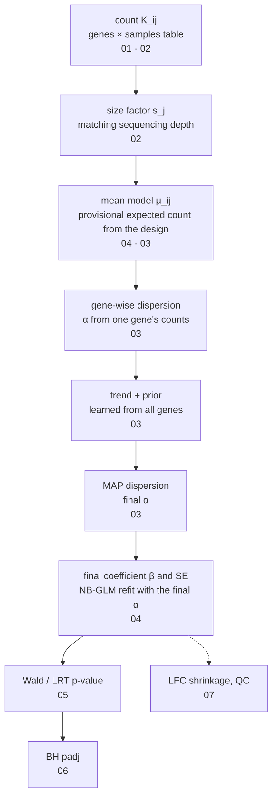

# 00. What does DESeq2 ask of six counts?

I used to look only at the padj column of the results table, until I started wondering how that number comes out of the counts. This series is my record of following the six counts of gene A, the example gene in the study text, all the way through, computing each step DESeq2 takes by hand. In this first note I draw the map first: what exactly DESeq2 compares, and which steps a count passes through before it becomes a padj. I also set out the example and the terms that the whole series shares.

> Study text: reading guide, chapter 1, appendices C and D

## 1. Which numbers does this series follow to the end?

Suppose we compare, by RNA-seq, cells grown in ordinary medium (Ctrl) with cells grown in medium without glucose (Starvation). Each condition has three biological replicates. In each sample we count the reads assigned to each gene. This number is called the count and written $K_{ij}$, where $i$ is the gene and $j$ the sample.

The counts of the two genes in chapter 1 of the study text are these.

| Gene | Ctrl 1 | Ctrl 2 | Ctrl 3 | Starvation 1 | Starvation 2 | Starvation 3 |
|---|---|---|---|---|---|---|
| Gene A | 100 | 130 | 90 | 200 | 250 | 180 |
| Gene B | 5 | 0 | 8 | 3 | 1 | 4 |

There is only one question. Did starvation change the expression of gene A? First I compute the mean and variance in each condition.

```r
A <- c(100,130,90,200,250,180); B <- c(5,0,8,3,1,4)
stat <- function(x) c(mean=mean(x), var=var(x), var_over_mean=var(x)/mean(x))
cat("Gene A Ctrl  :", round(stat(A[1:3]),2), "\n")
cat("Gene A Starvation:", round(stat(A[4:6]),2), "\n")
cat("Gene B Ctrl  :", round(stat(B[1:3]),2), "\n")
cat("Gene B Starvation:", round(stat(B[4:6]),2), "\n")
cat("Gene A observed ratio of means (Starvation/Ctrl):", mean(A[4:6])/mean(A[1:3]), " log2:", log2(mean(A[4:6])/mean(A[1:3])), "\n")
cat("Gene B observed ratio of means (Starvation/Ctrl):", mean(B[4:6])/mean(B[1:3]), " log2:", log2(mean(B[4:6])/mean(B[1:3])), "\n")
```

```
Gene A Ctrl  : 106.67 433.33 4.06 
Gene A Starvation: 210 1300 6.19 
Gene B Ctrl  : 4.33 16.33 3.77 
Gene B Starvation: 2.67 2.33 0.88 
Gene A observed ratio of means (Starvation/Ctrl): 1.96875  log2: 0.9772799 
Gene B observed ratio of means (Starvation/Ctrl): 0.6153846  log2: -0.7004397 
```

The Starvation mean of gene A (210) is about 1.97 times the Ctrl mean (106.67) (the first two lines and the fifth line). On the log2 scale that is 0.977. But the three Ctrl samples, grown under exactly the same condition, still range from 90 to 130. DESeq2's job is to decide whether 1.97-fold is hard to explain as chance once this wobble is taken into account. That is also why the mean and variance were computed separately for the three replicates of each condition, instead of over all six counts at once.

The third number on each line is the variance divided by the mean. In the Poisson distribution, the simplest model for count data, the variance equals the mean, so this ratio is 1. A ratio above 1 means more spread than the Poisson predicts, which is called overdispersion. For gene A it is 4–6, and for gene B under Starvation it is 0.88.

These numbers alone cannot establish overdispersion, though. With only three counts per condition, the variance estimate is very unstable (2 degrees of freedom). Differences in sequencing depth between samples have not been corrected yet either. The fact that values above 1 and below 1 appear in the same table shows by itself how much an n=3 variance moves around. So DESeq2 first corrects for sequencing depth ([02](02_negative_binomial.md)) and then borrows information from many genes to estimate the size of the wobble ([03](03_dispersion_estimation.md)).

This series follows gene A to the end. The destination is the table below. You don't need to know the terms in it yet; each line is computed by hand in a later note.

| Step | Value for gene A | Note that covers it |
|---|---|---|
| size factor | 1 for all six samples (an assumption of the study text's example) | [02](02_negative_binomial.md) |
| expected count $\mu$ | Ctrl 106.667, Starvation 210 | [04](04_glm_condition_batch.md) |
| gene-wise dispersion | plain NB MLE 0.014786, Cox-Reid adjusted 0.025385 | [03](03_dispersion_estimation.md) |
| final dispersion (MAP) | 0.053147 | [03](03_dispersion_estimation.md) |
| LFC and SE (log2 units) | 0.977280, 0.289057 | [04](04_glm_condition_batch.md) |
| Wald test | $Z\approx3.3809$, $p\approx0.00072244$, nominal 95% CI $\approx[0.4107,\ 1.5438]$ | [05](05_wald_vs_lrt.md) |
| padj | Not determined by one gene. It needs the p-values of all genes tested together | [06](06_multiple_testing.md) |

The MAP value 0.053147 is obtained with the prior $N(\log 0.08,\ 0.7^2)$ that the study text sets for teaching. This prior is not estimated from data. A real `DESeq()` run estimates the prior from the other genes in the same experiment, so its MAP value can differ ([03](03_dispersion_estimation.md), [08](08_one_gene_end_to_end.md)).

Only one thing from the table needs remembering. The p-value does not follow directly from the observed ratio of means, 1.97. Several steps that estimate and refine the size of the wobble (the dispersion) sit in between.

<details>
<summary>Code that computes the numbers in the table</summary>

This is the same calculation as the R code in chapter 16 of the study text (p.36). The only change is a tighter tolerance for `optimize()`, `tol=1e-10`, so that it converges to the last digit.

```r
k  <- c(100,130,90,200,250,180)                   # gene A, all size factors 1
X  <- cbind(Intercept=1, Starvation=c(0,0,0,1,1,1))
mu <- rep(c(mean(k[1:3]), mean(k[4:6])), each=3)  # the two group means, 106.667 and 210
ll   <- function(th) sum(dnbinom(k, mu=mu, size=exp(-th), log=TRUE))
cr   <- function(th) { w <- mu/(1+exp(th)*mu)
  ll(th) - 0.5*as.numeric(determinant(crossprod(X, X*w))$modulus) }
post <- function(th) cr(th) - 0.5*((th - log(0.08))/0.7)^2   # teaching prior set by the study text
opt  <- function(f) exp(optimize(f, log(c(1e-5, 2)), maximum=TRUE, tol=1e-10)$maximum)
a_mle <- opt(ll); a_cr <- opt(cr); a_map <- opt(post)
cat(sprintf("alpha: MLE %.6f | Cox-Reid %.6f | MAP %.6f (%.9f)\n", a_mle, a_cr, a_map, a_map))
w  <- mu/(1+a_map*mu)                              # weights from the final alpha
se <- sqrt(solve(crossprod(X, X*w))[2,2]) / log(2) # natural log -> log2
lfc <- log2(210/mean(k[1:3])); z <- lfc/se
cat(sprintf("LFC %.6f | SE %.6f | Z %.4f | p %.8f | 95%% CI [%.4f, %.4f]\n",
            lfc, se, z, 2*pnorm(-abs(z)), lfc-1.96*se, lfc+1.96*se))
```

```
alpha: MLE 0.014786 | Cox-Reid 0.025385 | MAP 0.053147 (0.053147342)
LFC 0.977280 | SE 0.289057 | Z 3.3809 | p 0.00072244 | 95% CI [0.4107, 1.5438]
```

Does DESeq2 give the same LFC and SE if I give it the same $\alpha$ directly? This continues with `k` and `a_map` from the previous block.

```r
suppressPackageStartupMessages(library(DESeq2))
cnt <- matrix(as.integer(k), nrow=1, dimnames=list("geneA", paste0("s", 1:6)))
cd  <- data.frame(condition=factor(rep(c("Ctrl","Starvation"), each=3)))
ddsA <- DESeqDataSetFromMatrix(cnt, cd, ~ condition)
sizeFactors(ddsA) <- rep(1, 6)
dispersions(ddsA) <- a_map                         # plug in the final alpha found above
ddsA <- nbinomWaldTest(ddsA, quiet=TRUE)
print(signif(as.data.frame(results(ddsA))[, c("log2FoldChange","lfcSE","stat","pvalue")], 7))
```

```
      log2FoldChange     lfcSE     stat       pvalue
geneA      0.9772801 0.2890574 3.380921 0.0007224337
```

The LFC and SE match the hand calculation to the sixth decimal place (0.977280, 0.289057). $Z$ is 3.380921, which matches the hand value 3.3809197 to the fifth decimal place, and p is 0.000722 in both. The small difference in the seventh digit of the LFC comes from the very small ridge penalty DESeq2 applies by default when it fits the coefficients (`lambda = 1e-6`, lines 38–39 of `deparse(DESeq2:::fitNbinomGLMs)`). With the penalty lowered to 1e-12, it matches the hand value to the last digit. This continues with `ddsA` and `k` from the previous block.

```r
mm <- model.matrix(~ condition, colData(ddsA))
for (lam in c(1e-6, 1e-12)) { f <- DESeq2:::fitNbinomGLMs(ddsA, modelMatrix=mm, lambda=rep(lam, 2), betaTol=1e-12)
  cat(sprintf("lambda %g: LFC %.10f\n", lam, f$betaMatrix[1, 2])) }
cat(sprintf("exact log2(210/106.667): %.10f\n", log2(210/mean(k[1:3]))))
```

```
lambda 1e-06: LFC 0.9772801341
lambda 1e-12: LFC 0.9772799235
exact log2(210/106.667): 0.9772799235
```

This comparison holds $\alpha$ fixed. A full `DESeq()` run estimates the trend and the prior from the data, so $\alpha$ itself changes.

</details>

Later in the study text a third condition appears. In this series the three conditions are Ctrl, Starvation and Starvation+Glucose. The third is starved cells given glucose again, and the notes call it Glucose for short. Note that it is not ordinary medium with extra glucose. In DESeq2 you write, as an R formula, which factors (condition, donor, batch and so on) should explain the differences in counts; this is called the design. The design is written `~ pair + condition` only under the assumption that all three conditions were obtained from the same donors. This paired design, which compares within donors, is covered in [04](04_glm_condition_batch.md), the three-group comparison in [05](05_wald_vs_lrt.md), and the criteria for deciding whether Glucose reverses the starvation effect (rescue) in [06](06_multiple_testing.md). All the examples in the study text are illustrations, not analyses of real experimental data.

## 2. What does DESeq2 compare?

The observed ratio of means, 1.97, only summarises these six samples. Repeating the experiment would give a different value. What DESeq2 compares is not the observed means but the mean count the model expects in each condition. This is called the expected count, $\mu_{ij}$. The expected count cannot be seen directly; it is an unknown to be estimated from the data.

So the question the test asks is different too. It is not "are the observed means of the two conditions identical?" It asks how compatible the current observations are with a model in which the expected expression is the same in both conditions, given the chance involved in drawing samples and the biological differences between individuals. In other words, would observations like these be plausible under that model?

Section 1.2 of the study text distinguishes four quantities for one gene.

| Quantity | Symbol | Meaning | Gene A |
|---|---|---|---|
| observed count | $K_{ij}$ | The count actually read. This is the data | 100, 130, 90, 200, 250, 180 |
| expected count | $\mu_{ij}$ | The mean count the model expects in sample $j$. To be estimated | Ctrl 106.667, Starvation 210 |
| effect (LFC) | $\beta$ | The ratio of the corrected expected expression in the two conditions, on the log2 scale. The estimate is written $\hat\beta$ | 0.977280 |
| uncertainty | $SE(\hat\beta)$ | How much $\hat\beta$ would move if the same experiment were repeated | 0.289057 |

An LFC (log2 fold change) of 1 means a 2-fold change, and −1 means half. But two genes with the same LFC can deserve very different amounts of trust. If one has an SE of 0.1 and the other 1.0, the effect size is the same but the evidence from the data is very different. The Wald test looks at the ratio of the two.

$$Z=\frac{\hat\beta-\beta_0}{SE(\hat\beta)},\qquad p=2\,\Phi(-|Z|)$$

Here $\hat\beta$ is the LFC estimated from the data, $\beta_0$ is the value under the null hypothesis (0 for "no difference"), and $SE(\hat\beta)$ is the standard error of $\hat\beta$. $\Phi$ is the cumulative distribution function of the standard normal, so $2\Phi(-|Z|)$ is the two-tailed probability.

For gene A, $Z=(0.977280-0)/0.289057\approx3.38$. The estimate lies about 3.4 standard errors away from 0.

```r
wald <- function(lfc, se) { z <- lfc/se
  sprintf("LFC=%.3f SE=%.3f : Z=%.2f  p=%.3g  95%%CI=[%.2f, %.2f]", lfc, se, z, 2*pnorm(-abs(z)), lfc-1.96*se, lfc+1.96*se) }
cat(wald(1, 0.1), wald(1, 1.0), wald(0.977280, 0.289057), sep="\n")
```

```
LFC=1.000 SE=0.100 : Z=10.00  p=1.52e-23  95%CI=[0.80, 1.20]
LFC=1.000 SE=1.000 : Z=1.00  p=0.317  95%CI=[-0.96, 2.96]
LFC=0.977 SE=0.289 : Z=3.38  p=0.000722  95%CI=[0.41, 1.54]
```

95%CI is the confidence interval LFC ± 1.96×SE. It is called nominal because it is not corrected for looking at many genes together.

Comparing the two lines above, the LFC is 1 in both, yet the p-values split into the $10^{-23}$ range and 0.32, and the 95% confidence interval on the second line comfortably includes 0. The third line is gene A. This is why significance cannot be read from the LFC alone. Where the SE comes from is covered in [04](04_glm_condition_batch.md), and the kinds of tests in [05](05_wald_vs_lrt.md).

## 3. In which direction of the table is the model built?

A count matrix is a table with genes as rows and samples as columns. It can be read in two directions. Reading one column gives all genes in one sample; reading one row gives all samples of one gene.

DESeq2's model runs along the rows. The six counts of gene A build a model for gene A, and gene B gets its own separate model. At first I also thought that the histogram of all genes in one sample should look like a negative binomial distribution, but section 1.1 of the study text points out that this is wrong. Since every gene has a different expression level, that histogram can only be a mixture of a great many distributions with different means.

Let me compare the two directions by simulation. `makeExampleDESeqDataSet()` is DESeq2's built-in function for generating example data. By default it creates 1000 genes and 12 samples (6 each in conditions A and B), with a true condition effect of 0 for every gene and true size factors all equal to 1. Here A and B are the condition names in the simulation, not genes A and B.

```r
suppressPackageStartupMessages(library(DESeq2))
set.seed(1); dds <- makeExampleDESeqDataSet(n=1000, m=12); k <- counts(dds)
summary(k[,1])
cat("sample 1: mean =", round(mean(k[,1]),1), " var =", round(var(k[,1]),0), " var/mean =", round(var(k[,1])/mean(k[,1]),1), "\n")
for (g in c("A","B")) { x <- k[1, dds$condition == g]
  cat("gene 1, condition", g, ":", x, "-> mean =", round(mean(x),2), " var =", round(var(x),2), "\n") }
mu1 <- 2^mcols(dds)$trueIntercept[1]; a1 <- mcols(dds)$trueDisp[1]
cat("gene 1 truth: mu =", round(mu1,2), "(same in both conditions)  alpha =", round(a1,3), "  mu + alpha*mu^2 =", round(mu1 + a1*mu1^2,2), "\n")
range(mcols(dds)$trueIntercept)
range(mcols(dds)$trueBeta)
```

```
   Min. 1st Qu.  Median    Mean 3rd Qu.    Max. 
   0.00    5.00   15.00   44.69   39.00 2984.00 
sample 1: mean = 44.7  var = 15968  var/mean = 357.3 
gene 1, condition A : 14 1 1 4 3 14 -> mean = 6.17  var = 38.17 
gene 1, condition B : 1 6 1 3 2 10 -> mean = 3.83  var = 12.57 
gene 1 truth: mu = 6.71 (same in both conditions)  alpha = 0.696   mu + alpha*mu^2 = 38.08 
[1] -2.016097 11.620553
[1] 0 0
```

Compare the `sample 1:` line with the two `gene 1, condition` lines. The counts of sample 1 spread from 0 to 2984, with a variance/mean of 357. Gene 1, on the other hand, moves around a mean near 4–6 within one condition. The last two lines are the true values of the simulation. The baseline expression level per gene (`trueIntercept`, log2 units) spreads widely from −2 to 11.6, and the true condition effect (`trueBeta`) is 0 for every gene.


The left panel is a histogram of the 1000 counts in the single column of sample 1, plotted as log2(count + 1). It is wide because every gene has a different baseline expression level (−2 to 11.6 on the log2 scale). The right panel shows the 12 counts in the single row of gene 1, which all wobble around the same expected value, 6.71.

<details>
<summary>Code for the figure</summary>

```r
suppressPackageStartupMessages(library(DESeq2))
set.seed(1); dds <- makeExampleDESeqDataSet(n=1000, m=12); k <- counts(dds)
out <- "../figures/00_two_directions.png"
png(out, width=7, height=4.5, units="in", res=150, bg="white")
par(mfrow=c(1,2), mar=c(4.2,4.2,3.4,1), mgp=c(2.4,0.7,0), las=1, bty="l",
    col.axis="#52514e", col.lab="#0b0b0b", fg="#52514e", cex.axis=0.85)
# (A) all genes of one sample: column direction
hist(log2(k[,1] + 1), breaks=0:12, col="#9dbfe8", border="white",
     main="", xlab="log2(count + 1) in sample 1", ylab="number of genes")
title("A. One sample, 1000 genes", adj=0, line=1.6, cex.main=0.95, font.main=1)
mtext("counts from 0 to 2984", side=3, line=0.5, adj=0, cex=0.75, col="#52514e")
# (B) all samples of one gene: row direction
x <- k[1, ]; grp <- as.integer(dds$condition)
jit <- seq(-0.15, 0.15, length.out=6)[ave(grp, grp, FUN=seq_along)]
plot(grp + jit, x, xlim=c(0.5, 2.5), ylim=c(0, 16), xaxt="n", pch=19, col="#2a78d6",
     xlab="condition", ylab="count of gene 1")
axis(1, at=1:2, labels=levels(dds$condition))
mu1 <- 2^mcols(dds)$trueIntercept[1]
abline(h=mu1, lty=2, col="#0b0b0b")
text(0.5, mu1 + 0.3, sprintf("true mean %.2f", mu1), adj=c(0, 0), cex=0.75, col="#0b0b0b")
title("B. One gene, 12 samples", adj=0, line=1.6, cex.main=0.95, font.main=1)
mtext("same expected value in A and B", side=3, line=0.5, adj=0, cex=0.75, col="#52514e")
invisible(dev.off())
cat(out, file.exists(out), file.size(out), "bytes\n")
```

```
../figures/00_two_directions.png TRUE 43641 bytes
```

</details>

The left histogram is not what the model tries to explain. Like the right panel, the model assumes that each count $K_{ij}$ in a row follows a negative binomial distribution with its own expected value $\mu_{ij}$ and the dispersion $\alpha_i$ shared by that gene. The negative binomial is a count distribution that allows overdispersion, and the dispersion sets how much it spreads (both are written as formulas in section 4). Usually $\mu_{ij}$ differs from sample to sample, depending on the condition and the size factor. So lumping the 12 counts of a row into one distribution and taking its mean and variance would repeat the very mistake the left histogram warns against: mixing values with different means. That is also why the code above computes the mean and variance of gene 1 separately for each condition.

In this simulation the condition effect is 0 and the true size factor is 1, so the expected value of gene 1 is the same 6.71 in all 12 samples. Only in a case like this is a whole row a sample from one distribution. The sample variances of the two conditions, 38.17 and 12.57, are n=6 samples from the same theoretical variance $\mu+\alpha\mu^2=38.08$. That they still differ this much means the variance estimate swings a lot even at n=6.

The wobble seen along a row is the wobble between biological replicates of the same condition. Biological replicates are samples obtained separately in a biological sense, such as different donors (section 1.3 of the study text). Reading the same library on several sequencing lanes does not add biological replicates; those are technical replicates. Technical counts from the same biological sample may be summed where appropriate, but the reverse, merging different biological samples as if they were technical replicates, is not allowed.

The same goes for single-cell data. Thousands of cells from one donor must not be treated as thousands of donors. If the question is a donor-level difference between conditions, an easy starting point is a pseudobulk, which sums the counts per cell type in donor×condition units. Summing cells does not increase the number of independent donors.

The dispersion $\alpha_i$, defined in the next section, measures exactly this wobble between biological replicates. From here on is my own addition, not in section 1.3 of the study text. Counting units such as lanes or cells as biological replicates (pseudoreplication) makes the estimate of $\alpha_i$ too small. The SE then shrinks and the p-values come out more optimistic than they should. The opposite mistake, summing different biological samples, loses independent replicates.

## 4. What does the model look like as a formula?

Say the expected Ctrl count of gene A is 106.667. Under a Poisson distribution the variance would also be 106.667. But counts between biological replicates usually spread more than that (overdispersion). The count distribution that allows overdispersion is the negative binomial (NB), and DESeq2 uses it.

$$K_{ij}\sim NB(\mu_{ij},\ \alpha_i),\qquad \mathrm{Var}(K_{ij})=\mu_{ij}+\alpha_i\,\mu_{ij}^2$$

$K_{ij}$ is the count of gene $i$ in sample $j$, and $\mu_{ij}$ is its expected value. $\alpha_i$ is the dispersion of gene $i$, the extra spread beyond Poisson. If $\alpha_i=0$, the variance becomes $\mu_{ij}$, the same as Poisson. Keep in mind that the dispersion is not the variance itself.

Plugging the final $\alpha=0.053147$ into gene A's Ctrl gives a variance of $106.667+0.053147\times106.667^2\approx106.7+604.7=711.4$, about 6.7 times the 106.7 that Poisson predicts. Under Starvation ($\mu=210$) it is $210+0.053147\times210^2\approx2553.8$.

The expected count can be split further into two parts.

$$\mu_{ij}=s_j\,q_{ij},\qquad \log q_{ij}=x_j^{T} b_i$$

- $s_j$: the size factor of sample $j$, the multiplier that corrects for differences in sequencing depth between samples. A normalized count is the count divided by the size factor ([02](02_negative_binomial.md)).
- $q_{ij}$: the expected expression with the depth difference removed.
- $x_j$: row $j$ of the design matrix $X$. The design matrix is a table that records in numbers which condition, batch or pair each sample belongs to.
- $b_i$: the coefficients of gene $i$ (natural log units).
- $x_j^{T} b_i$: the sum of the element-wise products of $x_j$ and $b_i$.

A model like this, which writes the mean of the counts on the log scale as a sum of condition, batch and so on, is called a GLM (generalized linear model) ([04](04_glm_condition_batch.md)).

Let me plug in gene A. All size factors are 1. $x_j$ is $(1,0)$ for Ctrl samples and $(1,1)$ for Starvation samples, so $\log q_{\text{Ctrl}}=b_0$ and $\log q_{\text{Starvation}}=b_0+b_1$. Here $b_0=\ln106.667\approx4.66971$ and $b_1=\ln(210/106.667)\approx0.677399$.

The LFC that DESeq2 reports in the results table is this $b_1$ converted to log2 units.

$$\beta=\frac{b}{\ln 2}$$

$0.677399/0.693147\approx0.977280$, the same as the LFC in the table of section 1. DESeq2 computes internally in natural-log units $b$ and stores log2 units $\beta$ in `mcols(dds)` and `results()`. The source evidence is in (7) under "Going deeper".

For gene A, $\hat\beta$ equals the log2 of the observed ratio of means only because all size factors are 1 and the design contains only the condition. If the size factors differ between samples, the two differ. Below is what happens with the same counts and only the size factors changed.

<details>
<summary>How do the LFC and the observed ratio of means differ when the size factors differ?</summary>

This continues with `ddsA` (with $\alpha$ fixed at 0.053147342) from "Code that computes the numbers in the table" in section 1. The size factor values are made up for illustration.

```r
kA <- counts(ddsA)[1, ]; sf <- c(0.8, 1, 1.2, 0.9, 1.1, 1.0)
d2 <- ddsA; sizeFactors(d2) <- sf; d2 <- nbinomWaldTest(d2, quiet=TRUE)
nk <- kA/sf
cat(sprintf("unequal sf: DESeq2 LFC %.6f | log2(normalized mean ratio) %.6f | log2(raw mean ratio) %.6f\n",
  results(d2)$log2FoldChange, log2(mean(nk[4:6])/mean(nk[1:3])), log2(mean(kA[4:6])/mean(kA[1:3]))))
```

```
unequal sf: DESeq2 LFC 0.937958 | log2(normalized mean ratio) 0.931729 | log2(raw mean ratio) 0.977280
```

DESeq2's LFC differs from both the raw count ratio of means and the normalized count ratio of means. This is because the NB likelihood gives each count a different weight ([04](04_glm_condition_batch.md)).

</details>

## 5. Which steps lie between the counts and padj?

To get from gene A's 1.97-fold to $p\approx0.00072$, the data pass through the steps below in order. The numbers in the boxes are the notes that explain each step in detail.



In [08](08_one_gene_end_to_end.md) I follow this whole path for gene A alone, by hand and with DESeq2. Here is a short explanation of the terms that appear for the first time at each step.

1. count: the input. Why counts follow an NB rather than a Poisson is covered in [01](01_poisson_simulation.md) and [02](02_negative_binomial.md).
2. size factor: one per sample, set by looking at all genes together.
3. mean model: provisional expected counts for each sample, according to the design. To estimate the dispersion you first need to know the centre around which the counts wobble.
4. gene-wise dispersion: an estimate of $\alpha$ from the counts of one gene alone. This is where the likelihood comes in: with the observations held fixed, it measures how plausible a candidate parameter makes those observations. The value with the largest likelihood is the MLE (maximum likelihood estimate). But because the mean was estimated from the same data, the MLE tends to set $\alpha$ too small. The correction term that reduces this is the Cox-Reid adjustment; for gene A it turns 0.014786 into 0.025385.
5. trend + prior: the trend is a curve showing where the dispersion roughly lies as a function of mean expression. The prior is a distribution for where $\alpha$ is likely to be before the data are seen. DESeq2 estimates it from all genes, an approach called empirical Bayes.
6. MAP dispersion: the MAP (maximum a posteriori) is the most plausible value when the likelihood and the prior are considered together. Gene-wise values with little information are pulled toward the trend; this is called shrinkage. For gene A, the teaching prior raises 0.025385 to 0.053147.
7. final coefficients and SE: refitting the NB-GLM with the final $\alpha$ gives $\hat\beta$ and its SE. The coefficients are found by an iterative calculation called IRLS (iteratively reweighted least squares).
8. Wald / LRT p-value: the Wald test compares (estimate − 0) / SE with the standard normal. The LRT (likelihood ratio test) tests several coefficients at once from the difference in likelihood between the model without them and the model with them. Which two conditions to compare is set by a vector called a contrast.
9. BH padj: because thousands of genes are tested at once, the p-values must be adjusted. The BH (Benjamini–Hochberg) adjustment controls the FDR, the expected proportion of false discoveries in the list of discoveries.

Section 1.4 of the study text sums up the direction in which information flows along this path: "The per-gene model is fitted along the sample direction. Information from all genes is borrowed mainly in normalization and in empirical Bayes estimation. Not confusing these two directions is the starting point." Quantity by quantity, it looks like this.

| Quantity | Direction in which it is set |
|---|---|
| size factor $s_j$ | One per sample, set by looking at all genes together. What normalization borrows is the reference for the size factors |
| trend and prior of the dispersion | Set by looking at all genes together (empirical Bayes) |
| coefficient $b_i$ | Set from the counts of gene $i$ alone once $s_j$ and $\alpha_i$ are fixed (with the default `betaPrior=FALSE`, which puts no prior on the LFC). But $s_j$ and $\alpha_i$ already contain information from other genes |
| dispersion $\alpha_i$ | Combines both directions. The gene-wise value comes from the counts of gene $i$ alone; the final MAP value combines it with a prior learned from all genes |

### What happens inside the single line `DESeq()`

When you actually run the single line `DESeq(dds)`, the steps above run as five functions. I call the functions one at a time and print what each one adds to `dds`. `mcols(dds)` is a results table with one row per gene, and an assay is a genes×samples matrix.

```r
suppressPackageStartupMessages(library(DESeq2))
set.seed(1); dds <- makeExampleDESeqDataSet()   # 1000 genes, 12 samples (6 each in conditions A, B)
steps <- c(estimateSizeFactors = estimateSizeFactors,
           estimateDispersionsGeneEst = estimateDispersionsGeneEst,
           estimateDispersionsFit = estimateDispersionsFit,
           estimateDispersionsMAP = estimateDispersionsMAP,
           nbinomWaldTest = nbinomWaldTest)
x <- dds
for (s in names(steps)) {
  y <- steps[[s]](x)
  cat(sprintf("%-26s | new assay: %-8s | new mcols columns: %s\n", s,
      paste(setdiff(assayNames(y), assayNames(x)), collapse=","),
      paste(setdiff(colnames(mcols(y)), colnames(mcols(x))), collapse=", ")))
  x <- y
}
cat("size factor (first 3):", round(sizeFactors(x)[1:3], 3), "\n")
```

```
estimateSizeFactors        | new assay:          | new mcols columns: 
estimateDispersionsGeneEst | new assay: mu       | new mcols columns: baseMean, baseVar, allZero, dispGeneEst, dispGeneIter
estimateDispersionsFit     | new assay:          | new mcols columns: dispFit
estimateDispersionsMAP     | new assay:          | new mcols columns: dispersion, dispIter, dispOutlier, dispMAP
nbinomWaldTest             | new assay: H,cooks  | new mcols columns: Intercept, condition_B_vs_A, SE_Intercept, SE_condition_B_vs_A, WaldStatistic_Intercept, WaldStatistic_condition_B_vs_A, WaldPvalue_Intercept, WaldPvalue_condition_B_vs_A, betaConv, betaIter, deviance, maxCooks
size factor (first 3): 1.088 1.044 1.014 
```

The dispersion is split over three functions (GeneEst, Fit, MAP), and each leaves its own columns. The size factors go into `sizeFactors(dds)`, not `mcols`. `DESeq(dds)` calls these five functions in the same order. If some condition (design cell) has 7 or more samples, though, one more step that replaces outlier counts and refits may be added. The check that the result columns of `DESeq(dds)` match this step-by-step run, and the source excerpts, are in (1)–(3) under "Going deeper".

Adding the traces left in `dds` and the note numbers to the map in section 1.4 of the study text gives this.

| Step | Question in the study text | Main outputs (study text) | Traces left in `dds` | Note |
|---|---|---|---|---|
| input and design | What is compared, and what is an independent replicate? | count matrix, metadata, design | `counts` assay, `colData`, `design(dds)` | 00, 04 |
| normalization | How different is the measurement scale of each sample? | size factors or normalization factors | `sizeFactors(dds)` or `normalizationFactors(dds)` | 02, 04 |
| mean model | How do condition, donor and batch change the expected count? | design matrix, provisional fitted mean | `mu` assay | 04 |
| dispersion estimation | How much do counts wobble around the explained mean? | gene-wise, trend, MAP/final dispersion | `dispGeneEst`, `dispFit`, `dispMAP`, `dispersion`, `dispOutlier` | 03 |
| coefficient estimation | What is the corrected difference between conditions? | β, covariance, SE | `condition_B_vs_A`, `SE_condition_B_vs_A`, `betaConv` | 04 |
| testing and adjustment | Is there enough evidence of a difference? | Wald/LRT p-values, BH padj | `WaldStatistic_*`, `WaldPvalue_*`, `pvalue` and `padj` of `results()` | 05, 06 |
| interpretation | What are the size, direction, reproducibility and biological meaning? | effect estimates, diagnostics, follow-up validation | `cooks` assay, `maxCooks`, `lfcShrink()` | 07, 08 |

A few places in the table are easy to confuse. `dispersion` (the final value) and `dispMAP` are different columns, and the genes where the two differ are the dispersion outliers. The coefficients and SEs are stored, but the covariance matrix is not. Of the study text's "β, covariance, SE", the covariance is recomputed internally when needed. And as the description of the coefficient column, "log2 fold change (MLE)", shows, the stored value is $\beta$ in log2 units, not $b$ in natural-log units.

The study text and this series follow the `fitType="parametric"`, `test="Wald"`, `betaPrior=FALSE` flow. All three are the defaults in DESeq2 1.50.2. The defaults of `results()` are `alpha=0.1`, `pAdjustMethod="BH"` and `independentFiltering=TRUE`.

### Four places where the map is often drawn wrong

The reading guide of the study text (p.3) starts by correcting four things that are often explained wrongly. I found the evidence for all four in the DESeq2 source; where I could not confirm something by running it, the item says so.

1. "The mean is re-estimated for every candidate dispersion." Correct as a concept, but the default implementation is different. It first fixes the mean, then optimizes the Cox-Reid adjusted objective (the likelihood expression to be maximized) over $\alpha$ only. There is an outer loop that alternates between the mean and the dispersion, but the default number of passes is 1 (`niter=1`). How the fixed mean is obtained depends on the design. With a design that has only condition groups, like `~ condition`, it uses group means that do not depend on $\alpha$. With an additive design of condition and batch, like `~ batch + condition`, or with weights, it uses the NB-GLM mean fitted with an initial $\alpha$. The evidence is in (4), and the details in [03](03_dispersion_estimation.md).
2. "The final dispersion is always the MAP." Not so. Dispersion outliers, whose gene-wise value is higher than the trend by more than a threshold, keep the gene-wise value. The evidence is in (5).
3. "Every LFC shrinkage is a MAP." Not this either. The `normal` and `apeglm` types of `lfcShrink()` return the posterior mode (MAP), while `ashr` returns the posterior mean. The environment I ran these notes in has no apeglm or ashr, so I checked this from the source only. The evidence is in (5), and the details in [07](07_lfc_shrinkage_and_qc.md).
4. "Because the comparisons are planned, the error rate of a conclusion combining several comparisons is controlled automatically." No. `results()` applies BH separately for each call (contrast). The default family is the genes that have a p-value in that contrast and pass independent filtering. Independent filtering is a step that removes genes with too low a mean count before the BH adjustment. So taking the intersection of two significant lists does not by itself guarantee "rescue list at FDR 5%". The part about the BH family is confirmed by running it in (6), and the statistical explanation of the intersection is in [06](06_multiple_testing.md).

## 6. Where are this series' terms explained in detail?

These are the terms every note uses with the same meaning and notation. The right-hand column is the note that first covers the term in detail. The symbols follow appendix C of the study text; the symbols this series added because they are in neither the original table nor appendix C are collected in the "Appendix C" block under "Going deeper".

| Term | One-line explanation | Note that first covers it |
|---|---|---|
| count $K_{ij}$ | The number of reads (or fragments) assigned to one gene in one sample | 00 |
| expected count $\mu_{ij}$ | The mean count the model expects in that sample | 00, 04 |
| biological replicate | A sample obtained separately in a biological sense. Reading the same library on several lanes does not count | 00 |
| size factor $s_j$ | The multiplier that corrects for differences in sequencing depth between samples. Normalized count = count / size factor | 02 |
| overdispersion | Spread between replicates of the same condition that is larger than the Poisson predicts | 01 |
| dispersion $\alpha$ | The extra spread in variance = $\mu+\alpha\mu^2$. $\alpha=0$ is the same as Poisson. Not the variance itself | 02 |
| negative binomial (NB) | A count distribution that allows overdispersion | 02 |
| likelihood | With the observations held fixed, how plausible a candidate parameter makes those observations | 03 |
| MLE (maximum likelihood estimate) | The parameter value with the largest likelihood | 03 |
| Cox-Reid adjustment | A correction term that reduces the underestimation of the dispersion caused by estimating the mean from the same data | 03 |
| trend | A curve showing where the dispersion roughly lies as a function of mean expression | 03 |
| prior | A distribution for where a parameter is likely to be before the data are seen. DESeq2 estimates it from all genes | 03 |
| empirical Bayes | Estimating the prior from all genes of the same experiment and using it | 03 |
| MAP (maximum a posteriori) | The most plausible value when the likelihood and the prior are considered together | 03 |
| shrinkage | Pulling estimates that carry little information toward the overall tendency. For the dispersion see 03, for the LFC 07 | 03, 07 |
| GLM (generalized linear model) | A model that writes the mean of the counts on the log scale as a sum of condition, batch and so on | 04 |
| design matrix $X$ | A table that records in numbers which condition, batch or pair each sample belongs to | 04 |
| coefficient $b$ / $\beta$ | $b$ in natural-log units, $\beta$ in log2 units ($\beta=b/\ln 2$) | 04 |
| LFC (log2 fold change) | The log2 of the ratio of two condition means. 1 is 2-fold, −1 is half | 00, 04 |
| SE (standard error) | How much an estimate would move if the same experiment were repeated | 04 |
| IRLS | The iteratively reweighted least squares calculation that finds the coefficients | 04 |
| contrast | A vector that sets which two conditions (or which combination of coefficients) to compare | 04, 05 |
| Wald test | A test that compares (estimate − 0) / SE with the standard normal | 05 |
| LRT (likelihood ratio test) | Tests several coefficients at once from the difference in likelihood between the model without them and the model with them | 05 |
| p-value | The probability, if the null hypothesis is true, of a statistic as extreme as the current one or more | 05 |
| padj (adjusted p-value) | A p-value adjusted for testing many genes together | 06 |
| FDR | The expected proportion of false discoveries in the list of discoveries | 06 |
| BH (Benjamini–Hochberg adjustment) | A p-value adjustment that controls the FDR. The default method of `results()` | 06 |

## Summary

- What DESeq2 compares is not the observed means but the expected count $\mu$. Gene A's observed ratio of means, 1.97 (log2 0.977), only summarises the data.
- The model takes one gene at a time and runs along the sample direction. The wobble is also measured between biological replicates of the same condition, so counting lanes or cells as replicates makes $\alpha$ too small and the p-values optimistic.
- The variance is $\mu+\alpha\mu^2$, so $\alpha=0$ is the same as Poisson. The strength of evidence is read from LFC/SE, not from the LFC. For gene A it is $0.977280/0.289057\approx3.38$.
- `DESeq()` runs size factors → dispersion (gene-wise → trend → MAP) → coefficients and Wald test → (depending on the data) outlier refit, and each step leaves columns in `dds`. padj is set not on one gene but over the family of genes tested together.

## Exercises

Problems 1 and 2 of appendix A of the study text.

> **Problem 1.** The histogram of all gene counts in one sample does not look like a normal distribution. Is this a direct reason why DESeq2 cannot be used? Explain the direction in which DESeq2 assumes a distribution.

<details>
<summary>Solution</summary>

The study text's answer (B.1) is: "No. The counts are modelled with one gene fixed, along the direction of the biological samples. The between-gene histogram of one sample is not what that NB assumption is about."

As the simulation in section 3 showed, the counts of the 1000 genes in sample 1 formed a mixture spanning 0 to 2984, with a variance/mean of 357. That shape is expected, since the baseline expression level differs from gene to gene (`trueIntercept`, −2 to 11.6 on the log2 scale). What the model says is that each count $K_{ij}$ in a row (gene) follows an NB with its own expected value $\mu_{ij}$ and that gene's $\alpha_i$. Gene 1 in section 3 came from a simulation with a condition effect of 0 and true size factors of 1, which is the only reason its 12 counts came from the same distribution.

Not looking normal is, if anything, normal for count data, and DESeq2 does not assume a normal distribution anyway. So this is not "a reason it cannot be used" but a question pointed in the wrong direction.

</details>

> **Problem 2.** As the mean count rose from 100 to 200, the variance also rose. Can you conclude from this alone that an NB is needed instead of a Poisson?

<details>
<summary>Solution</summary>

The study text's answer (B.2) is: "No. Under a Poisson the variance also rises with the mean. The key is whether the variance exceeds the Poisson prediction relative to the expected mean, given the conditions and offsets."

Under a Poisson the variance equals the mean ($\mathrm{Var}=\mu$), so a larger mean means a larger variance. Let me check by simulation.

```r
set.seed(7); n <- 1e5
p100 <- rpois(n,100); p200 <- rpois(n,200)
cat(sprintf("Poisson: mean 100 -> var %.1f ; mean 200 -> var %.1f\n", var(p100), var(p200)))
nb100 <- rnbinom(n, mu=100, size=1/0.2); nb200 <- rnbinom(n, mu=200, size=1/0.2)
cat(sprintf("NB(alpha=0.2): mean 100 -> var %.0f (theory %.0f) ; mean 200 -> var %.0f (theory %.0f)\n",
            var(nb100), 100+0.2*100^2, var(nb200), 200+0.2*200^2))
```

```
Poisson: mean 100 -> var 99.4 ; mean 200 -> var 199.5
NB(alpha=0.2): mean 100 -> var 2106 (theory 2100) ; mean 200 -> var 8243 (theory 8200)
```

For the Poisson, the variance simply followed the mean: 100→99.4, 200→199.5. For the NB ($\alpha=0.2$) it went 2106→8243, following $\mu+\alpha\mu^2$. In both cases "the variance grew as the mean grew" is true. What separates them is whether the variance grows faster than the mean: whether the variance/mean ratio stays near 1, or rises above 1 together with the mean like $1+\alpha\mu$ (with the excess $\alpha\mu$ proportional to the mean). The dispersion $\alpha$ is what measures this excess ([01](01_poisson_simulation.md), [02](02_negative_binomial.md)).

</details>

## Going deeper

<details>
<summary>Checked in the DESeq2 source (1): default arguments and order of execution of <code>DESeq()</code></summary>

All code in this note was run on R 4.5.2 with DESeq2 1.50.2 (2026-09-26). Statements about how DESeq2 behaves were written after checking the installed package source and running `makeExampleDESeqDataSet()`.

```r
suppressPackageStartupMessages(library(DESeq2))
cat("R:", R.version.string, "\nDESeq2:", as.character(packageVersion("DESeq2")), "\n")
cat("apeglm:", requireNamespace("apeglm", quietly=TRUE), " ashr:", requireNamespace("ashr", quietly=TRUE), "\n")
print(args(DESeq))
```

```
R: R version 4.5.2 (2025-10-31) 
DESeq2: 1.50.2 
apeglm: FALSE  ashr: FALSE 
function (object, test = c("Wald", "LRT"), fitType = c("parametric", 
    "local", "mean", "glmGamPoi"), sfType = c("ratio", "poscounts", 
    "iterate"), betaPrior, full = design(object), reduced, quiet = FALSE, 
    minReplicatesForReplace = 7, modelMatrixType, useT = FALSE, 
    minmu = if (fitType == "glmGamPoi") 1e-06 else 0.5, parallel = FALSE, 
    BPPARAM = bpparam()) 
NULL
```

By the `match.arg` convention, the first element of the vector is the default. So `test="Wald"`, `fitType="parametric"` and `sfType="ratio"` are the defaults. `betaPrior` has no default in the signature and is set in the body.

Below are only the lines of the `print(DESeq)` output that set the flow. The full function can be seen in R with `print(DESeq2::DESeq)`.

```
# excerpt (not run)
    if (missing(betaPrior)) {
        betaPrior <- FALSE
    }
    ...
    else {
        if (!quiet) message("estimating size factors")
        object <- estimateSizeFactors(object, type = sfType, quiet = quiet)
    }
    if (!parallel) {
        if (!quiet) message("estimating dispersions")
        object <- estimateDispersions(object, fitType = fitType, quiet = quiet, modelMatrix = modelMatrix, minmu = minmu)
        if (!quiet) message("fitting model and testing")
        if (test == "Wald") {
            object <- nbinomWaldTest(object, betaPrior = betaPrior, quiet = quiet, ...)
        }
        else if (test == "LRT") {
            object <- nbinomLRT(object, full = full, reduced = reduced, quiet = quiet, minmu = minmu, type = dispersionEstimator)
        }
    }
    ...
    sufficientReps <- any(nOrMoreInCell(attr(object, "modelMatrix"), minReplicatesForReplace))
    if (sufficientReps) {
        object <- refitWithoutOutliers(object, test = test, betaPrior = betaPrior, full = full, reduced = reduced, ...)
    }
    metadata(object)[["version"]] <- packageVersion("DESeq2")
```

`...` marks the parts omitted here. The order is estimateSizeFactors → estimateDispersions → nbinomWaldTest (or nbinomLRT) → [conditional] refitWithoutOutliers.

This order holds for the default `parallel=FALSE`. With `parallel=TRUE`, `DESeqParallel()` runs the dispersion and testing steps instead (lines 129–137 of `deparse(DESeq)`). And if size factors or normalization factors already exist, the first step is skipped. If only size factors exist, it just prints "using pre-existing size factors"; if both exist, it prints the normalization factor message, "using pre-existing normalization factors" (lines 96–99 of `deparse(DESeq)`).

Inside the `DESeqDataSet` method of `estimateDispersions` there are again three steps. Below is an excerpt of lines 52–63 of `deparse(getMethod("estimateDispersions","DESeqDataSet"))`; the leading numbers are deparse line numbers.

```
# excerpt (not run)
  52:             message("gene-wise dispersion estimates")
  53:         object <- estimateDispersionsGeneEst(object, maxit = maxit,
  58:             message("mean-dispersion relationship")
  59:         object <- estimateDispersionsFit(object, fitType = fitType,
  62:             message("final dispersion estimates")
  63:         object <- estimateDispersionsMAP(object, maxit = maxit,
```

</details>

<details>
<summary>Checked in the DESeq2 source (2): the columns each step creates, and their descriptions</summary>

The defaults of `makeExampleDESeqDataSet()` are `n=1000, m=12, betaSD=0, interceptMean=4, interceptSD=2, dispMeanRel = 4/x + 0.1, sizeFactors = rep(1, m)`. Because `betaSD=0`, the true condition effect is 0 for every gene. I applied the step functions to this `dds` one at a time and printed `assayNames()` and `colnames(mcols())`. This is the full version of the block in section 5. From this block through (6), the code continues with objects from earlier blocks (`dds1`, `dds2`, `dds5`, `res`).

```r
set.seed(1)
dds <- makeExampleDESeqDataSet()
show_state <- function(x, label) {
  cat("\n##", label, "\n")
  cat("assayNames :", paste(assayNames(x), collapse=", "), "\n")
  cat("mcols cols :", paste(colnames(mcols(x)), collapse=", "), "\n")
  cat("sizeFactors NULL? ", is.null(sizeFactors(x)), "\n")
}
show_state(dds, "0) right after makeExampleDESeqDataSet()")
dds1 <- estimateSizeFactors(dds);          show_state(dds1, "1) estimateSizeFactors()")
dds2 <- estimateDispersionsGeneEst(dds1);  show_state(dds2, "2a) estimateDispersionsGeneEst()")
dds3 <- estimateDispersionsFit(dds2);      show_state(dds3, "2b) estimateDispersionsFit()")
dds4 <- estimateDispersionsMAP(dds3);      show_state(dds4, "2c) estimateDispersionsMAP()")
dds5 <- nbinomWaldTest(dds4);              show_state(dds5, "3) nbinomWaldTest()")
ddsA <- DESeq(dds)
cat("identical mcols colnames to step-by-step?", identical(colnames(mcols(ddsA)), colnames(mcols(dds5))), "\n")
```

```

## 0) right after makeExampleDESeqDataSet() 
assayNames : counts 
mcols cols : trueIntercept, trueBeta, trueDisp 
sizeFactors NULL?  TRUE 

## 1) estimateSizeFactors() 
assayNames : counts 
mcols cols : trueIntercept, trueBeta, trueDisp 
sizeFactors NULL?  FALSE 

## 2a) estimateDispersionsGeneEst() 
assayNames : counts, mu 
mcols cols : trueIntercept, trueBeta, trueDisp, baseMean, baseVar, allZero, dispGeneEst, dispGeneIter 
sizeFactors NULL?  FALSE 

## 2b) estimateDispersionsFit() 
assayNames : counts, mu 
mcols cols : trueIntercept, trueBeta, trueDisp, baseMean, baseVar, allZero, dispGeneEst, dispGeneIter, dispFit 
sizeFactors NULL?  FALSE 

## 2c) estimateDispersionsMAP() 
assayNames : counts, mu 
mcols cols : trueIntercept, trueBeta, trueDisp, baseMean, baseVar, allZero, dispGeneEst, dispGeneIter, dispFit, dispersion, dispIter, dispOutlier, dispMAP 
sizeFactors NULL?  FALSE 

## 3) nbinomWaldTest() 
assayNames : counts, mu, H, cooks 
mcols cols : trueIntercept, trueBeta, trueDisp, baseMean, baseVar, allZero, dispGeneEst, dispGeneIter, dispFit, dispersion, dispIter, dispOutlier, dispMAP, Intercept, condition_B_vs_A, SE_Intercept, SE_condition_B_vs_A, WaldStatistic_Intercept, WaldStatistic_condition_B_vs_A, WaldPvalue_Intercept, WaldPvalue_condition_B_vs_A, betaConv, betaIter, deviance, maxCooks 
sizeFactors NULL?  FALSE 
estimating size factors
estimating dispersions
gene-wise dispersion estimates
mean-dispersion relationship
final dispersion estimates
fitting model and testing
identical mcols colnames to step-by-step? TRUE 
```

The last six lines are the messages printed by `DESeq(dds)`. The column names were the same as in the step-by-step run.

The block below shows the column descriptions and the source of the defaults quoted in several places in this note.

```r
as.data.frame(mcols(mcols(dds5)))[c("condition_B_vs_A","SE_condition_B_vs_A","dispGeneEst","dispFit","dispMAP","dispersion","dispOutlier"), ]
res <- results(dds5)
colnames(res)
mcols(res)$description
formals(estimateDispersionsMAP)$outlierSD
unlist(formals(results)[c("alpha","pAdjustMethod","independentFiltering")])
eval(formals(lfcShrink)$type)
args(collapseReplicates)
```

```
                            type                              description
condition_B_vs_A         results log2 fold change (MLE): condition B vs A
SE_condition_B_vs_A      results         standard error: condition B vs A
dispGeneEst         intermediate        gene-wise estimates of dispersion
dispFit             intermediate              fitted values of dispersion
dispMAP             intermediate            maximum a posteriori estimate
dispersion          intermediate             final estimate of dispersion
dispOutlier         intermediate            dispersion flagged as outlier
[1] "baseMean"       "log2FoldChange" "lfcSE"          "stat"          
[5] "pvalue"         "padj"          
[1] "mean of normalized counts for all samples"
[2] "log2 fold change (MLE): condition B vs A" 
[3] "standard error: condition B vs A"         
[4] "Wald statistic: condition B vs A"         
[5] "Wald test p-value: condition B vs A"      
[6] "BH adjusted p-values"                     
[1] 2
               alpha        pAdjustMethod independentFiltering 
               "0.1"                 "BH"               "TRUE" 
[1] "apeglm" "ashr"   "normal"
function (object, groupby, run, renameCols = TRUE) 
NULL
```

The table below sums it up. The column descriptions are taken verbatim from `mcols(mcols(dds5))$description` above.

| Step | Function | New assay | New `mcols(dds)` columns (description) |
|---|---|---|---|
| 0 | `makeExampleDESeqDataSet()` | `counts` | `trueIntercept`, `trueBeta`, `trueDisp` (simulation truth; absent in real data) |
| 1 | `estimateSizeFactors()` | — | — (`sizeFactors(dds)` changes from NULL to values) |
| 2a | `estimateDispersionsGeneEst()` | `mu` | `baseMean` (mean of normalized counts), `baseVar`, `allZero`, `dispGeneEst` (gene-wise estimates of dispersion), `dispGeneIter` |
| 2b | `estimateDispersionsFit()` | — | `dispFit` (fitted values of dispersion) |
| 2c | `estimateDispersionsMAP()` | — | `dispersion` (final estimate), `dispIter`, `dispOutlier` (dispersion flagged as outlier), `dispMAP` (maximum a posteriori estimate) |
| 3 | `nbinomWaldTest()` | `H`, `cooks` (`mu` updated) | `Intercept`, `condition_B_vs_A` (log2 fold change (MLE)), `SE_*` (standard error), `WaldStatistic_*`, `WaldPvalue_*`, `betaConv`, `betaIter`, `deviance`, `maxCooks` |
| 4 (conditional) | `refitWithoutOutliers()` | `replaceCounts`, `replaceCooks` (only when at least 1 gene was replaced; with no replacement, `originalCounts` is left instead, as checked in [01](01_poisson_simulation.md)) | `replace` (always added if any design cell has 7 or more samples, whether or not there are outliers). If a refit happens and every sample is `replaceable`, all of `maxCooks` is overwritten with NA, which turns off the Cook's filter of `results()` |
| — | `results()` | — | A separate DataFrame: `baseMean`, `log2FoldChange`, `lfcSE`, `stat`, `pvalue`, `padj` (BH adjusted p-values) |

The points made in section 5, that `dispersion` and `dispMAP` are different, that the covariance matrix is not stored, and that the coefficient columns are the $\beta$ (log2) of appendix C, can be seen directly in this table.

</details>

<details>
<summary>Checked in the DESeq2 source (3): when do the refit and outlier replacement happen?</summary>

The last branch of `DESeq()` is `sufficientReps <- any(nOrMoreInCell(attr(object, "modelMatrix"), minReplicatesForReplace))`. It is true if the design matrix has at least one cell in which `minReplicatesForReplace` (default 7) or more samples share the same row. `DESeq2:::nOrMoreInCell` groups the rows as strings and returns `numEqual >= n`.

In the default example (m=12, 6 per condition) this is false, so `refitWithoutOutliers` is never called. With m=14 (7 per condition) it is called, but the actual refit and the addition of the `replaceCounts`/`replaceCooks` assays happen only when at least 1 gene is a replacement target (a Cook's outlier) (line 6 of `deparse(DESeq2:::refitWithoutOutliers)`, `nrefit <- sum(mcols(object)$replace, na.rm = TRUE)`; line 11, `if (nrefit > 0 && nrefit > length(newAllZero))`; lines 59–61). The `replace` column is always added, whether or not anything is replaced.

Changing the seed shows that "7 or more replicates" does not guarantee a refit.

```r
for (s in 1:6) { set.seed(s); x <- DESeq(makeExampleDESeqDataSet(n=1000, m=14), quiet=TRUE)
  cat(sprintf("seed %d: replaced genes = %d | 'replace' column? %s | replaceCounts·replaceCooks? %s | maxCooks all NA? %s\n", s,
      sum(mcols(x)$replace, na.rm=TRUE), "replace" %in% colnames(mcols(x)),
      all(c("replaceCounts","replaceCooks") %in% assayNames(x)), all(is.na(mcols(x)$maxCooks)))) }
```

```
seed 1: replaced genes = 0 | 'replace' column? TRUE | replaceCounts·replaceCooks? FALSE | maxCooks all NA? FALSE
seed 2: replaced genes = 1 | 'replace' column? TRUE | replaceCounts·replaceCooks? TRUE | maxCooks all NA? TRUE
seed 3: replaced genes = 0 | 'replace' column? TRUE | replaceCounts·replaceCooks? FALSE | maxCooks all NA? FALSE
seed 4: replaced genes = 3 | 'replace' column? TRUE | replaceCounts·replaceCooks? TRUE | maxCooks all NA? TRUE
seed 5: replaced genes = 1 | 'replace' column? TRUE | replaceCounts·replaceCooks? TRUE | maxCooks all NA? TRUE
seed 6: replaced genes = 1 | 'replace' column? TRUE | replaceCounts·replaceCooks? TRUE | maxCooks all NA? TRUE
```

The last column is a side effect that the table in section 1.4 of the study text does not show. If a refit happens and every sample is `replaceable` (true here, since both cells have 7), lines 48–50 of the source, `if (all(object$replaceable)) { mcols(object)$maxCooks <- NA }`, set all of `maxCooks` to NA. `results()` computes the Cook's filter as `cooksOutlier <- mcols(object)$maxCooks > cooksCutoff` (line 225 of `deparse(results)`), so in this case the Cook's cutoff of `results()` no longer removes any gene.

The refit itself reruns, for the replaced genes only, `estimateDispersionsGeneEst` → `dispFit` from the existing `dispersionFunction` → `estimateDispersionsMAP` with the existing `dispPriorVar` → `nbinomWaldTest` (source lines 24–38). The trend and the prior are not relearned. The original counts stay in `counts(dds)` as they were, and the replaced counts go into the `replaceCounts` assay (lines 60–62). The replacement rule (`replaceOutliers`: cutoff `qf(0.99, p, m - p)`; the replacement value is the 20% trimmed mean of the normalized counts × the size factor, multiplied by the normalization factor if there is one) and an experiment with planted outliers are in [07](07_lfc_shrinkage_and_qc.md), which covers section 13.5 of the study text.

</details>

<details>
<summary>Checked in the DESeq2 source (4): the mean in the gene-wise step (correction 1)</summary>

The default gene-wise implementation first computes and fixes the mean and then optimizes $\alpha$ only, and the default is `niter=1`.

```r
print(args(estimateDispersionsGeneEst))
```

```
function (object, minDisp = 1e-08, kappa_0 = 1, dispTol = 1e-06, 
    maxit = 100, useCR = TRUE, weightThreshold = 0.01, quiet = FALSE, 
    modelMatrix = NULL, niter = 1, linearMu = NULL, minmu = if (type == 
        "glmGamPoi") 1e-06 else 0.5, alphaInit = NULL, type = c("DESeq2", 
        "glmGamPoi")) 
NULL
```

Below is an excerpt of lines 43, 58–63, 68–78, 82–89 and 117 of `deparse(estimateDispersionsGeneEst)`. The comments were added for this note.

```
# excerpt (not run)
  43:         alpha_hat <- pmin(roughDisp, momentsDisp)          # initial α
  58:     if (is.null(linearMu)) {
  59:         modelMatrixGroups <- modelMatrixGroups(modelMatrix)
  60:         linearMu <- nlevels(modelMatrixGroups) == ncol(modelMatrix)   # number of cells == number of columns?
  61:         if (useWeights) {
  62:             linearMu <- FALSE                                  # with weights, always the NB-GLM path
  63:         }
  68:     for (iter in seq_len(niter)) {
  69:         if (!linearMu) {
  70:             fit <- fitNbinomGLMs(objectNZ[fitidx, , drop = FALSE],
  71:                 alpha_hat = alpha_hat[fitidx], modelMatrix = modelMatrix,
  72:                 type = type)
  73:             fitMu <- fit$mu                                  # (a) NB-GLM mean fitted with the initial α
  74:         }
  75:         else {
  76:             fitMu <- linearModelMuNormalized(objectNZ[fitidx,
  77:                 , drop = FALSE], modelMatrix)                # (b) group mean, independent of α
  78:         }
  82:             dispRes <- fitDispWrapper(ySEXP = counts(objectNZ)[fitidx,
  83:                 , drop = FALSE], xSEXP = modelMatrix, mu_hatSEXP = fitMu,   # that mean is held fixed
  87:                 usePriorSEXP = FALSE, ...
  89:                 useCRSEXP = useCR)                          # Cox-Reid adjustment (useCR=TRUE)
 117:         fitidx <- abs(log(alpha_hat_new) - log(alpha_hat)) > 0.05   # refit targets when niter>1
```

Both branches fix the mean and optimize $\alpha$ only. Only the way the mean is obtained depends on the design.

- If the number of unique rows (cells) of the design equals the number of columns and there are no observation weights, `linearMu = TRUE`. The mean is then `linearModelMuNormalized`, the group mean of the normalized counts × the size factor, and $\alpha$ does not enter at all.
- If the number of cells differs from the number of columns (an additive design like `~batch+condition`) or weights are used (lines 61–63), it uses the mean of an NB-GLM fitted with the initial $\alpha$.

The examples in this note (`~condition`, no weights) are all of the first kind. Measured, it looks like this. This continues with `dds1` and `dds2` from (2).

```r
mm <- model.matrix(design(dds1), colData(dds1))
g  <- DESeq2:::modelMatrixGroups(mm)
cat("~condition: nlevels(groups) =", nlevels(g), " ncol(X) =", ncol(mm), " -> linearMu =", nlevels(g) == ncol(mm), "\n")
nz <- !mcols(dds2)$allZero
muLin <- DESeq2:::linearModelMuNormalized(dds2[nz, ], mm)
cat("max|mu - pmax(linearModelMuNormalized, 0.5)| =", max(abs(assays(dds2)[["mu"]][nz, ] - pmax(muLin, 0.5))), "\n")
ge5 <- estimateDispersionsGeneEst(dds1, alphaInit = 5)
cat("does mu change with alphaInit=5?  max abs diff =", max(abs(assays(ge5)[["mu"]][nz, ] - assays(dds2)[["mu"]][nz, ])), "\n")
set.seed(3); ddsB <- makeExampleDESeqDataSet(n = 500, m = 12)
ddsB$batch <- factor(rep(c("x", "y"), 6)); design(ddsB) <- ~ batch + condition
ddsB <- estimateSizeFactors(ddsB)
mmB <- model.matrix(design(ddsB), colData(ddsB)); gB <- DESeq2:::modelMatrixGroups(mmB)
cat("~batch+condition: nlevels(groups) =", nlevels(gB), " ncol(X) =", ncol(mmB), " -> linearMu =", nlevels(gB) == ncol(mmB), "\n")
e1 <- estimateDispersionsGeneEst(ddsB); e5 <- estimateDispersionsGeneEst(ddsB, alphaInit = 5)
nzB <- !mcols(e1)$allZero
cat("does mu change with alphaInit=5?  max abs diff =", round(max(abs(assays(e5)[["mu"]][nzB, ] - assays(e1)[["mu"]][nzB, ])), 2), "\n")
```

```
~condition: nlevels(groups) = 2  ncol(X) = 2  -> linearMu = TRUE 
max|mu - pmax(linearModelMuNormalized, 0.5)| = 0 
does mu change with alphaInit=5?  max abs diff = 0 
~batch+condition: nlevels(groups) = 4  ncol(X) = 3  -> linearMu = FALSE 
does mu change with alphaInit=5?  max abs diff = 8.48 
```

With `niter=1`, the loop on line 68 runs only once. Even with `niter>1`, line 117 refits only the genes whose $\log\alpha$ moved by 0.05 or more.

Even after the loop ends, there are two default post-processing steps that change `dispGeneEst`. Both keep the mean fixed ([03](03_dispersion_estimation.md)).

- If `niter == 1`, genes whose objective did not rise above its starting value are reset to the initial $\alpha$ (lines 125–128, `noIncrease`).
- Genes that fail the convergence check (`dispIter` is 1 or `maxit` and `dispGeneEst > 10·minDisp`) are re-estimated by grid search (`fitDispGridWrapper`, lines 129–139).

Of the corrections on p.3 of the study text, "optimizes the Cox-Reid objective with the mean fixed; an outer loop is provided but runs once by default" is exactly right. "First estimates the mean with an initial dispersion" is true only when `linearMu = FALSE`. Section 6.3 of the study text (p.14), however, says that "some simple group designs use a separate normalized linear-mean calculation path". So this is a simplification in the summary sentences on p.3 and p.41, a difference of wording within the study text itself. The details are in [03](03_dispersion_estimation.md).

</details>

<details>
<summary>Checked in the DESeq2 source (5): dispersion outliers and the kinds of LFC shrinkage (corrections 2 and 3)</summary>

First, dispersion outliers. These genes keep their gene-wise value. That `formals(estimateDispersionsMAP)$outlierSD` is 2 was checked in the block in (2), and the rule on lines 125–128 of `deparse(estimateDispersionsMAP)` is the following.

$$\log\hat\alpha_{gw,i} > \log\alpha_{tr}(\bar q_i) + 2\sqrt{\texttt{varLogDispEsts}}$$

If this inequality holds, the final `dispersion` is set to `dispGeneEst` instead of `dispMAP`. $\hat\alpha_{gw,i}$ is the gene-wise estimate (`dispGeneEst`), and $\alpha_{tr}(\bar q_i)$ is the trend value (`dispFit`) at the gene's mean normalized count $\bar q_i$ (`baseMean`). `varLogDispEsts` is neither the variance of the gene-wise estimates nor the prior variance. It is the robust variance (MAD²) of the log residuals around the trend (line 27 of `deparse(DESeq2:::dispFun.replace)`). The source excerpt, a reproduction of the rule, and what goes wrong if the prior SD is used instead are in [03](03_dispersion_estimation.md).

Next, the three kinds of LFC shrinkage. `eval(formals(lfcShrink)$type)` is `c("apeglm","ashr","normal")` (the block in (2)), and by the `match.arg` convention the default is the first element, `apeglm`. The return values I found in `deparse(lfcShrink)` are these.

- `normal`: a refit with `nbinomWaldTest(betaPrior=TRUE)` with a Normal prior (line 132). A ridge-penalized MAP, that is, the posterior mode.
- `apeglm`: returns `fit$map` (line 259) and changes the description to "MAP" (line 261).
- `ashr`: returns `fit$result$PosteriorMean` (line 292) and changes the description to "MMSE", the posterior mean (line 294).

This agrees with the study text's third correction. Excerpts of these lines, a `type="normal"` run, and what `lfcSE` is for each type are in [07](07_lfc_shrinkage_and_qc.md). The environment I ran this note in has no apeglm or ashr, so I could only read the source for those two types, not run them.

</details>

<details>
<summary>Checked in the DESeq2 source (6): the BH family and the LRT p-value (correction 4)</summary>

`formals(results)` in (2) shows `pAdjustMethod = "BH"`, `alpha = 0.1` and `independentFiltering = TRUE`. With the default settings, `results()` applies BH only to the genes of one contrast whose p-value is not NA and whose `baseMean` is at least `metadata(res)$filterThreshold`. The source of `pvalueAdjustment` → `filtered_p` and the two kinds of NA (all-zero and Cook's make the p-value NA already; independent filtering makes only padj NA) are covered in [06](06_multiple_testing.md).

In `dds5` from (2) the threshold is 0.0786, so no gene is filtered out. So I checked the family on an example with a condition effect (`betaSD=1`). At the end of the same block I also check the "LRT p-value" from the table in section 1.4. `res` is the object from (2).

```r
set.seed(1); dF <- DESeq(makeExampleDESeqDataSet(n=2000, m=12, betaSD=1), quiet=TRUE); rF <- results(dF)
thr <- metadata(rF)$filterThreshold; fam <- !is.na(rF$pvalue) & rF$baseMean >= thr
cat("betaSD=1: non-NA pvalue =", sum(!is.na(rF$pvalue)), " non-NA padj =", sum(!is.na(rF$padj)), " filterThreshold =", round(thr, 4), "\n")
cat("padj == BH(only genes with p and baseMean >= threshold)?", isTRUE(all.equal(rF$padj[fam], p.adjust(rF$pvalue[fam], "BH"))), "\n")
cat("padj == same entries of BH(all genes with p)?           ", isTRUE(all.equal(rF$padj[fam], p.adjust(rF$pvalue, "BH")[fam])), "\n")
cat("dds5 (betaSD=0): non-NA pvalue =", sum(!is.na(res$pvalue)), " non-NA padj =", sum(!is.na(res$padj)), " filterThreshold =", round(metadata(res)$filterThreshold, 4), "\n")
set.seed(1); dL <- DESeq(makeExampleDESeqDataSet(), test="LRT", reduced=~1, quiet=TRUE)
cat("LRT: LRTPvalue == pchisq(LRTStatistic, df=1, lower.tail=FALSE)?",
    isTRUE(all.equal(mcols(dL)$LRTPvalue, pchisq(mcols(dL)$LRTStatistic, df=1, lower.tail=FALSE))), "\n")
mcols(results(dL))$description[4:5]
```

```
betaSD=1: non-NA pvalue = 1986  non-NA padj = 1793  filterThreshold = 2.2231 
padj == BH(only genes with p and baseMean >= threshold)? TRUE 
padj == same entries of BH(all genes with p)?            FALSE 
dds5 (betaSD=0): non-NA pvalue = 997  non-NA padj = 997  filterThreshold = 0.0786 
LRT: LRTPvalue == pchisq(LRTStatistic, df=1, lower.tail=FALSE)? TRUE 
[1] "LRT statistic: '~ condition' vs '~ 1'"
[2] "LRT p-value: '~ condition' vs '~ 1'"  
```

Redoing BH on only the 1793 genes that pass the filter, out of the 1986 that have a p-value, gives exactly `padj`. BH over all 1986 changes the values even for the same genes. So the default family is "the genes that have a p-value in that contrast and pass independent filtering", and its size is set by the data. To control a family that combines several contrasts, the user has to design it separately ([06](06_multiple_testing.md)).

The LRT line shows that the p-value of `nbinomLRT` is exactly the upper tail probability of $\chi^2_{\Delta df}$ ($\Delta df$ = 2 − 1 = 1) ([05](05_wald_vs_lrt.md)).

</details>

<details>
<summary>Checked in the DESeq2 source (7): unit conversion, the Wald test for a contrast, LRT degrees of freedom</summary>

This note does not derive the formulas; it only fixes, in the form of appendix D, the skeleton of the model that the later notes share. The model of section 4 is $K_{ij}\sim NB(\mu_{ij},\alpha_i)$, $\mu_{ij}=s_j q_{ij}$, $\log q_{ij}=x_j^T b_i$, $\mathrm{Var}(K_{ij})=\mu_{ij}+\alpha_i\mu_{ij}^2$, and it becomes Poisson as $\alpha_i\to0$ ([01](01_poisson_simulation.md), [02](02_negative_binomial.md)).

First, the unit conversion. The coefficients DESeq2 reports in `mcols(dds)` and `results()` are $\beta$ in log2 units, while the internal fit uses $b$ in natural-log units. $\beta=b/\ln 2=\log_2(e)\cdot b$. The direct evidence is the GLM fitting function itself: lines 137 and 140 of `deparse(DESeq2:::fitNbinomGLMs)` convert the C++ fit results as `betaMatrix <- log2(exp(1)) * betaRes$beta_mat` and `betaSE <- log2(exp(1)) * sqrt(pmax(betaRes$beta_var_mat, ...))`. The apeglm branch of `lfcShrink` (line 259) has the same `log2(exp(1)) *` conversion, but that line converts apeglm's output and is not evidence about DESeq2's own fit.

Next, the Wald test for a contrast. For a contrast $c$ and the null hypothesis $c^Tb=0$ (the null value $\beta_0$ of section 2 set to 0), the statistic is written like this.

$$Z=\frac{c^T\hat b}{\sqrt{c^T\,\hat\Sigma\,c}},\qquad p=2\,\Phi(-|Z|)$$

$\hat\Sigma=\widehat{\mathrm{Cov}}(\hat b)$ is the estimated covariance of the natural-log coefficients, a symbol that is not in the symbol table of appendix C. Converting to log2 units multiplies the numerator by $\log_2 e$, and since $\hat\Sigma_\beta=(\log_2 e)^2\hat\Sigma$, the denominator too is multiplied by $\log_2 e$. So $Z$ does not depend on the units. DESeq2's contrast calculation has the same structure: line 34 of `deparse(DESeq2:::getContrast)` calls the C++ `fitBeta` again to get the numerator and denominator, and lines 39–40 multiply both by the same factor, `contrastEstimate <- log2(exp(1)) * betaRes$contrast_num` and `contrastSE <- log2(exp(1)) * betaRes$contrast_denom`. The covariance matrix is not stored; it is recomputed internally like this when needed. For a single coefficient this reduces to $Z=\hat\beta/SE(\hat\beta)$ ([05](05_wald_vs_lrt.md)).

Finally, the LRT. $D=2\,(\ell_{full}-\ell_{reduced})\ \dot\sim\ \chi^2_{\Delta df}$, where $\Delta df$ is the difference in the number of columns (coefficients) between the full and reduced model matrices (line 27 of `deparse(nbinomLRT)`, `df <- ncol(fullModelMatrix) - ncol(reducedModelMatrix)`). For a full-rank design with the reduced model nested in the full one, this equals the difference in rank ([05](05_wald_vs_lrt.md)).

</details>

<details>
<summary>Checked in the DESeq2 source (8): merging technical replicates</summary>

For summing the technical counts of the same biological sample, DESeq2 exports `collapseReplicates(object, groupby, run, renameCols = TRUE)`. The signature is in the `args()` output in (2). `run` has no default but is optional, because the body uses `run` only inside `if (!missing(run)) {` (line 20 of `deparse(collapseReplicates)`) to create the `runsCollapsed` column.

</details>

<details>
<summary>Reading guide of the study text (p.3): reading order, scope, sources</summary>

The goal the study text sets is one sentence: "The goal of this text is not to memorize the order in which `DESeq()` runs, but to be able to explain how the counts observed for one gene turn into a condition effect, a standard error, a p-value and an adjusted p-value." This note split that sentence into three questions. In which direction of the data does DESeq2 build its model (section 3)? Which steps does a count pass through before it becomes a conclusion, and what is left behind at each step (section 5)? In what order and with what defaults do those steps run inside the actual `DESeq()` source ((1)–(3))?

The study text uses three conditions as its running example: a control, a treatment, and a rescue condition that reverses the treatment effect. This series uses the same structure as Ctrl, Starvation and Starvation+Glucose, and the condition names in quotations from the study text and in the bottom block were changed to match. The paired design is used only under the assumption that the three conditions came from the same donors.

The reading order is chapters 1–4 (data direction, negative binomial, normalization, GLM) → chapters 5–8 (likelihood, dispersion estimation, MAP shrinkage, IRLS and standard errors) → chapters 9–13 (testing, multiple testing, several groups, LFC shrinkage, quality control) → chapters 14–16 (Glucose rescue, R practice, calculations by hand) → appendices. The study text also suggests three ways of reading.

| Way of reading | How | Counterpart in this series |
|---|---|---|
| basic reading | Read only the first sentence of each section and its "key points" first | The opening and the "Summary" of each note |
| mathematical reading | Mark which values in a formula are fixed and which are optimized | The formulas in the body of each note (e.g. in the gene-wise dispersion, $\mu$ is fixed and only $\alpha$ is optimized) |
| practical reading | Check which column of `dds` stores each quantity derived in theory | The map table in section 5 of this note and the step-by-step column table in (2) |

The study text's advice is that when a number or a figure doesn't make sense, rather than memorizing more functions, first work out whether that number is a mean, a variance or a standard error. The symbol table in appendix C is the tool for that.

As for scope, the study text explains mainly the `fitType="parametric"`, `test="Wald"`, `betaPrior=FALSE` flow of standard bulk RNA-seq. It says that it "also includes the LRT and the main alternatives, but does not treat glmGamPoi and every special implementation with weights as the same algorithm", without saying what the "main alternatives" are. As (1) showed, all three of these values are the defaults of DESeq2 1.50.2, so the study text's scope corresponds to the default `DESeq(dds)` flow. The default `DESeq()` also contains defaults that the scope statement does not mention, though (`sfType="ratio"`, the refit with `minReplicatesForReplace=7`, and the independent filtering and Cook's cutoff of `results()`). Of these, the Cook's cutoff can be turned off when a refit actually happens ((3)).

The study text takes the official DESeq2 release vignette 1.52.0 and the developers' public source as the reference for its explanations. Because the master branch of the source can change, it says to always record `packageVersion()` and `sessionInfo()` in a real analysis. That is also why this note records the R and DESeq2 versions in (1). The study text keeps numbers marked "calculated by hand" separate from the results of running its R practice files. This series redoes those calculations in R and checks that the two agree. Bracketed numbers at the ends of sentences refer to the references in the appendix.

The original table of the four corrections discussed in section 5 is this.

| # | Common explanation | Study text's correction | Where this series checks it |
|---|---|---|---|
| 1 | $\beta$ is re-estimated for every candidate dispersion $\alpha$ (profile likelihood) | Correct as a concept, but the default gene-wise implementation first computes and fixes the mean, then optimizes the Cox-Reid adjusted objective over $\alpha$ only. There is an outer mean–dispersion loop, but the default is `niter=1`. (Checking the source: that mean is a group mean that does not depend on $\alpha$ when, as with `~condition`, the number of design cells equals the number of columns and there are no weights, and an NB-GLM fitted with an initial $\alpha$ when, as with `~batch+condition`, the number of cells ≠ the number of columns, or when weights are used. "First estimates the mean with an initial dispersion" on p.3 applies only to the latter, and section 6.3 of the study text (p.14) records the linear-mean path for group designs separately) | This note (4), [03](03_dispersion_estimation.md) |
| 2 | The final dispersion is always the MAP | No. Dispersion outliers, whose gene-wise estimate is sufficiently higher than the trend, keep the gene-wise value | This note (5), [03](03_dispersion_estimation.md) |
| 3 | Every LFC shrinkage is a MAP | `normal` and `apeglm` return the posterior mode (MAP), `ashr` the posterior mean | This note (5), [07](07_lfc_shrinkage_and_qc.md) |
| 4 | Because the comparisons are planned, the error rate of a conclusion combining several comparisons is controlled automatically | No. BH per contrast and BH over the whole gene×contrast family are different problems. The intersection of two significant lists alone does not guarantee 'rescue list at FDR 5%' | This note (6) (running the BH family of `results()`), [06](06_multiple_testing.md) |

</details>

<details>
<summary>Appendix C: symbol table, analysis checklist, Methods template (p.39–40)</summary>

C.1 is the symbol table. The whole series uses the symbols in this table as they are.

| Symbol | Meaning | Not to be confused with |
|---|---|---|
| $i, j$ | gene, sample index | gene direction and sample direction |
| $K_{ij}$ | observed count | expected count $\mu_{ij}$ |
| $\mu_{ij}$ | expected raw count of the model | normalized expectation $q_{ij}$ |
| $s_j$ or $s_{ij}$ | size/normalization factor | condition β |
| $\alpha_i$ | gene-specific dispersion | count variance |
| $X$ | design matrix | observed count matrix |
| $b$ | coefficient in natural-log units | β in log2 units |
| $\beta$ | coefficient in log2 units | raw fold change $2^\beta$ |
| $c$ | contrast vector | a single factor label |
| $\theta$ | $\log\alpha$ | log2FC |
| $\ell,\ \ell_{CR}$ | log likelihood, adjusted log likelihood | posterior log objective |
| $W$ | Fisher/IRLS diagonal weight matrix | arbitrary sample weighting |
| $SE$ | standard error of an estimate | sample SD, posterior SD |
| $Z,\ D$ | Wald statistic, LRT statistic | raw count |
| $p,\ padj$ | raw p-value, adjusted p-value | posterior probability |

The series also uses a few symbols that are not in appendix C.

| Symbol | Meaning |
|---|---|
| $n$, $p$ | number of samples, number of coefficients (columns) of the design matrix. These are the symbols of section 4.5 of the study text, and this $p$ is not a p-value. The DESeq2 source writes the number of samples as `m` |
| $\bar q_i$ | mean normalized count of gene $i$ (`baseMean`). The argument of the dispersion trend |
| $\hat\alpha_{gw,i}$, $\alpha_{tr}(\bar q_i)$ | the gene-wise estimate (`dispGeneEst`) and the trend value (`dispFit`) |
| $\hat\Sigma$ | the covariance matrix of the coefficient estimates, $\widehat{\mathrm{Cov}}(\hat b)$ |
| $m$ | the number of tests adjusted together in BH ([06](06_multiple_testing.md)) |
| $\mathrm{Cook}_{ij}$ | Cook's distance. Kept distinct from the LRT statistic $D$ ([07](07_lfc_shrinkage_and_qc.md)) |
| `theta` | the quantile argument of independent filtering in `results()`. Not the same as $\theta=\log\alpha$ ([06](06_multiple_testing.md)) |

C.2 to C.4 are checklists. Before running, they ask: Is the unit of independent biological replication clear? Do the sample IDs of the counts and the metadata line up one to one? Were TPM or VST values entered as if they were counts? Are the reference level of condition and the direction of comparison right? Does the pairing actually exist? Is batch not completely confounded with condition? Is the design matrix full rank, with residual degrees of freedom left over?

After estimation, they check: Can extreme size factors be explained? Does the dispersion trend fit the data? Were high dispersion outliers kept apart from Cook's count outliers? Was β fitting convergence (`betaConv`) checked? Is the normalized count of a gene of interest not driven by one sample? In a 2-group/3-group reanalysis, how were normalization and the gene universe handled?

Before reporting, they confirm: Is it stated exactly whether Wald or LRT was used? Were LRT p-values not presented as pairwise p-values? Are the units and direction of the effect given? Is it stated whether a point estimate is an MLE, a MAP or a posterior mean? Is it clear whether a CI is nominal, simultaneous or a posterior interval? Is it stated whether the BH family is genes per contrast or all gene×contrast pairs? Were the rescue endpoint and the equivalence margin set in advance? Are records of the data, code and versions kept?

C.5 is a template for Methods sentences. The study text gives the template below with the condition "do not write analyses that were not done as if they had been done". If there is no real pairing, delete the donor/pair sentence; if no LRT or shrinkage was used, delete those parts. Fill in the FDR level, filtering criteria, contrasts, thresholds, outlier settings and input quantification method with the actual values.

> Gene-level count data were analyzed using DESeq2 (version recorded in sessionInfo). The design included donor/pair and condition terms where samples were biologically paired. Sample-specific normalization and empirical-Bayes dispersion estimation were performed within DESeq2. Prespecified contrasts were evaluated using Wald tests; omnibus condition effects, where relevant, were assessed by likelihood-ratio tests against the corresponding reduced model. Multiple-testing correction was applied to the explicitly defined hypothesis family. Effect sizes used for visualization were labeled as unshrunken or shrunken estimates, with the shrinkage method reported separately.

</details>

<details>
<summary>Appendix D, a one-page review, and the notes of this series (p.41)</summary>

| Appendix D item | Study text's one line | Chapter | Note |
|---|---|---|---|
| question | Does the condition change the expected expression of the gene? | 1 | 00 (this note) |
| model | $K_{ij}\sim NB(\mu_{ij},\alpha_i)$, $\mu_{ij}=s_j\exp(x_j^T b_i)$ | 2, 3 | [01](01_poisson_simulation.md) why the Poisson fails → [02](02_negative_binomial.md) the NB as a Poisson–gamma mixture, the meaning of $\alpha$ |
| normalization | Estimates each sample's effective measurement scale from reference ratios and puts it into the offset. It does not add a free coefficient like β | 3 | [02](02_negative_binomial.md), [04](04_glm_condition_batch.md) |
| gene-wise dispersion | After obtaining the fitted mean with an initial α, the default implementation fixes that mean and optimizes the Cox-Reid adjusted likelihood in $\log\alpha$ space. To be distinguished both from the plain MLE and from strict profiling that refits the mean for every candidate α (note from this series: "fitted mean with an initial α" applies to designs like `~batch+condition` or when weights are used; with `~condition` a group mean that does not depend on α is used. Section 6.3 of the study text (p.14) also mentions this linear-mean path. See (4)) | 5, 6 | [03](03_dispersion_estimation.md) |
| empirical Bayes | Learns the mean–dispersion trend and the prior spread from all genes. Combines the adjusted likelihood and the log-dispersion prior to get the MAP. High dispersion outliers can keep their gene-wise value | 7 | [03](03_dispersion_estimation.md) |
| effect estimation | Fits the NB-GLM coefficients with the final α. The default log2FC is an unshrunken MLE-type value, and the covariance is tied to the information matrix. Keeps natural-log and log2 units consistent | 4, 8 | [04](04_glm_condition_batch.md) |
| Wald | Divides the effect of the contrast of interest by its SE. The SE is computed including the covariance. It is not the raw counts that are normal; it approximates the distribution of the standardized estimate | 9 | [05](05_wald_vs_lrt.md) |
| LRT | Tests several coefficients together from the likelihood difference between the full and reduced mean models. Even if the table shows a single LFC, an omnibus p-value is not a pairwise p-value | 10, 12 | [05](05_wald_vs_lrt.md) |
| multiple testing | First define the hypothesis family of the final claim. BH per contrast, global BH, stage-wise procedures and adjustment of combined hypotheses are different error-rate problems | 11, 14 | [06](06_multiple_testing.md) |
| LFC shrinkage | A separate effect estimation step from dispersion shrinkage. Distinguishes the mode of apeglm/normal from the mean of ashr, and does not rebuild the default Wald p-value from the posterior SD | 13 | [07](07_lfc_shrinkage_and_qc.md) |
| Glucose interpretation | An opposite-direction response, moving closer to Ctrl, practical equivalence and mechanistic rescue are different endpoints. p>0.05 is not evidence of sameness | 14 | [06](06_multiple_testing.md) |
| final principle | Do not jump straight from counts to conclusions. Explain in turn which mean was fitted, which variability was acknowledged, which effect was tested and which family was adjusted | 15, 16 | [08](08_one_gene_end_to_end.md) |

The chapters of the study text for each note are in the [list of notes](README.md). The places where the study text and the results differ are collected in the collapsible block at the end of each note.

The way on to the next notes is this. [01](01_poisson_simulation.md) follows sections 2.1–2.2 of the study text and uses simulation to see why the Poisson fails for biological replicates (overdispersion). Problem 2 of this note is its starting point. [02](02_negative_binomial.md) follows sections 2.3–2.4 and chapter 3, derives the NB as a Poisson–gamma mixture, and checks the meaning of $\alpha$ and the size factors. Then comes [03](03_dispersion_estimation.md) → [04](04_glm_condition_batch.md) → [05](05_wald_vs_lrt.md) → [06](06_multiple_testing.md) → [07](07_lfc_shrinkage_and_qc.md) → [08](08_one_gene_end_to_end.md), and the rows of the map table in section 5 and of this table are in the same order. Whenever you wonder in a note "which column of `mcols(dds)` is this value?", come back to the step-by-step column table in (2).

</details>

<details>
<summary>Common misconceptions</summary>

| Misconception | Correction | Evidence |
|---|---|---|
| "DESeq2 can only be used if the count distribution of one sample is NB" | The NB is an assumption about the distribution along the sample direction with one gene fixed | Section 3: the histogram of sample 1 (variance/mean 357) vs gene 1 |
| "DESeq2 tests whether the observed means are equal" | It tests compatibility with a model in which the population expected expression is equal. The observed ratio of means (1.97) is not $\hat\beta$; $\hat\beta$ comes out after the size factor correction and NB weighting ([04](04_glm_condition_batch.md)) | Sections 1–2 |
| "A large log2FC is significant" | The strength of evidence is $\hat\beta/SE$. The same log2FC=1 can give Z=10 or Z=1 | Section 2 |
| "Reading on separate lanes adds replicates" / "Many cells mean a large n" | Biological replicates are the number of independent donors. Technical counts are summed, and cells are summed into a pseudobulk | Section 3 |
| "`DESeq()` is a black box" | With the default settings (`parallel=FALSE`, `test="Wald"`, no size factors set) it runs in the order `estimateSizeFactors → estimateDispersions(GeneEst→Fit→MAP) → nbinomWaldTest → [conditional refit]`. The size factors leave their trace in `sizeFactors(dds)` (colData) and the other steps in `mcols` and the assays | `print(DESeq)` in (1), the step-by-step column table in (2) |
| "The `dispersion` column is the MAP" | `dispersion` and `dispMAP` are separate columns, and genes flagged `dispOutlier` have the gene-wise value | (5): lines 124–128 of `estimateDispersionsMAP` |
| "All shrunken LFCs are the same kind of point estimate" | normal/apeglm return the posterior mode, ashr the posterior mean (description "MMSE") | (5): lines 132, 259, 261, 292, 294 of `lfcShrink` |
| "`DESeq()` always replaces outliers" | It checks only if at least one design cell has 7 or more samples (`minReplicatesForReplace=7`), and even then it refits only if there are Cook's outlier genes. In the default example with 6 per condition there was no check at all, and even at m=14 seeds 1 and 3 had 0 replacements. If a replacement happens and every sample is replaceable, `maxCooks` becomes NA and the Cook's filter of `results()` is also turned off | (3): `nOrMoreInCell`, lines 6–11 and 48–50 of `refitWithoutOutliers`, the m=12 step-by-step column block vs the m=14 seed 1–6 loop |

</details>

<details>
<summary>Where the results differ from the study text</summary>

Only the places where something differed from the study text, or was not in it, are collected here. The rest of the study text's explanations matched the actual behaviour of DESeq2.

| Study text claim (page) | Result | Evidence |
|---|---|---|
| The reference is the "release vignette 1.52.0" (p.3) | Not confirmed. The version installed in this environment is 1.50.2, and there is no 1.52.0 vignette. All checks in this note are based on the 1.50.2 source | `packageVersion("DESeq2")` = 1.50.2 |
| First: the default gene-wise implementation first estimates the mean with an initial dispersion and fixes it, applies the Cox-Reid adjustment, and runs the outer loop with the default `niter=1` (p.3; the same sentence in appendix D, p.41) | Partly matches (a difference of wording within the study text). "Fixed mean + Cox-Reid + `niter=1`" is right. "Estimates the mean with an initial dispersion" applies only when `linearMu = FALSE` (number of cells ≠ number of columns, e.g. `~batch+condition`, or weights are used); when, as with `~condition`, the number of cells = the number of columns and there are no weights, it uses a group mean that does not depend on α (`linearModelMuNormalized`). The summary sentences on p.3 and p.41 simplify, and section 6.3 of the study text (p.14) mentions this linear-mean path | (4): `niter = 1` and `useCR = TRUE` in `args(estimateDispersionsGeneEst)`, body lines 58–63 and 69–78, measured `linearMu = TRUE`, `mu` difference of 0 even with `alphaInit=5` (8.48 with `~batch+condition`) |
| Second: high dispersion outliers keep the gene-wise estimate (p.3) | Matches, and I also confirmed the threshold, which the study text does not give. The rule is `log(dispGeneEst) > log(dispFit) + outlierSD*sqrt(varLogDispEsts)` with `outlierSD=2`, and `varLogDispEsts` is the robust variance (MAD²) of the residuals | (5): lines 124–128 of `estimateDispersionsMAP`, `formals(estimateDispersionsMAP)$outlierSD`, line 27 of `dispFun.replace` |
| Third: normal and apeglm give the posterior mode, ashr the posterior mean (p.3) | Matches in the source; not confirmed by running. apeglm and ashr are not installed | (5): line 132 of `lfcShrink` (`betaPrior=TRUE`), lines 259 and 261 (`fit$map`, "MAP"), lines 292 and 294 (`PosteriorMean`, "MMSE") |
| Fourth: BH per contrast and BH over the gene×contrast family are different problems (p.3) | Partly confirmed. `results()` applies `pAdjustMethod="BH"` for each call (contrast), and the default family is the genes that have a p-value in that contrast and pass independent filtering (measured: 1793 of the 1986 with a p-value). That the intersection does not guarantee the FDR is a statistical claim, covered in [06](06_multiple_testing.md) | `formals(results)` in (2), the block in (6) (`padj` = BH over the passing genes only: TRUE; BH over all: FALSE) |
| Coefficient outputs in the table of section 1.4: "β, covariance, SE" (p.5) | Partly matches. `mcols` stores only the coefficients (log2, "MLE") and `SE_*`; the covariance matrix is not stored | `colnames(mcols(dds5))` and `mcols(mcols(dds5))` in the step-by-step column block in (2) |
| 13.5 (p.28) and 15.5 (p.32): outlier replacement and refit happen depending on conditions (outside the scope of this note, but listed here to check the `dds` traces in the table of section 1.4; the detailed check is in [07](07_lfc_shrinkage_and_qc.md)) | Matches, and I checked further details the study text does not give. The condition is that at least one design cell has 7 or more samples and at the same time at least 1 gene is a replacement target. The refit reuses `dispersionFunction` and `dispPriorVar` and reruns GeneEst→MAP→Wald for those genes only (the study text does not say whether anything is relearned). If every sample is replaceable, `maxCooks` becomes NA and the Cook's filter of `results()` is turned off | (3): lines 6–11, 24–38, 48–50 and 59–61 of `refitWithoutOutliers`, line 225 of `results`, `nOrMoreInCell`, the m=14 seed 1–6 loop |
| Appendix D, empirical Bayes: "high dispersion outliers can keep their gene-wise value" (p.41) | Matches. But the rule is deterministic, so "keep it when they cross the threshold" is more accurate than "can keep it" | (5): lines 125–128 of `estimateDispersionsMAP` |
| The numbers in the table of chapter 1 (p.4) | The study text has no summary statistics. The mean, variance and ratio per condition were computed for this note | The first block of section 1 |

</details>

---

Next: [01. Poisson and overdispersion](01_poisson_simulation.md) →
