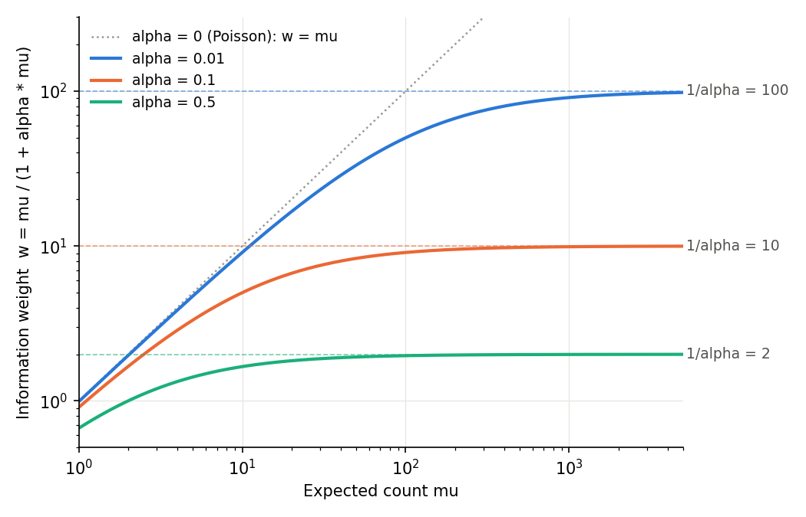

# 04. How do the LFC and SE come out of a model with condition and batch?

In [note 03](03_dispersion_estimation.md) the dispersion α of gene A was set to 0.053147. How, then, do we find how many times starvation changed this gene, and how much that estimate wobbles? With α fixed, fitting a model that writes the log of the mean count as a sum of condition, donor and batch (a GLM) turns a coefficient into the LFC, and the SE comes from the amount of information in that model. In this note I follow the process once by hand and once with DESeq2.

> Study text chapters 4 and 8 · Code: [04_glm_condition_batch.R](../../04_glm_condition_batch.R)

## 1. How many times did starvation change gene A?

Let me bring back gene A from chapter 16 of the study text. A count here is the number of reads assigned to the gene in one sample.

| Condition | sample 1 | sample 2 | sample 3 | Mean |
|---|---|---|---|---|
| Ctrl | 100 | 130 | 90 | 106.667 |
| Starvation | 200 | 250 | 180 | 210 |

The size factor is the multiplier that corrects for sequencing depth differing between samples ([note 02](02_negative_binomial.md)); here it is 1 for all six samples, so the counts can be compared as they are. The ratio of the means is 210 / 106.667 = 1.969, so starvation made it almost 2-fold. Taking log2 of this ratio gives 0.977, the same value as the LFC 0.977280 in section 16.4 of the study text.

But real experiments are not this tidy. The size factors differ between samples, donors or batches are mixed in, and there may be three or more groups. So instead of dividing means directly, DESeq2 fits a model that can be used the same way in every case. That model is the GLM (generalized linear model).

A GLM is a model that writes the mean of the counts on the log scale as a sum of terms such as condition and batch. Because the mean is not used as it is but connected to the terms after taking its log, this is called a log link. DESeq2's GLM adds the assumption that counts follow a negative binomial (NB) distribution. The NB is a count distribution that allows overdispersion, that is, spread between replicates of the same condition larger than the Poisson predicts ([note 02](02_negative_binomial.md)). As a formula:

$$K_{ij}\sim \mathrm{NB}(\mu_{ij},\alpha_i),\qquad \log\mu_{ij}=\log s_j+x_j^{T}b_i$$

- $K_{ij}$ is the count of gene $i$ in sample $j$, and $\mu_{ij}$ is the mean count the model expects in that sample (the expected count).
- $\alpha_i$ is the dispersion of gene $i$, how much more it spreads than the Poisson in variance $=\mu+\alpha\mu^2$, computed in [note 03](03_dispersion_estimation.md).
- $s_j$ is the size factor of sample $j$. $\log s_j$ is added as it is, without a coefficient; such a term is called an offset.
- $x_j$ is a row of numbers recording which group sample $j$ belongs to, that is, one row of the design matrix below.
- $b_i$ is the coefficients of gene $i$ (natural-log units), and $x_j^{T}b_i$ is the sum of each number in $x_j$ times its coefficient. The superscript $T$ (transpose) marks laying a column vector on its side.

Using the log keeps the mean always positive, and a multiplicative difference ("so many times") becomes an addition on the log scale.

### The design matrix: the sample table turned into numbers

The design matrix X is a table that records in numbers which condition, batch or pair each sample belongs to. In R, `model.matrix()` turns a design formula into this table. The code in this note was run with R 4.5.2 and DESeq2 1.50.2, and later code reuses objects made earlier, so run it from the top in order if you follow along.

```r
k  <- c(100, 130, 90, 200, 250, 180)         # gene A. All size factors 1
cd <- data.frame(condition = factor(rep(c("Ctrl", "Starvation"), each = 3),
                                    levels = c("Ctrl", "Starvation")))
X <- model.matrix(~ condition, cd)
t(X[, ])                                     # laid on its side for readability: column = sample
b <- c(b0 = log(mean(k[1:3])), bS = log(mean(k[4:6]) / mean(k[1:3])))
b
b[["bS"]] / log(2)                           # beta_S = log2 fold change
```

```
                    1 2 3 4 5 6
(Intercept)         1 1 1 1 1 1
conditionStarvation 0 0 0 1 1 1
       b0        bS
4.6697087 0.6773988
[1] 0.9772799
```

For readability the table is printed on its side, so each column is a sample. The `(Intercept)` row is 1 in every sample, and the `conditionStarvation` row is 1 only in the Starvation samples (4–6). So in Ctrl $\log\mu = b_0$, in Starvation $\log\mu = b_0 + b_S$, and subtracting the two gives $b_S=\log(\mu_{\mathrm{Starvation}}/\mu_{\mathrm{Ctrl}})$. That is, $b_S$ is "Starvation as a multiple of Ctrl", written as a natural log. The group that serves as the basis of comparison like this (here Ctrl) is called the reference.

But the `log2FoldChange` that DESeq2 reports is in log2 units, not natural log. The log2 fold change (LFC) is the log2 of the ratio of two condition means, so an LFC of 1 is 2-fold, −1 is half, and 0.5 is $2^{0.5}\approx1.414$-fold. To keep the two units from mixing, this note follows the study text and writes coefficients in natural-log units as b and in log2 units as β ($\beta=b/\log 2$). For gene A, $b_0=\log 106.667=4.6697$, $b_S=\log 1.96875=0.6774$ and $\beta_S=0.6774/0.6931=0.9773$.

In the output too, dividing the natural-log coefficient `bS`, 0.6774, by log 2 gave the LFC 0.9773. Reading the natural-log coefficient as the LFC directly is off by a factor of log 2 ≈ 0.693, so be careful. And whether the ratio of the group means can be used as the model's answer here is checked in section 3.

## 2. How do three groups, donors and batches enter the model?

### Three groups as three coefficients

The three conditions of this series are Ctrl, Starvation and Starvation+Glucose. Starvation+Glucose is not ordinary medium with extra glucose but starved cells given glucose again. This note calls it Glucose for short. With Ctrl as the reference, the model is this.

$$\log\mu_j=\log s_j+b_0+b_S\,I(S_j)+b_G\,I(G_j)$$

$I(S_j)$ is 1 if sample $j$ is Starvation and 0 otherwise, and $I(G_j)$ means the same for Glucose. The comparisons of interest are written as combinations of coefficients. A vector that sets which two conditions (or which combination of coefficients) to compare is called a contrast.

| Comparison | In coefficients | contrast $c$ (Intercept, Starvation, Glucose order) |
|---|---|---|
| Starvation vs Ctrl | $\beta_S$ | $(0,1,0)$ |
| Glucose vs Ctrl | $\beta_G$ | $(0,0,1)$ |
| Glucose vs Starvation (rescue) | $\beta_G-\beta_S$ | $(0,-1,1)$ |

The rescue comparison asks "does giving glucose again reverse the starvation effect?" To look at this, there is no need to run Ctrl–Starvation and Starvation–Glucose separately as if they were different datasets. Putting the three groups into one model estimates the dispersions and size factors from all samples together. The SE of the rescue comparison comes up again in section 6.

### `~ pair + condition` if the three conditions came from the same donors

Suppose each of donors A and B gave all three conditions. The basic design is then `~ pair + condition`.

```r
mdp <- data.frame(pair = factor(rep(c("A", "B"), each = 3)),
                  condition = factor(rep(c("Ctrl", "Starvation", "Glucose"), 2),
                                     levels = c("Ctrl", "Starvation", "Glucose")))
rownames(mdp) <- paste(mdp$pair, mdp$condition, sep = "-")
Xp <- model.matrix(~ pair + condition, mdp)
Xp[, ]
cat("rank =", qr(Xp)$rank, " ncol =", ncol(Xp), " n =", nrow(Xp),
    " residual df =", nrow(Xp) - qr(Xp)$rank, "\n")
```

```
             (Intercept) pairB conditionStarvation conditionGlucose
A-Ctrl                 1     0                   0                0
A-Starvation           1     0                   1                0
A-Glucose              1     0                   0                1
B-Ctrl                 1     1                   0                0
B-Starvation           1     1                   1                0
B-Glucose              1     1                   0                1
rank = 4  ncol = 4  n = 6  residual df = 2
```

The `pairB` column absorbs differences between donors, such as "donor B has higher expression to begin with", and the condition columns explain what changed after treatment within the same donor. So the condition coefficients become treatment effects with the donor differences removed.

This model gives each donor a column and estimates its coefficient separately. This approach is called a fixed effect, and it differs from random-effects models, which also learn arbitrary correlations between samples or treatment effects that differ in size from donor to donor. A DESeq2 design is expanded only into fixed-effect columns (Going deeper A).

A pair ID should be attached only when there really is a pairing. Attaching one to independent samples just because they are in the same order forces onto the model a structure that is not in the data. What to do when the dependence structure is complicated, as with technical replicates or repeated measurements, is written up in Going deeper H.

The residual df (residual degrees of freedom) on the last line of the output is the number of samples n minus the number of independent coefficients. The number of independent coefficients is the rank of X, the number of columns of X that carry different information. Replicate spread, that is, the dispersion, is estimated from the information left after all the coefficients are estimated; here 6 − 4 = 2 is left. This matrix also passes both checks of section 4.5 of the study text, `qr(X)$rank == ncol(X)` and `nrow(X) > ncol(X)`.

### What if batch completely overlaps the condition?

This time suppose all Ctrl samples came from batch 1 and all Starvation samples from batch 2.

```r
suppressPackageStartupMessages(library(DESeq2))
mdc <- data.frame(batch = factor(c(1, 1, 1, 2, 2, 2)),
                  condition = factor(rep(c("Ctrl", "Starvation"), each = 3)))
Xc <- model.matrix(~ batch + condition, mdc)
t(Xc[, ])                                    # column = sample
cat("rank =", qr(Xc)$rank, " ncol =", ncol(Xc), "\n")
set.seed(1); cts <- matrix(rpois(20 * 6, 50), nrow = 20)
dds_c <- try(DESeqDataSetFromMatrix(cts, mdc, ~ batch + condition))
```

```
                    1 2 3 4 5 6
(Intercept)         1 1 1 1 1 1
batch2              0 0 0 1 1 1
conditionStarvation 0 0 0 1 1 1
rank = 2  ncol = 3
Error in checkFullRank(modelMatrix) :
  the model matrix is not full rank, so the model cannot be fit as specified.
  One or more variables or interaction terms in the design formula are linear
  combinations of the others and must be removed.

  Please read the vignette section 'Model matrix not full rank':

  vignette('DESeq2')
```

The `batch2` row and the `conditionStarvation` row are identical. X has 3 columns but rank 2. The data contain no information that can tell whether the difference is due to batch or to starvation. Writing `~ batch + condition` does not change this, so DESeq2 stops right at the step of building the dataset object. It is not a problem to solve with an option; the information is missing from the experimental design.

There is also the opposite extreme. If the number of samples equals the number of coefficients (n = p, a saturated design), the rank is full but the residual df is 0. No information is left for seeing spread between replicates, so this time it stops at the dispersion estimation step (Going deeper A).

To borrow the summary of chapter 4 of the study text, the design decides what to explain and what to leave. It is not just a comparison of means split by condition; it fits the coefficients of the same design formula to all samples.

## 3. How does DESeq2 find the coefficients?

### Why fit the coefficients again after the dispersion is found?

The means used when computing the gene-wise dispersion in [note 03](03_dispersion_estimation.md) were provisional values obtained with an initial α. After that, the final α was set by taking into account the tendencies of all genes (the trend and the prior). This value is the MAP, the most plausible value when the likelihood and the prior are considered together. Gene A's final α is 0.053147, obtained with the prior N(log 0.08, 0.7²) that the study text sets for teaching. When α changes, each sample's weight changes and the coefficients and SE change with it, so the coefficients b are found again with the final α fixed.

Whether a prior is also put on the LFC at this step is decided by the `betaPrior` option, whose default is `FALSE`. So with the default settings no prior shrinkage enters the LFC at this step. Shrinkage is pulling estimates that carry little information toward the overall tendency, and LFC shrinkage is covered separately in [note 07](07_lfc_shrinkage_and_qc.md).

A few very small devices that stabilize the calculation do remain, though. The one this note sees in numbers is the ridge, a term that penalizes coefficients a little as they move away from 0. DESeq2's ridge is very weak ($\lambda=10^{-6}$); for gene A it changes the LFC in the seventh decimal place and the SE in the eighth (Going deeper A, D).

### Which b is most plausible?

The likelihood, with the observations held fixed, says how plausible a candidate parameter makes those observations ([note 03](03_dispersion_estimation.md)). With α fixed, the b that makes the likelihood largest is the MLE of the coefficients. The MLE lies where the slope of the log likelihood with respect to b is 0, and this slope is called the score.

$$U(b)=\sum_j x_j\,\frac{K_j-\mu_j}{1+\alpha\mu_j}$$

$K_j-\mu_j$ is the difference between the observed count and the count the model expects. The denominator $1+\alpha\mu_j$ sets how surprising that difference is; with a large α the same difference is less surprising. The $x_j$ in front decides which coefficient the difference feeds into.

If the observation is larger than expected the score is positive and pushes b toward raising the mean; if smaller, toward lowering it. For example, plugging the starting value of the iteration below into gene A gives a score of 0.47 in the direction of the Starvation coefficient. It is not yet 0, so b has to move further.

This is the same principle as setting the derivative to 0 when computing a simple mean. But because of the log link and the NB variance, this equation generally cannot be solved in one step, so it is solved iteratively.

<details>
<summary>Where does the score formula come from?</summary>

The log likelihood is $\ell(b)=\sum_j\log \mathrm{NB}(K_j;\mu_j,\alpha)$. Differentiating the log probability of the NB with respect to $\mu_j$ gives $\partial\ell/\partial\mu_j=(K_j-\mu_j)/(\mu_j(1+\alpha\mu_j))$, and under the log link $\mu_j=e^{x_j^{T}b}$ (offset omitted), so $\partial\mu_j/\partial b=\mu_j x_j$. Multiplying the two cancels $\mu_j$ and gives $U(b)=\sum_j x_j(K_j-\mu_j)/(1+\alpha\mu_j)$, and at the MLE $U(\hat b)=0$.

</details>

### IRLS: least squares repeated with updated weights

IRLS (iteratively reweighted least squares) is the iterative calculation that finds the coefficients. One iteration from the current estimate $b^{(t)}$ goes like this.

$$\eta_j=\log s_j+x_j^{T}b^{(t)},\qquad \mu_j=e^{\eta_j}$$

$$z_j=\eta_j+\frac{K_j-\mu_j}{\mu_j},\qquad w_j=\frac{\mu_j}{1+\alpha\mu_j}$$

$$b^{(t+1)}=\left(X^{T}WX\right)^{-1}X^{T}W\,(z-o)$$

- $\eta_j$ is the log expected count computed with the current coefficients.
- $z_j$ is called the working response; it is $\log K_j$ approximated by a straight line around the current $\mu_j$.
- $w_j$ is the weight of sample $j$, the amount of information this sample gives the coefficients. It is $(d\mu/d\eta)^2/\mathrm{Var}(K)=\mu^2/(\mu+\alpha\mu^2)$ simplified.
- $W$ is the matrix with $w_j$ on its diagonal, and $o$ is the vector of offsets $\log s_j$.
- The last formula is the solution of fitting $z-o$ to X by weighted least squares. Weighted least squares multiplies each sample's squared error by $w_j$, a least squares that trusts samples with more information more.

In words, one iteration is "compute the expected counts with the current coefficients → compute the weights and the working response → update the coefficients by weighted least squares". It stops when b no longer changes ($b^{(t+1)}=b^{(t)}$), and at that point $X^{T}W(z-\eta)=U(b)=0$, that is, the score is 0. DESeq2 decides when to stop from the relative change in the deviance (Going deeper B).

Let me plug α = 0.053147 into gene A and iterate by hand. As in DESeq2, the starting value is the least-squares solution for log(count + 0.1).

```r
alpha <- 0.053147                            # final α from note 03 (MAP)
o <- log(rep(1, 6))                          # offset = log(size factor) = 0
b <- qr.solve(X, log(k + 0.1))               # start: least-squares solution for log(count + 0.1)
for (t in 0:3) {
  eta <- as.numeric(o + X %*% b); mu <- exp(eta)
  U <- crossprod(X, (k - mu) / (1 + alpha * mu))            # score
  cat(sprintf("iter %d  b_S = %.9f  beta_S = %.9f  score_S = %9.2e\n",
              t, b[2], b[2] / log(2), U[2]))
  z <- eta + (k - mu) / mu                   # working response
  w <- mu / (1 + alpha * mu)                 # weight
  b <- as.numeric(solve(crossprod(X, X * w), crossprod(X, w * (z - o))))
}
exp(b)                                       # Ctrl mean, Starvation/Ctrl ratio
```

```
iter 0  b_S = 0.679599032  beta_S = 0.980454153  score_S =  4.70e-01
iter 1  b_S = 0.677376390  beta_S = 0.977247559  score_S = -2.13e-03
iter 2  b_S = 0.677398822  beta_S = 0.977279922  score_S = -4.36e-08
iter 3  b_S = 0.677398824  beta_S = 0.977279923  score_S =  1.41e-14
[1] 106.66667   1.96875
```

Running it, the score gets closer to 0 with each iteration and reaches the $10^{-14}$ level on the fourth line (iter 3), and β_S stops at 0.977279923. exp(b) on the last line is 106.667 and 1.96875 (= 210 / 106.667). With two groups and all size factors equal, the MLE means equal the arithmetic group means (section 16.1 of the study text). That is why this gives the same answer as the simple calculation of section 1.

### What if DESeq2 does the same job?

I fix the same α with `dispersions()` and run only DESeq2's Wald step (`nbinomWaldTest()`). This function fits the coefficients and produces the SE and the Wald test results. The Wald test compares (estimate − 0) / SE with the standard normal distribution.

```r
cts1 <- matrix(as.integer(k), nrow = 1, dimnames = list("geneA", paste0("s", 1:6)))
dds <- DESeqDataSetFromMatrix(cts1, cd, ~ condition)
sizeFactors(dds) <- rep(1, 6)
dispersions(dds) <- alpha                    # skip dispersion estimation and fix α
dds <- nbinomWaldTest(dds, quiet = TRUE)
res <- results(dds, independentFiltering = FALSE, cooksCutoff = FALSE)
print(as.data.frame(res)[, c("log2FoldChange", "lfcSE", "stat", "pvalue")], digits = 9)
cat("betaIter =", mcols(dds)$betaIter, "\n")
```

```
      log2FoldChange       lfcSE       stat         pvalue
geneA    0.977280132 0.289056569 3.38093037 0.000722408466
betaIter = 2
```

The LFC 0.977280 and lfcSE 0.289057 come out exactly as the numbers in section 16.4 of the study text. They differ from the hand-computed β_S, 0.977279923, by $2.1\times10^{-7}$, because of the very weak ridge mentioned earlier (Going deeper D). `betaIter` being 2 means DESeq2 iterated twice and stopped; `stat` and `pvalue` are covered in [note 05](05_wald_vs_lrt.md).

## 4. Where does the SE come from, and why does it grow with α?

The SE (standard error) says how much an estimate would move if the same experiment were repeated. Let me trace where gene A's lfcSE of 0.289 comes from.

### Information gathered from the weights

The weights $w_j$ used in IRLS are the raw material of the SE as they are. The information each sample gives, gathered according to the design, is the Fisher information.

$$I(b)=X^{T}WX,\qquad \widehat{\mathrm{Cov}}(\hat b)\approx\left(X^{T}WX\right)^{-1}$$

The Fisher information $I(b)$ measures how sharp the peak of the likelihood is along the coefficient directions. The sharper it is, the less the estimate wobbles. $(\cdot)^{-1}$ is the inverse matrix; for a single number it corresponds to $1/x$, meaning that more information gives a smaller variance. The resulting $\widehat{\mathrm{Cov}}(\hat b)$ is the covariance matrix of the coefficient estimates: the diagonal holds the variance of each coefficient, and the off-diagonal entries how much two coefficients wobble together (the covariance).

The SE is the square root of a diagonal value, divided by log 2 to convert to log2 units. For a two-group design the inverse can be worked out by hand.

$$\mathrm{Var}(\hat b_S)=\frac{1}{\sum_{j\in \mathrm{Ctrl}}w_j}+\frac{1}{\sum_{j\in \mathrm{Starvation}}w_j}$$

The first term is how much the log of the Ctrl mean wobbles, and the second how much the log of the Starvation mean wobbles. $b_S$ is the difference of the two log means, so the two wobbles add, and the larger a group's total weight, the smaller its term.

Let me plug in gene A. The weight of one Ctrl sample is $106.667/(1+0.053147\times106.667)=15.99$, and of one Starvation sample $210/(1+0.053147\times210)=17.27$. Summed per group, they are 47.98 and 51.81.

$$\mathrm{Var}(\hat b_S)=\frac{1}{47.98}+\frac{1}{51.81}=0.040144,\qquad SE(\hat\beta_S)=\frac{\sqrt{0.040144}}{\log 2}=\frac{0.200359}{0.693147}=0.289057$$

```r
mu <- exp(as.numeric(o + X %*% b))           # converged expected counts
w  <- mu / (1 + alpha * mu)
round(w, 4)
XtWX <- crossprod(X, X * w)                  # Fisher information  X^T W X
V <- solve(XtWX)                             # inverse = approximate covariance of the coefficients (natural log)
V
sqrt(diag(V)) / log(2)                       # SE (log2 units)
1 / sum(w[1:3]) + 1 / sum(w[4:6])            # Var(b_S) from the per-group weight sums
```

```
[1] 15.9944 15.9944 15.9944 17.2685 17.2685 17.2685
                    (Intercept) conditionStarvation
(Intercept)          0.02084067         -0.02084067
conditionStarvation -0.02084067          0.04014363
        (Intercept) conditionStarvation
          0.2082717           0.2890566
[1] 0.04014363
```

The bottom-right value of the covariance matrix, 0.04014363, matches the hand calculation, and its square root divided by log 2, 0.2890566, is exactly the study text's SE of 0.289057.

### What happens to the SE if only α changes?

I keep the means (106.667, 210) and the design and change only α. I plug in the three candidates computed in [note 03](03_dispersion_estimation.md) (sections 16.2–16.3 of the study text), the plain NB MLE 0.014786, the Cox-Reid adjusted 0.025385 and the MAP 0.053147, and for comparison also 0, 0.1 and 0.5. The Cox-Reid adjusted value is the one with the underestimation from estimating the means from the same data reduced.

```r
mu_fix <- rep(c(320 / 3, 210), each = 3); bS <- log(210 / (320 / 3))
tab <- t(sapply(c(0, 0.014786, 0.025385, 0.053147, 0.1, 0.5), function(a) {
  w <- mu_fix / (1 + a * mu_fix); V <- solve(crossprod(X, X * w))
  c(alpha = a, w_Ctrl = w[1], w_Starvation = w[4], LFC = bS / log(2),
    SE_log2 = sqrt(V[2, 2]) / log(2), Z = bS / sqrt(V[2, 2]))
}))
round(tab, 6)
```

```
        alpha     w_Ctrl w_Starvation     LFC  SE_log2        Z
[1,] 0.000000 106.666667   210.000000 0.97728 0.099036 9.867972
[2,] 0.014786  41.389015    51.156378 0.97728 0.174140 5.612032
[3,] 0.025385  28.768700    33.170901 0.97728 0.212207 4.605318
[4,] 0.053147  15.994370    17.268501 0.97728 0.289057 3.380929
[5,] 0.100000   9.142857     9.545455 0.97728 0.385443 2.535475
[6,] 0.500000   1.963190     1.981132 0.97728 0.838807 1.165083
```

The `LFC` column stays put while only the `SE_log2` column grows. At α = 0 (Poisson) the SE is 0.099, but going MLE → Cox-Reid → MAP it grows 0.174 → 0.212 → 0.289, and Z shrinks 5.61 → 4.61 → 3.38. This is how the way the dispersion was estimated in note 03 enters the test result. With the means and the design fixed, the chain runs in one direction.

α up → $w_j$ down → information down → coefficient variance up → SE up

That the `LFC` column is constant is natural, since the code fixed the means. Fixing the means is legitimate in this example because with two groups and all size factors equal, the MLE means are the arithmetic group means for any α. In general that is not so. Changing the size factors to differ between samples makes the LFC move too, from 0.965 to 0.946, as α goes from 0.0148 to 0.5 (Going deeper E). In real data, a change in α can change the LFC and SE together.

### Four kinds of "spread" with similar names (summary of chapter 8 of the study text)

| Quantity | Formula | Variation of what |
|---|---|---|
| variance of the count | $\mathrm{Var}(K_{ij})=\mu_{ij}+\alpha_i\mu_{ij}^2$ | How much one sample's count scatters around its mean |
| dispersion | $\alpha_i$ | Size of the biological variation beyond the Poisson (a per-gene value) |
| estimated variance of a coefficient | $\mathrm{Var}(\hat b_k)\approx[(X^{T}WX)^{-1}]_{kk}$ | How much $\hat b_k$ scatters when the experiment is repeated (natural log) |
| SE of a log2 coefficient | $SE(\hat\beta_k)=\sqrt{\mathrm{Var}(\hat b_k)}/\log 2$ | `lfcSE` of `results()` |

The final α changes the curvature of the likelihood and the amount of information, so the Wald test result changes with it.

## 5. Does the SE keep shrinking with deeper sequencing?

At first I too thought the SE would keep shrinking the deeper you read. Let me compute with a gene with α = 0.1. With an expected count of 100, the weight of one sample is 100 / (1 + 10) = 9.09. Even if the same sample is read 50 times deeper so that the expected count becomes 5000, the weight is 9.98; it cannot exceed 10.

$$w=\frac{\mu}{1+\alpha\mu}<\frac{1}{\alpha}\quad(\alpha>0),\qquad \lim_{\mu\to\infty}\frac{\mu}{1+\alpha\mu}=\frac{1}{\alpha}$$

When μ is small, αμ in the denominator is much smaller than 1, so w ≈ μ. In this range the information grows almost in proportion to how deeply you read. But as μ grows, αμ takes over the denominator and w sticks to 1/α, because the biological variation (α) does not shrink with deeper reading.



A redrawing of figure 2 of the study text. The dotted line (Poisson, α = 0) keeps climbing with μ, but the three curves with positive α flatten out at their own 1/α (thin dashed lines).

<details>
<summary>Code for the figure</summary>

```python
# run from the notes/ folder. The figure is saved to ../figures/.
import numpy as np
import matplotlib
matplotlib.use("Agg")
import matplotlib.pyplot as plt

out = "../figures/04_information_weight.png"
mu = np.logspace(0, np.log10(5000), 400)
alphas = [(0.01, "#2a78d6"), (0.1, "#eb6834"), (0.5, "#1baf7a")]

fig, ax = plt.subplots(figsize=(7, 4.5), dpi=150, facecolor="white")
ax.plot(mu, mu, color="#9a9994", lw=1.2, ls=":", label="alpha = 0 (Poisson): w = mu")
for a, col in alphas:
    ax.plot(mu, mu / (1 + a * mu), color=col, lw=2, label=f"alpha = {a}")
    ax.axhline(1 / a, color=col, lw=0.8, ls="--", alpha=0.6)
    ax.text(5200, 1 / a, f"1/alpha = {1 / a:g}", va="center", ha="left", fontsize=9, color="#52514e")
ax.set_xscale("log"); ax.set_yscale("log")
ax.set_xlim(1, 5000); ax.set_ylim(0.5, 300)
ax.set_xlabel("Expected count mu")
ax.set_ylabel("Information weight  w = mu / (1 + alpha * mu)")
ax.grid(True, which="major", color="#e6e5e0", lw=0.6)
for s in ("top", "right"):
    ax.spines[s].set_visible(False)
ax.legend(loc="upper left", frameon=False, fontsize=9)
fig.tight_layout()
fig.savefig(out, dpi=150, facecolor="white")
print("saved", out, plt.imread(out).shape)
```

```
saved ../figures/04_information_weight.png (675, 1050, 4)
```

</details>

What, then, should be done to increase the information? The variance of a group's log mean is the reciprocal of that group's total weight ($1/\sum_j w_j$). With 3 samples at α = 0.1 and an expected count of 100, the total weight is 27.3. Reading the same samples twice as deeply makes it 28.6, about 5% more, but doubling the replicates makes it 54.5, double. When there is biological dispersion, adding independent replicates enlarges $\sum_j w_j$ more than reading one sample more deeply. This is a property of the formula, though, not a formula for the optimal depth of a particular experiment.

<details>
<summary>Checking the figure's values and the depth vs replicate comparison in numbers</summary>

```r
alpha_grid <- c(0.01, 0.1, 0.5); mu_grid <- c(1, 3, 10, 30, 100, 300, 1000, 5000)
tab <- outer(mu_grid, alpha_grid, function(m, a) m / (1 + a * m))
dimnames(tab) <- list(paste0("mu=", mu_grid), paste0("alpha=", alpha_grid))
round(rbind(tab, `limit 1/alpha` = 1 / alpha_grid), 3)
```

```
              alpha=0.01 alpha=0.1 alpha=0.5
mu=1               0.990     0.909     0.667
mu=3               2.913     2.308     1.200
mu=10              9.091     5.000     1.667
mu=30             23.077     7.500     1.875
mu=100            50.000     9.091     1.961
mu=300            75.000     9.677     1.987
mu=1000           90.909     9.901     1.996
mu=5000           98.039     9.980     1.999
limit 1/alpha    100.000    10.000     2.000
```

In the α = 0.1 column, μ = 100 is already 91% of the upper limit 10 (9.091), and increasing μ 50-fold gives 9.980.

```r
a <- 0.1                                     # total weight of 3 samples in one group (larger = smaller SE)
c(now           = 3 * 100 / (1 + a * 100),   # now: expected count 100
  depth_x2      = 3 * 200 / (1 + a * 200),   # the same samples read twice as deep
  replicates_x2 = 6 * 100 / (1 + a * 100))   # twice the replicates
```

```
          now      depth_x2 replicates_x2
     27.27273      28.57143      54.54545
```

</details>

## 6. How is the SE of the rescue comparison (Glucose − Starvation) found?

### What if the two SEs are just combined?

This time a three-group example is needed. DESeq2's `makeExampleDESeqDataSet()` makes only two groups, so I made simulated data with 2000 genes and 9 samples and overwrote condition with three groups, Ctrl / Starvation / Glucose (3 each). Then `DESeq()` computed the size factors, dispersions, coefficients and SEs in one go. gene4 below is one gene of this simulated data.

```r
set.seed(1)
dds3 <- makeExampleDESeqDataSet(n = 2000, m = 9, betaSD = 1)
dds3$condition <- factor(rep(c("Ctrl", "Starvation", "Glucose"), each = 3),
                         levels = c("Ctrl", "Starvation", "Glucose"))
design(dds3) <- ~ condition
dds3 <- DESeq(dds3, quiet = TRUE)
rS  <- results(dds3, name = "condition_Starvation_vs_Ctrl")
rG  <- results(dds3, name = "condition_Glucose_vs_Ctrl")
rGS <- results(dds3, contrast = c("condition", "Glucose", "Starvation"))
g <- "gene4"; se_S <- rS[g, "lfcSE"]; se_G <- rG[g, "lfcSE"]
round(c(SE_S = se_S, SE_G = se_G, SE_GvsS_results = rGS[g, "lfcSE"],
        naive_sum = se_S + se_G, naive_sqrt = sqrt(se_S^2 + se_G^2)), 4)
```

```
           SE_S            SE_G SE_GvsS_results       naive_sum      naive_sqrt
         0.5419          0.5419          0.5415          1.0838          0.7664
```

For gene4, the SE of Starvation vs Ctrl and the SE of Glucose vs Ctrl are both 0.5419. The common ways of guessing the SE of the difference from two SEs are adding them (`naive_sum`, 1.084) and taking the square root of the sum of squares (`naive_sqrt`, 0.766). Honestly, at first I too thought the square root of the sum of squares would do. But the answer from `results(contrast = c("condition", "Glucose", "Starvation"))` is 0.5415. Both methods are wrong.

### The missing piece is the covariance

The estimate and SE of a comparison written as a contrast are found like this.

$$\hat\delta=c^{T}\hat b,\qquad SE(\hat\delta)=\sqrt{c^{T}\,\widehat{\mathrm{Cov}}(\hat b)\,c}$$

Plugging in $c=(0,-1,1)$ and expanding gives this.

$$\mathrm{Var}(\hat b_G-\hat b_S)=\mathrm{Var}(\hat b_G)+\mathrm{Var}(\hat b_S)-2\,\mathrm{Cov}(\hat b_G,\hat b_S)$$

The covariance is how much two estimates wobble together in the same direction. The square root of the sum of squares is right only when the covariance is 0, and the sum is an upper limit reached only when the correlation of the two estimates is −1.

Why the covariance is positive here is simple. $\hat\beta_S$ and $\hat\beta_G$ are both "that group − Ctrl", so both subtract the same estimate of the Ctrl mean. If the Ctrl estimate happens to come out high, both coefficients go down together, and taking their difference cancels this shared wobble. With a single factor, as in `~ condition`, this covariance is exactly the variance of the intercept.

$$\mathrm{Cov}(\hat b_G,\hat b_S)=\mathrm{Var}(\hat b_0)=\frac{1}{\sum_{j\in\mathrm{Ctrl}}w_j}\quad\Rightarrow\quad \mathrm{Var}(\hat b_G-\hat b_S)=\frac{1}{\sum_{j\in\mathrm{Glucose}}w_j}+\frac{1}{\sum_{j\in\mathrm{Starvation}}w_j}$$

The Ctrl term drops out. Let me check by computing gene4's covariance matrix directly. When converting to log2 units, the covariance is divided by $(\log 2)^2$.

```r
X3 <- attr(dds3, "modelMatrix")
mu <- assays(dds3)[["mu"]][g, ]
w  <- mu / (1 + dispersions(dds3)[rownames(dds3) == g] * mu)
V3 <- solve(crossprod(X3, X3 * w)) / log(2)^2        # covariance matrix in log2 units
cc <- c(0, -1, 1)                                    # Glucose - Starvation
c(Var_S = V3[2, 2], Var_G = V3[3, 3], Cov_GS = V3[2, 3], Var_b0 = V3[1, 1],
  SE_contrast = sqrt(drop(t(cc) %*% V3 %*% cc)))
```

```
      Var_S       Var_G      Cov_GS      Var_b0 SE_contrast
  0.2937042   0.2936522   0.1470652   0.1470652   0.5415034
```

`Cov_GS` and `Var_b0` come out identical, 0.1470652. Plugging in gives $\sqrt{0.2937+0.2937-2\times0.1471}=0.5415$, and the directly computed 0.5415034 differs from the lfcSE 0.5415033 of `results()` only by the ridge's share.

So `results(contrast = ...)` does not just subtract the two stored LFCs. It subtracts the LFCs, but it recomputes the SE as $c^{T}\widehat{\mathrm{Cov}}(\hat b)\,c$ (Going deeper C). All three notations, `c("condition", "Glucose", "Starvation")`, `list(...)` and `c(0, -1, 1)`, give the same LFC and SE (Going deeper F).

Note that "covariance = variance of the intercept > 0" is a property of two levels of the same factor sharing the same reference. With another factor, as in `~ pair + condition`, this equality does not hold (covariance 0.01, intercept variance 0.0133), and the covariance between coefficients of different factors can even be negative. Both cases can be seen in numbers in Problem 12.

And the rescue SE formula is the same as the formula for comparing only the two groups Starvation and Glucose with the same weights. So the $-2\,\mathrm{Cov}$ term is the way to read the rescue SE correctly from Ctrl-referenced coefficients, not an advantage that one model brings. The advantage of one model lies in the joint estimation of the dispersions and size factors mentioned in section 2 (Going deeper H).

## Summary

- DESeq2's GLM writes the log of the mean count as the sum of an offset (log size factor) and the columns of the design matrix. `log2FoldChange` is β, the natural-log coefficient b divided by log 2.
- Three groups, donors and batches all enter as columns of the design matrix. `~ pair + condition` puts donors in as fixed effects and simply adds donor effects and treatment effects on the log scale. If batch completely overlaps the condition, or if the number of samples equals the number of coefficients, no option can fix it.
- The coefficients are found by IRLS with the final α fixed, and the SE comes from the inverse of the information $X^{T}WX$ built from the weights $w=\mu/(1+\alpha\mu)$. Gene A reaches LFC 0.977280 and SE 0.289057 in two iterations.
- With the means and design fixed, the larger α, the larger the SE. For gene A, plugging in the MLE, Cox-Reid and MAP α in turn gave 0.174, 0.212 and 0.289. Moreover, the weight of one observation cannot exceed 1/α, so once the expected count is already near 1/α, adding replicates increases the information far more than reading deeper (at α = 0.1, μ = 100, 2 times the depth adds about 5%, 2 times the replicates gives 2 times the information).
- The SE of a difference of coefficients needs the covariance, and `results(contrast=)` computes it. The rescue SE of gene4 is 0.5415, not 0.766 or 1.084.

## Exercises

These are the problems of appendix A of the study text, translated.

**Problem 5.** In a 3-group model with Ctrl as the reference, $\beta_S=-1.2,\ \beta_G=-0.3$. What are the log2FC of Glucose−Starvation and the log2FC of Glucose−Ctrl?

<details>
<summary>Solution</summary>

```r
cat("Glucose-Starvation =", -0.3 - (-1.2), " Glucose-Ctrl =", -0.3, " fold =", 2^(-0.3 - (-1.2)), 2^(-0.3), "\n")
```

```
Glucose-Starvation = 0.9  Glucose-Ctrl = -0.3  fold = 1.866066 0.8122524
```

Glucose−Starvation has $c=(0,-1,1)$, so $\beta_G-\beta_S=-0.3-(-1.2)=0.9$, about 1.87-fold. Glucose−Ctrl is $\beta_G=-0.3$ as it is, about 0.81-fold. Even with a positive rescue comparison, the Glucose group is still a little below Ctrl. The same as the study text's answer (0.9, −0.3).

</details>

**Problem 11.** At the same expected count μ=100, α rose from 0.01 to 0.1. Compute the information weight for each and explain the direction of the effect on the SE.

<details>
<summary>Solution</summary>

```r
cat("w:", 100 / (1 + 0.01 * 100), 100 / (1 + 0.1 * 100), " ratio =", (100 / 2) / (100 / 11), " SE ratio =", sqrt((100 / 2) / (100 / 11)), "\n")
```

```
w: 50 9.090909  ratio = 5.5  SE ratio = 2.345208
```

The weight falls 5.5-fold, from $100/(1+1)=50$ to $100/(1+10)\approx9.09$. With the means and design fixed and the same μ in every sample, $\mathrm{Var}(\hat b)\propto1/w$, so the SE grows by $\sqrt{5.5}\approx2.35$ times. The same as the study text's answer (50, 9.09, SE increases), and the table in section 4 shows the same thing for gene A.

</details>

**Problem 12.** If two coefficients have SEs of 0.3 and 0.4, is the SE of their difference always 0.5?

<details>
<summary>Solution</summary>

This continues with `Xp` (the paired design matrix) from section 2.

```r
cat("sum =", 0.3 + 0.4, " sqrt sum sq =", sqrt(0.3^2 + 0.4^2), " Cov=+0.05 ->", sqrt(0.09 + 0.16 - 0.1), " Cov=-0.05 ->", sqrt(0.09 + 0.16 + 0.1), "\n")
cat("SE(diff) at rho = -1, 0, +1:", sqrt(0.25 + 0.24), sqrt(0.25), sqrt(0.25 - 0.24), "\n")
Xb <- model.matrix(~ batch + cond, data.frame(batch = factor(c(1, 1, 1, 2, 2, 2)), cond = factor(c("C", "C", "S", "C", "S", "S"))))
V <- solve(crossprod(Xb) * 50); cat("~batch+cond, w = 50: Cov(batch2, condS) =", V[2, 3], " cor =", V[2, 3] / sqrt(V[2, 2] * V[3, 3]), "\n")
V <- solve(crossprod(Xp) * 50); cat("~pair+condition, w = 50: Cov(Starvation, Glucose) =", V[3, 4], " Var(Intercept) =", V[1, 1], "\n")
```

```
sum = 0.7  sqrt sum sq = 0.5  Cov=+0.05 -> 0.3872983  Cov=-0.05 -> 0.591608
SE(diff) at rho = -1, 0, +1: 0.7 0.5 0.1
~batch+cond, w = 50: Cov(batch2, condS) = -0.005  cor = -0.3333333
~pair+condition, w = 50: Cov(Starvation, Glucose) = 0.01  Var(Intercept) = 0.01333333
```

No. $\sqrt{0.3^2+0.4^2}=0.5$ is right only when the covariance is 0. In general it is $\sqrt{0.09+0.16-2\,\mathrm{Cov}}$, and as the correlation $\rho$ moves between −1 and 1 it can range from 0.7 to 0.1.

- With a single factor, `~ condition`, the coefficients of two levels sharing the same reference (Ctrl) have $\mathrm{Cov}=\mathrm{Var}(\hat b_0)>0$. The rescue comparison is this case, so it comes out below 0.5 (gene4 in section 6: 0.5419, 0.5419 → 0.5415).
- But this is not a property of treatment coding (coefficients expressed relative to a reference) as a whole. In the `~ batch + cond` example above, the covariance between the batch coefficient and the condition coefficient is negative (correlation −1/3), so the SE of the difference is larger than $\sqrt{SE_1^2+SE_2^2}$.
- With `~ pair + condition`, the covariance of the two condition coefficients (0.01) differs from the variance of the intercept (0.0133).

The same as the study text's answer ("0.5 only when the covariance is 0; in general the $-2\,\mathrm{Cov}$ term is needed").

</details>

## Going deeper

<details>
<summary>A. The design, defaults and convergence handling seen in the DESeq2 source</summary>

First, the part where the design becomes a model matrix. I copied the beginning of `Rscript -e 'print(DESeq2:::fitNbinomGLMs)'`.

```r
# excerpt (not run): beginning of print(DESeq2:::fitNbinomGLMs)
    if (is.null(modelMatrix)) {
        modelAsFormula <- TRUE
        modelMatrix <- stats::model.matrix.default(modelFormula,
            data = as.data.frame(colData(object)))
    }
    ...
    if (renameCols) {
        convertNames <- renameModelMatrixColumns(colData(object), modelFormula)
```

- `DESeq2:::renameModelMatrixColumns` renames `conditionStarvation` to `condition_Starvation_vs_Ctrl` (`paste0(v, "_", levels[-1], "_vs_", levels[1])`). The column name "Starvation" in the table of section 4.2 of the study text is a shortened form of this name.
- The rank is checked by `DESeq2:::checkFullRank`. If `qr(modelMatrix)$rank < ncol(modelMatrix)`, it stops at the constructor step, and if n = p, `DESeq2:::checkForExperimentalReplicates` sees `nrow(modelMatrix) == ncol(modelMatrix)` and stops at the dispersion step.
- The design is expanded via `stats::model.matrix.default` into fixed-effect columns only, and `DESeq()` has no argument that takes a random effect.
- In section 2 I ran the paired matrix of section 4.4 of the study text and the confounded example of 4.5 as they are. The paired matrix matches the table of section 4.4 column by column.

The code below checks the rank with three groups of 2 replicates, the two checks of section 4.5 of the study text, the arguments of `DESeq()`, the error of a saturated design, and the defaults this note quotes. It continues with `Xp`, `cts`, `dds` and `res` from sections 2–3.

```r
X3g <- model.matrix(~ condition, data.frame(condition = factor(rep(c("Ctrl", "Starvation", "Glucose"), each = 2))))
cat("~condition, 3 groups x 2: rank =", qr(X3g)$rank, " residual df =", nrow(X3g) - qr(X3g)$rank, "\n")
stopifnot(qr(Xp)$rank == ncol(Xp), nrow(Xp) > ncol(Xp))    # the two checks of study text 4.5 (Xp from section 2)
print(names(formals(DESeq)))
mds <- data.frame(condition = factor(c("A", "B", "C")))    # saturated design with n = p = 3
try(DESeq(DESeqDataSetFromMatrix(cts[, 1:3], mds, ~ condition), quiet = TRUE))
grep("missing(betaPrior)", deparse(body(DESeq)), fixed = TRUE, value = TRUE)
cat("betaPrior default (nbinomWaldTest):", formals(nbinomWaldTest)$betaPrior, "\n")
print(formals(DESeq)$minmu)
cat("minmu default (nbinomWaldTest, results):", formals(nbinomWaldTest)$minmu, formals(results)$minmu, "\n")
cat("log2(exp(1)) == 1/log(2):", isTRUE(all.equal(log2(exp(1)), 1 / log(2))), "\n")
cat("gene A: betaPriorVar =", attr(dds, "betaPriorVar"), "| LFC description:", mcols(res)$description[2], "\n")
```

```
~condition, 3 groups x 2: rank = 3  residual df = 3
 [1] "object"                  "test"
 [3] "fitType"                 "sfType"
 [5] "betaPrior"               "full"
 [7] "reduced"                 "quiet"
 [9] "minReplicatesForReplace" "modelMatrixType"
[11] "useT"                    "minmu"
[13] "parallel"                "BPPARAM"
Error in checkForExperimentalReplicates(object, modelMatrix) :

  The design matrix has the same number of samples and coefficients to fit,
  so estimation of dispersion is not possible. Treating samples
  as replicates was deprecated in v1.20 and no longer supported since v1.22.


[1] "    if (missing(betaPrior)) {"
betaPrior default (nbinomWaldTest): FALSE
if (fitType == "glmGamPoi") 1e-06 else 0.5
minmu default (nbinomWaldTest, results): 0.5 0.5
log2(exp(1)) == 1/log(2): TRUE
gene A: betaPriorVar = 1e+06 1e+06 | LFC description: log2 fold change (MLE): condition Starvation vs Ctrl
```

Three groups with 2 replicates (`~ condition`, n = 6) have rank 3 and residual df 3, and the paired matrix passed both `stopifnot` checks silently.

Next, an excerpt of `fitNbinomGLMs`, which contains the final α, the log2 conversion, betaPrior, the ridge and the convergence handling.

```r
# excerpt (not run): DESeq2:::fitNbinomGLMs
    if (missing(alpha_hat)) { alpha_hat <- dispersions(object) }
    if (missing(lambda)) { lambda <- rep(1e-06, ncol(modelMatrix)) }
    ...
    justIntercept <- if (modelAsFormula) { modelFormula == formula(~1) } else { ncol(modelMatrix) == 1 & all(modelMatrix == 1) }
    if (justIntercept & all(lambda <= 1e-06)) {
        betaIter <- rep(1, nrow(object))
        betaMatrix <- ... matrix(log2(MatrixGenerics::rowMeans(counts(object, normalized = TRUE))), ncol = 1)
        ...
        xtwx <- MatrixGenerics::rowSums(w); sigma <- xtwx^-1
        ...
        return(res)
    }
    ...
    lambdaNatLogScale <- lambda/log(2)^2
    betaRes <- fitBetaWrapper(ySEXP = counts(object), xSEXP = modelMatrix,
        nfSEXP = normalizationFactors, alpha_hatSEXP = alpha_hat,
        beta_matSEXP = beta_mat, lambdaSEXP = lambdaNatLogScale, ...,
        tolSEXP = betaTol, maxitSEXP = maxit, useQRSEXP = useQR, minmuSEXP = minmu)
    ...
    betaConv <- betaRes$iter < maxit
    betaMatrix <- log2(exp(1)) * betaRes$beta_mat
    betaSE <- log2(exp(1)) * sqrt(pmax(betaRes$beta_var_mat, 0))
    rowsForOptim <- if (useOptim) { which(!betaConv | !rowStable | !rowVarPositive) } else { which(!rowStable | !rowVarPositive) }
    if (forceOptim) { rowsForOptim <- seq_along(betaConv) }
    if (length(rowsForOptim) > 0) { resOptim <- fitNbinomGLMsOptim(...) }
```

- The default of `alpha_hat` is `dispersions(object)`, the final α of [note 03](03_dispersion_estimation.md).
- The IRLS starting value is `y <- t(log(counts(object, normalized = TRUE) + 0.1)); beta_mat <- t(solve(R, t(Q) %*% y))`, the least-squares solution for log(normalized count + 0.1). The hand calculations in section 3 and in D use the same starting value.
- The log2 conversion is done with `log2(exp(1)) *` (`log2(exp(1)) == 1/log(2)` is in the output above). The coefficients and SEs are converted together from natural log to log2. The function also has a `type = "glmGamPoi"` branch (`betaMatrix = gp_res$Beta/log(2), betaSE = NULL`), but among the functions that call `fitNbinomGLMs`, the only one that passes `type=` is `estimateDispersionsGeneEst` in the gene-wise dispersion step. `nbinomWaldTest`, `nbinomLRT`, `fitGLMsWithPrior`, `estimateMLEForBetaPriorVar` and `rlogData` do not pass it. So the reported `log2FoldChange` and `lfcSE` come from the `log2(exp(1)) *` path above.
- `formals(nbinomWaldTest)$betaPrior` is `FALSE`, and the body of `DESeq()` has `if (missing(betaPrior)) betaPrior <- FALSE`. In that case `attr(dds, "betaPriorVar")` is recorded as `rep(1e+06, ncol)`, and the result description becomes `log2 fold change (MLE)`.
- IRLS for designs with coefficients other than the intercept includes a ridge of $\lambda=10^{-6}$ (on the log2 scale), which is $10^{-6}/\log^2 2$ on the natural-log scale. For a `~1` design with `lambda <= 1e-06`, IRLS is skipped and log2(mean normalized count) is used in closed form (`betaIter = 1`, with the SE from $1/\sum_j w_j$); this path has neither the ridge nor `minmu`. That the ridge moves the LFC by $2.1\times10^{-7}$ and the SE by $2.9\times10^{-8}$, and the closed form of `~1`, are checked in D.
- Convergence is judged by `betaRes$iter < maxit` (defaults `maxit = 100`, `betaTol = 1e-08`). Unstable rows (`rowStable`) and rows whose variance is not positive (`rowVarPositive`) always go to `fitNbinomGLMsOptim`, and rows that did not converge do so when `useOptim = TRUE` (the default) (all rows if `forceOptim = TRUE`). This function maximizes a penalized log likelihood (`dnorm(p, 0, sqrt(1/lambda))`) over log2-scale coefficients $p$ with `mu_row <- nf * 2^(x %*% p)`, `optim(..., method = "L-BFGS-B", lower = -30, upper = 30)`, and sets `betaConv[row] <- TRUE` if `o$convergence == 0`. The number of rows that still fail to converge is reported by `nbinomWaldTest` with the message `"rows did not converge in beta, labelled in mcols(object)$betaConv"`.
- The default of `minmu` is 0.5 in both `formals(nbinomWaldTest)$minmu` and `formals(results)$minmu`. `formals(DESeq)$minmu` is `if (fitType == "glmGamPoi") 1e-06 else 0.5`, and `DESeq()` passes this value on as `nbinomWaldTest(..., minmu = minmu)`.

</details>

<details>
<summary>B. An excerpt of the C++ fitBeta, the core of IRLS</summary>

The installed package has only the compiled `libs/` and no `.cpp` (`DESeq2:::fitBeta` is a `.Call("_DESeq2_fitBeta", ...)` wrapper). So the code below is `fitBeta` from `src/DESeq2.cpp` in the Bioconductor 3.22 source tarball `DESeq2_1.50.2.tar.gz` (DESCRIPTION `Version: 1.50.2`; the same file as the C++ excerpt in [note 03](03_dispersion_estimation.md)). At first I took it from GitHub master (`Version: 1.53.4`, devel), but comparing with `diff` showed that the two `DESeq2.cpp` files differ only in one line of the header comment, the repository URL, and the rest, including `fitBeta`, is the same. Multi-line `for` loops and `if (...) { break; }` are written on one line. The numbers this formula gives (coefficients, SEs, contrast SEs, the `minmu` effect) are reproduced with the installed 1.50.2 in D and F.

```cpp
# excerpt (not run): DESeq2_1.50.2 src/DESeq2.cpp, fitBeta
	  w_vec = mu_hat/(1.0 + alpha_hat(i) * mu_hat);
	...
	z = arma::log(mu_hat / nfrow) + (yrow - mu_hat) / mu_hat;
	weighted_x_ridge = join_cols(x.each_col() % w_sqrt_vec, sqrt(ridge));
	qr_econ(q, r, weighted_x_ridge);
	gamma_hat = q.t() * big_z_sqrt_w;
	solve(beta_hat, r, gamma_hat);
	mu_hat = nfrow % exp(x * beta_hat);
	for (int j = 0; j < y_m; j++) { mu_hat(j) = fmax(mu_hat(j), minmu); }
	conv_test = fabs(dev - dev_old)/(fabs(dev) + 0.1);
	if ((t > 0) & (conv_test < tol)) { break; }
    ...
    sigma = (x.t() * (x.each_col() % w_vec) + ridge).i() * x.t() * (x.each_col() % w_vec) * (x.t() * (x.each_col() % w_vec) + ridge).i();
    contrast_num.row(i) = contrast.t() * beta_hat;
    contrast_denom.row(i) = sqrt(contrast.t() * sigma * contrast);
    beta_var_mat.row(i) = diagvec(sigma).t();
```

The correspondence with the formulas of section 8.3 of the study text is this.

- `w_vec` is $w_j$.
- `z` is (when $\mu$ is not clipped by `minmu`) $\eta-o+(K-\mu)/\mu$, the study text's $z-o$. If $\mu$ is clipped, `log(mu_hat/nfrow)` differs from $x_j^{T}b$.
- The update is found by a QR decomposition of $[\sqrt W X;\ \sqrt\Lambda]$ (the study text's "QR instead of an inverse").
- The convergence criterion is the relative change in the deviance, and $\mu$ does not go below `minmu` (default 0.5).
- `sigma` is the sandwich including the ridge, $(X^{T}WX+\Lambda)^{-1}X^{T}WX(X^{T}WX+\Lambda)^{-1}$. As $\Lambda\to0$ it becomes $(X^{T}WX)^{-1}$.

</details>

<details>
<summary>C. How does results(contrast=) compute the SE?</summary>

I collected only the lines that handle the contrast from `deparse(body(results))` and `DESeq2:::cleanContrast`.

```r
# excerpt (not run): body of results and DESeq2:::cleanContrast
        contrast <- checkContrast(contrast, resNames)
            res <- cleanContrast(object, contrast, expanded = isExpanded, ...
        else if (is.character(contrast)) {
            contrastNumeric <- rep(0, length(resNames))
            contrastNumeric[resNames == contrastNumColumn] <- 1
            contrastNumeric[resNames == contrastDenomColumn] <- -1
            contrast <- contrastNumeric
        contrastResults <- getContrast(object, contrast, useT = useT, minmu)
```

The `DESeq2:::getContrast` called here is this.

```r
# excerpt (not run): DESeq2:::getContrast
    beta_mat <- log(2) * as.matrix(mcols(objectNZ)[, coefColumns, drop = FALSE])
    lambda = 1/(log(2)^2 * attr(object, "betaPriorVar"))
    betaRes <- fitBeta(ySEXP = countsMatrix, xSEXP = modelMatrix, nfSEXP = normalizationFactors,
        alpha_hatSEXP = alpha_hat, contrastSEXP = contrast, beta_matSEXP = beta_mat,
        lambdaSEXP = lambda, ..., tolSEXP = 1e-08, maxitSEXP = 0, useQRSEXP = FALSE, minmuSEXP = minmu)
    contrastEstimate <- log2(exp(1)) * betaRes$contrast_num
    contrastSE <- log2(exp(1)) * betaRes$contrast_denom
```

`contrast = c("condition", "Glucose", "Starvation")` is handled in this order.

1. Neither level is the reference, so it is turned into the numeric vector $(0,-1,1)$.
2. The already fitted coefficients are multiplied by `log(2)` to turn them back into natural logs, and `fitBeta` is called with `maxit = 0`. It does no iterations and computes only the `sigma` of B and `contrast_denom = sqrt(cᵀ sigma c)`, which is the $\sqrt{c^{T}\widehat{\mathrm{Cov}}(\hat b)c}$ of section 8.6 of the study text.
3. The result is multiplied by `log2(exp(1))` again and returned in log2 units.

A contrast involving the reference (`c("condition", "Starvation", "Ctrl")`) reads the stored columns as they are via `getCoef`/`getCoefSE`. If the numerator is the reference (e.g. `c("condition", "Ctrl", "Starvation")`), `swapName` reads the stored `condition_Starvation_vs_Ctrl` column and multiplies the LFC and stat by −1. The SE stays the same.

`coef` is `DESeq2:::coef.DESeqDataSet`, which returns `mcols(object)[resultsNames]` as a matrix. `coef(dds, SE = TRUE)` returns the `paste0("SE_", resNms)` columns, both in log2 units.

</details>

<details>
<summary>D. The full IRLS for gene A, and the tiny differences made by the ridge and the convergence criterion</summary>

I extended the iteration of section 3 to eight passes and also recorded the deviance. This continues with `k`, `X`, `o` and `alpha` from sections 1 and 3.

```r
options(digits = 9, width = 200)             # continues with k, X, o, alpha from sections 1 and 3
b <- qr.solve(X, log(k + 0.1))
tab <- NULL
for (t in 0:7) {
  eta <- as.numeric(o + X %*% b); mu <- exp(eta)
  z <- eta + (k - mu) / mu
  w <- mu / (1 + alpha * mu)
  U <- as.numeric(crossprod(X, (k - mu) / (1 + alpha * mu)))
  dev <- -2 * sum(dnbinom(k, mu = mu, size = 1 / alpha, log = TRUE))
  tab <- rbind(tab, data.frame(iter = t, b0 = b[[1]], bS = b[[2]], exp_bS = exp(b[[2]]), beta_S_log2 = b[[2]] / log(2),
                               score_bS = U[2], deviance = dev))
  b <- as.numeric(solve(crossprod(X, X * w), crossprod(X, w * (z - o))))
}
print(tab, row.names = FALSE)
```

```
 iter         b0          bS     exp_bS beta_S_log2        score_bS   deviance
    0 4.65846441 0.679599032 1.97308643 0.980454153  4.70307252e-01 56.3747900
    1 4.66977216 0.677376390 1.96870583 0.977247559 -2.12509410e-03 56.3644595
    2 4.66970871 0.677398822 1.96875000 0.977279922 -4.35871990e-08 56.3644593
    3 4.66970871 0.677398824 1.96875000 0.977279923  1.40998324e-14 56.3644593
    4 4.66970871 0.677398824 1.96875000 0.977279923 -3.53050922e-14 56.3644593
    5 4.66970871 0.677398824 1.96875000 0.977279923 -3.53050922e-14 56.3644593
    6 4.66970871 0.677398824 1.96875000 0.977279923 -3.53050922e-14 56.3644593
    7 4.66970871 0.677398824 1.96875000 0.977279923  1.40998324e-14 56.3644593
```

After the third iteration the score drops to the $10^{-14}$ level and does not move after that. $\exp(b_0)=106.666667$, $\exp(b_S)=1.96875=210/106.666667$, and $\beta_S=b_S/\log 2=0.977279923$, the same as the study text's 0.977280.

Next, the SE with the ridge included, the value DESeq2 stored, and their difference. This continues with `dds` and `res` from section 3.

```r
eta <- as.numeric(o + X %*% b); mu <- exp(eta); w <- mu / (1 + alpha * mu)
XtWX <- crossprod(X, X * w); Cov_nat <- solve(XtWX)
cat("weights w     =", w, "\n"); print(XtWX); print(Cov_nat)
cat("SE(b) natural =", sqrt(diag(Cov_nat)), "\nSE(beta) log2 =", sqrt(diag(Cov_nat)) / log(2), "\n")
L <- diag(rep(1e-6 / log(2)^2, 2)); S <- solve(XtWX + L) %*% XtWX %*% solve(XtWX + L)
cat("with ridge:  SE(beta) log2 =", sqrt(diag(S)) / log(2), "\n")
print(as.data.frame(mcols(dds)[, c("Intercept", "condition_Starvation_vs_Ctrl", "SE_Intercept", "SE_condition_Starvation_vs_Ctrl", "betaConv", "betaIter")]))
cat("mu assay:", assays(dds)[["mu"]], "\n")
print(as.data.frame(res))
cat("manual - DESeq2: LFC diff =", b[2] / log(2) - res$log2FoldChange, "  SE diff =", sqrt(Cov_nat[2, 2]) / log(2) - res$lfcSE, "\n")
cat("with-ridge manual SE - DESeq2 lfcSE =", sqrt(S[2, 2]) / log(2) - res$lfcSE, "\n")
```

```
weights w     = 15.99437 15.99437 15.99437 17.2685013 17.2685013 17.2685013
                    (Intercept) conditionStarvation
(Intercept)           99.788614           51.805504
conditionStarvation   51.805504           51.805504
                      (Intercept) conditionStarvation
(Intercept)          0.0208406667       -0.0208406667
conditionStarvation -0.0208406667        0.0401436349
SE(b) natural = 0.144362968 0.200358766
SE(beta) log2 = 0.208271739 0.289056597
with ridge:  SE(beta) log2 = 0.208271721 0.289056567
       Intercept condition_Starvation_vs_Ctrl SE_Intercept SE_condition_Starvation_vs_Ctrl betaConv betaIter
geneA 6.73696535                  0.977280132  0.208271723                     0.289056569     TRUE        2
mu assay: 106.666648 106.666648 106.666648 209.999994 209.999994 209.999994
        baseMean log2FoldChange       lfcSE       stat         pvalue           padj
geneA 158.333333    0.977280132 0.289056569 3.38093037 0.000722408466 0.000722408466
manual - DESeq2: LFC diff = -2.08896144e-07   SE diff = 2.85845623e-08
with-ridge manual SE - DESeq2 lfcSE = -2.07655015e-09
```

$SE(\beta_S)=0.289056597$ reproduces the study text's 0.289057. The weight of one Ctrl observation is $106.67/(1+0.053147\times106.67)=15.99$, and of one Starvation observation 17.27, which also matches the closed form $\mathrm{Var}(\hat b_S)=1/51.81+1/47.98=0.040144$. Adding DESeq2's ridge lowers the SE by $3\times10^{-8}$.

DESeq2's LFC is $2.1\times10^{-7}$ larger than the hand-computed MLE. To tell whether this difference is due to stopping after 2 iterations or to the ridge, I ran a penalized IRLS that solves with $(X^{T}WX+\Lambda)$, as `fitBeta` does, to the end, and also tightened DESeq2's `betaTol`. This continues with `b` (the MLE), `L`, `XtWX`, `Cov_nat` and `res` from the previous block.

```r
bR <- b                                                  # b: the MLE from the IRLS above
for (t in 1:30) {                                        # penalized IRLS solving with (X'WX + Lambda), like fitBeta
  eta <- as.numeric(o + X %*% bR); mu <- exp(eta); w <- mu / (1 + alpha * mu); z <- eta + (k - mu) / mu
  bR <- as.numeric(solve(crossprod(X, X * w) + L, crossprod(X, w * (z - o))))
}
mu <- exp(as.numeric(o + X %*% bR)); w <- mu / (1 + alpha * mu); A <- crossprod(X, X * w)
SR <- solve(A + L) %*% A %*% solve(A + L)
cat("ridge IRLS: LFC =", bR[2] / log(2), " lfcSE =", sqrt(SR[2, 2]) / log(2), " mu =", mu[c(1, 4)], "\n")
cat("ridge IRLS - DESeq2: LFC", bR[2] / log(2) - res$log2FoldChange, "  SE", sqrt(SR[2, 2]) / log(2) - res$lfcSE, "\n")
cat("ridge effect (ridge - MLE): LFC", (bR[2] - b[2]) / log(2), "  SE", (sqrt(SR[2, 2]) - sqrt(Cov_nat[2, 2])) / log(2),
    "  1st-order -(X'WX)^-1 L b:", -solve(XtWX, L %*% b)[2] / log(2), "\n")
dT <- DESeqDataSetFromMatrix(cts1, cd, ~ condition); sizeFactors(dT) <- rep(1, 6); dispersions(dT) <- alpha
dT <- nbinomWaldTest(dT, betaTol = 1e-14, maxit = 1000, quiet = TRUE)
cat("DESeq2 betaTol=1e-14: LFC =", mcols(dT)$condition_Starvation_vs_Ctrl, " betaIter =", mcols(dT)$betaIter,
    " (vs default betaTol:", mcols(dT)$condition_Starvation_vs_Ctrl - res$log2FoldChange, ")\n")
dI <- DESeqDataSetFromMatrix(cts1, cd, ~ 1); sizeFactors(dI) <- rep(1, 6); dispersions(dI) <- alpha
dI <- nbinomWaldTest(dI, quiet = TRUE)
cat("~1: Intercept =", mcols(dI)$Intercept, " log2(mean(k)) =", log2(mean(k)), " betaIter =", mcols(dI)$betaIter, "\n")
```

```
ridge IRLS: LFC = 0.977280134  lfcSE = 0.289056569  mu = 106.666648 209.999994
ridge IRLS - DESeq2: LFC 1.6785906e-09   SE 2.73474021e-11
ridge effect (ridge - MLE): LFC 2.10574735e-07   SE -2.85572149e-08   1st-order -(X'WX)^-1 L b: 2.10574776e-07
DESeq2 betaTol=1e-14: LFC = 0.977280134  betaIter = 3  (vs default betaTol: 1.67858871e-09 )
~1: Intercept = 7.3068212  log2(mean(k)) = 7.3068212  betaIter = 1
```

| Item | Hand IRLS (MLE) | Hand IRLS + ridge | DESeq2 1.50.2 | Study text 16.4 |
|---|---|---|---|---|
| $\beta_S$ (log2FoldChange) | 0.977279923 | 0.977280134 | 0.977280132 | 0.977280 |
| $SE(\beta_S)$ (lfcSE) | 0.289056597 | 0.289056569 | 0.289056569 | 0.289057 |
| Ctrl `mu` | 106.666667 | 106.666648 | 106.666648 | 106.666667 |
| Iterations | 2 until score $<10^{-7}$ | 30 (to confirm convergence) | `betaIter` = 2 | — |

In the end the difference comes from the ridge.

- The penalty $\tfrac12 b^{T}\Lambda b$ lowers the large intercept $b_0\approx4.67$ slightly (Ctrl `mu` 106.666648, $2\times10^{-5}$ off the arithmetic mean). To keep fitting the Starvation mean, $b_S$ then rises by almost the same amount.
- So the ridge moves the LFC by $+2.1\times10^{-7}$ and the SE by $-2.9\times10^{-8}$, and the 1st-order approximation $-(X^{T}WX)^{-1}\Lambda b$ explains the LFC shift exactly.
- The IRLS with the ridge matches DESeq2 within $1.7\times10^{-9}$ for the LFC and $3\times10^{-11}$ for the SE.
- Tightening to `betaTol = 1e-14` makes DESeq2 too reach the ridge solution 0.977280134 in 3 iterations. The effect of stopping after 2 iterations at the default `betaTol = 1e-08` is only $1.7\times10^{-9}$.
- The `with-ridge manual SE - DESeq2 lfcSE` $=-2\times10^{-9}$ in the previous block is the residual left from computing the ridge sandwich at the $\mu$ of the MLE rather than of the ridge solution.
- An intercept-only `~1` design uses $\log_2(\bar K)$ directly without IRLS (`betaIter` = 1), and no ridge enters either (A).

</details>

<details>
<summary>E. Cases where the LFC moves too when α changes</summary>

The table in section 4 fixed the means and changed only α. Here DESeq2 refits for each α, and I compare the case with all size factors equal to 1 with a case where they differ between samples (0.8, 1, 1.25, 0.9, 1.1, 1). This continues with `cts1` and `cd` from section 3.

```r
for (a in c(0.014786, 0.025385, 0.053147, 0.5)) {        # refit with DESeq2 for each alpha
  dA <- DESeqDataSetFromMatrix(cts1, cd, ~ condition); dispersions(dA) <- a
  sizeFactors(dA) <- rep(1, 6);                    dA1 <- nbinomWaldTest(dA, quiet = TRUE)
  sizeFactors(dA) <- c(0.8, 1, 1.25, 0.9, 1.1, 1); dA2 <- nbinomWaldTest(dA, quiet = TRUE)
  cat("alpha =", a, " LFC (s = 1) =", mcols(dA1)$condition_Starvation_vs_Ctrl, "  LFC (unequal s) =", mcols(dA2)$condition_Starvation_vs_Ctrl, "\n")
}
```

```
alpha = 0.014786  LFC (s = 1) = 0.977280007   LFC (unequal s) = 0.965107491
alpha = 0.025385  LFC (s = 1) = 0.97728004   LFC (unequal s) = 0.958733077
alpha = 0.053147  LFC (s = 1) = 0.977280132   LFC (unequal s) = 0.952472028
alpha = 0.5  LFC (s = 1) = 0.977281615   LFC (unequal s) = 0.945818515
```

- With two groups and all size factors equal, as with `s = 1`, the per-group score equation becomes $\sum_{j\in g}(K_j-\mu_g)/(1+\alpha\mu_g)=0$. So for any α, $\hat\mu_g$ is the arithmetic mean, and the LFC is the same within the ridge's effect ($<2\times10^{-6}$).
- With `unequal s`, the weights differ even within the same group, so as α goes 0.0148 → 0.5 the LFC moves 0.965 → 0.946.
- For additive designs with several factors, where the coefficients do not solve directly as group means, $\hat\beta$ changes with α for the same reason. Here one must not assume that the result changes monotonically in one direction (sections 8.4 and 16.5 of the study text).

</details>

<details>
<summary>F. Convergence, covariance, minmu and all-zero contrasts across the whole three-group example</summary>

First, the default settings and convergence status in `dds3` from section 6.

```r
options(digits = 7)                          # continues with dds3 from section 6
print(resultsNames(dds3))
cat("attr betaPrior =", attr(dds3, "betaPrior"), " modelMatrixType =", attr(dds3, "modelMatrixType"), "\n")
print(head(coef(dds3), 3)); print(head(coef(dds3, SE = TRUE), 3))
print(table(mcols(dds3)$betaConv, useNA = "ifany")); print(summary(mcols(dds3)$betaIter))
```

```
[1] "Intercept"                    "condition_Starvation_vs_Ctrl" "condition_Glucose_vs_Ctrl"
attr betaPrior = FALSE  modelMatrixType = standard
      Intercept condition_Starvation_vs_Ctrl condition_Glucose_vs_Ctrl
gene1  1.435842                    0.2414319                 0.6950322
gene2  4.736040                   -0.4925971                -2.5054179
gene3  1.239198                   -2.7912796                 3.4807676
      SE_Intercept SE_condition_Starvation_vs_Ctrl SE_condition_Glucose_vs_Ctrl
gene1    1.0202100                       1.4243343                    1.4036809
gene2    0.5629422                       0.8014664                    0.8635503
gene3    0.8535847                       1.5960562                    1.0883241

TRUE <NA>
1986   14
   Min. 1st Qu.  Median    Mean 3rd Qu.    Max.    NA's
  2.000   3.000   4.000   4.127   5.000  15.000      14
```

The 14 `NA` rows are genes whose counts are all 0, and the other 1986 rows all converged within 2–15 iterations.

Next I compute the rescue contrast in three notations, compute the covariance of the coefficients directly as $(X^{T}WX)^{-1}$, and compare across all genes. `mu` comes from `assays(dds3)[["mu"]]`, α from `dispersions(dds3)` and X from `attr(dds3, "modelMatrix")`. To reproduce `fmax(mu_hat(j), minmu)` of `fitBeta`, I computed it both with and without `pmax(mu, 0.5)`. This continues with `rS`, `rG` and `rGS` from section 6.

```r
rGS_list <- results(dds3, contrast = list("condition_Glucose_vs_Ctrl", "condition_Starvation_vs_Ctrl"))
rGS_num  <- results(dds3, contrast = c(0, -1, 1))
cat("same LFC/lfcSE for the 3 spellings:", all.equal(rGS$log2FoldChange, rGS_list$log2FoldChange), all.equal(rGS$lfcSE, rGS_num$lfcSE), "\n")
X <- attr(dds3, "modelMatrix"); MU <- assays(dds3)[["mu"]]; A <- dispersions(dds3); lam <- 1e-6 / log(2)^2
man <- function(clamp) t(sapply(seq_len(nrow(dds3)), function(g) {
  mu <- MU[g, ]; if (any(is.na(mu))) return(rep(NA, 4))
  if (clamp) mu <- pmax(mu, 0.5)                     # fitBeta: mu_hat(j) = fmax(mu_hat(j), minmu)
  w <- mu / (1 + A[g] * mu); XtWX <- crossprod(X, X * w)
  Sg <- solve(XtWX + diag(lam, 3)) %*% XtWX %*% solve(XtWX + diag(lam, 3)); C2 <- Sg / log(2)^2
  c(sqrt(C2[2, 2]), sqrt(C2[3, 3]), C2[2, 3], sqrt(C2[2, 2] + C2[3, 3] - 2 * C2[2, 3]))
}))
m0 <- man(FALSE); m1 <- man(TRUE); ok <- !mcols(dds3)$allZero
cat("genes with any mu < 0.5:", sum(apply(MU < 0.5, 1, any), na.rm = TRUE), "\n")
cat("[no clamp]  max|SE_diff - lfcSE(GvsS)| =", max(abs(m0[ok, 4] - rGS$lfcSE[ok])), "\n")
cat("[clamp 0.5] max|SE_S - lfcSE(S)| =", max(abs(m1[ok, 1] - rS$lfcSE[ok])), " max|SE_G - lfcSE(G)| =", max(abs(m1[ok, 2] - rG$lfcSE[ok])),
    " max|SE_diff - lfcSE(GvsS)| =", max(abs(m1[ok, 4] - rGS$lfcSE[ok])), "\n")
zeroGS <- rowSums(counts(dds3)[, 4:9]) == 0
cat("all-zero in Starvation+Glucose samples:", sum(zeroGS), " -> rGS LFC/stat/pvalue:", unique(rGS$log2FoldChange[zeroGS]), unique(rGS$stat[zeroGS]), unique(rGS$pvalue[zeroGS]), "\n")
cat("others: max|LFC(GvsS) - (LFC_G - LFC_S)| =", max(abs(rGS$log2FoldChange - (rG$log2FoldChange - rS$log2FoldChange))[ok & !zeroGS]), "\n")
cat("max|sqrt(SE_S^2+SE_G^2) - lfcSE(GvsS)| =", max(abs(sqrt(rS$lfcSE^2 + rG$lfcSE^2) - rGS$lfcSE)[ok]), "  min Cov_GS =", min(m1[ok, 3]), "\n")
g <- which(ok & rS$baseMean > 50)[1:4]
print(data.frame(gene = rownames(dds3)[g], baseMean = rS$baseMean[g], alpha = A[g],
                 LFC_S = rS$log2FoldChange[g], LFC_G = rG$log2FoldChange[g], LFC_GvsS = rGS$log2FoldChange[g],
                 SE_S = rS$lfcSE[g], SE_G = rG$lfcSE[g], Cov_GS = m1[g, 3],
                 SE_sum = rS$lfcSE[g] + rG$lfcSE[g], SE_sqrtsumsq = sqrt(rS$lfcSE[g]^2 + rG$lfcSE[g]^2),
                 SE_with_cov = m1[g, 4], lfcSE_results = rGS$lfcSE[g]), digits = 4, row.names = FALSE)
g1 <- g[1]; mu <- MU[g1, ]; w <- mu / (1 + A[g1] * mu)
cat("gene4: Cov_GS =", m1[g1, 3], " 1/sum(w_Ctrl)/log(2)^2 =", 1 / sum(w[1:3]) / log(2)^2, "\n")
cat("gene4: sqrt(1/sum(w_Starvation)+1/sum(w_Glucose))/log(2) =", sqrt(1 / sum(w[4:6]) + 1 / sum(w[7:9])) / log(2), " lfcSE(GvsS) =", rGS$lfcSE[g1], "\n")
```

```
same LFC/lfcSE for the 3 spellings: TRUE TRUE
genes with any mu < 0.5: 184
[no clamp]  max|SE_diff - lfcSE(GvsS)| = 0.6087883
[clamp 0.5] max|SE_S - lfcSE(S)| = 4.440892e-15  max|SE_G - lfcSE(G)| = 3.552714e-15  max|SE_diff - lfcSE(GvsS)| = 3.552714e-15
all-zero in Starvation+Glucose samples: 22  -> rGS LFC/stat/pvalue: NA 0 NA 0 NA 1
others: max|LFC(GvsS) - (LFC_G - LFC_S)| = 8.881784e-16
max|sqrt(SE_S^2+SE_G^2) - lfcSE(GvsS)| = 1.729878   min Cov_GS = 0.06837815
   gene baseMean  alpha    LFC_S   LFC_G  LFC_GvsS   SE_S   SE_G Cov_GS SE_sum SE_sqrtsumsq SE_with_cov lfcSE_results
  gene4   178.54 0.2061  0.07263 0.06725 -0.005378 0.5419 0.5419 0.1471  1.084       0.7664      0.5415        0.5415
 gene11    96.67 0.1698  0.87821 0.54089 -0.337325 0.5014 0.5026 0.1282  1.004       0.7099      0.4976        0.4976
 gene15   103.86 0.2177 -0.13691 0.51642  0.653321 0.5634 0.5608 0.1586  1.124       0.7950      0.5610        0.5610
 gene20    54.78 0.3239  0.29618 1.37367  1.077493 0.6970 0.6909 0.2453  1.388       0.9814      0.6874        0.6874
gene4: Cov_GS = 0.147065  1/sum(w_Ctrl)/log(2)^2 = 0.1470652
gene4: sqrt(1/sum(w_Starvation)+1/sum(w_Glucose))/log(2) = 0.5415034  lfcSE(GvsS) = 0.5415033
```

- The LFC and lfcSE of the three notations, `c("condition", "Glucose", "Starvation")`, `list(...)` and `c(0, -1, 1)`, are the same. The LFC is exactly $\hat\beta_G-\hat\beta_S$ (difference $9\times10^{-16}$).
- The exception is 22 genes where all six samples being compared, Starvation and Glucose, are 0. Because of the `contrastAllZero` handling in `cleanContrast`, they are fixed at LFC 0, stat 0 and p 1, and the rows that are entirely 0 are NA.
- The SEs of the coefficients and of the contrast all come from $(X^{T}WX+\Lambda)^{-1}X^{T}WX(X^{T}WX+\Lambda)^{-1}$ divided by log 2. With `pmax(mu, 0.5)` they match within $4\times10^{-15}$ for 1986 genes; without it they are off by up to 0.61 for the 184 genes with $\mu<0.5$. So `minmu` really does enter the SE calculation too.
- For gene4, $SE_S=SE_G=0.5419$, while the SE of Glucose−Starvation is 0.5415. $\mathrm{Cov}(\hat\beta_G,\hat\beta_S)=0.1471=\mathrm{Var}(\hat\beta_0)=1/(\sum_{\mathrm{Ctrl}}w_j\log^2 2)$ is positive, so the rescue SE becomes $\sqrt{1/\sum_S w_j+1/\sum_G w_j}/\log 2=0.5415034$, independent of the Ctrl weights, and differs from the `lfcSE` 0.5415033 only by the ridge's share.
- In all 1986 genes, $\mathrm{Cov}>0$ (minimum 0.068). Computing it as `sqrt(SE_S^2 + SE_G^2)` is off from `lfcSE` by up to 1.73.

</details>

<details>
<summary>G. The 95% CI, padj, and the rounding difference from the study text's Z</summary>

First, padj. That the `padj` of `res` made in section 3 (the output in D) equals the `pvalue`, 0.000722408466, is because there is only one gene, so the only target of the BH adjustment is itself. It is not a meaningful padj. Section 16.4 of the study text does not give a padj for a single gene either. A real padj can only be computed with the p-values of other genes and a set of adjustment targets ([note 06](06_multiple_testing.md)).

Next, the 95% CI. `results()` does not print the nominal 95% CI of section 16.4 of the study text by default, so I computed it directly.

```r
options(digits = 9)                          # continues with res from section 3
cat("95% CI, DESeq2 LFC ± qnorm(0.975)*lfcSE:", res$log2FoldChange + c(-1, 1) * qnorm(0.975) * res$lfcSE, "\n")
cat("rounded 0.977280 ± z*0.289057: z = qnorm(0.975) ->", 0.977280 + c(-1, 1) * qnorm(0.975) * 0.289057,
    "  z = 1.96 ->", 0.977280 + c(-1, 1) * 1.96 * 0.289057, "\n")
cat("z implied by textbook CI [0.410727, 1.543833]:", (1.543833 - 0.410727) / 2 / 0.289057, "\n")
```

```
95% CI, DESeq2 LFC ± qnorm(0.975)*lfcSE: 0.410739668 1.5438206
rounded 0.977280 ± z*0.289057: z = qnorm(0.975) -> 0.410738691 1.54382131   z = 1.96 -> 0.41072828 1.54383172
z implied by textbook CI [0.410727, 1.543833]: 1.96000443
```

- With DESeq2's values it is [0.410740, 1.543821], and using `qnorm(0.975)` on the study text's rounded values gives [0.410739, 1.543821].
- The study text's [0.410727, 1.543833] is close to the value with $z=1.96$, [0.410728, 1.543832]. The $z$ back-calculated from the study text's CI is 1.960004, so the study text seems to have used $z=1.96$.
- The remaining difference in the last digit comes from rounded inputs (the study text's displayed values 0.977280 and 0.289057, or the 6-digit rounded α 0.053147 that this note fixed).
- Using the converged $\alpha_{MAP}=0.053147342$, as in the 16.4 part of [note 08](08_one_gene_end_to_end.md), gives $Z=3.3809197$, $p=0.00072244$ and a $z=1.96$ CI of $[0.410727, 1.543832]$, matching the study text at the rounding level (a difference of 1 in the last digit of the CI's upper end). How to interpret the CI is in [note 05](05_wald_vs_lrt.md).

Finally, Z. The `stat` of section 3, 3.38093037, differs from the study text's $Z=3.380919$ of section 16.4 in the sixth significant digit. This is because this note fixed α at the rounded value 0.053147. The detailed comparison is in [note 08](08_one_gene_end_to_end.md), and the general structure of the Wald $Z$ and $p$ in [note 05](05_wald_vs_lrt.md).

</details>

<details>
<summary>H. Things that are often confused</summary>

- Is the $b_S$ of the natural-log formula the log2FC? No. `log2FoldChange` $=b_S/\log 2$, and DESeq2 converts with `log2(exp(1)) *` (A).
- Is the Glucose group ordinary medium with extra glucose? The Glucose of this note is Starvation+Glucose, glucose given again after starvation. The rescue is $\beta_G-\beta_S$, and $\beta_G$ is relative to Ctrl.
- Is running Ctrl–Starvation and Starvation–Glucose separately as two datasets the same as one three-group model? The rescue SE formula itself is the same. In `~ condition`, $-2\,\mathrm{Cov}$ cancels the Ctrl term to give $\mathrm{Var}(\hat b_G-\hat b_S)=1/\sum_G w_j+1/\sum_S w_j$, which is the formula for fitting Starvation vs Glucose alone with the same $w$ (section 6, F). $-2\,\mathrm{Cov}$ is the way to read the rescue SE correctly from Ctrl-referenced coefficients, not an advantage of one model. The real difference is whether $\alpha_i$ and the dispersion trend are estimated with more samples and residual df, and whether the size factors are computed from all samples together.
- Is the SE of a difference $SE_G+SE_S$ or $\sqrt{SE_G^2+SE_S^2}$? The former is an upper limit, equal only when $\rho=-1$, and the latter is right only when $\mathrm{Cov}=0$. With a single factor, `~ condition`, two levels sharing the same reference have $\mathrm{Cov}=\mathrm{Var}(\hat b_0)>0$, so the real SE is smaller. The covariance between coefficients of different factors can be negative (Problem 12).
- Does `~ pair + condition` treat donors as a random effect? No. It is a fixed-effect additive model with donor dummy columns, and the design is expanded only by `stats::model.matrix.default` (A).
- Can independent samples be given a pair ID just because they are in the same order? Attaching a pair ID without a real pairing forces onto the model a structure that is not in the data (section 4.4 of the study text).
- Can technical replicates or time repeats go into `~ pair + condition` as they are? If the dependence structure is complicated, whether this simple design is enough has to be judged separately. Technical replicates, where the same library was sequenced several times, are merged into one sample by summing the counts with `collapseReplicates()`. If correlations between repeated measurements or per-donor random effects are needed, DESeq2's fixed-effect designs cannot express them.
- Does writing `~ batch + condition` correct for the batch effect? If batch and condition overlap completely, it stops at `checkFullRank` with rank deficiency. The information is missing; it is not a matter of options (section 2).
- Does the SE keep shrinking with deeper reading? One observation's $w_j<1/\alpha$, and it converges to $1/\alpha$ as $\mu\to\infty$. With α = 0.1, μ = 100 is already 91% of the upper limit (section 5).
- Is the `betaPrior=FALSE` result a pure MLE? In practice it is called an MLE, but IRLS for designs with coefficients other than the intercept includes a $\lambda=10^{-6}$ ridge, and there are also `minmu` (0.5 with the default fitType, $10^{-6}$ with glmGamPoi) and the optim bounds of ±30. For gene A the ridge moves the LFC by $2.1\times10^{-7}$ and the SE by $2.9\times10^{-8}$. A `~1` design is a closed form without the ridge (A, D).
- Does `results(contrast=)` subtract the two stored LFCs and combine the SEs? It subtracts the LFCs, but it recomputes the SE as $c^{T}\Sigma c$ with `fitBeta(maxit = 0)` (C).

</details>

<details>
<summary>I. Where the results differ from the study text</summary>

These are the checks corresponding to `04_glm_condition_batch.R` in the roadmap, done on 2026-09-26. The letters in parentheses are the "Going deeper" blocks of this note. The table below keeps only the items where something differed from the study text or was not in it. The rest of the study text's explanations, for example the design matrix and rank checks, the default of `betaPrior`, the very weak ridge, the IRLS and SE formulas, the contrast SE, and the LFC and SE of 16.4, matched the actual behaviour of DESeq2.

| Study text claim | Result | Evidence |
|---|---|---|
| 4.2 Two-group design matrix (Intercept, Starvation) | Matches (notation differs) | The column name in `model.matrix(~condition)` is `conditionStarvation`, which DESeq2 renames to `condition_Starvation_vs_Ctrl` with `renameModelMatrixColumns` (section 1, A) |
| 8.3 IRLS formulas ($\eta,\mu,z,w$, weighted least squares) | Matches (form differs) | The C++ `z = log(mu_hat/nfrow) + (yrow-mu_hat)/mu_hat` is the study text's $z-o$ (when $\mu$ is not clipped by `minmu`); `w_vec = mu_hat/(1+alpha*mu_hat)` (B) |
| 16.4 $Z=3.380919$, $p\approx0.00072244$ | Matches (this note's α input is a rounded value) | This note fixed α at the rounded value 0.053147, which gives $Z=3.380929$ (DESeq2 `stat` 3.38093037, `pvalue` 0.000722408). The study text's values come from the converged $\alpha_{MAP}=0.053147342$. The hand calculation in the 16.4 part of [note 08](08_one_gene_end_to_end.md) gives $Z=3.3809197$, $p=0.00072244$, and DESeq2's `stat` with the same α fixed is 3.380921. $0.977280/0.289057=3.380925$ is the value divided by the rounded SE |
| 16.1 "This is not the output of actually running DESeq2" | Confirmed, with more support | Fixing `dispersions(dds) <- 0.053147` makes DESeq2 give the same LFC/SE too (section 3) |
| (Not in the study text) `minmu` (0.5 with the default fitType) enters W and the SE | Additional check | `formals(DESeq)$minmu` is `if (fitType == "glmGamPoi") 1e-06 else 0.5`. Without `pmax(mu,0.5)` the SE differs by up to 0.61 in 184/1986 genes; with it, $4\times10^{-15}$ (F) |
| (Not in the study text) contrasts where all target samples are 0 | Additional check | `contrastAllZero` in `cleanContrast` fixes LFC 0, stat 0, p 1 (F) |
| 16.4 nominal 95% CI $\approx[0.410727, 1.543833]$ | Matches (the study text uses $z=1.96$; the upper end differs by 1 in the last digit) | DESeq2's values with rounded α (0.053147) and `qnorm(0.975)` give [0.410740, 1.543821]; the study text's rounded values with $z=1.96$ give [0.410728, 1.543832]; the $z$ back-calculated from the study text's CI = 1.960004 (G). With the converged $\alpha_{MAP}$, the $z=1.96$ CI is [0.410727, 1.543832] (the 16.4 part of [note 08](08_one_gene_end_to_end.md)). `results()` does not print the CI by default |

</details>

<details>
<summary>J. Where the numbers of this note lead</summary>

- [Note 05](05_wald_vs_lrt.md) builds $Z=\hat\beta/SE$ and p from the $\hat\beta$ and SE obtained here and compares them with the LRT. The `stat` of section 3, 3.38093037, is the starting point.
- [Note 06](06_multiple_testing.md) adjusts the p-values of thousands of genes with BH.
- [Note 07](07_lfc_shrinkage_and_qc.md) covers `lfcShrink`, which applies shrinkage after the fact to the MLE coefficients of `betaPrior=FALSE`, and what the `lfcSE` of its result is for each type (the posterior SD for apeglm/ashr, the sandwich SE of the MAP for normal).
- [Note 08](08_one_gene_end_to_end.md) computes the whole of chapter 16 in one go.

</details>

---

← Previous: [03. Dispersion estimation](03_dispersion_estimation.md) · Next: [05. The Wald test and the LRT](05_wald_vs_lrt.md) →
