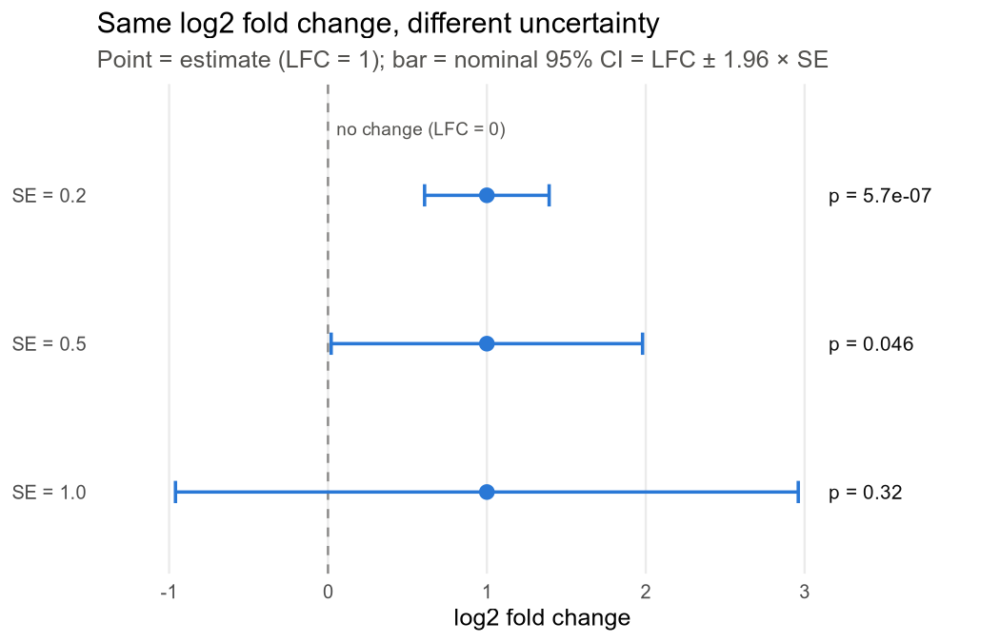
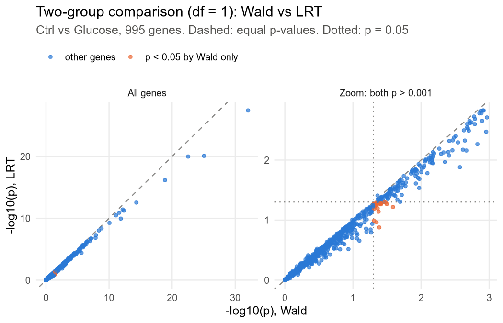

# 05. Why do the p-values differ when the fold change is the same? The Wald test and the LRT

In [note 04](04_glm_condition_batch.md) I computed gene A's LFC (0.977) and SE (0.289), and DESeq2 attaches p = 0.00072 to them. Yet among genes whose LFC is exactly 1, the p-values range from 0.00000057 to 0.32. In this note I follow the Wald test by hand to see how that p comes out, and compare it with the LRT, which asks in one go whether the three groups differ "somewhere".

> Study text chapters 9, 10 and 12 · Code: [05_wald_vs_lrt.R](../../05_wald_vs_lrt.R)

All code, including what is inside the collapsible blocks, was run from top to bottom in a single R session with `options(width = 110)` (with the default width of 80 the values are the same and only the line breaks of the output differ).

## 1. Where does gene A's p-value come from?

Gene A's counts are 100, 130, 90 in Ctrl and 200, 250, 180 in Starvation. A count is the number of reads assigned to the gene in one sample, and the size factors, the multipliers that correct for sequencing depth differing between samples, are all set to 1. In [note 04](04_glm_condition_batch.md) this gene was fitted with a GLM (generalized linear model), a model that writes the mean of the counts on the log scale as a sum of condition effects, and two numbers came out.

One is LFC = 0.977. The log2 fold change (LFC) is the ratio of two condition means on the log2 scale; the group means are 106.667 and 210, so the ratio is 1.97-fold, which is 0.977 in log2. An LFC of 1 means 2-fold and −1 means half. The other is SE = 0.289. The SE (standard error) says how much the estimate would move if the same experiment were done again.

So there is one question. Could an LFC of 0.977 come out just from chance differences between three replicates each, even if starvation actually had no effect?

### Dividing the estimate by its wobble

Suppose the true effect is 0. Even so, each time the experiment is repeated, the LFC estimate scatters around 0 with a width of about one SE. So it is enough to count how many SEs the observed 0.977 lies from 0. 0.977 ÷ 0.289 = 3.38, so it lies 3.38 SEs away. The probability of deviating 3.38 or more standard deviations from the mean in a normal distribution, both sides combined, is about 0.07%, and that is exactly the p-value.

This calculation is called the Wald test. As a formula:

$$Z=\frac{\hat\beta}{SE(\hat\beta)},\qquad p=2\,\Phi(-\lvert Z\rvert)$$

- $\hat\beta$: the estimated LFC (a coefficient in log2 units). The hat (^) marks a value estimated from data.
- $SE(\hat\beta)$: the standard error of that estimate.
- $Z$: how many SEs the estimate lies from 0. The `stat` column of the `results()` table.
- $\Phi$: the cumulative distribution function of the standard normal. $\Phi(-3.38)$ is the area to the left of −3.38 under the standard normal.
- The 2 in front: added because both an increase and a decrease count as extreme results (a two-sided test).

For gene A, $Z=0.977280/0.289057=3.381$ and $p=2\,\Phi(-3.381)=0.00072$.

Now let me do the same calculation with DESeq2. One more value is needed: the dispersion α. α describes how much more replicates of the same condition spread than the Poisson predicts. Here I fix the final α = 0.053147 found in [note 03](03_dispersion_estimation.md). `nbinomWaldTest()` is the function that calls, on its own, only the last of the several steps `DESeq()` runs in turn, the testing step.

```r
suppressPackageStartupMessages(library(DESeq2))
k  <- c(100L, 130L, 90L, 200L, 250L, 180L)                    # gene A: 3 Ctrl, 3 Starvation
cd <- data.frame(condition = factor(rep(c("Ctrl", "Starvation"), each = 3)),
                 row.names = paste0(rep(c("Ctrl", "Starvation"), each = 3), "_", 1:3))
ddsA <- DESeqDataSetFromMatrix(matrix(k, nrow = 1, dimnames = list("geneA", rownames(cd))), cd, ~ condition)
sizeFactors(ddsA) <- rep(1, 6)                                # all size factors 1
dispersions(ddsA) <- 0.053147                                 # final alpha from note 03
ddsA <- nbinomWaldTest(ddsA, quiet = TRUE)
resA <- results(ddsA)
print(as.data.frame(resA)[, c("log2FoldChange", "lfcSE", "stat", "pvalue")], digits = 6)
z <- resA$log2FoldChange / resA$lfcSE
cat("by hand: Z = LFC/SE =", round(z, 4), "  p = 2*pnorm(-|Z|) =", signif(2 * pnorm(-abs(z)), 5), "\n")
cat("95% CI = LFC ± 1.96*SE:", round(resA$log2FoldChange + c(-1, 1) * qnorm(0.975) * resA$lfcSE, 4), "\n")
```

```
      log2FoldChange    lfcSE    stat      pvalue
geneA        0.97728 0.289057 3.38093 0.000722408
by hand: Z = LFC/SE = 3.3809   p = 2*pnorm(-|Z|) = 0.00072241
95% CI = LFC ± 1.96*SE: 0.4107 1.5438
```

Computed directly, `stat` is exactly the LFC divided by lfcSE, and `pvalue` also comes out identical to the hand-computed 2Φ(−|Z|).

### Is it the counts that are assumed normal?

At first I too thought that because the Wald test uses the normal distribution, the counts must be normal too. But they need not be. Counts are modelled with the negative binomial (NB), a count distribution that allows overdispersion, that is, spread between replicates of the same condition larger than the Poisson predicts ([02](02_negative_binomial.md)).

What is assumed normal is the estimate $\hat\beta$. Imagine repeating the same experiment many times: $\hat\beta$ would come out a little differently each time, and the distribution of those $\hat\beta$ values is close to normal. The justification is a general property of the MLE. $\hat\beta$ is the value that makes the NB likelihood largest, the MLE (maximum likelihood estimate). The likelihood, with the observations held fixed, says how plausible a candidate parameter makes those observations. And the distribution of an MLE gets closer to normal as the data grow.

### The assumptions under the SE and the reference distribution

I described α above as how much more the counts spread than the Poisson; as a formula, variance = μ + αμ². μ is the mean count the model expects in that sample (the expected count). With α = 0 the variance becomes μ, the same as the Poisson, so α is not the variance itself but the extra spread beyond the Poisson. When computing the SE, though, DESeq2 puts in α and the size factors as if they were known values (plug-in). In fact α is also estimated from the data and so uncertain, but the default SE does not contain that uncertainty. So the SEs and confidence intervals that come out here are "nominal" values.

The reference distribution against which Z is compared is, by default, the standard normal too. With `nbinomWaldTest(useT = TRUE)` it is compared with a t distribution, whose tails are heavier than the normal's, and with few samples the two results differ a lot. In the Glucose–Ctrl comparison of the example data used from section 3 on (12 samples, 6 coefficients), the number of genes with padj<0.05 dropped from 163 to 35 ([Going deeper](#going-deeper)).

### The 95% confidence interval

$\hat\beta\pm1.96\times SE$ is the nominal 95% confidence interval (CI). 1.96 is the value that cuts off 2.5% at each end of the standard normal. For gene A it is 0.977 ± 1.96 × 0.289 = [0.411, 1.544]. A CI that excludes 0 and p < 0.05 are the same event, because both are different ways of writing the single condition "|Z| > 1.96". The tiny exception that arises when the rounded value 1.96 is used is noted under "Going deeper".

## 2. Why do the p-values differ even with the same LFC?

Let me compute the example of section 9.2 of the study text as it is: three genes, all with an LFC of 1 (2-fold) and different SEs.

```r
tab <- data.frame(log2FC = 1, SE = c(0.2, 0.5, 1.0))
tab$Z <- tab$log2FC / tab$SE
tab$p <- 2 * pnorm(-abs(tab$Z))
tab$CI_low  <- tab$log2FC - qnorm(0.975) * tab$SE
tab$CI_high <- tab$log2FC + qnorm(0.975) * tab$SE
print(tab, digits = 4)
```

```
  log2FC  SE Z         p   CI_low CI_high
1      1 0.2 5 5.733e-07  0.60801   1.392
2      1 0.5 2 4.550e-02  0.02002   1.980
3      1 1.0 1 3.173e-01 -0.95996   2.960
```

As the SE grows, Z shrinks to 5, 2, 1, and p grows from 0.00000057 to 0.32. Only the gene with SE 1.0 has a CI that includes 0.



*The points of all three genes sit at LFC = 1. As the SE grows the bar (95% CI) widens, and for the gene with SE 1.0 the bar crosses the zero line, giving p = 0.32.*

<details>
<summary>Code for the figure</summary>

```r
suppressPackageStartupMessages(library(ggplot2))
fig <- transform(tab, yy = 3:1, lab = c("p = 5.7e-07", "p = 0.046", "p = 0.32"))    # SE 0.2 at the top
g1 <- ggplot(fig, aes(y = yy)) +
  geom_vline(xintercept = 0, linetype = "dashed", colour = "#8a8987") +
  annotate("text", x = 0, y = 3.45, label = "no change (LFC = 0)", hjust = -0.05, size = 3.2, colour = "#52514e") +
  geom_errorbar(aes(xmin = CI_low, xmax = CI_high), width = 0.15, linewidth = 0.8, colour = "#2a78d6", orientation = "y") +
  geom_point(aes(x = log2FC), size = 3, colour = "#2a78d6") +
  geom_text(aes(x = 3.15, label = lab), hjust = 0, size = 3.5, colour = "#0b0b0b") +
  scale_x_continuous(limits = c(-1.2, 3.9), breaks = -1:3) +
  scale_y_continuous(breaks = fig$yy, labels = sprintf("SE = %.1f", fig$SE), limits = c(0.6, 3.6)) +
  labs(title = "Same log2 fold change, different uncertainty",
       subtitle = "Point = estimate (LFC = 1); bar = nominal 95% CI = LFC ± 1.96 × SE",
       x = "log2 fold change", y = NULL) +
  theme_minimal(base_size = 12) +
  theme(plot.background = element_rect(fill = "white", colour = NA), panel.grid.minor = element_blank(),
        panel.grid.major.y = element_blank(), plot.subtitle = element_text(colour = "#52514e"))
ggsave("../figures/05_same_lfc_different_se.png", g1, width = 7, height = 4.5, dpi = 150)
cat("saved:", file.exists("../figures/05_same_lfc_different_se.png"), "\n")
```

```
saved: TRUE
```

</details>

"How many times did it change" and "how precisely was it estimated" are different pieces of information. The SE differs from gene to gene: it grows as the count gets smaller (Poisson noise is relatively larger) and as the dispersion α gets larger (replicates are more erratic). It also grows with fewer replicates, or when many factors in the model (batch, pair and so on) leave many coefficients to estimate.

The effect of the dispersion can be seen right away for gene A, because [note 03](03_dispersion_estimation.md) computed α in three ways. The NB MLE without correction is 0.014786, and with the Cox-Reid adjustment, which reduces the underestimation caused by estimating the mean from the same data, it is 0.025385. The last value comes with a prior attached. A prior is a distribution for where α is likely to be before the data are seen; here the study text set log α ~ N(log 0.08, 0.7²) for teaching. The most plausible value when the likelihood and the prior are considered together (the MAP) is 0.053147. Now I keep the counts as they are and change only α.

```r
for (a in c(0.014786, 0.025385, 0.053147)) {          # note 03: MLE, Cox-Reid, MAP
  d <- ddsA; dispersions(d) <- a
  r <- results(nbinomWaldTest(d, quiet = TRUE))
  cat(sprintf("alpha = %.6f   LFC = %.4f   SE = %.4f   Z = %.3f   p = %.2g\n",
              a, r$log2FoldChange, r$lfcSE, r$stat, r$pvalue))
}
```

```
alpha = 0.014786   LFC = 0.9773   SE = 0.1741   Z = 5.612   p = 2e-08
alpha = 0.025385   LFC = 0.9773   SE = 0.2122   Z = 4.605   p = 4.1e-06
alpha = 0.053147   LFC = 0.9773   SE = 0.2891   Z = 3.381   p = 0.00072
```

The LFC is the same, 0.9773, on all three lines. But as α grows from 0.015 to 0.053, the SE grows from 0.174 to 0.289, and p goes from 2e-08 to 0.00072. How the dispersion is estimated changes the p-value directly.

## 3. What does each of the six columns of the results table say?

From here on I use practice data with 1000 genes: simulated data made with DESeq2's `makeExampleDESeqDataSet()` and given the study text's three condition names. Ctrl, Starvation and Glucose have 4 samples each, and Glucose is the short name for the condition where starved cells are given glucose again (Starvation+Glucose). I take the three conditions to have been obtained from the same donors and attached pairs 1–4, so the design (the formula listing the factors to put in the model) is `~ pair + condition`.

And because of how the data were made, **the true Starvation–Ctrl effect is 0 for every gene.** Glucose–Ctrl has a true effect for each gene (`trueBeta`), and pair has no true effect but is estimated because it is in the design. So every gene that comes out significant for Starvation–Ctrl is a false positive.

Writing which two conditions to compare (the contrast) into `results()`, as in `contrast = c("condition", "Starvation", "Ctrl")`, gives the results table of that comparison.

```r
set.seed(1)
dds0 <- makeExampleDESeqDataSet(n = 1000, m = 16, betaSD = 1)   # A: 1-8, B: 9-16
keep <- c(1:8, 9:12)                                              # Ctrl=A1-4, Starvation=A5-8, Glucose=B1-4
cts  <- counts(dds0)[, keep]
meta <- data.frame(condition = factor(rep(c("Ctrl","Starvation","Glucose"), each = 4),
                                      levels = c("Ctrl","Starvation","Glucose")),
                   pair = factor(rep(1:4, 3)))
colnames(cts) <- rownames(meta) <- paste0(meta$condition, "_", meta$pair)
dds3 <- DESeqDataSetFromMatrix(cts, meta, ~ pair + condition)
dds_wald <- DESeq(dds3, quiet = TRUE)
res_wS <- results(dds_wald, contrast = c("condition", "Starvation", "Ctrl"))
res_wG <- results(dds_wald, name = "condition_Glucose_vs_Ctrl")
print(as.data.frame(res_wS[c("gene841", "gene420", "gene4"), ]), digits = 4)
print(mcols(res_wS)$description)
```

```
        baseMean log2FoldChange  lfcSE    stat   pvalue   padj
gene841    918.0        -0.3490 0.3258 -1.0710 0.284176 0.9988
gene420    373.6        -0.8044 0.3066 -2.6239 0.008693 0.9988
gene4      166.7         0.1590 0.3546  0.4484 0.653838 0.9988
[1] "mean of normalized counts for all samples"
[2] "log2 fold change (MLE): condition Starvation vs Ctrl"
[3] "standard error: condition Starvation vs Ctrl"
[4] "Wald statistic: condition Starvation vs Ctrl"
[5] "Wald test p-value: condition Starvation vs Ctrl"
[6] "BH adjusted p-values"
```

The six `description` lines at the bottom say what each column is. If the table gets confusing, look at these first.

| Column | Meaning | Easy to get wrong |
|---|---|---|
| `baseMean` | Mean of the normalized counts over all samples | Includes the Glucose samples not used in the comparison. gene841 is 918.0 because its Glucose counts are large, but a fresh analysis of Ctrl and Starvation alone gives 174.8 (section 6). |
| `log2FoldChange` | LFC of the requested comparison | The numerator is Starvation and the denominator Ctrl. With the default (`betaPrior=FALSE`) it is the MLE, without shrinkage that pulls the LFC toward 0. |
| `lfcSE` | SE of the LFC | Its value and meaning change after `lfcShrink()` ([07](07_lfc_shrinkage_and_qc.md)). |
| `stat` | Wald Z = LFC / lfcSE | In an LRT results table it is a completely different statistic, D (section 4). |
| `pvalue` | The raw p-value | Neither "the probability that the null hypothesis is true" nor "the probability that this gene is a false positive". It is the probability, if the effect were 0, of a Z as extreme as the current one or more. |
| `padj` | p-value adjusted with BH | Not the probability that this one gene is wrong (the posterior error probability). |

padj is an adjusted value needed because thousands of genes are tested at once. Its goal is to control the FDR, the expected proportion of false discoveries in the list of discoveries. DESeq2's default adjustment is BH (Benjamini–Hochberg), and the detailed calculation is in [06](06_multiple_testing.md).

### Why a CI can exclude 0 without a padj star

There is a combination often seen in paper figures: the bars are 95% CIs, and a star marks padj<0.05. But some genes have a CI that excludes 0 yet no star. Let me count in the Glucose–Ctrl comparison.

```r
r  <- results(dds_wald, name = "condition_Glucose_vs_Ctrl", alpha = 0.05)
lo <- r$log2FoldChange - qnorm(0.975) * r$lfcSE; hi <- r$log2FoldChange + qnorm(0.975) * r$lfcSE
ci_ex <- (lo > 0 | hi < 0)
cat("non-NA pvalue:", sum(!is.na(r$pvalue)), "| CI excludes 0:", sum(ci_ex, na.rm = TRUE),
    " raw p<0.05:", sum(r$pvalue < 0.05, na.rm = TRUE), " padj<0.05:", sum(r$padj < 0.05, na.rm = TRUE), "\n")
cat("CI excludes 0 but padj>=0.05:", sum(ci_ex & !is.na(r$padj) & r$padj >= 0.05),
    "| CI excludes 0 but padj NA (independent filtering):", sum(ci_ex & is.na(r$padj), na.rm = TRUE), "\n")
cat("CI-excludes-0 <=> raw p<0.05:", identical(which(ci_ex), which(r$pvalue < 0.05)), "\n")
cat("padj<0.05 but CI includes 0:", sum(!is.na(r$padj) & r$padj < 0.05 & !ci_ex),
    "| padj >= pvalue for all non-NA:", all(r$padj >= r$pvalue, na.rm = TRUE), "\n")
```

```
non-NA pvalue: 999 | CI excludes 0: 277  raw p<0.05: 277  padj<0.05: 163
CI excludes 0 but padj>=0.05: 103 | CI excludes 0 but padj NA (independent filtering): 11
CI-excludes-0 <=> raw p<0.05: TRUE
padj<0.05 but CI includes 0: 0 | padj >= pvalue for all non-NA: TRUE
```

The 277 genes whose CI excludes 0 and the 277 with raw p<0.05 are exactly the same genes. But only 163 of them have padj<0.05.

A CI is an interval built by looking at one gene alone, while padj reflects the fact that many genes were tested at once. Here the 766 genes that passed independent filtering, out of the 999 with a p-value, were adjusted together. So 114 genes have a CI excluding 0 but no padj<0.05. 103 have padj of 0.05 or more, and 11 have padj NA because they were caught by independent filtering (the procedure that removes genes with a low mean count from the adjustment).

The other direction does hold. A BH padj is always greater than or equal to the raw p, so all 163 genes with padj<0.05 have a CI that excludes 0. If a figure shows nominal CI bars and padj stars together, note in the legend that the two use different criteria.

### Choosing "genes with |LFC| > 1" properly

The criterion "padj<0.05 and |LFC|>1" is widely used. But this is a filter that tests "is the effect 0" and then keeps only the estimates above 1. It does not test "the true effect is larger than 2-fold". To claim that, the null hypothesis itself has to be changed to |β| ≤ 1 and tested. `lfcThreshold = 1` in `results()` is exactly that test.

```r
r0 <- results(dds_wald, name = "condition_Glucose_vs_Ctrl", alpha = 0.05)
r1 <- results(dds_wald, name = "condition_Glucose_vs_Ctrl", alpha = 0.05,
              lfcThreshold = 1, altHypothesis = "greaterAbs")
cat("filter padj<0.05 & |LFC|>1:", sum(r0$padj < 0.05 & abs(r0$log2FoldChange) > 1, na.rm = TRUE),
    "| lfcThreshold = 1 test padj<0.05:", sum(r1$padj < 0.05, na.rm = TRUE), "\n")
gg <- c("gene8", "gene20", "gene38")
print(data.frame(LFC = r0[gg, "log2FoldChange"], SE = r0[gg, "lfcSE"],
                 p_vs0 = r0[gg, "pvalue"], padj_vs0 = r0[gg, "padj"],
                 p_vs1 = r1[gg, "pvalue"], padj_vs1 = r1[gg, "padj"], row.names = gg), digits = 3)
```

```
filter padj<0.05 & |LFC|>1: 156 | lfcThreshold = 1 test padj<0.05: 18
         LFC    SE    p_vs0 padj_vs0    p_vs1 padj_vs1
gene8  -1.84 0.601 2.18e-03 1.49e-02 0.080679   0.6182
gene20  1.83 0.389 2.44e-06 5.84e-05 0.016130   0.2403
gene38  2.99 0.610 9.53e-07 2.71e-05 0.000554   0.0327
```

The filter leaves 156 genes, but testing "|LFC| is larger than 1" directly leaves only 18.

The difference shows clearly in gene8. Its estimated LFC is −1.84 and its padj is small too, 0.015, so it passes the filter. But its SE is 0.60, so the possibility that the true value lies within 1 cannot be ruled out: the p for |β| ≤ 1 is 0.081, and the padj 0.62. A gene with a large SE does not pass this test even with a large LFC estimate. All 18 were among the 156 of the filter. Of the remaining 138 that passed only the filter, 135 had a padj of 0.05 or more in this test, and 3 dropped out in this test's independent filtering, with padj NA.

The threshold T and the direction of the test (`altHypothesis`) must be set before seeing the results. Even with the same T = 1, the result split into 18 and 12 genes depending on which calculation DESeq2 provides was used (Going deeper). That is why the study text also says to record which version and options were used.

In short, the LFC, SE, raw p, CI and padj answer different questions. The LFC says how large, the SE how precise, the raw p and CI whether this one gene alone is compatible with 0, and padj whether it survives under the FDR of the whole list. And being statistically significant does not mean being biologically important or a proven mechanism.

## 4. How do you ask whether the three groups differ "somewhere"?

A three-group design has two condition coefficients, Starvation–Ctrl ($b_S$) and Glucose–Ctrl ($b_G$). Here $b$ is a coefficient in natural-log units, and $\beta=b/\log 2$, converted to log2 units, is the LFC in the results table. But "are the means of all three conditions equal?" cannot be answered with one coefficient, because it asks whether the two coefficients are 0 at the same time. The tool for this is the LRT (likelihood ratio test), which tests several coefficients at once by comparing the likelihoods of the model without the coefficients and the model with them.

### First with gene A: how much does the likelihood drop when a coefficient is removed?

I fit two models to gene A.

- full: Ctrl and Starvation each have their own mean (106.667 and 210).
- reduced: the condition coefficient is removed, so all six samples share one common mean, 158.333.

For each model I compute the log-likelihood, the sum of the logs of the NB probabilities of the six observed counts under that model; the larger it is, the better the model explains the data. Reduced is the special case of full with one coefficient fixed at 0, so the log-likelihood of full cannot be smaller than that of reduced. The question is how much larger it is.

```r
ddsA_lrt <- nbinomLRT(ddsA, reduced = ~ 1, quiet = TRUE)        # same alpha, same size factors
resA_lrt <- results(ddsA_lrt)
a <- 0.053147
mu_full <- rep(c(mean(k[1:3]), mean(k[4:6])), each = 3)        # full: a mean per group
mu_red  <- rep(mean(k), 6)                                      # reduced: one common mean
l_full <- sum(dnbinom(k, mu = mu_full, size = 1 / a, log = TRUE))
l_red  <- sum(dnbinom(k, mu = mu_red,  size = 1 / a, log = TRUE))
cat("l_full =", round(l_full, 3), "  l_reduced =", round(l_red, 3), "  D = 2(l_full - l_reduced) =", round(2 * (l_full - l_red), 4), "\n")
cat("DESeq2 LRT : stat =", round(resA_lrt$stat, 4), "  p =", signif(resA_lrt$pvalue, 4), "\n")
cat("Wald compare: Z^2  =", round(resA$stat^2, 4), "  p =", signif(resA$pvalue, 4), "\n")
```

```
l_full = -28.182   l_reduced = -33.829   D = 2(l_full - l_reduced) = 11.2933
DESeq2 LRT : stat = 11.2933   p = 0.0007779
Wald compare: Z^2  = 11.4307   p = 0.0007224
```

The hand-computed D equals DESeq2's `stat`, and is close to the Wald $Z^2$ too. `nbinomLRT()` is the testing-step function that does the LRT instead of `nbinomWaldTest()`.

Removing the condition coefficient dropped the log-likelihood from −28.182 to −33.829. Twice this difference is the LRT statistic.

$$D=2\,(\ell_{full}-\ell_{reduced})\ \overset{H_0}{\approx}\ \chi^2_{df}$$

- $\ell_{full}$, $\ell_{reduced}$: the maximum log-likelihoods of the two models.
- $D$: the explanatory power lost by removing the coefficients. The `stat` column of the results table.
- $H_0$: the null hypothesis, that all the removed coefficients are 0.
- $\chi^2_{df}$: the chi-squared distribution with df degrees of freedom. If the null hypothesis is true, D roughly follows this distribution.
- $df$: the number of removed coefficients, the difference in the number of columns of the two design matrices. A design matrix is a table that records in numbers which condition or pair each sample belongs to.

For gene A, $D=2\{-28.182-(-33.829)\}=11.29$, and one coefficient was removed, so df = 1. The probability of 11.29 or more under $\chi^2_1$ is p = 0.00078, almost the same as the Wald $Z^2=11.43$, p = 0.00072. In a two-group comparison, Wald and LRT ask the same question in different ways.

In asking "are all these means equal", the question has the same shape as an ANOVA. But the distribution is NB rather than normal, the statistic is D rather than F, and the reference distribution is chi-squared. So there is no need to run an ANOVA on raw counts first.

### Three groups: `~ pair + condition` vs `~ pair`

Now on to the three groups of the practice data. Full is `~ pair + condition` and reduced is `~ pair`. The null hypothesis is $b_S=b_G=0$, that is, once pair differences are accounted for, the means of the three conditions are equal. Pair is not being tested, so it stays in reduced too. Full has 6 coefficients (intercept, 3 pairs, Starvation, Glucose) and reduced 4, so df = 2.

```r
dds_lrt <- DESeq(dds3, test = "LRT", reduced = ~ pair, quiet = TRUE)
res_l <- results(dds_lrt)
nF <- ncol(attr(dds_lrt, "modelMatrix")); nR <- ncol(attr(dds_lrt, "reducedModelMatrix"))
cat("df =", nF, "-", nR, "=", nF - nR, "\n")
cat("dispersions same as the Wald object:", identical(dispersions(dds_wald), dispersions(dds_lrt)), "\n")
g3 <- c("gene841", "gene420", "gene4")
print(data.frame(Z_Starvation = res_wS[g3, "stat"], Z_Glucose = res_wG[g3, "stat"],
                 LRT_D = res_l[g3, "stat"], LRT_p = res_l[g3, "pvalue"], row.names = g3), digits = 4)
print(counts(dds_wald)["gene841", ])
```

```
df = 6 - 4 = 2
dispersions same as the Wald object: TRUE
        Z_Starvation Z_Glucose  LRT_D     LRT_p
gene841      -1.0710   11.2459 184.30 9.540e-41
gene420      -2.6239    5.2985  64.77 8.628e-15
gene4         0.4484    0.7308   0.53 7.672e-01
      Ctrl_1       Ctrl_2       Ctrl_3       Ctrl_4 Starvation_1 Starvation_2 Starvation_3 Starvation_4
         283          197          148          177          203          131          167          144
   Glucose_1    Glucose_2    Glucose_3    Glucose_4
        1379         2511         3770         2385
```

gene841's D = 184.3 is the effect of removing both coefficients together. Looking at the counts, most of it comes from the increase on the Glucose side.

The dispersions estimated once with the full design are shared as they are by both models, because the LRT does not estimate separate dispersions for the reduced model; it only fits the GLM twice (`nbinomLRT` source, Going deeper). `identical` being TRUE in the output also means that the dispersions of the LRT object do not differ from those of the Wald object in a single digit.

### With two groups, do Wald and LRT always give the same answer?

For gene A the two p-values were similar, 0.00072 and 0.00078. Is that so for 1000 genes too? I make a new object from only Ctrl and Glucose of the practice data (df = 1) and put the p-values of the two tests side by side.

```r
keepG <- meta$condition %in% c("Ctrl", "Glucose")
metaG <- droplevels(meta[keepG, , drop = FALSE])
ddsG  <- DESeq(DESeqDataSetFromMatrix(cts[, rownames(metaG)], metaG, ~ pair + condition), quiet = TRUE)
ddsG_lrt <- nbinomLRT(ddsG, reduced = ~ pair, quiet = TRUE)
wG <- results(ddsG, name = "condition_Glucose_vs_Ctrl"); lG <- results(ddsG_lrt)
ok <- !is.na(wG$pvalue) & !is.na(lG$pvalue)
cat("genes:", sum(ok), "| cor(-log10 p):", round(cor(-log10(wG$pvalue[ok]), -log10(lG$pvalue[ok])), 4), "\n")
cat("p<0.05  Wald:", sum(wG$pvalue[ok] < 0.05), " LRT:", sum(lG$pvalue[ok] < 0.05),
    " both:", sum(wG$pvalue[ok] < 0.05 & lG$pvalue[ok] < 0.05), "\n")
cat("share of genes with D < Z^2:", round(mean(lG$stat[ok] < wG$stat[ok]^2), 3), "\n")
```

```
genes: 995 | cor(-log10 p): 0.9977
p<0.05  Wald: 255  LRT: 229  both: 229
share of genes with D < Z^2: 0.93
```

The correlation of the two p-values is 0.998. But the number of genes with p<0.05 differs a little: 255 by Wald, 229 by LRT.



*Each point is one gene. Most lie near the diagonal, so the two tests give almost the same answer. The 26 orange points in the zoomed panel on the right have p<0.05 by Wald only and above 0.05 by LRT.*

<details>
<summary>Code for the figure</summary>

```r
wo <- ok & wG$pvalue < 0.05 & lG$pvalue >= 0.05                  # p<0.05 by Wald only
pp <- data.frame(x = -log10(wG$pvalue[ok]), y = -log10(lG$pvalue[ok]),
                 grp = ifelse(wo[ok], "p < 0.05 by Wald only", "other genes"))
zoom <- subset(pp, x < 3 & y < 3)
pp$panel <- "All genes"; zoom$panel <- "Zoom: both p > 0.001"
both <- rbind(pp, zoom); both$panel <- factor(both$panel, levels = c("All genes", "Zoom: both p > 0.001"))
thr <- data.frame(panel = factor("Zoom: both p > 0.001", levels = levels(both$panel)), v = -log10(0.05))
g2 <- ggplot(both, aes(x, y)) +
  geom_abline(slope = 1, intercept = 0, linetype = "dashed", colour = "#8a8987") +
  geom_vline(data = thr, aes(xintercept = v), linetype = "dotted", colour = "#8a8987") +
  geom_hline(data = thr, aes(yintercept = v), linetype = "dotted", colour = "#8a8987") +
  geom_point(aes(colour = grp), size = 1.3, alpha = 0.7) +
  scale_colour_manual(values = c("other genes" = "#2a78d6", "p < 0.05 by Wald only" = "#eb6834"), name = NULL) +
  facet_wrap(~ panel, scales = "free") +
  labs(title = "Two-group comparison (df = 1): Wald vs LRT",
       subtitle = sprintf("Ctrl vs Glucose, %d genes. Dashed: equal p-values. Dotted: p = 0.05", sum(ok)),
       x = "-log10(p), Wald", y = "-log10(p), LRT") +
  theme_minimal(base_size = 12) +
  theme(plot.background = element_rect(fill = "white", colour = NA), panel.grid.minor = element_blank(),
        legend.position = "top", legend.justification = "left", plot.subtitle = element_text(colour = "#52514e"))
ggsave("../figures/05_wald_vs_lrt_pvalues.png", g2, width = 7, height = 4.5, dpi = 150)
cat("saved:", file.exists("../figures/05_wald_vs_lrt_pvalues.png"), "| Wald-only genes:", sum(wo),
    "| their Wald p:", signif(range(wG$pvalue[wo]), 3), "| LRT p:", signif(range(lG$pvalue[wo]), 3), "\n")
for (b in list(c(0, 2), c(2, 4), c(4, 8), c(8, Inf))) {                # p difference by |Z| bin
  s <- abs(wG$stat[ok]) >= b[1] & abs(wG$stat[ok]) < b[2]
  cat(sprintf("|Z| in [%g, %g): n = %3d  median log10(p_LRT / p_Wald) = %.3f\n",
              b[1], b[2], sum(s), median(log10(lG$pvalue[ok][s] / wG$pvalue[ok][s]))))
}
```

```
saved: TRUE | Wald-only genes: 26 | their Wald p: 0.0258 0.0495 | LRT p: 0.0502 0.132
|Z| in [0, 2): n = 749  median log10(p_LRT / p_Wald) = 0.016
|Z| in [2, 4): n = 195  median log10(p_LRT / p_Wald) = 0.128
|Z| in [4, 8): n =  47  median log10(p_LRT / p_Wald) = 0.400
|Z| in [8, Inf): n =   4  median log10(p_LRT / p_Wald) = 3.658
```

</details>

The two tests mostly reach the same conclusion. All 229 genes with p<0.05 by LRT also had p<0.05 by Wald. In this data, D was a little smaller than $Z^2$ for 93% of the genes, so the LRT was a little more conservative. But this is a result seen in this simulated data, not something confirmed as a general rule. The difference between the two p-values widens as |Z| grows; for the 4 genes with |Z| of 8 or more, the p-values differed by thousands of times (by the median; output of the figure code). Still, both are very small, so the conclusion is the same. The 26 genes where the conclusions split lay near the boundary, with Wald p 0.026–0.0495 and LRT p 0.050–0.13. Rather than one of them being the "right" p, two approximations gave slightly different answers near the boundary.

### The trap in the LRT results table

The LRT results table also has a `log2FoldChange` column, so it is easy to read the `pvalue` next to it as the p for that LFC; I thought so at first too. But it must not be read that way.

```r
res_lS <- results(dds_lrt, contrast = c("condition", "Starvation", "Ctrl"))
res_lG <- results(dds_lrt, name = "condition_Glucose_vs_Ctrl")
cat("pvalue unchanged when contrast changes:", identical(res_l$pvalue, res_lS$pvalue), identical(res_l$pvalue, res_lG$pvalue), "\n")
cat("LFC column of LRT table:", mcols(res_l)$description[2], "\n")
cat("p column of LRT table  :", mcols(res_l)$description[5], "\n")
res_lS_wald <- results(dds_lrt, contrast = c("condition", "Starvation", "Ctrl"), test = "Wald")
cat("p extracted with test = 'Wald' == p of Wald object:", isTRUE(all.equal(res_lS_wald$pvalue, res_wS$pvalue)), "\n")
sig <- function(r) !is.na(r$padj) & r$padj < 0.05
cat("padj<0.05  Wald Glucose-Ctrl:", sum(sig(res_wG)), " LRT:", sum(sig(res_l)),
    " Wald only:", sum(sig(res_wG) & !sig(res_l)), " LRT only:", sum(sig(res_l) & !sig(res_wG)), "\n")
```

```
pvalue unchanged when contrast changes: TRUE TRUE
LFC column of LRT table: log2 fold change (MLE): condition Glucose vs Ctrl
p column of LRT table  : LRT p-value: '~ pair + condition' vs '~ pair'
p extracted with test = 'Wald' == p of Wald object: TRUE
padj<0.05  Wald Glucose-Ctrl: 163  LRT: 146  Wald only: 37  LRT only: 20
```

Changing the `contrast` does not change a single character of `pvalue`. The description of the p column also reads "LRT p-value: '~ pair + condition' vs '~ pair'".

The `pvalue` of the LRT results table is one p for "does Starvation or Glucose differ from Ctrl somewhere". A p that asks about several comparisons at once like this is called an omnibus p. `log2FoldChange` and `lfcSE` are attached to show one coefficient of the full model, by default the last coefficient (Glucose vs Ctrl). If you need the p of a comparison between two particular conditions, pass `test = "Wald"` or keep a separate Wald object. Also note in the table which test the p comes from.

Counting padj<0.05, neither the Wald (Glucose–Ctrl) 163 nor the LRT 146 contains the other (37 only by Wald, 20 only by LRT). In general the LRT splits its evidence over two coefficients (df 2), so it can be weaker than Wald for an effect concentrated in one comparison. Conversely, the LRT can catch better an effect spread a little over both comparisons.

But in this data, the 20 genes caught only by the LRT cannot be such spread-out true effects, because the true Starvation–Ctrl effect is 0 for every gene. These 20 had a median Glucose–Ctrl Wald padj of 0.105, near the boundary, and in 5 of them noise on the Starvation side (Starvation–Ctrl raw p<0.05) was added to the LRT statistic. On top of this, the two tests apply BH to different p distributions and use different filtering criteria (Going deeper).

Should you then run the LRT first and do pairwise comparisons only on the significant genes? There is no need. If the question is "Starvation–Ctrl" from the start, just run that Wald test. A significant LRT does not automatically protect the error rate of the pairwise comparisons that follow either ([06](06_multiple_testing.md)). The LRT is the right tool for "is there a difference somewhere", and Wald for "is there this particular difference".

### When Wald goes badly wrong: all counts in one group are 0

Some genes split Wald and LRT dramatically. gene818 has all four Starvation counts at 0 (Ctrl 1, 13, 0, 0 / Glucose 0, 0, 4, 0). The estimate of the Starvation mean should then be 0, that is, the LFC should go to −∞. The calculation stops partway, and the Wald p built from the LFC of −21.6 and the SE where it stopped came out at $4\times10^{-14}$. It is the only gene with padj<0.05 in Starvation–Ctrl: a false positive from a comparison whose true effect is 0. The omnibus LRT of the same gene (testing both coefficients together) is D = 0.28, p = 0.87. The likelihood approaches a finite value even as the coefficient goes to −∞, so D hardly depends on where the calculation stopped, but the Wald Z depends directly on the LFC and SE where it stopped. For genes with counts this small, look at the counts themselves before `stat`.

## 5. Is "significant in A, not in B" evidence of a difference?

Suppose treatment (T) and control (C) were compared within each of genotypes A and B. A gave p<0.05 and B gave p>0.05. Can we then say "the treatment effect depends on the genotype"? I checked with simulated data in which every true effect is 0. Genotype, condition and their interaction all have no true effect, so every "difference" found here is false.

```r
set.seed(2); d <- makeExampleDESeqDataSet(n = 500, m = 16)        # betaSD default 0: all true effects 0
d$genotype  <- factor(rep(c("A", "B"), each = 8))
d$condition <- factor(rep(c("C", "T"), 8))
design(d) <- ~ genotype + condition + genotype:condition
dw  <- DESeq(d, quiet = TRUE)
rA  <- results(dw, name = "condition_T_vs_C")                                        # T-C within A
rB  <- results(dw, contrast = list(c("condition_T_vs_C", "genotypeB.conditionT")))    # T-C within B
int <- results(dw, name = "genotypeB.conditionT")                                     # difference of the two effects
one <- xor(rA$pvalue < 0.05, rB$pvalue < 0.05)
cat("p<0.05 on one side only:", sum(one, na.rm = TRUE),
    "| of these interaction p<0.05:", sum(one & int$pvalue < 0.05, na.rm = TRUE),
    "| all interaction p<0.05:", sum(int$pvalue < 0.05, na.rm = TRUE), "/", sum(!is.na(int$pvalue)), "\n")
cat("interaction LFC == (T-C in B) - (T-C in A):",
    isTRUE(all.equal(int$log2FoldChange, rB$log2FoldChange - rA$log2FoldChange)), "\n")
```

```
p<0.05 on one side only: 60 | of these interaction p<0.05: 21 | all interaction p<0.05: 27 / 500
interaction LFC == (T-C in B) - (T-C in A): TRUE
```

Even with no true effects at all, as many as 60 genes come out "significant on one side only".

Reading "significant on only one side, so the effects differ" would report 60 false differences. Just one side at p = 0.04 and the other at 0.06 is enough to split them into "significant/not significant". A split in significance is not evidence of a difference. What has to be asked about is the difference between the two effects itself.

$$\delta_{int}=\delta_B-\delta_A=(\log_2 q_{B,T}-\log_2 q_{B,C})-(\log_2 q_{A,T}-\log_2 q_{A,C})$$

- $q_{B,T}$: the mean expression of genotype B under treatment T; the other $q$ likewise.
- $\delta_A$, $\delta_B$: the treatment effect (LFC) within each genotype.
- $\delta_{int}$: the difference between the two effects. In DESeq2 it is the `genotypeB.conditionT` coefficient, the interaction term.

The right test is the Wald test of this coefficient divided by its SE. In the simulation above, interaction p<0.05 occurred for 27 of 500 genes (5.4%), near the 5% expected when there is no true effect. Among the 60 "significant on one side only" there were 21, and these too are all false positives.

The formula $\sqrt{SE_1^2+SE_2^2}$ for the SE of the sum or difference of two estimates is right only when the two estimates are uncorrelated. If they are correlated, a covariance term (how much the two estimates wobble together) is also needed (Going deeper). Fortunately the `lfcSE` of the interaction coefficient is computed including the covariance, so there is no need to combine anything. To test with the LRT, remove only the interaction term in the reduced model and keep genotype and condition (df = 1). The p-values of the two methods are not exactly the same, though.

## 6. Why do the Ctrl–Starvation results change when a third group is put in or taken out?

The same Ctrl–Starvation comparison can be obtained in two ways. You can extract it with `contrast` from an object fitted to all three groups, Ctrl, Starvation and Glucose, or you can build a new object from the raw counts of only Ctrl and Starvation and analyse it from scratch. The results differ even though the counts are the same counts of the same 8 samples. Let me look at what differs, and also at why the common practice of subsetting an already fitted object is a problem.

```r
sub <- dds_wald[, dds_wald$condition != "Glucose"]                  # subset the fitted 3-group object
cat("(a) DESeq() as is:", tryCatch({ DESeq(sub, quiet = TRUE); "ok" }, error = function(e) conditionMessage(e)), "\n")
sub$condition <- droplevels(sub$condition)
msgs <- character()
sub_fit <- withCallingHandlers(DESeq(sub), message = function(m) { msgs <<- c(msgs, conditionMessage(m)); invokeRestart("muffleMessage") })
cat("(b) first message after droplevels:", trimws(msgs[1]), "\n")
keep2 <- meta$condition %in% c("Ctrl", "Starvation")                  # (c) study text 12.4: new object from raw counts
meta2 <- droplevels(meta[keep2, , drop = FALSE]); cts2 <- cts[, rownames(meta2), drop = FALSE]
dds2  <- DESeq(DESeqDataSetFromMatrix(cts2, meta2, ~ pair + condition), quiet = TRUE)
r3 <- results(dds_wald, contrast = c("condition", "Starvation", "Ctrl"), alpha = 0.05)
r2 <- results(dds2,     contrast = c("condition", "Starvation", "Ctrl"), alpha = 0.05)
cmp <- function(f) c(three_group = format(signif(unname(f(dds_wald, r3)), 4)), two_group = format(signif(unname(f(dds2, r2)), 4)))
print(noquote(rbind(
  size_factor_Ctrl_1 = cmp(function(d, r) sizeFactors(d)[["Ctrl_1"]]),
  residual_df        = cmp(function(d, r) ncol(d) - ncol(attr(d, "dispModelMatrix"))),
  median_dispersion  = cmp(function(d, r) median(dispersions(d), na.rm = TRUE)),
  median_lfcSE       = cmp(function(d, r) median(r$lfcSE, na.rm = TRUE)),
  baseMean_gene841   = cmp(function(d, r) r["gene841", "baseMean"]),
  filterThreshold    = cmp(function(d, r) metadata(r)$filterThreshold))))
cat("cor(LFC 3 groups, LFC 2 groups):", round(cor(r3$log2FoldChange, r2$log2FoldChange, use = "complete"), 3), "\n")
```

```
(a) DESeq() as is: full model matrix is less than full rank
(b) first message after droplevels: using pre-existing size factors
                   three_group two_group
size_factor_Ctrl_1 1.037       1.042
residual_df        6           3
median_dispersion  0.4143      0.5139
median_lfcSE       0.7119      0.7852
baseMean_gene841   918         174.8
filterThreshold    0.07903     0.1194
cor(LFC 3 groups, LFC 2 groups): 0.82
```

(a) stops with an error, and (b) inherits the size factors of the 3 groups as they are. The table below shows that every line differs, from the size factors to the filtering threshold.

First, the pitfall of subsetting. (a) Subsetting the fitted 3-group object with `dds[, condition != "Glucose"]` leaves the factor level `Glucose` in name only. The design matrix then gets a column of all 0s, and `DESeq()` stops with "full model matrix is less than full rank". (b) Removing the empty level with `droplevels()` makes it run. But it says "using pre-existing size factors" and uses the size factors computed from the 3 groups as they are. (c) Only a new object built from the raw counts and metadata, as in section 12.4 of the study text, is re-estimated from scratch.

Putting (c) next to the 3-group results shows these differences.

- The size factors differ to begin with, because the per-gene geometric mean used as the reference for the size factors is computed from 12 samples in one case and 8 in the other ([02](02_negative_binomial.md)).
- The dispersions change too: the per-gene estimates, the trend with the mean, and the final α all change.
- The residual degrees of freedom are 6 vs 3, so the 3-group side has more information for estimating the dispersions.
- So the SE and p change. The LFC is mostly similar (gene841 −0.349 vs −0.318), except for genes like gene818 whose counts are almost 0 (Going deeper). In this comparison the true effect is 0, so the LFC is mostly noise, yet the LFC correlation between the two analyses is 0.82.
- `baseMean` also changes because the samples included differ. For gene841 it is 918.0 vs 174.8.
- The independent filtering threshold (`filterThreshold`) and the number of genes with padj NA change as well ([06](06_multiple_testing.md)).

Glucose in this data is a simulated group made the same way as Ctrl and Starvation, so its variability is similar. More replicates like this add information to the dispersion estimation (section 12.2 of the study text), and the 3-group median SE of 0.712 being smaller than the 2-group 0.785 is consistent with that direction. DESeq2 estimates a single dispersion α per gene and uses it for all included groups. That does not mean the per-group variances are equal, because with different means the variance μ + αμ² differs too. But if one group alone has unusually large variation between replicates, that influence enters the SE of the Ctrl–Starvation comparison through the shared α.

Should you then fit them together, or analyse the two groups separately? The official DESeq2 documentation (the vignette FAQ) usually recommends fitting all groups together and extracting the needed comparisons with `contrast`. The same FAQ also explains that when exploratory analysis such as PCA shows extremely large within-group variation in one group, analysing the two groups separately can be more sensitive. What matters is that this decision is made by exploratory analysis before seeing the results. That is different from picking afterwards whichever gives the better result.

There is an order to diagnosing why two analyses differ. First align or record whether it is the same set of genes, whether the size factors were re-estimated or inherited, and whether the outlier and filtering options are the same. Then compare in the order LFC → SE → raw p → padj. Comparing only padj mixes the effect of the model changing (SE, p) with the effect of the adjustment changing (filterThreshold, number of tests). In the end, the difference between the 2-group and 3-group results does not come only from having more comparisons. The normalization and dispersions the model learned, and the set of genes over which padj is computed together, have to be checked separately.

## Summary

- The Wald test compares $Z=\hat\beta/SE$ with the standard normal. What is assumed normal is not the counts but the estimate $\hat\beta$; for gene A, Z = 3.381 and p = 0.00072.
- Even with the same LFC, the p differs a lot if the SE differs. The SE depends on the count size, the dispersion and the number of replicates; for gene A too, changing α from 0.015 to 0.053 raised the SE from 0.174 to 0.289.
- A CI excluding 0 is the same as raw p<0.05, not padj<0.05 (277 vs 163). The "|LFC|>1 filter" and the `lfcThreshold = 1` test also differ (156 vs 18).
- The LRT compares the likelihood difference between the model without the coefficients and the model with them, $D=2(\ell_{full}-\ell_{reduced})$, with a chi-squared distribution. The two models use the same dispersions, and in a two-group comparison it mostly gives the same answer as Wald. But the `pvalue` of the LRT results table is an omnibus p that stays the same when `contrast` changes. Get the p of a particular comparison with Wald.
- "Significant in A, not significant in B" is not evidence of a difference. Test the difference between the two effects (the interaction coefficient) directly.
- Putting a third group in or taking it out changes the size factors, dispersions, SE, baseMean and filtering. To analyse only two groups, build a new object from the raw counts.

The BH adjustment of the p-values and independent filtering continue in [06](06_multiple_testing.md), and LFC shrinkage and QC in [07](07_lfc_shrinkage_and_qc.md). The flow of following one gene by hand from counts to padj is collected in [08](08_one_gene_end_to_end.md).

## Exercises

The problems of appendix A of the study text, as they are.

> **Problem 13.** log2FC=1.0, SE=0.25. Compute the default Wald Z and the nominal 95% CI. If the CI excludes 0, must BH padj<0.05 also hold?

<details>
<summary>Solution</summary>

```r
cat(sprintf("Z = %.2f, p = %.3g, 95%% CI = [%.2f, %.2f]\n",
            1/0.25, 2*pnorm(-4), 1 - qnorm(0.975)*0.25, 1 + qnorm(0.975)*0.25))
```

```
Z = 4.00, p = 6.33e-05, 95% CI = [0.51, 1.49]
```

$Z=1.0/0.25=4.00$, $p=2\Phi(-4)=6.33\times10^{-5}$, and the CI $=1\pm1.95996\times0.25=[0.51,\,1.49]$. The same as the study text's answer, [0.51, 1.49].

A CI that excludes 0 does not guarantee BH padj<0.05. A CI excluding 0 is just the same event as raw p<0.05. padj depends on the total number of tests and on the p distribution of the other genes, so it can exceed 0.05 even though this gene's raw p is as small as $6\times10^{-5}$.

The relationship runs one way. A BH padj is always at least the raw p, so if padj<0.05 the CI necessarily excludes 0, but not the reverse. In the Glucose–Ctrl comparison of section 3, 114 of the 277 genes whose CI excluded 0 did not have padj<0.05 (103 had padj ≥ 0.05, 11 were NA from independent filtering). No gene had padj<0.05 with a CI including 0.

</details>

> **Problem 14.** For the LRT with full=`~pair+condition`, reduced=`~pair` in paired three groups, state the default difference in degrees of freedom and the null hypothesis.

<details>
<summary>Solution</summary>

The number of columns of the design matrix is 6 for full (intercept, pairs 2, 3, 4, Starvation, Glucose) and 4 for reduced. So df = 6 − 4 = 2 (`df = 6 - 4 = 2` in the output of section 4). The DESeq2 source also computes it as `df <- ncol(fullModelMatrix) - ncol(reducedModelMatrix)`.

The null hypothesis is $b_S=b_G=0$ with the pair effects controlled for. Under reference coding, this means the adjusted means of the three conditions are all equal. The same as the study text's answer.

With more groups or added covariates, it is not "three groups, so 2"; the difference in rank of the two design matrices has to be worked out. DESeq2 computes the difference in the number of columns, and for nested designs that pass the full-rank check, the difference in columns equals the difference in rank (the LRT source under "Going deeper").

</details>

> **Problem 15.** In the results table of an LRT object, the Glucose−Starvation LFC was displayed. Can the p-value on that row be read as the Glucose−Starvation pairwise p-value?

<details>
<summary>Solution</summary>

No. `results(dds_lrt, contrast = ...)` changes only `log2FoldChange` and `lfcSE` to the requested comparison, and attaches the omnibus values as they are to `stat` and `pvalue` via `getStat(object, test, name = NULL)` (the `results()` source under "Going deeper").

In 'The full Wald and LRT run' under "Going deeper" I did exactly the Glucose–Starvation extraction the problem asks about. `pvalue` was `identical` TRUE to the omnibus, and only the displayed LFC equalled the Glucose–Starvation LFC of the Wald object. The same was true for the Starvation–Ctrl and Glucose–Ctrl extractions (section 4).

Taking gene841 as an example, whatever LFC is displayed, p is $9.5\times10^{-41}$. This p is evidence that "either Starvation or Glucose differs from Ctrl".

If you need a pairwise p, rebuild a Wald p with `results(dds_lrt, contrast = c("condition", "Glucose", "Starvation"), test = "Wald")` or keep a separate Wald object. The p of this call equalled the Glucose–Starvation p of the Wald object, and the description also changed to "Wald test p-value: condition Glucose vs Starvation". Note in the table which test the p comes from. The same as the study text's answer.

</details>

## Going deeper

The code below was run in the same R session, continuing from the code in the body.

<details>
<summary>Checked in the DESeq2 source: the Wald test (<code>nbinomWaldTest</code>)</summary>

This is the formula for testing a combination of coefficients (a contrast) rather than a single coefficient. $c$ is the contrast vector, in log2 units.

$$Z=\frac{\hat\delta}{SE(\hat\delta)},\qquad \hat\delta=c^\top\hat\beta,\qquad SE(\hat\delta)=\sqrt{c^\top\,\widehat{\mathrm{Cov}}(\hat\beta)\,c},\qquad p=2\{1-\Phi(\lvert Z\rvert)\}=2\,\Phi(-\lvert Z\rvert).$$

The nominal 95% CI is $\hat\beta\pm z_{0.975}\,SE(\hat\beta)$, with $z_{0.975}=1.95996$.

The SE comes from the covariance at the point where IRLS (the iteratively reweighted least squares calculation that finds the coefficients) converged, $\widehat{\mathrm{Cov}}(\hat b)\approx(X^\top W X)^{-1}$. $X^\top WX$ is the Fisher information, the amount of information the data give about the coefficients. Its inverse is the covariance, so the more information, the smaller the SE. The units are the natural-log coefficients $b$, and $W$ is in [04](04_glm_condition_batch.md). For log2 coefficients, $SE(\hat\beta)=SE(\hat b)/\ln 2$ (source `betaSE <- log2(exp(1)) * sqrt(sigma)`). Even with `betaPrior=FALSE`, `fitNbinomGLMs` adds a very small ridge, `lambda <- rep(1e-06, ...)`.

The dispersion $\alpha_i$ and size factors $s_j$ inside $W$ are already-estimated values held fixed (`alpha_hat <- dispersions(object)` inside `fitNbinomGLMs`). So the nominal SE does not contain the uncertainty of the upstream estimates.

Copying only the relevant part of `print(DESeq2::nbinomWaldTest)`:

```r
# excerpt (not run)
WaldStatistic <- betaMatrix/betaSE
...
if (useT) {
    if (!missing(df)) {
        ...                                      # df given by the user (copied per gene if length 1)
        df <- rep(df, nrow(objectNZ))
    } else {
        ...                                      # with weights, num.samps <- rowSums(weights)
        num.samps <- rep(ncol(object), nrow(objectNZ))
        df <- num.samps - ncol(dispModelMatrix)
    }
    df <- ifelse(df > 0, df, NA)
    WaldPvalue <- 2 * pt(abs(WaldStatistic), df = df, lower.tail = FALSE)
} else {
    WaldPvalue <- 2 * pnorm(abs(WaldStatistic), lower.tail = FALSE)
}
```

`args(nbinomWaldTest)` shows the defaults `betaPrior = FALSE`, `useT = FALSE`, `useQR = TRUE`, `minmu = 0.5`, and there is also a `df` argument with no default. `2*pnorm(abs(Z), lower.tail=FALSE)` is the same as $2\Phi(-\lvert Z\rvert)$.

With `useT = TRUE`, no `df` given and no weights, the degrees of freedom are $n-p$, where $n$ is the number of samples and $p$ is `ncol(dispModelMatrix)`, the number of coefficients. These are the symbols of section 4.5 of the study text, so this $p$ is not the p of a p-value. The DESeq2 source writes the number of samples as `m`. If `df` is given directly, that value is used.

</details>

<details>
<summary>How much changes with the t distribution? (<code>useT = TRUE</code>)</summary>

```r
dds_t <- nbinomWaldTest(dds_wald, useT = TRUE, quiet = TRUE)
res_t <- results(dds_t, name = "condition_Glucose_vs_Ctrl")
cat("tDegreesFreedom (unique):", unique(mcols(dds_t)$tDegreesFreedom),
    " = m - ncol(dispModelMatrix) =", ncol(dds_t), "-", ncol(attr(dds_t, "dispModelMatrix")), "\n")
z <- res_wG["gene841", "stat"]
cat(sprintf("gene841: Z=%.3f  normal p=%.3g  t(df=6) p=%.3g  DESeq2 useT p=%.3g\n",
            z, 2 * pnorm(-abs(z)), 2 * pt(abs(z), df = 6, lower.tail = FALSE), res_t["gene841", "pvalue"]))
cat("padj<0.05: normal", sum(res_wG$padj < 0.05, na.rm = TRUE), " t:", sum(res_t$padj < 0.05, na.rm = TRUE), "\n")
```

```
tDegreesFreedom (unique): 6 NA  = m - ncol(dispModelMatrix) = 12 - 6
gene841: Z=11.246  normal p=2.43e-29  t(df=6) p=2.95e-05  DESeq2 useT p=2.95e-05
padj<0.05: normal 163  t: 35
```

Running with `useT = TRUE` creates the `mcols(dds)$tDegreesFreedom` column (NA for all-zero rows), and `results()` decides `useT` by whether this column exists (`useT <- "tDegreesFreedom" %in% names(mcols(object))`). With 12 samples and 6 coefficients, the difference between the normal and t(6) is quite large: 163 → 35 significant genes. gene841's p also goes from $2.4\times10^{-29}$ to $3.0\times10^{-5}$. Section 9.1 of the study text only says "the optional t-reference setting must also be kept apart from the standard default", and this difference shows why.

</details>

<details>
<summary>Checked in the DESeq2 source: the LRT (<code>nbinomLRT</code>)</summary>

This is the formula for the default `type="DESeq2"` path, written with natural-log coefficients $b$ and offsets $\log s_j$.

$$\ell(b)=\sum_j \log f_{NB}\!\left(K_{ij};\;\mu_{ij}=s_j\exp(x_j^\top b),\;\alpha_i\right),\qquad D=2\{\ell_{full}-\ell_{reduced}\}\;\overset{H_0}{\approx}\;\chi^2_{p_F-p_R}.$$

$K_{ij}$ is the count, $\mu_{ij}$ the expected count, and $x_j$ row $j$ of the design matrix. $p_F$ and $p_R$ are, in the study text's notation, the numbers of parameters (columns) of the two models, also symbols distinct from the p of a p-value.

full: $\log\mu_j=\log s_j+b_0+b_{pair(j)}+b_S I(S_j)+b_G I(G_j)$, reduced: $\log\mu_j=\log s_j+b_0+b_{pair(j)}$. $H_0: b_S=b_G=0$ and $p_F-p_R=6-4=2$. Both models use the same $\alpha_i$.

```r
# excerpt (not run)
fullModelMatrix    <- stats::model.matrix.default(full,    data = as.data.frame(colData(object)))
reducedModelMatrix <- stats::model.matrix.default(reduced, data = as.data.frame(colData(object)))
df <- ncol(fullModelMatrix) - ncol(reducedModelMatrix)
...
fullModel    <- fitNbinomGLMs(objectNZ, modelFormula = full, ...)
reducedModel <- fitNbinomGLMs(objectNZ, modelFormula = reduced, ...)
LRTStatistic <- (2 * (fullModel$logLike - reducedModel$logLike))
LRTPvalue    <- pchisq(LRTStatistic, df = df, lower.tail = FALSE)
deviance     <- -2 * fullModel$logLike
```

- There is no call to `estimateDispersions` inside `nbinomLRT`. Both `fitNbinomGLMs` calls read the $\alpha_i$ stored in the object internally, via `alpha_hat <- dispersions(object)`. `logLike` is `nbinomLogLike()`, that is, `rowSums(dnbinom(counts, mu = mu, size = 1/disp, log = TRUE))`.
- `checkLRT` only checks that all variables of reduced are in full.
- On the `DESeq()` side, `test="LRT"` without `reduced` stops; `betaPrior=TRUE` stops with "test='LRT' does not support use of LFC shrinkage"; and giving `reduced` with `test="Wald"` stops with "'reduced' ignored when test='Wald'".
- The study text writes the degrees of freedom as "the difference in rank", while the source computes the difference in the number of columns. `DESeq()` checks the full design with `checkFullRank` (and reduced too if it is given as a matrix), and in ordinary nested formulas the reduced columns are a subset of the full columns. So for designs that pass this check, the difference in columns equals the difference in rank.
- The dispersions are shared by the two models. Applying `nbinomLRT()` directly to the object built for Wald gave statistics identical to the decimal with `DESeq(test="LRT")` (difference 0; the full run below). Section 10.3 of the study text recommends keeping separate Wald and LRT objects to reduce interpretation mistakes, and stating what is reused when dispersions are shared through low-level functions. Here what `nbinomLRT(dds_wald, ...)` reused are the size factors and final $\alpha_i$ of `dds_wald`.

The code above is the default `type = "DESeq2"` branch. Of `type = c("DESeq2", "glmGamPoi")` in `args(nbinomLRT)`, the `glmGamPoi` branch uses the trend values via `disp_trend <- mcols(objectNZ)$dispFit` and puts in `LRTStatistic <- qlr$f_statistic` from `glmGamPoi::test_de`, a quasi-likelihood F statistic. `DESeq()` calls it as `nbinomLRT(..., type = dispersionEstimator)` and goes to this branch when `fitType == "glmGamPoi"`. glmGamPoi is not installed in this environment, so I could not confirm it by running it. All LRT explanations in this note are for the default `type="DESeq2"` path.

The $\delta_{int}$ formula of section 10.5 of the study text does not state the base of the log. Read as log2 it is the same number as DESeq2's `genotypeB.conditionT` coefficient; read as natural log it is $\ln 2$ times that. To test with the LRT, remove only the interaction term in reduced and keep the main effects (df = 1).

</details>

<details>
<summary>Checked in the DESeq2 source: how <code>results()</code> chooses the test, and the LRT results table</summary>

```r
# excerpt (not run)
if (missing(test)) {
    test <- attr(object, "test")
} else if (test == "Wald" & attr(object, "test") == "LRT") {
    object <- makeWaldTest(object)          # rebuild Z, p from the stored beta/SE
} else if (test == "LRT" & attr(object, "test") == "Wald") {
    stop("the LRT requires the user run nbinomLRT or DESeq(dds,test='LRT')")
}
...
if (!(lfcThreshold == 0 & altHypothesis == "greaterAbs")) {
    if (test == "LRT") {
        stop("tests of log fold change above or below a theshold must be Wald tests.")
    }
    ...
    if (altHypothesis == "greaterAbs") {
        if (!useT) {
            pfunc_lfc <- function(lfc_T, lfc, se) {
                pnorm(-abs(lfc) + lfc_T, sd = se) + pnorm(-abs(lfc) - lfc_T, sd = se)
            }
            newPvalue <- mapply(pfunc_lfc, T, LFC, SE)
        }
        ...
        newStat <- LFC/SE
    }
    ...
    else if (altHypothesis == "greaterAbs2014") {
        newStat <- sign(LFC) * pmax((abs(LFC) - T)/SE, 0)
        newPvalue <- pmin(1, 2 * pfunc((abs(LFC) - T)/SE))
    }
    else if (altHypothesis == "lessAbs") {
        newStatAbove <- pmax((T - LFC)/SE, 0)
        ...
        newStatBelow <- pmax((LFC + T)/SE, 0)
        ...
        newStat <- pmin(newStatAbove, newStatBelow)
        newPvalue <- pmax(pvalueAbove, pvalueBelow)
    }
    else if (altHypothesis == "greater") {
        newStat <- pmax((LFC - T)/SE, 0)
        newPvalue <- pfunc((LFC - T)/SE)
    }
    else if (altHypothesis == "less") {
        newStat <- pmin((LFC + T)/SE, 0)
        newPvalue <- pfunc((-T - LFC)/SE)
    }
    res$stat <- newStat
```

The `cleanContrast` code with which `results()` fills the table for an LRT object is this. `stat`/`pvalue` are fetched with `name=NULL`, that is, from the `LRTStatistic`/`LRTPvalue` columns regardless of the contrast.

```r
# excerpt (not run)
if (test == "LRT") {
    stat   <- getStat(object, test, name = NULL)
    pvalue <- getPvalue(object, test, name = NULL)
    res <- cbind(res[c("baseMean", "log2FoldChange", "lfcSE")], stat, pvalue)
```

- `baseMean` is `rowMeans(counts(object, normalized=TRUE))` in `getBaseMeansAndVariances`, and its description is "mean of normalized counts for all samples".
- The default Cook's cutoff is `qf(0.99, p, m - p)`. The `p` and `m` of the source are the numbers of columns and rows of `dispModelMatrix` (the number of coefficients and of samples in the body).
- The default adjustment method for padj, seen via `formals(results)$pAdjustMethod`, is "BH" (the full run below).

</details>

<details>
<summary>The p formula of <code>lfcThreshold</code> and the six <code>altHypothesis</code> options</summary>

In 1.50.2, `altHypothesis` has six options: `"greaterAbs"`, `"greaterAbsUPSHOT"`, `"lessAbs"`, `"greater"`, `"less"` and `"greaterAbs2014"`. The p formula of the default `"greaterAbs"` differs from that of the 2014 paper, and the paper's version is kept separately as `greaterAbs2014`. With $T$ = `lfcThreshold`, the formulas I read in the DESeq2 1.50.2 source are these.

$$p_{\text{greaterAbs}}=\Phi\!\left(\frac{T-\lvert\hat\beta\rvert}{SE}\right)+\Phi\!\left(\frac{-T-\lvert\hat\beta\rvert}{SE}\right),\qquad p_{\text{greaterAbs2014}}=\min\!\left\{1,\;2\,\Phi\!\left(-\frac{\lvert\hat\beta\rvert-T}{SE}\right)\right\}.$$

The first takes $\hat\beta\sim N(T,SE^2)$ at the boundary $\beta=T$ and adds the two tails as they are, the probability that $\lvert\hat\beta\rvert$ is at least the observed value. The second doubles one tail.

Since $-T-\lvert\hat\beta\rvert\le T-\lvert\hat\beta\rvert$, the second term is never larger than the first. Hence $p_{\text{greaterAbs}}\le2\Phi((T-\lvert\hat\beta\rvert)/SE)$. Also, the sum of the two terms decreases as $\lvert\hat\beta\rvert$ grows and is 1 at $\hat\beta=0$, so it never exceeds 1. So $p_{\text{greaterAbs}}\le p_{\text{greaterAbs2014}}$ holds in every case. That is, in terms of p, the current default can never be more conservative than the 2014 version. In the run below this held for every gene too.

The `stat` column also depends on `altHypothesis`. Only `greaterAbs` (and `greaterAbsUPSHOT`) leaves $\hat\beta/SE$ as it is and changes only `pvalue`. `greaterAbs2014` changes `stat` to $\mathrm{sign}(\hat\beta)\max\{(\lvert\hat\beta\rvert-T)/SE,\,0\}$, `greater` to $\max\{(\hat\beta-T)/SE,0\}$, `less` to $\min\{(\hat\beta+T)/SE,0\}$, and `lessAbs` to $\min[\max\{(T-\hat\beta)/SE,0\},\max\{(\hat\beta+T)/SE,0\}]$.

```r
eq  <- function(a, b) isTRUE(all.equal(a, b))
r0  <- results(dds_wald, name = "condition_Glucose_vs_Ctrl", alpha = 0.05)
r1  <- results(dds_wald, name = "condition_Glucose_vs_Ctrl", lfcThreshold = 1, altHypothesis = "greaterAbs",     alpha = 0.05)
r14 <- results(dds_wald, name = "condition_Glucose_vs_Ctrl", lfcThreshold = 1, altHypothesis = "greaterAbs2014", alpha = 0.05)
lfc <- r0$log2FoldChange; se <- r0$lfcSE
p_hand <- pnorm(-abs(lfc) + 1, sd = se) + pnorm(-abs(lfc) - 1, sd = se)
p_2014 <- pmin(1, 2 * pnorm((abs(lfc) - 1)/se, lower.tail = FALSE))
cat("naive filter padj<0.05 & |LFC|>1:", sum(r0$padj < 0.05 & abs(lfc) > 1, na.rm = TRUE),
    "| lfcThreshold=1 greaterAbs padj<0.05:", sum(r1$padj < 0.05, na.rm = TRUE), "| greaterAbs2014:", sum(r14$padj < 0.05, na.rm = TRUE), "\n")
cat("greaterAbs:     stat == r0$stat (LFC/SE):", eq(r1$stat, r0$stat), "\n")
cat("greaterAbs2014: stat == r0$stat:", eq(r14$stat, r0$stat),
    " | stat == sign(LFC)*pmax((|LFC|-1)/SE, 0):", eq(r14$stat, sign(lfc) * pmax((abs(lfc) - 1)/se, 0)), "\n")
cat("greaterAbs p == Phi((T-|b|)/SE)+Phi((-T-|b|)/SE):", eq(r1$pvalue, p_hand),
    " | greaterAbs2014 p == 2*Phi(-(|b|-T)/SE):", eq(r14$pvalue, p_2014), "\n")
cat("stat == LFC/SE for lessAbs / greater / less:",
    sapply(c("lessAbs", "greater", "less"), function(h)
      eq(results(dds_wald, name = "condition_Glucose_vs_Ctrl", lfcThreshold = 1, altHypothesis = h)$stat, r0$stat)), "\n")
cat("p_greaterAbs <= p_greaterAbs2014 for every gene:", all(r1$pvalue <= r14$pvalue, na.rm = TRUE), "\n")
gg <- c("gene8", "gene20", "gene38")
print(data.frame(LFC = r0[gg, "log2FoldChange"], SE = r0[gg, "lfcSE"], stat0 = r0[gg, "stat"], p0 = r0[gg, "pvalue"],
                 p_T1 = r1[gg, "pvalue"], padj_T1 = r1[gg, "padj"], stat_2014 = r14[gg, "stat"], p_2014 = r14[gg, "pvalue"],
                 row.names = gg), digits = 3)
cat("metadata(r1)$lfcThreshold:", metadata(r1)$lfcThreshold, "\n")
cat("LRT + lfcThreshold ->", tryCatch(results(dds_lrt, lfcThreshold = 1), error = function(e) conditionMessage(e)), "\n")
```

```
naive filter padj<0.05 & |LFC|>1: 156 | lfcThreshold=1 greaterAbs padj<0.05: 18 | greaterAbs2014: 12
greaterAbs:     stat == r0$stat (LFC/SE): TRUE
greaterAbs2014: stat == r0$stat: FALSE  | stat == sign(LFC)*pmax((|LFC|-1)/SE, 0): TRUE
greaterAbs p == Phi((T-|b|)/SE)+Phi((-T-|b|)/SE): TRUE  | greaterAbs2014 p == 2*Phi(-(|b|-T)/SE): TRUE
stat == LFC/SE for lessAbs / greater / less: FALSE FALSE FALSE
p_greaterAbs <= p_greaterAbs2014 for every gene: TRUE
         LFC    SE stat0       p0     p_T1 padj_T1 stat_2014  p_2014
gene8  -1.84 0.601 -3.06 2.18e-03 0.080679  0.6182     -1.40 0.16136
gene20  1.83 0.389  4.71 2.44e-06 0.016130  0.2403      2.14 0.03226
gene38  2.99 0.610  4.90 9.53e-07 0.000554  0.0327      3.26 0.00111
metadata(r1)$lfcThreshold: 1
LRT + lfcThreshold -> tests of log fold change above or below a theshold must be Wald tests.
```

`stat` is LFC/SE as it is under `greaterAbs` (gene8: −3.06). Under `greaterAbs2014` it changes to $\mathrm{sign}(\hat\beta)\max\{(\lvert\hat\beta\rvert-1)/SE,0\}=-(1.842-1)/0.601=-1.40$, and `lessAbs`/`greater`/`less` change `stat` too (the three FALSE in the output). At the same T = 1, `greaterAbs` gives 18 genes and `greaterAbs2014` 12. `lfcThreshold` cannot be used with an LRT object at all.

</details>

<details>
<summary>When the CI criterion and the raw p criterion are exactly the same</summary>

The statement that a CI excluding 0 is the same as raw p<0.05 is exact only when the same threshold is used. The code in section 3 used `qnorm(0.975)` $=1.959964$. Rounding to 1.96 makes the two criteria disagree in the thin band $1.959964<\lvert Z\rvert<1.96$.

</details>

<details>
<summary>The full Wald and LRT run (3-group practice data)</summary>

First, how the practice data were made. `makeExampleDESeqDataSet(n=1000, m=16, betaSD=1)` makes only two groups, condition A (1–8) and B (9–16). I named the first 4 of A Ctrl, the last 4 of A Starvation, and the first 4 of B Glucose, and numbered pairs 1–4 within each group. So Starvation–Ctrl has a true effect of 0 for every gene, and the true Glucose–Ctrl effect is `mcols(dds0)$trueBeta`.

```r
eq <- function(a, b) isTRUE(all.equal(a, b))
cat("resultsNames(dds_wald):", resultsNames(dds_wald), "\n")
cat("attr test:", attr(dds_wald, "test"), "/", attr(dds_lrt, "test"), " betaPrior:", attr(dds_wald, "betaPrior"), "\n")
cat("identical dispersions(wald, lrt):", identical(dispersions(dds_wald), dispersions(dds_lrt)), "\n")
fmm <- attr(dds_lrt, "modelMatrix"); rmm <- attr(dds_lrt, "reducedModelMatrix")   # the two matrices nbinomLRT stored in the object
cat("df = ncol(full) - ncol(reduced) =", ncol(fmm), "-", ncol(rmm), "=", ncol(fmm) - ncol(rmm), "\n")
cat("colnames(attr(dds_lrt, 'reducedModelMatrix')):", colnames(rmm), "\n")
cat("colnames(model.matrix(~ pair, meta))        :", colnames(model.matrix(~ pair, meta)), "\n")
cat("LRT-only mcols:", setdiff(names(mcols(dds_lrt)), names(mcols(dds_wald))), "\n")
lrt2 <- nbinomLRT(dds_wald, reduced = ~ pair, quiet = TRUE)   # LRT directly on the Wald object: reuses the stored dispersions
cat("max |LRTStatistic diff| (nbinomLRT on wald obj vs DESeq LRT):",
    max(abs(mcols(lrt2)$LRTStatistic - mcols(dds_lrt)$LRTStatistic), na.rm = TRUE), "\n")
cat("Wald p == 2*pnorm(-|stat|):", eq(res_wS$pvalue, 2 * pnorm(-abs(res_wS$stat))), "\n")
cat("LRT  p == pchisq(stat, 2, lower=FALSE):", eq(res_l$pvalue, pchisq(res_l$stat, 2, lower.tail = FALSE)), "\n")
cat("res_l$stat == mcols(dds_lrt)$LRTStatistic:", eq(res_l$stat, mcols(dds_lrt)$LRTStatistic), "\n")
cat("LRT: pvalue identical for omnibus / Starvation-Ctrl / Glucose-Ctrl extraction:",
    identical(res_l$pvalue, res_lS$pvalue), identical(res_l$pvalue, res_lG$pvalue), "\n")
cat("LRT: log2FoldChange shown by default (last coef):", mcols(res_l)$description[2], "\n")
cat("LRT: Starvation-Ctrl extraction LFC == Wald object's Starvation-Ctrl LFC:", eq(res_lS$log2FoldChange, res_wS$log2FoldChange),
    " lfcSE equal:", eq(res_lS$lfcSE, res_wS$lfcSE), "\n")
cat("results(dds_lrt, test='Wald') p == Wald object p:", eq(res_lS_wald$pvalue, res_wS$pvalue), "\n")
cat("mcols(res_wS)$description:\n"); print(mcols(res_wS)$description)
cat("mcols(res_l)$description:\n");  print(mcols(res_l)$description)
res_lGS      <- results(dds_lrt,  contrast = c("condition", "Glucose", "Starvation"))                  # the case of Problem 15
res_lGS_wald <- results(dds_lrt,  contrast = c("condition", "Glucose", "Starvation"), test = "Wald")
res_wGS      <- results(dds_wald, contrast = c("condition", "Glucose", "Starvation"))
cat("LRT Glucose-Starvation extraction: pvalue identical to omnibus:", identical(res_l$pvalue, res_lGS$pvalue),
    "| LFC == Wald object's Glucose-Starvation LFC:", eq(res_lGS$log2FoldChange, res_wGS$log2FoldChange), "\n")
cat("results(dds_lrt, Glucose-Starvation, test='Wald') p == Wald object p:", eq(res_lGS_wald$pvalue, res_wGS$pvalue),
    "|", mcols(res_lGS_wald)$description[5], "\n")
cat("formals(results)$pAdjustMethod:", formals(results)$pAdjustMethod, "\n")
sh <- lfcShrink(dds_wald, coef = "condition_Glucose_vs_Ctrl", type = "normal", quiet = TRUE)
cat("lfcShrink(type='normal') description[2:3]:", mcols(sh)$description[2:3], sep = "\n  ")
cat("apeglm / ashr installed:", requireNamespace("apeglm", quietly = TRUE), requireNamespace("ashr", quietly = TRUE), "\n")
```

```
resultsNames(dds_wald): Intercept pair_2_vs_1 pair_3_vs_1 pair_4_vs_1 condition_Starvation_vs_Ctrl condition_Glucose_vs_Ctrl
attr test: Wald / LRT  betaPrior: FALSE
identical dispersions(wald, lrt): TRUE
df = ncol(full) - ncol(reduced) = 6 - 4 = 2
colnames(attr(dds_lrt, 'reducedModelMatrix')): Intercept pair_2_vs_1 pair_3_vs_1 pair_4_vs_1
colnames(model.matrix(~ pair, meta))        : (Intercept) pair2 pair3 pair4
LRT-only mcols: LRTStatistic LRTPvalue fullBetaConv reducedBetaConv
max |LRTStatistic diff| (nbinomLRT on wald obj vs DESeq LRT): 0
Wald p == 2*pnorm(-|stat|): TRUE
LRT  p == pchisq(stat, 2, lower=FALSE): TRUE
res_l$stat == mcols(dds_lrt)$LRTStatistic: TRUE
LRT: pvalue identical for omnibus / Starvation-Ctrl / Glucose-Ctrl extraction: TRUE TRUE
LRT: log2FoldChange shown by default (last coef): log2 fold change (MLE): condition Glucose vs Ctrl
LRT: Starvation-Ctrl extraction LFC == Wald object's Starvation-Ctrl LFC: TRUE  lfcSE equal: TRUE
results(dds_lrt, test='Wald') p == Wald object p: TRUE
mcols(res_wS)$description:
[1] "mean of normalized counts for all samples"
[2] "log2 fold change (MLE): condition Starvation vs Ctrl"
[3] "standard error: condition Starvation vs Ctrl"
[4] "Wald statistic: condition Starvation vs Ctrl"
[5] "Wald test p-value: condition Starvation vs Ctrl"
[6] "BH adjusted p-values"
mcols(res_l)$description:
[1] "mean of normalized counts for all samples"         "log2 fold change (MLE): condition Glucose vs Ctrl"
[3] "standard error: condition Glucose vs Ctrl"         "LRT statistic: '~ pair + condition' vs '~ pair'"
[5] "LRT p-value: '~ pair + condition' vs '~ pair'"     "BH adjusted p-values"
LRT Glucose-Starvation extraction: pvalue identical to omnibus: TRUE | LFC == Wald object's Glucose-Starvation LFC: TRUE
results(dds_lrt, Glucose-Starvation, test='Wald') p == Wald object p: TRUE | Wald test p-value: condition Glucose vs Starvation
formals(results)$pAdjustMethod: BH
lfcShrink(type='normal') description[2:3]:
  log2 fold change (MAP): condition Glucose vs Ctrl
  standard error: condition Glucose vs Ctrl
apeglm / ashr installed: FALSE FALSE
```

The meaning of the `lfcSE` column also depends on the shrinkage method. The apeglm/ashr branches of `lfcShrink` change the value and the description to "posterior SD", while for `type="normal"` the description stays "standard error" but the value is the sandwich SE of the MAP (output above; what the value is is checked in [07](07_lfc_shrinkage_and_qc.md)). apeglm/ashr are not installed in this environment, so I checked them only in the source.

Next I put the `stat`/`pvalue` of the three results tables side by side for the same three genes, and count padj<0.05 per contrast.

```r
g3 <- c("gene841", "gene420", "gene4")
wald_tab <- data.frame(baseMean = res_wG[g3, "baseMean"],
  LFC_Glucose = res_wG[g3, "log2FoldChange"], stat_Glucose = res_wG[g3, "stat"], p_Glucose = res_wG[g3, "pvalue"],
  LFC_Starvation = res_wS[g3, "log2FoldChange"], stat_Starvation = res_wS[g3, "stat"], p_Starvation = res_wS[g3, "pvalue"],
  trueBeta_Glucose = mcols(dds0)[g3, "trueBeta"], row.names = g3)
lrt_tab <- data.frame(LFC_shown = res_l[g3, "log2FoldChange"], lfcSE_shown = res_l[g3, "lfcSE"],
  stat_D = res_l[g3, "stat"], p_omnibus = res_l[g3, "pvalue"], row.names = g3)
cat("Wald object (Glucose = Glucose-Ctrl, Starvation = Starvation-Ctrl):\n"); print(wald_tab, digits = 4)
cat("LRT object (LFC_shown = last coefficient shown, Glucose-Ctrl):\n"); print(lrt_tab, digits = 4)
sig <- function(r) !is.na(r$padj) & r$padj < 0.05
cat("padj<0.05 counts: Wald Glucose-Ctrl", sum(sig(res_wG)), "| Wald Starvation-Ctrl", sum(sig(res_wS)), "| LRT omnibus", sum(sig(res_l)), "\n")
cat("Wald Starvation-Ctrl padj<0.05 gene:", rownames(res_wS)[sig(res_wS)], " allZero:", mcols(dds_wald)$allZero[sig(res_wS)],
    "| counts:", counts(dds_wald)["gene818", ], "\n")
cat("gene818: Wald Starvation-Ctrl p =", signif(res_wS["gene818", "pvalue"], 3), "| LRT D =", signif(res_l["gene818", "stat"], 3),
    " LRT p =", signif(res_l["gene818", "pvalue"], 3), "\n")
cat("Wald Glucose padj<0.05 but LRT padj>=0.05:", sum(sig(res_wG) & !sig(res_l)), "| LRT<0.05 but Wald Glucose>=0.05:", sum(sig(res_l) & !sig(res_wG)), "\n")
lo <- sig(res_l) & !sig(res_wG)
cat("filterThreshold (baseMean): Wald Glucose-Ctrl", metadata(res_wG)$filterThreshold, "| LRT", metadata(res_l)$filterThreshold, "\n")
cat("LRT-only genes: Wald Glucose-Ctrl padj median", signif(median(res_wG$padj[lo]), 3),
    "| Starvation-Ctrl raw p<0.05:", sum(res_wS$pvalue[lo] < 0.05), "of", sum(lo), "\n")
```

```
Wald object (Glucose = Glucose-Ctrl, Starvation = Starvation-Ctrl):
        baseMean LFC_Glucose stat_Glucose p_Glucose LFC_Starvation stat_Starvation p_Starvation
gene841    918.0      3.6113      11.2459 2.427e-29        -0.3490         -1.0710     0.284176
gene420    373.6      1.5965       5.2985 1.167e-07        -0.8044         -2.6239     0.008693
gene4      166.7      0.2589       0.7308 4.649e-01         0.1590          0.4484     0.653838
        trueBeta_Glucose
gene841           2.9192
gene420           1.2825
gene4             0.2107
LRT object (LFC_shown = last coefficient shown, Glucose-Ctrl):
        LFC_shown lfcSE_shown stat_D p_omnibus
gene841    3.6113      0.3211 184.30 9.540e-41
gene420    1.5965      0.3013  64.77 8.628e-15
gene4      0.2589      0.3543   0.53 7.672e-01
padj<0.05 counts: Wald Glucose-Ctrl 163 | Wald Starvation-Ctrl 1 | LRT omnibus 146
Wald Starvation-Ctrl padj<0.05 gene: gene818  allZero: FALSE | counts: 1 13 0 0 0 0 0 0 0 0 4 0
gene818: Wald Starvation-Ctrl p = 4.09e-14 | LRT D = 0.28  LRT p = 0.87
Wald Glucose padj<0.05 but LRT padj>=0.05: 37 | LRT<0.05 but Wald Glucose>=0.05: 20
filterThreshold (baseMean): Wald Glucose-Ctrl 5.299015 | LRT 4.067603
LRT-only genes: Wald Glucose-Ctrl padj median 0.105 | Starvation-Ctrl raw p<0.05: 5 of 20
```

The output above as a table (W = Wald, G = Glucose–Ctrl, S = Starvation–Ctrl):

| gene | baseMean | W LFC G | W stat G | W p G | W LFC S | W stat S | W p S | LRT LFC (shown) | LRT stat | LRT p | trueBeta |
|---|---|---|---|---|---|---|---|---|---|---|---|
| gene841 | 918.0 | 3.611 | 11.25 | 2.43e-29 | -0.349 | -1.07 | 0.284 | 3.611 | 184.30 | 9.54e-41 | 2.919 |
| gene420 | 373.6 | 1.597 | 5.30 | 1.17e-07 | -0.804 | -2.62 | 0.00869 | 1.597 | 64.77 | 8.63e-15 | 1.283 |
| gene4 | 166.7 | 0.259 | 0.73 | 0.465 | 0.159 | 0.45 | 0.654 | 0.259 | 0.53 | 0.767 | 0.211 |

- The `log2FoldChange` of the LRT table is the last coefficient (Glucose vs Ctrl), and `stat` is not 3.611/0.321 but $D$, with both coefficients removed together. gene841's omnibus p is made almost entirely by the Glucose effect, but the table alone does not show that.
- gene420 has raw p = 0.0087 even though its true Starvation–Ctrl effect is 0. Even under the null hypothesis, about 9 of 1000 genes can be expected to give a p this small.
- After BH, the only gene with padj<0.05 in Starvation–Ctrl is gene818, whose Starvation counts are all 0. Ctrl and Glucose have counts, so DESeq2's `allZero` is FALSE. The LRT omnibus of the same gene is $D=0.28$, $p=0.87$.

Why the omnibus LRT (146) and the Glucose–Ctrl Wald (163) do not contain each other (37 only by Wald, 20 only by LRT) is written in section 4. Looking at the output again, the 20 caught only by the LRT have a median Wald Glucose padj of 0.105, near the boundary, and 5 of them have Starvation–Ctrl raw $p<0.05$, so noise on the Starvation side was added to the df 2 statistic. On top of this come BH applied to different p distributions and different `filterThreshold` values (baseMean 5.30 vs 4.07).

</details>

<details>
<summary>Computing gene841's LRT statistic directly from two NB log-likelihoods</summary>

I used the $\alpha_i$ and $s_j$ stored by DESeq2 as they were and maximized over the natural-log coefficients $b$ with `optim`.

```r
g <- "gene841"
K <- counts(dds_lrt)[g, ]; sf <- sizeFactors(dds_lrt); a <- mcols(dds_lrt)[g, "dispersion"]
XF <- model.matrix(~ pair + condition, meta); XR <- model.matrix(~ pair, meta)
nll <- function(b, X) { mu <- sf * exp(X %*% b); -sum(dnbinom(K, mu = mu, size = 1/a, log = TRUE)) }
fit <- function(X) { st <- c(log(mean(K/sf)), rep(0, ncol(X)-1))
  optim(st, nll, X = X, method = "BFGS", control = list(maxit = 1000, reltol = 1e-14)) }
fF <- fit(XF); fR <- fit(XR)
lF <- -fF$value; lR <- -fR$value; D <- 2 * (lF - lR)
cat("gene:", g, " alpha =", a, "\n"); print(K)
cat("l_full =", lF, " l_reduced =", lR, " D = 2(l_full - l_reduced) =", D, "\n")
cat("DESeq2 LRTStatistic:", mcols(dds_lrt)[g, "LRTStatistic"], " p(chisq,df=2):", pchisq(D, 2, lower.tail = FALSE),
    " DESeq2 LRTPvalue:", mcols(dds_lrt)[g, "LRTPvalue"], "\n")
cat("full-model beta (log2) optim vs DESeq2 Wald object:\n")
print(rbind(optim_log2 = fF$par / log(2), DESeq2 = coef(dds_wald)[g, ]), digits = 5)
cat("deviance check: mcols(dds_lrt)$deviance =", mcols(dds_lrt)[g, "deviance"], " -2*l_full =", -2 * lF, "\n")
df_ <- cbind(meta, K = K, lsf = log(sf))
mF <- glm(K ~ pair + condition + offset(lsf), family = MASS::negative.binomial(theta = 1/a), data = df_)
mR <- glm(K ~ pair + offset(lsf),             family = MASS::negative.binomial(theta = 1/a), data = df_)
cat("MASS glm: D =", 2 * (as.numeric(logLik(mF)) - as.numeric(logLik(mR))), "\n")
cat(sprintf("Wald by hand: Z = %.4f / %.4f = %.4f, p = %.3g ; DESeq2 stat = %.4f\n",
            res_wG[g, "log2FoldChange"], res_wG[g, "lfcSE"], res_wG[g, "log2FoldChange"] / res_wG[g, "lfcSE"],
            res_wG[g, "pvalue"], res_wG[g, "stat"]))
```

```
gene: gene841  alpha = 0.09638025
      Ctrl_1       Ctrl_2       Ctrl_3       Ctrl_4 Starvation_1 Starvation_2 Starvation_3 Starvation_4
         283          197          148          177          203          131          167          144
   Glucose_1    Glucose_2    Glucose_3    Glucose_4
        1379         2511         3770         2385
l_full = -73.25379  l_reduced = -165.4043  D = 2(l_full - l_reduced) = 184.3011
DESeq2 LRTStatistic: 184.3011  p(chisq,df=2): 9.53965e-41  DESeq2 LRTPvalue: 9.53965e-41
full-model beta (log2) optim vs DESeq2 Wald object:
           Intercept pair_2_vs_1 pair_3_vs_1 pair_4_vs_1 condition_Starvation_vs_Ctrl
optim_log2    7.7307    -0.19151    0.016532    -0.27648                     -0.34896
DESeq2        7.7307    -0.19149    0.016564    -0.27646                     -0.34896
           condition_Glucose_vs_Ctrl
optim_log2                    3.6113
DESeq2                        3.6113
deviance check: mcols(dds_lrt)$deviance = 146.5076  -2*l_full = 146.5076
MASS glm: D = 184.3011
Wald by hand: Z = 3.6113 / 0.3211 = 11.2459, p = 2.43e-29 ; DESeq2 stat = 11.2459
```

$D$ agrees to the third decimal place, and a `glm()` fitted with `MASS::negative.binomial(theta=1/α)` gives the same value too. It also shows that `mcols(dds_lrt)$deviance` is $-2\ell_{full}$. The full model's $\hat b/\log 2$ equals `coef()` of the Wald object. In the end, Wald and LRT just compute different statistics on the same full fit.

</details>

<details>
<summary>The full 2-group vs 3-group record</summary>

```r
sub <- dds_wald[, dds_wald$condition != "Glucose"]           # subset the fitted object
cat("levels after subset:", levels(sub$condition), "| sizeFactors kept:", !is.null(sizeFactors(sub)), "\n")
cat("DESeq(sub) ->", tryCatch(DESeq(sub, quiet = TRUE), error = function(e) conditionMessage(e)), "\n")
sub$condition <- droplevels(sub$condition)
msgs <- character()
sub_fit <- withCallingHandlers(DESeq(sub), message = function(m) { msgs <<- c(msgs, conditionMessage(m)); invokeRestart("muffleMessage") })
cat("after droplevels, DESeq(sub) messages:", trimws(msgs), sep = "\n  ")
# study text 12.4: new object from raw counts and metadata
keep <- meta$condition %in% c("Ctrl", "Starvation")
meta2 <- droplevels(meta[keep, , drop = FALSE]); cts2 <- cts[, rownames(meta2), drop = FALSE]
dds2 <- DESeq(DESeqDataSetFromMatrix(cts2, meta2, ~ pair + condition), quiet = TRUE)
r3 <- results(dds_wald, contrast = c("condition", "Starvation", "Ctrl"), alpha = 0.05)
r2 <- results(dds2,     contrast = c("condition", "Starvation", "Ctrl"), alpha = 0.05)
rs <- results(sub_fit,  contrast = c("condition", "Starvation", "Ctrl"), alpha = 0.05)
cat("size factors (Ctrl/Starvation samples):\n")
print(rbind(three_group = sizeFactors(dds_wald)[1:8], two_group_fresh = sizeFactors(dds2), subset_kept = sizeFactors(sub_fit)), digits = 5)
trend <- function(d) unlist(attr(dispersionFunction(d), "coefficients"))
cat("dispersion trend coef (asymptDisp, extraPois): 3g", trend(dds_wald), "| 2g", trend(dds2), "\n")
cat("prior var (log dispersion): 3g", attr(dispersionFunction(dds_wald), "dispPriorVar"), "| 2g", attr(dispersionFunction(dds2), "dispPriorVar"), "\n")
p3 <- ncol(attr(dds_wald, "dispModelMatrix")); m3 <- ncol(dds_wald); p2 <- ncol(attr(dds2, "dispModelMatrix")); m2 <- ncol(dds2)
cat("residual df m - p: 3g", m3, "-", p3, "=", m3 - p3, "| 2g", m2, "-", p2, "=", m2 - p2, "\n")
cat("median dispersion 3g / 2g:", median(dispersions(dds_wald), na.rm = TRUE), "/", median(dispersions(dds2), na.rm = TRUE), "\n")
cat("median lfcSE 3g / 2g:", median(r3$lfcSE, na.rm = TRUE), "/", median(r2$lfcSE, na.rm = TRUE),
    "| cor(LFC):", cor(r3$log2FoldChange, r2$log2FoldChange, use = "complete"), "\n")
cat("baseMean equal?", eq(r3$baseMean, r2$baseMean), " (3g uses all 12 samples)\n")
cat("filterThreshold 3g / 2g:", metadata(r3)$filterThreshold, "/", metadata(r2)$filterThreshold, "| padj NA:", sum(is.na(r3$padj)), "/", sum(is.na(r2$padj)), "\n")
cat("Cook's cutoff qf(.99,p,m-p): 3g", qf(.99, p3, m3 - p3), " 2g", qf(.99, p2, m2 - p2),
    "| maxCooks all NA (3g, 2g):", all(is.na(mcols(dds_wald)$maxCooks)), all(is.na(mcols(dds2)$maxCooks)), "\n")
cat("padj<0.05 Starvation-Ctrl: 3g", sum(r3$padj < 0.05, na.rm = TRUE), " 2g fresh", sum(r2$padj < 0.05, na.rm = TRUE), " subset-kept-sf", sum(rs$padj < 0.05, na.rm = TRUE), "\n")
cat("dispGeneEst identical 2g fresh vs subset-kept-sf?", identical(mcols(dds2)$dispGeneEst, mcols(sub_fit)$dispGeneEst),
    "| lfcSE max abs diff:", max(abs(rs$lfcSE - r2$lfcSE), na.rm = TRUE), "\n")
g4 <- c("gene841", "gene420", "gene4", "gene818")
print(data.frame(LFC_3g = r3[g4, "log2FoldChange"], SE_3g = r3[g4, "lfcSE"], p_3g = r3[g4, "pvalue"],
                 LFC_2g = r2[g4, "log2FoldChange"], SE_2g = r2[g4, "lfcSE"], p_2g = r2[g4, "pvalue"],
                 alpha_3g = mcols(dds_wald)[g4, "dispersion"], alpha_2g = mcols(dds2)[g4, "dispersion"],
                 baseMean_3g = r3[g4, "baseMean"], baseMean_2g = r2[g4, "baseMean"], row.names = g4), digits = 4)
cat("gene818 counts:", counts(dds_wald)["gene818", ], "| allZero:", mcols(dds_wald)["gene818", "allZero"], "\n")
cat("gene818 betaConv/betaIter: 3g", unlist(mcols(dds_wald)["gene818", c("betaConv", "betaIter")]),
    "| 2g", unlist(mcols(dds2)["gene818", c("betaConv", "betaIter")]), "\n")
keepG <- meta$condition %in% c("Ctrl", "Glucose"); metaG <- droplevels(meta[keepG, , drop = FALSE])
ddsG <- DESeq(DESeqDataSetFromMatrix(cts[, rownames(metaG)], metaG, ~ pair + condition), quiet = TRUE)
rG <- results(ddsG, contrast = c("condition", "Glucose", "Ctrl"), alpha = 0.05)
cat("Glucose-Ctrl: padj<0.05 3g", sum(res_wG$padj < 0.05, na.rm = TRUE), " 2g", sum(rG$padj < 0.05, na.rm = TRUE),
    "| median lfcSE 3g/2g", median(res_wG$lfcSE, na.rm = TRUE), "/", median(rG$lfcSE, na.rm = TRUE),
    "| cor LFC", cor(res_wG$log2FoldChange, rG$log2FoldChange, use = "complete"), "\n")
```

```
levels after subset: Ctrl Starvation Glucose | sizeFactors kept: TRUE
DESeq(sub) -> full model matrix is less than full rank
after droplevels, DESeq(sub) messages:
  using pre-existing size factors
  estimating dispersions
  found already estimated dispersions, replacing these
  gene-wise dispersion estimates
  mean-dispersion relationship
  final dispersion estimates
  fitting model and testing
size factors (Ctrl/Starvation samples):
                Ctrl_1 Ctrl_2  Ctrl_3 Ctrl_4 Starvation_1 Starvation_2 Starvation_3 Starvation_4
three_group     1.0367 1.0254 0.99114 1.0231       1.0088       1.0356       1.0534       1.0600
two_group_fresh 1.0425 1.0250 1.01683 1.0372       1.0415       1.0427       1.0341       1.0571
subset_kept     1.0367 1.0254 0.99114 1.0231       1.0088       1.0356       1.0534       1.0600
dispersion trend coef (asymptDisp, extraPois): 3g 0.08018223 5.795031 | 2g 0.07442075 7.33897
prior var (log dispersion): 3g 0.25 | 2g 0.25
residual df m - p: 3g 12 - 6 = 6 | 2g 8 - 5 = 3
median dispersion 3g / 2g: 0.4142668 / 0.5139128
median lfcSE 3g / 2g: 0.7118803 / 0.7851631 | cor(LFC): 0.8197001
baseMean equal? FALSE  (3g uses all 12 samples)
filterThreshold 3g / 2g: 0.07902854 / 0.1194288 | padj NA: 1 / 4
Cook's cutoff qf(.99,p,m-p): 3g 8.466125  2g 28.23708 | maxCooks all NA (3g, 2g): TRUE TRUE
padj<0.05 Starvation-Ctrl: 3g 1  2g fresh 0  subset-kept-sf 0
dispGeneEst identical 2g fresh vs subset-kept-sf? FALSE | lfcSE max abs diff: 0.03222073
          LFC_3g  SE_3g      p_3g  LFC_2g  SE_2g     p_2g alpha_3g alpha_2g baseMean_3g baseMean_2g
gene841  -0.3490 0.3258 2.842e-01 -0.3181 0.3140 0.310934  0.09638  0.08898      917.99     174.769
gene420  -0.8044 0.3066 8.693e-03 -0.8198 0.3130 0.008811  0.08429  0.08808      373.58     184.286
gene4     0.1590 0.3546 6.538e-01  0.1436 0.3332 0.666441  0.11467  0.10043      166.72     158.169
gene818 -21.6388 2.8630 4.088e-14 -2.0068 2.8101 0.475141  6.47240  6.16654        1.45       1.705
gene818 counts: 1 13 0 0 0 0 0 0 0 0 4 0 | allZero: FALSE
gene818 betaConv/betaIter: 3g 1 100 | 2g 1 22
Glucose-Ctrl: padj<0.05 3g 163  2g 152 | median lfcSE 3g/2g 0.7195894 / 0.7479812 | cor LFC 0.9790813
```

| gene | LFC 3g | SE 3g | p 3g | LFC 2g | SE 2g | p 2g | $\alpha$ 3g | $\alpha$ 2g | baseMean 3g | baseMean 2g |
|---|---|---|---|---|---|---|---|---|---|---|
| gene841 | -0.349 | 0.326 | 0.284 | -0.318 | 0.314 | 0.311 | 0.0964 | 0.0890 | 918.0 | 174.8 |
| gene420 | -0.804 | 0.307 | 0.00869 | -0.820 | 0.313 | 0.00881 | 0.0843 | 0.0881 | 373.6 | 184.3 |
| gene4 | 0.159 | 0.355 | 0.654 | 0.144 | 0.333 | 0.666 | 0.1150 | 0.1000 | 166.7 | 158.2 |
| gene818 | -21.639 | 2.863 | 4.09e-14 | -2.007 | 2.810 | 0.475 | 6.47 | 6.17 | 1.5 | 1.7 |

- Even with the same raw counts of the same 8 samples, the size factors differ to begin with (the reference geometric mean is over 12 vs 8 samples). `sub_fit` inherited the 3-group size factors (the `subset_kept` row), but its dispersions were re-estimated, so its gene-wise values differ from `dds2`.
- The study text's "the LFC is similar and the SE changes" shows exactly in gene841/420/4. The dispersions shrink differently in the two objects (the trend coefficients $(a_0,a_1)$ differ), and the residual degrees of freedom differ too. The prior variance hit the lower limit 0.25 in both cases and was the same (`dispPriorVar <- pmax((varLogDispEsts - expVarLogDisp), 0.25)` in the `estimateDispersionsPriorVar` source; the value is `attr(dispersionFunction(.), "dispPriorVar")` in the output).
- The SEs on the 3-group side are smaller overall. The Starvation–Ctrl median lfcSE is 0.712 vs 0.785, and Glucose–Ctrl 0.720 vs 0.748. The residual df are 6 vs 3, and the median $\alpha$ is 0.414 vs 0.514. Glucose is a group of similar variability from the same simulated distribution, which is consistent with the direction of section 12.2 of the study text, "more replicates of similar variability give more information to the dispersion estimation". Conversely, if the 3rd group is very heterogeneous, the SE of the Ctrl–Starvation comparison is affected by it.
- gene818 has all its Starvation counts at 0 (Ctrl 1, 13, 0, 0 / Starvation 0, 0, 0, 0 / Glucose 0, 0, 4, 0). The MLE of the Starvation coefficient is $-\infty$, and depending on where IRLS stopped, the 3-group fit gave LFC $-21.6$, $p=4\times10^{-14}$ and the 2-group fit $-2.0$, $p=0.48$ (`betaIter` 100 vs 22). For such a gene the normal approximation does not hold, so the Wald p is meaningless, yet in the 3-group object it is the only gene with Starvation–Ctrl padj<0.05. With counts this small, look at the counts themselves, not `stat` (the LRT omnibus of the same gene is $p=0.87$).
- `baseMean` is by definition the mean over all included samples, so in the 3-group object the large Glucose counts mix in and make it 918. The independent filtering threshold differs for the same reason (0.079 vs 0.119).
- In this design the Cook's filter was applied in neither case (all 1000 `maxCooks` are NA). `recordMaxCooks` targets only "samples with 3 or more sharing the same design row" via `nOrMoreInCell(modelMatrix, n = 3)`, and each pair×condition combination has only one sample. The values of `qf(0.99, p, m-p)` themselves differ, 8.47 and 28.2, but they were not used here. The definition of Cook's distance and the replacement conditions are covered in [07](07_lfc_shrinkage_and_qc.md).
- For Glucose–Ctrl too, the number with padj<0.05 differs, 163 in the 3-group vs 152 in the 2-group fit, and the LFC correlation is 0.979.
- The original vignette FAQ is at line 2803 of the installed `DESeq2/doc/DESeq2.Rmd`. To the question "If I have multiple groups, should I run all together or split into pairs of groups?" it answers "Typically, we recommend users to run samples from all groups together", recommending fitting them together and extracting comparisons with `contrast`. It goes on to explain that when EDA (PCA and the like) shows extremely large within-group variation in one group, subsetting to two groups and running `DESeq` can be more sensitive.

</details>

<details>
<summary>The full interaction record</summary>

```r
set.seed(2); d <- makeExampleDESeqDataSet(n = 500, m = 16)        # betaSD default 0: true effect 0 for every gene
cat("betaSD default:", formals(makeExampleDESeqDataSet)$betaSD, "| all trueBeta == 0:", all(mcols(d)$trueBeta == 0), "\n")
d$genotype  <- factor(rep(c("A","B"), each = 8)); d$condition <- factor(rep(c("C","T"), 8))
design(d) <- ~ genotype + condition + genotype:condition
dw <- DESeq(d, quiet = TRUE)
dl <- DESeq(d, test = "LRT", reduced = ~ genotype + condition, quiet = TRUE)
rA  <- results(dw, name = "condition_T_vs_C")                                        # T-C in A
rB  <- results(dw, contrast = list(c("condition_T_vs_C", "genotypeB.conditionT")))    # T-C in B = dA + int
int <- results(dw, name = "genotypeB.conditionT")
rl  <- results(dl)
cat("resultsNames:", resultsNames(dw), "\n")
cat("interaction LRT description:", mcols(rl)$description[5], "\n")
cat("df =", ncol(attr(dl, "modelMatrix")) - ncol(attr(dl, "reducedModelMatrix")), "\n")
cat("interaction LFC == (T-C in B) - (T-C in A):", eq(int$log2FoldChange, rB$log2FoldChange - rA$log2FoldChange), "\n")
d2 <- d; design(d2) <- ~ genotype + genotype:condition                    # same model, different parametrization
dw2 <- DESeq(d2, quiet = TRUE)
cat("alt resultsNames:", resultsNames(dw2), "\n")
dA2 <- results(dw2, name = "genotypeA.conditionT")$log2FoldChange; dB2 <- results(dw2, name = "genotypeB.conditionT")$log2FoldChange
cat("interaction LFC == dB - dA from ~genotype+genotype:condition: max|diff| =",
    max(abs(int$log2FoldChange - (dB2 - dA2)), na.rm = TRUE), "\n")
cat("SE(int) vs sqrt(SE_A^2 + SE_B^2): max|diff| =", max(abs(int$lfcSE - sqrt(rA$lfcSE^2 + rB$lfcSE^2)), na.rm = TRUE),
    " (A and B are different samples -> Cov(dA, dB) = 0)\n")
cat("SE(B)   vs sqrt(SE_A^2 + SE_int^2): max|diff| =", max(abs(rB$lfcSE - sqrt(rA$lfcSE^2 + int$lfcSE^2)), na.rm = TRUE),
    " (dB = dA + int are correlated)\n")
cat("Wald p(interaction) == LRT p (df=1)? max|diff| =", max(abs(int$pvalue - rl$pvalue), na.rm = TRUE), "\n")
one <- xor(rA$pvalue < 0.05, rB$pvalue < 0.05)
cat("genes where exactly one of A/B effects has p<0.05:", sum(one, na.rm = TRUE),
    "; among them interaction p<0.05:", sum(one & int$pvalue < 0.05, na.rm = TRUE), "\n")
cat("interaction p<0.05 among all genes:", sum(int$pvalue < 0.05, na.rm = TRUE), "of", sum(!is.na(int$pvalue)), "\n")
```

```
betaSD default: 0 | all trueBeta == 0: TRUE
resultsNames: Intercept genotype_B_vs_A condition_T_vs_C genotypeB.conditionT
interaction LRT description: LRT p-value: '~ genotype + condition + genotype:condition' vs '~ genotype + condition'
df = 1
interaction LFC == (T-C in B) - (T-C in A): TRUE
alt resultsNames: Intercept genotype_B_vs_A genotypeA.conditionT genotypeB.conditionT
interaction LFC == dB - dA from ~genotype+genotype:condition: max|diff| = 0.0002154644
SE(int) vs sqrt(SE_A^2 + SE_B^2): max|diff| = 0.0001432716  (A and B are different samples -> Cov(dA, dB) = 0)
SE(B)   vs sqrt(SE_A^2 + SE_int^2): max|diff| = 3.184341  (dB = dA + int are correlated)
Wald p(interaction) == LRT p (df=1)? max|diff| = 0.1378705
genes where exactly one of A/B effects has p<0.05: 60 ; among them interaction p<0.05: 21
interaction p<0.05 among all genes: 27 of 500
```

- In this simulation `betaSD` is at its default 0, so it is pure null data with true genotype, condition and interaction effects of 0 for every gene (first line of the output).
- `interaction LFC == (T-C in B) - (T-C in A)` is true by definition, since `rB` was built from the interaction coefficient. So I re-parametrized the same model as `~ genotype + genotype:condition`, estimated the T−C effect within each genotype directly and subtracted them; they agreed with a maximum difference of $2.2\times10^{-4}$ (numerical error level).
- The A and B samples do not overlap, so $\mathrm{Cov}(\hat\delta_A,\hat\delta_B)=0$, and $\sqrt{SE_A^2+SE_B^2}$ is almost the same as the interaction SE (maximum difference $1.4\times10^{-4}$). But in $\hat\delta_B=\hat\delta_A+\hat\delta_{int}$, $\hat\delta_A$ and $\hat\delta_{int}$ use the same samples of genotype A and are correlated, and computing $SE_B$ from these two with the same formula is off by up to 3.18. In general the SE of a difference is $\sqrt{c^\top\widehat{\mathrm{Cov}}\,c}$, and with the interaction coefficient as the parametrization, that is exactly the `lfcSE` of that coefficient.
- Even with df 1, the Wald and LRT p-values are not the same (maximum difference 0.138), because the two approximations differ.

</details>

<details>
<summary>Common misconceptions</summary>

- "The DESeq2 Wald test assumes the counts are normal"? No. The normal approximation is about the sampling distribution of $\hat\beta$, and the counts are modelled as NB.
- "A large LFC means a small p"? The same LFC of 1.0 goes from $p=5.7\times10^{-7}$ to 0.32 depending on the SE (section 2).
- "`stat` is always LFC/lfcSE"? Only for Wald, and only when `altHypothesis` is the default `greaterAbs` (or `greaterAbsUPSHOT`). The `stat` of an LRT object is $D$ (gene841: 184.3 vs 11.25), and `greaterAbs2014`, `greater`, `less` and `lessAbs` change `stat` too (gene8: −3.06 → −1.40).
- "Giving a contrast to an LRT object gives the p of that comparison"? The `pvalue` column is the omnibus p, unrelated to the contrast (checked with `identical()`). If you need a pairwise p, pass `test="Wald"` or build a separate Wald object.
- "If the CI excludes 0, it is significant"? It is only the same as raw $p<0.05$ and does not guarantee padj<0.05 (277 vs 163). Conversely, padj<0.05 always implies a CI that excludes 0.
- "`padj<0.05 & abs(LFC)>1` is a test of $\lvert\beta\rvert>1$"? That hypothesis must be tested with `lfcThreshold=1`, and the results differ too, 156 vs 18. `greaterAbs` and `greaterAbs2014` also differ, 18 vs 12.
- "The LRT estimates separate dispersions suited to the reduced model"? `nbinomLRT` with the default `type="DESeq2"` has both models share the stored $\alpha_i$ and only fits the GLM twice (the glmGamPoi path uses the trend `dispFit` and a QL F).
- "Subsetting a 3-group object is the same as a 2-group analysis"? The leftover level causes a rank error, and even after `droplevels` the size factors are reused. Only a new object is re-estimated from scratch.
- "Significant in A, not significant in B → the effects differ"? The interaction coefficient $\delta_B-\delta_A$ has to be tested against its SE. In a simulation where all true effects are 0, "significant on one side only" produced 60 false differences, of which the interaction test flagged 21 (27 of all 500, near the nominal level).

</details>

<details>
<summary>Where the results differ from the study text</summary>

The names in the evidence column are the section numbers of this note and the titles of the collapsible blocks above. The rest of the study text's explanations, not in the table, matched the actual behaviour of DESeq2.

| Study text explanation | Result | Evidence |
|---|---|---|
| 9.4 The CI is $\hat\beta\pm1.96SE$; excluding 0 = raw p<0.05; different from padj | Matches. But 1.96 is a rounding of $z_{0.975}=1.959964$, so the exact equivalence holds only when $z_{0.975}$ is used | Section 3 (using `qnorm(0.975)`): CI excludes 0 for 277 = raw p<0.05 for 277, padj<0.05 for 163. 0 genes with padj<0.05 and a CI including 0 (padj $\ge$ p) |
| 9.5 The detailed implementation of the threshold test can differ between versions | Matches, with more specific details than the study text | `altHypothesis` in 1.50.2 has 6 options. The p of the default `greaterAbs` is $\Phi((T-\lvert\hat\beta\rvert)/SE)+\Phi((-T-\lvert\hat\beta\rvert)/SE)$, and the paper's version is kept separately as `greaterAbs2014` (18 vs 12 genes). `stat` is also not LFC/SE in the four cases other than `greaterAbs` ('lfcThreshold' block) |
| 10.1 In an NB-GLM the LRT plays the omnibus role; no ANOVA on raw counts is needed | Conceptually matches | `nbinomLRT` uses the logLike difference of the full/reduced NB fits |
| 10.2 $D=2(\ell_{full}-\ell_{reduced})\sim\chi^2_{p_F-p_R}$, df 2 for three groups | Matches; only the wording differs. The study text says difference in rank, the source difference in `ncol`, which are the same for nested designs that pass `checkFullRank` | Source `LRTStatistic <- 2*(fullModel$logLike - reducedModel$logLike)`, `pchisq(..., df = df)`, `df <- ncol(fullModelMatrix) - ncol(reducedModelMatrix)`; df $=6-4=2$; direct calculation for gene841 $D=184.301$ agrees. This is for the default `type="DESeq2"`; the `glmGamPoi` branch is a QL F (`qlr$f_statistic`), not run because it is not installed |
| 10.4 There is no need to run the omnibus test first | Not confirmed (a statistical principle) | A design principle, not software behaviour. I did confirm that Wald 163 / LRT 146 do not contain each other |
| 10.5 The formula $\delta_{int}=(\log q_{B,T}-\log q_{B,C})-(\log q_{A,T}-\log q_{A,C})$ | Matches, but the base of the log is missing | The study text does not give the base. Read as log2 it equals DESeq2's `genotypeB.conditionT` (a log2 coefficient, the $\beta$ of appendix C); read as natural log ($b$) it is $\ln 2$ times that |
| 12.2 Putting the 3rd group in or taking it out changes the size factors, gene-wise dispersions, trend, prior, SE, baseMean and filtering | Mostly matches | 'The full 2-group vs 3-group record': the size factors, trend coefficients, median $\alpha$, median SE, baseMean and filterThreshold all differed. The prior variance was the same in both cases, the lower limit 0.25. It can differ with other data |
| 12.2 Outlier handling can change | Matches conditionally | `qf(0.99,p,m-p)` differs, 8.47 vs 28.2, but in this design `maxCooks` is NA in both, so it was not applied (the mechanism is in [07](07_lfc_shrinkage_and_qc.md)) |
| 12.2 More replicates of similar variability give more information to the dispersion estimation | The direction matches | Residual df 6 vs 3, median $\alpha$ 0.414 vs 0.514, Starvation–Ctrl median lfcSE 0.712 vs 0.785 |
| 12.4 Subsetting a fitted dds keeps the existing size factors | Matches, with an addition | `sizeFactors(sub)` kept, `DESeq()` message "using pre-existing size factors". But the dispersions are re-estimated (`dispGeneEst` differs from the fresh 2g) |

</details>

---

← Previous: [04. The NB-GLM](04_glm_condition_batch.md) · Next: [06. Multiple testing](06_multiple_testing.md) →
